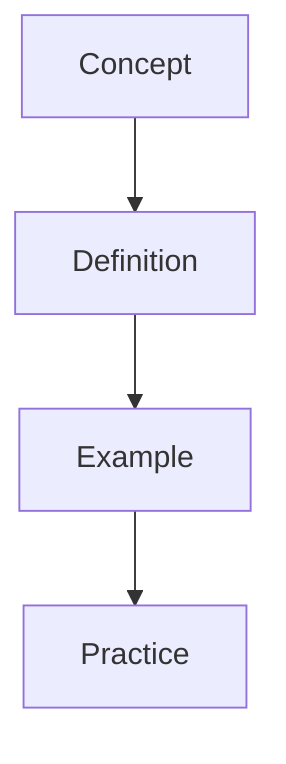

## About Wyatt's Notes — Admissions

Wyatt's Notes offers comprehensive study materials for university admissions. These notes cover application strategies, personal statements, interview preparation, and standardised test requirements, building the skills needed to navigate competitive university admissions processes.

### Why Trust These Resources?

These notes are created by **Wyatt**, an educator and content developer with expertise in university admissions across multiple countries. Content follows a structured progression from initial planning through application submission to interview preparation.

Materials emphasise the strategic thinking and authentic self-presentation that successful applicants demonstrate. Every concept includes practical examples and explains what admissions committees actually look for in competitive applications.

### What You'll Find

- **Application strategy** covering timeline planning and university selection
- **Personal statements** with structure, content, and revision guidance
- **Interview preparation** covering common questions and response frameworks
- **Standardised tests** including SAT, ACT, and subject test preparation
- **International admissions** for US, UK, and other university systems

### Credentials

Wyatt develops resources across standardised testing, qualification systems, and education, providing the comprehensive perspective that enhances admissions materials. Content is informed by university admissions guidance, application data, and successful applicant insights.

## Related Sites

- **[SAT](https://sat.wyattau.com)** — US standardised test preparation
- **[Language Tests](https://language-tests.wyattau.com)** — IELTS, TOEFL, and language proficiency resources
- **[IB](https://ib.wyattau.com)** — International Baccalaureate programme notes

## Explore the Site

Start with application strategy to build your admissions plan. Each topic progresses from planning to execution. Use the practice materials to develop your application skills through hands-on preparation.

Visit [wyattsnotes.wyattau.com](https://wyattsnotes.wyattau.com) for the full network of study resources.

## Content Coverage

This site provides comprehensive study materials covering:

- University applications
- Personal statements
- Interview preparation

Each topic includes detailed explanations, worked examples, and practice problems designed to build deep understanding.

## How to Use These Notes

1. **Start with fundamentals** — begin with the core topics before moving to advanced material
2. **Work through examples** — every concept includes worked examples with step-by-step solutions
3. **Test yourself** — use the practice problems and diagnostic tests to identify knowledge gaps
4. **Cross-reference** — related topics on other sites in the Wyatt's Notes network provide additional perspectives

## Study Resources

- **Flashcards** — spaced repetition flashcards for key concepts and formulas
- **Practice Problems** — graded problems from basic to advanced
- **Diagnostic Tests** — identify your strengths and weaknesses
- **Worked Examples** — step-by-step solutions to common problems

## Textbooks and References

These notes are informed by standard university textbooks including university guides. While the notes follow the general structure of these texts, they are not a substitute for reading the primary sources.

## Prerequisites

prospective university students

## About Wyatt's Notes

Wyatt's Notes is a network of 45+ study sites covering physics, mathematics, computer science, programming languages, and more. Each site is built with Astro and Starlight, using SolidJS for interactive components.

## Related Sites

- **[Mathematics](https://mathematics.wyattau.com)** — University-level mathematics
- **[Physics](https://physics.wyattau.com)** — University-level physics
- **[Computer Science](https://computer-science.wyattau.com)** — Algorithms, data structures, and theory
- **[Programming](https://programming.wyattau.com)** — Programming fundamentals and practice

## Contact

For questions, corrections, or suggestions, visit [wyattsnotes.wyattau.com](https://wyattsnotes.wyattau.com) or open an issue on GitHub.

## See Also

- [Admissions Tests](./)
- [Admissions](./)
- [BMO Preparation](./bmo-preparation)

## Detailed Content

This topic covers the fundamental principles and applications in depth. Each concept is explained with clear definitions, worked examples, and practice problems to reinforce understanding.

### Core Concepts

Understanding these core concepts is essential for mastering this topic. They form the foundation for more advanced study and are frequently examined.

### Worked Examples

Worked examples demonstrate how to apply the concepts to solve problems. Each example is broken down into clear steps with explanations.

### Common Mistakes

- Rushing through foundational material
- Not practising problems after reading
- Failing to connect concepts across topics

### Further Reading

Consult the recommended textbooks and additional resources for deeper understanding of this topic.

## Detailed Content

This topic covers the fundamental principles and applications in depth. Each concept is explained with clear definitions, worked examples, and practice problems to reinforce understanding.

### Core Concepts

Understanding these core concepts is essential for mastering this topic. They form the foundation for more advanced study and are frequently examined.

### Worked Examples

Worked examples demonstrate how to apply the concepts to solve problems. Each example is broken down into clear steps with explanations.

### Common Mistakes

- Rushing through foundational material
- Not practising problems after reading
- Failing to connect concepts across topics

### Further Reading

Consult the recommended textbooks and additional resources for deeper understanding of this topic.

## Detailed Content

This topic covers the fundamental principles and applications in depth. Each concept is explained with clear definitions, worked examples, and practice problems to reinforce understanding.

### Core Concepts

Understanding these core concepts is essential for mastering this topic. They form the foundation for more advanced study and are frequently examined.

### Worked Examples

Worked examples demonstrate how to apply the concepts to solve problems. Each example is broken down into clear steps with explanations.

### Common Mistakes

- Rushing through foundational material
- Not practising problems after reading
- Failing to connect concepts across topics

### Further Reading

Consult the recommended textbooks and additional resources for deeper understanding of this topic.

