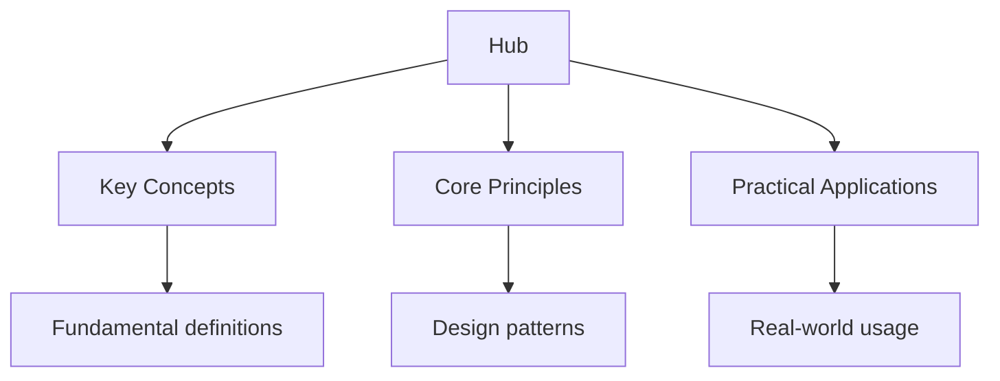

## Why This Guide Exists

University admissions is a system that rewards preparation, self-awareness, and strategic thinking. The process varies enormously between countries, institutions, and programmes — a US Common App personal statement is nothing like an Oxbridge personal statement, and neither resembles a Hong Kong JUPAS application. Yet the underlying principles are consistent: admissions committees want to understand who you are, what you have accomplished, and whether you will thrive in their institution.

This hub page maps every resource on this site. Whether you are applying to US universities through the Common App, UK universities through UCAS, or navigating the admissions systems of Hong Kong, Singapore, or other countries, the guides below give you the frameworks, templates, and strategies to present your strongest possible application.

## Table of Contents

- [Admissions Systems Overview](#admissions-systems-overview)
- [US Admissions (Common App)](#us-admissions-common-app)
- [UK Admissions (UCAS)](#uk-admissions-ucas)
- [Standardised Testing](#standardised-testing)
- [Personal Statements and Essays](#personal-statements-and-essays)
- [Interview Preparation](#interview-preparation)
- [Extracurricular Profiles](#extracurricular-profiles)
- [Recommendation Letters](#recommendation-letters)
- [Financial Aid and Scholarships](#financial-aid-and-scholarships)
- [Decision-Making](#decision-making)
- [Cross-Site Resources](#cross-site-resources)
- [FAQ](#faq)

---

## Admissions Systems Overview

The first step in any admissions journey is understanding which system you are applying through. Each system has its own timeline, requirements, and philosophy.

### US Admissions

US university admissions is holistic — no single factor determines your outcome. Admissions officers evaluate your academic record (GPA, course rigour, standardised test scores), personal essays, extracurricular activities, recommendation letters, and interviews. The process is decentralised: each university sets its own requirements and deadlines.

Key platforms:

- **Common Application** — used by over 900 universities worldwide
- **Coalition Application** — a smaller platform with a different essay prompt structure
- **Direct institutional applications** — some universities (MIT, Georgetown, etc.) use their own portals

### UK Admissions (UCAS)

UK admissions is more specialised and academically focused. You apply through UCAS (Universities and Colleges Admissions Service) and typically choose five universities. Your application centres on your predicted grades, personal statement, and academic reference. For Oxford, Cambridge, and competitive courses, you will also sit admissions tests and attend interviews.

### International Systems

- **Hong Kong (JUPAS)** — based on HKDSE results and programme choices
- **Singapore (UniAPS)** — A-Level and polytechnic pathways
- **Canada** — varies by province; Ontario uses OUAC
- **Australia** — ATAR-based with some supplementary requirements
- **Europe** — many programmes are grade-based with no essay requirement

Understanding which system governs your application determines your entire preparation timeline and strategy.

---

## US Admissions (Common App)

The Common Application is the primary platform for US university admissions. It includes several components, each of which contributes to your overall application profile.

### The Common App Personal Essay

The personal essay is your opportunity to reveal who you are beyond grades and test scores. The Common App provides seven prompts, but they all ultimately ask the same question: what matters to you, and why?

**The seven prompts:**

1. Background, identity, interest, or talent — "Some students have a background, identity, interest, or talent that is so meaningful they believe their application would be incomplete without it."
2. Lessons from a setback — "Reflect on a time when you questioned or challenged a belief or idea."
3. A time you questioned or challenged a belief
4. A problem you would like to solve
5. Personal growth — "Discuss an accomplishment, event, or realization that sparked a period of personal growth."
6. A fascination that makes you lose track of time
7. Topic of your choice

**Writing principles:**

- Start with a specific moment or image, not a general statement
- Show vulnerability — admissions officers read thousands of essays; authenticity stands out
- Use concrete details rather than abstract claims
- Let your voice come through — write as yourself, not as you think they want you to sound
- Revise extensively — the best essays go through ten or more drafts

### Supplements

Most selective universities require additional essays. Common types include:

- **"Why Us?"** — demonstrate genuine interest by referencing specific programmes, professors, or opportunities
- **"Why Major?"** — explain the intellectual journey that led you to your intended field
- **Community or identity essays** — what you would contribute to campus diversity
- **Short answers** — activities list descriptions, unusual circumstances, or additional information

### Application Timeline

| Month | Action |
| ------- | -------- |
| Summer before senior year | Draft personal essay, build activities list, research universities |
| September–October | Finalise personal essay, complete supplements, request recommendation letters |
| November | Early Decision/Early Action deadlines (typically November 1–15) |
| December | Early decisions released; continue Regular Decision essays |
| January | Regular Decision deadlines (typically January 1–15) |
| March–April | Decisions released |
| May 1 | National Decision Day — confirm your enrolment |

---

## UK Admissions (UCAS)

UCAS applications follow a different structure from US applications. The personal statement is the centrepiece, and it must demonstrate your academic motivation and preparation for your chosen course.

### UCAS Personal Statement

The UCAS personal statement has a 4,000-character limit (including spaces) and must address three questions:

1. Why do you want to study this course?
2. How has your current study been relevant?
3. What else have you done to prepare outside of education, and why are these experiences useful?

**Key differences from US essays:**

- Academic focus — UCAS values evidence of intellectual curiosity and subject engagement
- Conciseness — 4,000 characters forces precision
- Course-specific — your statement must be tailored to your chosen subject
- No creativity for creativity's sake — admissions tutors want to see genuine academic engagement

### Admissions Tests

Many UK courses require admissions tests:

- **MAT** — Mathematics at Oxford
- **PAT** — Physics at Oxford
- **TMUA** — Mathematics at various universities
- **STEP** — Mathematics at Cambridge and Warwick
- **LNAT** — Law at various universities
- **UCAT** — Medicine at various universities

These tests are often more important than predicted grades for competitive courses. Preparation should begin months in advance.

### Interviews

Oxford, Cambridge, and some other universities conduct interviews. These are academic conversations — not job interviews. The interviewer wants to see how you think, not what you already know. Expect to work through problems on a whiteboard, discuss your personal statement in depth, and engage with unfamiliar ideas.

---

## Standardised Testing

Standardised tests remain an important component of admissions, particularly for US universities.

### US Tests

- **SAT** — the primary admissions test; two sections (Math, Reading and Writing)
- **ACT** — an alternative to the SAT; includes a Science section
- **SAT Subject Tests** — discontinued by College Board, but some universities still consider AP scores
- **AP Exams** — not required for admissions, but strong scores demonstrate college-level achievement

### UK Tests

- **Admissions tests** — course-specific tests (MAT, PAT, TMUA, STEP, LNAT, UCAT)
- **No equivalent of the SAT** — UK admissions rely more heavily on A-Level predictions and school references

### Test-Optional Policies

Many US universities have adopted test-optional or test-blind policies. However, submitting strong scores still provides an advantage at most institutions. If your scores are above a university's median, submit them. If they are significantly below, consider whether other parts of your application compensate.

---

## Personal Statements and Essays

Beyond the Common App personal essay and UCAS personal statement, many applications require additional written components.

### Structuring a Personal Statement

A strong personal statement follows a clear arc:

1. **Opening hook** — a specific moment, image, or question that draws the reader in
2. **Development** — expand on the themes introduced, showing growth and reflection
3. **Evidence** — concrete examples that support your claims
4. **Connection** — link your experiences to your future goals
5. **Conclusion** — return to the opening image or idea, showing how your perspective has changed

### Common Mistakes

- **Clichés** — "I've always been passionate about..." or "The moment that changed my life was..."
- **Resume repetition** — the essay should add dimension, not repeat your activities list
- **Thesaurus abuse** — write naturally; sophisticated vocabulary should emerge from ideas, not word choice
- **Lack of self-reflection** — describing what happened is not enough; explain what it means to you
- **Generic statements** — "I want to make a difference" without explaining how or why

### Revision Process

1. Write a complete first draft without self-editing
2. Revise for content — is this the story you want to tell?
3. Revise for structure — does the essay flow logically?
4. Revise for voice — does this sound like you?
5. Read aloud — catch awkward phrasing and unnatural sentences
6. Get feedback — from teachers, counsellors, or trusted peers
7. Final polish — check for grammar, spelling, and formatting

---

## Interview Preparation

Interviews are the final component of many admissions processes. Preparation is essential.

### Types of Interviews

- **Evaluative interviews** — conducted by admissions officers or faculty; directly influence your application
- **Informational interviews** — conducted by alumni; meant to answer your questions and assess interest
- **Panel interviews** — multiple interviewers, common at UK universities
- **Multiple mini-interviews (MMIs)** — used primarily for medical and healthcare programmes

### Preparation Strategies

1. **Research the university** — know their programmes, faculty, values, and recent developments
2. **Prepare your personal statement** — be ready to discuss any aspect of it in depth
3. **Practice common questions**:
   - "Tell me about yourself"
   - "Why this university?"
   - "Why this subject?"
   - "What will you contribute to our campus?"
   - "What is your greatest weakness?"
4. **Prepare questions to ask** — thoughtful questions demonstrate genuine interest
5. **Mock interviews** — practice with teachers, parents, or peers; record yourself to review body language

### Interview Day Tips

- Arrive early (or log in 5 minutes early for virtual interviews)
- Dress neatly and professionally
- Make eye contact and offer a firm handshake (or clear audio/video for virtual)
- Listen carefully before answering
- It is acceptable to pause and think before responding
- Send a thank-you email within 24 hours

---

## Extracurricular Profiles

US admissions values depth over breadth in extracurricular activities. Admissions officers look for sustained commitment, leadership, and impact.

### Building a Strong Profile

- **Depth over breadth** — two or three activities with deep involvement outweigh ten superficial ones
- **Leadership** — take on roles that let you shape the direction of an organisation
- **Impact** — measurable outcomes matter: funds raised, people served, projects completed
- **Initiative** — starting something new is more impressive than joining something existing
- **Consistency** — sustained involvement over years matters more than a flurry of senior-year activity

### Categories That Strengthen Applications

- Academic competitions (Math Olympiad, Science Olympiad, Debate)
- Research (independent or university-affiliated)
- Community service (ongoing, not one-off events)
- Athletics (varsity or club level)
- Creative pursuits (art, music, writing, film)
- Work experience (especially if it demonstrates responsibility)

### The Activities List

The Common App activities list allows you to describe up to ten activities. For each, you should include:

- Position or leadership role
- Organisation name
- Description of your responsibilities and impact
- Hours per week and weeks per year

Write concise, specific descriptions. "Led weekly tutoring sessions for 15 underprivileged students in mathematics, resulting in an average grade improvement of one letter grade" is far more compelling than "Volunteer tutor."

---

## Recommendation Letters

Letters of recommendation provide external validation of your character, abilities, and potential.

### Who to Ask

- **Core subject teachers** (mathematics, science, English, history) who know you well
- **Counsellor** — your counsellor writes the school report and may include personal context
- **Supplemental recommenders** — coaches, employers, or mentors who can speak to different aspects of your character

### How to Ask

1. Ask early — at least one month before the deadline
2. Choose teachers who know you well, not necessarily those who gave you the highest grade
3. Provide a "brag sheet" — your activities, achievements, essays, and specific memories you hope they mention
4. Waive your right to read the letter (this makes the letter more credible to admissions officers)

### For UK Applications

UCAS requires one academic reference, typically from your school. The reference is structured and focuses on your academic performance, predicted grades, and suitability for your chosen course.

---

## Financial Aid and Scholarships

University finances should not be a barrier to attendance, but navigating the system requires planning.

### US Financial Aid

- **FAFSA** (Free Application for Federal Student Aid) — required for federal aid; opens October 1
- **CSS Profile** — required by many private universities for institutional aid
- **Merit scholarships** — awarded by universities based on academic or extracurricular achievement
- **External scholarships** — from organisations, foundations, and companies

### UK Financial Support

- **Student Finance England** — government loans for tuition and living costs
- **Maintenance grants** — for students from lower-income households
- **University scholarships** — many universities offer their own bursaries and scholarships

### International Financial Aid

Financial aid for international students varies significantly. Some US universities offer need-based aid to international students (Ivy League schools, MIT, Stanford), while others offer none. Research financial aid policies early in your process.

---

## Decision-Making

After receiving offers, you must make a final decision. This is one of the most important decisions of your life — but remember that no single university defines your future.

### Factors to Consider

- **Academic fit** — does the university offer strong programmes in your field of interest?
- **Financial fit** — can you afford the total cost after financial aid?
- **Location** — urban vs. rural, climate, distance from home
- **Campus culture** — size, social scene, housing, athletics
- **Career outcomes** — alumni network, internship opportunities, career services
- **Gut feeling** — after all the analysis, trust your instincts about where you will thrive

### The Waitlist

If you are waitlisted, you can:

1. Notify the university of your continued interest
2. Submit any new achievements or grades
3. Be patient — waitlist movement typically happens in April and May
4. Have a backup plan — commit to a university by May 1 and remain on the waitlist

---

## Cross-Site Resources

This admissions site works alongside other Wyatt's Notes sites to support your preparation:

- **[SAT Preparation](https://sat.wyattau.com/hub)** — complete SAT study guide with Math and Reading/Writing sections
- **[IB Mathematics](https://ib.wyattau.com/maths)** — IB-level mathematics at SL and HL for IB applicants
- **[Mathematics](https://mathematics.wyattau.com/hub)** — university-level mathematics for those applying to mathematics programmes
- **[Gaokao Preparation](https://gaokao.wyattau.com/hub)** — for students applying to Chinese universities through the Gaokao
- **[DSE Mathematics](https://dse.wyattau.com/maths)** — for Hong Kong students applying through JUPAS

---

## Frequently Asked Questions

### When should I start preparing for university admissions?

Begin researching universities and building your profile in Year 10 or Grade 9. Start writing essays in the summer before your final year. Do not leave essays, recommendation letter requests, or financial aid applications to the last minute — early preparation reduces stress and improves outcomes.

### How many universities should I apply to?

For US admissions, a balanced list of 8–12 universities is typical: 2–3 reach schools, 4–5 match schools, and 2–3 safety schools. For UCAS, you are limited to five choices. Quality matters more than quantity — a well-crafted application to ten universities is more effective than rushed applications to twenty.

### Should I apply Early Decision or Early Action?

Early Decision (ED) is binding — if accepted, you must attend. It can significantly improve your chances at selective universities, but you should only apply ED if you have a clear first-choice university and do not need to compare financial aid offers. Early Action (EA) is non-binding and lets you receive a decision early without commitment.

### Do extracurricular activities matter more than grades?

Both matter, but in different ways. Grades and test scores establish your academic baseline — you must meet a minimum threshold. Extracurricular activities, essays, and recommendations differentiate you from other applicants with similar academic profiles. At the most selective universities, all components matter significantly.

### How do I choose between universities?

Visit campuses if possible, attend virtual information sessions, talk to current students and alumni, and consider the specific programmes and opportunities each university offers. Ultimately, choose the university where you believe you will be happiest, most supported, and most challenged.

### What if I am rejected from my top choice?

Rejection is painful but common — even the most qualified applicants are rejected by selective universities. Remember that admissions decisions are not judgments of your worth. Many successful people attended their second or third choice. Focus on the universities that want you, and make the most of the opportunities they offer.

---

*Last updated: 24 July 2026*

*Written by Wyatt. For questions or feedback, visit [wyattau.com](https://wyattau.com).*
