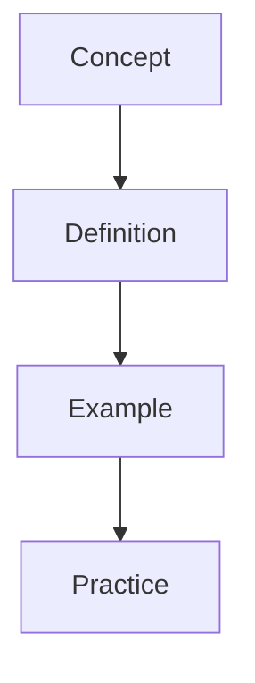

---

sources:
  - text: Standard textbook reference
title: "Biology"
description: "This section covers biology concepts, definitions, and applications with worked examples and practice problems."
date: 2026-01-01T00:00:00Z
---
sources:
  - text: Standard textbook reference

This section covers core concepts in biology, from molecular mechanisms to whole-organism physiology. Understanding these foundations is essential for tackling exam questions that require application of biological principles to unfamiliar contexts.

# Biology

**Prerequisites:** Review the prerequisite topics before attempting this section.

## Topics

- [Biodiversity Classification Evolution](/biology/biodiversity-classification-evolution/)
- [Biological Molecules](/biology/biological-molecules/)
- [Biotechnology](/biology/biotechnology/)
- [Cells](/biology/cells/)
- [Ecology](/biology/ecology/)
- [Exchange And Transport](/biology/exchange-and-transport/)
- [Flashcards Cell Biology](/biology/flashcards-cell-biology/)
- [Genetics Advanced](/biology/genetics-advanced/)
- [Genetics And Dna](/biology/genetics-and-dna/)
- [Homeostasis](/biology/homeostasis/)
- [Immunology](/biology/immunology/)
- [Nervous System](/biology/nervous-system/)
- [Photosynthesis Depth](/biology/photosynthesis-depth/)
- [Practice Biological Molecules](/biology/practice-biological-molecules/)
- [Practice Cell Biology](/biology/practice-cell-biology/)
- [Respiration Depth](/biology/respiration-depth/)

## Overview

This section provides comprehensive study materials and resources. Content is organised to build understanding progressively, from foundational concepts to advanced applications.

## Key Topics

- Core concepts and definitions
- Worked examples with step-by-step solutions
- Practice problems for self-assessment
- Cross-references to related topics

## Study Tips

Begin with the introductory material before progressing to advanced topics. Use the practice problems to test your understanding and identify areas for further study.

## Overview

This section provides comprehensive study materials and resources. Content is organised to build understanding progressively, from foundational concepts to advanced applications.

## Key Topics

- Core concepts and definitions
- Worked examples with step-by-step solutions
- Practice problems for self-assessment
- Cross-references to related topics

## Study Tips

Begin with the introductory material before progressing to advanced topics. Use the practice problems to test your understanding and identify areas for further study.

Keep practising and reviewing to master this topic.

