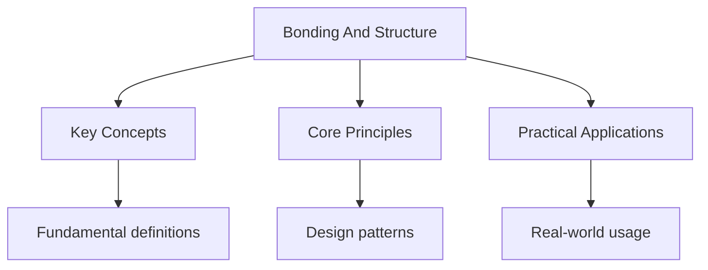

---

title: "Bonding & Structure | A-Level - Wyatt's Notes"
description: "Chemical bonding is the consequence of electrostatic interactions between nuclei and electrons that result in a lower-energy arrangement than the separated"
date: 2026-04-21T00:00:00.000Z
tags:
  - Chemistry
  - ALevel
categories:
  - Chemistry

---

<!-- Breadcrumb Schema for SEO -->

## Bonding & Structure

Chemical bonding is the consequence of electrostatic interactions between nuclei and electrons that
result in a lower-energy arrangement than the separated atoms. This module classifies bonds by the
mechanism of electron redistribution and examines the resulting structures and their physical
properties.

## Ionic Bonding

### Formation

Ionic bonds form between atoms with significantly different electronegativities (
$\Delta\chi \gt 1.7$). A metal atom transfers one or more electrons to a non-metal atom, producing a
cation and anion held together by **electrostatic attraction**. The process is:

$$
\mathrm{M}(s) \to \mathrm{M}^+(g) + e^- \quad (\mathrm{ionisation})
$$

$$
\tfrac{1}{2}\mathrm{X}_2(g) + e^- \to \mathrm{X}^-(g) \quad (\mathrm{electron affinity})
$$

$$
\mathrm{M}^+(g) + \mathrm{X}^-(g) \to \mathrm{MX}(s) \quad (\mathrm{lattice formation})
$$

### Structure of Ionic Compounds

Ionic compounds form **giant ionic lattices** -- extended three-dimensional arrays of alternating
cations and anions. The structure is determined by the relative sizes of the ions (radius ratio
rule):

| Radius ratio $r^+/r^-$ | Coordination number | Geometry    | Example         |
| ---------------------- | ------------------- | ----------- | --------------- |
| 0.225 -- 0.414         | 4                   | Tetrahedral | $\mathrm{ZnS}$  |
| 0.414 -- 0.732         | 6                   | Octahedral  | $\mathrm{NaCl}$ |
| 0.732 -- 1.000         | 8                   | Cubic       | $\mathrm{CsCl}$ |

### Properties of Ionic Compounds

- **High melting and boiling points** -- strong electrostatic forces throughout the lattice require
  substantial energy to overcome.
- **Brittle** -- displacement of one plane of ions relative to another brings like charges into
  alignment, causing repulsion and fracture.
- **Electrical conductors when molten or dissolved** -- ions are mobile and can carry charge; in the
  solid state, ions are fixed.
- **Soluble in polar solvents** -- polar solvent molecules can solvate individual ions, compensating
  for the lattice energy.

### Lattice Enthalpy and Born-Haber Cycles

The **lattice enthalpy** $\Delta H_\mathrm{lat}$ is the enthalpy change when one mole of an ionic
compound is formed from its gaseous ions under standard conditions. It is always exothermic
(negative).

Born-Haber cycles apply Hess"s Law to determine lattice enthalpies indirectly, since they cannot be
measured directly. The cycle for $\mathrm{NaCl}$ is:

$$
\begin{aligned}
\mathrm{Na}(s) &\xrightarrow{\Delta H_\mathrm{atom}} \mathrm{Na}(g) \\
&\xrightarrow{\mathrm{IE}_1} \mathrm{Na}^+(g) \\
\tfrac{1}{2}\mathrm{Cl}_2(g) &\xrightarrow{\tfrac{1}{2}\Delta H_\mathrm{atom}} \mathrm{Cl}(g) \\
&\xrightarrow{\mathrm{EA}_1} \mathrm{Cl}^-(g) \\
\mathrm{Na}^+(g) + \mathrm{Cl}^-(g) &\xrightarrow{\Delta H_\mathrm{lat}} \mathrm{NaCl}(s)
\end{aligned}
$$

By Hess's Law:

$$
\Delta H_f^\circ = \Delta H_\mathrm{atom}(\mathrm{Na}) + \tfrac{1}{2}\Delta H_\mathrm{atom}(\mathrm{Cl}_2) + \mathrm{IE}_1(\mathrm{Na}) + \mathrm{EA}_1(\mathrm{Cl}) + \Delta H_\mathrm{lat}
$$

Rearranging:

$$
\Delta H_\mathrm{lat} = \Delta H_f^\circ - \Delta H_\mathrm{atom}(\mathrm{Na}) - \tfrac{1}{2}\Delta H_\mathrm{atom}(\mathrm{Cl}_2) - \mathrm{IE}_1(\mathrm{Na}) - \mathrm{EA}_1(\mathrm{Cl})
$$

**Worked Example.** Calculate the lattice enthalpy of NaCl given:

- $\Delta H_f^\circ(\mathrm{NaCl}) = -411\,\mathrm{kJ/mol}$
- $\Delta H_\mathrm{atom}(\mathrm{Na}) = +108\,\mathrm{kJ/mol}$
- $\Delta H_\mathrm{atom}(\mathrm{Cl}_2) = +122\,\mathrm{kJ/mol}$
- $\mathrm{IE}_1(\mathrm{Na}) = +496\,\mathrm{kJ/mol}$
- $\mathrm{EA}_1(\mathrm{Cl}) = -349\,\mathrm{kJ/mol}$

$$
\Delta H_\mathrm{lat} = -411 - 108 - 61 - 496 - (-349) = -411 - 108 - 61 - 496 + 349 = -727\,\mathrm{kJ/mol}
$$

See [Thermodynamics](./thermodynamics) for a more detailed treatment of Born-Haber cycles.

## Covalent Bonding

### Formation

Covalent bonds form when atoms share one or more pairs of electrons, achieving a lower energy than
the separated atoms. The shared pair is attracted to both nuclei simultaneously, forming an electron
density maximum between the bonded atoms.

### Sigma ($\sigma$) and Pi ($\pi$) Bonds

A **sigma bond** is formed by end-on (head-on) overlap of atomic orbitals along the internuclear
axis. Sigma bonds can arise from $s$-$s$, $s$-$p$Or $p$-$p$ overlap. All single bonds are sigma
bonds.

A **pi bond** is formed by sideways overlap of parallel $p$ orbitals above and below the
internuclear axis. Pi bonds are weaker than sigma bonds because the sideways overlap is less
effective.

A double bond consists of one sigma and one pi bond ($1\sigma + 1\pi$). A triple bond consists of
one sigma and two pi bonds ($1\sigma + 2\pi$).

$$
\begin{aligned}
\mathrm{C}\equiv\mathrm{C}: &\quad 1\sigma + 2\pi \\
\mathrm{C}=\mathrm{C}: &\quad 1\sigma + 1\pi \\
\mathrm{C}-\mathrm{C}: &\quad 1\sigma
\end{aligned}
$$

### Bond Polarity and Electronegativity

**Electronegativity** ($\chi$) is the power of an atom to attract electron density towards itself in
a covalent bond. The Pauling scale is most commonly used:

| Element | $\chi$ (Pauling) |
| ------- | ---------------- |
| F       | 3.98             |
| O       | 3.44             |
| N       | 3.04             |
| Cl      | 3.16             |
| C       | 2.55             |
| H       | 2.20             |
| Na      | 0.93             |
| K       | 0.82             |

When two atoms of different electronegativity form a covalent bond, the electron pair is unequally
shared, creating a **polar bond** with a **bond dipole**. The dipole moment $\mu$ is:

$$
\mu = q \cdot d
$$

Where $q$ is the partial charge and $d$ is the separation distance. Dipole moments are measured in
Debye ($1\,\mathrm{D} = 3.336 \times 10^{-30}\,\mathrm{C\,m}$).

### Coordinate (Dative Covalent) Bonds

A coordinate bond is a covalent bond in which both electrons in the shared pair come from the same
atom. Once formed, a coordinate bond is indistinguishable from any other covalent bond.

Example: formation of the ammonium ion:

$$
\mathrm{NH}_3 + \mathrm{H}^+ \to \mathrm{NH}_4^+
$$

The lone pair on nitrogen forms a coordinate bond with the proton. All four N-H bonds in
$\mathrm{NH}_4^+$ are equivalent (resonance/rapid exchange).

## Metallic Bonding

### The Sea of Delocalised Electrons

In a metal, the valence electrons are not associated with individual atoms but are **delocalised**
over the entire lattice of positive metal ions. The metallic bond is the electrostatic attraction
between the cation lattice and the delocalised electron "sea".

### Properties of Metals

- **High melting and boiling points** -- strong electrostatic attraction throughout the lattice. The
  strength varies with charge density of the cation.
- **Electrical conductivity** -- delocalised electrons are mobile and carry charge.
- **Malleability and ductility** -- when force is applied, cation layers slide past each other; the
  delocalised electrons adjust, maintaining bonding in the new positions. Unlike ionic solids, no
  like-charge repulsion occurs.
- **Thermal conductivity** -- delocalised electrons transfer kinetic energy efficiently.
- **Lustre** -- delocalised electrons absorb and re-emit light at all visible wavelengths.

## Intermolecular Forces

Intermolecular forces (IMFs) are the attractive forces **between** molecules. They are much weaker
than intramolecular bonds (covalent, ionic, metallic) but govern physical properties such as boiling
point, solubility, and viscosity.

### Van der Waals Forces (London Dispersion Forces)

London dispersion forces arise from instantaneous, temporary dipoles caused by fluctuations in the
electron cloud. These temporary dipoles induce dipoles in neighbouring molecules, creating a net
attractive force.

- **All molecules** experience London forces.
- The strength depends on the number of electrons (molecular mass), molecular shape (surface area of
  contact), and polarisability.
- Larger electron clouds are more polarisable, producing stronger London forces.

Trend in boiling points of the halogens:

$$
\mathrm{F}_2\,(-188^\circ\mathrm{C}) \lt \mathrm{Cl}_2\,(-34^\circ\mathrm{C}) \lt \mathrm{Br}_2\,(59^\circ\mathrm{C}) \lt \mathrm{I}_2\,(184^\circ\mathrm{C})
$$

### Dipole-Dipole Forces

Polar molecules have permanent dipoles. The positive end of one molecule attracts the negative end
of another, creating an alignment that produces an attractive force.

Dipole-dipole forces are stronger than London forces for molecules of similar mass but weaker than
hydrogen bonds.

### Hydrogen Bonding

Hydrogen bonding is a special, strong type of dipole-dipole interaction that occurs when hydrogen is
covalently bonded to a highly electronegative atom ($\mathrm{N}$, $\mathrm{O}$Or $\mathrm{F}$). The
conditions are:

1. Hydrogen bonded to $\mathrm{N}$, $\mathrm{O}$Or $\mathrm{F}$.
2. The hydrogen has a large partial positive charge ($\delta^+$).
3. A lone pair on a nearby $\mathrm{N}$, $\mathrm{O}$Or $\mathrm{F}$ atom interacts with the
   $\delta^+$ hydrogen.

Hydrogen bonds are approximately 10-40 kJ/mol, compared with 2-5 kJ/mol for typical dipole-dipole
interactions and 0.05-2 kJ/mol for London forces.

**Consequences of hydrogen bonding:**

- Water has an anomalously high boiling point ($100^\circ\mathrm{C}$) compared with
  $\mathrm{H}_2\mathrm{S}$ ($-60^\circ\mathrm{C}$), despite $\mathrm{H}_2\mathrm{S}$ having greater
  molecular mass.
- Ice is less dense than liquid water -- hydrogen bonds in the solid hold molecules in an open,
  hexagonal lattice.
- DNA's double helix is stabilised by hydrogen bonding between complementary base pairs.

## Shapes of Molecules (VSEPR Theory)

The **Valence Shell Electron Pair Repulsion** (VSEPR) theory predicts molecular geometry by
minimising the repulsion between electron pairs (both bonding and lone pairs) in the valence shell.

### Electron Pair Repulsion Order

Lone pair-lone pair repulsion $\gt$ lone pair-bonding pair repulsion $\gt$ bonding pair-bonding pair
repulsion.

This hierarchy arises because lone pairs are confined to one atom and thus occupy more space around
that atom than bonding pairs, which are shared between two atoms.

### Molecular Geometries

| Electron domains | Bonding pairs | Lone pairs | Geometry             | Bond angle                      | Example                                  |
| ---------------- | ------------- | ---------- | -------------------- | ------------------------------- | ---------------------------------------- |
| 2                | 2             | 0          | Linear               | $180^\circ$                     | $\mathrm{BeCl}_2$, $\mathrm{CO}_2$       |
| 3                | 3             | 0          | Trigonal planar      | $120^\circ$                     | $\mathrm{BF}_3$, $\mathrm{NO}_3^-$       |
| 3                | 2             | 1          | Bent (angular)       | $\lt 120^\circ$                 | $\mathrm{SO}_2$ ($\approx 119^\circ$)    |
| 4                | 4             | 0          | Tetrahedral          | $109.5^\circ$                   | $\mathrm{CH}_4$, $\mathrm{NH}_4^+$       |
| 4                | 3             | 1          | Trigonal pyramidal   | $\lt 109.5^\circ$               | $\mathrm{NH}_3$ ($107^\circ$)            |
| 4                | 2             | 2          | Bent (angular)       | $\lt 109.5^\circ$               | $\mathrm{H}_2\mathrm{O}$ ($104.5^\circ$) |
| 5                | 5             | 0          | Trigonal bipyramidal | $120^\circ$, $90^\circ$         | $\mathrm{PCl}_5$                         |
| 5                | 4             | 1          | See-saw              | $\lt 90^\circ$, $\lt 120^\circ$ | $\mathrm{SF}_4$                          |
| 5                | 3             | 2          | T-shaped             | $\lt 90^\circ$                  | $\mathrm{ClF}_3$                         |
| 5                | 2             | 3          | Linear               | $180^\circ$                     | $\mathrm{XeF}_2$                         |
| 6                | 6             | 0          | Octahedral           | $90^\circ$                      | $\mathrm{SF}_6$                          |
| 6                | 5             | 1          | Square pyramidal     | $\lt 90^\circ$                  | $\mathrm{BrF}_5$                         |
| 6                | 4             | 2          | Square planar        | $90^\circ$                      | $\mathrm{XeF}_4$                         |

### Why $\mathrm{NH}_3$ is $107^\circ$ and $\mathrm{H}_2\mathrm{O}$ is $104.5^\circ$

Both have four electron domains (tetrahedral electron pair geometry). In $\mathrm{NH}_3$One lone
pair compresses the H-N-H angle from $109.5^\circ$ to $107^\circ$. In $\mathrm{H}_2\mathrm{O}$Two
lone pairs exert greater compression, reducing the H-O-H angle further to $104.5^\circ$.

## Giant Covalent Structures

### Diamond

Each carbon atom is $sp^3$ hybridised and covalently bonded to four other carbon atoms in a
tetrahedral arrangement. This extends in three dimensions throughout the crystal.

- Extremely high melting point ($> 3500^\circ\mathrm{C}$) -- all bonds are strong covalent bonds
  that must be broken.
- Insulator -- no free electrons or ions; all valence electrons are localised in sigma bonds.
- Extremely hard -- the tetrahedral network resists deformation in all directions.
- Insoluble in all solvents.

### Graphite

Each carbon atom is $sp^2$ hybridised and bonded to three other carbons in a trigonal planar
arrangement, forming hexagonal layers. The remaining $p_z$ electron is delocalised above and below
each layer.

- High melting point -- strong covalent bonds within layers.
- Soft and slippery -- layers are held together by weak London forces, allowing them to slide.
- Electrical conductor along the plane -- delocalised electrons can move within the layers.
- Insoluble.

### Silicon Dioxide ($\mathrm{SiO}_2$)

Each silicon atom is covalently bonded to four oxygen atoms, and each oxygen atom bridges two
silicon atoms ($\mathrm{SiO}_4$ tetrahedra sharing corners). This extends in three dimensions,
analogous to diamond but with two different atom types.

- Very high melting point ($\approx 1700^\circ\mathrm{C}$).
- Hard, insoluble, electrical insulator.

## Common Pitfalls

1. **Confusing bond strength with intermolecular force strength.** A common error is to attribute
   high boiling points of water to "strong O-H bonds". The O-H covalent bonds are not broken during
   boiling; the hydrogen bonds between molecules are.

2. **Applying VSEPR incorrectly to molecules with multiple bonds.** Each double or triple bond
   counts as a single electron domain. $\mathrm{CO}_2$ has two electron domains (each double bond),
   giving linear geometry, not four domains.

3. **Stating that ionic compounds "share electrons".** Ionic bonding involves complete electron
   transfer, not sharing. Coordinate bonds (a type of covalent bond) do involve sharing from a
   single donor.

4. **Ignoring lone pairs in VSEPR.** A molecule described as "tetrahedral" with two lone pairs is
   bent, not tetrahedral. "Tetrahedral" refers to the electron pair geometry; the molecular geometry
   must account for lone pairs.

5. **Incorrect radius ratio application.** The radius ratio rule is a guideline, not a strict
   predictor. Many compounds adopt structures outside the predicted range due to covalent character,
   polarisation effects, or entropy considerations.

## Worked Examples

Example 1: Predicting shape and polarity of $\mathrm{SF}_4$

Sulphur in $\mathrm{SF}_4$ has 6 valence electrons. Four are used in S-F bonds, leaving one lone
pair. Total electron domains = 5 (4 bonding + 1 lone pair).

Geometry: **see-saw**. The lone pair occupies an equatorial position to minimise repulsion (two
$90^\circ$ interactions vs two $90^\circ$ interactions for axial; equatorial is preferred as it
avoids three $90^\circ$ interactions).

The molecule is polar because the bond dipoles do not cancel -- the axial and equatorial fluorines
are not symmetrically arranged.

Example 2: Born-Haber cycle for $\mathrm{MgCl}_2$

Given:

- $\Delta H_f^\circ(\mathrm{MgCl}_2) = -641\,\mathrm{kJ/mol}$
- $\Delta H_\mathrm{atom}(\mathrm{Mg}) = +148\,\mathrm{kJ/mol}$
- $\Delta H_\mathrm{atom}(\mathrm{Cl}_2) = +122\,\mathrm{kJ/mol}$
- $\mathrm{IE}_1(\mathrm{Mg}) = +738\,\mathrm{kJ/mol}$
- $\mathrm{IE}_2(\mathrm{Mg}) = +1451\,\mathrm{kJ/mol}$
- $\mathrm{EA}_1(\mathrm{Cl}) = -349\,\mathrm{kJ/mol}$

$$
\Delta H_\mathrm{lat} = \Delta H_f^\circ - \Delta H_\mathrm{atom}(\mathrm{Mg}) - \Delta H_\mathrm{atom}(\mathrm{Cl}_2) - \mathrm{IE}_1 - \mathrm{IE}_2 - 2\mathrm{EA}_1
$$

$$
\Delta H_\mathrm{lat} = -641 - 148 - 122 - 738 - 1451 - 2(-349)
$$

$$
\Delta H_\mathrm{lat} = -641 - 148 - 122 - 738 - 1451 + 698 = -2402\,\mathrm{kJ/mol}
$$

Example 3: Explaining boiling point trends

Arrange in order of increasing boiling point:
$\mathrm{CH}_4$$\mathrm{CH}_3\mathrm{Cl}$$\mathrm{CH}_3\mathrm{OH}$$\mathrm{CH}_3\mathrm{NH}_2$.

$\mathrm{CH}_4 \lt \mathrm{CH}_3\mathrm{Cl} \lt \mathrm{CH}_3\mathrm{NH}_2 \lt \mathrm{CH}_3\mathrm{OH}$

- $\mathrm{CH}_4$: only London forces (smallest, fewest electrons).
- $\mathrm{CH}_3\mathrm{Cl}$: London forces (more electrons) plus permanent dipole-dipole.
- $\mathrm{CH}_3\mathrm{NH}_2$: London forces plus hydrogen bonding (N-H).
- $\mathrm{CH}_3\mathrm{OH}$: London forces plus hydrogen bonding (O-H), which is stronger than N-H
  hydrogen bonding because oxygen is more electronegative than nitrogen.

Example 4: Determining polarity of complex molecules

Is $\mathrm{BF}_3$ polar or non-polar?

Boron trifluoride has trigonal planar geometry ($\mathrm{sp}^2$ hybridisation, 3 bonding pairs, 0
lone pairs). The three B-F bond dipoles are arranged at $120^\circ$ to each other. The vector sum of
the three bond dipoles is zero (by symmetry), so $\mathrm{BF}_3$ is **non-polar** despite having
polar bonds.

Contrast with $\mathrm{PF}_3$: phosphorus has 5 valence electrons. Three are used in P-F bonds,
leaving one lone pair. Total electron domains = 4, giving trigonal pyramidal geometry (similar to
$\mathrm{NH}_3$). The bond dipoles do not cancel, so $\mathrm{PF}_3$ is **polar**.

Example 5: Comparing bond strengths

Explain why the $\mathrm{C}\equiv\mathrm{N}$ triple bond ($891\,\mathrm{kJ/mol}$) is stronger than
the $\mathrm{C}=\mathrm{O}$ double bond ($745\,\mathrm{kJ/mol}$), which is stronger than the
$\mathrm{C}-\mathrm{O}$ single bond ($358\,\mathrm{kJ/mol}$).

The bond strength increases with bond order because:

1. More shared electron pairs between the nuclei means greater electrostatic attraction holding the
   atoms together.
2. The additional bonds (pi bonds) have shorter bond lengths, placing the nuclei closer together
   where the Coulombic attraction is stronger.
3. Breaking a triple bond requires breaking three bonding interactions, whereas a single bond
   requires breaking only one.

Bond lengths: $\mathrm{C}-\mathrm{O}$ ($143\,\mathrm{pm}$) $>$ $\mathrm{C}=\mathrm{O}$
($123\,\mathrm{pm}$) $>$ $\mathrm{C}\equiv\mathrm{N}$ ($116\,\mathrm{pm}$). Shorter bonds are
generally stronger.

## Electronegativity and Bond Polarity in Detail

### The Pauling Scale

Electronegativity ($\chi$) is the ability of an atom to attract the bonding electrons in a covalent
bond. Pauling electronegativity values:

| Element | $\chi$ |
| ------- | ------ |
| F       | 3.98   |
| O       | 3.44   |
| N       | 3.04   |
| Cl      | 3.16   |
| C       | 2.55   |
| S       | 2.58   |
| H       | 2.20   |
| P       | 2.19   |
| Na      | 0.93   |
| K       | 0.82   |

### Predicting Bond Type from Electronegativity Difference

$$
\Delta\chi = |\chi_A - \chi_B|
$$

| $\Delta\chi$ | Bond type          | Character                  |
| ------------ | ------------------ | -------------------------- |
| 0--0.4       | Non-polar covalent | Electrons shared equally   |
| 0.4--1.7     | Polar covalent     | Electrons shared unequally |
| $>$1.7       | Ionic              | Electron transfer          |

### Dipole Moments

A dipole moment $\mu$ is a measure of the separation of charge in a polar bond:

$$
\mu = q \times d
$$

Where $q$ is the magnitude of the partial charge and $d$ is the distance between the charges. Dipole
moments are measured in Debye (D). For comparison:
$\mu(\mathrm{HCl}) = 1.08\,\mathrm{D}$$\mu(\mathrm{HF}) = 1.82\,\mathrm{D}$$\mu(\mathrm{H}_2\mathrm{O}) = 1.85\,\mathrm{D}$.

A molecule has a net dipole moment only if the individual bond dipoles do not cancel by symmetry.
This is why $\mathrm{CO}_2$ (linear, two equal and opposite dipoles) is non-polar but
$\mathrm{H}_2\mathrm{O}$ (bent, dipoles do not cancel) is polar.

### Intermolecular Forces in Detail

#### London Forces (Instantaneous Dipole-Induced Dipole)

London forces exist between all molecules and atoms. They arise from instantaneous fluctuations in
the electron cloud that create temporary dipoles, which induce dipoles in neighbouring molecules.

Factors affecting London force strength:

1. **Number of electrons:** More electrons = larger electron cloud = larger instantaneous dipoles =
   stronger London forces.
2. **Shape:** Greater surface area of contact between molecules = stronger London forces. Linear
   molecules (e.g. $n$-pentane, bp $36^\circ\mathrm{C}$) have stronger London forces than branched
   isomers (e.g. 2,2-dimethylpropane, bp $10^\circ\mathrm{C}$) because linear molecules can pack
   more closely.
3. **Polarisability:** Larger atoms/molecules have more diffuse electron clouds that are more
   distorted (more polarisable), leading to stronger London forces. $\mathrm{I}_2$ has stronger
   London forces than $\mathrm{Cl}_2$.

#### Permanent Dipole-Dipole Forces

Exist between polar molecules. The partial positive end of one molecule is attracted to the partial
negative end of another. These are stronger than London forces between molecules of similar size.

#### Hydrogen Bonding

A special, strong type of dipole-dipole interaction that occurs when hydrogen is covalently bonded
to a highly electronegative atom (N, O, or F). The hydrogen carries a large partial positive charge
and is small enough to approach closely to the lone pair on N, O, or F of a neighbouring molecule.

Requirements for hydrogen bonding:

1. H bonded to N, O, or F.
2. A lone pair on N, O, or F on the neighbouring molecule.

Hydrogen bonds are $5$--$40\,\mathrm{kJ/mol}$Compared with $0.1$--$5\,\mathrm{kJ/mol}$ for
dipole-dipole and London forces.

**Effects of hydrogen bonding:**

- Abnormally high boiling points (e.g. $\mathrm{H}_2\mathrm{O}$ boils at $100^\circ\mathrm{C}$;
  $\mathrm{H}_2\mathrm{S}$ boils at $-60^\circ\mathrm{C}$ despite being heavier).
- Lower density of ice than water (hydrogen bonds hold water molecules in an open hexagonal
  lattice).
- The solubility of organic molecules in water (molecules that can hydrogen bond with water, such as
  alcohols and sugars, are more soluble).
- Secondary structure of proteins (hydrogen bonds between amino acid residues form alpha helices and
  beta sheets).

### Solubility and Intermolecular Forces

"Like dissolves like" is a consequence of intermolecular forces:

- Polar solvents (water) dissolve polar and ionic solutes (ion-dipole interactions).
- Non-polar solvents (hexane) dissolve non-polar solutes (London forces).
- Substances that can hydrogen bond with water (small alcohols, sugars, ammonia) are water-soluble.

**Worked Example.** Explain why $\mathrm{C}_6\mathrm{H}_5\mathrm{OH}$ is partially soluble in water
while $\mathrm{C}_6\mathrm{H}_5\mathrm{CH}_3$ is insoluble.

Phenol ($\mathrm{C}_6\mathrm{H}_5\mathrm{OH}$) can form hydrogen bonds with water through its
$-\mathrm{OH}$ group, providing a favourable interaction that partially overcomes the hydrophobic
effect of the benzene ring. Toluene ($\mathrm{C}_6\mathrm{H}_5\mathrm{CH}_3$) cannot form hydrogen
bonds with water; its only intermolecular interactions with water are weak London forces, which
cannot compensate for the strong water-water hydrogen bonds that must be broken.

## Giant Ionic Structures

Ionic compounds form giant ionic lattices in which cations and anions are arranged in a regular
repeating pattern, held together by strong electrostatic attraction in all directions.

### Properties of Ionic Compounds

- **High melting and boiling points** -- due to the strength of ionic bonds throughout the lattice.
  For example, $\mathrm{NaCl}$ melts at $801^\circ\mathrm{C}$.
- **Brittle** -- when a force is applied, layers of ions shift, bringing like charges into contact.
  The resulting repulsion causes the crystal to shatter.
- **Electrical conductivity** -- conduct electricity when molten or dissolved (ions are free to
  move), but not when solid (ions are fixed in the lattice).
- **Solubility in polar solvents** -- polar solvents (water) solvate the ions, overcoming the
  lattice enthalpy. Insoluble in non-polar solvents.

### Lattice Structures

| Structure         | Coordination number | Example                       | Description                                             |
| ----------------- | ------------------- | ----------------------------- | ------------------------------------------------------- |
| NaCl (rock salt)  | 6:6                 | $\mathrm{NaCl}$$\mathrm{MgO}$ | Octahedral coordination; face-centred cubic arrangement |
| CsCl              | 8:8                 | $\mathrm{CsCl}$               | Cubic coordination; body-centred arrangement            |
| ZnS (zinc blende) | 4:4                 | $\mathrm{ZnS}$                | Tetrahedral coordination                                |

## Giant Metallic Structures

Metals consist of a regular lattice of positive metal ions surrounded by a sea of delocalised
electrons. The metallic bond is the electrostatic attraction between the metal cations and the
delocalised electrons.

### Properties of Metals Explained

| Property                        | Explanation                                                                                                                                      |
| ------------------------------- | ------------------------------------------------------------------------------------------------------------------------------------------------ |
| Electrical conductivity         | Delocalised electrons are free to move under an applied potential difference                                                                     |
| Thermal conductivity            | Delocalised electrons transfer kinetic energy through the lattice                                                                                |
| Malleability and ductility      | Layers of cations can slide over each other without breaking the metallic bond (the electron sea adjusts)                                        |
| High melting points (generally) | Strength of metallic bonding depends on charge density of cations and number of delocalised electrons                                            |
| Variable melting points         | $\mathrm{Na}$ (mp $98^\circ\mathrm{C}$1 delocalised electron per ion) vs $\mathrm{Al}$ (mp $661^\circ\mathrm{C}$3 delocalised electrons per ion) |

## Giant Covalent Structures

### Diamond

Each carbon atom is covalently bonded to four others in a tetrahedral arrangement. This creates a
rigid, three-dimensional network with very strong covalent bonds throughout.

- Extremely hard (hardest natural substance)
- Very high melting point ($> 3500^\circ\mathrm{C}$)
- Insulator (no delocalised electrons)
- Insoluble in all solvents

### Graphite

Each carbon atom is bonded to three others in a layered hexagonal structure. The fourth electron per
carbon is delocalised above and below the layers.

- Soft and slippery (layers can slide over each other)
- High melting point (strong covalent bonds within layers)
- Electrical conductor parallel to layers (delocalised electrons)
- Insoluble in all solvents

### Silicon(IV) Oxide ($\mathrm{SiO}_2$)

Each silicon atom is covalently bonded to four oxygen atoms, and each oxygen is bonded to two
silicon atoms, forming a giant covalent structure similar to diamond.

- Very high melting point ($\approx 1700^\circ\mathrm{C}$)
- Hard and insoluble
- Electrical insulator

### Comparison of Giant Structures

| Property                         | Ionic   | Metallic              | Giant covalent         |
| -------------------------------- | ------- | --------------------- | ---------------------- |
| Melting point                    | High    | Variable (often high) | Very high              |
| Electrical conductivity (solid)  | No      | Yes                   | No (except graphite)   |
| Electrical conductivity (molten) | Yes     | N/A                   | N/A                    |
| Solubility in water              | soluble | Insoluble             | Insoluble              |
| Hardness                         | Brittle | Malleable             | Hard (except graphite) |

## VSEPR Theory: Comprehensive Examples

### Common Molecular Geometries

| Electron pairs | Bonding pairs | Lone pairs | Geometry             | Bond angle            | Example                                  |
| -------------- | ------------- | ---------- | -------------------- | --------------------- | ---------------------------------------- |
| 2              | 2             | 0          | Linear               | $180^\circ$           | $\mathrm{BeCl}_2$$\mathrm{CO}_2$         |
| 3              | 3             | 0          | Trigonal planar      | $120^\circ$           | $\mathrm{BF}_3$$\mathrm{NO}_3^-$         |
| 3              | 2             | 1          | Bent/V-shaped        | $<120^\circ$          | $\mathrm{SO}_2$$\mathrm{SnCl}_2$         |
| 4              | 4             | 0          | Tetrahedral          | $109.5^\circ$         | $\mathrm{CH}_4$$\mathrm{NH}_4^+$         |
| 4              | 3             | 1          | Trigonal pyramidal   | $<109.5^\circ$        | $\mathrm{NH}_3$ ($107^\circ$)            |
| 4              | 2             | 2          | Bent/V-shaped        | $<109.5^\circ$        | $\mathrm{H}_2\mathrm{O}$ ($104.5^\circ$) |
| 5              | 5             | 0          | Trigonal bipyramidal | $90^\circ$$120^\circ$ | $\mathrm{PCl}_5$                         |
| 5              | 4             | 1          | Seesaw               | --                    | $\mathrm{SF}_4$                          |
| 5              | 3             | 2          | T-shaped             | $90^\circ$            | $\mathrm{ClF}_3$                         |
| 5              | 2             | 3          | Linear               | $180^\circ$           | $\mathrm{XeF}_2$$\mathrm{I}_3^-$         |
| 6              | 6             | 0          | Octahedral           | $90^\circ$            | $\mathrm{SF}_6$                          |
| 6              | 5             | 1          | Square pyramidal     | $<90^\circ$           | $\mathrm{BrF}_5$                         |
| 6              | 4             | 2          | Square planar        | $90^\circ$            | $\mathrm{XeF}_4$                         |

### Effect of Lone Pairs on Bond Angle

Lone pairs occupy more space than bonding pairs because they are held by only one nucleus and spread
out more. This compresses the bond angles:

- $\mathrm{NH}_3$: ideal tetrahedral $109.5^\circ$Actual $107^\circ$ (one lone pair compresses)
- $\mathrm{H}_2\mathrm{O}$: ideal tetrahedral $109.5^\circ$Actual $104.5^\circ$ (two lone pairs
  compress more)
- $\mathrm{CH}_4$: exactly $109.5^\circ$ (no lone pairs)

## Additional Practice Problems

Problem 3

Predict the shape and bond angle of $\mathrm{ClF}_3$ and explain your reasoning.

**Solution:**

Chlorine has 7 valence electrons, and each fluorine contributes 1, giving a total of $7 + 3(1) = 10$
valence electrons, or 5 electron pairs (3 bonding pairs + 2 lone pairs). This corresponds to a
trigonal bipyramidal electron pair geometry.

The lone pairs occupy equatorial positions (minimising repulsion by being at $120^\circ$ to three
other pairs rather than $90^\circ$). The three fluorine atoms occupy the remaining equatorial and
two axial positions, giving a **T-shaped** molecular geometry.

Bond angles: The axial F--Cl--equatorial F angle is $90^\circ$. The equatorial F--Cl--equatorial F
angle is less than $120^\circ$ due to lone pair repulsion.

Problem 4

Explain why $\mathrm{SiO}_2$ has a very high melting point ($\approx 1700^\circ\mathrm{C}$) while
$\mathrm{CO}_2$ sublimes at $-78^\circ\mathrm{C}$Despite both containing group 4 elements bonded to
oxygen.

**Solution:**

$\mathrm{SiO}_2$ forms a giant covalent (macromolecular) structure in which each silicon atom is
covalently bonded to four oxygen atoms and each oxygen to two silicon atoms, creating a continuous
three-dimensional network of strong covalent bonds
($\mathrm{Si}-\mathrm{O} = 464\,\mathrm{kJ/mol}$). Melting requires breaking these strong covalent
bonds throughout the entire structure, which requires a very large amount of energy.

$\mathrm{CO}_2$ consists of discrete linear molecules ($\mathrm{O}=\mathrm{C}=\mathrm{O}$) held
together by weak intermolecular London forces. Sublimation requires only overcoming these weak
intermolecular forces ($\approx 8\,\mathrm{kJ/mol}$), not breaking the strong covalent bonds within
the molecule.

The difference arises because silicon (in period 3) can form four single bonds to oxygen, creating
an extended network, while carbon (in period 2) is too small to coordinate four oxygen atoms and
instead forms stable double bonds in individual $\mathrm{CO}_2$ molecules.

Problem 5

Explain why $\mathrm{NH}_3$ has a higher boiling point ($-33^\circ\mathrm{C}$) than $\mathrm{PH}_3$
($-88^\circ\mathrm{C}$) and $\mathrm{CH}_4$ ($-162^\circ\mathrm{C}$), despite having a lower molar
mass than $\mathrm{PH}_3$.

**Solution:**

$\mathrm{NH}_3$ can form hydrogen bonds (N--H bonds with N having a lone pair), which are much
stronger ($5$--$40\,\mathrm{kJ/mol}$) than the London forces and dipole-dipole interactions in
$\mathrm{PH}_3$ and $\mathrm{CH}_4$. The hydrogen bonding in ammonia requires significantly more
energy to overcome, giving it a much higher boiling point than expected from its molar mass alone.

$\mathrm{PH}_3$ cannot form hydrogen bonds (P is not electronegative enough, and P--H bonds are not
polar enough), so it relies on dipole-dipole forces and London forces only. $\mathrm{CH}_4$ is
non-polar and relies on London forces only. Between $\mathrm{PH}_3$ and
$\mathrm{CH}_4$$\mathrm{PH}_3$ has a higher boiling point because it has more electrons (stronger
London forces) and additional dipole-dipole interactions.

## Advanced Bonding and Structure

### Intermolecular Forces: Detailed Comparison

| Force               | Strength ($\mathrm{kJ/mol}$) | Directionality                     | Example                                       |
| ------------------- | ---------------------------- | ---------------------------------- | --------------------------------------------- |
| London (dispersion) | $0.1$--$40$                  | Non-directional                    | All molecules                                 |
| Dipole-dipole       | $3$--$5$                     | Between partial charges            | $\mathrm{CH}_3\mathrm{Cl}$                    |
| Hydrogen bonding    | $5$--$40$                    | Along H-bond axis (linear)         | $\mathrm{H}_2\mathrm{O}$$\mathrm{NH}_3$       |
| Ion-dipole          | $5$--$50$                    | Between ion and partial charge     | $\mathrm{Na}^+$ with $\mathrm{H}_2\mathrm{O}$ |
| Ionic bonding       | $200$--$4000$                | Between ions in lattice            | $\mathrm{NaCl}$                               |
| Covalent (single)   | $200$--$400$                 | Directional (along bond axis)      | $\mathrm{C}-\mathrm{C}$                       |
| Metallic bonding    | $100$--$500$                 | Non-directional (sea of electrons) | Fe, Cu                                        |

### Electronegativity and Bond Polarity

The Pauling electronegativity scale:

| Element | Electronegativity |
| ------- | ----------------- |
| F       | 3.98 (highest)    |
| O       | 3.44              |
| N       | 3.04              |
| Cl      | 3.16              |
| C       | 2.55              |
| H       | 2.20              |
| Si      | 1.90              |
| Na      | 0.93              |
| K       | 0.82              |
| Cs      | 0.79 (lowest)     |

**Electronegativity trends:**

- Increases across a period (increasing nuclear charge, decreasing atomic radius)
- Decreases down a group (increasing atomic radius, increased shielding)

### VSEPR Theory: Advanced Shapes

**Molecules with lone pairs on the central atom:**

| Electron domains | Lone pairs | Bonding pairs | Shape                                    | Example                                 |
| ---------------- | ---------- | ------------- | ---------------------------------------- | --------------------------------------- |
| 3                | 1          | 2             | Bent ($\approx 104.5^\circ$)             | $\mathrm{H}_2\mathrm{O}$$\mathrm{SO}_2$ |
| 4                | 2          | 2             | Bent ($\approx 104.5^\circ$)             | $\mathrm{H}_2\mathrm{S}$                |
| 4                | 1          | 3             | Trigonal pyramidal ($\approx 107^\circ$) | $\mathrm{NH}_3}$                        |
| 5                | 2          | 3             | T-shaped ($\approx 90^\circ$$180^\circ$) | $\mathrm{ClF}_3$                        |
| 5                | 1          | 4             | See-saw                                  | $\mathrm{SF}_4$                         |
| 6                | 2          | 4             | Square planar                            | $\mathrm{XeF}_4$                        |
| 6                | 1          | 5             | Square pyramidal                         | $\mathrm{BrF}_5$                        |

Lone pairs occupy more space than bonding pairs because they are held closer to the nucleus. This
compresses the bond angles in molecules with lone pairs.

### Hybridisation and Bonding

| Hybridisation | Geometry             | Bond angle            | Example                                                  |
| ------------- | -------------------- | --------------------- | -------------------------------------------------------- |
| $sp$          | Linear               | $180^\circ$           | $\mathrm{BeCl}_2$$\mathrm{CO}_2$                         |
| $sp^2$        | Trigonal planar      | $120^\circ$           | $\mathrm{BF}_3}$$\mathrm{C}_6\mathrm{H}_6$               |
| $sp^3$        | Tetrahedral          | $109.5^\circ$         | $\mathrm{CH}_4}$$\mathrm{NH}_3}$$\mathrm{H}_2\mathrm{O}$ |
| $sp^3d$       | Trigonal bipyramidal | $90^\circ$$120^\circ$ | $\mathrm{PCl}_5}$                                        |
| $sp^3d^2$     | Octahedral           | $90^\circ$            | $\mathrm{SF}_6}$                                         |

### Metallic Bonding and Properties

The delocalised electron model explains the properties of metals:

- **Electrical conductivity:** Delocalised electrons are free to move when a voltage is applied.
- **Thermal conductivity:** Delocalised electrons transfer kinetic energy (heat) through the metal.
- **Malleability and ductility:** Layers of metal cations can slide over each other without breaking
  the metallic bonding because the delocalised electrons adjust to maintain bonding.
- **Melting and boiling points:** High, because the metallic bonds (electrostatic attraction between
  cations and delocalised electrons) are strong.

### Giant Covalent Structures: Diamond vs Graphite

**Diamond:** Each carbon is $sp^3$ hybridised, bonded tetrahedrally to four other carbons by strong
covalent bonds ($347\,\mathrm{kJ/mol}$). This creates a rigid three-dimensional network. Diamond is
the hardest known natural substance (hardness 10 on the Mohs scale). It is an electrical insulator
because all valence electrons are localised in covalent bonds.

**Graphite:** Each carbon is $sp^2$ hybridised, bonded to three other carbons in layers. The fourth
valence electron is delocalised across the layer (one electron per carbon in the $p_z$ orbital),
forming a sea of delocalised electrons within each layer. Graphite conducts electricity parallel to
the layers (through the delocalised electrons) but not perpendicular to them. The layers are held
together by weak London forces, allowing graphite to be a good lubricant. The interlayer distance
($335\,\mathrm{pm}$) is much larger than the C--C bond length within layers ($142\,\mathrm{pm}$).

### Ionic Bonding: Lattice Energy and Melting Points

The melting point of an ionic compound depends on the strength of the electrostatic attraction
between ions, which is proportional to $\frac{z^+ z^-}{r_+ + r_-}$:

| Compound                    | Charge product | Ionic radii sum (pm) | Melting point ($^\circ\mathrm{C}$) |
| --------------------------- | -------------- | -------------------- | ---------------------------------- |
| $\mathrm{NaCl}$             | $1 \times 1$   | $102 + 181 = 283$    | 801                                |
| $\mathrm{MgO}$              | $2 \times 2$   | $72 + 140 = 212$     | 2852                               |
| $\mathrm{Al}_2\mathrm{O}_3$ | $3 \times 2$   | $54 + 140 = 194$     | 2072                               |

Higher charge and smaller ionic radii give stronger electrostatic attraction and higher melting
points.

## Exam-Style Questions with Full Mark Schemes

Q1 (5 marks)

Explain why the boiling point of water ($100^\circ\mathrm{C}$) is much higher than that of hydrogen
sulphide ($-60^\circ\mathrm{C}$), even though $\mathrm{H}_2\mathrm{S}$ has a higher molar mass than
$\mathrm{H}_2\mathrm{O}$.

**Mark Scheme:**

Water can form hydrogen bonds between molecules because oxygen is highly electronegative and has two
lone pairs (2 marks). Each $\mathrm{H}_2\mathrm{O}$ molecule can form up to four hydrogen bonds (two
as donor via H, two as acceptor via O), creating an extensive three-dimensional network of strong
intermolecular forces (1 mark).

$\mathrm{H}_2\mathrm{S}$ cannot form hydrogen bonds because sulphur is much less electronegative
than oxygen and the S--H bond is only weakly polar (1 mark). $\mathrm{H}_2\mathrm{S}$ molecules
interact only through weaker dipole-dipole forces and London forces (1 mark).

Q2 (6 marks)

Draw the dot-and-cross diagram for the carbonate ion, $\mathrm{CO}_3^{2-$. Explain the bond lengths
observed in the ion.

**Mark Scheme:**

Dot-and-cross diagram (2 marks):

- Central C atom with 4 electrons in outer shell.
- Each O atom with 6 electrons in outer shell.
- Two single C--O bonds and one C=O double bond.
- The two O atoms with single bonds each have 3 lone pairs and 1 negative charge (shown as a bracket
  with 2- charge on the outside).

All three C--O bonds have equal length, intermediate between a single ($154\,\mathrm{pm}$) and a
double ($134\,\mathrm{pm}$) bond (2 marks). This is because the $\pi$ electrons of the C=O double
bond are delocalised over all three oxygen atoms, giving each C--O bond a bond order of $4/3$ (1
mark). The resonance structures show the negative charge distributed over the three oxygen atoms (1
mark).

Q3 (4 marks)

Explain why sodium chloride has a high melting point, whereas chlorine is a gas at room temperature.

**Mark Scheme:**

Sodium chloride has a giant ionic lattice structure with strong electrostatic attraction between
$\mathrm{Na}^+$ and $\mathrm{Cl}^-$ ions throughout the crystal (2 marks). Melting requires
overcoming these strong ionic bonds, which requires a large amount of thermal energy, giving a high
melting point.

Chlorine ($\mathrm{Cl}_2$) consists of simple covalent molecules held together by weak London
dispersion forces (1 mark). Only a small amount of energy is needed to overcome these weak
intermolecular forces, so chlorine is a gas at room temperature (1 mark).

Q4 (5 marks)

Explain, in terms of electronegativity, why the bond in $\mathrm{HCl}$ is polar covalent.

**Mark Scheme:**

Chlorine ($\chi = 3.16$) is significantly more electronegative than hydrogen ($\chi = 2.20$) (1
mark). The electronegativity difference ($\Delta\chi = 0.96$) is between 0.4 and 1.7, indicating a
polar covalent bond (1 mark).

The chlorine atom attracts the shared electron pair more strongly than hydrogen, creating a dipole:
$\mathrm{H}^{\delta+}\text{-}\mathrm{Cl}^{\delta-}$ (2 marks). The bond is covalent (electrons are
shared, not transferred) but polar (unequal sharing) (1 mark).

---

<!-- Breadcrumb Schema for SEO -->

:::tip
questions within the A-Level specification for this topic, each with a full worked solution.

**Unit tests** probe edge cases and common misconceptions. **Integration tests** combine Bonding and
Structure with other chemistry topics to test synthesis under exam conditions.

See for instructions on
self-marking and building a personal test matrix.

## Intuition

**Chemical bonds are like握手 — atoms sharing or transferring electrons to become more stable.**

## Summary

This topic covers the essential chemistry of bonding and structure, including key reactions,
underlying theories, and practical applications.

**Key concepts include:**

- ionic, covalent, and metallic bonding
- electronegativity and bond polarity
- intermolecular forces
- giant and simple molecular structures
- VSEPR theory

Mastery of these concepts requires both theoretical understanding and the ability to apply knowledge
to unfamiliar contexts, particularly in calculation and practical questions.
:::
## Cross-References

- [Chemistry](../chemistry)
- [Atomic Structure](atomic-structure)
- [Organic Chemistry](organic-chemistry)
