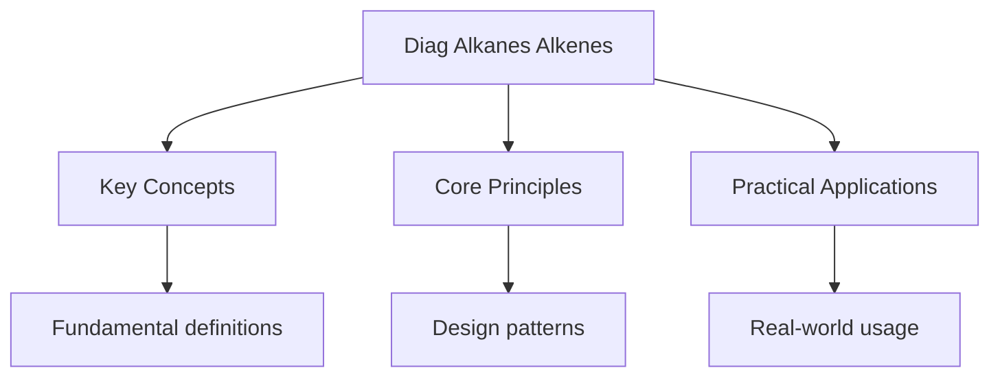

---

date: 2026-07-23T21:57:32+01:00
title: "Alkanes and Alkenes -- Diagnostic Tests"
description: "A-Level Chemistry Alkanes and Alkenes -- Diagnostic Tests notes covering key definitions, core concepts, worked examples, and practice questions for revision."
tableOfContents: false
---

<!-- Breadcrumb Schema for SEO -->

## Intuition

**Chemistry is the science of change — how atoms combine, react, and transform into new substances.**

## Alkanes and Alkenes — Diagnostic Tests

## Unit Tests

### UT-1: Free Radical Substitution Mechanism and Product Distribution

**Question:**

Methane reacts with chlorine gas under UV light to form chloromethane. However, further substitution
can occur, producing dichloromethane, trichloromethane, and tetrachloromethane.

(a) Write the initiation, propagation, and two termination steps for the formation of chloromethane.

(b) Explain why a mixture of products is obtained even when methane is in large excess.

(c) The reaction has a high activation energy for the propagation steps. Explain the role of UV
light and why the reaction does not proceed in the dark.

**Solution:**

(a) **Initiation:** UV light provides energy to homolytically cleave the Cl--Cl bond:

$$\text{Cl}_2 \xrightarrow{\text{UV}} 2\text{Cl}^\bullet$$

**Propagation:**

$$\text{Cl}^\bullet + \text{CH}_4 \to \text{HCl} + \text{CH}_3^\bullet$$
$$\text{CH}_3^\bullet + \text{Cl}_2 \to \text{CH}_3\text{Cl} + \text{Cl}^\bullet$$

**Termination (any two):**

$$\text{Cl}^\bullet + \text{Cl}^\bullet \to \text{Cl}_2$$
$$\text{CH}_3^\bullet + \text{CH}_3^\bullet \to \text{C}_2\text{H}_6$$
$$\text{CH}_3^\bullet + \text{Cl}^\bullet \to \text{CH}_3\text{Cl}$$

(b) Even with excess methane, once chloromethane ($\text{CH}_3\text{Cl}$) is formed, it can also
react with chlorine radicals:

$$\text{Cl}^\bullet + \text{CH}_3\text{Cl} \to \text{HCl} + \bullet\text{CH}_2\text{Cl}$$
$$\bullet\text{CH}_2\text{Cl} + \text{Cl}_2 \to \text{CH}_2\text{Cl}_2 + \text{Cl}^\bullet$$

This process continues, with each chlorinated product being susceptible to further substitution. The
C--H bonds in chloromethane are slightly weaker than in methane (due to the electron-withdrawing
effect of Cl, which weakens the remaining C--H bonds), making further substitution competitive. A
mixture of $\text{CH}_3\text{Cl}$$\text{CH}_2\text{Cl}_2$$\text{CHCl}_3$ And $\text{CCl}_4$ is always
obtained.

(c) The Cl--Cl bond has a bond enthalpy of $+242\,\text{kJ mol}^{-1}$Which requires significant
energy to break homolytically. At room temperature, the average kinetic energy of molecules is
insufficient ($\approx 2.5\,\text{kJ mol}^{-1}$ at $298\,\text{K}$) to break this bond. UV light
provides photons with sufficient energy (UV photons at $\lambda \approx 400\,\text{nm}$ have energy
$\approx 300\,\text{kJ mol}^{-1}$) to break the Cl--Cl bond. The reaction does not proceed in the
dark because no Cl radicals are generated without the UV energy input, and the propagation steps
cannot begin without these radicals.

---

<!-- Breadcrumb Schema for SEO -->

### UT-2: Electrophilic Addition Mechanism and Carbocation Stability

**Question:**

Propene ($\text{CH}_3\text{CH}=\text{CH}_2$) reacts with HBr.

(a) Describe the mechanism of electrophilic addition, showing the formation of the major product and
explaining why this product is favoured.

(b) Draw the mechanism for the reaction of propene with $\text{HBr}$ in the presence of peroxides,
and explain why the product distribution changes.

(c) Explain why the reaction of propene with HBr is faster than the reaction of ethene with HBr.

**Solution:**

(a) **Step 1: Electrophilic attack**

The electron-rich C$=$C double bond attacks the electrophilic H of HBr. The H--Br bond breaks
heterolytically, and a **carbocation intermediate** forms. Two possible carbocations can form:

- **Secondary carbocation** (major): $\text{CH}_3\text{C}^+\text{HCH}_3$ -- H adds to the less
  substituted carbon (C-1), giving a secondary carbocation at C-2.
- **Primary carbocation** (minor): $^\bullet\text{CH}_2\text{CH}_2\text{CH}_3$ -- H adds to the more
  substituted carbon (C-2), giving a primary carbocation at C-1.

The secondary carbocation is **more stable** due to the electron-donating inductive effect of the
methyl group, which disperses the positive charge. Therefore, the major product is
**2-bromopropane** ($\text{CH}_3\text{CHBr}\text{CH}_3$). This is **Markovnikov"s rule**: the
hydrogen adds to the carbon with more hydrogen atoms.

**Step 2: Nucleophilic attack**

The bromide ion ($\text{Br}^-$) attacks the carbocation:

$$\text{CH}_3\text{C}^+\text{HCH}_3 + \text{Br}^- \to \text{CH}_3\text{CHBr}\text{CH}_3$$

(b) In the presence of peroxides, the mechanism changes to **free radical addition**
(anti-Markovnikov). The peroxide decomposes to form peroxyl radicals, which abstract H from HBr:

$$\text{ROOR} \to 2\text{RO}^\bullet$$
$$\text{RO}^\bullet + \text{HBr} \to \text{ROH} + \text{Br}^\bullet$$

The bromine radical adds to the double bond. It preferentially adds to the **less substituted
carbon** (C-1) because this produces the more stable **secondary radical** at C-2:

$$\text{Br}^\bullet + \text{CH}_3\text{CH}=\text{CH}_2 \to \text{CH}_3\dot{\text{C}}\text{HCH}_2\text{Br}$$

This secondary radical then abstracts H from another HBr:

$$\text{CH}_3\dot{\text{C}}\text{HCH}_2\text{Br} + \text{HBr} \to \text{CH}_3\text{CH}_2\text{CH}_2\text{Br} + \text{Br}^\bullet$$

The major product is **1-bromopropane** (anti-Markovnikov product).

(c) Propene reacts faster than ethene because:

- The **methyl group in propene is electron-donating** (inductive effect), which increases the
  electron density of the C$=$C double bond, making it a better nucleophile and more reactive
  towards electrophiles.
- The more substituted alkene can form a more stable carbocation intermediate (secondary vs
  primary), lowering the activation energy for the rate-determining step.
- Alkyl groups stabilise the transition state leading to the carbocation through hyperconjugation
  (overlap of C--H $\sigma$-bonds with the empty $p$-orbital of the developing carbocation).

---

<!-- Breadcrumb Schema for SEO -->

### UT-3: Addition Polymerisation and Polymer Properties

**Question:**

(a) Draw the repeating unit of poly(propene) and explain the difference between isotactic, atactic,
and syndiotactic poly(propene).

(b) Explain why isotactic poly(propene) has a higher melting point than atactic poly(propene).

(c) Calculate the number of propene monomer units in a chain of poly(propene) with a molar mass of
$42000\,\text{g mol}^{-1}$.

**Solution:**

(a) The repeating unit of poly(propene) is:

$$-\text{CH}_2-\text{CH}(\text{CH}_3)-$$

The methyl group can be arranged in different configurations:

- **Isotactic:** All methyl groups on the same side of the polymer chain. The chain is regular and
  can pack closely.
- **Syndiotactic:** Methyl groups alternate from side to side in a regular pattern. Also regular
  packing.
- **Atactic:** Methyl groups are randomly distributed on both sides. Irregular, random arrangement.

(b) **Isotactic poly(propene)** has a regular, ordered structure that allows polymer chains to pack
closely together. The close packing creates stronger **intermolecular forces** (van der Waals)
between chains, requiring more energy to separate them, hence a higher melting point (approximately
$160$--$170\,^\circ\text{C}$).

**Atactic poly(propene)** has a random arrangement of methyl groups, creating an irregular, tangled
structure. The chains cannot pack efficiently, resulting in weaker intermolecular forces and a lower
melting point (it is often a soft, rubbery material or amorphous solid). Atactic poly(propene) is
essentially an amorphous polymer with low crystallinity.

(c) Molar mass of propene monomer:
$\text{C}_3\text{H}_6 = 3 \times 12.0 + 6 \times 1.0 = 42.0\,\text{g mol}^{-1}$

$$n = \frac{42000}{42.0} = 1000$$

The chain contains approximately **1000** propene monomer units (the degree of polymerisation is
1000).

## Integration Tests

### IT-1: Multi-Step Synthesis from Alkenes (with Halogenoalkanes and Alcohols)

**Question:**

Starting from propene, propose a synthesis of 1,2-dibromopropane.

(a) Write equations for each step, including reagents and conditions.

(b) Explain why the addition of bromine to propene gives 1,2-dibromopropane rather than
1,3-dibromopropane.

(c) If propene is first converted to propan-2-ol and then treated with concentrated
$\text{H}_2\text{SO}_4$ and $\text{NaBr}$What product would be formed? Explain the mechanism.

**Solution:**

(a) **Step 1:** Addition of bromine to propene:

$$\text{CH}_3\text{CH}=\text{CH}_2 + \text{Br}_2 \to \text{CH}_3\text{CHBrCH}_2\text{Br}$$

Conditions: Bromine water or bromine dissolved in an organic solvent (e.g., $\text{CCl}_4$) at room
temperature.

This is a single-step reaction: electrophilic addition of bromine across the double bond.

(b) Bromine adds to the **two adjacent carbons** of the C$=$C double bond because the mechanism
involves formation of a cyclic **bromonium ion intermediate**. The bromonium ion forms when one Br
atom of $\text{Br}_2$ accepts electrons from the $\pi$-bond, creating a three-membered ring with
Br$^+$ bridging the two carbons. The nucleophilic $\text{Br}^-$ then attacks one of the carbons of
the bromonium ion from the back, opening the ring. This results in **anti-addition** (Br atoms on
opposite sides) at the 1,2-positions.

1,3-Dibromopropane would require bromine atoms on non-adjacent carbons, which is impossible from a
single addition across a C$=$C bond.

(c) If propene is first hydrated to propan-2-ol ($\text{CH}_3\text{CH}(\text{OH})\text{CH}_3$) and
then treated with concentrated $\text{H}_2\text{SO}_4$ and $\text{NaBr}$The product is
**2-bromopropane** ($\text{CH}_3\text{CHBrCH}_3$).

The mechanism is **SN1 nucleophilic substitution**:

- Concentrated $\text{H}_2\text{SO}_4$ protonates the $-$OH group
- Water leaves as a good leaving group ($\text{H}_2\text{O}$), forming a secondary carbocation
- $\text{Br}^-$ (from NaBr) attacks the carbocation

The product is 2-bromopropane (not 1,2-dibromopropane), because the reaction substitutes only the
$-$OH group, not adding a second bromine atom.

---

<!-- Breadcrumb Schema for SEO -->

### IT-2: Alkene Stereochemistry and Reaction Stereochemistry (with Organic Introduction)

**Question:**

Cis-but-2-ene reacts with bromine in an inert solvent.

(a) Draw the mechanism and predict the stereochemistry of the product.

(b) Explain why the product is a meso compound.

(c) Compare the products obtained when (i) cis-but-2-ene and (ii) trans-but-2-ene each react with
bromine.

**Solution:**

(a) The mechanism involves:

**Step 1:** The $\pi$-electrons of cis-but-2-ene attack a bromine molecule, forming a cyclic
**bromonium ion intermediate**:

$$\text{CH}_3\text{CH}=\text{CHCH}_3 + \text{Br}_2 \to \text{CH}_3\text{CH}-\text{CHCH}_3 \quad (\text{bromonium ion})$$

The bromonium ion has a three-membered ring with Br$^+$ bridging the two carbons. The two methyl
groups are on the same side (cis).

**Step 2:** $\text{Br}^-$ attacks from the **opposite side** (anti-addition) of the bromonium ion
ring:

$$\text{Bromonium ion} + \text{Br}^- \to \text{CH}_3\text{CHBrCHBrCH}_3$$

The two bromine atoms add from opposite sides (anti addition), giving **(2R,3S)-2,3-dibromobutane**.

(b) The product is a **meso compound** because it has chiral centres at C-2 and C-3 but is not
optically active. The molecule has a **plane of symmetry** passing through the middle of the
C-2--C-3 bond. The $(2R,3S)$ configuration means the two chiral centres are mirror images of each
other within the same molecule, so the molecule is superimposable on its mirror image.

(c)

(i) **cis-but-2-ene + $\text{Br}_2$** $\to$ meso-2,3-dibromobutane (single stereoisomer, as
described above)

(ii) **trans-but-2-ene + $\text{Br}_2$** $\to$ a **racemic mixture** of $(2R,3R)$-2,3-dibromobutane
and $(2S,3S)$-2,3-dibromobutane

For trans-but-2-ene, the bromonium ion forms with the methyl groups on opposite sides. Anti addition
of $\text{Br}^-$ gives products where the bromine atoms are on opposite faces but the methyl groups
are also on opposite faces. The two possible products (attack at either carbon of the bromonium ion)
give $(2R,3R)$ and $(2S,3S)$ enantiomers in equal amounts. These are optically active enantiomers
(no plane of symmetry), unlike the meso compound from the cis isomer.

---

<!-- Breadcrumb Schema for SEO -->

### IT-3: Industrial Alkene Chemistry (with Kinetics and Equilibrium)

**Question:**

Ethene is produced industrially by the thermal cracking of ethane:

$$\text{C}_2\text{H}_6(g) \to \text{C}_2\text{H}_4(g) + \text{H}_2(g) \quad \Delta H = +137\,\text{kJ mol}^{-1}$$

(a) Explain why high temperatures are used in cracking, with reference to the equilibrium position
and the rate of reaction.

(b) In a cracking experiment, $10.0\,\text{mol}$ of ethane is heated at $800\,^\circ\text{C}$. At
equilibrium, $3.00\,\text{mol}$ of ethene is present. Calculate $K_p$ if the total pressure is
$1.00\,\text{atm}$.

(c) Explain why cracking is carried out at low pressure despite Le Chatelier's principle suggesting
that low pressure would reduce the yield.

**Solution:**

(a) **Equilibrium consideration:** The forward reaction is endothermic
($\Delta H = +137\,\text{kJ mol}^{-1}$), so high temperature shifts the equilibrium towards the
products (ethene and hydrogen). This increases the equilibrium yield.

**Kinetic consideration:** Cracking involves breaking strong C--C and C--H bonds, which requires
significant activation energy. High temperatures provide more molecules with energy
$\geq E_a$Dramatically increasing the rate of reaction (Arrhenius equation).

Both factors (equilibrium and kinetics) favour high temperature.

(b) Equilibrium moles:

- $\text{C}_2\text{H}_6$: $10.0 - 3.00 = 7.00\,\text{mol}$
- $\text{C}_2\text{H}_4$: $3.00\,\text{mol}$
- $\text{H}_2$: $3.00\,\text{mol}$

Total moles: $7.00 + 3.00 + 3.00 = 13.00\,\text{mol}$

Mole fractions:

- $x(\text{C}_2\text{H}_6) = 7.00/13.00 = 0.5385$
- $x(\text{C}_2\text{H}_4) = 3.00/13.00 = 0.2308$
- $x(\text{H}_2) = 3.00/13.00 = 0.2308$

Partial pressures (at $1.00\,\text{atm}$):

- $p(\text{C}_2\text{H}_6) = 0.5385\,\text{atm}$
- $p(\text{C}_2\text{H}_4) = 0.2308\,\text{atm}$
- $p(\text{H}_2) = 0.2308\,\text{atm}$

$$K_p = \frac{p(\text{C}_2\text{H}_4) \times p(\text{H}_2)}{p(\text{C}_2\text{H}_6)} = \frac{0.2308 \times 0.2308}{0.5385} = \frac{0.05327}{0.5385} = 0.0989\,\text{atm}$$

(c) While Le Chatelier's principle predicts that low pressure favours the side with more moles of
gas (2 mol products vs 1 mol reactant), cracking is carried out at relatively low pressure for a
different reason: to **prevent unwanted side reactions** such as polymerisation of ethene, which
occurs at high pressures. At very low pressures, the yield of ethene per pass is lower, but the
product is cleaner and the conditions are safer and more controllable. In practice, steam is often
added to dilute the ethane (reducing the effective partial pressure) while allowing operation at
moderate total pressures for practical engineering reasons.

---

<!-- Breadcrumb Schema for SEO -->

### Additional Practice Problems

#### UT-4: Polymerisation Calculations

**Question:** Poly(ethene) is produced from ethene monomer. Calculate:

(a) The number of ethene monomers in a poly(ethene) chain with molar mass
$28\,000\,\mathrm{g\,mol^{-1}}$.

(b) The mass of poly(ethene) produced from $1.00\,\mathrm{kg}$ of ethene, assuming 95% conversion
efficiency.

**Solution:**

(a) One ethene monomer ($\mathrm{C}_2\mathrm{H}_4$) has $M_r = 28.0$. In the polymer, each monomer
contributes a $-\mathrm{CH}_2-\mathrm{CH}_2-$ unit with $M_r = 28.0$ (the double bond opens, but no
atoms are lost in addition polymerisation) (1 mark).

Number of monomers $= 28000/28.0 = 1000$ (1 mark).

(b) $n(\text{ethene}) = 1000/28.0 = 35.7\,\mathrm{mol}$

Theoretical mass of polymer $= 35.7 \times 28.0 = 1000\,\mathrm{g}$

Actual mass $= 1000 \times 0.95 = 950\,\mathrm{g}$ (1 mark).

#### UT-5: Stereochemistry of Bromine Addition

**Question:** $(Z)$-but-2-ene reacts with bromine. Draw the product(s) and explain the
stereochemistry.

**Solution:**

$(Z)$-but-2-ene has both methyl groups on the same side of the double bond. The reaction proceeds
via anti addition: the bromonium ion intermediate forms, and $\mathrm{Br}^-$ attacks from the
opposite side (1 mark).

The product is a **racemic mixture** of $(2R,3S)$-2,3-dibromobutane and $(2S,3R)$-2,3-dibromobutane.
These two products are enantiomers (non-superimposable mirror images) (1 mark).

The meso compound $(2R,3R)$-2,3-dibromobutane is NOT formed because anti addition from the $(Z)$
isomer always places the bromine atoms on opposite faces of the original double bond, giving the
$RS/SR$ pair (1 mark).

#### IT-4: Alkanes, Alkenes, and Quantitative Chemistry

**Question:** $5.00\,\mathrm{g}$ of a mixture of an alkane and an alkene (both containing only
carbon and hydrogen) is completely burned in excess oxygen. The $\mathrm{CO}_2$ produced is absorbed
and found to have a mass of $15.4\,\mathrm{g}$. When the original mixture is reacted with bromine
water, $2.50\,\mathrm{g}$ of the mixture reacts (the alkene component only). Identify the alkane and
alkene.

**Solution:**

Total moles of $\mathrm{CO}_2$: $15.4/44.0 = 0.350\,\mathrm{mol}$

The alkene component reacts with bromine water (the alkane does not). Mass of alkene
$= 2.50\,\mathrm{g}$Mass of alkane $= 5.00 - 2.50 = 2.50\,\mathrm{g}$ (1 mark).

The alkene reacts with $\mathrm{Br}_2$ to give a dibromo compound. If the alkene is
$\mathrm{C}_n\mathrm{H}_{2n}$:

Moles of alkene: $2.50/(14n + 2) = 2.50/(14n + 2)$

The alkane is $\mathrm{C}_m\mathrm{H}_{2m+2}$. Moles of alkane: $2.50/(14m + 2)$

Total moles of C from both: $n \times n(\text{alkene}) + m \times n(\text{alkane}) = 0.350$

Since both components have equal mass ($2.50\,\mathrm{g}$ each), try equal carbon numbers first. If
both are $\mathrm{C}_4$: ethene and butane? But ethene is a gas ($M = 28$),
$n = 2.50/28 = 0.0893\,\mathrm{mol}$Contributing $0.179\,\mathrm{mol}$ C. Butane:
$n = 2.50/58 = 0.0431\,\mathrm{mol}$Contributing $0.172\,\mathrm{mol}$ C. Total C
$= 0.179 + 0.172 = 0.351\,\mathrm{mol}$ (matches $0.350$) (1 mark).

The mixture is **ethene** ($\mathrm{C}_2\mathrm{H}_4$) and **butane**
($\mathrm{C}_4\mathrm{H}_{10}$) (1 mark).

## Common Mistakes

**Confusing Markovnikov and anti-Markovnikov addition:** Without peroxides, HBr adds Markovnikov — the hydrogen goes to the carbon with more hydrogens, and bromine goes to the more substituted carbon (via the more stable carbocation). With peroxides, the mechanism switches to free radical addition, giving anti-Markovnikov products. Students often forget that the peroxide effect only works with HBr, not HCl or HI.

**Drawing the bromonium ion as a carbocation intermediate:** When an alkene reacts with bromine, a cyclic bromonium ion forms — not an open carbocation. The bromonium ion explains why bromine adds anti (from opposite sides). Drawing a carbocation would predict a mixture of syn and anti addition, which is incorrect.

**Forgetting that cracking is done at low pressure to avoid side reactions:** Le Chatelier's principle suggests low pressure favours cracking (more moles of gas on the product side), but the real reason for low pressure is to prevent polymerisation of the alkene products. High pressure would cause the ethene produced to polymerise, reducing the yield of the desired product.

## See Also

- [Diagnostics](./)
- [Acids, Bases and Buffers -- Diagnostic Tests](./diag-acids-bases)
- [Atomic Structure and Periodicity -- Diagnostic Tests](./diag-atomic-structure)
