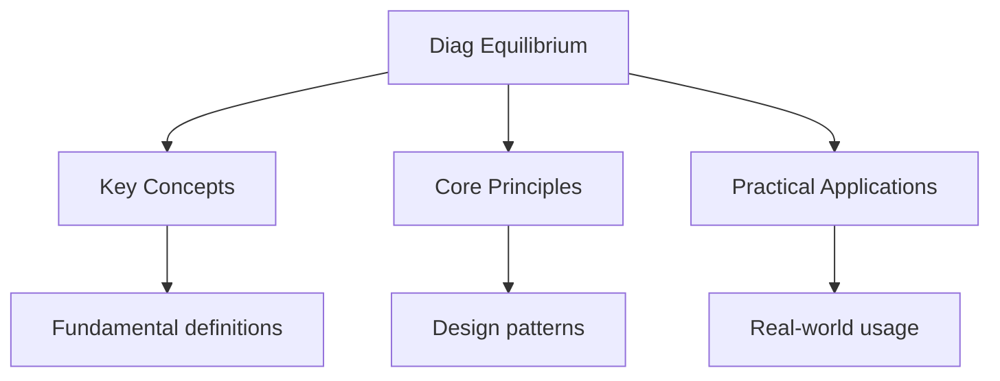

---

date: 2026-07-23T21:57:32+01:00
title: "Chemical Equilibrium -- Diagnostic Tests"
description: "A-Level Chemistry Chemical Equilibrium -- Diagnostic Tests notes covering key definitions, core concepts, worked examples, and practice questions for revision."
tableOfContents: false
---

<!-- Breadcrumb Schema for SEO -->

## Intuition

**Chemical equilibrium is like a busy restaurant — dishes are constantly being prepared and eaten, but the overall number of plates stays the same.**

## Chemical Equilibrium — Diagnostic Tests

## Unit Tests

### UT-1: Kp Calculations with Unit Conversion

**Question:**

Nitrogen and hydrogen react to form ammonia:

$$\text{N}_2(g) + 3\text{H}_2(g) \rightleftharpoons 2\text{NH}_3(g)$$

$1.00\,\text{mol}$ of $\text{N}_2$ and $3.00\,\text{mol}$ of $\text{H}_2$ are mixed in a sealed
container of volume $5.00\,\text{dm}^3$ and allowed to reach equilibrium at $500\,^\circ\text{C}$.
At equilibrium, the total pressure is $200\,\text{atm}$ and there is $0.400\,\text{mol}$ of
$\text{NH}_3$ present.

(a) Calculate the mole fractions and partial pressures of all three gases at equilibrium.

(b) Calculate $K_p$ at this temperature, stating its units.

(c) Explain why changing the total pressure does not change the value of $K_p$ (provided temperature
remains constant).

**Solution:**

(a) From the stoichiometry, $0.400\,\text{mol}$ of $\text{NH}_3$ requires $0.200\,\text{mol}$ of
$\text{N}_2$ and $0.600\,\text{mol}$ of $\text{H}_2$ to react.

Equilibrium moles:

- $\text{N}_2$: $1.00 - 0.200 = 0.800\,\text{mol}$
- $\text{H}_2$: $3.00 - 0.600 = 2.400\,\text{mol}$
- $\text{NH}_3$: $0.400\,\text{mol}$

Total moles at equilibrium: $0.800 + 2.400 + 0.400 = 3.600\,\text{mol}$

Mole fractions:

- $x(\text{N}_2) = 0.800/3.600 = 0.2222$
- $x(\text{H}_2) = 2.400/3.600 = 0.6667$
- $x(\text{NH}_3) = 0.400/3.600 = 0.1111$

Partial pressures ($p_i = x_i \times p_{\text{total}}$):

- $p(\text{N}_2) = 0.2222 \times 200 = 44.4\,\text{atm}$
- $p(\text{H}_2) = 0.6667 \times 200 = 133.3\,\text{atm}$
- $p(\text{NH}_3) = 0.1111 \times 200 = 22.2\,\text{atm}$

(b)

$$K_p = \frac{p(\text{NH}_3)^2}{p(\text{N}_2) \times p(\text{H}_2)^3} = \frac{22.2^2}{44.4 \times 133.3^3} = \frac{492.8}{44.4 \times 2368593} = \frac{492.8}{1.0517 \times 10^8} = 4.68 \times 10^{-6}$$

Units: $\text{atm}^{-2}$

$$K_p = 4.68 \times 10^{-6}\,\text{atm}^{-2}$$

(c) $K_p$ is a constant at a given temperature. When the total pressure changes, the system adjusts
the equilibrium position (Le Chatelier"s principle) to restore the original $K_p$ value. Increasing
pressure shifts the equilibrium towards the side with fewer moles of gas (the $\text{NH}_3$ side in
this case), increasing $p(\text{NH}_3)$ and changing the individual partial pressures. However, the
ratio defining $K_p$ returns to its equilibrium value because $K_p$ depends only on temperature, not
pressure.

---

<!-- Breadcrumb Schema for SEO -->

### UT-2: Effect of Temperature on Equilibrium Constant

**Question:**

For the equilibrium:

$$\text{PCl}_5(g) \rightleftharpoons \text{PCl}_3(g) + \text{Cl}_2(g) \quad \Delta H = +124\,\text{kJ mol}^{-1}$$

$K_c = 0.0211\,\text{mol dm}^{-3}$ at $500\,\text{K}$.

(a) State and explain the effect of increasing temperature on the equilibrium yield of
$\text{PCl}_3$.

(b) $K_c = 0.0420\,\text{mol dm}^{-3}$ at $600\,\text{K}$. Calculate the value of $K_c$ at
$550\,\text{K}$Using the van't Hoff equation approximation:
$\ln(K_2/K_1) \approx \frac{\Delta H^\circ}{R}\left(\frac{1}{T_1} - \frac{1}{T_2}\right)$.

(c) Explain why adding a catalyst does not change the equilibrium position or the value of $K_c$.

**Solution:**

(a) The forward reaction is endothermic ($\Delta H = +124\,\text{kJ mol}^{-1}$). By Le Chatelier's
principle, increasing temperature favours the endothermic (forward) direction. The equilibrium
shifts to the right, producing more $\text{PCl}_3$ (and $\text{Cl}_2$). This is confirmed by $K_c$
increasing with temperature: $K_c$ increases when temperature increases for endothermic reactions.

(b) Using the van't Hoff equation:

$$\ln\left(\frac{K_{550}}{K_{500}}\right) = \frac{124000}{8.31}\left(\frac{1}{500} - \frac{1}{550}\right)$$

$$\ln\left(\frac{K_{550}}{0.0211}\right) = 14922 \times \left(0.002000 - 0.001818\right) = 14922 \times 1.818 \times 10^{-4} = 2.713$$

$$\frac{K_{550}}{0.0211} = e^{2.713} = 15.08$$

$$K_{550} = 15.08 \times 0.0211 = 0.318\,\text{mol dm}^{-3}$$

Verification: $K_{600} = 0.0420$ should also be consistent. Using the equation between 500 K and 600
K:

$$\ln(0.0420/0.0211) = \frac{124000}{8.31}(1/500 - 1/600) = 14922 \times 3.333 \times 10^{-4} = 4.974$$

$$\ln(1.990) = 0.688$$

This gives $0.688$ vs the expected $4.974$Which indicates the van't Hoff equation is being applied
over too wide a temperature range. The values given at 500 K and 600 K may not be perfectly
consistent. The calculation at 550 K using 500 K data gives $K_{550} = 0.318\,\text{mol dm}^{-3}$.

(c) A catalyst provides an alternative pathway with lower activation energy for both the forward and
reverse reactions equally. It increases the rate at which equilibrium is achieved but does not
change the thermodynamics of the reaction. The position of equilibrium (and hence $K_c$) depends on
the relative energy levels of reactants and products, which are unchanged by the catalyst. The
catalyst accelerates both forward and reverse rates by the same factor, so the equilibrium constant
remains the same.

---

<!-- Breadcrumb Schema for SEO -->

### UT-3: Heterogeneous Equilibrium and Solids

**Question:**

For the thermal decomposition of calcium carbonate:

$$\text{CaCO}_3(s) \rightleftharpoons \text{CaO}(s) + \text{CO}_2(g) \quad \Delta H = +178\,\text{kJ mol}^{-1}$$

(a) Write the expression for $K_p$ for this equilibrium and explain why the concentrations of the
solids are not included.

(b) At $800\,^\circ\text{C}$, $K_p = 0.220\,\text{atm}$. Calculate the minimum pressure of
$\text{CO}_2$ that must be applied to prevent decomposition of $\text{CaCO}_3$ at this temperature.

(c) Explain how the decomposition temperature changes if the experiment is carried out at a lower
total pressure.

**Solution:**

(a)

$$K_p = p(\text{CO}_2)$$

Solids ($\text{CaCO}_3$ and $\text{CaO}$) are excluded from the equilibrium expression because their
concentrations (and hence activities) are effectively constant. The concentration of a pure solid
depends only on its density, which is fixed at a given temperature. Since these constants are
incorporated into the equilibrium constant, only the gaseous species appears.

(b) For decomposition to be prevented, the system must not reach equilibrium (i.e.,
$Q_p \gt K_p$Where $Q_p$ is the reaction quotient). The minimum $\text{CO}_2$ pressure to prevent
decomposition is when $Q_p = K_p$:

$$p(\text{CO}_2)_{\text{min}} = K_p = 0.220\,\text{atm}$$

If the partial pressure of $\text{CO}_2$ exceeds $0.220\,\text{atm}$The reverse reaction is favoured
and decomposition is suppressed.

(c) Lower total pressure means the partial pressure of $\text{CO}_2$ in the surroundings is lower.
Since the equilibrium requires $p(\text{CO}_2) = K_p$ for decomposition, and $K_p$ increases with
temperature (endothermic reaction), at lower total pressures the $\text{CO}_2$ partial pressure
needed to prevent decomposition ($= K_p$ at that temperature) is reached at a **lower temperature**.
Therefore, $\text{CaCO}_3$ decomposes at a **lower temperature** when the total pressure is reduced.
This is consistent with Le Chatelier's principle: reducing pressure favours the side with more moles
of gas (the products side, which has 1 mol of gas vs 0 mol on the reactant side).

## Integration Tests

### IT-1: Industrial Process Optimisation (with Kinetics and Thermodynamics)

**Question:**

The Haber process for ammonia synthesis:

$$\text{N}_2(g) + 3\text{H}_2(g) \rightleftharpoons 2\text{NH}_3(g) \quad \Delta H = -92\,\text{kJ mol}^{-1}$$

(a) Explain why industrial conditions of approximately $450\,^\circ\text{C}$ and $200\,\text{atm}$
are used, given that low temperature and high pressure would give a higher equilibrium yield.

(b) The iron catalyst used in the Haber process increases the rate of reaction. Explain, with
reference to activation energy, how the catalyst works, and explain why it does not change the
equilibrium yield.

(c) Unreacted $\text{N}_2$ and $\text{H}_2$ are recycled. Explain the effect of this on the overall
yield of the process.

**Solution:**

(a) **Low temperature** would give a higher equilibrium yield (exothermic forward reaction), but the
rate would be impractically slow. At very low temperatures, the reaction would take far too long to
reach equilibrium, making the process economically unviable. **$450\,^\circ\text{C}$** is a
compromise: high enough for a reasonable rate, low enough for a useful equilibrium yield.

**High pressure** favours the forward reaction (4 mol of gas on the left vs 2 mol on the right), but
very high pressures require expensive, thick-walled vessels that are costly to build and maintain.
**$200\,\text{atm}$** is a compromise between equilibrium yield and economic/ safety considerations.

(b) The iron catalyst provides an alternative reaction pathway with a **lower activation energy**.
$\text{N}_2$ and $\text{H}_2$ are adsorbed onto the catalyst surface, where the N$\equiv$N triple
bond is weakened, allowing easier reaction with hydrogen. The catalyst does not change the
equilibrium yield because it lowers the activation energy equally for both forward and reverse
reactions. The ratio of forward and reverse rate constants (which equals $K_c$) remains unchanged.

(c) Recycling unreacted $\text{N}_2$ and $\text{H}_2$ means that over time, essentially all
reactants are converted to product. Although the equilibrium conversion per pass is only about
15--20% at $450\,^\circ\text{C}$ and $200\,\text{atm}$The recycled gases pass through the reactor
repeatedly until they react. This gives a much higher overall yield than a single pass through the
reactor, making the process economically efficient.

---

<!-- Breadcrumb Schema for SEO -->

### IT-2: Equilibrium and Gas Volume Calculations (with Quantitative Chemistry)

**Question:**

$2.00\,\text{mol}$ of $\text{SO}_2$ and $1.50\,\text{mol}$ of $\text{O}_2$ are mixed in a
$10.0\,\text{dm}^3$ container and allowed to reach equilibrium:

$$2\text{SO}_2(g) + \text{O}_2(g) \rightleftharpoons 2\text{SO}_3(g)$$

At equilibrium, $1.20\,\text{mol}$ of $\text{SO}_3$ is present.

(a) Calculate $K_c$ for this equilibrium.

(b) Calculate $K_p$ at the same temperature, given that the total pressure at equilibrium is
$5.00\,\text{atm}$.

(c) If the volume of the container is halved at constant temperature, predict the effect on the
equilibrium moles of $\text{SO}_3$ and calculate the new equilibrium moles of all species.

**Solution:**

(a) Let $x$ be the moles of $\text{O}_2$ that react. From stoichiometry, $2x$ mol of $\text{SO}_2$
reacts and $2x$ mol of $\text{SO}_3$ forms.

$2x = 1.20$ So $x = 0.600$

Equilibrium moles:

- $\text{SO}_2$: $2.00 - 1.20 = 0.800\,\text{mol}$
- $\text{O}_2$: $1.50 - 0.600 = 0.900\,\text{mol}$
- $\text{SO}_3$: $1.20\,\text{mol}$

Equilibrium concentrations (dividing by $10.0\,\text{dm}^3$):

- $[\text{SO}_2] = 0.0800\,\text{mol dm}^{-3}$
- $[\text{O}_2] = 0.0900\,\text{mol dm}^{-3}$
- $[\text{SO}_3] = 0.120\,\text{mol dm}^{-3}$

$$K_c = \frac{[\text{SO}_3]^2}{[\text{SO}_2]^2[\text{O}_2]} = \frac{0.120^2}{0.0800^2 \times 0.0900} = \frac{0.01440}{5.760 \times 10^{-4}} = 25.0\,\text{mol}^{-1}\text{ dm}^3$$

(b) Total equilibrium moles: $0.800 + 0.900 + 1.20 = 2.90\,\text{mol}$

Partial pressures:

- $p(\text{SO}_2) = (0.800/2.90) \times 5.00 = 1.379\,\text{atm}$
- $p(\text{O}_2) = (0.900/2.90) \times 5.00 = 1.552\,\text{atm}$
- $p(\text{SO}_3) = (1.20/2.90) \times 5.00 = 2.069\,\text{atm}$

$$K_p = \frac{p(\text{SO}_3)^2}{p(\text{SO}_2)^2 \times p(\text{O}_2)} = \frac{2.069^2}{1.379^2 \times 1.552} = \frac{4.281}{2.952 \times 1.552} = \frac{4.281}{4.583} = 0.934\,\text{atm}^{-1}$$

(c) When volume is halved ($5.00\,\text{dm}^3$), all concentrations initially double, so
$Q_c \gt K_c$ (since the denominator increases more due to the squared terms). The equilibrium
shifts to the right (fewer moles of gas) to restore $K_c$.

Let $y$ mol of additional $\text{SO}_3$ form:

- $\text{SO}_2$: $0.800 - y$
- $\text{O}_2$: $0.900 - y/2$
- $\text{SO}_3$: $1.20 + y$

Concentrations (dividing by $5.00\,\text{dm}^3$):

$$K_c = 25.0 = \frac{((1.20+y)/5.00)^2}{((0.800-y)/5.00)^2 \times ((0.900-y/2)/5.00)}$$

$$25.0 = \frac{(1.20+y)^2 \times 5.00}{(0.800-y)^2 \times (0.900 - y/2)}$$

$$5.0(1.20+y)^2 = 25.0(0.800-y)^2(0.900-y/2)$$

This is a cubic equation. Solving iteratively or by approximation: since the volume halved
(significant change), the equilibrium shifts substantially. An approximate solution gives
$y \approx 0.08$:

New equilibrium moles:
$\text{SO}_2 \approx 0.72$$\text{O}_2 \approx 0.86$$\text{SO}_3 \approx 1.28$.

The moles of $\text{SO}_3$ have increased from $1.20$ to approximately $1.28\,\text{mol}$Consistent
with Le Chatelier's principle (increasing pressure favours the side with fewer moles of gas: 3 mol
$\to$ 2 mol).

---

<!-- Breadcrumb Schema for SEO -->

### IT-3: Acid Dissociation Equilibrium (with Acids and Bases)

**Question:**

Ethanoic acid dissociates in water:

$$\text{CH}_3\text{COOH}(aq) \rightleftharpoons \text{CH}_3\text{COO}^-(aq) + \text{H}^+(aq)$$

$K_a = 1.74 \times 10^{-5}\,\text{mol dm}^{-3}$ at $298\,\text{K}$.

(a) Calculate the pH of a $0.100\,\text{mol dm}^{-3}$ solution of ethanoic acid, stating any
approximation you make.

(b) Calculate the percentage dissociation of ethanoic acid at this concentration.

(c) A student dilutes the solution to $0.00100\,\text{mol dm}^{-3}$ and claims the pH should
decrease by exactly 2 units (since concentration decreased by a factor of 100). Show that this is
incorrect and calculate the actual pH.

**Solution:**

(a) Let $x$ be the concentration of $\text{H}^+$ at equilibrium:

$$K_a = \frac{x^2}{0.100 - x} = 1.74 \times 10^{-5}$$

**Approximation:** Since $K_a$ is very small, $x \ll 0.100$ So $0.100 - x \approx 0.100$:

$$x^2 = 1.74 \times 10^{-5} \times 0.100 = 1.74 \times 10^{-6}$$

$$x = \sqrt{1.74 \times 10^{-6}} = 1.319 \times 10^{-3}\,\text{mol dm}^{-3}$$

$$\text{pH} = -\log(1.319 \times 10^{-3}) = 2.88$$

Verification: $x/0.100 = 0.01319 = 1.32\%$ So the approximation is valid (less than 5%).

(b)

$$\text{Percentage dissociation} = \frac{1.319 \times 10^{-3}}{0.100} \times 100 = 1.32\%$$

(c) At $0.00100\,\text{mol dm}^{-3}$:

$$K_a = \frac{x^2}{0.00100 - x} = 1.74 \times 10^{-5}$$

Here, $x$ may not be negligible compared to $0.00100$. Solving the quadratic:

$$x^2 + 1.74 \times 10^{-5}x - 1.74 \times 10^{-8} = 0$$

$$x = \frac{-1.74 \times 10^{-5} + \sqrt{(1.74 \times 10^{-5})^2 + 4 \times 1.74 \times 10^{-8}}}{2}$$

$$x = \frac{-1.74 \times 10^{-5} + \sqrt{3.028 \times 10^{-10} + 6.960 \times 10^{-8}}}{2}$$

$$x = \frac{-1.74 \times 10^{-5} + \sqrt{6.990 \times 10^{-8}}}{2} = \frac{-1.74 \times 10^{-5} + 2.644 \times 10^{-4}}{2} = 1.235 \times 10^{-4}\,\text{mol dm}^{-3}$$

$$\text{pH} = -\log(1.235 \times 10^{-4}) = 3.91$$

The pH change is from $2.88$ to $3.91$A change of $1.03$ units (not 2 units). This is because
diluting a weak acid increases the percentage dissociation (from $1.32\%$ to $12.4\%$), partially
compensating for the lower concentration. The student's reasoning would only apply to a strong acid.

---

<!-- Breadcrumb Schema for SEO -->

### Additional Practice Problems

#### UT-4: Heterogeneous Equilibrium

**Question:** For the equilibrium
$\mathrm{NH}_4\mathrm{HS}(s) \rightleftharpoons \mathrm{NH}_3(g) + \mathrm{H}_2\mathrm{S}(g)$The
total pressure at equilibrium is $0.660\,\mathrm{atm}$ at $298\,\mathrm{K}$. Calculate $K_p$.

**Solution:**

Since the solid does not appear in the expression:

$$K_p = p(\mathrm{NH}_3) \times p(\mathrm{H}_2\mathrm{S})$$

From stoichiometry,
$p(\mathrm{NH}_3) = p(\mathrm{H}_2\mathrm{S}) = \frac{0.660}{2} = 0.330\,\mathrm{atm}$ (1 mark).

$$K_p = 0.330 \times 0.330 = 0.109\,\mathrm{atm}^2$$
(1 mark).

## Common Mistakes

**Confusing the effect of a catalyst on equilibrium yield:** A catalyst speeds up both the forward and reverse reactions equally. It does not shift the equilibrium position and does not change the yield. It only helps the system reach equilibrium faster. Many students incorrectly state that a catalyst increases the yield.

**Using $K_c$ expressions with solids or pure liquids:** Heterogeneous equilibria exclude pure solids and liquids from the $K_c$ or $K_p$ expression because their concentrations (or activities) are constant. For $\text{CaCO}_3(s) \rightleftharpoons \text{CaO}(s) + \text{CO}_2(g)$, only $\text{CO}_2$ appears in the expression: $K_c = [\text{CO}_2]$.

**Misapplying Le Chatelier's principle to catalysts or inert gas addition:** Le Chatelier's principle only applies to changes in concentration, pressure, or temperature. Adding a catalyst does not shift equilibrium. Adding an inert gas at constant volume does not change partial pressures and has no effect. Adding an inert gas at constant total pressure increases volume and may shift the equilibrium.

#### UT-5: Le Chatelier Applied

**Question:** For the equilibrium
$\mathrm{N}_2(g) + 3\mathrm{H}_2(g) \rightleftharpoons 2\mathrm{NH}_3(g) \quad \Delta H = -92\,\mathrm{kJ\,mol^{-1}}$Predict
and explain the effect of each change on the equilibrium yield of ammonia:

(a) Increasing pressure (b) Increasing temperature (c) Adding a catalyst (d) Removing
$\mathrm{NH}_3$ as it is formed

**Solution:**

(a) Increasing pressure favours the side with fewer moles of gas. There are 4 mol of gas on the left
and 2 mol on the right. The equilibrium shifts to the right, **increasing the ammonia yield** (1
mark).

(b) Increasing temperature favours the endothermic direction. Since the forward reaction is
exothermic ($\Delta H < 0$), the equilibrium shifts to the left, **decreasing the ammonia yield** (1
mark).

(c) A catalyst increases the rate of both forward and reverse reactions equally. It has **no
effect** on the equilibrium position or yield. The system reaches equilibrium faster but the yield
is unchanged (1 mark).

(d) Removing $\mathrm{NH}_3$ decreases its partial pressure (concentration). The equilibrium shifts
to the right to replace the $\mathrm{NH}_3$**increasing the yield** of $\mathrm{NH}_3$ per pass
through the reactor (1 mark). This is the principle behind the industrial Haber process, where
$\mathrm{NH}_3$ is continually condensed out.

#### IT-4: Equilibrium and Thermodynamics Combined

**Question:** For the reaction
$\mathrm{CO}(g) + \mathrm{H}_2\mathrm{O}(g) \rightleftharpoons \mathrm{CO}_2(g) + \mathrm{H}_2(g)$:

$\Delta H^\circ = -41\,\mathrm{kJ\,mol^{-1}}$, $\Delta S^\circ = -42\,\mathrm{J\,mol^{-1}\,K^{-1}}$.

(a) Calculate $K_p$ at $298\,\mathrm{K}$.

(b) At what temperature does $K_p = 1$?

(c) If the reaction starts with $1.00\,\mathrm{atm}$ of $\mathrm{CO}$ and $1.00\,\mathrm{atm}$ of
$\mathrm{H}_2\mathrm{O}$ and no products, calculate the equilibrium partial pressures at
$298\,\mathrm{K}$.

**Solution:**

(a) $\Delta G^\circ = -41000 - 298 \times (-42) = -41000 + 12516 = -28484\,\mathrm{J\,mol^{-1}}$

$$K_p = \exp\left(\frac{28484}{8.314 \times 298}\right) = \exp(11.50) = 9.89 \times 10^4$$

Since $\Delta n = 0$, $K_p$ is dimensionless (1 mark).

(b) $K_p = 1$ when $\Delta G^\circ = 0$:

$$T = \frac{\Delta H^\circ}{\Delta S^\circ} = \frac{-41000}{-0.042} = 976\,\mathrm{K}$$
(1 mark).

(c) ICE table (pressures in atm):

|             | $\mathrm{CO}$ | $\mathrm{H}_2\mathrm{O}$ | $\mathrm{CO}_2$ | $\mathrm{H}_2$ |
| ----------- | ------------- | ------------------------ | --------------- | -------------- |
| Initial     | 1.00          | 1.00                     | 0               | 0              |
| Change      | $-x$          | $-x$                     | $+x$            | $+x$           |
| Equilibrium | $1-x$         | $1-x$                    | $x$             | $x$            |

$$K_p = \frac{x^2}{(1-x)^2} = 9.89 \times 10^4$$

$$\frac{x}{1-x} = \sqrt{9.89 \times 10^4} = 314.5$$

$$x = 314.5(1-x) = 314.5 - 314.5x$$

$$315.5x = 314.5$$

$$x = 0.997\,\mathrm{atm}$$

Equilibrium:
$p(\mathrm{CO}) = p(\mathrm{H}_2\mathrm{O}) = 0.003\,\mathrm{atm}$, $p(\mathrm{CO}_2) = p(\mathrm{H}_2) = 0.997\,\mathrm{atm}$
$$

$$
(1 mark).

## Cross-References

- **[Organic Chemistry](../organic-chemistry/introduction):** Organic chemistry covers carbon-based compounds and their reactions
- **[Physical Chemistry](../flashcards-physical-chemistry):** Physical chemistry underpins reaction rates, energetics, and equilibrium
- **[Atomic Structure](../flashcards-atomic-structure):** Atomic structure determines chemical bonding and reactivity
