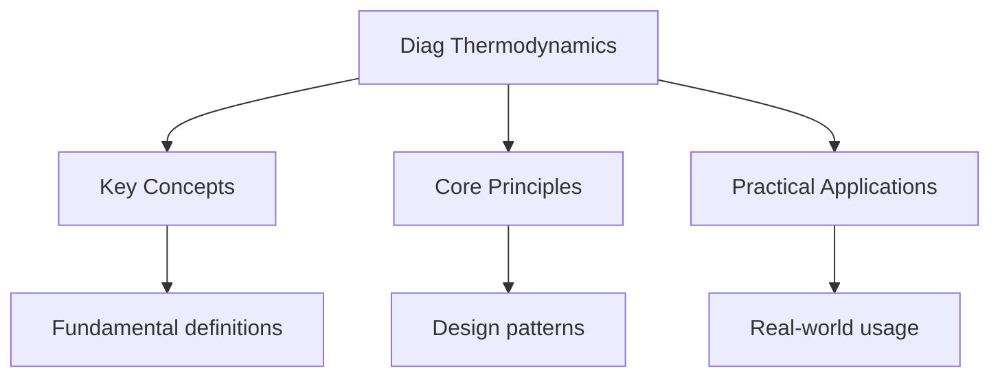

---

date: 2026-07-23T21:57:32+01:00
title: "Thermodynamics and Energetics -- Diagnostic Tests"
description: "A-Level Chemistry Thermodynamics and Energetics -- notes covering key definitions, core concepts, worked examples, and practice questions for revision."
tableOfContents: false
---

<!-- Breadcrumb Schema for SEO -->

## Intuition

**Thermodynamics is like a bank account for energy — you can’t create or destroy it, only transfer or transform it.**

## Thermodynamics and Energetics — Diagnostic Tests

## Unit Tests

### UT-1: Born-Haber Cycle for an Ionic Compound

**Question:**

Construct a Born-Haber cycle for magnesium oxide ($\text{MgO}$) and calculate the lattice energy.
Use the following data:

| Quantity                                               | Value / $\text{kJ mol}^{-1}$ |
| ------------------------------------------------------ | ---------------------------- |
| Enthalpy of atomisation of Mg                          | $+148$                       |
| Enthalpy of atomisation of O ($\frac{1}{2}\text{O}_2$) | $+249$                       |
| First ionisation energy of Mg                          | $+738$                       |
| Second ionisation energy of Mg                         | $+1451$                      |
| First electron affinity of O                           | $-141$                       |
| Second electron affinity of O                          | $+798$                       |
| Standard enthalpy of formation of MgO                  | $-602$                       |

**Solution:**

Born-Haber cycle (all values in $\text{kJ mol}^{-1}$):

$$\text{Mg}(s) + \tfrac{1}{2}\text{O}_2(g) \xrightarrow{\Delta H_f = -602} \text{Mg}^{2+}\text{O}^{2-}(s)$$

Two routes from elements to ionic solid:

**Route 1 (direct):** $\Delta H_f = -602$

**Route 2 (indirect via gaseous ions):**

1. Atomisation of Mg: $+148$
2. Atomisation of $\frac{1}{2}\text{O}_2$: $+249$
3. First ionisation of Mg: $+738$
4. Second ionisation of Mg: $+1451$
5. First electron affinity of O: $-141$
6. Second electron affinity of O: $+798$
7. Lattice energy (LE): $\Delta H_{\text{latt}}$

By Hess"s law: Route 1 = Route 2

$$-602 = 148 + 249 + 738 + 1451 - 141 + 798 + \Delta H_{\text{latt}}$$

$$-602 = 3243 + \Delta H_{\text{latt}}$$

$$\Delta H_{\text{latt}} = -602 - 3243 = -3845\,\text{kJ mol}^{-1}$$

The lattice energy of MgO is $-3845\,\text{kJ mol}^{-1}$.

**Note:** The large magnitude reflects the very strong electrostatic attraction between
$\text{Mg}^{2+}$ and $\text{O}^{2-}$ (high charges, small ions). The second electron affinity of
oxygen is endothermic because adding an electron to a negatively charged $\text{O}^-$ ion requires
energy to overcome repulsion.

---

<!-- Breadcrumb Schema for SEO -->

### UT-2: Hess's Law with Indirect Enthalpy Determination

**Question:**

The standard enthalpy change of combustion of ethanol is $-1367\,\text{kJ mol}^{-1}$. The standard
enthalpy change of combustion of carbon is $-394\,\text{kJ mol}^{-1}$ And the standard enthalpy
change of combustion of hydrogen is $-286\,\text{kJ mol}^{-1}$.

(a) Use Hess's law to calculate the standard enthalpy change of formation of ethanol,
$\text{C}_2\text{H}_5\text{OH}(l)$.

(b) The experimental value is $-277\,\text{kJ mol}^{-1}$. Suggest a reason why the calculated value
might differ from the experimental value.

**Solution:**

(a) Target equation:
$2\text{C}(s) + 3\text{H}_2(g) + \tfrac{1}{2}\text{O}_2(g) \to \text{C}_2\text{H}_5\text{OH}(l)$

Using the combustion data and Hess's law (elements to products via combustion products):

Formation = Sum of combustion of elements - Combustion of compound

$$\Delta H_f(\text{C}_2\text{H}_5\text{OH}) = 2 \times \Delta H_c(\text{C}) + 3 \times \Delta H_c(\text{H}_2) - \Delta H_c(\text{C}_2\text{H}_5\text{OH})$$

$$= 2 \times (-394) + 3 \times (-286) - (-1367)$$

$$= -788 - 858 + 1367$$

$$= -1646 + 1367 = -279\,\text{kJ mol}^{-1}$$

(b) The calculated value ($-279\,\text{kJ mol}^{-1}$) is close to but not identical to the
experimental value ($-277\,\text{kJ mol}^{-1}$). Small differences arise from:

- **Experimental uncertainties** in the combustion data used (each measurement has some error, which
  propagates through the calculation).
- **Incomplete combustion** in the experiments determining combustion enthalpies.
- **State differences**: The standard state of ethanol at $298\,\text{K}$ may not be exactly matched
  in the combustion experiment (e.g., trace water vapour vs liquid).
- **Heat losses** from the calorimeter during combustion measurements.

---

<!-- Breadcrumb Schema for SEO -->

### UT-3: Gibbs Free Energy and Spontaneity

**Question:**

For the decomposition of calcium carbonate:

$$\text{CaCO}_3(s) \to \text{CaO}(s) + \text{CO}_2(g)$$

$\Delta H^\circ = +178\,\text{kJ mol}^{-1}$, $\Delta S^\circ = +161\,\text{J K}^{-1}\text{ mol}^{-1}$.

(a) Calculate $\Delta G^\circ$ at $298\,\text{K}$ and state whether the reaction is spontaneous at
this temperature.

(b) Calculate the minimum temperature at which the reaction becomes thermodynamically feasible.

(c) Explain why the entropy change is positive for this reaction, even though a solid is being
converted to another solid and a gas.

**Solution:**

(a)

$$\Delta G^\circ = \Delta H^\circ - T\Delta S^\circ$$

$$\Delta G^\circ = 178000 - 298 \times 161 = 178000 - 47978 = +130022\,\text{J mol}^{-1} = +130\,\text{kJ mol}^{-1}$$

$\Delta G^\circ \gt 0$ So the reaction is **not spontaneous** at $298\,\text{K}$.

(b) The reaction becomes feasible when $\Delta G^\circ \leq 0$:

$$\Delta H^\circ - T\Delta S^\circ \leq 0$$

$$T \geq \frac{\Delta H^\circ}{\Delta S^\circ} = \frac{178000}{161} = 1106\,\text{K}$$

The minimum temperature is approximately $1106\,\text{K}$ ($833\,^\circ\text{C}$).

(c) The entropy change is positive because a **gas is produced** from a solid. Gases have much
higher entropy than solids (gas molecules have many more possible arrangements due to their freedom
of movement). The gain in entropy from creating 1 mol of $\text{CO}_2(g)$ more than compensates for
the fact that one solid ($\text{CaCO}_3$) is replaced by another solid ($\text{CaO}$). The overall
effect is an increase in disorder:

$$\Delta S^\circ = S^\circ(\text{CaO}) + S^\circ(\text{CO}_2) - S^\circ(\text{CaCO}_3)$$

The large positive entropy of $\text{CO}_2(g)$ (approximately
$214\,\text{J K}^{-1}\text{ mol}^{-1}$) compared to the solids drives the overall entropy change
positive.

## Integration Tests

### IT-1: Thermodynamic Feasibility of Industrial Processes (with Equilibrium)

**Question:**

The Contact process involves the oxidation of sulfur dioxide:

$$2\text{SO}_2(g) + \text{O}_2(g) \rightleftharpoons 2\text{SO}_3(g)$$

$\Delta H^\circ = -198\,\text{kJ mol}^{-1}$, $\Delta S^\circ = -190\,\text{J K}^{-1}\text{ mol}^{-1}$.

(a) Calculate the temperature above which the reaction is no longer thermodynamically feasible.

(b) Given that industrial conditions use $400$--$450\,^\circ\text{C}$Explain why this temperature
range is chosen despite the thermodynamic considerations.

(c) Calculate $\Delta G^\circ$ at $700\,\text{K}$ and hence calculate $K_p$ at this temperature.

**Solution:**

(a) The reaction ceases to be feasible when $\Delta G^\circ \gt 0$:

$$T \gt \frac{\Delta H^\circ}{\Delta S^\circ} = \frac{-198000}{-190} = 1042\,\text{K}$$

Above $1042\,\text{K}$ ($769\,^\circ\text{C}$), the reaction is no longer thermodynamically
spontaneous. The negative $\Delta S^\circ$ (3 mol gas $\to$ 2 mol gas) means that at high
temperatures, the $-T\Delta S^\circ$ term dominates and makes $\Delta G^\circ$ positive.

(b) At $400$--$450\,^\circ\text{C}$ ($673$--$723\,\text{K}$), the reaction is thermodynamically
feasible ($\Delta G^\circ \lt 0$ since $T \lt 1042\,\text{K}$). Although lower temperatures give a
more negative $\Delta G^\circ$ (higher equilibrium yield), the rate of reaction would be
impractically slow. $400$--$450\,^\circ\text{C}$ represents a compromise between thermodynamic yield
and kinetic rate. A vanadium(V) oxide catalyst is used to further increase the rate at these
temperatures.

(c) At $700\,\text{K}$:

$$\Delta G^\circ = -198000 - 700 \times (-190) = -198000 + 133000 = -65000\,\text{J mol}^{-1}$$

Using $\Delta G^\circ = -RT\ln K_p$:

$$-65000 = -8.31 \times 700 \times \ln K_p$$

$$\ln K_p = \frac{65000}{5817} = 11.17$$

$$K_p = e^{11.17} = 7.08 \times 10^4\,\text{atm}^{-1}$$

---

<!-- Breadcrumb Schema for SEO -->

### IT-2: Entropy Changes in Dissolution (with Bonding and Acids/Bases)

**Question:**

(a) Explain why the dissolution of $\text{NaCl}$ in water has a small positive entropy change, while
the dissolution of $\text{CaCO}_3$ in water is not thermodynamically feasible.

(b) The dissolution of ammonium nitrate in water is endothermic yet spontaneous. Use thermodynamic
arguments to explain this.

(c) Calculate the entropy change when $2.00\,\text{mol}$ of ice melts at $0\,^\circ\text{C}$. The
standard enthalpy of fusion of ice is $+6.01\,\text{kJ mol}^{-1}$.

**Solution:**

(a) For $\text{NaCl}$ dissolving: $\text{NaCl}(s) \to \text{Na}^+(aq) + \text{Cl}^-(aq)$

The entropy change involves competing factors:

- **Positive contribution:** The ordered ionic lattice breaks down, and ions become dispersed in
  solution (increased disorder)
- **Negative contribution:** Water molecules become more ordered around the hydrated ions (water
  molecules orient their partial charges towards the ions, restricting their freedom)

For $\text{NaCl}$The lattice breakdown slightly outweighs the ordering of water, giving a small
positive $\Delta S$.

For $\text{CaCO}_3$: $\text{CaCO}_3(s) \to \text{Ca}^{2+}(aq) + \text{CO}_3^{2-}(aq)$

The doubly-charged ions cause much more ordering of water molecules around them (stronger ion-dipole
interactions, more structured hydration shells). The negative contribution from water ordering
outweighs the positive contribution from lattice breakdown, giving a negative $\Delta S$. Combined
with the endothermic lattice breaking, $\Delta G$ is positive, making dissolution non-spontaneous.

(b) For $\text{NH}_4\text{NO}_3(s) \to \text{NH}_4^+(aq) + \text{NO}_3^-(aq)$:

The process is endothermic ($\Delta H \gt 0$), but the entropy change is strongly positive because:

- The ionic lattice breaks down completely
- Both ions are large and singly charged, so they cause relatively little ordering of water
- The ammonium ion can form hydrogen bonds but retains rotational freedom

The large positive $\Delta S$ makes $-T\Delta S$ more negative than $\Delta H$ is positive, giving
$\Delta G \lt 0$ (spontaneous). This demonstrates that enthalpy alone does not determine
spontaneity.

(c) At the melting point, $\Delta G = 0$ So $\Delta S = \Delta H/T$:

$$\Delta S = \frac{6010}{273} = 22.0\,\text{J K}^{-1}\text{ mol}^{-1}$$

For $2.00\,\text{mol}$:

$$\Delta S_{\text{total}} = 2.00 \times 22.0 = 44.0\,\text{J K}^{-1}$$

The positive entropy change reflects the increased disorder as water molecules in the rigid ice
lattice gain freedom of movement in liquid water.

---

<!-- Breadcrumb Schema for SEO -->

### IT-3: Enthalpy Changes and Bond Energies (with Kinetics)

**Question:**

The hydrogenation of ethene is:

$$\text{C}_2\text{H}_4(g) + \text{H}_2(g) \to \text{C}_2\text{H}_6(g) \quad \Delta H = -137\,\text{kJ mol}^{-1}$$

Bond enthalpies: C$=$C $= 612$C--C $= 348$C--H $= 412$H--H $= 436$ (all in $\text{kJ mol}^{-1}$).

(a) Use bond enthalpies to estimate $\Delta H$ for this reaction and explain why it differs from the
given value.

(b) Draw an enthalpy profile diagram for this reaction, labelling the activation energy $E_a$ and
the enthalpy change $\Delta H$.

(c) Explain why this reaction requires a catalyst despite being exothermic.

**Solution:**

(a) **Bonds broken:**

- 1 $\times$ C$=$C: $612$
- 4 $\times$ C--H (in $\text{C}_2\text{H}_4$): $4 \times 412 = 1648$
- 1 $\times$ H--H: $436$

Total bonds broken: $612 + 1648 + 436 = 2696\,\text{kJ mol}^{-1}$

**Bonds formed:**

- 1 $\times$ C--C: $348$
- 6 $\times$ C--H (in $\text{C}_2\text{H}_6$): $6 \times 412 = 2472$

Total bonds formed: $348 + 2472 = 2820\,\text{kJ mol}^{-1}$

$$\Delta H = 2696 - 2820 = -124\,\text{kJ mol}^{-1}$$

This differs from the experimental value of $-137\,\text{kJ mol}^{-1}$ because bond enthalpies are
**average values** taken from many different molecules. The actual C$=$C bond in ethene and C--C
bond in ethane may differ from the average values. Bond enthalpies apply to gaseous species only and
do not account for variations in bond strength due to the molecular environment.

(b) The enthalpy profile shows:

- Reactants ($\text{C}_2\text{H}_4 + \text{H}_2$) at a higher energy level
- Products ($\text{C}_2\text{H}_6$) at a lower energy level (exothermic,
  $\Delta H = -137\,\text{kJ mol}^{-1}$)
- A peak (transition state) above the reactants, with $E_a$ being the difference between the peak
  and the reactant energy level
- $\Delta H$ is the vertical difference between products and reactants

(c) Despite being exothermic ($\Delta H \lt 0$), the reaction has a significant activation energy
($E_a$). The H--H bond ($436\,\text{kJ mol}^{-1}$) and the C$=$C $\pi$-bond (part of the
$612\,\text{kJ mol}^{-1}$) must be broken before new bonds can form. At room temperature, very few
molecules have sufficient kinetic energy ($\geq E_a$) to overcome this barrier. A metal catalyst
(e.g., Ni, Pd, or Pt) provides an alternative pathway by adsorbing both $\text{H}_2$ and
$\text{C}_2\text{H}_4$ onto its surface, weakening the H--H bond and lowering the activation energy.

---

<!-- Breadcrumb Schema for SEO -->

### Additional Practice Problems

#### UT-4: Hess's Law with Combustion Data

**Question:** Use the following standard enthalpies of combustion to calculate the standard enthalpy
change for the hydrogenation of propene to propane:

$$\mathrm{C}_3\mathrm{H}_6(g) + \mathrm{H}_2(g) \to \mathrm{C}_3\mathrm{H}_8(g)$$

$\Delta H_c^\circ(\mathrm{C}_3\mathrm{H}_6) = -2058\,\mathrm{kJ\,mol^{-1}}$

$\Delta H_c^\circ(\mathrm{C}_3\mathrm{H}_8) = -2220\,\mathrm{kJ\,mol^{-1}}$

$\Delta H_c^\circ(\mathrm{H}_2) = -286\,\mathrm{kJ\,mol^{-1}}$

**Solution:**

Hess's Law cycle:

Reactants $\to$ Products $\to$ Combustion products ($\mathrm{CO}_2 + \mathrm{H}_2\mathrm{O}$)

Path 1 (indirect): Reactants $\to$ combustion products:
$\Delta H_c(\mathrm{C}_3\mathrm{H}_6) + \Delta H_c(\mathrm{H}_2) = -2058 + (-286) = -2344\,\mathrm{kJ\,mol^{-1}}$

Path 2 (via products): Products $\to$ combustion products:
$\Delta H_c(\mathrm{C}_3\mathrm{H}_8) = -2220\,\mathrm{kJ\,mol^{-1}}$

$$\Delta H^\circ = \text{Path 1} - \text{Path 2} = -2344 - (-2220) = -124\,\mathrm{kJ\,mol^{-1}}$$
(2 marks).

The hydrogenation is exothermic, as expected for converting a C=C double bond to two C--H single
bonds.

#### IT-4: Born-Haber and Entropy Combined

**Question:** Calculate the lattice energy of $\mathrm{CaF}_2$ using a Born-Haber cycle and the
following data:

| Quantity                                                               | Value (kJ mol$^{-1}$) |
| ---------------------------------------------------------------------- | --------------------- |
| $\Delta H_f^\circ(\mathrm{CaF}_2)$                                     | $-1220$               |
| $\Delta H_{\text{atom}}(\mathrm{Ca})$                                  | $+178$                |
| $\Delta H_{\text{atom}}(\mathrm{F}_2)$ (per $\frac{1}{2}\mathrm{F}_2$) | $+79$                 |
| First IE of Ca                                                         | $+590$                |
| Second IE of Ca                                                        | $+1145$               |
| Electron affinity of F                                                 | $-328$                |

**Solution:**

Born-Haber cycle for $\mathrm{CaF}_2$:

$$\Delta H_f^\circ = \Delta H_{\text{atom}}(\mathrm{Ca}) + \Delta H_{\text{atom}}(\mathrm{F}_2) \times 2 + \text{IE}_1 + \text{IE}_2 + \text{EA} \times 2 + \text{Lattice Energy}$$

$$-1220 = 178 + 79 \times 2 + 590 + 1145 + (-328) \times 2 + \text{LE}$$

$$-1220 = 178 + 158 + 590 + 1145 - 656 + \text{LE}$$

$$-1220 = 1415 + \text{LE}$$

$$\text{LE} = -1220 - 1415 = -2635\,\mathrm{kJ\,mol^{-1}}$$ (2 marks).

The large (negative) lattice energy reflects the high charges on $\mathrm{Ca}^{2+}$ and
$\mathrm{F}^-$ and the small ionic radii, both of which increase the electrostatic attraction in the
lattice (1 mark).

## Common Mistakes

**Confusing exothermic and endothermic bond-breaking:** Breaking bonds always requires energy (endothermic, $\Delta H > 0$). Forming bonds always releases energy (exothermic, $\Delta H < 0$). The sign of $\Delta H$ for a reaction depends on the balance between energy required to break bonds and energy released when new bonds form. Students often state that breaking bonds is exothermic.

**Forgetting the sign convention in Hess's law cycles:** When reversing an equation, reverse the sign of $\Delta H$. When adding equations, add their $\Delta H$ values. A common error is forgetting to reverse the sign when reversing an arrow in the cycle, leading to incorrect enthalpy changes.

**Confusing standard enthalpy of formation with standard enthalpy of combustion:** $\Delta H_f^\circ$ is the enthalpy change when 1 mol of a compound is formed from its elements in their standard states. $\Delta H_c^\circ$ is the enthalpy change when 1 mol of a substance is completely burned in excess oxygen. Using the wrong one in a Hess's law calculation gives the wrong answer.

## Cross-References

- **[Organic Chemistry](../organic-chemistry/introduction):** Organic chemistry covers carbon-based compounds and their reactions
- **[Physical Chemistry](../flashcards-physical-chemistry):** Physical chemistry underpins reaction rates, energetics, and equilibrium
- **[Atomic Structure](../flashcards-atomic-structure):** Atomic structure determines chemical bonding and reactivity
