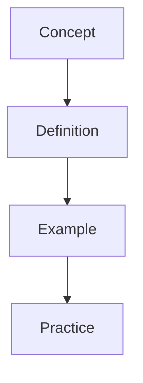

---

sources:
  - text: Standard textbook reference
title: "Diagnostics"
description: "Diagnostic test notes for alevel Diagnostics covering key concepts, worked examples, and practice problems for exam preparation."
date: 2026-01-01T00:00:00Z
---
sources:
  - text: Standard textbook reference

This section covers fundamental chemical principles, from atomic structure and bonding to reaction kinetics and equilibrium. Mastery of these concepts enables you to analyse quantitative problems and predict reaction outcomes systematically.

# Diagnostics

**Prerequisites:** Review the prerequisite topics before attempting this section.

## Topics

- [Diag Acids Bases](/chemistry/diagnostics/diag-acids-bases/)
- [Diag Alkanes Alkenes](/chemistry/diagnostics/diag-alkanes-alkenes/)
- [Diag Atomic Structure](/chemistry/diagnostics/diag-atomic-structure/)
- [Diag Bonding Structure](/chemistry/diagnostics/diag-bonding-structure/)
- [Diag Carbonyl Arenes Amines](/chemistry/diagnostics/diag-carbonyl-arenes-amines/)
- [Diag Electrochemistry](/chemistry/diagnostics/diag-electrochemistry/)
- [Diag Equilibrium](/chemistry/diagnostics/diag-equilibrium/)
- [Diag Halogenoalkanes Alcohols](/chemistry/diagnostics/diag-halogenoalkanes-alcohols/)
- [Diag Kinetics](/chemistry/diagnostics/diag-kinetics/)
- [Diag Organic Introduction](/chemistry/diagnostics/diag-organic-introduction/)
- [Diag Quantitative Chemistry](/chemistry/diagnostics/diag-quantitative-chemistry/)
- [Diag Thermodynamics](/chemistry/diagnostics/diag-thermodynamics/)
- [Diag Transition Metals](/chemistry/diagnostics/diag-transition-metals/)
- [Diagnostic Guide](/chemistry/diagnostics/diagnostic-guide/)

## Overview

This section provides comprehensive study materials and resources. Content is organised to build understanding progressively, from foundational concepts to advanced applications.

## Key Topics

- Core concepts and definitions
- Worked examples with step-by-step solutions
- Practice problems for self-assessment
- Cross-references to related topics

## Study Tips

Begin with the introductory material before progressing to advanced topics. Use the practice problems to test your understanding and identify areas for further study.

## Overview

This section provides comprehensive study materials and resources. Content is organised to build understanding progressively, from foundational concepts to advanced applications.

## Key Topics

- Core concepts and definitions
- Worked examples with step-by-step solutions
- Practice problems for self-assessment
- Cross-references to related topics

## Study Tips

Begin with the introductory material before progressing to advanced topics. Use the practice problems to test your understanding and identify areas for further study.

