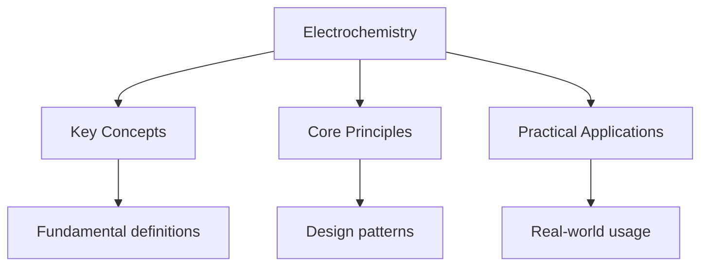

---

title: "Electrochemistry | A-Level - Wyatt's Notes"
description: "Comprehensive study notes for Electrochemistry with worked examples, practice problems, and key concepts for exam preparation."
date: 2026-04-21T00:00:00.000Z
tags:
  - Chemistry
  - ALevel
categories:
  - Chemistry

---

<!-- Breadcrumb Schema for SEO -->

## Electrochemistry

## Redox Reactions

### Oxidation States (Oxidation Numbers)

The oxidation state is a formalism that assigns a charge to an atom in a compound based on
electronegativity. The rules for assigning oxidation states:

1. The oxidation state of an uncombined element is zero.
2. The sum of oxidation states in a neutral compound is zero; in a polyatomic ion, it equals the ion
   charge.
3. Group 1 metals: $+1$. Group 2 metals: $+2$. Al: $+3$.
4. Hydrogen is $+1$ (except in metal hydrides, where it is $-1$).
5. Oxygen is $-2$ (except in peroxides, where it is $-1$ And in $\mathrm{OF}_2$Where it is $+2$).
6. Fluorine is always $-1$ in compounds.
7. Halogens are $-1$Except when bonded to more electronegative elements or in polyatomic ions.

**Worked Example.** Determine the oxidation state of $\mathrm{Cr}$ in
$\mathrm{K}_2\mathrm{Cr}_2\mathrm{O}_7$.

$$
2(+1) + 2x + 7(-2) = 0
$$

$$
2 + 2x - 14 = 0
$$

$$
2x = 12 \implies x = +6
$$

### Half-Equations

Redox reactions are split into two half-equations:

- **Oxidation:** loss of electrons (increase in oxidation state).
- **Reduction:** gain of electrons (decrease in oxidation state).

The mnemonic **OIL RIG**: Oxidation Is Loss, Reduction Is Gain.

### Balancing Half-Equations (in Acidic Conditions)

1. Balance all atoms except $\mathrm{O}$ and $\mathrm{H}$.
2. Balance $\mathrm{O}$ by adding $\mathrm{H}_2\mathrm{O}$.
3. Balance $\mathrm{H}$ by adding $\mathrm{H}^+$.
4. Balance charge by adding electrons ($e^-$).

**Example.** Balance $\mathrm{MnO}_4^- \to \mathrm{Mn}^{2+}$ in acidic solution.

1. $\mathrm{Mn}$ already balanced.
2. Add $\mathrm{H}_2\mathrm{O}$: $\mathrm{MnO}_4^- \to \mathrm{Mn}^{2+} + 4\mathrm{H}_2\mathrm{O}$.
3. Add $\mathrm{H}^+$:
   $\mathrm{MnO}_4^- + 8\mathrm{H}^+ \to \mathrm{Mn}^{2+} + 4\mathrm{H}_2\mathrm{O}$.
4. Balance charge: LHS = $-1 + 8 = +7$; RHS = $+2$. Add $5e^-$ to LHS:
   $\mathrm{MnO}_4^- + 8\mathrm{H}^+ + 5e^- \to \mathrm{Mn}^{2+} + 4\mathrm{H}_2\mathrm{O}$.

### Combining Half-Equations

Multiply each half-equation by an appropriate factor so that the electrons cancel, then add.

**Example.** Combine the above with $\mathrm{Fe}^{2+} \to \mathrm{Fe}^{3+} + e^-$:

$$
\mathrm{MnO}_4^- + 8\mathrm{H}^+ + 5e^- \to \mathrm{Mn}^{2+} + 4\mathrm{H}_2\mathrm{O}
$$

$$
5\mathrm{Fe}^{2+} \to 5\mathrm{Fe}^{3+} + 5e^-
$$

$$
\mathrm{MnO}_4^- + 8\mathrm{H}^+ + 5\mathrm{Fe}^{2+} \to \mathrm{Mn}^{2+} + 4\mathrm{H}_2\mathrm{O} + 5\mathrm{Fe}^{3+}
$$

## Standard Electrode Potentials ($E^\circ$)

### Definition

The **standard electrode potential** $E^\circ$ is the potential difference (voltage) of a half-cell
relative to the standard hydrogen electrode under standard conditions
($298\,\mathrm{K}$$100\,\mathrm{kPa}$$1\,\mathrm{mol/dm}^3$ solutions).

### The Standard Hydrogen Electrode (SHE)

The SHE is the reference electrode:

$$
2\mathrm{H}^+(aq, 1\,\mathrm{mol/dm}^3) + 2e^- \rightleftharpoons \mathrm{H}_2(g, 100\,\mathrm{kPa})
$$

By definition, $E^\circ(\mathrm{H}^+/\mathrm{H}_2) = 0.00\,\mathrm{V}$.

### Measuring Standard Electrode Potentials

To measure the $E^\circ$ of a half-cell, it is connected to the SHE, and the cell EMF is measured. A
salt bridge ( $\mathrm{KNO}_3$ solution) maintains electrical neutrality.

### The Electrochemical Series

| Half-equation                                                                                           | $E^\circ$ (V) |
| ------------------------------------------------------------------------------------------------------- | ------------- |
| $\mathrm{F}_2 + 2e^- \rightleftharpoons 2\mathrm{F}^-$                                                  | $+2.87$       |
| $\mathrm{MnO}_4^- + 8\mathrm{H}^+ + 5e^- \rightleftharpoons \mathrm{Mn}^{2+} + 4\mathrm{H}_2\mathrm{O}$ | $+1.51$       |
| $\mathrm{Cl}_2 + 2e^- \rightleftharpoons 2\mathrm{Cl}^-$                                                | $+1.36$       |
| $\mathrm{Ag}^+ + e^- \rightleftharpoons \mathrm{Ag}$                                                    | $+0.80$       |
| $\mathrm{Cu}^{2+} + 2e^- \rightleftharpoons \mathrm{Cu}$                                                | $+0.34$       |
| $2\mathrm{H}^+ + 2e^- \rightleftharpoons \mathrm{H}_2$                                                  | $0.00$        |
| $\mathrm{Fe}^{2+} + 2e^- \rightleftharpoons \mathrm{Fe}$                                                | $-0.44$       |
| $\mathrm{Zn}^{2+} + 2e^- \rightleftharpoons \mathrm{Zn}$                                                | $-0.76$       |
| $\mathrm{Na}^+ + e^- \rightleftharpoons \mathrm{Na}$                                                    | $-2.71$       |
| $\mathrm{Li}^+ + e^- \rightleftharpoons \mathrm{Li}$                                                    | $-3.04$       |

**Key observations:**

- More positive $E^\circ$: species is a stronger oxidising agent (more readily reduced).
- More negative $E^\circ$: species is a stronger reducing agent (more readily oxidised).
- A species can oxidise any species below it in the series (with more negative $E^\circ$).

## Cell EMF (Electromotive Force)

For an electrochemical cell consisting of two half-cells:

$$
E^\circ_\mathrm{cell} = E^\circ_\mathrm{reduction} - E^\circ_\mathrm{oxidation}
$$

Or equivalently:

$$
E^\circ_\mathrm{cell} = E^\circ_\mathrm{cathode} - E^\circ_\mathrm{anode}
$$

Where the cathode is the electrode where reduction occurs and the anode is where oxidation occurs.

**Worked Example.** Calculate the standard cell EMF for a $\mathrm{Zn}/\mathrm{Cu}$ cell.

$$
\mathrm{Zn}^{2+} + 2e^- \rightleftharpoons \mathrm{Zn} \quad E^\circ = -0.76\,\mathrm{V}
$$

$$
\mathrm{Cu}^{2+} + 2e^- \rightleftharpoons \mathrm{Cu} \quad E^\circ = +0.34\,\mathrm{V}
$$

$\mathrm{Zn}$ is oxidised (anode), $\mathrm{Cu}^{2+}$ is reduced (cathode).

$$
E^\circ_\mathrm{cell} = 0.34 - (-0.76) = +1.10\,\mathrm{V}
$$

### Feasibility of Reactions

A redox reaction is thermodynamically feasible if $E^\circ_\mathrm{cell} \gt 0$. This is equivalent
to $\Delta G^\circ \lt 0$:

$$
\Delta G^\circ = -nFE^\circ_\mathrm{cell}
$$

Where $n$ is the number of moles of electrons transferred and $F$ is the Faraday constant
($96485\,\mathrm{C/mol}$).

**Caveats:**

- $E^\circ_\mathrm{cell} \gt 0$ indicates thermodynamic feasibility, not necessarily a fast reaction
  (kinetic barriers may exist).
- Non-standard conditions (concentrations other than $1\,\mathrm{mol/dm}^3$) change the actual cell
  EMF via the Nernst equation (beyond A-Level but useful to note).

### The Nernst Equation

The Nernst equation relates the cell potential under non-standard conditions to the standard cell
potential:

$$
E = E^\circ - \frac{RT}{nF}\ln Q
$$

Where $Q$ is the reaction quotient (same form as the equilibrium expression but with initial
concentrations).

At $298\,\mathrm{K}$Substituting $R = 8.314\,\mathrm{J\,mol^{-1}\,K^{-1}}$ and
$F = 96485\,\mathrm{C/mol}$:

$$
E = E^\circ - \frac{0.0257}{n}\ln Q = E^\circ - \frac{0.0592}{n}\log_{10} Q
$$

**Worked Example.** Calculate the cell EMF for a $\mathrm{Zn}/\mathrm{Cu}$ cell where
$[\mathrm{Zn}^{2+}] = 0.010\,\mathrm{mol/dm}^3$ and $[\mathrm{Cu}^{2+}] = 2.0\,\mathrm{mol/dm}^3$ at
$298\,\mathrm{K}$.

$E^\circ_\mathrm{cell} = +1.10\,\mathrm{V}$ (from above). $n = 2$.

$$
Q = \frac{[\mathrm{Zn}^{2+}]}{[\mathrm{Cu}^{2+}]} = \frac{0.010}{2.0} = 0.005
$$

$$
E = 1.10 - \frac{0.0592}{2}\log_{10}(0.005) = 1.10 - 0.0296 \times (-2.30) = 1.10 + 0.068 = 1.17\,\mathrm{V}
$$

The non-standard cell EMF is higher than the standard value because the product ion
($\mathrm{Zn}^{2+}$) concentration is lower and the reactant ion ($\mathrm{Cu}^{2+}$) concentration
is higher than standard conditions, driving the reaction further to the right.

### Concentration Cells

A concentration cell consists of two half-cells with the same redox couple but different
concentrations. The cell EMF arises purely from the concentration difference:

$$
E_\mathrm{cell} = -\frac{0.0592}{n}\log_{10}\frac{[\mathrm{M}^{n+}]_\mathrm{dilute}}{[\mathrm{M}^{n+}]_\mathrm{concentrated}}
$$

**Example:** A $\mathrm{Cu}/\mathrm{Cu}^{2+}$ concentration cell with
$[\mathrm{Cu}^{2+}]_\mathrm{left} = 0.001\,\mathrm{mol/dm}^3$ and
$[\mathrm{Cu}^{2+}]_\mathrm{right} = 1.0\,\mathrm{mol/dm}^3$:

$$
E = -\frac{0.0592}{2}\log_{10}\frac{0.001}{1.0} = -0.0296 \times (-3) = +0.089\,\mathrm{V}
$$

The dilute half-cell acts as the anode (oxidation), and the concentrated half-cell acts as the
cathode (reduction). Equilibrium is reached when the concentrations equalise.

## Conventional Cell Representation

Cells are written as:

$$
\mathrm{Anode (oxidation)} \parallel \mathrm{Cathode (reduction)}
$$

Example:
$\mathrm{Zn}(s) \mid \mathrm{Zn}^{2+}(aq) \parallel \mathrm{Cu}^{2+}(aq) \mid \mathrm{Cu}(s)$

The single vertical line represents a phase boundary. The double vertical line represents the salt
bridge. The anode (oxidation) is written on the left; the cathode (reduction) on the right.

## Fuel Cells

A fuel cell converts the chemical energy of a fuel ( $\mathrm{H}_2$) directly into electrical
energy, continuously supplied from an external source.

### Hydrogen-Oxygen Fuel Cell

**Alkaline conditions:**

Anode (oxidation): $2\mathrm{H}_2 + 4\mathrm{OH}^- \to 4\mathrm{H}_2\mathrm{O} + 4e^-$

Cathode (reduction): $\mathrm{O}_2 + 2\mathrm{H}_2\mathrm{O} + 4e^- \to 4\mathrm{OH}^-$

Overall: $2\mathrm{H}_2 + \mathrm{O}_2 \to 2\mathrm{H}_2\mathrm{O}$

**Acidic conditions:**

Anode: $2\mathrm{H}_2 \to 4\mathrm{H}^+ + 4e^-$

Cathode: $\mathrm{O}_2 + 4\mathrm{H}^+ + 4e^- \to 2\mathrm{H}_2\mathrm{O}$

Overall: $2\mathrm{H}_2 + \mathrm{O}_2 \to 2\mathrm{H}_2\mathrm{O}$

**Advantages:** Higher efficiency than combustion; no pollution (only water as product); quiet
operation.

**Disadvantages:** Hydrogen storage and transport challenges; expensive catalysts (platinum);
limited infrastructure.

**Efficiency calculation:** The maximum theoretical efficiency of a fuel cell is:

$$
\text{Efficiency} = \frac{\Delta G^\circ}{\Delta H^\circ} \times 100
$$

For the $\mathrm{H}_2/\mathrm{O}_2$ fuel cell at $298\,\mathrm{K}$:

$$
\Delta G^\circ = -2 \times 237 = -474\,\mathrm{kJ/mol}, \quad \Delta H^\circ = -2 \times 286 = -572\,\mathrm{kJ/mol}
$$

$$
\text{Efficiency} = \frac{474}{572} \times 100 = 83\%
$$

In practice, efficiencies of 40--60% are achieved due to overpotentials (additional voltage required
beyond the theoretical value), internal resistance, and fuel crossover.

**Overpotential:** The actual operating voltage of a fuel cell is less than the theoretical
$E^\circ_\mathrm{cell} = 1.23\,\mathrm{V}$ for $\mathrm{H}_2/\mathrm{O}_2$. Typical operating
voltages are $0.6$--$0.8\,\mathrm{V}$. The difference is the overpotential, caused by kinetic
barriers at the electrodes (especially the oxygen reduction reaction at the cathode, which is
inherently slow).

### Other Fuel Cell Types

| Type                           | Fuel                              | Electrolyte                                            | Operating temp     | Application    |
| ------------------------------ | --------------------------------- | ------------------------------------------------------ | ------------------ | -------------- |
| PEM (proton exchange membrane) | $\mathrm{H}_2$                    | Solid polymer                                          | 80$^\circ$C        | Vehicles       |
| Alkaline (AFC)                 | $\mathrm{H}_2$                    | KOH solution                                           | 60--200$^\circ$C   | Space (Apollo) |
| Solid oxide (SOFC)             | $\mathrm{H}_2$CO, $\mathrm{CH}_4$ | Yttria-stabilised zirconia                             | 500--1000$^\circ$C | Power stations |
| Molten carbonate (MCFC)        | $\mathrm{H}_2$CO, $\mathrm{CH}_4$ | $\mathrm{Li}_2\mathrm{CO}_3/\mathrm{K}_2\mathrm{CO}_3$ | 650$^\circ$C       | Power stations |

Solid oxide fuel cells can use carbon monoxide and methane directly as fuels (internal reforming),
and their high operating temperature makes them suitable for combined heat and power systems.

### Batteries

**Lead-acid battery:**

Anode: $\mathrm{Pb}(s) + \mathrm{SO}_4^{2-}(aq) \to \mathrm{PbSO}_4(s) + 2e^-$

Cathode:
$\mathrm{PbO}_2(s) + \mathrm{SO}_4^{2-}(aq) + 4\mathrm{H}^+(aq) + 2e^- \to \mathrm{PbSO}_4(s) + 2\mathrm{H}_2\mathrm{O}(l)$

Overall:
$\mathrm{Pb} + \mathrm{PbO}_2 + 2\mathrm{H}_2\mathrm{SO}_4 \to 2\mathrm{PbSO}_4 + 2\mathrm{H}_2\mathrm{O}$

EMF $\approx 2\,\mathrm{V}$ per cell; six cells in series give $12\,\mathrm{V}$ car battery.

**Lithium-ion battery:**

Anode (oxidation): $\mathrm{LiCoO}_2 \to \mathrm{Li}_{1-x}\mathrm{CoO}_2 + x\mathrm{Li}^+ + xe^-$

Cathode (reduction): $\mathrm{C}_6 + x\mathrm{Li}^+ + xe^- \to \mathrm{Li}_x\mathrm{C}_6$

Lithium ions migrate between electrodes through an electrolyte. EMF $\approx 3.7\,\mathrm{V}$.

## Electrolysis

### Principles

Electrolysis uses electrical energy to drive a non-spontaneous redox reaction. The electrolyte is an
ionic compound, molten or in solution, that conducts electricity through the movement of ions.

- **Anode (+):** oxidation occurs; anions are attracted.
- **Cathode (-):** reduction occurs; cations are attracted.

### Products at Electrodes (Aqueous Solutions)

In aqueous solutions, both the cation and $\mathrm{H}^+$ (from water) can be reduced at the cathode,
and both the anion and $\mathrm{OH}^-$ (from water) can be oxidised at the anion. The species that
is more reduced/oxidised (higher/lower $E^\circ$) is preferentially discharged.

**At the cathode (reduction):**

If the metal is below hydrogen in the reactivity series (e.g.
$\mathrm{Cu}$$\mathrm{Ag}$$\mathrm{Au}$), the metal is deposited. If the metal is more reactive
(e.g. $\mathrm{Na}$$\mathrm{K}$$\mathrm{Mg}$), hydrogen is evolved:

$$
2\mathrm{H}_2\mathrm{O}(l) + 2e^- \to \mathrm{H}_2(g) + 2\mathrm{OH}^-(aq)
$$

**At the anode (oxidation):**

If the anion is a halide ($\mathrm{Cl}^-$$\mathrm{Br}^-$$\mathrm{I}^-$), the halogen is produced.
For all other anions (including $\mathrm{SO}_4^{2-}$$\mathrm{NO}_3^-$), oxygen is evolved from
water:

$$
4\mathrm{OH}^-(aq) \to \mathrm{O}_2(g) + 2\mathrm{H}_2\mathrm{O}(l) + 4e^-
$$

Or equivalently:

$$
2\mathrm{H}_2\mathrm{O}(l) \to \mathrm{O}_2(g) + 4\mathrm{H}^+(aq) + 4e^-
$$

### Faraday"s Laws

**First Law:** The mass of substance deposited or liberated at an electrode is directly proportional
to the quantity of electricity passed.

$$
M = \frac{Q \cdot M}{n \cdot F}
$$

**Second Law:** When the same quantity of electricity is passed through different electrolytes, the
masses of substances deposited are proportional to their equivalent masses ($M/n$Where $n$ is the
number of electrons transferred per ion).

$$
Q = I \times t
$$

Where $Q$ is charge in Coulombs, $I$ is current in Amperes, and $t$ is time in seconds.

$F = 96485\,\mathrm{C/mol}$ (Faraday constant) -- the charge carried by one mole of electrons.

**Worked Example.** Calculate the mass of copper deposited when a current of $2.50\,\mathrm{A}$ is
passed through $\mathrm{CuSO}_4$ solution for $30.0$ minutes.

$$
Q = 2.50 \times 30.0 \times 60 = 4500\,\mathrm{C}
$$

$$
N(e^-) = \frac{4500}{96485} = 0.0466\,\mathrm{mol}
$$

$$
\mathrm{Cu}^{2+} + 2e^- \to \mathrm{Cu}
$$

$$
N(\mathrm{Cu}) = \frac{0.0466}{2} = 0.0233\,\mathrm{mol}
$$

$$
M(\mathrm{Cu}) = 0.0233 \times 63.5 = 1.48\,\mathrm{g}
$$

Alternatively, using the formula directly:

$$
M = \frac{Q \cdot M}{n \cdot F} = \frac{4500 \times 63.5}{2 \times 96485} = \frac{285750}{192970} = 1.48\,\mathrm{g}
$$

## Corrosion and Its Prevention

### Rusting of Iron

Rusting is an electrochemical process requiring both water and oxygen:

**Anode (oxidation):** $\mathrm{Fe}(s) \to \mathrm{Fe}^{2+}(aq) + 2e^-$

**Cathode (reduction):**
$\mathrm{O}_2(g) + 2\mathrm{H}_2\mathrm{O}(l) + 4e^- \to 4\mathrm{OH}^-(aq)$

The $\mathrm{Fe}^{2+}$ is further oxidised and reacts with $\mathrm{OH}^-$ to form hydrated
iron(III) oxide (rust).

### Prevention Methods

| Method                     | Principle                                                                                                   |
| -------------------------- | ----------------------------------------------------------------------------------------------------------- |
| Painting / oiling          | Physical barrier to water and oxygen                                                                        |
| Galvanising (zinc coating) | Zinc acts as a sacrificial anode (more reactive than iron); even if scratched, zinc corrodes preferentially |
| Tin plating                | Physical barrier; if scratched, tin accelerates rusting (tin is less reactive than iron)                    |
| Sacrificial protection     | Attaching blocks of a more reactive metal (e.g. $\mathrm{Mg}$$\mathrm{Zn}$) to the iron structure           |
| Alloying (stainless steel) | Chromium forms a protective oxide layer                                                                     |

## Common Pitfalls

1. **Incorrect sign in the cell EMF formula.**
   $E^\circ_\mathrm{cell} = E^\circ_\mathrm{cathode} - E^\circ_\mathrm{anode}$. Subtracting in the
   wrong order gives a negative value.

2. **Confusing oxidation and reduction at the electrodes.** In electrolysis, the anode is positive
   (oxidation), cathode is negative (reduction). In a galvanic cell, the anode is negative
   (oxidation), cathode is positive (reduction). The signs are reversed.

3. **Forgetting to halve the Faraday calculation for divalent ions.** For $\mathrm{Cu}^{2+}$Two
   moles of electrons deposit one mole of copper.

4. **Incorrect half-equations for aqueous electrolysis.** Students often write the anion oxidation
   instead of water oxidation when the anion is not a halide.

5. **Stating that a reaction "will occur" based only on $E^\circ_\mathrm{cell} \gt 0$.**
   Thermodynamic feasibility does not guarantee kinetic viability. The reaction may be too slow to
   observe.

6. **Confusing $E^\circ_\mathrm{cell}$ with $E^\circ$ of individual half-cells.**
   $E^\circ_\mathrm{cell} = E^\circ_\mathrm{cathode} - E^\circ_\mathrm{anode}$. Always subtract the
   anode potential from the cathode potential.

7. **Forgetting that the SHE is defined at specific conditions.** The standard hydrogen electrode
   operates at $298\,\mathrm{K}$$100\,\mathrm{kPa}$ $\mathrm{H}_2$ pressure, and
   $1.0\,\mathrm{mol/dm}^3$ $\mathrm{H}^+$ concentration. Any deviation requires the Nernst
   equation.

## Electrochemical Series and Predicting Reactions

### Using $E^\circ$ to Predict Spontaneity

A redox reaction is thermodynamically feasible if $E^\circ_\mathrm{cell} \gt 0$ (i.e.
$\Delta G^\circ \lt 0$). However:

1. A positive $E^\circ_\mathrm{cell}$ indicates thermodynamic feasibility, not kinetic likelihood.
   Some reactions with positive $E^\circ_\mathrm{cell}$ are extremely slow (e.g. $\mathrm{H}_2$ +
   $\mathrm{O}_2$ at room temperature).
2. The reaction may require a catalyst, activation energy, or specific conditions to proceed at an
   appreciable rate.
3. Non-standard conditions can reverse the feasibility (use the Nernst equation).

### Disproportionation and Comproportionation

**Disproportionation:** A species in an intermediate oxidation state simultaneously oxidises and
reduces itself:

$$
2\mathrm{Cu}^+(aq) \to \mathrm{Cu}(s) + \mathrm{Cu}^{2+}(aq)
$$

Check feasibility:
$E^\circ_\mathrm{cell} = E^\circ(\mathrm{Cu}^+/\mathrm{Cu}) - E^\circ(\mathrm{Cu}^{2+}/\mathrm{Cu}^+) = 0.52 - 0.15 = +0.37\,\mathrm{V}$.
Spontaneous. $\mathrm{Cu}^+$ disproportionates in aqueous solution.

**Comproportionation:** The reverse of disproportionation. Two species in different oxidation states
react to form a species in an intermediate state:

$$
\mathrm{Fe}(s) + 2\mathrm{Fe}^{3+}(aq) \to 3\mathrm{Fe}^{2+}(aq)
$$

## Standard Electrode Potential Data Table

| Half-equation                                                                                                           | $E^\circ$ (V)          |
| ----------------------------------------------------------------------------------------------------------------------- | ---------------------- |
| $\mathrm{F}_2 + 2e^- \rightleftharpoons 2\mathrm{F}^-$                                                                  | $+2.87$                |
| $\mathrm{MnO}_4^- + 8\mathrm{H}^+ + 5e^- \rightleftharpoons \mathrm{Mn}^{2+} + 4\mathrm{H}_2\mathrm{O}$                 | $+1.51$                |
| $\mathrm{Cl}_2 + 2e^- \rightleftharpoons 2\mathrm{Cl}^-$                                                                | $+1.36$                |
| $\mathrm{Cr}_2\mathrm{O}_7^{2-} + 14\mathrm{H}^+ + 6e^- \rightleftharpoons 2\mathrm{Cr}^{3+} + 7\mathrm{H}_2\mathrm{O}$ | $+1.33$                |
| $\mathrm{O}_2 + 4\mathrm{H}^+ + 4e^- \rightleftharpoons 2\mathrm{H}_2\mathrm{O}$                                        | $+1.23$                |
| $\mathrm{Br}_2 + 2e^- \rightleftharpoons 2\mathrm{Br}^-$                                                                | $+1.07$                |
| $\mathrm{NO}_3^- + 4\mathrm{H}^+ + 3e^- \rightleftharpoons \mathrm{NO} + 2\mathrm{H}_2\mathrm{O}$                       | $+0.96$                |
| $\mathrm{Ag}^+ + e^- \rightleftharpoons \mathrm{Ag}$                                                                    | $+0.80$                |
| $\mathrm{Fe}^{3+} + e^- \rightleftharpoons \mathrm{Fe}^{2+}$                                                            | $+0.77$                |
| $\mathrm{I}_2 + 2e^- \rightleftharpoons 2\mathrm{I}^-$                                                                  | $+0.54$                |
| $\mathrm{Cu}^+ + e^- \rightleftharpoons \mathrm{Cu}$                                                                    | $+0.52$                |
| $\mathrm{O}_2 + 2\mathrm{H}_2\mathrm{O} + 4e^- \rightleftharpoons 4\mathrm{OH}^-$                                       | $+0.40$                |
| $\mathrm{Cu}^{2+} + 2e^- \rightleftharpoons \mathrm{Cu}$                                                                | $+0.34$                |
| $2\mathrm{H}^+ + 2e^- \rightleftharpoons \mathrm{H}_2$                                                                  | $0.00$ (by definition) |
| $\mathrm{Pb}^{2+} + 2e^- \rightleftharpoons \mathrm{Pb}$                                                                | $-0.13$                |
| $\mathrm{Sn}^{2+} + 2e^- \rightleftharpoons \mathrm{Sn}$                                                                | $-0.14$                |
| $\mathrm{Ni}^{2+} + 2e^- \rightleftharpoons \mathrm{Ni}$                                                                | $-0.25$                |
| $\mathrm{Fe}^{2+} + 2e^- \rightleftharpoons \mathrm{Fe}$                                                                | $-0.44$                |
| $\mathrm{Zn}^{2+} + 2e^- \rightleftharpoons \mathrm{Zn}$                                                                | $-0.76$                |
| $\mathrm{Al}^{3+} + 3e^- \rightleftharpoons \mathrm{Al}$                                                                | $-1.66$                |
| $\mathrm{Mg}^{2+} + 2e^- \rightleftharpoons \mathrm{Mg}$                                                                | $-2.37$                |
| $\mathrm{Na}^+ + e^- \rightleftharpoons \mathrm{Na}$                                                                    | $-2.71$                |
| $\mathrm{Ca}^{2+} + 2e^- \rightleftharpoons \mathrm{Ca}$                                                                | $-2.87$                |
| $\mathrm{K}^+ + e^- \rightleftharpoons \mathrm{K}$                                                                      | $-2.93$                |
| $\mathrm{Li}^+ + e^- \rightleftharpoons \mathrm{Li}$                                                                    | $-3.04$                |

## Electrolysis in Industry

### Extraction of Aluminium (Hall-Heroult Process)

- **Ore:** Bauxite ($\mathrm{Al}_2\mathrm{O}_3$), purified to alumina.
- **Electrolyte:** Molten cryolite ($\mathrm{Na}_3\mathrm{AlF}_6$) at approximately
  $950^\circ\mathrm{C}$. Cryolite lowers the melting point of $\mathrm{Al}_2\mathrm{O}_3$ from
  $2072^\circ\mathrm{C}$ to approximately $950^\circ\mathrm{C}$Making the process economically
  viable.
- **Electrodes:** Carbon (graphite) anode and cathode.

Cathode: $\mathrm{Al}^{3+} + 3e^- \to \mathrm{Al}(l)$

Anode: $2\mathrm{O}^{2-} \to \mathrm{O}_2 + 4e^-$

The oxygen reacts with the carbon anode: $\mathrm{C} + \mathrm{O}_2 \to \mathrm{CO}_2$. The anode is
consumed and must be regularly replaced.

### Electroplating

Electroplating deposits a thin layer of a metal onto a conductive surface. The object to be plated
is the cathode, the plating metal is the anode, and the electrolyte contains ions of the plating
metal.

**Example:** Copper plating of a steel spoon.

- Cathode (spoon): $\mathrm{Cu}^{2+}(aq) + 2e^- \to \mathrm{Cu}(s)$
- Anode (copper): $\mathrm{Cu}(s) \to \mathrm{Cu}^{2+}(aq) + 2e^-$
- Electrolyte: $\mathrm{CuSO}_4(aq)$

The concentration of $\mathrm{Cu}^{2+}$ in solution remains constant because the anode dissolves at
the same rate as the cathode deposits copper.

## Practice Problems

Problem 1

Use standard electrode potentials to determine whether $\mathrm{Br}_2$ can oxidise
$\mathrm{Fe}^{2+}$ to $\mathrm{Fe}^{3+}$.

Given: $\mathrm{Br}_2 + 2e^- \rightleftharpoons 2\mathrm{Br}^-$ ($E^\circ = +1.07\,\mathrm{V}$),
$\mathrm{Fe}^{3+} + e^- \rightleftharpoons \mathrm{Fe}^{2+}$ ($E^\circ = +0.77\,\mathrm{V}$).

**Solution:**

$\mathrm{Br}_2$ would be reduced (cathode), $\mathrm{Fe}^{2+}$ would be oxidised (anode).

$$
E^\circ_\mathrm{cell} = 1.07 - 0.77 = +0.30\,\mathrm{V}
$$

Since $E^\circ_\mathrm{cell} \gt 0$The reaction is thermodynamically feasible.

Problem 2

How long must a current of $5.00\,\mathrm{A}$ pass through molten $\mathrm{Al}_2\mathrm{O}_3$ to
produce $10.0\,\mathrm{g}$ of aluminium?

**Solution:**

$$
\mathrm{Al}^{3+} + 3e^- \to \mathrm{Al}
$$

$$
N(\mathrm{Al}) = \frac{10.0}{27.0} = 0.370\,\mathrm{mol}
$$

$$
N(e^-) = 3 \times 0.370 = 1.111\,\mathrm{mol}
$$

$$
Q = 1.111 \times 96485 = 107,200\,\mathrm{C}
$$

$$
T = \frac{Q}{I} = \frac{107200}{5.00} = 21440\,\mathrm{s} = 357\,\mathrm{minutes} = 5.96\,\mathrm{hours}
$$

Problem 3

A voltaic cell is constructed from a $\mathrm{Zn}(s) \mid \mathrm{Zn}^{2+}(aq)$ half-cell and an
$\mathrm{Ag}(s) \mid \mathrm{Ag}^+(aq)$ half-cell. Calculate the standard cell EMF, write the
conventional cell representation, and determine $\Delta G^\circ$.

Given:
$E^\circ(\mathrm{Zn}^{2+}/\mathrm{Zn}) = -0.76\,\mathrm{V}$$E^\circ(\mathrm{Ag}^+/\mathrm{Ag}) = +0.80\,\mathrm{V}$.

**Solution:**

$\mathrm{Zn}$ has the more negative $E^\circ$ So it is oxidised (anode). $\mathrm{Ag}^+$ is reduced
(cathode).

$E^\circ_\mathrm{cell} = E^\circ_\mathrm{cathode} - E^\circ_\mathrm{anode} = 0.80 - (-0.76) = +1.56\,\mathrm{V}$

Conventional cell representation:

$$
\mathrm{Zn}(s) \mid \mathrm{Zn}^{2+}(aq) \parallel \mathrm{Ag}^+(aq) \mid \mathrm{Ag}(s)
$$

Half-equations:

Anode: $\mathrm{Zn}(s) \to \mathrm{Zn}^{2+}(aq) + 2e^-$

Cathode: $\mathrm{Ag}^+(aq) + e^- \to \mathrm{Ag}(s)$

Overall (multiplying the cathode equation by 2):
$\mathrm{Zn}(s) + 2\mathrm{Ag}^+(aq) \to \mathrm{Zn}^{2+}(aq) + 2\mathrm{Ag}(s)$

$n = 2$ electrons transferred.

$$
\Delta G^\circ = -nFE^\circ_\mathrm{cell} = -2 \times 96485 \times 1.56 = -301,000\,\mathrm{J/mol} = -301\,\mathrm{kJ/mol}
$$

The large negative $\Delta G^\circ$ confirms that the reaction is strongly spontaneous under
standard conditions.

Problem 4

In the electrolysis of aqueous $\mathrm{CuSO}_4$ using inert platinum electrodes: (a) Identify the
products at each electrode. (b) Write half-equations. (c) Calculate the volume of gas produced at
the anode when a current of $0.50\,\mathrm{A}$ passes for 1 hour at $298\,\mathrm{K}$ and
$100\,\mathrm{kPa}$.

**Solution:**

(a) At the cathode: $\mathrm{Cu}^{2+}$ is below hydrogen in the reactivity series, so copper is
deposited (not hydrogen). At the anode: $\mathrm{SO}_4^{2-}$ is not a halide, so oxygen is evolved
from water.

(b) Cathode: $\mathrm{Cu}^{2+}(aq) + 2e^- \to \mathrm{Cu}(s)$

Anode: $4\mathrm{OH}^-(aq) \to \mathrm{O}_2(g) + 2\mathrm{H}_2\mathrm{O}(l) + 4e^-$

(c) $Q = 0.50 \times 3600 = 1800\,\mathrm{C}$

$n(e^-) = 1800 / 96485 = 0.01866\,\mathrm{mol}$

From the anode half-equation, 4 moles of electrons produce 1 mole of $\mathrm{O}_2$:

$n(\mathrm{O}_2) = 0.01866 / 4 = 0.00467\,\mathrm{mol}$

Using $pV = nRT$:

$$
V = \frac{nRT}{p} = \frac{0.00467 \times 8.314 \times 298}{100 \times 10^3} = \frac{11.57}{100000} = 1.16 \times 10^{-4}\,\mathrm{m}^3 = 0.116\,\mathrm{dm}^3 = 116\,\mathrm{cm}^3
$$

Problem 5

A concentration cell is constructed with two $\mathrm{Cu}$ electrodes. One half-cell contains
$\mathrm{Cu}^{2+}$ at $1.00\,\mathrm{mol/dm}^3$ and the other contains $\mathrm{Cu}^{2+}$ at
$0.00100\,\mathrm{mol/dm}^3$ at $298\,\mathrm{K}$.

(a) Write the conventional cell representation. (b) Calculate $E_\mathrm{cell}$ using the Nernst
equation. (c) Identify the anode and cathode and explain the direction of electron flow.

**Solution:**

(a)

$$
\mathrm{Cu}(s) \mid \mathrm{Cu}^{2+}(0.00100\,\mathrm{mol/dm}^3) \parallel \mathrm{Cu}^{2+}(1.00\,\mathrm{mol/dm}^3) \mid \mathrm{Cu}(s)
$$

(b) The overall reaction is:

$$
\mathrm{Cu}^{2+}(\text{concentrated}) + \mathrm{Cu}(s) \rightleftharpoons \mathrm{Cu}(s) + \mathrm{Cu}^{2+}(\text{dilute})
$$

Using the Nernst equation:

$$
E_\mathrm{cell} = E^\circ_\mathrm{cell} - \frac{RT}{nF}\ln Q = 0 - \frac{RT}{2F}\ln\frac{[\mathrm{Cu}^{2+}]_\mathrm{dilute}}{[\mathrm{Cu}^{2+}]_\mathrm{concentrated}}
$$

$$
E_\mathrm{cell} = -\frac{0.02569}{2}\ln\frac{0.00100}{1.00} = -0.01285 \times \ln(10^{-3}) = -0.01285 \times (-6.908) = +0.0888\,\mathrm{V}
$$

(c) The half-cell with the lower concentration ($0.00100\,\mathrm{mol/dm}^3$) is the anode
(oxidation: $\mathrm{Cu} \to \mathrm{Cu}^{2+} + 2e^-$). The half-cell with the higher concentration
($1.00\,\mathrm{mol/dm}^3$) is the cathode (reduction: $\mathrm{Cu}^{2+} + 2e^- \to \mathrm{Cu}$).
Electrons flow from the dilute side (anode) to the concentrated side (cathode).

Problem 6

In the electrolysis of molten $\mathrm{NaCl}$A current of $2.00\,\mathrm{A}$ is passed for 2.00
hours. Calculate: (a) The mass of sodium produced at the cathode. (b) The volume of chlorine gas
produced at the anode at $298\,\mathrm{K}$ and $100\,\mathrm{kPa}$.

**Solution:**

(a) Cathode: $\mathrm{Na}^+ + e^- \to \mathrm{Na}(l)$. $n = 1$.

$Q = It = 2.00 \times 7200 = 14400\,\mathrm{C}$

$n(e^-) = 14400/96485 = 0.1493\,\mathrm{mol}$

$n(\mathrm{Na}) = 0.1493\,\mathrm{mol}$ (1 electron per Na atom)

$m(\mathrm{Na}) = 0.1493 \times 22.99 = 3.43\,\mathrm{g}$

(b) Anode: $2\mathrm{Cl}^- \to \mathrm{Cl}_2 + 2e^-$. $n = 2$.

$n(\mathrm{Cl}_2) = 0.1493/2 = 0.0747\,\mathrm{mol}$

$V = nRT/p = 0.0747 \times 8.314 \times 298 / (100 \times 10^3) = 1.85 \times 10^{-3}\,\mathrm{m}^3 = 1.85\,\mathrm{dm}^3$

## Advanced Electrochemistry

### Standard Electrode Potentials and Feasibility

The standard electrode potential of a cell indicates whether a redox reaction is feasible:

$$E^\circ_\mathrm{cell} = E^\circ_\mathrm{cathode} - E^\circ_\mathrm{anode}$$

If $E^\circ_\mathrm{cell} > +0.27\,\mathrm{V}$The reaction is considered thermodynamically feasible
(proceeds to a significant extent) under standard conditions. If
$E^\circ_\mathrm{cell} < +0.27\mathrm{V}$The equilibrium lies to the left and the reaction does not
proceed significantly.

### Worked Example: Predicting Redox Reactions

Will $\mathrm{Zn}$ displace $\mathrm{Cu}$ from $\mathrm{CuSO}_4$ solution?

Half-equations:

- $\mathrm{Zn}^{2+} + 2e^- \rightleftharpoons \mathrm{Zn}$, $E^\circ = -0.76\,\mathrm{V}$
- $\mathrm{Cu}^{2+} + 2e^- \rightleftharpoons \mathrm{Cu}$, $E^\circ = +0.34\mathrm{V}$

Zinc is the more reactive metal (more negative $E^\circ$), so it will be oxidised (anode). Copper
ions will be reduced (cathode).

$$E^\circ_\mathrm{cell} = 0.34 - (-0.76) = +1.10\,\mathrm{V}$$

Since $E^\circ_\mathrm{cell} > +0.27\,\mathrm{V}$The reaction is feasible:

$$\mathrm{Zn}(s) + \mathrm{Cu}^{2+}(aq) \to \mathrm{Zn}^{2+}(aq) + \mathrm{Cu}(s)$$

### Worked Example: Non-Standard Conditions (Nernst Equation)

The Nernst equation calculates the cell potential under non-standard conditions:

$$E = E^\circ - \frac{RT}{nF}\ln Q$$

Where $Q$ is the reaction quotient.

**Calculate the cell potential for
$\mathrm{Zn}|\mathrm{Zn}^{2+}(0.010\,\mathrm{mol\,dm^{-3})||\mathrm{Cu}^{2+}(0.001\,\mathrm{mol\,dm^{-3})|\mathrm{Cu}$
at $298\,\mathrm{K}$.**

$$E^\circ_\mathrm{cell} = 0.34 - (-0.76) = 1.10\,\mathrm{V}$$

$$Q = \frac{[\mathrm{Cu}^{2+}]}{[\mathrm{Zn}^{+}]} = \frac{0.001}{0.010} = 0.10$$

$$E = 1.10 - \frac{8.314 \times 298}{2 \times 96485}\ln(0.10)$$

$$= 1.10 - \frac{2478}{192970}\ln(0.10)$$

$$= 1.10 - 0.01284 \times (-2.303)$$

$$= 1.10 + 0.0296 = 1.13\,\mathrm{V}$$

The cell potential is slightly higher than $E^\circ$ because the lower product concentration
([Cu2+]) drives the reaction further to the right.

### Storage Cells and Fuel Cells

**Lead-acid accumulator:**

- Anode (discharge):
  $\mathrm{Pb}(s) + \mathrm{SO}_4^{2-}(aq) \rightleftharpoons \mathrm{PbSO}_4(s) + 2e^-$,
  $E^\circ = -0.36\,\mathrm{V}$
- Cathode (discharge):
  $\mathrm{PbO}_2(s) + \mathrm{SO}_4^{2-}(aq) + 4\mathrm{H}^+(aq) + 2e^- \rightleftharpoons \mathrm{PbSO}_4(s) + 2\mathrm{H}_2\mathrm{O}(l)$,
  $E^\circ = +1.69\mathrm{V}$

$E^\circ_\mathrm{cell} = 1.69 - (-0.36) = 2.05\,\mathrm{V}$

During charging, the reactions are reversed.

**Hydrogen fuel cell:**

- Anode: $2\mathrm{H}_2 + 2\mathrm{H}_2\mathrm{O} \to 4\mathrm{H}^+ + 4e^-$
- Cathode: $\mathrm{O}_2 + 4\mathrm{H}^+ + 4e^- \to 2\mathrm{H}_2\mathrm{O}$

Overall: $2\mathrm{H}_2 + \mathrm{O}_2 \to 2\mathrm{H}_2\mathrm{O}$

$E^\circ_\mathrm{cell} = 1.23\,\mathrm{V}$ (theoretical). Practical voltage is lower due to
overpotentials and internal resistance.

### Electrolysis: Quantitative Analysis

**Worked Example:** How long does it take to deposit $0.500\,\mathrm{g}$ of nickel from
$\mathrm{NiSO}_4$ solution using a current of $2.50\,\mathrm{A}$?

$$\mathrm{Ni}^{2+} + 2e^- \to \mathrm{Ni}$$

$$n(\mathrm{Ni}) = \frac{m}{M} = \frac{0.500}{58.69} = 0.00852\,\mathrm{mol}$$

$$Q = n \times z \times F = 0.00852 \times 2 \times 96485 = 1643\,\mathrm{C}$$

$$t = \frac{Q}{I} = \frac{1643}{2.50} = 657\,\mathrm{s} = 11.0\,\mathrm{min}$$

### Electrochemical Series and Displacement Reactions

The electrochemical series arranges species in order of their standard electrode potentials:

| Species                        | $E^\circ$ (V) |
| ------------------------------ | ------------- |
| $\mathrm{Li}^+/\mathrm{Li}$    | $-3.03$       |
| $\mathrm{K}^+/\mathrm{K}$      | $-2.93$       |
| $\mathrm{Na}^+/\mathrm{Na}$    | $-2.71$       |
| $\mathrm{Mg}^{2+}/\mathrm{Mg}$ | $-2.37$       |
| $\mathrm{Al}^{3+}/\mathrm{Al}$ | $-1.66$       |
| $\mathrm{Zn}^{2+}/\mathrm{Zn}$ | $-0.76$       |
| $\mathrm{Fe}^{2+}/\mathrm{Fe}$ | $-0.44$       |
| $\mathrm{Ni}^{2+}/\mathrm{Ni}$ | $-0.25$       |
| $\mathrm{Sn}^{2+}/\mathrm{Sn}$ | $-0.14$       |
| $\mathrm{Pb}^{2+}/\mathrm{Pb}$ | $-0.13$       |
| $2\mathrm{H}^+/\mathrm{H}_2$   | $0.00$        |
| $\mathrm{Cu}^{2+}/\mathrm{Cu}$ | $+0.34$       |
| $\mathrm{I}_2/\mathrm{I}^-$    | $+0.54$       |
| $\mathrm{Ag}^+/\mathrm{Ag}$    | $+0.80$       |
| $\mathrm{Br}_2/\mathrm{Br}^-$  | $+1.07$       |
| $\mathrm{Cl}_2/\mathrm{Cl}^-$  | $+1.36$       |
| $\mathrm{F}_2/\mathrm{F}^-$    | $+2.87$       |

A species will reduce any species below it in the series (more negative $E^\circ$). A species will
be oxidised by any species above it (more positive $E^\circ$).

## Exam-Style Questions with Full Mark Schemes

Q1 (5 marks)

A voltaic cell is constructed using the half-cells $\mathrm{Fe}^{2+}|\mathrm{Fe}$
($E^\circ = -0.44\,\mathrm{V}$) and $\mathrm{Ag}^+|\mathrm{Ag}$ ($E^\circ = +0.80\,\mathrm{V}$).

(a) Write the overall cell equation. (2 marks)

(b) Calculate $E^\circ_\mathrm{cell}$. (1 mark)

(c) Identify the anode and cathode. (2 marks)

**Mark Scheme:**

(a) $\mathrm{Fe}(s) + 2\mathrm{Ag}^+(aq) \to \mathrm{Fe}^{2+}(aq) + 2\mathrm{Ag}(s)$ (1 mark for
correct equation, 1 mark for balancing).

(b) $E^\circ_\mathrm{cell} = 0.80 - (-0.44) = +1.24\,\mathrm{V}$ (1 mark).

(c) Anode = Fe electrode (oxidation occurs; Fe is oxidised to $\mathrm{Fe}^{2+}$) (1 mark). Cathode
= Ag electrode (reduction occurs; $\mathrm{Ag}^+$ is reduced to Ag) (1 mark).

Q2 (6 marks)

In the electrolysis of molten $\mathrm{PbBr}_2$ using inert electrodes:

(a) Write the half-equations at each electrode. (2 marks)

(b) Explain why the electrolyte must be molten rather than aqueous. (2 marks)

(c) Calculate the volume of bromine gas produced at the anode when a current of $0.500\,\mathrm{A}$
is passed for 30.0 minutes at $298\,\mathrm{K}$ and $101\,\mathrm{kPa}$. (2 marks)

**Mark Scheme:**

(a) Cathode: $\mathrm{Pb}^{2+} + 2e^- \to \mathrm{Pb}(l)$ (1 mark). Anode:
$2\mathrm{Br}^- \to \mathrm{Br}_2(g) + 2e^-$ (1 mark).

(b) In aqueous solution, water would be preferentially discharged at the cathode ($\mathrm{H}^+$ is
reduced before $\mathrm{Pb}^{2+}$) and at the anode ($\mathrm{OH}^-$ is oxidised before
$\mathrm{Br}^-$ in dilute solution). Molten $\mathrm{PbBr}_2$ ensures only $\mathrm{Pb}^{2+}$ and
$\mathrm{Br}^-$ ions are present (1 mark).

(c) $Q = It = 0.500 \times 1800 = 900\,\mathrm{C}$ (0.5 mark).
$n(e^-) = 900/96485 = 0.00933\,\mathrm{mol}$ (0.5 marks).
$n(\mathrm{Br}_2) = 0.00933/2 = 0.00467\,\mathrm{mol}$ (0.5 marks).
$V = nRT/p = 0.00467 \times 8.314 \times 298 / 101000 = 0.114\,\mathrm{dm}^3 = 114\,\mathrm{cm}^3$
(0.5 marks).

Q3 (4 marks)

State and explain two differences between a primary cell and a secondary cell.

**Mark Scheme:**

1. A primary cell is not rechargeable; a secondary cell is rechargeable (1 mark). Primary cells
   produce electricity from irreversible chemical reactions; secondary cells can have the reactions
   reversed by applying an external voltage (1 mark).

2. Primary cells have a limited lifetime (until the reactants are consumed); secondary cells can be
   recharged many times (1 mark). Secondary cells are more expensive initially but more
   cost-effective over their lifetime (1 mark).

---

<!-- Breadcrumb Schema for SEO -->

:::tip
questions within the A-Level specification for this topic, each with a full worked solution.

**Unit tests** probe edge cases and common misconceptions. **Integration tests** combine
Electrochemistry with other chemistry topics to test synthesis under exam conditions.

See for instructions on
self-marking and building a personal test matrix.

## Intuition

**Electrochemistry is like a conversation between electricity and chemistry — electrons flowing to create or consume reactions.**

## Summary

This topic covers the essential chemistry of electrochemistry, including key reactions, underlying
theories, and practical applications.

**Key concepts include:**

- standard electrode potentials
- electrochemical cells
- electrolysis and Faraday"s laws
- corrosion and prevention
- fuel cells

Mastery of these concepts requires both theoretical understanding and the ability to apply knowledge
to unfamiliar contexts, particularly in calculation and practical questions.

## Worked Examples

Worked examples demonstrating the application of key concepts are covered in the detailed sub-pages
linked above.
:::
## Cross-References

- [Chemistry](../chemistry)
- [Atomic Structure](atomic-structure)
- [Organic Chemistry](organic-chemistry)
