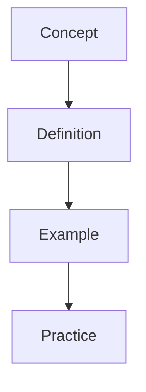

---

sources:
  - text: Standard textbook reference
title: "Chemistry"
description: "This section covers chemistry concepts, definitions, and applications with worked examples and practice problems."
date: 2026-01-01T00:00:00Z
---
sources:
  - text: Standard textbook reference

This section covers fundamental chemical principles, from atomic structure and bonding to reaction kinetics and equilibrium. Mastery of these concepts enables you to analyse quantitative problems and predict reaction outcomes systematically.

# Chemistry

**Prerequisites:** Review the prerequisite topics before attempting this section.

## Topics

- [Acids Bases](/chemistry/acids-bases/)
- [Atomic Structure](/chemistry/atomic-structure/)
- [Bonding And Structure](/chemistry/bonding-and-structure/)
- [Chemistry](/chemistry/chemistry/)
- [Electrochemistry](/chemistry/electrochemistry/)
- [Equilibrium](/chemistry/equilibrium/)
- [Flashcards Atomic Structure](/chemistry/flashcards-atomic-structure/)
- [Flashcards Physical Chemistry](/chemistry/flashcards-physical-chemistry/)
- [Kinetics](/chemistry/kinetics/)
- [Organic Chemistry](/chemistry/organic-chemistry/)
- [Physical Chemistry](/chemistry/physical-chemistry/)
- [Practice Physical Chemistry](/chemistry/practice-physical-chemistry/)
- [Quantitative Chemistry](/chemistry/quantitative-chemistry/)
- [Thermodynamics](/chemistry/thermodynamics/)
- [Transition Metals](/chemistry/transition-metals/)

## Overview

This section provides comprehensive study materials and resources. Content is organised to build understanding progressively, from foundational concepts to advanced applications.

## Key Topics

- Core concepts and definitions
- Worked examples with step-by-step solutions
- Practice problems for self-assessment
- Cross-references to related topics

## Study Tips

Begin with the introductory material before progressing to advanced topics. Use the practice problems to test your understanding and identify areas for further study.

## Overview

This section provides comprehensive study materials and resources. Content is organised to build understanding progressively, from foundational concepts to advanced applications.

## Key Topics

- Core concepts and definitions
- Worked examples with step-by-step solutions
- Practice problems for self-assessment
- Cross-references to related topics

## Study Tips

Begin with the introductory material before progressing to advanced topics. Use the practice problems to test your understanding and identify areas for further study.

Keep practising and reviewing to master this topic.

