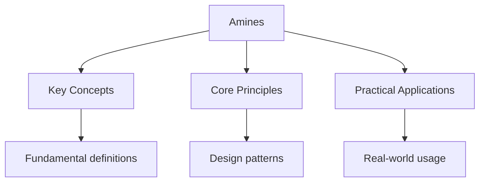

---

title: "Amines | A-Level - Wyatt's Notes"
description: "Amines are organic derivatives of ammonia () in which one or more hydrogen atoms have Been replaced by alkyl or aryl groups. They are classified as primary"
date: 2026-04-22T00:00:00.000Z
tags:
  - Chemistry
  - ALevel
categories:
  - Chemistry

---

<!-- Breadcrumb Schema for SEO -->

## Amines

Amines are organic derivatives of ammonia ($\mathrm{NH}_3$) in which one or more hydrogen atoms have
Been replaced by alkyl or aryl groups. They are classified as primary ($1^\circ$), secondary
($2^\circ$), or tertiary ($3^\circ$) based on the number of carbon groups attached to the nitrogen.
Amines containing four organic groups (quaternary ammonium ions, $\mathrm{R}_4\mathrm{N}^+$) are
Positively charged.

## Classification and Nomenclature

| Type      | Structure                 | Example                                                        |
| --------- | ------------------------- | -------------------------------------------------------------- |
| Primary   | $\mathrm{RNH}_2$          | Methylamine, $\mathrm{CH}_3\mathrm{NH}_2$                      |
| Secondary | $\mathrm{R}_2\mathrm{NH}$ | Dimethylamine, $(\mathrm{CH}_3)_2\mathrm{NH}$                  |
| Tertiary  | $\mathrm{R}_3\mathrm{N}$  | Trimethylamine, $(\mathrm{CH}_3)_3\mathrm{N}$                  |
| Aromatic  | $\mathrm{ArNH}_2$         | Phenylamine (aniline), $\mathrm{C}_6\mathrm{H}_5\mathrm{NH}_2$ |

## Preparation of Amines

### Reduction of Nitriles

Nitriles ($\mathrm{RCN}$) are reduced to primary amines using $\mathrm{LiAlH}_4$ in dry ether,
Followed by aqueous work-up:

$$
\mathrm{RCN} + 4[\mathrm{H}] \xrightarrow{\mathrm{LiAlH}_4} \mathrm{RCH}_2\mathrm{NH}_2
$$

At A-Level, this is represented with $\mathrm{LiAlH}_4$ or with the notation $[\mathrm{H}]$.

**Example:** Propionitrile ($\mathrm{CH}_3\mathrm{CH}_2\mathrm{CN}$) is reduced to propylamine
($\mathrm{CH}_3\mathrm{CH}_2\mathrm{CH}_2\mathrm{NH}_2$). This adds one carbon to the chain.

### Reduction of Amides

Amides are reduced to amines using $\mathrm{LiAlH}_4$:

$$
\mathrm{RCONH}_2 + 4[\mathrm{H}] \xrightarrow{\mathrm{LiAlH}_4} \mathrm{RCH}_2\mathrm{NH}_2 + \mathrm{H}_2\mathrm{O}
$$

This is an alternative route to primary amines. Secondary amides ($\mathrm{RCONHR}"$) give secondary
Amines, and tertiary amides ($\mathrm{RCONR}'_2$) give tertiary amines.

### Preparation of Phenylamine (Aniline)

Phenylamine is prepared by the reduction of nitrobenzene:

$$
\mathrm{C}_6\mathrm{H}_5\mathrm{NO}_2 + 3[\mathrm{H}] \to \mathrm{C}_6\mathrm{H}_5\mathrm{NH}_2 + 2\mathrm{H}_2\mathrm{O}
$$

**Reagents:** Tin and concentrated hydrochloric acid (traditional method) or catalytic hydrogenation
($\mathrm{H}_2 / \mathrm{Ni}$ catalyst).

The tin method proceeds via:

$$
\mathrm{C}_6\mathrm{H}_5\mathrm{NO}_2 + 3\mathrm{Sn} + 7\mathrm{HCl} \to [\mathrm{C}_6\mathrm{H}_5\mathrm{NH}_3^+]\mathrm{Cl}^- + 3\mathrm{SnCl}_2 + 2\mathrm{H}_2\mathrm{O}
$$

The phenylammonium chloride is then basified with excess $\mathrm{NaOH}$ to liberate the free amine:

$$
[\mathrm{C}_6\mathrm{H}_5\mathrm{NH}_3^+]\mathrm{Cl}^- + \mathrm{NaOH} \to \mathrm{C}_6\mathrm{H}_5\mathrm{NH}_2 + \mathrm{NaCl} + \mathrm{H}_2\mathrm{O}
$$

## Basicity of Amines

Amines are weak bases that accept protons to form ammonium ions:

$$
\mathrm{RNH}_2 + \mathrm{H}_2\mathrm{O} \rightleftharpoons \mathrm{RNH}_3^+ + \mathrm{OH}^-
$$

The $\mathrm{p}K_b$ of a typical aliphatic amine is 3--4, making them significantly stronger bases
Than ammonia ($\mathrm{p}K_b = 4.75$).

### Why Aliphatic Amines Are Stronger Bases Than Ammonia

The alkyl group is electron-donating through the inductive effect, increasing the electron density
On the nitrogen and making it more willing to accept a proton. The ammonium ion is stabilised by the
Inductive donation from the alkyl group.

### Aromatic Amines Are Weaker Bases

Phenylamine ($\mathrm{p}K_b = 9.38$) is a much weaker base than aliphatic amines. This is because
The nitrogen lone pair is delocalised into the benzene ring through resonance, making it less
Available for protonation:

$$
\mathrm{C}_6\mathrm{H}_5\mathrm{NH}_2 \leftrightarrow \mathrm{C}_6\mathrm{H}_5^-\mathrm{NH}_2^+ \leftrightarrow \dots
$$

The resonance structures show the lone pair being donated into the ring, which is the same effect
That activates the ring toward electrophilic substitution.

### Basicity Order

For aliphatic amines in aqueous solution:

$$
2^\circ \gt 1^\circ \gt 3^\circ \gt \mathrm{NH}_3
$$

The secondary amine is the strongest base because the inductive effect of two alkyl groups outweighs
The steric hindrance. For tertiary amines, the steric hindrance to solvation of the ammonium ion
Reduces the effective basicity.

## Nucleophilic Substitution by Amines

Amines are nucleophiles (lone pair on nitrogen) and react with halogenoalkanes to form successively
Higher amines:

$$
\mathrm{CH}_3\mathrm{CH}_2\mathrm{Br} + \mathrm{NH}_3 \to \mathrm{CH}_3\mathrm{CH}_2\mathrm{NH}_3^+\mathrm{Br}^- \xrightarrow{\mathrm{NaOH}} \mathrm{CH}_3\mathrm{CH}_2\mathrm{NH}_2 + \mathrm{NaBr} + \mathrm{H}_2\mathrm{O}
$$

The primary amine can further react with more halogenoalkane to give a secondary amine, then
Tertiary, and finally a quaternary ammonium salt. This lack of selectivity limits the synthetic
Utility of this route.

## Amide Formation

Amines react with acyl chlorides to form amides:

$$
\mathrm{RCOCl} + 2\mathrm{R}'\mathrm{NH}_2 \to \mathrm{RCONHR}' + \mathrm{R}'\mathrm{NH}_3^+\mathrm{Cl}^-
$$

An excess of amine is used to neutralise the $\mathrm{HCl}$ produced. The mechanism is nucleophilic
Acyl substitution:

1. The amine nitrogen attacks the carbonyl carbon of the acyl chloride.
2. A tetrahedral intermediate forms.
3. The chloride ion is expelled, restoring the C=O bond and forming the amide.

## Diazonium Salts

### Formation

Primary aromatic amines react with nitrous acid ($\mathrm{HNO}_2$Generated in situ from
$\mathrm{NaNO}_2$ and $\mathrm{HCl}$) at $0$--$5^\circ\mathrm{C}$ to form diazonium salts:

$$
\mathrm{C}_6\mathrm{H}_5\mathrm{NH}_2 + \mathrm{HNO}_2 + \mathrm{HCl} \to \mathrm{C}_6\mathrm{H}_5\mathrm{N}_2^+\mathrm{Cl}^- + 2\mathrm{H}_2\mathrm{O}
$$

The diazonium ion ($\mathrm{C}_6\mathrm{H}_5\mathrm{N}_2^+$) is stabilised by resonance
Delocalisation of the positive charge over the nitrogen atoms and into the ring:

$$
\mathrm{C}_6\mathrm{H}_5-\overset{+}{\mathrm{N}}\equiv\mathrm{N} \leftrightarrow \mathrm{C}_6\mathrm{H}_5-\mathrm{N}=\overset{+}{\mathrm{N}}
$$

### Reactions of Diazonium Salts

Diazonium salts are versatile intermediates because the $-\mathrm{N}_2^+$ group is an excellent
Leaving group. The key reactions are:

**Sandmeyer-type substitution:** The diazonium group is replaced by other groups, allowing the
Introduction of substituents that cannot be directly attached by electrophilic substitution.

| Reagent                     | Product       | Reaction                                                                                                                                                              |
| --------------------------- | ------------- | --------------------------------------------------------------------------------------------------------------------------------------------------------------------- |
| $\mathrm{KI}$               | Iodobenzene   | $\mathrm{C}_6\mathrm{H}_5\mathrm{N}_2^+ + \mathrm{I}^- \to \mathrm{C}_6\mathrm{H}_5\mathrm{I} + \mathrm{N}_2$                                                         |
| $\mathrm{HBF}_4$Heat        | Fluorobenzene | $\mathrm{C}_6\mathrm{H}_5\mathrm{N}_2^+\mathrm{BF}_4^- \xrightarrow{\Delta} \mathrm{C}_6\mathrm{H}_5\mathrm{F} + \mathrm{N}_2 + \mathrm{BF}_3$                        |
| $\mathrm{H}_3\mathrm{PO}_2$ | Benzene       | $\mathrm{C}_6\mathrm{H}_5\mathrm{N}_2^+ + \mathrm{H}_3\mathrm{PO}_2 + \mathrm{H}_2\mathrm{O} \to \mathrm{C}_6\mathrm{H}_6 + \mathrm{N}_2 + \mathrm{H}_3\mathrm{PO}_3$ |
| $\mathrm{CuCN}$             | Benzonitrile  | $\mathrm{C}_6\mathrm{H}_5\mathrm{N}_2^+ + \mathrm{CuCN} \to \mathrm{C}_6\mathrm{H}_5\mathrm{CN} + \mathrm{N}_2$                                                       |
| $\mathrm{CuCl}$, $\Delta$   | Chlorobenzene | $\mathrm{C}_6\mathrm{H}_5\mathrm{N}_2^+\mathrm{Cl}^- \xrightarrow{\mathrm{CuCl},\,\Delta} \mathrm{C}_6\mathrm{H}_5\mathrm{Cl} + \mathrm{N}_2$                         |

**Coupling reactions:** Diazonium salts react with phenols and aromatic amines to form azo compounds
($-\mathrm{N}=\mathrm{N}-$). These are intensely coloured and are used as dyes.

### Azo Dyes

**Coupling with phenol** (in alkaline conditions, to generate the more reactive phenoxide ion):

$$
\mathrm{C}_6\mathrm{H}_5\mathrm{N}_2^+ + \mathrm{C}_6\mathrm{H}_5\mathrm{OH} \to \mathrm{C}_6\mathrm{H}_5\mathrm{N}=\mathrm{NC}_6\mathrm{H}_4\mathrm{OH} + \mathrm{H}^+
$$

The azo group ($-\mathrm{N}=\mathrm{N}-$) is a chromophore that absorbs visible light due to its
Extended $\pi$ system. The colour depends on the extent of conjugation and the nature of the
Substituents on both aromatic rings.

**Coupling with phenylamine** (in acidic conditions):

$$
\mathrm{C}_6\mathrm{H}_5\mathrm{N}_2^+ + \mathrm{C}_6\mathrm{H}_5\mathrm{NH}_2 \to \mathrm{C}_6\mathrm{H}_5\mathrm{N}=\mathrm{NC}_6\mathrm{H}_4\mathrm{NH}_2 + \mathrm{H}^+
$$

### Why Low Temperature ($0$--$5^\circ\mathrm{C}$) Is Critical

Diazonium salts decompose at temperatures above approximately $5^\circ\mathrm{C}$Releasing Nitrogen
gas and forming phenols (via reaction with water). The ice bath maintains the temperature Low enough
to isolate the diazonium salt for subsequent reactions.

## Common Pitfalls

1. **Confusing aliphatic and aromatic amine basicity.** Aliphatic amines are stronger bases than
   ammonia; aromatic amines are weaker. The explanation involves the inductive effect (aliphatic)
   and resonance delocalisation (aromatic) respectively.

2. **Using excess halogenoalkane with ammonia.** This produces a mixture of primary, secondary,
   tertiary, and quaternary ammonium salts. To favour the primary amine, use a large excess of
   ammonia.

3. **Not maintaining low temperature for diazotisation.** If the temperature exceeds
   $5^\circ\mathrm{C}$The diazonium salt decomposes. Always specify an ice bath.

4. **Wrong conditions for coupling reactions.** Coupling with phenols requires alkaline conditions
   (phenoxide is more reactive). Coupling with amines requires acidic conditions (free amine is more
   reactive than the ammonium ion). The conditions are opposite.

5. **Forgetting that the diazonium group is a leaving group.** The synthetic utility of diazonium
   salts derives from the fact that $-\mathrm{N}_2^+$ departs as nitrogen gas, an extremely
   favourable process that drives otherwise difficult substitutions.

6. **Confusing the products of nitrile reduction and amide reduction.** Nitrile reduction
   ($\mathrm{RCN} + 4[\mathrm{H}]$) gives a primary amine with one extra carbon
   ($\mathrm{RCH}_2\mathrm{NH}_2$). Amide reduction ($\mathrm{RCONH}_2 + 4[\mathrm{H}]$) gives a
   primary amine with the same number of carbons ($\mathrm{RCH}_2\mathrm{NH}_2$).

## Amines as Nucleophiles in Detail

### Nucleophilic Addition-Elimination with Acyl Chlorides

The reaction of amines with acyl chlorides proceeds via a tetrahedral intermediate:

1. The amine lone pair attacks the electrophilic carbonyl carbon of the acyl chloride.
2. The $\pi$ electrons of the C=O move onto the oxygen, forming a tetrahedral intermediate.
3. The $\mathrm{Cl}^-$ ion is expelled as the C=O reforms.
4. The expelled $\mathrm{Cl}^-$ removes a proton from the $-\mathrm{NH}_3^+$ group, yielding the
   amide and $\mathrm{HCl}$.

The reaction with a secondary amine gives a tertiary amide:

$$
\mathrm{CH}_3\mathrm{COCl} + (\mathrm{CH}_3)_2\mathrm{NH} \to \mathrm{CH}_3\mathrm{CON}(\mathrm{CH}_3)_2 + \mathrm{HCl}
$$

### Reaction with Esters

Amines react with esters to form amides, but the reaction is slower than with acyl chlorides because
esters are less electrophilic:

$$
\mathrm{CH}_3\mathrm{COOCH}_2\mathrm{CH}_3 + \mathrm{CH}_3\mathrm{NH}_2 \to \mathrm{CH}_3\mathrm{CONHCH}_3 + \mathrm{CH}_3\mathrm{CH}_2\mathrm{OH}
$$

Heat is required for this reaction.

## Separation and Identification of Amines

### Solubility in Acid

Amines are basic and dissolve in dilute aqueous acids to form ammonium salts, which are ionic and
water-soluble. This distinguishes amines from non-basic organic compounds:

$$
\mathrm{RNH}_2 + \mathrm{HCl} \to \mathrm{RNH}_3^+\mathrm{Cl}^-
$$

The free amine can be regenerated by basification with $\mathrm{NaOH}$:

$$
\mathrm{RNH}_3^+\mathrm{Cl}^- + \mathrm{NaOH} \to \mathrm{RNH}_2 + \mathrm{NaCl} + \mathrm{H}_2\mathrm{O}
$$

This acid-base extraction is a standard technique in organic synthesis for separating amines from
neutral organic compounds.

### Hinsberg Test

The Hinsberg test distinguishes between $1^\circ$, $2^\circ$ And $3^\circ$ amines using
benzenesulphonyl chloride:

| Amine type            | Observation with $\mathrm{C}_6\mathrm{H}_5\mathrm{SO}_2\mathrm{Cl}$             |
| --------------------- | ------------------------------------------------------------------------------- |
| Primary ($1^\circ$)   | Solid sulphonamide forms; dissolves in $\mathrm{NaOH}$ (acidic N--H)            |
| Secondary ($2^\circ$) | Solid sulphonamide forms; does not dissolve in $\mathrm{NaOH}$ (no acidic N--H) |
| Tertiary ($3^\circ$)  | No reaction (no N--H to deprotonate); starting amine recovered                  |

### IR Spectroscopy of Amines

- N--H stretch: broad band at $3300$--$3500\,\mathrm{cm}^{-1}$ (primary amines show two bands;
  secondary amines show one broad band; tertiary amines show no N--H stretch).
- C--N stretch: $1000$--$1350\,\mathrm{cm}^{-1}$ (weak, not very diagnostic).
- Primary amides show N--H bending at $\approx 1600\,\mathrm{cm}^{-1}$.

## Quaternary Ammonium Salts

When a tertiary amine reacts with a halogenoalkane, a quaternary ammonium salt is formed:

$$
(\mathrm{CH}_3)_3\mathrm{N} + \mathrm{CH}_3\mathrm{CH}_2\mathrm{Br} \to (\mathrm{CH}_3)_3\mathrm{N}^+\mathrm{CH}_2\mathrm{CH}_3\,\mathrm{Br}^-
$$

The product (tetraethylammonium bromide in this example) has a permanent positive charge on the
nitrogen. Quaternary ammonium salts are used as:

- **Phase-transfer catalysts** -- they shuttle anions between aqueous and organic phases.
- **Cationic surfactants** -- the positive head group binds to negatively charged surfaces (fabric
  softeners, hair conditioners).
- **Antiseptics** -- benzalkonium chloride is a quaternary ammonium compound used in antiseptic
  solutions.

### Hofmann Elimination

Quaternary ammonium hydroxides undergo elimination on heating to give the least substituted alkene
(Hofmann product), the opposite of Zaitsev's rule:

$$
(\mathrm{CH}_3)_3\mathrm{N}^+\mathrm{CH}_2\mathrm{CH}_3\,\mathrm{OH}^- \xrightarrow{\Delta} (\mathrm{CH}_3)_3\mathrm{N} + \mathrm{CH}_2=\mathrm{CH}_2 + \mathrm{H}_2\mathrm{O}
$$

The bulky leaving group ($\mathrm{N}(\mathrm{CH}_3)_3$) favours removal of the least hindered
$\beta$-hydrogen.

## Organic Synthesis with Amines

### Synthesis of Primary Amines from Alcohols

A common two-step synthesis of primary amines:

Step 1: Convert the alcohol to a halogenoalkane (e.g. Using $\mathrm{PBr}_3$ or $\mathrm{SOCl}_2$).

Step 2: React the halogenoalkane with excess ammonia.

$$
\mathrm{CH}_3\mathrm{CH}_2\mathrm{OH} \xrightarrow{\mathrm{PBr}_3} \mathrm{CH}_3\mathrm{CH}_2\mathrm{Br} \xrightarrow{\text{excess } \mathrm{NH}_3} \mathrm{CH}_3\mathrm{CH}_2\mathrm{NH}_2
$$

### Synthesis via Nitrile (Chain Extension)

If a longer carbon chain is needed, convert the halogenoalkane to a nitrile first, then reduce:

$$
\mathrm{CH}_3\mathrm{CH}_2\mathrm{Br} \xrightarrow{\mathrm{KCN}} \mathrm{CH}_3\mathrm{CH}_2\mathrm{CN} \xrightarrow{\mathrm{LiAlH}_4} \mathrm{CH}_3\mathrm{CH}_2\mathrm{CH}_2\mathrm{NH}_2
$$

This adds one carbon to the chain.

### Gabriel Synthesis (Brief Note)

The Gabriel synthesis uses phthalimide as the nitrogen source. Phthalimide is deprotonated with
$\mathrm{KOH}$ to give a nucleophilic anion, which displaces a halide from a primary halogenoalkane.
The product is hydrolysed to release the primary amine. This method avoids the over-alkylation
problem of direct reaction with ammonia because the intermediate is not nucleophilic.

### Protecting Groups in Amine Chemistry

In multi-step syntheses, the basicity of amines can interfere with other reactions. A common
protecting group is the acyl group: converting the amine to an amide (e.g. With ethanoyl chloride)
protects the nitrogen from unwanted reactions. The amide can be hydrolysed back to the amine at the
end of the synthesis.

$$
\mathrm{RNH}_2 + \mathrm{CH}_3\mathrm{COCl} \to \mathrm{RNHCOCH}_3 \xrightarrow[\text{hydrolysis}]{\mathrm{H}^+} \mathrm{RNH}_2
$$

## Practice Problems

Problem 1

Starting from benzene, outline a synthesis of methyl orange, an azo dye. Identify all reagents and
Conditions.

**Solution:**

Step 1: Nitration of benzene to nitrobenzene.

$$
\mathrm{C}_6\mathrm{H}_6 \xrightarrow[\mathrm{conc. } \mathrm{H}_2\mathrm{SO}_4]{\mathrm{conc. } \mathrm{HNO}_3,\,50\mathrm{--}60^\circ\mathrm{C}} \mathrm{C}_6\mathrm{H}_5\mathrm{NO}_2
$$

Step 2: Reduction of nitrobenzene to phenylamine.

$$
\mathrm{C}_6\mathrm{H}_5\mathrm{NO}_2 \xrightarrow{\mathrm{Sn/HCl},\,\mathrm{then NaOH}} \mathrm{C}_6\mathrm{H}_5\mathrm{NH}_2
$$

Step 3: Diazotisation of phenylamine.

$$
\mathrm{C}_6\mathrm{H}_5\mathrm{NH}_2 \xrightarrow{\mathrm{NaNO}_2/\mathrm{HCl},\,0\mathrm{--}5^\circ\mathrm{C}} \mathrm{C}_6\mathrm{H}_5\mathrm{N}_2^+\mathrm{Cl}^-
$$

Step 4: Coupling with a naphthalene derivative (e.g. Naphthalen-2-ol) in alkaline conditions to form
The azo dye.

The key principle is that the azo linkage is formed between the diazonium salt and an activated
Aromatic compound (phenol or amine) under the appropriate pH conditions.

Problem 2

Explain why phenylamine is a weaker base than ethylamine, even though both are primary amines.

**Solution:**

In ethylamine ($\mathrm{CH}_3\mathrm{CH}_2\mathrm{NH}_2$), the ethyl group donates electron density
To the nitrogen through the inductive effect, increasing the electron density on the lone pair and
Making it more available for protonation. The resulting ethylammonium ion is stabilised by the
Inductive effect of the alkyl group.

In phenylamine ($\mathrm{C}_6\mathrm{H}_5\mathrm{NH}_2$), the nitrogen lone pair is partially
Delocalised into the benzene ring through resonance. The lone pair overlaps with the $\pi$ system of
The ring, distributing the electron density over a larger volume. This reduces the electron density
On the nitrogen, making it less available to accept a proton. The resonance stabilisation of the
Free amine is greater than that of the protonated form (in the anilinium ion, the lone pair is no
Longer available for delocalisation), so the equilibrium favours the unprotonated form.

Quantitatively: $\mathrm{p}K_b(\mathrm{ethylamine}) = 3.37$
$\mathrm{p}K_b(\mathrm{phenylamine}) = 9.38$.

Problem 3

Starting from benzene, outline a synthesis of 4-bromoiodobenzene. Explain the order of steps.

**Solution:**

Step 1: Nitration of benzene to nitrobenzene.

$$
\mathrm{C}_6\mathrm{H}_6 \xrightarrow{\mathrm{HNO}_3/\mathrm{H}_2\mathrm{SO}_4}} \mathrm{C}_6\mathrm{H}_5\mathrm{NO}_2
$$

Step 2: Reduction of nitrobenzene to phenylamine.

$$
\mathrm{C}_6\mathrm{H}_5\mathrm{NO}_2 \xrightarrow{\mathrm{Sn/HCl},\,\mathrm{NaOH}} \mathrm{C}_6\mathrm{H}_5\mathrm{NH}_2
$$

Step 3: Diazotisation.

$$
\mathrm{C}_6\mathrm{H}_5\mathrm{NH}_2 \xrightarrow{\mathrm{NaNO}_2/\mathrm{HCl},\,0\text{--}5^\circ\mathrm{C}} \mathrm{C}_6\mathrm{H}_5\mathrm{N}_2^+\mathrm{Cl}^-
$$

Step 4: Sandmeyer reaction with $\mathrm{KI}$ to introduce iodine (iodine can be introduced directly
via the diazonium salt; bromine would require $\mathrm{CuBr}$):

$$
\mathrm{C}_6\mathrm{H}_5\mathrm{N}_2^+ + \mathrm{KI} \to \mathrm{C}_6\mathrm{H}_5\mathrm{I} + \mathrm{N}_2 + \mathrm{K}^+
$$

Step 5: Bromination of iodobenzene (iodine is ortho/para directing but deactivating):

$$
\mathrm{C}_6\mathrm{H}_5\mathrm{I} \xrightarrow{\mathrm{Br}_2/\mathrm{FeBr}_3}} 4\text{-bromoiodobenzene (major)} + 2\text{-bromoiodobenzene (minor)}
$$

Iodine is a halogen: it is deactivating (so conditions must be vigorous) but ortho/para directing.
The para product predominates for steric reasons. Alternatively, bromination could be done first
(giving bromobenzene), then iodination via the Sandmeyer reaction on 4-bromoaniline. Both routes are
viable.

Problem 4

Explain the difference between the reactions of primary aliphatic amines and primary aromatic amines
with nitrous acid ($\mathrm{HNO}_2$).

**Solution:**

**Primary aliphatic amines** (e.g. $\mathrm{CH}_3\mathrm{CH}_2\mathrm{NH}_2$) react with
$\mathrm{HNO}_2$ to form a mixture of products including alcohols, alkenes, and nitrogen gas. The
reaction is complex and produces no useful product:

$$
\mathrm{CH}_3\mathrm{CH}_2\mathrm{NH}_2 + \mathrm{HNO}_2 \to \mathrm{CH}_3\mathrm{CH}_2\mathrm{OH} + \mathrm{N}_2 + \text{other products}
$$

**Primary aromatic amines** (e.g. $\mathrm{C}_6\mathrm{H}_5\mathrm{NH}_2$) react with
$\mathrm{HNO}_2$ at $0$--$5^\circ\mathrm{C}$ to form stable diazonium salts:

$$
\mathrm{C}_6\mathrm{H}_5\mathrm{NH}_2 + \mathrm{HNO}_2 + \mathrm{HCl} \to \mathrm{C}_6\mathrm{H}_5\mathrm{N}_2^+\mathrm{Cl}^- + 2\mathrm{H}_2\mathrm{O}
$$

The aromatic diazonium ion is stabilised by resonance delocalisation of the positive charge into the
benzene ring. The aliphatic analogue ($\mathrm{CH}_3\mathrm{CH}_2\mathrm{N}_2^+$) has no such
stabilisation and immediately decomposes.

## Worked Examples: Amines in Depth

### Example 1: Basicity Calculations

**Calculate the pH of a $0.10\,\mathrm{mol\,dm^{-3}}$ solution of methylamine
($\mathrm{p}K_b = 3.37$).**

$K_b = 10^{-3.37} = 4.27 \times 10^{-4}$

The equilibrium:
$\mathrm{CH}_3\mathrm{NH}_2 + \mathrm{H}_2\mathrm{O} \rightleftharpoons \mathrm{CH}_3\mathrm{NH}_3^+ + \mathrm{OH}^-$

$$K_b = \frac{[\mathrm{CH}_3\mathrm{NH}_3^+][\mathrm{OH}^-]}{[\mathrm{CH}_3\mathrm{NH}_2]} = \frac{x^2}{0.10 - x} \approx \frac{x^2}{0.10}$$

$$x = \sqrt{K_b \times 0.10} = \sqrt{4.27 \times 10^{-5}} = 6.54 \times 10^{-3}\,\mathrm{mol\,dm^{-3}}$$

$$\mathrm{pOH} = -\log(6.54 \times 10^{-3}) = 2.18$$

$$\mathrm{pH} = 14 - 2.18 = 11.82$$

**Conclusion:** A $0.10\,\mathrm{mol\,dm^{-3}}$ solution of methylamine has a pH of 11.82,
confirming it is a weak base (not fully dissociated).

### Example 2: Multi-Step Synthesis of p-Nitroaniline from Benzene

Step 1: Nitration of benzene:

$$\mathrm{C}_6\mathrm{H}_6 \xrightarrow[\text{conc. }\mathrm{H}_2\mathrm{SO}_4]{\text{conc. }\mathrm{HNO}_3,\,50\text{--}60^\circ\mathrm{C}} \mathrm{C}_6\mathrm{H}_5\mathrm{NO}_2$$

Step 2: Reduction of nitrobenzene to aniline:

$$\mathrm{C}_6\mathrm{H}_5\mathrm{NO}_2 \xrightarrow{\mathrm{Sn}/\mathrm{HCl},\,\text{then }\mathrm{NaOH}} \mathrm{C}_6\mathrm{H}_5\mathrm{NH}_2$$

Step 3: Acetylation (protecting group) with ethanoyl chloride to give acetanilide:

$$\mathrm{C}_6\mathrm{H}_5\mathrm{NH}_2 + \mathrm{CH}_3\mathrm{COCl} \to \mathrm{C}_6\mathrm{H}_5\mathrm{NHCOCH}_3 + \mathrm{HCl}$$

The acetanilide amide group is a weaker activator than the free amine and directs para, minimising
di-nitration.

Step 4: Nitration of acetanilide (para-directing, gives mainly p-nitroacetanilide):

$$\mathrm{C}_6\mathrm{H}_5\mathrm{NHCOCH}_3 \xrightarrow[\text{conc. }\mathrm{H}_2\mathrm{SO}_4]{\text{dilute }\mathrm{HNO}_3,\,\lt 5^\circ\mathrm{C}} 4\text{-}\mathrm{O}_2\mathrm{NC}_6\mathrm{H}_4\mathrm{NHCOCH}_3$$

Step 5: Hydrolysis of the amide protecting group:

$$4\text{-}\mathrm{O}_2\mathrm{NC}_6\mathrm{H}_4\mathrm{NHCOCH}_3 \xrightarrow{\mathrm{H}^+,\,\text{reflux}} 4\text{-}\mathrm{O}_2\mathrm{NC}_6\mathrm{H}_4\mathrm{NH}_2 + \mathrm{CH}_3\mathrm{COOH}$$

The product is 4-nitroaniline.

### Example 3: Diazotisation and Coupling Mechanism

**Formation of the azo dye from benzenediazonium chloride and 2-naphthol:**

Step 1: Diazotisation (at $0$--$5^\circ\mathrm{C}$):

$$\mathrm{C}_6\mathrm{H}_5\mathrm{NH}_2 + \mathrm{NaNO}_2 + 2\mathrm{HCl} \to \mathrm{C}_6\mathrm{H}_5\mathrm{N}_2^+\mathrm{Cl}^- + \mathrm{NaCl} + 2\mathrm{H}_2\mathrm{O}$$

Step 2: Coupling with 2-naphthol (in alkaline conditions):

In alkaline solution, 2-naphthol is deprotonated to the naphthoxide ion, which is more nucleophilic
at the position para to the $-\mathrm{O}^-$ group (position 1):

$$\mathrm{C}_6\mathrm{H}_5\mathrm{N}_2^+ + \mathrm{C}_{10}\mathrm{H}_7\mathrm{O}^- \to \mathrm{C}_6\mathrm{H}_5\mathrm{N}=\mathrm{NC}_{10}\mathrm{H}_6\mathrm{OH}$$

The azo compound is intensely coloured (orange-red). The extended conjugation across the
$-\mathrm{N}=\mathrm{N}-$ linkage and both aromatic systems shifts absorption into the visible
region.

**Mechanism of coupling:**

1. The diazonium ion acts as an electrophile at the terminal nitrogen.
2. The naphthoxide ion attacks the terminal nitrogen, forming a new N--N bond.
3. Rearomatisation of the naphthalene ring restores aromaticity.
4. Protonation gives the final azo compound.

### Example 4: Distinguishing Amines by Solubility

Three unlabelled bottles contain phenylamine, ethylamine, and triethylamine. How can they be
distinguished?

**Test 1: Solubility in water.**

- Ethylamine: soluble (small aliphatic amine, forms hydrogen bonds with water).
- Triethylamine: partially soluble (larger, less hydrogen bonding).
- Phenylamine: nearly insoluble in water (only slightly soluble due to the hydrophobic benzene
  ring).

**Test 2: Reaction with dilute HCl.** All three dissolve in dilute HCl to form ammonium salts. This
does not distinguish them.

**Test 3: Bromine water.**

- Phenylamine: decolourises bromine water (activated ring, tribromophenol forms as white
  precipitate).
- Ethylamine: no reaction with bromine water.
- Triethylamine: no reaction with bromine water.

**Test 4: Acidity of the conjugate acid.**

- Measure the pH of the aqueous ammonium salt solutions.
- Ethylammonium chloride: pH $\approx 6$ (weak conjugate acid of a moderately strong base).
- Phenylammonium chloride: pH $\approx 4$ (stronger conjugate acid of a weaker base).

### Example 5: Quantitative Analysis of an Amine

**A sample of ethylamine ($2.00\,\mathrm{g}$) is dissolved in water and titrated with
$0.500\,\mathrm{mol\,dm^{-3}}$ HCl. The endpoint is reached at $22.2\,\mathrm{cm}^3$. Calculate the
percentage purity of the ethylamine.**

$$\mathrm{CH}_3\mathrm{CH}_2\mathrm{NH}_2 + \mathrm{HCl} \to \mathrm{CH}_3\mathrm{CH}_2\mathrm{NH}_3^+\mathrm{Cl}^-$$

Moles of HCl used: $n = c \times V = 0.500 \times 0.0222 = 0.0111\,\mathrm{mol}$

Moles of ethylamine (1:1 ratio): $0.0111\,\mathrm{mol}$

Mass of pure ethylamine: $m = n \times M = 0.0111 \times 45.08 = 0.500\,\mathrm{g}$

Percentage purity: $\frac{0.500}{2.00} \times 100 = 25.0\%$

### Example 6: Synthesis via Diazonium Salt Substitutions

**Target:** 4-iodobenzoic acid from benzene.

Step 1: Nitration:
$\mathrm{C}_6\mathrm{H}_6 \xrightarrow{\mathrm{HNO}_3/\mathrm{H}_2\mathrm{SO}_4} \mathrm{C}_6\mathrm{H}_5\mathrm{NO}_2$

Step 2: Reduction:
$\mathrm{C}_6\mathrm{H}_5\mathrm{NO}_2 \xrightarrow{\mathrm{Sn}/\mathrm{HCl}} \mathrm{C}_6\mathrm{H}_5\mathrm{NH}_2$

Step 3: Diazotisation:
$\mathrm{C}_6\mathrm{H}_5\mathrm{NH}_2 \xrightarrow{\mathrm{NaNO}_2/\mathrm{HCl},\,0\text{--}5^\circ\mathrm{C}} \mathrm{C}_6\mathrm{H}_5\mathrm{N}_2^+\mathrm{Cl}^-$

Step 4: Sandmeyer reaction with KI:
$\mathrm{C}_6\mathrm{H}_5\mathrm{N}_2^+ + \mathrm{KI} \to \mathrm{C}_6\mathrm{H}_5\mathrm{I} + \mathrm{N}_2 + \mathrm{K}^+$

Step 5: Nitration of iodobenzene (iodine is ortho/para directing but deactivating; need vigorous
conditions):

$$\mathrm{C}_6\mathrm{H}_5\mathrm{I} \xrightarrow{\mathrm{HNO}_3/\mathrm{H}_2\mathrm{SO}_4,\,\Delta} 4\text{-}\mathrm{O}_2\mathrm{NC}_6\mathrm{H}_4\mathrm{I} \text{ (major)}$$

Step 6: Oxidation of the methyl group... Wait, there is no methyl group. We need the carboxylic acid
directly.

Alternative approach: Use the Sandmeyer reaction with $\mathrm{CuCN}$ to introduce the nitrile, then
hydrolyse to the carboxylic acid.

Step 4 (revised): Sandmeyer with CuCN:
$\mathrm{C}_6\mathrm{H}_5\mathrm{N}_2^+ + \mathrm{CuCN} \to \mathrm{C}_6\mathrm{H}_5\mathrm{CN} + \mathrm{N}_2$

Step 5: Hydrolysis of benzonitrile:
$\mathrm{C}_6\mathrm{H}_5\mathrm{CN} + 2\mathrm{H}_2\mathrm{O} + \mathrm{H}^+ \xrightarrow{\text{reflux}} \mathrm{C}_6\mathrm{H}_5\mathrm{COOH} + \mathrm{NH}_4^+$

Step 6: Iodination of benzoic acid: The $-\mathrm{COOH}$ group is meta-directing, so this gives
3-iodobenzoic acid, not the desired 4-isomer.

Correct approach: Nitrate first, then reduce, then diazotise, then introduce iodine para to the
nitro group, then convert the nitro group to carboxylic acid via the nitrile.

The key lesson: the order of steps in multi-step aromatic synthesis is critical. Always plan the
directing group strategy before beginning.

### Example 7: Buffer Solution Containing an Amine

**Calculate the pH of a buffer solution containing $0.100\,\mathrm{mol\,dm^{-3}}$ ethylamine and
$0.150\,\mathrm{mol\,dm^{-3}}$ ethylammonium chloride. $\mathrm{p}K_b(\text{ethylamine}) = 3.37$.**

First, convert to $\mathrm{p}K_a$:

$$\mathrm{p}K_a + \mathrm{p}K_b = 14.00$$ $$\mathrm{p}K_a = 14.00 - 3.37 = 10.63$$

Using the Henderson-Hasselbalch equation:

$$\mathrm{pH} = \mathrm{p}K_a + \log\frac{[\mathrm{base}]}{[\mathrm{acid}]} = 10.63 + \log\frac{0.100}{0.150} = 10.63 + \log(0.667) = 10.63 - 0.176 = 10.45$$

The buffer has a pH of 10.45, which is within one unit of $\mathrm{p}K_a$ (10.63), so it is
effective.

## Practical Techniques for Amine Reactions

### Required Practical: Preparation of a Pure Organic Solid (Azo Dye)

**Objective:** To prepare an azo dye from benzenediazonium chloride and phenol.

**Apparatus:** Ice bath, thermometer, beakers, measuring cylinders, glass rod, filter funnel, filter
paper, oven.

**Safety:** Diazonium salts are potentially explosive when dry. Keep them in solution. Wear eye
protection. Phenol is toxic and corrosive. Work in a fume cupboard.

**Procedure:**

Part A -- Diazotisation:

1. Dissolve $3.5\,\mathrm{g}$ of phenylamine in $20\,\mathrm{cm}^3$ of dilute HCl in a beaker. Cool
   in an ice bath to $0$--$5^\circ\mathrm{C}$.
2. Prepare a solution of sodium nitrite ($2.5\,\mathrm{g}$ in $10\,\mathrm{cm}^3$ water). Cool in
   the ice bath.
3. Slowly add the sodium nitrite solution to the phenylamine solution, maintaining the temperature
   below $5^\circ\mathrm{C}$ by adding ice if necessary.
4. Stir for 5 minutes in the ice bath. The benzenediazonium chloride solution is now ready.

Part B -- Coupling: 5. Dissolve $3.0\,\mathrm{g}$ of phenol in $30\,\mathrm{cm}^3$ of
$\mathrm{NaOH}(aq)$ in a separate beaker. Cool in the ice bath. 6. Slowly pour the diazonium
solution into the phenol solution, with stirring, keeping the temperature below
$10^\circ\mathrm{C}$. 7. An orange-red precipitate of the azo dye forms immediately. 8. Filter under
reduced pressure using a Buchner funnel. 9. Wash the solid with cold water, then recrystallise from
hot ethanol. 10. Dry the crystals in an oven at $50^\circ\mathrm{C}$.

**Purification by recrystallisation:** Dissolve the crude product in the minimum volume of hot
ethanol. Filter hot to remove insoluble impurities. Cool slowly to allow crystals to form. Filter
and dry.

## Exam-Style Questions with Full Mark Schemes

Q1 (6 marks)

Explain why phenylamine is a weaker base than ammonia. Refer to the structure of both molecules in
your answer.

**Mark Scheme:**

6 marks:

- Ammonia accepts a proton on the lone pair of the nitrogen atom (1 mark).
- In phenylamine, the nitrogen lone pair is delocalised into the benzene ring through resonance
  overlap with the $\pi$ system (1 mark).
- This delocalisation reduces the electron density on the nitrogen lone pair, making it less
  available to accept a proton (1 mark).
- In the protonated form (phenylammonium ion), the lone pair is no longer available for
  delocalisation, so the protonated form is less stabilised relative to the free base (1 mark).
- Therefore, the equilibrium
  $\mathrm{C}_6\mathrm{H}_5\mathrm{NH}_2 + \mathrm{H}_2\mathrm{O} \rightleftharpoons \mathrm{C}_6\mathrm{H}_5\mathrm{NH}_3^+ + \mathrm{OH}^-$
  lies further to the left than for ammonia (1 mark).
- Quantitative evidence: $\mathrm{p}K_b(\text{phenylamine}) = 9.38$ vs
  $\mathrm{p}K_b(\mathrm{NH}_3) = 4.75$ (1 mark).

Q2 (5 marks)

Describe the preparation of benzenediazonium chloride from phenylamine. Explain why the temperature
must be kept below $5^\circ\mathrm{C}$.

**Mark Scheme:**

5 marks:

- Dissolve phenylamine in excess dilute HCl (to form phenylammonium chloride) and cool in ice to
  $0$--$5^\circ\mathrm{C}$ (1 mark).
- Add aqueous sodium nitrite ($\mathrm{NaNO}_2$) slowly with stirring, maintaining the temperature
  below $5^\circ\mathrm{C}$ (1 mark).
- The nitrous acid ($\mathrm{HNO}_2$) generated in situ reacts with the phenylammonium ion to form
  the diazonium salt (1 mark).
- Above $5^\circ\mathrm{C}$The diazonium salt decomposes, releasing nitrogen gas and forming phenol
  (via reaction with water) (1 mark).
- The low temperature stabilises the diazonium ion long enough for it to be used in subsequent
  reactions (coupling or Sandmeyer) (1 mark).

Q3 (7 marks)

Starting from benzene, propose a synthesis of 4-hydroxyazobenzene (an azo dye). Your answer should
include reagents and conditions for each step, and should explain why each step is necessary.

**Mark Scheme:**

7 marks:

Step 1: Nitration of benzene with $\mathrm{HNO}_3/\mathrm{H}_2\mathrm{SO}_4$ at
$50$--$60^\circ\mathrm{C}$ to give nitrobenzene (1 mark).

Step 2: Reduction of nitrobenzene with $\mathrm{Sn}/\mathrm{HCl}$ followed by basification with
$\mathrm{NaOH}$ to give phenylamine (1 mark).

Step 3: Diazotisation with $\mathrm{NaNO}_2/\mathrm{HCl}$ at $0$--$5^\circ\mathrm{C}$ to give
benzenediazonium chloride (1 mark).

Step 4: Coupling with phenol in alkaline conditions ($\mathrm{NaOH}$) to give 4-hydroxyazobenzene (1
mark).

Explanation marks:

- The nitro group is needed because it can be reduced to an amine, which is the precursor for the
  diazonium salt (1 mark).
- The diazonium salt is essential because it acts as an electrophile in the coupling reaction with
  phenol (1 mark).
- Alkaline conditions are needed for coupling with phenol because the phenoxide ion is more
  nucleophilic than phenol itself (1 mark).

Q4 (4 marks)

A student attempts to prepare phenylamine by heating nitrobenzene with tin and concentrated
hydrochloric acid, but forgets to add sodium hydroxide at the end. Explain what product is obtained
and why.

**Mark Scheme:**

4 marks:

- The product is phenylammonium chloride, not phenylamine (1 mark).
- The reduction of nitrobenzene with $\mathrm{Sn}/\mathrm{HCl}$ produces the ammonium salt directly
  because the reaction occurs in acidic solution (1 mark).
- The phenylammonium ion ($\mathrm{C}_6\mathrm{H}_5\mathrm{NH}_3^+$) is the conjugate acid of
  phenylamine and is stable in acidic solution (1 mark).
- Adding $\mathrm{NaOH}$ is necessary to deprotonate the ammonium ion and liberate the free amine (1
  mark).

Q5 (5 marks)

Explain the difference between the reactions of primary aliphatic amines and primary aromatic amines
with nitrous acid.

**Mark Scheme:**

5 marks:

- Primary aromatic amines (e.g. Phenylamine) react with $\mathrm{HNO}_2$ at $0$--$5^\circ\mathrm{C}$
  to form stable diazonium salts (1 mark).
- The diazonium ion is stabilised by resonance delocalisation of the positive charge over the
  nitrogen atoms and into the benzene ring (1 mark).
- Primary aliphatic amines (e.g. Ethylamine) react with $\mathrm{HNO}_2$ to give a complex mixture
  of products including alcohols, alkenes, and nitrogen gas (1 mark).
- The aliphatic diazonium ion ($\mathrm{RCH}_2\mathrm{N}_2^+$) has no aromatic system to stabilise
  the positive charge, so it immediately decomposes (1 mark).
- This difference is exploited synthetically: aromatic diazonium salts are useful intermediates,
  while the aliphatic reaction is not synthetically useful (1 mark).

## Retrosynthesis with Amines

### Key Disconnections

| Target                          | Disconnection                     | Forward reagents                                |
| ------------------------------- | --------------------------------- | ----------------------------------------------- |
| Primary amine $\mathrm{R-NH_2}$ | $\mathrm{C-N}$ bond               | $\mathrm{R-X} + \text{excess }\mathrm{NH}_3$    |
| Aromatic amine                  | $\mathrm{NO}_2 \to \mathrm{NH}_2$ | $\mathrm{Sn}/\mathrm{HCl}$ then $\mathrm{NaOH}$ |
| Nitrile $\mathrm{R-CN}$         | $\mathrm{C-CN}$ bond              | $\mathrm{R-X} + \mathrm{KCN}$                   |
| Amide $\mathrm{RCONH_2}$        | $\mathrm{C-N}$ bond               | $\mathrm{RCOCl} + \text{excess }\mathrm{NH}_3$  |
| Azo dye                         | $\mathrm{Ar-N=N-Ar'}$             | Diazotisation + coupling                        |

### Worked Retrosynthesis

**Target:** 4-amino-2-methylbenzoic acid from toluene.

Step 1: Oxidation of toluene to benzoic acid would place $-\mathrm{COOH}$ para to
$-\mathrm{CH}_3$Which is not the desired arrangement.

Better approach:

1. Nitration of toluene: $-\mathrm{CH}_3$ is ortho/para directing. Nitration gives a mixture of
   2-nitrotoluene and 4-nitrotoluene. Separate by fractional distillation or recrystallisation to
   isolate 2-nitrotoluene (the ortho product).

2. Oxidation of the methyl group:
   $2\text{-}\mathrm{O}_2\mathrm{NC}_6\mathrm{H}_4\mathrm{CH}_3 \xrightarrow{\mathrm{KMnO}_4,\,\Delta} 2\text{-}\mathrm{O}_2\mathrm{NC}_6\mathrm{H}_4\mathrm{COOH}$
   (2-nitrobenzoic acid).

3. Reduction of the nitro group:
   $2\text{-}\mathrm{O}_2\mathrm{NC}_6\mathrm{H}_4\mathrm{COOH} \xrightarrow{\mathrm{Sn}/\mathrm{HCl},\,\mathrm{NaOH}} 2\text{-}\mathrm{H}_2\mathrm{NC}_6\mathrm{H}_4\mathrm{COOH}$
   (2-aminobenzoic acid).

This is 2-amino (not 4-amino). The 4-isomer requires a different approach, demonstrating the
importance of directing group strategy.

---

<!-- Breadcrumb Schema for SEO -->

:::tip
hardest questions within the A-Level specification for this topic, each with a full worked solution.

**Unit tests** probe edge cases and common misconceptions. **Integration tests** combine Amines with
other chemistry topics to test synthesis under exam conditions.

See for instructions on
self-marking and building a personal test matrix.

## Intuition

**Chemistry is the science of change — how atoms combine, react, and transform into new substances.**

## Summary

This topic covers the essential chemistry of amines, including key reactions, underlying theories,
and practical applications.

**Key concepts include:**

- homologous series and functional groups
- nomenclature (IUPAC)
- reaction mechanisms (SN1, SN2, electrophilic addition)
- stereochemistry and chirality
- spectroscopy (IR, NMR, mass spec)

Mastery of these concepts requires both theoretical understanding and the ability to apply knowledge
to unfamiliar contexts, particularly in calculation and practical questions.
:::

## See Also

- [Organic Chemistry](./)
- [Alcohols](./alcohols)
- [Alkanes](./alkanes)
