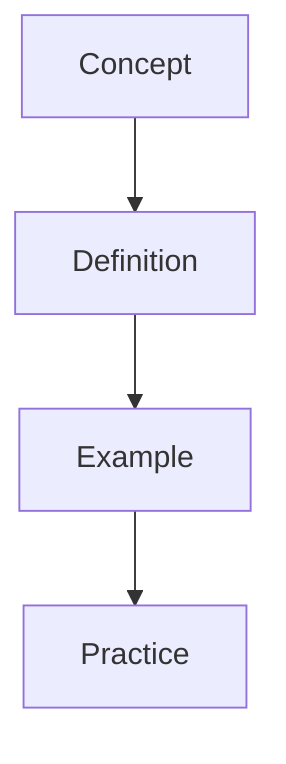

---

sources:
  - text: Standard textbook reference
title: "Organic Chemistry"
description: "This section covers organic chemistry concepts, definitions, and applications with worked examples and practice problems."
date: 2026-01-01T00:00:00Z
---
sources:
  - text: Standard textbook reference

This section covers fundamental chemical principles, from atomic structure and bonding to reaction kinetics and equilibrium. Use the diagnostic tests to find out whether Organic Chemistry needs another pass before your exam, rather than revising topics you have already mastered.

# Organic Chemistry

**Prerequisites:** Review the prerequisite topics before attempting this section.

## Topics

- [Alcohols](/chemistry/organic-chemistry/alcohols/)
- [Alkanes](/chemistry/organic-chemistry/alkanes/)
- [Alkenes](/chemistry/organic-chemistry/alkenes/)
- [Amines](/chemistry/organic-chemistry/amines/)
- [Analytical Techniques](/chemistry/organic-chemistry/analytical-techniques/)
- [Arenes](/chemistry/organic-chemistry/arenes/)
- [Carbonyl Compounds](/chemistry/organic-chemistry/carbonyl-compounds/)
- [Halogenoalkanes](/chemistry/organic-chemistry/halogenoalkanes/)
- [Introduction](/chemistry/organic-chemistry/introduction/)

## Learning Objectives

- Understand the core principles and definitions covered in this section
- Apply key concepts to solve problems and answer exam-style questions
- Connect this material to prerequisite topics and related sections

## Study Approach

The Chemistry section pairs worked examples with the common mistakes examiners see most, so misunderstandings get fixed while they are still cheap to fix.
Use the cross-references to link related concepts across subjects where applicable.

## Overview

This section provides comprehensive study materials and resources. Content is organised to build understanding progressively, from foundational concepts to advanced applications.

## Key Topics

- Core concepts and definitions
- Worked examples with step-by-step solutions
- Practice problems for self-assessment
- Cross-references to related topics

## Study Tips

Begin with the introductory material before progressing to advanced topics. Use the practice problems to test your understanding and identify areas for further study.

## Overview

This section provides comprehensive study materials and resources. Content is organised to build understanding progressively, from foundational concepts to advanced applications.

## Key Topics

- Core concepts and definitions
- Worked examples with step-by-step solutions
- Practice problems for self-assessment
- Cross-references to related topics

## Study Tips

Begin with the introductory material before progressing to advanced topics. Use the practice problems to test your understanding and identify areas for further study.

