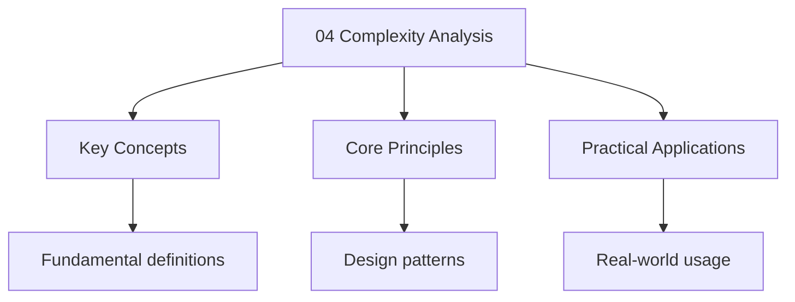

---

title: "Complexity Analysis | A-Level - Wyatt's Notes"
description: "Complexity Analysis: comprehensive educational content notes with precise definitions, worked examples, common pitfalls, and practice problems."
date: 2025-06-02T16:25:28.480Z
tags:
  - ComputerScience
  - ALevel
categories:
  - ComputerScience

---

<!-- Breadcrumb Schema for SEO -->
<script type="application/ld+json">
{
  "@context": "https://schema.org",
  "@type": "BreadcrumbList",
  "itemListElement": [{"name": "Home", "url": "https://wyattau.com"}, {"name": "alevel", "url": "https://alevel.wyattau.com"}, {"name": "Computer Science", "url": "https://alevel.wyattau.com/computer-science"}, {"name": "Algorithms", "url": "https://alevel.wyattau.com/computer-science/algorithms"}, {"name": "04 Complexity Analysis", "url": "https://alevel.wyattau.com/computer-science/algorithms/04-complexity-analysis"}]
}
</script>

## 1. Formal Definitions

### Asymptotic Notation

Let $f, g: \mathbb{N} \to \mathbb{R}^+$ be functions.

#### Big-O (Upper Bound)

$$f(n) = O(g(n)) \iff \exists\, c > 0,\ n_0 \in \mathbb{N} \mathrm{ s.t. } f(n) \leq c \cdot g(n)\ \forall\, n \geq n_0$$

**Intuition:** $f$ is eventually bounded above by a constant multiple of $g$.

#### Big-Omega (Lower Bound)

$$f(n) = \Omega(g(n)) \iff \exists\, c > 0,\ n_0 \in \mathbb{N} \mathrm{ s.t. } f(n) \geq c \cdot g(n)\ \forall\, n \geq n_0$$

**Intuition:** $f$ is eventually bounded below by a constant multiple of $g$.

#### Big-Theta (Tight Bound)

$$f(n) = \Theta(g(n)) \iff f(n) = O(g(n)) \land f(n) = \Omega(g(n))$$

$$\iff \exists\, c_1, c_2 > 0,\ n_0 \in \mathbb{N} \mathrm{ s.t. } c_1 \cdot g(n) \leq f(n) \leq c_2 \cdot g(n)\ \forall\, n \geq n_0$$

**Intuition:** $f$ grows at the same rate as $g$Up to constant factors.

#### Little-o (Strict Upper Bound)

$$f(n) = o(g(n)) \iff \lim_{n \to \infty} \frac{f(n)}{g(n)} = 0$$

#### Little-omega (Strict Lower Bound)

$$f(n) = \omega(g(n)) \iff \lim_{n \to \infty} \frac{f(n)}{g(n)} = \infty$$

<hr />

## 2. The Complexity Hierarchy

**Theorem.** For polynomial-exponential functions, the following hierarchy holds:

$$O(1) \subset o(\log n) \subset O(\log n) \subset o(\sqrt{n}) \subset O(\sqrt{n}) \subset o(n) \subset O(n) \subset o(n \log n) \subset O(n \log n) \subset o(n^2) \subset O(n^2) \subset \cdots \subset O(2^n) \subset o(n!)$$

**Proof (selected).** We prove $n = o(n \log n)$:

$$\lim_{n \to \infty} \frac{n}{n \log n} = \lim_{n \to \infty} \frac{1}{\log n} = 0$$

Similarly, $\log n = o(n)$:

$$\lim_{n \to \infty} \frac{\log n}{n} = 0 \quad \mathrm{(by L"Hôpital's rule)}$$

And $n^k = o(2^n)$ for any constant $k$:

$$\lim_{n \to \infty} \frac{n^k}{2^n} = 0 \quad \mathrm{(exponential dominates polynomial)}$$

$\square$

### Common Complexity Classes

| Class         | Name         | Example                         |
| ------------- | ------------ | ------------------------------- |
| $O(1)$        | Constant     | Array access                    |
| $O(\log n)$   | Logarithmic  | Binary search                   |
| $O(n)$        | Linear       | Linear search                   |
| $O(n \log n)$ | Linearithmic | Merge sort, heap sort           |
| $O(n^2)$      | Quadratic    | Bubble sort, insertion sort     |
| $O(n^3)$      | Cubic        | Floyd-Warshall, matrix multiply |
| $O(2^n)$      | Exponential  | Subset enumeration, brute force |
| $O(n!)$       | Factorial    | Permutation enumeration (TSP)   |

:::note
Focuses on time complexity. **CIE (9618)** covers Big-O, Big-Theta, and Big-Omega notation; requires
Space complexity analysis. **OCR (A)** requires Big-O notation; may require comparison of algorithm
Performance. **Edexcel** covers time and space complexity with Big-O notation.
:::
<hr />

## 3. Best, Average, and Worst Case

### Definitions

For an algorithm with input size $n$Let $D_n$ be the set of all possible inputs of size $n$ And Let
$T(A, I)$ be the running time of algorithm $A$ on input $I$.

- **Best case:** $T_{\mathrm{best}}(n) = \min_{I \in D_n} T(A, I)$
- **Worst case:** $T_{\mathrm{worst}}(n) = \max_{I \in D_n} T(A, I)$
- **Average case:** $T_{\mathrm{avg}}(n) = \sum_{I \in D_n} T(A, I) \cdot P(I)$

Where $P(I)$ is the probability of input $I$.

### Example: Quick Sort

| Case    | Complexity    | When                          |
| ------- | ------------- | ----------------------------- |
| Best    | $O(n \log n)$ | Pivot always splits in half   |
| Average | $O(n \log n)$ | Random inputs (expected)      |
| Worst   | $O(n^2)$      | Already sorted, min/max pivot |

:::caution
Not be uniformly distributed. Always state the distribution assumption when discussing average case.
:::
<hr />

## 4. Analyzing Recursive Algorithms

### The Master Theorem

For recurrences of the form $T(n) = aT(n/b) + f(n)$ where $a \geq 1$, $b \gt 1$:

Let $c = \log_b a$. Compare $f(n)$ with $n^c$:

| Case | Condition                                                  | Solution                          |
| ---- | ---------------------------------------------------------- | --------------------------------- |
| 1    | $f(n) = O(n^{c - \epsilon})$                               | $T(n) = \Theta(n^c)$              |
| 2    | $f(n) = \Theta(n^c \log^k n)$                              | $T(n) = \Theta(n^c \log^{k+1} n)$ |
| 3    | $f(n) = \Omega(n^{c + \epsilon})$ and $af(n/b) \leq cf(n)$ | $T(n) = \Theta(f(n))$             |

### Worked Examples

**Example 1:** Merge sort: $T(n) = 2T(n/2) + O(n)$

$a = 2, b = 2, c = \log_2 2 = 1$. $f(n) = O(n^1) = O(n^c)$. Case 2 with $k = 0$:
$T(n) = \Theta(n \log n)$.

**Example 2:** Binary search: $T(n) = T(n/2) + O(1)$

$a = 1, b = 2, c = \log_2 1 = 0$. $f(n) = O(1) = O(n^0) = O(n^c)$. Case 2 with $k = 0$:
$T(n) = \Theta(\log n)$.

**Example 3:** $T(n) = 3T(n/2) + O(n)$

$a = 3, b = 2, c = \log_2 3 \approx 1.585$.
$f(n) = O(n) = O(n^{1.585 - 0.585}) = O(n^{c - \epsilon})$. Case 1: $T(n) = \Theta(n^{\log_2 3})$.

**Example 4:** $T(n) = 2T(n/2) + O(n^2)$

$a = 2, b = 2, c = 1$. $f(n) = O(n^2) = \Omega(n^{1+1}) = \Omega(n^{c+\epsilon})$. Check regularity:
$2(n/2)^2 = n^2/2 \leq c \cdot n^2$ for $c = 1/2$. Case 3: $T(n) = \Theta(n^2)$.

<hr />

## 5. Amortized Analysis

### Motivation

Some operations are expensive in isolation but cheap on average. Amortized analysis gives the
**average cost per operation over a worst-case sequence** of operations (not average over random
Inputs).

### Methods

#### Aggregate Method

Compute the total cost of $n$ operations and divide by $n$.

**Example: Dynamic array.** Total cost of $n$ insertions: $O(n)$ (proved in
[Arrays and Records](../data-structures/01-arrays-and-records)). Amortised
Cost per insertion: $O(1)$.

#### Accounting Method

Assign an **amortised cost** to each operation. Some operations are charged more than their actual
Cost (creating a "credit"); others are charged less (consuming credit). The credit must always be
Non-negative.

**Example: Dynamic array.** Charge $\$3$ per insertion: $\$1$ for the actual insert, $\$2$ saved for
Future resizing. When a resize of $k$ elements occurs, it costs $O(k)$Which is covered by the $2k$
Credit accumulated from the $k$ insertions.

#### Potential Method

Define a **potential function** $\Phi$ mapping data structure states to non-negative real numbers.
The amortised cost of operation $i$ is:

$$\hat{c}_i = c_i + \Phi(D_i) - \Phi(D_{i-1})$$

Total amortised cost: $\sum_{i=1}^{n} \hat{c}_i = \sum_{i=1}^{n} c_i + \Phi(D_n) - \Phi(D_0)$

Since $\Phi \geq 0$ and $\Phi(D_0) = 0$: $\sum \hat{c}_i \geq \sum c_i$.

**Example: Dynamic array.** Let $\Phi = 2(\mathrm{size} - \mathrm{capacity}/2)$ when size $\geq$
Capacity/2, else 0.

- **Insert without resize:** Actual cost = 1. $\Phi$ increases by 2. Amortised cost = $1 + 2 = 3$.
- **Insert with resize from $k$ to $2k$:** Actual cost = $k$ (copy) + 1 (insert). Before: size =
  $k$Capacity = $k$, $\Phi = 2(k - k/2) = k$. After: size = $k+1$Capacity = $2k$
  $\Phi = 2(k+1 - k) = 2$. Change: $2 - k$. Amortised = $(k + 1) + (2 - k) = 3$.

Amortised cost per operation: $O(3) = O(1)$. $\square$

<hr />

## 6. Practical Analysis

### Space-Time Tradeoffs

Sometimes we can reduce time complexity by using more memory, or reduce space by accepting more
Time.

| Tradeoff           | Example                                 |
| ------------------ | --------------------------------------- |
| Hash table         | $O(1)$ search vs $O(n)$ space           |
| Memoization        | $O(1)$ repeated lookups vs $O(n)$ space |
| Precomputed tables | $O(1)$ trig functions vs large ROM      |

### Logarithmic Factors

$\log n$ grows very slowly. For all practical input sizes, $O(n \log n)$ is often acceptable even
When $O(n)$ is achievable with more complex algorithms.

| $n$    | $\log_2 n$ | $n \log_2 n$       |
| ------ | ---------- | ------------------ |
| $10^3$ | 10         | $10^4$             |
| $10^6$ | 20         | $2 \times 10^7$    |
| $10^9$ | 30         | $3 \times 10^{10}$ |

<hr />

## Problem Set

**Problem 1.** Prove that $3n^2 + 7n + 4 = O(n^2)$ using the formal definition.

<details>
<summary>Answer</summary>

We need to find $c > 0$ and $n_0$ such that $3n^2 + 7n + 4 \leq c \cdot n^2$ for all $n \geq n_0$.

For $n \geq 1$: $3n^2 + 7n + 4 \leq 3n^2 + 7n^2 + 4n^2 = 14n^2$.

Choose $c = 14$ and $n_0 = 1$. ✓

(More tightly: $c = 4, n_0 = 8$ also works.)

</details>

**Problem 2.** Prove that $n^2 \neq O(n)$.

<details>
<summary>Answer</summary>

**Proof by contradiction.** Assume $n^2 = O(n)$. Then $\exists\, c > 0, n_0$ such that $n^2 \leq cn$
For all $n \geq n_0$.

This implies $n \leq c$ for all $n \geq n_0$. But $n$ grows without bound, so this is impossible for
Any fixed $c$. Contradiction. $\square$

Equivalently: $\lim_{n \to \infty} n^2 / n = \lim_{n \to \infty} n = \infty \neq 0$ So
$n^2 \neq O(n)$.

</details>

**Problem 3.** Use the Master Theorem to solve $T(n) = 4T(n/2) + n^2 \log n$.

<details>
<summary>Answer</summary>

$a = 4$, $b = 2$, $c = \log_2 4 = 2$.

$f(n) = n^2 \log n = n^c \log^1 n$.

This is Case 2 with $k = 1$: $T(n) = \Theta(n^c \log^{k+1} n) = \Theta(n^2 \log^2 n)$.

</details>

**Problem 4.** Determine the time complexity of the following function:

```python
def mystery(n):
    count = 0
    i = 1
    while i < n:
        j = 1
        while j < n:
            count += 1
            j *= 2
        i *= 3
    return count
```

<details>
<summary>Answer</summary>

Outer loop: $i$ takes values $1, 3, 9, 27, \ldots, 3^k \lt n$. Number of iterations:
$\lceil \log_3 n \rceil$.

Inner loop: $j$ takes values $1, 2, 4, 8, \ldots, 2^m \lt n$. Number of iterations:
$\lceil \log_2 n \rceil$.

Total: $O(\log_3 n \cdot \log_2 n) = O(\log^2 n)$.

</details>

**Problem 5.** Show that $\log(n!) = \Theta(n \log n)$.

<details>
<summary>Answer</summary>

**Upper bound:** $\log(n!) = \sum_{i=1}^{n} \log i \leq \sum_{i=1}^{n} \log n = n \log n$.

**Lower bound:**
$\log(n!) = \sum_{i=1}^{n} \log i \geq \sum_{i=\lceil n/2 \rceil}^{n} \log i \geq \frac{n}{2} \cdot \log(n/2) = \frac{n}{2}(\log n - 1) = \Omega(n \log n)$.

Therefore: $\log(n!) = \Theta(n \log n)$. $\square$

</details>

**Problem 6.** A student claims that an algorithm with time complexity $O(n^3)$ is always slower
Than one with complexity $O(n^2 \log n)$. Is this correct? Explain.

<details>
<summary>Answer</summary>

No. Big-O is an **asymptotic** upper bound — it describes behaviour as $n \to \infty$. For small
$n$The $O(n^3)$ algorithm might be faster due to smaller constant factors.

Example: Algorithm A takes $1000n^2 \log n$ operations, Algorithm B takes $n^3$ operations. For
$n = 10$: A ≈ $1000 \times 100 \times 3.3 = 330,000$; B = $1000$. B is much faster.

The crossover point is where $n^3 = 1000n^2 \log n$I.e., $n = 1000\log n$Which is at
$n \approx 13,000$. Below this, B is faster.

</details>

**Problem 7.** Perform amortized analysis of a stack that supports push ($O(1)$), pop ($O(1)$), and
**multipop(k)** which pops $k$ elements ($O(k)$Or $O(\min(k, \mathrm{size}))$).

<details>
<summary>Answer</summary>

**Aggregate method.** In a sequence of $n$ operations, each push adds one element. Each pop removes
One element. Each multipop removes $k$ elements. Total elements removed $\leq$ total elements pushed
$\leq n$. Total cost of all multipop and pop operations $\leq O(n)$. Total push cost: $O(n)$. Total:
$O(n)$. Amortised per operation: $O(1)$.

**Accounting method.** Charge $\$2$ per push: $\$1$ for the push, $\$1$ credit stored with the
Element. Pop and multipop use the stored credit ($\$1$ each), so their amortised cost is $\$0$
(they're "free"). Total amortised per operation: $O(1)$.

**Potential method.** Let $\Phi(S) = |S|$ (number of elements on the stack).

- Push: actual = 1, $\Phi$ increases by 1. Amortised = $1 + 1 = 2$.
- Pop: actual = 1, $\Phi$ decreases by 1. Amortised = $1 - 1 = 0$.
- Multipop(k): actual = $k'$$\Phi$ decreases by $k'$. Amortised = $k' - k' = 0$.

All amortised costs: $O(1)$. $\square$

</details>

**Problem 8.** Determine the time complexity of the following recursive function:

```python
def f(n):
    if n <= 1:
        return 1
    return f(n - 1) + f(n - 1)
```

<details>
<summary>Answer</summary>

$T(n) = 2T(n-1) + O(1)$$T(1) = O(1)$.

This is **not** in Master Theorem form (requires $T(n/b)$Not $T(n-1)$).

Expanding:
$T(n) = 2(2T(n-2) + 1) + 1 = 4T(n-2) + 3 = 8T(n-3) + 7 = \cdots = 2^{n-1}T(1) + (2^{n-1} - 1)$.

$T(n) = \Theta(2^n)$.

This is the Fibonacci-like recursion without memoization, leading to exponential time.

</details>

**Problem 9.** Rank the following functions in order of increasing growth rate: $n^{0.5}$
$\log^2 n$$n \log n$$2^n$$n!$$n^3$$2^{\log n}$.

<details>
<summary>Answer</summary>

First simplify: $2^{\log n} = n$ (assuming $\log$ is base 2).

Growth rates (slowest to fastest):

$$\log^2 n < n^{0.5} < n = 2^{\log n} < n \log n < n^3 < 2^n < n!$$

**Verification of selected orderings:**

- $\log^2 n = o(n^{0.5})$: $\lim \frac{\log^2 n}{\sqrt{n}} = 0$ ✓
- $n^{0.5} = o(n)$: $\lim \frac{\sqrt{n}}{n} = 0$ ✓
- $n = o(n \log n)$: $\lim \frac{n}{n \log n} = 0$ ✓
- $n^3 = o(2^n)$: $\lim \frac{n^3}{2^n} = 0$ ✓

</details>

**Problem 10.** Prove that $O(f) + O(g) = O(\max(f, g))$.

<details>
<summary>Answer</summary>

**Proof.** Let $h_1 \in O(f)$ and $h_2 \in O(g)$. Then $\exists\, c_1, c_2, n_0$ such that
$h_1(n) \leq c_1 f(n)$ and $h_2(n) \leq c_2 g(n)$ for all $n \geq n_0$.

Then: $h_1(n) + h_2(n) \leq c_1 f(n) + c_2 g(n) \leq (c_1 + c_2) \cdot \max(f(n), g(n))$.

Let $c = c_1 + c_2$. Then $h_1 + h_2 \leq c \cdot \max(f, g)$ So $h_1 + h_2 \in O(\max(f, g))$.
$\square$

**Corollary.** If $f = O(g)$ Then $O(f + g) = O(g)$.

For revision on specific algorithm complexities, see
[Sorting Algorithms](02-sorting-algorithms) and
[Searching Algorithms](/computer-science/algorithms/searching-algorithms).

</details>

<hr />

## Problems

**Problem 1.** Determine the Big-O time complexity of the following code fragment:

```python
for i in range(n):
    for j in range(i):
        print(i, j)
```

<details>
<summary>Hint</summary>

Count the total number of times the inner loop body executes. When i = 0, the inner loop runs 0
Times. When i = 1, it runs 1 time. When i = 2, it runs 2 times. Sum this series.

</details>

<details>
<summary>Answer</summary>

The inner loop runs `i` times for each value of `i` from 0 to n−1.

Total iterations = $0 + 1 + 2 + \cdots + (n-1) = \frac{n(n-1)}{2} = \frac{n^2 - n}{2}$

The dominant term is $\frac{n^2}{2}$ So the time complexity is $O(n^2)$.

The $\frac{1}{2}$ constant and the $-n$ term are dropped because Big-O ignores constant factors and
Lower-order terms.

</details>

**Problem 2.** Determine the Big-O time complexity of the following code fragment:

```python
i = 1
while i < n:
    for j in range(n):
        print(j)
    i *= 2
```

<details>
<summary>Hint</summary>

The outer loop variable `i` doubles each iteration (1, 2, 4, 8, ...). How many times does the outer
Loop run? How many times does the inner loop run per outer iteration?

</details>

<details>
<summary>Answer</summary>

**Outer loop:** `i` takes values 1, 2, 4, 8, ..., $2^k < n$. The number of iterations is
$\lceil \log_2 n \rceil$.

**Inner loop:** Runs `n` times per outer iteration.

**Total:** $n \times \log_2 n = O(n \log n)$.

</details>

**Problem 3.** Algorithm A has time complexity $O(n \log n)$ with a constant factor of 10, and
Algorithm B has time complexity $O(n^2)$ with a constant factor of 1. For approximately what values
Of $n$ is Algorithm A faster than Algorithm B?

<details>
<summary>Hint</summary>

Algorithm A performs approximately $10n \log_2 n$ operations and Algorithm B performs approximately
$n^2$ operations. Solve $10n \log_2 n < n^2$Which simplifies to $10 \log_2 n < n$.

</details>

<details>
<summary>Answer</summary>

We need $10n \log_2 n < n^2$Which simplifies to $10 \log_2 n < n$ (for $n > 0$).

Testing values:

| $n$ | $10 \log_2 n$ | $n$ | A faster? |
| --- | ------------- | --- | --------- |
| 10  | 33.2          | 10  | No        |
| 20  | 43.2          | 20  | No        |
| 30  | 49.1          | 30  | No        |
| 40  | 53.2          | 40  | No        |
| 50  | 56.4          | 50  | No        |
| 60  | 59.1          | 60  | Yes       |

Algorithm A becomes faster at approximately **$n = 60$**.

This demonstrates that Big-O notation only describes asymptotic behaviour. For small inputs, the
Algorithm with the better Big-O complexity can be slower due to larger constant factors.

</details>

**Problem 4.** Compare the time complexities of the following pairs of algorithms and state which is
More efficient asymptotically. Justify each answer: (a) $O(n^2)$ vs $O(n \log n)$(b) $O(2^n)$ vs
$O(n^3)$(c) $O(n)$ vs $O(\log n)$.

<details>
<summary>Hint</summary>

Use the limit test: if $\lim_{n \to \infty} \frac{f(n)}{g(n)} = 0$ Then $f(n) = o(g(n))$Meaning $f$
grows strictly slower than $g$.

</details>

<details>
<summary>Answer</summary>

**(a) $O(n \log n)$ is more efficient than $O(n^2)$.**
$\lim_{n \to \infty} \frac{n \log n}{n^2} = \lim_{n \to \infty} \frac{\log n}{n} = 0$.
So $n \log n = o(n^2)$ — it grows strictly slower.

**(b) $O(n^3)$ is more efficient than $O(2^n)$.** $\lim_{n \to \infty} \frac{n^3}{2^n} = 0$
(exponential always dominates polynomial). So $n^3 = o(2^n)$.

**(c) $O(\log n)$ is more efficient than $O(n)$.**
$\lim_{n \to \infty} \frac{\log n}{n} = 0$ (by L'Hôpital's rule or the known hierarchy).
So $\log n = o(n)$.

**Summary (most to least efficient):**
$O(\log n) \subset O(n) \subset O(n \log n) \subset O(n^3) \subset O(2^n)$.

</details>

**Problem 5.** Analyze the space complexity of the following function:

```python
def create_matrix(n):
    matrix = []
    for i in range(n):
        row = [0] * (2 * n)
        matrix.append(row)
    return matrix
```

<details>
<summary>Hint</summary>

Count the total number of elements stored. The matrix has `n` rows, each containing `2 * n`
Elements.

</details>

<details>
<summary>Answer</summary>

The function creates a matrix with:

- `n` rows
- Each row contains `2n` elements (integers)
- Total elements: $n \times 2n = 2n^2$

Each integer occupies $O(1)$ space, and the list overhead is also $O(1)$ per element.

**Space complexity: $O(n^2)$.**

The dominant factor is the total number of stored values ($2n^2$). The variable `i`The `row`
Reference, and the loop overhead all use $O(1)$ additional space and are negligible compared to the
Matrix itself.

</details>

**Problem 6.** Analyze the space complexity of the following recursive function:

```python
def sum_recursive(arr, n):
    if n <= 0:
        return 0
    return arr[n-1] + sum_recursive(arr, n-1)
```

<details>
<summary>Hint</summary>

Recursive functions use stack space proportional to their recursion depth. How deep does the
Recursion go, and how much space does each stack frame use?

</details>

<details>
<summary>Answer</summary>

**Recursion depth:** The function calls itself with `n-1` until `n <= 0`. This means the maximum
Depth is `n` (from `sum_recursive(arr, n)` down to `sum_recursive(arr, 0)`).

**Stack frame size:** Each frame stores the parameters `arr` (a reference, $O(1)$) and `n` (an
Integer, $O(1)$), plus the return address and local variables — all $O(1)$ per frame.

**Total space:** $n \times O(1) = O(n)$.

**Space complexity: $O(n)$** due to the call stack. The input array `arr` itself is not counted in
The auxiliary space analysis since it is the input, not allocated by the function.

Note: An iterative version of this function would use only $O(1)$ auxiliary space.

</details>

**Problem 7.** State the best-case, average-case, and worst-case time complexity of quicksort. For
Each case, describe the type of input that produces that complexity and explain why it occurs.

<details>
<summary>Hint</summary>

Quicksort's performance depends on how the pivot partitions the array. Consider what happens when
The pivot is the median element, a random element, and the minimum or maximum element.

</details>

<details>
<summary>Answer</summary>

| Case    | Complexity    | Input condition                        | Explanation                                                                                                                                   |
| ------- | ------------- | -------------------------------------- | --------------------------------------------------------------------------------------------------------------------------------------------- |
| Best    | $O(n \log n)$ | Pivot always divides array in half     | Each level processes all $n$ elements, and there are $\log n$ levels. Total: $O(n \log n)$.                                                   |
| Average | $O(n \log n)$ | Random inputs                          | With a random pivot, the expected split ratio is balanced. The recurrence $T(n) = T(n/2) + T(n/2) + O(n)$ holds on average.                   |
| Worst   | $O(n^2)$      | Already sorted (with first/last pivot) | If pivot is always the minimum or maximum, one partition has $n-1$ elements and the other has 0. Recurrence: $T(n) = T(n-1) + O(n) = O(n^2)$. |

**Mitigation:** Randomised quicksort (choosing a random pivot) or median-of-three pivot selection
Makes the worst case extremely unlikely in practice, giving expected $O(n \log n)$ regardless of
Input.

</details>

**Problem 8.** Explain why binary search has $O(\log n)$ time complexity. In your answer, show how
The search range halves at each step and derive the maximum number of iterations mathematically.

<details>
<summary>Hint</summary>

Start with a range of size $n$. After each comparison, the range is reduced to at most half. After
$k$ comparisons, the range size is at most $n / 2^k$. When does this become less than 1?

</details>

<details>
<summary>Answer</summary>

**Intuitive argument:** Binary search halves the search range at each step:

- After 1 comparison: range ≤ $n/2$
- After 2 comparisons: range ≤ $n/4$
- After 3 comparisons: range ≤ $n/8$
- After $k$ comparisons: range ≤ $n/2^k$

The algorithm terminates when the range has fewer than 1 element:

$$\frac{n}{2^k} < 1 \implies 2^k > n \implies k > \log_2 n$$

So the maximum number of iterations is $\lfloor \log_2 n \rfloor + 1 = O(\log n)$.

**Formal derivation using the Master Theorem:**

$$T(n) = T(n/2) + O(1), \quad T(1) = O(1)$$

Here $a = 1$$b = 2$$c = \log_2 1 = 0$. Since $f(n) = O(1) = O(n^0) = O(n^c)$This is Master Theorem
Case 2 with $k = 0$:

$$T(n) = \Theta(n^c \log^{k+1} n) = \Theta(\log n)$$

**Why log n is efficient:** $\log_2 n$ grows extremely slowly. For $n = 10^9$ (one billion),
$\log_2 n
\approx 30$. This means binary search finds any element in a sorted billion-element array
With at most 30 comparisons.

</details>

**Problem 9.** Determine the Big-O time complexity of the following recursive function:

```python
def recursive_func(n):
    if n <= 0:
        return 0
    x = 0
    for i in range(n):
        x += i
    return x + recursive_func(n // 2)
```

<details>
<summary>Hint</summary>

Set up the recurrence relation. The function does $O(n)$ work (the for loop) and then calls itself
With $n/2$. This gives $T(n) = T(n/2) + O(n)$. Apply the Master Theorem.

</details>

<details>
<summary>Answer</summary>

**Recurrence relation:**

$$T(n) = T(n/2) + O(n), \quad T(0) = O(1)$$

The $O(n)$ term comes from the for loop that iterates `n` times. The recursive call passes $n // 2$.

**Applying the Master Theorem:** $a = 1$$b = 2$$c = \log_2 1 = 0$.

$f(n) = O(n) = O(n^{0+1}) = \Omega(n^{c + \epsilon})$ where $\epsilon = 1$.

Check regularity condition: $a \cdot f(n/b) = 1 \cdot (n/2) = n/2 \leq c \cdot n$ for $c = 1/2 < 1$.
✓

This is **Case 3** of the Master Theorem: $T(n) = \Theta(f(n)) = \Theta(n)$.

**Verification by expansion:**

$$T(n) = n + T(n/2) = n + n/2 + T(n/4) = n + n/2 + n/4 + \cdots + 1$$

$$= n\left(1 + \frac{1}{2} + \frac{1}{4} + \cdots\right) = n \cdot 2 = 2n = O(n)$$

**Time complexity: $O(n)$.**

</details>

**Problem 10.** (Exam-style) Two algorithms solve the same problem — counting inversions in an array
(the number of pairs (i, j) where i < j but A[i] > A[j]).

**Algorithm P** uses a brute-force approach:

```python
def algorithm_p(arr):
    result = 0
    for i in range(len(arr)):
        for j in range(i + 1, len(arr)):
            if arr[i] > arr[j]:
                result += 1
    return result
```

**Algorithm Q** uses a modified merge sort that counts inversions during the merge step.

(a) Determine the time complexity of each algorithm. (b) For $n = 10\,000$Estimate the number of
Operations for each algorithm. (c) Which algorithm is more efficient and by what factor? Explain
Your reasoning.

<details>
<summary>Hint</summary>

For Algorithm P, count the number of iterations of the nested loops. For Algorithm Q, recall that
Merge sort is $O(n \log n)$ and the modification to count inversions doesn't change the asymptotic
Complexity.

</details>

<details>
<summary>Answer</summary>

**(a) Time complexity:**

**Algorithm P:** The outer loop runs $n$ times (i = 0 to n−1). For each i, the inner loop runs from
I+1 to n−1, which is $n - 1 - i$ iterations.

Total iterations: $\sum_{i=0}^{n-1}(n - 1 - i) = (n-1) + (n-2) + \cdots + 1 + 0 = \frac{n(n-1)}{2}$

**Time complexity of P: $O(n^2)$.**

**Algorithm Q:** Modified merge sort follows the same divide-and-conquer structure as standard merge
Sort. Each level processes all $n$ elements during merging, and there are $\log n$ levels. The
Inversion count is accumulated during the merge step without changing the merge complexity.

**Time complexity of Q: $O(n \log n)$.**

**(b) Estimated operations for $n = 10\,000$:**

| Algorithm | Formula      | Operations                                       |
| --------- | ------------ | ------------------------------------------------ |
| P         | $n(n-1)/2$   | $10\,000 \times 9\,999 / 2 \approx 49\,995\,000$ |
| Q         | $n \log_2 n$ | $10\,000 \times 13.3 \approx 133\,000$           |

**(c) Comparison:**

Algorithm Q is significantly more efficient. The ratio is:

$$\frac{n^2/2}{n \log n} = \frac{n}{2 \log_2 n} = \frac{10\,000}{2 \times 13.3} \approx 376$$

Algorithm Q is approximately **376 times faster** than Algorithm P for $n = 10\,000$.

**Reasoning:** The difference grows with $n$. For $n = 1\,000\,000$Algorithm P would perform
$\approx 5 \times 10^{11}$ operations while Algorithm Q performs $\approx 20\,000\,000$ — a factor
Of 25,000×. This demonstrates the critical importance of choosing algorithms with better asymptotic
Complexity for large inputs.

</details>

## Common Pitfalls

1. Confusing authentication (who you are) with authorisation (what you can do) in security contexts.

2. Neglecting to normalise database designs, leading to data redundancy and update anomalies.

3. Forgetting that $O(n \log n)$ average-case for quicksort becomes $O(n^2)$ worst-case on already
   sorted input.

4. Confusing an algorithm with a program. An algorithm is a step-by-step procedure, not its
   implementation in code.




## Summary

The key principles covered in this topic are linked in the sub-pages above. Focus on understanding
the definitions, applying the formulas or frameworks, and evaluating strengths and limitations of
each approach.

## Worked Examples

Worked examples demonstrating the application of key concepts are covered in the detailed sub-pages
linked above.
