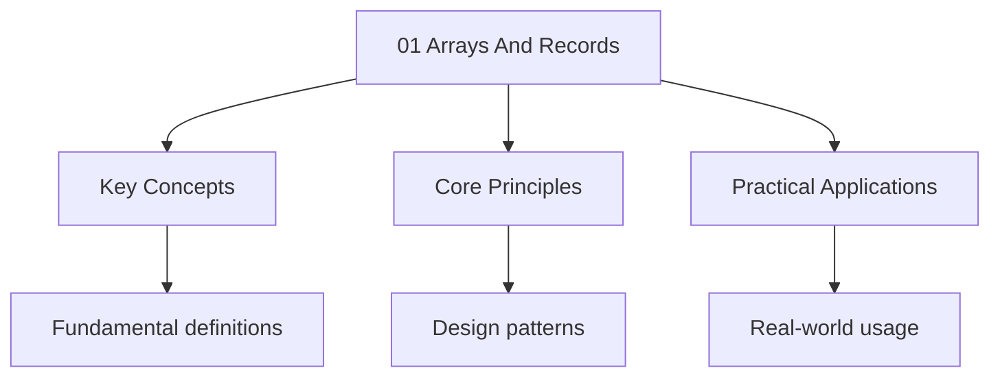

---

title: "Arrays and Records | A-Level - Wyatt's Notes"
description: 'A (or vector) is a finite, ordered sequence of elements of the same data Type, stored in . Each element is accessed by an integer index.'
date: 2025-06-02T16:25:28.480Z
tags:
  - ComputerScience
  - ALevel
categories:
  - ComputerScience

---

<!-- Breadcrumb Schema for SEO -->
<script type="application/ld+json">
{
  "@context": "https://schema.org",
  "@type": "BreadcrumbList",
  "itemListElement": [{"name": "Home", "url": "https://wyattau.com"}, {"name": "alevel", "url": "https://alevel.wyattau.com"}, {"name": "Computer Science", "url": "https://alevel.wyattau.com/computer-science"}, {"name": "Data Structures", "url": "https://alevel.wyattau.com/computer-science/data-structures"}, {"name": "01 Arrays And Records", "url": "https://alevel.wyattau.com/computer-science/data-structures/01-arrays-and-records"}]
}
</script>

## 1. One-Dimensional Arrays

### Definition

A **one-dimensional array** (or vector) is a finite, ordered sequence of elements of the same data
Type, stored in **contiguous memory locations**. Each element is accessed by an integer index.

Formally, an array $A$ of type $T$ with $n$ elements maps indices to memory:

$$A: \{0, 1, \ldots, n-1\} \to \mathrm{Memory addresses}$$

Where $A[i]$ is stored at base address $b + i \times s$ And $s$ is the size (in bytes) of one Element
of type $T$.

### Memory Layout

**Address calculation:**

$$\mathrm{addr}(A[i]) = b + i \cdot s$$

Where $b$ is the base address of the array, $i$ is the index, and $s$ is the element size.

**Theorem.** Array element access takes $O(1)$ time.

**Proof.** The address of $A[i]$ is computed by a single multiplication and a single addition — both
Constant-time operations. No traversal is needed. $\square$

<details>
<summary>Example: Memory layout of an integer array</summary>

Consider `int A[5] = {10, 20, 30, 40, 50}` where each `int` is 4 bytes and the base address is
$b = 1000$:

| Index | Value | Address   |
| ----- | ----- | --------- |
| 0     | 10    | 1000–1003 |
| 1     | 20    | 1004–1007 |
| 2     | 30    | 1008–1011 |
| 3     | 40    | 1012–1015 |
| 4     | 50    | 1016–1019 |

$A[3]$ is at $1000 + 3 \times 4 = 1012$. ✓

</details>

### Operations and Complexity

| Operation     | Time             | Notes                          |
| ------------- | ---------------- | ------------------------------ |
| Access `A[i]` | $O(1)$           | Direct address calculation     |
| Search        | $O(n)$           | Linear scan (unsorted)         |
| Search        | $O(\log n)$      | Binary search (sorted)         |
| Insert at end | $O(1)$ amortised | Dynamic array                  |
| Insert at $i$ | $O(n)$           | Must shift elements $i..n-1$   |
| Delete at $i$ | $O(n)$           | Must shift elements $i+1..n-1$ |

### Python Implementation

```python
class StaticArray:
    def __init__(self, size, default=None):
        self._data = [default] * size
        self._size = size

    def __getitem__(self, index):
        if 0 <= index < self._size:
            return self._data[index]
        raise IndexError("Array index out of bounds")

    def __setitem__(self, index, value):
        if 0 <= index < self._size:
            self._data[index] = value
        else:
            raise IndexError("Array index out of bounds")

    def __len__(self):
        return self._size
```

<hr />

## 2. Two-Dimensional Arrays

### Definition

A **two-dimensional array** is an array of arrays — a matrix with $m$ rows and $n$ columns.
Formally:

$$A: \{0,\ldots,m-1\} \times \{0,\ldots,n-1\} \to \mathrm{Memory}$$

### Memory Layouts

#### Row-Major Order

Elements of each row are stored contiguously. Row 0 first, then row 1, etc.

$$\mathrm{addr}(A[i][j]) = b + (i \cdot n + j) \cdot s$$

This is the default in C, C++, Python (NumPy default), and most modern languages.

#### Column-Major Order

Elements of each column are stored contiguously. Column 0 first, then column 1, etc.

$$\mathrm{addr}(A[i][j]) = b + (j \cdot m + i) \cdot s$$

This is the default in Fortran, MATLAB, R, and Julia.

<details>
<summary>Example: 3×2 array in row-major vs column-major</summary>

$A = \begin{pmatrix} 1 & 2 \\ 3 & 4 \\ 5 & 6 \end{pmatrix}$

**Row-major:** 1, 2, 3, 4, 5, 6

**Column-major:** 1, 3, 5, 2, 4, 6

</details>

**Theorem.** 2D array access takes $O(1)$ time.

**Proof.** The address is computed with two multiplications and two additions:
$b + (i \cdot n + j) \cdot s$. All are constant-time operations. $\square$

<hr />

## 3. Static vs Dynamic Arrays

### Static Arrays

- **Size is fixed at creation** — determined at compile time (or declaration time)
- Stored on the **stack** (for local arrays) or in the **data segment** (for global arrays)
- Cannot be resized after creation

### Dynamic Arrays

- **Size can change at runtime** — the array automatically resizes when full
- Stored on the **heap**
- Achieved by allocating a larger array and copying elements when capacity is exceeded

**Amortised analysis of dynamic array insertion.**

Consider a dynamic array that starts at capacity 1 and doubles when full.

**Theorem.** The amortised cost of $n$ append operations is $O(1)$ per operation.

**Proof.** A resize at capacity $c$ copies $c$ elements. Resizes occur at capacities
$1, 2, 4, 8, \ldots, 2^{\lfloor \log_2 n \rfloor}$. The total cost of all copies is:

$$\sum_{k=0}^{\lfloor \log_2 n \rfloor} 2^k = 2^{\lfloor \log_2 n \rfloor + 1} - 1 \leq 2n - 1 = O(n)$$

Over $n$ operations, the amortised cost per operation is $O(n)/n = O(1)$. $\square$

```python
class DynamicArray:
    def __init__(self):
        self._data = [None] * 1
        self._size = 0
        self._capacity = 1

    def append(self, value):
        if self._size == self._capacity:
            self._resize(self._capacity * 2)
        self._data[self._size] = value
        self._size += 1

    def _resize(self, new_capacity):
        new_data = [None] * new_capacity
        for i in range(self._size):
            new_data[i] = self._data[i]
        self._data = new_data
        self._capacity = new_capacity

    def __len__(self):
        return self._size
```

### Comparison

| Property     | Static Array      | Dynamic Array            |
| ------------ | ----------------- | ------------------------ |
| Size         | Fixed at creation | Grows/shrinks at runtime |
| Memory       | Stack or data seg | Heap                     |
| Access time  | $O(1)$            | $O(1)$                   |
| Append       | N/A (fixed size)  | $O(1)$ amortised         |
| Memory waste | Exact allocation  | Up to 2× allocated       |

<hr />

## 4. Records (Structs)

### Definition

A **record** (called a `struct` in C, `record` in Pascal) is a composite data type that groups
Related fields of **possibly different types** under a single name.

```python
class Student:
    def __init__(self, name, age, grades):
        self.name = name
        self.age = age
        self.grades = grades
```

### Memory Layout

Fields are stored contiguously in memory, in the order declared. The size of a record is the sum of
Its field sizes, plus any **padding** added for alignment.

**Alignment rule:** On most architectures, an $n$-byte field must be stored at an address that is a
Multiple of $n$ (or the largest alignment requirement).

<details>
<summary>Example: Record memory layout with padding</summary>

```c
struct Example {
    char c;     // 1 byte
    int x;      // 4 bytes (aligned to 4-byte boundary)
    short s;    // 2 bytes
};
```

Layout (on a 32-bit system with 4-byte alignment):

| Offset | Field | Size | Padding |
| ------ | ----- | ---- | ------- |
| 0      | c     | 1    | —       |
| 1–3    | —     | 3    | padding |
| 4–7    | x     | 4    | —       |
| 8–9    | s     | 2    | —       |
| 10–11  | —     | 2    | padding |

Total size: 12 bytes (not 7).

</details>

### Records vs Arrays

| Property     | Array                    | Record                        |
| ------------ | ------------------------ | ----------------------------- |
| Element type | All elements same type   | Fields can be different types |
| Access       | By integer index         | By named field                |
| Size         | Homogeneous              | Heterogeneous                 |
| Use case     | Collections of same data | Grouping related attributes   |

:::note
- **AQA** distinguishes between static arrays (fixed size, compile-time) and dynamic arrays (runtime
  sizing)
- **CIE (9618)** covers 1D and 2D arrays, records (fields accessed with dot notation), but does not
  emphasise static vs dynamic distinction
- **OCR (A)** requires understanding of arrays, records, and file operations (sequential and random
  access files)
- **Edexcel** covers arrays and records with pseudocode implementations
:::
<hr />

## 5. Bounds Checking

**Definition.** Bounds checking verifies that an array index is within the valid range $[0, n-1]$
Before accessing the element.

Without bounds checking, an out-of-bounds access reads or writes arbitrary memory — a **buffer
Overflow** vulnerability.

:::caution
`A[-1]` or `A[n]` compiles but causes undefined behaviour. Python, Java, and C# perform automatic
Bounds checking.
:::
<hr />

## 6. Arrays of Records

An array of records combines both structures: each element of the array is a record. This is
Extremely common in practice.

```python
students = [
    Student("Alice", 17, [85, 92, 78]),
    Student("Bob", 18, [90, 88, 95]),
    Student("Charlie", 17, [76, 81, 84]),
]

def average_grade(student):
    return sum(student.grades) / len(student.grades)
```

**Complexity.** Accessing field $f$ of record $i$ in an array: $O(1)$ — compute array offset, then
Add field offset.

<hr />

## Problem Set

**Problem 1.** An integer array `A` has base address 2000. Each integer occupies 4 bytes. What is
The address of `A[7]`?

<details>
<summary>Answer</summary>

$\mathrm{addr}(A[7]) = 2000 + 7 \times 4 = 2000 + 28 = 2028$

</details>

**Problem 2.** A 2D array `A[4][5]` is stored in row-major order with base address 100. Each element
Is 2 bytes. What is the address of `A[2][3]`?

<details>
<summary>Answer</summary>

$\mathrm{addr}(A[2][3]) = 100 + (2 \times 5 + 3) \times 2 = 100 + 13 \times 2 = 126$

</details>

**Problem 3.** The same array `A[4][5]` is stored in column-major order. What is the address of
`A[2][3]`?

<details>
<summary>Answer</summary>

$\mathrm{addr}(A[2][3]) = 100 + (3 \times 4 + 2) \times 2 = 100 + 14 \times 2 = 128$

</details>

**Problem 4.** A dynamic array starts at capacity 1 and doubles when full. After inserting 17
Elements, what is the current capacity? How many total element copies have occurred due to resizing?

<details>
<summary>Answer</summary>

Capacity after 17 insertions: $32$ (doubled from 16 after the 16th insertion).

Total copies: at capacities $1, 2, 4, 8, 16$ → $1 + 2 + 4 + 8 + 16 = 31$ copies.

</details>

**Problem 5.** Explain why inserting an element at the beginning of an array of $n$ elements takes
$O(n)$ time.

<details>
<summary>Answer</summary>

All $n$ existing elements must be shifted one position to the right to make room at index 0. Each
Shift is a constant-time assignment, so the total cost is $n$ assignments = $O(n)$.

</details>

**Problem 6.** A record `Person` has fields: `name` (string, 20 bytes), `age` (int, 4 bytes),
`height` (float, 4 bytes). Assuming 4-byte alignment, what is the total size of the record?

<details>
<summary>Answer</summary>

- `name`: offset 0, 20 bytes
- No padding needed before `age` (offset 20 is divisible by 4)
- `age`: offset 20, 4 bytes
- `height`: offset 24, 4 bytes

Total: 28 bytes. (No padding needed at the end since the total is already a multiple of the largest
Alignment, 4.)

</details>

**Problem 7.** Prove that searching for a value in an unsorted array of $n$ elements requires
$\Omega(n)$ comparisons in the worst case.

<details>
<summary>Answer</summary>

In an unsorted array, there is no relationship between the values at different indices. To determine
Whether a target value $x$ exists in the array, any algorithm must potentially examine every element
— if it skips any unchecked element, that element could be $x$. Therefore, the worst case requires
$n$ comparisons, giving $\Omega(n)$.

More formally: an adversary can answer "no" to all $n-1$ comparisons. Only after checking all $n$
Elements can the algorithm correctly conclude that $x$ is absent.

</details>

**Problem 8.** Given an array `A[10] = {3, 1, 4, 1, 5, 9, 2, 6, 5, 3}`Trace a linear search for The
value 9 and count the number of comparisons made.

<details>
<summary>Answer</summary>

| Step | Index | A[index] | Comparison    | Count |
| ---- | ----- | -------- | ------------- | ----- |
| 1    | 0     | 3        | 3 ≠ 9         | 1     |
| 2    | 1     | 1        | 1 ≠ 9         | 2     |
| 3    | 2     | 4        | 4 ≠ 9         | 3     |
| 4    | 3     | 1        | 1 ≠ 9         | 4     |
| 5    | 4     | 5        | 5 ≠ 9         | 5     |
| 6    | 5     | 9        | 9 = 9 → found | 6     |

Total comparisons: 6. The value 9 is at index 5.

For revision on searching, see
[Searching Algorithms](../algorithms/01-searching-algorithms).

</details>

<hr />

## Problems

**Problem 1.** A character array `C` has base address 3000 and stores lowercase letters. Each
Character occupies 1 byte. What are the addresses of `C[0]``C[4]`And `C[12]`? If `C` is declared
With size 10, what happens when you access `C[12]`?

<details>
<summary>Hint</summary>

Use the address formula $\mathrm{addr}(A[i]) = b + i \times s$. For the out-of-bounds access,
Consider whether the language performs bounds checking.

</details>

<details>
<summary>Answer</summary>

$\mathrm{addr}(C[0]) = 3000 + 0 \times 1 = 3000$

$\mathrm{addr}(C[4]) = 3000 + 4 \times 1 = 3004$

$\mathrm{addr}(C[12]) = 3000 + 12 \times 1 = 3012$

If the array has size 10, valid indices are 0–9. Accessing `C[12]` is an **out-of-bounds access**.
In Python, Java, and C#, this raises an `IndexError`/exception. In C and C++, no bounds checking
Occurs, so the program reads whatever data happens to be at address 3012 — this is **undefined
Behaviour** and a potential buffer overflow vulnerability.

</details>

**Problem 2.** An array `A[8] = {15, 22, 8, 41, 3, 17, 56, 34}` is stored with base address 500.
Each element is 4 bytes. What is the value stored at address 512? Show your working.

<details>
<summary>Hint</summary>

Work backwards from the address: find the index using the address formula, then look up the value.

</details>

<details>
<summary>Answer</summary>

Given $\mathrm{addr}(A[i]) = 500 + i \times 4 = 512$:

$i \times 4 = 12$ So $i = 3$.

$A[3] = 41$.

The value stored at address 512 is **41**.

</details>

**Problem 3.** A record `Book` is defined with fields: `title` (string, 30 bytes), `pages` (int, 4
Bytes), `price` (float, 8 bytes), `available` (bool, 1 byte). Assuming 8-byte alignment, calculate
The offset of each field and the total size of the record.

<details>
<summary>Hint</summary>

Place each field at an offset that is a multiple of its alignment requirement. Pad between fields if
Needed, and pad at the end to make the total a multiple of the largest alignment.

</details>

<details>
<summary>Answer</summary>

| Field     | Size | Alignment | Offset | Padding before |
| --------- | ---- | --------- | ------ | -------------- |
| title     | 30   | 8         | 0      | —              |
| (padding) | 2    | —         | 30     | 2 bytes        |
| pages     | 4    | 4         | 32     | —              |
| (padding) | 4    | —         | 36     | 4 bytes        |
| price     | 8    | 8         | 40     | —              |
| available | 1    | 1         | 48     | —              |
| (padding) | 7    | —         | 49     | 7 bytes        |

Total size: 56 bytes.

The `title` field occupies offsets 0–29. Offset 30 is not a multiple of 8 (required for `price`), so
2 bytes of padding are added. After `pages` at offset 32 (4 bytes), offset 36 is not a multiple of
8, so 4 more bytes of padding. After `available` at offset 48 (1 byte), 7 bytes of padding bring the
Total to 56 (a multiple of 8).

</details>

**Problem 4.** A nested record is defined: `Student` has fields `name` (20 bytes) and `exam` which
Is a record with fields `subject` (10 bytes) and `score` (4 bytes). Assuming 4-byte alignment, what
Is the offset of `exam.score` within a `Student` record?

<details>
<summary>Hint</summary>

First calculate the offset of the `exam` field, then add the offset of `score` within `exam`.

</details>

<details>
<summary>Answer</summary>

The `Student` record layout:

- `name`: offset 0, 20 bytes
- Padding: 2 bytes (to align `exam` to 4-byte boundary? Actually, `exam` is a record, and its
  alignment is determined by its most strictly aligned field. Both `subject` (char array,
  alignment 1) and `score` (int, alignment 4) give `exam` an alignment of 4. Offset 20 is divisible
  by 4, so no padding is needed.)
- `exam`: offset 20

Within `exam`:

- `subject`: offset 0 within exam, 10 bytes
- Padding: 2 bytes (to align `score` to 4-byte boundary: 10 is not divisible by 4)
- `score`: offset 12 within exam, 4 bytes

Offset of `exam.score` within `Student`: $20 + 12 = 32$.

</details>

**Problem 5.** A static array `S[100]` of integers (4 bytes each) is declared. A dynamic array `D`
Starts empty and doubles capacity when full. After appending 100 integers, compare the total memory
Used by `S` and `D`. Which uses more memory and why?

<details>
<summary>Hint</summary>

The static array allocates exactly 100 slots. The dynamic array doubles at powers of 2 — what is the
Capacity after 100 insertions?

</details>

<details>
<summary>Answer</summary>

Static array `S`: $100 \times 4 = 400$ bytes.

Dynamic array `D`: After 100 insertions, capacity is 128 (next power of 2 ≥ 100, since doubling
Sequence is 1, 2, 4, 8, 16, 32, 64, 128). Memory used: $128 \times 4 = 512$ bytes.

The dynamic array uses **112 more bytes** (28% more) because it pre-allocates extra capacity to
Achieve $O(1)$ amortised append. However, the static array cannot grow beyond 100 elements, while
The dynamic array can continue to accept more.

</details>

**Problem 6.** Explain two advantages and two disadvantages of static arrays compared to dynamic
Arrays. Your answer should reference memory allocation and performance.

<details>
<summary>Hint</summary>

Consider where each type is stored (stack vs heap), whether the size can change, and the
Implications for performance and memory efficiency.

</details>

<details>
<summary>Answer</summary>

**Advantages of static arrays:**

1. **Memory efficiency:** Exactly the required amount of memory is allocated. No wasted capacity. A
   static array of 50 elements uses precisely $50 \times s$ bytes.
2. **Allocation speed:** No heap allocation overhead; memory is allocated at compile time on the
   stack (for local variables), which is faster than runtime heap allocation.

**Disadvantages of static arrays:**

1. **Fixed size:** Cannot grow or shrink. If you need more elements, you must create a new array and
   copy (or pick a larger size upfront, wasting memory).
2. **Stack overflow risk:** Large static arrays stored on the stack can cause stack overflow. The
Stack is limited (e.g., 1–8 MB), while the heap is much larger.

</details>

**Problem 7.** Given the 2D array `M[3][4]` initialised as follows:

```
M = [[5, 12, 3, 8],
     [1, 9, 6, 4],
     [7, 2, 11, 10]]
```

Write pseudocode to calculate the sum of all elements in row 1, and the sum of all elements in
Column 2.

<details>
<summary>Hint</summary>

Row 1 is `M[1][0]` through `M[1][3]`. Column 2 is `M[0][2]``M[1][2]``M[2][2]`.

</details>

<details>
<summary>Answer</summary>

**Sum of row 1:**

```
row_sum = 0
FOR i = 0 TO 3
    row_sum = row_sum + M[1][i]
NEXT i
OUTPUT row_sum
```

$M[1][0] + M[1][1] + M[1][2] + M[1][3] = 1 + 9 + 6 + 4 = 20$

**Sum of column 2:**

```
col_sum = 0
FOR i = 0 TO 2
    col_sum = col_sum + M[i][2]
NEXT i
OUTPUT col_sum
```

$M[0][2] + M[1][2] + M[2][2] = 3 + 6 + 11 = 20$

</details>

**Problem 8.** A 3×3 matrix `A` is stored in row-major order with base address 1000. Each element is
8 bytes. The matrix contains the values:

```
A = [[2, 5, 1],
     [3, 8, 4],
     [7, 6, 9]]
```

What is the address of `A[2][1]`? What value is stored there?

<details>
<summary>Hint</summary>

Use the row-major formula: $\mathrm{addr}(A[i][j]) = b + (i \cdot n + j) \cdot s$ where $n$ is the
Number of columns.

</details>

<details>
<summary>Answer</summary>

$\mathrm{addr}(A[2][1]) = 1000 + (2 \times 3 + 1) \times 8 = 1000 + 7 \times 8 = 1000 + 56 = 1056$

The value at `A[2][1]` is **6**.

Verification of all addresses:

- `A[0][0]` at 1000 (value 2), `A[0][1]` at 1008 (value 5), `A[0][2]` at 1016 (value 1)
- `A[1][0]` at 1024 (value 3), `A[1][1]` at 1032 (value 8), `A[1][2]` at 1040 (value 4)
- `A[2][0]` at 1048 (value 7), `A[2][1]` at 1056 (value 6), `A[2][2]` at 1064 (value 9)

</details>

**Problem 9.** Write pseudocode to insert the value 25 at index 2 of the array
`A = {10, 20, 30, 40, 50}`. The array has capacity for 6 elements and currently holds 5. Show the
State of the array after the insertion.

<details>
<summary>Hint</summary>

You need to shift elements from index 2 onwards one position to the right before placing the new
Value at index 2.

</details>

<details>
<summary>Answer</summary>

```
// A = {10, 20, 30, 40, 50}, size = 5, insert value 25 at index 2
FOR i = size - 1 TO 2 STEP -1
    A[i + 1] = A[i]
NEXT i
A[2] = 25
size = size + 1
```

Trace:

- i = 4: `A[5] = A[4]` → `A[5] = 50`
- i = 3: `A[4] = A[3]` → `A[4] = 40`
- i = 2: `A[3] = A[2]` → `A[3] = 30`
- `A[2] = 25`

Result: `A = {10, 20, 25, 30, 40, 50}`Size = 6.

This takes $O(n)$ time because $n - 2 = 3$ elements were shifted.

</details>

**Problem 10.** (Exam-style) A school needs to store data about 500 students. For each student, they
Need: name (string), age (integer), and a list of up to 10 exam grades (integers). The system must
Support: (a) looking up any student by their position in a class list, (b) calculating the average
Grade for a student, (c) adding a new student to the end of the list when they enrol. Evaluate
Whether a static array, a dynamic array, or an array of records is the most appropriate data
Structure. Justify your choice with reference to the operations required and their time
Complexities.

<details>
<summary>Hint</summary>

Consider which structure combines the need for indexed access, heterogeneous fields (name, Age,
grades), and the ability to grow. Think about what "array of records" actually means — it Combines
arrays and records.

</details>

<details>
<summary>Answer</summary>

The most appropriate choice is an **array of records** (implemented as a dynamic array to allow
Growth).

**Why records?** Each student has fields of different types: a string (name), an integer (age), and
An array of integers (grades). An array alone stores elements of the same type. A record groups
These heterogeneous fields under one name, making the code readable and the data logically
Organised.

**Why a dynamic array (not static)?** Requirement (c) states that new students can be added when
They enrol. The number of students is not known in advance (starts at some value, grows as students
Enrol). A static array would require choosing a maximum size upfront, which risks either wasting
Memory or running out of space. A dynamic array grows automatically with $O(1)$ amortised append.

**Operation analysis:**

- (a) Lookup by position: $O(1)$ — direct index access into the array
- (b) Calculate average grade: $O(1)$ — access the record by index, then average over at most 10
  grades (constant)
- (c) Add new student at end: $O(1)$ amortised — dynamic array append

A linked list would also support insertion but would not provide $O(1)$ access by position (it would
Be $O(n)$), making it worse for operation (a). The array of records with dynamic sizing is therefore
The optimal choice.

</details>

## Common Pitfalls

1. Mixing up Big O, Big $\Omega$, and Big $\Theta$ notation. Big O is an upper bound, not
   necessarily tight.

2. Writing pseudocode that is too language-specific rather than using standard algorithmic
   constructs.

3. Forgetting that $O(n \log n)$ average-case for quicksort becomes $O(n^2)$ worst-case on already
   sorted input.

4. Misunderstanding the difference between a stack (LIFO) and a queue (FIFO) in data structure
   applications.

## Intuition

**This topic explores fundamental concepts that shape our understanding of the world.**




## Summary

The key principles covered in this topic are linked in the sub-pages above. Focus on understanding
the definitions, applying the formulas or frameworks, and evaluating strengths and limitations of
each approach.

## Worked Examples

Worked examples demonstrating the application of key concepts are covered in the detailed sub-pages
linked above.
