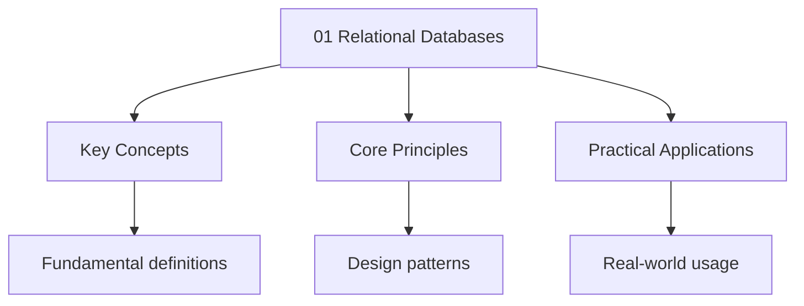

---

title: "Relational Databases | A-Level"
description: "A organises data into (tables), each consisting of (rows) with attributes (columns). The model was introduced by E.F. Codd in 1970."
date: 2025-06-02T16:25:28.480Z
tags:
  - ComputerScience
  - ALevel
categories:
  - ComputerScience

---

<!-- Breadcrumb Schema for SEO -->
<script type="application/ld+json">
{
  "@context": "https://schema.org",
  "@type": "BreadcrumbList",
  "itemListElement": [{"name": "Home", "url": "https://wyattau.com"}, {"name": "alevel", "url": "https://alevel.wyattau.com"}, {"name": "Computer Science", "url": "https://alevel.wyattau.com/computer-science"}, {"name": "Databases", "url": "https://alevel.wyattau.com/computer-science/databases"}, {"name": "01 Relational Databases", "url": "https://alevel.wyattau.com/computer-science/databases/01-relational-databases"}]
}
</script>

## 1. The Relational Model

### Definition

A **relational database** organises data into **relations** (tables), each consisting of **tuples**
(rows) with attributes (columns). The model was introduced by E.F. Codd in 1970.

### Terminology

| Relational term | SQL equivalent | Description                               |
| --------------- | -------------- | ----------------------------------------- |
| Relation        | Table          | A set of tuples                           |
| Tuple           | Row/Record     | A single data record                      |
| Attribute       | Column/Field   | A named column of a relation              |
| Domain          | Data type      | Set of allowable values                   |
| Primary key     | PRIMARY KEY    | Unique identifier for each tuple          |
| Foreign key     | FOREIGN KEY    | References a primary key in another table |

### Keys

- **Primary key:** A set of attributes that uniquely identifies each tuple. Must be unique and
  non-null.
- **Candidate key:** Any minimal set of attributes that could serve as a primary key.
- **Composite key:** A primary key consisting of multiple attributes.
- **Foreign key:** An attribute that references the primary key of another relation, establishing a
  relationship.

<hr />

## 2. SQL

### SELECT

```sql
SELECT column1, column2
FROM table_name
WHERE condition
ORDER BY column1 ASC
LIMIT 10;
```

### JOIN

#### INNER JOIN

Returns rows that have matching values in both tables.

```sql
SELECT Students.name, Grades.subject, Grades.score
FROM Students
INNER JOIN Grades ON Students.student_id = Grades.student_id;
```

#### LEFT JOIN

Returns all rows from the left table, plus matched rows from the right (NULL if no match).

```sql
SELECT Students.name, Grades.subject
FROM Students
LEFT JOIN Grades ON Students.student_id = Grades.student_id;
```

#### RIGHT JOIN

Returns all rows from the right table, plus matched rows from the left.

#### FULL OUTER JOIN

Returns all rows from both tables, with NULLs where there is no match.

### GROUP BY and Aggregate Functions

```sql
SELECT department, COUNT(*) as num_employees, AVG(salary) as avg_salary
FROM Employees
GROUP BY department
HAVING AVG(salary) > 50000
ORDER BY avg_salary DESC;
```

| Function  | Description     |
| --------- | --------------- |
| COUNT(\*) | Count of rows   |
| SUM(col)  | Sum of values   |
| AVG(col)  | Arithmetic mean |
| MIN(col)  | Minimum value   |
| MAX(col)  | Maximum value   |

### Subqueries

A query nested inside another query.

```sql
SELECT name
FROM Students
WHERE student_id IN (
    SELECT student_id
    FROM Grades
    WHERE score > 90
);
```

**Correlated subquery:** References the outer query.

```sql
SELECT name, salary
FROM Employees e
WHERE salary > (
    SELECT AVG(salary)
    FROM Employees
    WHERE department = e.department
);
```

### INSERT, UPDATE, DELETE

```sql
INSERT INTO Students (student_id, name, age) VALUES (101, "Alice', 18);

UPDATE Students SET age = 19 WHERE student_id = 101;

DELETE FROM Students WHERE student_id = 101;
```

<hr />

## 3. Normalisation

### Motivation

Normalisation eliminates **data redundancy** and **anomalies**:

- **Insertion anomaly:** Cannot insert a fact without also inserting unrelated facts
- **Update anomaly:** Must update multiple rows to change one fact
- **Deletion anomaly:** Deleting a fact inadvertently removes another fact

### First Normal Form (1NF)

**Definition:** A relation is in 1NF if and only if all attribute values are **atomic**
(indivisible).

**Violation example:**

| student_id | name  | courses        |
| ---------- | ----- | -------------- |
| 1          | Alice | CS101, MATH201 |

**Problem:** `courses` contains multiple values in a single cell.

**1NF solution:** Split into separate rows (each cell contains one value).

| student_id | name  | course  |
| ---------- | ----- | ------- |
| 1          | Alice | CS101   |
| 1          | Alice | MATH201 |

### Second Normal Form (2NF)

**Definition:** A relation is in 2NF if it is in 1NF and **no non-prime attribute is partially
Dependent on any candidate key**.

A partial dependency exists when a non-key attribute depends on only part of a composite key.

**Violation example:**

| student_id | course_id | student_name | course_title |
| ---------- | --------- | ------------ | ------------ |
| 1          | CS101     | Alice        | Programming  |

Composite key: (student_id, course_id).

Partial dependencies: `student_name` depends only on `student_id`; `course_title` depends only on
`course_id`.

**2NF solution:** Split into three tables:

**Students:** (student_id, student_name) **Courses:** (course_id, course_title) **Enrolments:**
(student_id, course_id, grade)

### Third Normal Form (3NF)

**Definition:** A relation is in 3NF if it is in 2NF and **no non-prime attribute is transitively
Dependent on any candidate key**.

A transitive dependency: $A \to B \to C$ (where $A$ is a key, $B$ and $C$ are non-key attributes).

**Violation example:**

| student_id | name  | department | dept_location |
| ---------- | ----- | ---------- | ------------- |
| 1          | Alice | CS         | Building A    |

Key: student_id.

Transitive dependency: student_id → department → dept_location. (dept_location depends on
Department, not directly on student_id.)

**3NF solution:** Split:

**Students:** (student_id, name, department) **Departments:** (department, dept_location)

### Boyce-Codd Normal Form (BCNF)

**Definition:** A relation is in BCNF if, for every non-trivial functional dependency $A \to B$, $A$
Is a **superkey**.

Every relation in BCNF is also in 3NF, but not every 3NF relation is in BCNF.

**Example where 3NF ≠ BCNF:**

Consider (student, course, teacher) with dependencies:

- (student, course) → teacher (each student has one teacher per course)
- teacher → course (each teacher teaches one course)

Keys: (student, course) and (student, teacher).

In 3NF: teacher → course is a transitive dependency through (student, teacher) → course. Wait —
Teacher is not a non-prime attribute in 3NF's definition (it's part of a candidate key). So this
Relation is in 3NF.

But: teacher → course, and teacher is NOT a superkey. So this violates BCNF.

**BCNF decomposition:** Split into:

- (student, teacher) — student takes course from teacher
- (teacher, course) — teacher teaches course

This is in BCNF but loses the dependency (student, course) → teacher (a join is needed to recover
It).

### Normalisation Summary

| Form | Requirement                                     | Eliminates              |
| ---- | ----------------------------------------------- | ----------------------- |
| 1NF  | Atomic values                                   | Repeating groups        |
| 2NF  | 1NF + no partial dependencies on composite keys | Partial dependencies    |
| 3NF  | 2NF + no transitive dependencies                | Transitive dependencies |
| BCNF | 3NF + every determinant is a candidate key      | Remaining anomalies     |

:::note
- **AQA** requires SQL (SELECT, INSERT, UPDATE, DELETE, JOIN, GROUP BY), normalisation to 3NF, and
  entity-relationship diagrams
- **CIE (9618)** requires SQL queries, conceptual and logical data models, and normalisation to at
  least 3NF
- **OCR (A)** requires SQL, normalisation to BCNF (Boyce-Codd Normal Form — more advanced than other
  boards), and ER diagrams
- **Edexcel** covers SQL fundamentals and basic normalisation
:::
<hr />

## 4. ACID Properties

Transactions in a database must satisfy the **ACID** properties:

| Property    | Description                                                                 |
| ----------- | --------------------------------------------------------------------------- |
| Atomicity   | A transaction is all-or-nothing — either all operations complete or none do |
| Consistency | The database transitions from one valid state to another                    |
| Isolation   | Concurrent transactions do not interfere with each other                    |
| Durability  | Once a transaction commits, its effects are permanent (survive crashes)     |

### Example: Bank Transfer

```sql
BEGIN TRANSACTION;
UPDATE accounts SET balance = balance - 100 WHERE account_id = 1;
UPDATE accounts SET balance = balance + 100 WHERE account_id = 2;
COMMIT;
```

- **Atomicity:** Both updates succeed, or neither does (if one fails, ROLLBACK)
- **Consistency:** Total money is conserved
- **Isolation:** Other transactions see either the old or new balances, not an intermediate state
- **Durability:** After COMMIT, the new balances persist even if the server crashes

<hr />

## 5. Entity-Relationship Diagrams

### Notation

- **Entity:** Rectangle (e.g., Student, Course)
- **Attribute:** Oval (e.g., name, age)
- **Relationship:** Diamond (e.g., "enrols in")
- **Cardinality:** 1:1, 1:Many, Many:Many

### Example

```
[Student] --(enrols in)-- [Course]

Relationship: Enrols in
Cardinality: Many-to-Many (a student takes many courses, a course has many students)

Resolved into:
[Student] --1---[Enrolment]---Many-- [Course]
```

<hr />

## Problem Set

**Problem 1.** Given the following unnormalised table, normalise it to 3NF.

| OrderID | CustomerName | CustomerCity | Product | Quantity | ProductPrice |
| ------- | ------------ | ------------ | ------- | -------- | ------------ |
| 1       | Alice        | London       | Book    | 2        | 15           |
| 1       | Alice        | London       | Pen     | 5        | 2            |
| 2       | Bob          | Paris        | Book    | 1        | 15           |

<details>
<summary>Answer</summary>

**Step 1 — 1NF:** All values are already atomic. But the table has repeating groups (OrderID 1 has
Two product rows). This is actually already in 1NF since each cell has a single value.

**Step 2 — 2NF:** Composite key: (OrderID, Product). Partial dependencies:

- CustomerName, CustomerCity depend only on OrderID
- ProductPrice depends only on Product

**Decompose:**

- Orders (OrderID, CustomerName, CustomerCity)
- Products (Product, ProductPrice)
- OrderItems (OrderID, Product, Quantity)

**Step 3 — 3NF:** In Orders: OrderID → CustomerName, CustomerCity. Transitive dependency: OrderID →
CustomerName → CustomerCity? Not necessarily — customer details depend on OrderID, not on
CustomerName. But if we consider CustomerName as a determinant of CustomerCity, then we have:
OrderID → CustomerName → CustomerCity.

**Further decompose:**

- Orders (OrderID, CustomerName)
- Customers (CustomerName, CustomerCity)
- Products (Product, ProductPrice)
- OrderItems (OrderID, Product, Quantity)

All four relations are in 3NF. ✓

</details>

**Problem 2.** Write an SQL query to find the student with the highest average score across all
Subjects.

<details>
<summary>Answer</summary>

```sql
SELECT student_id, AVG(score) as avg_score
FROM Grades
GROUP BY student_id
ORDER BY avg_score DESC
LIMIT 1;
```

Alternative (with name join):

```sql
SELECT s.name, AVG(g.score) as avg_score
FROM Students s
JOIN Grades g ON s.student_id = g.student_id
GROUP BY s.student_id, s.name
ORDER BY avg_score DESC
LIMIT 1;
```

</details>

**Problem 3.** Explain the difference between WHERE and HAVING in SQL.

<details>
<summary>Answer</summary>

| Clause | Applied to      | Timing          | Filters                  |
| ------ | --------------- | --------------- | ------------------------ |
| WHERE  | Individual rows | Before grouping | Rows before aggregation  |
| HAVING | Groups          | After grouping  | Groups after aggregation |

`WHERE` filters rows before `GROUP BY` is applied. `HAVING` filters the groups created by
`GROUP BY`.

Example:

```sql
SELECT department, COUNT(*) as count
FROM Employees
WHERE salary > 30000      -- Filter individual rows
GROUP BY department
HAVING COUNT(*) > 5        -- Filter groups
```

</details>

**Problem 4.** Prove that every BCNF relation is in 3NF.

<details>
<summary>Answer</summary>

**Proof.** Recall:

- 3NF: For every non-trivial dependency $A \to B$Either $A$ is a superkey, or $B$ is a prime
  attribute (part of some candidate key).
- BCNF: For every non-trivial dependency $A \to B$, $A$ is a superkey.

BCNF is strictly stronger than 3NF: BCNF requires $A$ to be a superkey for ALL non-trivial
Dependencies, while 3NF allows exceptions where $B$ is a prime attribute.

If a relation is in BCNF, then for every $A \to B$, $A$ is a superkey. This satisfies the 3NF
condition (since $A$ being a superkey is one of the two 3NF conditions). Therefore, BCNF ⊆ 3NF.
$\square$

**Counterexample showing 3NF ⊄ BCNF:** See the (student, course, teacher) example in Section 3.

</details>

**Problem 5.** Write an SQL query using a correlated subquery to find all employees who earn more
Than the average salary of their department.

<details>
<summary>Answer</summary>

```sql
SELECT name, department, salary
FROM Employees e
WHERE salary > (
    SELECT AVG(salary)
    FROM Employees
    WHERE department = e.department
);
```

For each employee, the subquery computes the average salary of that employee's department. If the
Employee's salary exceeds this average, the row is included.

</details>

**Problem 6.** Explain how a deadlock can occur in a database with multiple concurrent transactions.
How do databases resolve deadlocks?

<details>
<summary>Answer</summary>

**Deadlock scenario:** Two transactions each hold a lock on a resource that the other needs.

- Transaction T1: locks row A, then requests lock on B
- Transaction T2: locks row B, then requests lock on A
- Both are waiting for each other → deadlock

**Necessary conditions (Coffman conditions):**

1. Mutual exclusion: resources cannot be shared
2. Hold and wait: a transaction holds resources while waiting for more
3. No preemption: resources cannot be forcibly taken
4. Circular wait: a cycle of waiting transactions

**Resolution strategies:**

1. **Timeout:** Abort transactions that have been waiting too long
2. **Wait-die:** Older transactions wait; younger transactions are aborted (die)
3. **Wound-wait:** Older transactions preempt younger ones; younger ones wait
4. **Detection:** Build a wait-for graph and abort transactions in the cycle

Most databases use timeout-based detection or prevention (ordering locks to prevent circular wait).

</details>

**Problem 7.** Given the following schema, write a query to find all students who have taken ALL
Courses offered by the CS department.

```sql
Students(student_id, name)
Courses(course_id, title, department)
Grades(student_id, course_id, score)
```

<details>
<summary>Answer</summary>

This is a **relational division** problem.

```sql
SELECT s.name
FROM Students s
WHERE NOT EXISTS (
    SELECT c.course_id
    FROM Courses c
    WHERE c.department = 'CS'
    AND NOT EXISTS (
        SELECT g.course_id
        FROM Grades g
        WHERE g.student_id = s.student_id
        AND g.course_id = c.course_id
    )
);
```

Logic: Find students for whom there does NOT EXIST a CS course that they have NOT taken. (Double
Negation = they have taken all CS courses.)

</details>

**Problem 8.** Explain why the following relation is not in BCNF and decompose it.

R(A, B, C) with functional dependencies: AB → C, C → B

<details>
<summary>Answer</summary>

**Step 1: Find candidate keys.** By the closure of AB: AB⁺ = \{A, B, C\}, so AB is a candidate key.
By the closure of AC: AC → C → B (by C → B and augmentation), so AC → ABC, making AC also a
Candidate key.

**Step 2: Identify BCNF violations.** BCNF requires that for every non-trivial FD X → Y, X must be a
Superkey. The FD C → B is non-trivial, but C is not a superkey (C does not determine A). Therefore R
Is not in BCNF.

**Step 3: Decompose.** We decompose along the violating FD C → B:

- $R_1(C, B)$ with FD: $C \to B$. Key: $C$. BCNF: ✓ ($C$ is a superkey of $R_1$).
- $R_2(A, C)$ with FD: $AC \to C$ (trivial). Key: $AC$. BCNF: ✓ ($AC$ is a superkey of $R_2$).

**Step 4: Verify lossless join.** $R_1 \cap R_2 = \\{C\\}$ And $C \to B$ holds in $R_1$ So the Join is
lossless (by the chase test / BCNF decomposition theorem). ✓

**Step 5: Dependency preservation.** The original FDs are $\\{AB \to C,\; C \to B\\}$.

- $C \to B$ is preserved in $R_1(C, B)$. ✓
- $AB \to C$: to check this, we need to compute $C$ from $A$ and $B$. In $R_2(A, C)$Given $A$ we
  cannot determine $C$ without additional information. We would need to join $R_1$ and $R_2$: from
  $(A, B)$ we cannot join because $B$ is not in $R_2$. So $AB \to C$ is **not preserved**. ✗

**Conclusion.** This is a classic example where BCNF and dependency preservation are incompatible.
We must choose: either accept 3NF (which preserves dependencies but allows redundancy) or accept
BCNF (which eliminates redundancy but loses the FD $AB \to C$). In practice, 3NF is often preferred
When dependency preservation is critical.

</details>

<hr />

## Problems

**Problem 1.** Given the following `Employees` table, write an SQL query to find all employees in
The 'Sales' department who earn more than 45000.

| emp_id | name  | department | salary |
| ------ | ----- | ---------- | ------ |
| 1      | Alice | Sales      | 50000  |
| 2      | Bob   | IT         | 55000  |
| 3      | Carol | Sales      | 42000  |
| 4      | Dave  | Sales      | 48000  |
| 5      | Eve   | IT         | 60000  |

<details>
<summary>Hint</summary>

Use SELECT with a WHERE clause that combines two conditions using AND.

</details>

<details>
<summary>Answer</summary>

```sql
SELECT name, salary
FROM Employees
WHERE department = 'Sales' AND salary > 45000;
```

Result:

| name  | salary |
| ----- | ------ |
| Alice | 50000  |
| Dave  | 48000  |

The WHERE clause filters rows where both conditions are true simultaneously: the employee must be in
Sales AND earn more than 45000. Carol is excluded because her salary (42000) is not > 45000. Bob and
Eve are excluded because they are in IT.

</details>

**Problem 2.** Given the `Students` and `Enrolments` tables below, write an SQL query using an INNER
JOIN to list each student's name alongside the titles of all courses they are enrolled in.

**Students:**

| student_id | name  |
| ---------- | ----- |
| 1          | Alice |
| 2          | Bob   |
| 3          | Carol |

**Enrolments:**

| enrolment_id | student_id | course_id |
| ------------ | ---------- | --------- |
| 1            | 1          | CS101     |
| 2            | 1          | MATH201   |
| 3            | 2          | CS101     |
| 4            | 2          | PHYS101   |

**Courses:**

| course_id | title               |
| --------- | ------------------- |
| CS101     | Computer Science    |
| MATH201   | Linear Algebra      |
| PHYS101   | Classical Mechanics |

<details>
<summary>Hint</summary>

You need to join Students with Enrolments (on student_id), then join the result with Courses (on
Course_id). This requires two JOINs.

</details>

<details>
<summary>Answer</summary>

```sql
SELECT Students.name, Courses.title
FROM Students
INNER JOIN Enrolments ON Students.student_id = Enrolments.student_id
INNER JOIN Courses ON Enrolments.course_id = Courses.course_id
ORDER BY Students.name, Courses.title;
```

Result:

| name  | title               |
| ----- | ------------------- |
| Alice | Computer Science    |
| Alice | Linear Algebra      |
| Bob   | Classical Mechanics |
| Bob   | Computer Science    |

Carol does not appear because she has no enrolments, and INNER JOIN excludes unmatched rows. If we
Wanted Carol to appear with NULL values, we would use LEFT JOIN starting from Students.

</details>

**Problem 3.** The following table stores information about hospital patients. Identify all
Functional dependencies and normalise the table to 2NF.

| patient_id | patient_name | ward_id | ward_name  | doctor_id | doctor_name |
| ---------- | ------------ | ------- | ---------- | --------- | ----------- |
| P001       | John Smith   | W01     | Cardiology | D001      | Dr Adams    |
| P002       | Jane Doe     | W01     | Cardiology | D002      | Dr Brown    |
| P003       | Bob Wilson   | W02     | Neurology  | D001      | Dr Adams    |

<details>
<summary>Hint</summary>

First identify the candidate key(s). Then check for partial dependencies — non-key attributes that
Depend on only part of a composite key.

</details>

<details>
<summary>Answer</summary>

**Functional dependencies:**

- patient_id → patient_name, ward_id, doctor_id
- ward_id → ward_name
- doctor_id → doctor_name

**Candidate key:** patient_id (uniquely identifies each row)

**Is this in 1NF?** Yes — all values are atomic.

**Is this in 2NF?** No. 2NF requires no partial dependencies on composite keys. Since the key is
Single-attribute (patient_id), there are technically no partial dependencies on a composite key.
However, there are **transitive dependencies**:

- patient_id → ward_id → ward_name
- patient_id → doctor_id → doctor_name

This violates **3NF** (transitive dependency), not 2NF.

**Normalise to 2NF:** Since patient_id is a single-attribute key, the table is already in 2NF. The
Issue is at the 3NF level.

**Normalise to 3NF:**

Decompose into:

1. **Patients** (patient_id, patient_name, ward_id, doctor_id)
2. **Wards** (ward_id, ward_name)
3. **Doctors** (doctor_id, doctor_name)

Each table is now in 3NF with no transitive dependencies.

</details>

**Problem 4.** The following table records module results for university students. Identify all
Functional dependencies and normalise to 3NF.

| student_id | student_name | module_code | module_title | credits | lecturer | grade |
| ---------- | ------------ | ----------- | ------------ | ------- | -------- | ----- |
| S001       | Alice        | CS101       | Programming  | 20      | Dr Lee   | A     |
| S001       | Alice        | CS201       | Databases    | 20      | Dr Patel | B     |
| S002       | Bob          | CS101       | Programming  | 20      | Dr Lee   | C     |

<details>
<summary>Hint</summary>

Identify what uniquely identifies each row (the composite key), then find partial and transitive
Dependencies.

</details>

<details>
<summary>Answer</summary>

**Step 1: Identify functional dependencies.**

- (student_id, module_code) → student_name, module_title, credits, lecturer, grade
- student_id → student_name
- module_code → module_title, credits, lecturer

**Candidate key:** (student_id, module_code)

**Step 2: Check 1NF.** All values are atomic. ✓

**Step 3: Check 2NF — partial dependencies.**

- student_name depends only on student_id (partial dependency on composite key)
- module_title depends only on module_code (partial dependency)
- credits depends only on module_code (partial dependency)
- lecturer depends only on module_code (partial dependency)

**Decompose for 2NF:**

1. **Results** (student_id, module_code, grade). Composite key
2. **Students** (student_id, student_name)
3. **Modules** (module_code, module_title, credits, lecturer)

**Step 4: Check 3NF — transitive dependencies.**

In Results: key is (student_id, module_code), only non-key attribute is grade. No transitive
Dependency. ✓

In Students: key is student_id, only non-key attribute is student_name. No transitive dependency. ✓

In Modules: key is module_code, non-key attributes are module_title, credits, lecturer. No
Transitive dependency (all depend directly on module_code). ✓

All three tables are in 3NF.

</details>

**Problem 5.** An ER diagram for a school database contains the following entities and
Relationships:

- **Student** (student_id, name, date_of_birth)
- **Teacher** (teacher_id, name, subject_specialism)
- **Class** (class_id, class_name, room)
- A Student **enrols in** many Classes (Many-to-Many)
- A Teacher **teaches** many Classes (Many-to-Many)

(a) How many junction (link) tables are needed to resolve the Many-to-Many relationships? (b) Write
The schema for each table, including primary and foreign keys.

<details>
<summary>Hint</summary>

Each Many-to-Many relationship requires a junction table. The junction table contains foreign keys
Referencing the two entities it connects.

</details>

<details>
<summary>Answer</summary>

**(a)** Two junction tables are needed — one for Student–Class and one for Teacher–Class.

**(b) Table schemas:**

**Students** table:

- student_id (PRIMARY KEY)
- name
- date_of_birth

**Teachers** table:

- teacher_id (PRIMARY KEY)
- name
- subject_specialism

**Classes** table:

- class_id (PRIMARY KEY)
- class_name
- room

**Student_Classes** (junction table for enrolment):

- student_id (FOREIGN KEY → Students.student_id)
- class_id (FOREIGN KEY → Classes.class_id)
- PRIMARY KEY (student_id, class_id)

**Teacher_Classes** (junction table for teaching):

- teacher_id (FOREIGN KEY → Teachers.teacher_id)
- class_id (FOREIGN KEY → Classes.class_id)
- PRIMARY KEY (teacher_id, class_id)

The junction tables use composite primary keys (the combination of the two foreign keys) to ensure
Each student-class or teacher-class pairing is unique.

</details>

**Problem 6.** A hotel database has the following ER model:

- **Guest** (guest_id, name, phone, email)
- **Room** (room_number, room_type, price_per_night)
- **Booking** (booking_id, guest_id, room_number, check_in_date, check_out_date)
- A Guest can make **many** Bookings (1:Many)
- A Room can have **many** Bookings (1:Many)

Identify all foreign keys in this schema and explain which entity each references.

<details>
<summary>Hint</summary>

Foreign keys in the Booking table link it to the Guest and Room tables. The 1:Many relationships
Mean the "Many" side (Booking) holds the foreign keys.

</details>

<details>
<summary>Answer</summary>

**Foreign keys in the Booking table:**

| Foreign Key Column | References       | Reason                                                           |
| ------------------ | ---------------- | ---------------------------------------------------------------- |
| guest_id           | Guest.guest_id   | Each booking belongs to one guest (1:Many from Guest to Booking) |
| room_number        | Room.room_number | Each booking is for one room (1:Many from Room to Booking)       |

**Explanation:**

- The Guest-to-Booking relationship is 1:Many because one guest can make multiple bookings, but each
  booking belongs to exactly one guest. The foreign key `guest_id` in Booking records which guest
  made the booking.
- The Room-to-Booking relationship is 1:Many because one room can be booked multiple times (on
  different dates), but each booking is for exactly one room. The foreign key `room_number` in
  Booking records which room is booked.

**Primary keys:**

- Guest: guest_id
- Room: room_number
- Booking: booking_id

No foreign keys exist in Guest or Room because they are on the "1" side of their respective
Relationships.

</details>

**Problem 7.** Given the following `Products` table, write SQL statements to: (a) Insert a new
Product: (id=6, name='Monitor', category='Electronics', price=299.99) (b) Update the price of
'Keyboard' to 45.00 (c) Delete all products in the 'Furniture' category

| product_id | name     | category    | price  |
| ---------- | -------- | ----------- | ------ |
| 1          | Laptop   | Electronics | 999.99 |
| 2          | Keyboard | Electronics | 39.99  |
| 3          | Desk     | Furniture   | 249.99 |
| 4          | Chair    | Furniture   | 199.99 |
| 5          | Mouse    | Electronics | 29.99  |

<details>
<summary>Hint</summary>

Use INSERT INTO ... VALUES for (a), UPDATE ... SET ... WHERE for (b), and DELETE FROM ... WHERE for
(c). Always include a WHERE clause in UPDATE and DELETE to avoid affecting all rows.

</details>

<details>
<summary>Answer</summary>

**(a) Insert a new product:**

```sql
INSERT INTO Products (product_id, name, category, price)
VALUES (6, 'Monitor', 'Electronics', 299.99);
```

**(b) Update the price of Keyboard:**

```sql
UPDATE Products
SET price = 45.00
WHERE name = 'Keyboard';
```

After this: product_id 2 now has price = 45.00.

**(c) Delete all Furniture products:**

```sql
DELETE FROM Products
WHERE category = 'Furniture';
```

This removes rows where product_id is 3 (Desk) and 4 (Chair).

**Final table state:**

| product_id | name     | category    | price  |
| ---------- | -------- | ----------- | ------ |
| 1          | Laptop   | Electronics | 999.99 |
| 2          | Keyboard | Electronics | 45.00  |
| 5          | Mouse    | Electronics | 29.99  |
| 6          | Monitor  | Electronics | 299.99 |

</details>

**Problem 8.** A library uses the following tables. Write SQL statements to: (a) Add a new member:
(member_id=1001, name='Sarah', join_date='2025-03-15') (b) Update the status of all books borrowed
Before '2025-01-01' to 'overdue' (c) Delete the borrow record for member 50 returning book BK004

**Members** (member_id, name, join_date) **Books** (book_id, title, author) **Borrows** (borrow_id,
Member_id, book_id, borrow_date, return_date, status)

<details>
<summary>Hint</summary>

Each operation targets a specific table. Use WHERE clauses to restrict which rows are affected. For
(b), use a date comparison.

</details>

<details>
<summary>Answer</summary>

**(a) Add a new member:**

```sql
INSERT INTO Members (member_id, name, join_date)
VALUES (1001, 'Sarah', '2025-03-15');
```

**(b) Update overdue books:**

```sql
UPDATE Borrows
SET status = 'overdue'
WHERE borrow_date < '2025-01-01';
```

This updates all borrow records where the borrow date is before 1st January 2025 and sets their
Status to 'overdue'. This is a bulk update — multiple rows may be affected.

**(c) Delete a specific borrow record:**

```sql
DELETE FROM Borrows
WHERE member_id = 50 AND book_id = 'BK004';
```

Both conditions are needed in the WHERE clause to identify the correct record (since member_id alone
Is not unique in the Borrows table — a member can borrow multiple books).

</details>

**Problem 9.** For the relation R(A, B, C, D, E) with the following functional dependencies, find
All candidate keys and explain your reasoning.

- AB → C
- C → D
- DE → A
- B → E

<details>
<summary>Hint</summary>

A candidate key is a minimal set of attributes whose closure includes all attributes (A, B, C, D,
E). Try computing the closure of potential keys starting with individual attributes, then pairs.

</details>

<details>
<summary>Answer</summary>

**Step 1: Compute closures of single attributes.**

$A^+ = \{A\}$ — A does not appear on the left side of any FD. Not a key. $B^+ = \{B\} \to \{B, E\}$
(B → E) $\to$ cannot go further (E alone doesn't determine anything). Not a key.
$C^+ = \{C\} \to \{C, D\}$ (C → D) $\to \{C, D, E, A\}$ (DE → A) $\to$ cannot determine B. Not a
Key. $D^+ = \{D\}$ — D alone doesn't determine anything. Not a key. $E^+ = \{E\}$ — E alone doesn't
Determine anything. Not a key.

No single attribute is a candidate key.

**Step 2: Compute closures of pairs.**

$AB^+ = \{A, B\} \to \{A, B, C\}$ (AB → C) $\to \{A, B, C, D\}$ (C → D) $\to \{A, B, C, D, E\}$ (B →
E, or DE → A). **All attributes! AB is a candidate key.**

$BC^+ = \{B, C\} \to \{B, C, D, E\}$ (C → D, B → E) $\to \{B, C, D, E, A\}$ (DE → A). **All
Attributes! BC is a candidate key.**

$BE^+ = \{B, E\} \to$ already have E, no new FD applies. $\{B, E\}$. Not a key.
$BD^+ = \{B, D\} \to \{B, D, E\}$ (B → E) $\to \{A, B, D, E\}$ (DE → A) $\to \{A, B, C, D, E\}$ (AB
→ C). **All attributes! BD is a candidate key.**

**Step 3: Check minimality.**

- AB: Can we remove A? $B^+ = \{B, E\} \neq$ all. Can we remove B? $A^+ = \{A\} \neq$ all. Both
  needed. ✓
- BC: Can we remove B? $C^+ = \{C, D, E, A\} \neq$ all (missing B). Can we remove C?
  $B^+ = \{B, E\} \neq$ all. Both needed. ✓
- BD: Can we remove B? $D^+ = \{D\} \neq$ all. Can we remove D? $B^+ = \{B, E\} \neq$ all. Both
  needed. ✓

**Candidate keys:** AB, BC, and BD

**Prime attributes** (attributes that appear in at least one candidate key): A, B, C, D

</details>

**Problem 10.** (Exam-style multi-step question) A small business needs a database to manage its
Operations. The business has:

- Multiple **departments** (each with a unique department code, name, and location)
- **Employees** (each with a unique employee number, name, salary, and belonging to one department)
- **Projects** (each with a unique project code, title, budget, and start date)
- Employees can work on **multiple projects**, and each project can have **multiple employees**. The
  system also records the number of hours each employee has worked on each project.

(a) Design a normalised schema (at least 3NF) for this system. State each table, its columns,
Primary keys, and foreign keys. (b) Write SQL to create the Employees table with appropriate
Constraints. (c) Write an SQL query to find the names of all employees who work on projects with a
Budget greater than 50000. (d) Write an SQL query to find the total salary bill for each department.

<details>
<summary>Hint</summary>

For (a), you need a junction table for the Many-to-Many employee-project relationship. For (c), you
Need to join three tables. For (d), use GROUP BY with SUM.

</details>

<details>
<summary>Answer</summary>

**(a) Normalised schema (3NF):**

1. **Departments** (dept_code PK, dept_name, location)
2. **Employees** (emp_no PK, emp_name, salary, dept_code FK → Departments)
3. **Projects** (project_code PK, title, budget, start_date)
4. **Employee_Projects** (emp_no FK, project_code FK, hours_worked). PK is (emp_no, project_code)

**Functional dependencies:**

- dept_code → dept_name, location
- emp_no → emp_name, salary, dept_code
- project_code → title, budget, start_date
- (emp_no, project_code) → hours_worked

All tables are in 3NF: no partial dependencies (all keys are single-attribute except the junction
Table where hours_worked depends on the full composite key) and no transitive dependencies.

**(b) Create Employees table:**

```sql
CREATE TABLE Employees (
    emp_no INT PRIMARY KEY,
    emp_name VARCHAR(100) NOT NULL,
    salary DECIMAL(10, 2) CHECK (salary > 0),
    dept_code VARCHAR(10) NOT NULL,
    FOREIGN KEY (dept_code) REFERENCES Departments(dept_code)
);
```

**(c) Employees on projects with budget > 50000:**

```sql
SELECT DISTINCT e.emp_name
FROM Employees e
INNER JOIN Employee_Projects ep ON e.emp_no = ep.emp_no
INNER JOIN Projects p ON ep.project_code = p.project_code
WHERE p.budget > 50000;
```

DISTINCT is used because an employee may work on multiple high-budget projects — we want each name
Listed once.

Result example: If Alice works on Project A (budget 60000) and Project B (budget 30000), she appears
Once (due to DISTINCT).

**(d) Total salary bill per department:**

```sql
SELECT d.dept_name, SUM(e.salary) AS total_salary
FROM Departments d
INNER JOIN Employees e ON d.dept_code = e.dept_code
GROUP BY d.dept_code, d.dept_name
ORDER BY total_salary DESC;
```

Example result:

| dept_name | total_salary |
| --------- | ------------ |
| IT        | 165000.00    |
| Sales     | 142000.00    |
| HR        | 98000.00     |

</details>

## Common Pitfalls

1. Misidentifying the limiting reagent. Compare mole ratios rather than comparing masses.

2. Confusing the terms 'molar' and 'molecular'. Molar refers to per mole ($\text{mol}^{-1}$), while
   molecular refers to individual molecules.

3. Forgetting to convert between units (e.g., $\text{cm}^3$ to $\text{dm}^3$) when calculating
   concentrations.

4. Drawing structural formulae incorrectly. Check the number of bonds each atom can form and the
   overall charge.




## Summary

The key principles covered in this topic are linked in the sub-pages above. Focus on understanding
the definitions, applying the formulas or frameworks, and evaluating strengths and limitations of
each approach.

## Worked Examples

Worked examples demonstrating the application of key concepts are covered in the detailed sub-pages
linked above.

## Common Mistakes

1. **Confusing WHERE and HAVING in SQL.** WHERE filters individual rows *before* GROUP BY is applied; HAVING filters groups *after* aggregation. You cannot use aggregate functions (COUNT, SUM, AVG) in a WHERE clause — use HAVING instead.

2. **Normalising to 2NF when the table is already in 2NF.** 2NF requires no partial dependencies on *composite* keys. If the primary key is a single attribute, there are no partial dependencies, and the table is automatically in 2NF. Check for transitive dependencies (3NF violation) instead.

3. **Forgetting that INNER JOIN excludes unmatched rows.** If you need all rows from one table regardless of matches, use LEFT JOIN. Students often write INNER JOIN when they need LEFT JOIN, losing data for entities without related records.

4. **Misidentifying candidate keys.** A candidate key must determine ALL other attributes in the relation. Compute the closure of each potential key — if the closure includes all attributes, it is a candidate key. Students often select a non-minimal set or miss a candidate key.

5. **Confusing entity-relationship cardinalities.** In a 1:Many relationship, the foreign key goes in the table on the "Many" side. In a Many:Many relationship, you need a junction table with foreign keys referencing both entities.

## Cross-References

- [Algorithms and Complexity](../algorithms/04-complexity-analysis) -- Query performance depends on algorithmic complexity, connecting database operations to computational efficiency.
- [Data Structures](../data-structures/04-trees) -- B-trees and hash indexes underpin database indexing, linking data structure choice to query speed.
- [Programming Constructs](../programming/01-programming-constructs) -- SQL programming constructs like variables and loops parallel general programming concepts.
- [Number Systems](../fundamentals/01-number-systems) -- Data types and storage formats depend on binary representation and number system conversions.

## Intuition

A relational database is essentially a collection of spreadsheets that know how to talk to each other. Each table holds data about one thing — customers, orders, products — and rows represent individual records. The "relational" part means you can link tables together using matching values, so a customer ID in the Orders table points back to a specific row in the Customers table. This avoids duplicating customer details across every order they place, which keeps data consistent and saves space.

Normalisation is the process of organising tables to minimise redundancy. The intuition is simple: if a piece of information appears in multiple rows and you need to update it, you might change it in one place but forget another, creating inconsistencies. Normal forms (1NF through BCNF) are a series of increasingly strict rules that ensure each fact is stored in exactly one place. Think of it like having a single master copy of a document rather than photocopies scattered across different offices — when the master is updated, everyone sees the correct version.

SQL is the language that lets you ask questions of this organised data. JOIN operations combine rows from different tables based on related columns, essentially reconstructing the connections that normalisation deliberately separated. GROUP BY and aggregate functions let you summarise — counting orders per customer, averaging scores per exam, or totalling sales per region. The beauty of the relational model is that you describe what data you want, and the database engine figures out the most efficient way to retrieve it, using indexes and query optimisation to handle tables with millions of rows in milliseconds.
