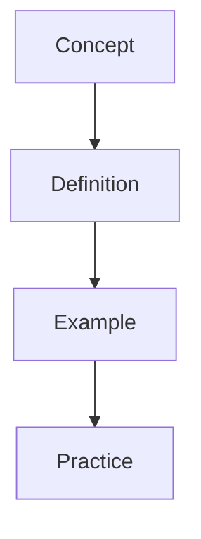

---
sources:
  - text: Standard textbook reference

sources:
  - text: Standard textbook reference

sources:
  - text: Standard textbook reference
date: 2026-07-23T21:57:32+01:00
sources:
  - text: Standard textbook reference
title: "Databases | A-Level - Wyatt's Notes"
sources:
  - text: Standard textbook reference
description: "A-Level Computer Science Databases notes covering key definitions, core concepts, worked examples, and practice questions for effective preparation."
sources:
  - text: Standard textbook reference
---
sources:
  - text: Standard textbook reference

<!-- Breadcrumb Schema for SEO -->

<!-- Course Schema for SEO -->

## Databases

Databases provide structured, persistent storage that enables efficient querying, updating, and
management of data. A-Level focuses on the **relational model**, where data is organised into tables
with defined relationships, and on **SQL** as the language for manipulating that data.

## Topics Covered

### Relational Databases

- **Entities, attributes, and relationships** — the conceptual model
- **Tables, rows (tuples), columns (attributes)** — the relational implementation
- **Primary keys, foreign keys, and composite keys** — enforcing identity and relationships
- **Referential integrity** — ensuring consistency across related tables

### Normalisation

- **1NF, 2NF, 3NF** — step-by-step normalisation process to eliminate redundancy
- **Functional dependencies** — identifying which attributes determine others
- **Anomalies** — insertion, update, and deletion anomalies caused by poor design
- **Entity-Relationship diagrams** — modelling before implementation

### SQL

- **DDL (Data Definition Language)** — `CREATE TABLE`, `ALTER TABLE`, `DROP TABLE` with constraints
  (`PRIMARY KEY`, `FOREIGN KEY`, `NOT NULL`, `UNIQUE`, `CHECK`)
- **DML (Data Manipulation Language)** — `SELECT`, `INSERT`, `UPDATE`, `DELETE`
- **Queries** — `WHERE`, `ORDER BY`, `GROUP BY`, `HAVING`, aggregate functions (`COUNT`, `SUM`,
  `AVG`, `MIN`, `MAX`)
- **Joins** — `INNER JOIN`, `LEFT JOIN`, `RIGHT JOIN`; understanding what rows each returns
- **Subqueries** — nested `SELECT` statements

### Transaction Processing

- **ACID properties** — Atomicity, Consistency, Isolation, Durability
- **Concurrency** — why simultaneous access causes problems (lost updates, dirty reads)
- **Locking and serialisation** — preventing concurrency issues

## Study Tips

1. **Practise writing SQL**. Don"t just read it. Write queries against sample databases and verify
   your results.
2. **Normalise step by step**. Exam questions often give an unnormalised table and ask you to
   normalise to 3NF. Work through 1NF $\rightarrow$ 2NF $\rightarrow$ 3NF explicitly.
3. **Draw ER diagrams** before writing SQL. They clarify relationships and cardinality (1:1, 1:M,
   M:N).
4. **Understand join types** — `INNER JOIN` returns only matching rows; `LEFT JOIN` returns all rows
   from the left table. Sketch Venn diagrams if it helps.
5. **Learn the ACID properties** with concrete examples of what goes wrong when each is violated.

## How to Use These Notes

Start with the relational model and normalisation, then move to SQL. Each page contains definitions,
worked examples with sample data, and exam-style problems. Use the SQL examples as templates you can
adapt.

## Overview

This section provides comprehensive A-Level Computer Science content for Databases, covering all specification points with detailed explanations, worked examples, and practice questions.

## Content Structure

Each page in this section includes:

- **Definitions**: Clear, precise explanations of key concepts
- **Worked Examples**: Step-by-step solutions with annotations
- **Practice Questions**: Multiple-choice and structured questions with mark schemes
- **Common Pitfalls**: Errors to avoid and how to fix them
- **Exam Tips**: Strategies for maximising marks in this topic

## How to Use These Notes

1. Read the introductory page to understand the topic overview
2. Work through each sub-topic in order
3. Attempt the practice questions before checking solutions
4. Use the flashcards to revise key terminology
5. Complete the diagnostic test to identify remaining gaps

## Key Topics

- Core definitions and principles
- Application to examination-style questions
- Links to related topics across the specification
- Assessment objective alignment (AO1, AO2, AO3)

## Revision Strategies

- **Active Recall**: Test yourself regularly rather than re-reading notes
- **Spaced Practice**: Revisit this topic at increasing intervals
- **Interleaving**: Mix with other topics during revision sessions
- **Elaboration**: Explain concepts in your own words

## Exam Preparation

Focus on command word interpretation and mark scheme analysis. Practice timing yourself on questions to build speed and accuracy. Review examiner reports for this topic to understand common student errors.

## Overview

This landing page provides comprehensive coverage of Computer Science content for the Alevel qualification, with detailed explanations, worked examples, and practice questions aligned to the specification.

## Content Structure

This page includes:

- **Key Definitions**: Precise explanations of essential concepts
- **Core Concepts**: Detailed treatment of fundamental principles
- **Worked Examples**: Step-by-step solutions demonstrating application
- **Practice Questions**: Examination-style questions with mark schemes
- **Common Pitfalls**: Frequent errors and how to avoid them
- **Exam Tips**: Strategies for maximising marks

## How to Use This Content

1. Read through the introductory material to establish context
2. Study the definitions and core concepts carefully
3. Work through the worked examples, following each step
4. Attempt the practice questions independently
5. Review your answers against the provided solutions
6. Note any areas requiring further revision

## Key Concepts

- Foundational definitions and terminology
- Application of principles to examination contexts
- Connections to related topics within the specification
- Assessment objective alignment

## Revision Strategies

- **Active Recall**: Test yourself on the material rather than passively re-reading
- **Spaced Repetition**: Review this content at increasing intervals
- **Interleaving**: Mix this topic with others during study sessions
- **Elaborative Interrogation**: Ask yourself why each concept works

## Exam Preparation

Practise applying these concepts under timed conditions. Focus on understanding what each question is asking and how marks are allocated. Review examiner reports to learn from common mistakes made by other students.

## Common Mistakes

1. **Confusing entity-relationship cardinalities.** In a 1:Many relationship, the foreign key goes in the table on the "Many" side. In a Many:Many relationship, you need a junction table. Students often put the foreign key on the wrong side or forget the junction table entirely.

2. **Normalising too aggressively or not enough.** Over-normalisation creates too many tables with complex joins, reducing query performance. Under-normalisation leaves data redundant and prone to anomalies. Aim for 3NF as the standard — go to BCNF only when there are clear dependency preservation issues.

3. **Confusing DDL and DML.** DDL (Data Definition Language) creates and modifies schema: CREATE TABLE, ALTER TABLE, DROP TABLE. DML (Data Manipulation Language) manipulates data: SELECT, INSERT, UPDATE, DELETE. Students often use CREATE when they mean INSERT, or vice versa.

4. **Writing SQL without specifying which table columns come from.** In JOIN queries, always qualify column names with the table name (e.g., `Students.name` not just `name`) to avoid ambiguity when both tables have columns with the same name.

5. **Forgetting that NULL is not the same as zero or empty string.** NULL represents an unknown or missing value. You cannot compare NULL with = or != — use IS NULL or IS NOT NULL instead. `WHERE column = NULL` never returns any rows.

## Intuition

Databases exist to solve a fundamental problem: how do you store, retrieve, and manage large amounts of structured data reliably? Before databases, applications stored data in flat files — essentially text files with a fixed format. This worked for small datasets but became unmanageable as data grew: multiple programs might need the same data, files could become corrupted, and updating information meant manually editing files. A database management system (DBMS) acts as a controlled intermediary, ensuring that data is stored safely and accessed consistently by multiple users and applications simultaneously.

The relational model, introduced by Edgar Codd, revolutionised how we think about data by treating it as collections of tuples (rows) in relations (tables), rather than as hierarchical file structures. The key insight is that relationships between data are expressed through matching values, not through physical pointers or nested structures. This abstraction makes it far easier to write queries, modify the schema, and reason about data integrity. When you write a SQL JOIN, you are telling the database to find matching rows across tables — the engine handles the mechanical work of locating those matches efficiently.

Transactions and ACID properties ensure that even when things go wrong — power failures, software crashes, concurrent edits — the database remains in a consistent state. Think of a bank transfer: money must leave one account and arrive in another. If the system crashes halfway through, a transaction ensures either both operations complete or neither does, preventing money from vanishing into thin air. This reliability, combined with the flexibility of SQL and the efficiency of indexing, is why relational databases have been the backbone of information systems for decades.

## See Also

- [Computer Science](..)
- [Relational Databases](./01-relational-databases)
- [Diagnostics](../../biology/diagnostics)

