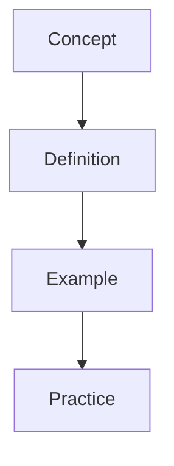

---

sources:
  - text: Standard textbook reference
title: "Diagnostics"
description: "Diagnostic test notes for alevel Diagnostics covering key concepts, worked examples, and practice problems for exam preparation."
date: 2026-01-01T00:00:00Z
---
sources:
  - text: Standard textbook reference

This section covers computational thinking, data structures, algorithms, and systems. Revision works best in one direction here: read Diagnostics, attempt the practice problems cold, and only then check the worked solutions.

# Diagnostics

**Prerequisites:** Review the prerequisite topics before attempting this section.

## Topics

- [Diag Algorithms](/computer-science/diagnostics/diag-algorithms/)
- [Diag Data Structures](/computer-science/diagnostics/diag-data-structures/)
- [Diag Fundamentals](/computer-science/diagnostics/diag-fundamentals/)
- [Diag Networks](/computer-science/diagnostics/diag-networks/)
- [Diag Programming](/computer-science/diagnostics/diag-programming/)
- [Diag Theory Of Computation](/computer-science/diagnostics/diag-theory-of-computation/)
- [Diagnostic Guide](/computer-science/diagnostics/diagnostic-guide/)

## Learning Objectives

- Understand the core principles and definitions covered in this section
- Apply key concepts to solve problems and answer exam-style questions
- Connect this material to prerequisite topics and related sections

## Study Approach

Work through Diagnostics alongside the practice problems for Computer Science, then let the diagnostic tests tell you whether it stuck.
Use the cross-references to link related concepts across subjects where applicable.

## Overview

This section provides comprehensive study materials and resources. Content is organised to build understanding progressively, from foundational concepts to advanced applications.

## Key Topics

- Core concepts and definitions
- Worked examples with step-by-step solutions
- Practice problems for self-assessment
- Cross-references to related topics

## Study Tips

Begin with the introductory material before progressing to advanced topics. Use the practice problems to test your understanding and identify areas for further study.

## Overview

This section provides comprehensive study materials and resources. Content is organised to build understanding progressively, from foundational concepts to advanced applications.

## Key Topics

- Core concepts and definitions
- Worked examples with step-by-step solutions
- Practice problems for self-assessment
- Cross-references to related topics

## Study Tips

Begin with the introductory material before progressing to advanced topics. Use the practice problems to test your understanding and identify areas for further study.

