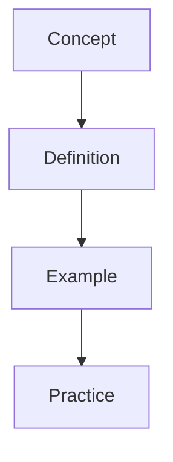

---
sources:
  - text: Standard textbook reference
title: "Diagnostics | A-Level - Wyatt's Notes"
sources:
  - text: Standard textbook reference
description: "Diagnostic test notes for alevel Diagnostics covering key concepts, worked examples, and practice problems for exam preparation."
sources:
  - text: Standard textbook reference
date: 2026-01-01T00:00:00Z
sources:
  - text: Standard textbook reference
---
sources:
  - text: Standard textbook reference

This section covers computational thinking, data structures, algorithms, and systems. Understanding these concepts is critical for both theory examinations and practical programming assessments.

# Diagnostics

**Prerequisites:** Review the prerequisite topics before attempting this section.

## Topics

- [Diag Algorithms](./diag-algorithms)
- [Diag Data Structures](./diag-data-structures)
- [Diag Fundamentals](./diag-fundamentals)
- [Diag Networks](./diag-networks)
- [Diag Programming](./diag-programming)
- [Diag Theory Of Computation](./diag-theory-of-computation)
- [Diagnostic Guide](./diagnostic-guide)

## Learning Objectives

- Understand the core principles and definitions covered in this section
- Apply key concepts to solve problems and answer exam-style questions
- Connect this material to prerequisite topics and related sections

## Study Approach

Begin with the topic summaries, then work through the practice problems to test your understanding.
Use the cross-references to link related concepts across subjects where applicable.

## Overview

This section provides comprehensive study materials and resources. Content is organised to build understanding progressively, from foundational concepts to advanced applications.

## Key Topics

- Core concepts and definitions
- Worked examples with step-by-step solutions
- Practice problems for self-assessment
- Cross-references to related topics

## Study Tips

Begin with the introductory material before progressing to advanced topics. Use the practice problems to test your understanding and identify areas for further study.

## Overview

This section provides comprehensive study materials and resources. Content is organised to build understanding progressively, from foundational concepts to advanced applications.

## Key Topics

- Core concepts and definitions
- Worked examples with step-by-step solutions
- Practice problems for self-assessment
- Cross-references to related topics

## Study Tips

Begin with the introductory material before progressing to advanced topics. Use the practice problems to test your understanding and identify areas for further study.

