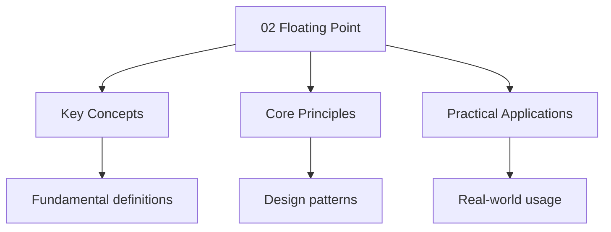

---

title: "Floating Point Representation | A-Level"
description: "Fixed-point representation allocates a fixed number of bits to the integer and fractional parts, Limiting both range and precision. decouples these: it uses"
date: 2025-06-02T16:25:28.480Z
tags:
  - ComputerScience
  - ALevel
categories:
  - ComputerScience

---

<!-- Breadcrumb Schema for SEO -->
<script type="application/ld+json">
{
  "@context": "https://schema.org",
  "@type": "BreadcrumbList",
  "itemListElement": [{"name": "Home", "url": "https://wyattau.com"}, {"name": "alevel", "url": "https://alevel.wyattau.com"}, {"name": "Computer Science", "url": "https://alevel.wyattau.com/computer-science"}, {"name": "Fundamentals", "url": "https://alevel.wyattau.com/computer-science/fundamentals"}, {"name": "02 Floating Point", "url": "https://alevel.wyattau.com/computer-science/fundamentals/02-floating-point"}]
}
</script>

## 1. Motivation

Fixed-point representation allocates a fixed number of bits to the integer and fractional parts,
Limiting both range and precision. **Floating-point representation** decouples these: it uses a form
Of scientific notation in binary, allowing a vastly larger range at the cost of variable precision.

## 2. IEEE 754 Single Precision (32-bit)

### Format

An IEEE 754 single-precision number uses 32 bits partitioned as follows:

```
| 1 bit  |   8 bits   |        23 bits        |
| Sign S | Exponent E |    Mantissa/Fraction M |
```

| Field          | Bits | Purpose                                                |
| -------------- | ---- | ------------------------------------------------------ |
| Sign ($S$)     | 1    | 0 = positive, 1 = negative                             |
| Exponent ($E$) | 8    | Biased exponent: stored as $E = e + 127$               |
| Mantissa ($M$) | 23   | Fractional part of the significand; implicit leading 1 |

### Decoding the Value

The represented value is:

$$(-1)^S \times 1.M \times 2^{E - 127}$$

Where $1.M$ denotes the binary number $1 + \sum_{i=1}^{23} m_i \cdot 2^{-i}$. The leading 1 is
**implicit** — it is not stored but always assumed (for normalised numbers). This is called the
**hidden bit convention**.

### Deriving the Range

**Normalised numbers** have $1 \leq E \leq 254$ (i.e., $E = 0$ and $E = 255$ are reserved).

- **Minimum exponent:** $E = 1 \Rightarrow e = 1 - 127 = -126$
- **Maximum exponent:** $E = 254 \Rightarrow e = 254 - 127 = 127$

**Largest positive normalised number:**

$$+1.111\ldots1 \times 2^{127} = (2 - 2^{-23}) \times 2^{127} \approx 3.403 \times 10^{38}$$

**Smallest positive normalised number:**

$$+1.000\ldots0 \times 2^{-126} = 2^{-126} \approx 1.175 \times 10^{-38}$$

**General range (normalised):** approximately $\pm 1.175 \times 10^{-38}$ to
$\pm 3.403 \times 10^{38}$.

### Precision

With 23 explicit mantissa bits plus 1 implicit bit, the significand has 24 bits of precision. This
Gives approximately $24 \times \log_{10}(2) \approx 7.22$ decimal digits of precision.

### Special Values

| Exponent $E$ | Mantissa $M$ | Meaning               |
| ------------ | ------------ | --------------------- |
| 0            | 0            | $\pm 0$ (signed zero) |
| 0            | $\neq 0$     | Denormalised number   |
| 255          | 0            | $\pm \infty$          |
| 255          | $\neq 0$     | NaN (Not a Number)    |

### Denormalised Numbers

When $E = 0$ and $M \neq 0$The value is:

$$(-1)^S \times 0.M \times 2^{-126}$$

Note: the implicit bit is now **0** (not 1), and the exponent is fixed at $-126$ (not $-127$).

**Why denormalised numbers exist:** Without them, there is a gap between zero ($0$) and the smallest
Normalised number ($2^{-126} \approx 1.18 \times 10^{-38}$). Denormalised numbers fill this gap,
Providing a **smooth gradual underflow**. The smallest positive denormalised number is:

$$0.000\ldots001 \times 2^{-126} = 2^{-23} \times 2^{-126} = 2^{-149} \approx 1.4 \times 10^{-45}$$

<details>
<summary>Example: Decode IEEE 754 single-precision 0x41280000</summary>

Hex: $41280000_{16}$

Binary: `0 10000010 01010000000000000000000`

- $S = 0$ (positive)
- $E = 10000010_2 = 130$ So $e = 130 - 127 = 3$
- $M = 01010000000000000000000$

Value: $(-1)^0 \times 1.0101 \times 2^3$

$1.0101_2 = 1 + 0.25 + 0.0625 = 1.3125$

$1.3125 \times 8 = 10.5$

</details>

<details>
<summary>Example: Encode $-6.5$ in IEEE 754 single precision</summary>

$6.5_{10} = 110.1_2 = 1.101 \times 2^2$

- $S = 1$
- $e = 2$ So $E = 2 + 127 = 129 = 10000001_2$
- $M = 10100000000000000000000$

Result: `1 10000001 10100000000000000000000`

`1 10000001 10100000000000000000000` = `11000000 11010000 00000000 00000000` = `C0 D0 00 00`

</details>

<hr />

## 3. Normalisation

A floating-point number is **normalised** when the leading bit of the significand is 1. In binary,
This means the number is expressed in the form:

$$\pm 1.xxxxxx \times 2^e$$

**Procedure for normalising:**

1. Write the number in binary
2. Shift the binary point so that exactly one non-zero digit precedes it
3. Count the shifts to determine the exponent
4. Express in the form $1.M \times 2^e$

<details>
<summary>Example: Normalise $0.00101_2$</summary>

Shift binary point right 3 positions: $1.01 \times 2^{-3}$

The normalised form is $1.01 \times 2^{-3}$.

In IEEE 754: $e = -3$, $E = -3 + 127 = 124 = 01111100_2$.

</details>

<hr />

## 4. Floating-Point Arithmetic and Errors

### Why $0.1 + 0.2 \neq 0.3$

**Theorem.** The decimal fraction $0.1_{10}$ has no finite binary representation.

**Proof.** We show $0.1_{10}$ requires infinitely many binary fractional digits.

$0.1_{10} = \frac{1}{10} = \frac{1}{2 \times 5}$

For a number to have a finite representation in base $b$When reduced to lowest terms
$\frac{p}{q}$The denominator $q$ must divide some power of $b$. Here $q = 10 = 2 \times 5$ And $5$
does not divide any power of $2$. Therefore $0.1_{10}$ has no finite binary expansion. $\square$

When stored in IEEE 754, $0.1_{10}$ is approximated by the nearest representable binary value.
Similarly for $0.2_{10}$ and $0.3_{10}$. Since the approximations introduce rounding errors, the sum
Of the approximations of $0.1$ and $0.2$ does not exactly equal the approximation of $0.3$.

```python
>>> 0.1 + 0.2
0.30000000000000004
>>> 0.1 + 0.2 == 0.3
False
```

### Absolute and Relative Error

Given an exact value $x$ and an approximate value $\tilde{x}$:

$$\mathrm{Absolute Error} = |x - \tilde{x}|$$

$$\mathrm{Relative Error} = \frac{|x - \tilde{x}|}{|x|}$$

**Machine epsilon** ($\epsilon$) is the smallest number such that $1 + \epsilon \gt 1$ in
Floating-point arithmetic. For IEEE 754 single precision,
$\epsilon = 2^{-23} \approx 1.19 \times 10^{-7}$.

### Sources of Floating-Point Error

1. **Representation error:** Most decimal fractions have infinite binary expansions
2. **Rounding error:** Arithmetic operations may round the result
3. **Cancellation error:** Subtracting nearly equal numbers loses significant digits
4. **Accumulation error:** Errors compound over many operations

:::caution
$|a - b| \lt \epsilon$ for some tolerance.
:::
<hr />

## 5. CIE Simplified 8-Bit Floating Point

:::note
- 1 sign bit
- 4 exponent bits (excess-8, i.e., bias = 8)
- 3 mantissa bits
:::
**Format:** `S EEEE MMM`

**Decoding:** $(-1)^S \times 0.MMM \times 2^{E - 8}$

Note: CIE uses an **explicit** leading 0 (not the hidden 1 of IEEE 754).

**Range:**

- Largest: $-1.111_2 \times 2^7 = -1.875 \times 128 = -240$
- Smallest positive: $+0.001_2 \times 2^0 = +0.125$

<details>
<summary>Example: Decode CIE 8-bit `0 1010 110`</summary>

$S = 0$ (positive) $E = 1010_2 = 10$, $e = 10 - 8 = 2$ $M = 110$

Value: $+0.110_2 \times 2^2 = 0.75 \times 4 = 3.0_{10}$

</details>

<details>
<summary>Example: Encode $-5.5$ in CIE 8-bit format</summary>

$5.5 = 101.1_2 = 0.1011 \times 2^3$

$S = 1$ $E = 3 + 8 = 11 = 1011_2$ $M = 101$ (truncate to 3 bits)

Result: `1 1011 101`

</details>

<hr />

## 6. Fixed-Point vs Floating-Point Comparison

| Property        | Fixed-Point                 | Floating-Point                          |
| --------------- | --------------------------- | --------------------------------------- |
| Range           | Limited by bit allocation   | Very large ($\sim 10^{\pm38}$)          |
| Precision       | Uniform (constant)          | Variable (depends on magnitude)         |
| Speed           | Faster (integer arithmetic) | Slower (requires FPU)                   |
| Hardware        | Simple                      | Complex (FPU required)                  |
| Representation  | Simple to understand        | Complex (normalisation, special values) |
| Rounding errors | Predictable                 | Less predictable near boundaries        |
| Use case        | Financial, embedded systems | Scientific computing, graphics          |

<hr />

## Problem Set

**Problem 1.** Convert $-14.25$ to IEEE 754 single precision. Give your answer in binary and
Hexadecimal.

<details>
<summary>Hint</summary>

Convert to binary, normalise, determine sign, exponent (with bias 127), and mantissa.

</details>

<details>
<summary>Answer</summary>

$14.25_{10} = 1110.01_2 = 1.11001 \times 2^3$

$S = 1$$E = 3 + 127 = 130 = 10000010_2$$M = 11001000000000000000000$

Binary: `1 10000010 11001000000000000000000`

Hex: `C1640000`

</details>

**Problem 2.** Decode the IEEE 754 single-precision value `BF800000` (hex).

<details>
<summary>Hint</summary>

Convert hex to binary, split into sign, exponent, mantissa fields.

</details>

<details>
<summary>Answer</summary>

`BF800000` = `10111111 10000000 00000000 00000000`

$S = 1$$E = 01111111_2 = 127$$e = 0$$M = 000\ldots0$

Value: $-1.0 \times 2^0 = -1.0$

</details>

**Problem 3.** What is the IEEE 754 single-precision representation of zero? What about negative
Zero?

<details>
<summary>Hint</summary>

Check the special values table: $E = 0$$M = 0$.

</details>

<details>
<summary>Answer</summary>

$+0$: `0 00000000 00000000000000000000000` = `00000000`

$-0$: `1 00000000 00000000000000000000000` = `80000000`

They compare equal in IEEE 754, but their sign bits differ.

</details>

**Problem 4.** Encode $9.75$ in the CIE 8-bit floating-point format.

<details>
<summary>Hint</summary>

Convert to binary, express as $0.MMM \times 2^{e}$ with bias 8.

</details>

<details>
<summary>Answer</summary>

$9.75 = 1001.11_2 = 0.100111 \times 2^4$

$S = 0$$E = 4 + 8 = 12 = 1100_2$$M = 100$ (truncate)

Result: `0 1100 100`

</details>

**Problem 5.** Prove that the decimal number $0.2_{10}$ has no finite binary representation.

<details>
<summary>Hint</summary>

Write $0.2$ as a fraction in lowest terms. Apply the same argument used for $0.1$.

</details>

<details>
<summary>Answer</summary>

$0.2 = \frac{2}{10} = \frac{1}{5}$

For a finite binary expansion, the denominator must divide a power of 2 when the fraction is in
Lowest terms. Since $5$ is prime and does not divide any power of $2$$1/5$ has no finite binary
Representation. $\square$

</details>

**Problem 6.** A system uses 12-bit floating-point: 1 sign bit, 5 exponent bits (excess-15), 6
Mantissa bits. Calculate the range and approximate precision.

<details>
<summary>Hint</summary>

Follow the same pattern as IEEE 754 but with different field sizes.

</details>

<details>
<summary>Answer</summary>

Assuming hidden bit convention:

- Min exponent: $e = 1 - 15 = -14$
- Max exponent: $e = 30 - 15 = 15$
- Largest: $(2 - 2^{-6}) \times 2^{15} = 1.984375 \times 32768 \approx 65024$
- Smallest normalised: $1.0 \times 2^{-14} \approx 6.1 \times 10^{-5}$
- Precision: $6 + 1 = 7$ bits $\approx 2.1$ decimal digits

</details>

**Problem 7.** Explain the difference between normalised and denormalised numbers in IEEE 754. Why
Would removing denormalised numbers be problematic?

<details>
<summary>Hint</summary>

Consider what happens as values approach zero without denormalised numbers.

</details>

<details>
<summary>Answer</summary>

Normalised numbers use the implicit leading 1 and exponent range $[-126, 127]$. Denormalised numbers
Use implicit leading 0 and fixed exponent $-126$.

Without denormalised numbers, there would be a sudden jump from the smallest normalised number
($\approx 1.18 \times 10^{-38}$) to zero. Any computation producing a result smaller than this
Threshold would "flush to zero," losing all precision. Denormalised numbers provide a gradual
Transition, maintaining relative precision longer.

</details>

**Problem 8.** In IEEE 754 single precision, how many distinct normalised numbers are there? How
Many denormalised?

<details>
<summary>Hint</summary>

Count the combinations of sign, exponent, and mantissa for each category.

</details>

<details>
<summary>Answer</summary>

Normalised: Exponent $E$ ranges from 1 to 254 (254 values). Mantissa $M$ has $2^{23}$ values. Sign
Has 2 values. Total: $2 \times 254 \times 2^{23} = 4,261,412,864$.

Denormalised: $E = 0$$M \neq 0$. Total: $2 \times (2^{23} - 1) = 16,777,214$.

</details>

**Problem 9.** A programmer computes $a = 10000000.0$ and $b = 0.00000001$ in single-precision
Float, then computes $a + b - a$. Explain why the result might be $0$ rather than $b$.

<details>
<summary>Hint</summary>

Think about the precision of single-precision float relative to the magnitude of $a$.

</details>

<details>
<summary>Answer</summary>

Single precision has approximately 7 decimal digits of precision. When $a = 10^7$The smallest
Representable difference between consecutive floats near $a$ is approximately
$a \times \epsilon \approx 10^7 \times 10^{-7} = 1$. Since $b = 10^{-8}$ is much smaller than the
Gap between representable numbers near $a$$a + b$ rounds to $a$ itself. Then $a - a = 0$.

This is an example of **cancellation error** combined with **limited precision**.

</details>

**Problem 10.** Calculate the absolute and relative error when $1/3$ is stored as $0.333333$ (6
Decimal places).

<details>
<summary>Hint</summary>

Use the formulas for absolute and relative error with $x = 1/3$ and $\tilde{x} = 0.333333$.

</details>

<details>
<summary>Answer</summary>

Absolute error:
$|1/3 - 0.333333| = |0.333333\ldots - 0.333333| = 0.000000\overline{3} \approx 3.33 \times 10^{-7}$

Relative error:
$\frac{3.33 \times 10^{-7}}{1/3} = 3.33 \times 10^{-7} \times 3 = 10^{-6} = 0.0001\%$

</details>

<hr />

## 7. IEEE 754 Double Precision (64-bit)

### Format

```
| 1 bit  |   11 bits  |        52 bits       |
| Sign S | Exponent E |    Mantissa M        |
```

| Field          | Bits | Purpose                             |
| -------------- | ---- | ----------------------------------- |
| Sign ($S$)     | 1    | 0 = positive, 1 = negative          |
| Exponent ($E$) | 11   | Biased exponent: $E = e + 1023$     |
| Mantissa ($M$) | 52   | Fractional part; implicit leading 1 |

### Decoding

$$(-1)^S \times 1.M \times 2^{E - 1023}$$

### Range

- **Largest normalised:** $(2 - 2^{-52}) \times 2^{1023} \approx 1.798 \times 10^{308}$
- **Smallest normalised:** $2^{-1022} \approx 2.225 \times 10^{-308}$
- **Precision:** $52 + 1 = 53$ bits $\approx 15.95$ decimal digits

### Comparison: Single vs Double

| Property        | Single (32-bit)                       | Double (64-bit)                        |
| --------------- | ------------------------------------- | -------------------------------------- |
| Sign            | 1 bit                                 | 1 bit                                  |
| Exponent        | 8 bits (bias 127)                     | 11 bits (bias 1023)                    |
| Mantissa        | 23 bits                               | 52 bits                                |
| Precision       | ~7 decimal digits                     | ~16 decimal digits                     |
| Max value       | ~$3.4 \times 10^{38}$                 | ~$1.8 \times 10^{308}$                 |
| Min normal      | ~$1.2 \times 10^{-38}$                | ~$2.2 \times 10^{-308}$                |
| Machine epsilon | $2^{-23} \approx 1.19 \times 10^{-7}$ | $2^{-52} \approx 2.22 \times 10^{-16}$ |

<hr />

## 8. Special Values in Detail

### Signed Zero

IEEE 754 has both $+0$ and $-0$:

- `+0`: Sign = 0, Exponent = 0, Mantissa = 0
- `-0`: Sign = 1, Exponent = 0, Mantissa = 0

They compare equal (`+0 == -0` is true), but their sign bits differ. This matters for:

- Division: $1 / +0 = +\infty$$1 / -0 = -\infty$
- Square root: $\sqrt{-0} = -0$
- Complex arithmetic where the sign of zero indicates direction

### Infinity

Represents overflow or division by zero:

- $+\infty$: Sign = 0, Exponent = 255 (all 1s), Mantissa = 0
- $-\infty$: Sign = 1, Exponent = 255, Mantissa = 0

Arithmetic rules:

| Operation               | Result    |
| ----------------------- | --------- |
| $x / 0$ (for $x \gt 0$) | $+\infty$ |
| $x / 0$ (for $x \lt 0$) | $-\infty$ |
| $\infty + \infty$       | $+\infty$ |
| $\infty - \infty$       | NaN       |
| $\infty \times \infty$  | $+\infty$ |
| $0 \times \infty$       | NaN       |
| $\infty / \infty$       | NaN       |

### NaN (Not a Number)

Represents undefined or indeterminate results:

- Sign = 0 or 1 (implementation-dependent)
- Exponent = 255 (all 1s)
- Mantissa $\neq$ 0 (any non-zero mantissa)

NaN is produced by:

| Operation         | Result |
| ----------------- | ------ |
| $0 / 0$           | NaN    |
| $\infty - \infty$ | NaN    |
| $\sqrt{-1}$       | NaN    |
| $\infty \times 0$ | NaN    |

Key property: **NaN is not equal to anything, including itself.**

```python
>>> float("nan') == float('nan')
False
>>> import math
>>> math.isnan(float('nan'))
True
```

To check for NaN, use `math.isnan(x)` — never use `x == float('nan')`.

<hr />

## 9. Precision Loss Examples

### Example 1: Catastrophic Cancellation

Subtracting two nearly equal numbers loses significant digits.

```python
a = 1.0000001
b = 1.0000000
difference = a - b  # Expected: 0.0000001 = 1e-7
print(difference)   # Output: 1.000000082740371e-07
```

The result has only 1 significant digit of accuracy despite both inputs having 8. The leading digits
Cancel out, leaving only the error terms.

### Example 2: Accumulation Error

```python
total = 0.0
for _ in range(1000000):
    total += 0.1
print(total)  # Expected: 100000.0
              # Output: 100000.00000000134
```

Each addition introduces a small rounding error. After a million additions, the errors accumulate to
A noticeable discrepancy.

### Example 3: Comparing Floats

```python
x = 0.1 + 0.2
y = 0.3
print(x == y)  # False

## Correct approach: compare within tolerance
epsilon = 1e-9
print(abs(x - y) < epsilon)  # True
```

<hr />

## 10. Common Pitfalls

| Pitfall                            | Explanation                                            | Solution                                                       |
| ---------------------------------- | ------------------------------------------------------ | -------------------------------------------------------------- |
| Using `==` for float comparison    | Rounding errors mean exact equality rarely holds       | Compare with tolerance: `abs(a - b) &lt; epsilon`              |
| Assuming floats are exact          | Most decimal fractions have infinite binary expansions | Use `decimal.Decimal` for financial calculations               |
| Subtracting nearly equal numbers   | Catastrophic cancellation destroys precision           | Rearrange the formula algebraically to avoid subtraction       |
| Adding small to large numbers      | The small number may be lost due to limited precision  | Add small numbers together first, then add to the large number |
| Checking `x == float('nan')`       | NaN is not equal to itself by definition               | Use `math.isnan(x)`                                            |
| Ignoring denormalised numbers      | Assuming all numbers have 24-bit precision             | Denormalised numbers near zero have fewer significant bits     |
| Mixing single and double precision | Implicit conversions can lose precision                | Be consistent with precision throughout the calculation        |

<hr />

## 11. Additional Problem Set

**Problem 1.** Encode the value $-0.75$ in IEEE 754 single precision. Give the binary and
Hexadecimal representation.

<details>
<summary>Answer</summary>

$0.75_{10} = 0.11_2 = 1.1 \times 2^{-1}$

$S = 1$ (negative)

$E = -1 + 127 = 126 = 01111110_2$

$M = 10000000000000000000000$

Binary: `1 01111110 10000000000000000000000`

Hex: `10111111 01000000 00000000 00000000` = `BF400000`

</details>

**Problem 2.** Decode the IEEE 754 double-precision value `4039000000000000` (hex).

<details>
<summary>Answer</summary>

Hex: `4039000000000000`

Binary: `0100000000111001000000000000000000000000000000000000000000000000`

- $S = 0$ (positive)
- $E = 10000000011_2 = 1027$ So $e = 1027 - 1023 = 4$
- $M = 1001000000...0$

Value: $(-1)^0 \times 1.1001_2 \times 2^4$

$1.1001_2 = 1 + 0.5 + 0.0625 = 1.5625$

$1.5625 \times 16 = 25.0$

So the value is $25.0$.

</details>

**Problem 3.** Explain what happens when you compute `1.0 / 0.0` and `0.0 / 0.0` in IEEE 754. Why
Are the results different?

<details>
<summary>Answer</summary>

`1.0 / 0.0` produces $+\infty$. This represents mathematical division where a non-zero quantity is
Divided by zero — the result tends to infinity.

`0.0 / 0.0` produces NaN. This represents an indeterminate form: the limit depends on how both
Numerator and denominator approach zero (e.g., $\lim_{x \to 0} x/x = 1$ but
$\lim_{x \to 0} 2x/x = 2$). Since the result is not uniquely determined, IEEE 754 returns NaN.

The distinction is important because $+\infty$ can participate meaningfully in further arithmetic
(e.g., $1 / \infty = 0$), while NaN propagates through all operations, signalling that the result is
Invalid.

</details>

**Problem 4.** A programmer writes the following code to compute the quadratic formula. Explain why
It may give incorrect results and suggest a fix.

```python
def quadratic(a, b, c):
    discriminant = b**2 - 4*a*c
    x1 = (-b + discriminant**0.5) / (2*a)
    x2 = (-b - discriminant**0.5) / (2*a)
    return x1, x2
```

<details>
<summary>Answer</summary>

**Problem: Catastrophic cancellation.** When $4ac$ is small compared to $b^2$The discriminant is
Close to $b^2$. Then $\sqrt{b^2 - 4ac} \approx |b|$ And one of the numerators becomes $-b + |b|$ or
$-b - |b|$. If $b \gt 0$ Then $-b + \sqrt{b^2 - 4ac}$ subtracts nearly equal numbers, losing
Precision.

**Fix:** Compute one root with the standard formula and the other using the identity
$x_1 \times x_2 = c/a$:

```python
def quadratic(a, b, c):
    discriminant = b**2 - 4*a*c
    sqrt_d = discriminant**0.5
    if b >= 0:
        x1 = (-b - sqrt_d) / (2*a)
    else:
        x1 = (-b + sqrt_d) / (2*a)
    x2 = c / (a * x1)
    return x1, x2
```

By choosing the sign that avoids cancellation in $x_1$ And computing $x_2$ from the product
Relationship, both roots maintain full precision.

</details>

**Problem 5.** In IEEE 754 single precision, what is the smallest positive number that, when added
To $1.0$Produces a result different from $1.0$? Explain why.

<details>
<summary>Answer</summary>

This is the definition of **machine epsilon**: the smallest $\epsilon$ such that
$1 + \epsilon \gt 1$.

In single precision, the mantissa has 23 bits. The value $1.0$ is represented as
$1.000\ldots0 \times 2^0$. The next representable number is $1.000\ldots01 \times 2^0$Where the Last
bit of the mantissa is 1.

This value is $1 + 2^{-23} \approx 1.0000001192092896$.

So $\epsilon = 2^{-23} \approx 1.19 \times 10^{-7}$.

Any value smaller than $\epsilon$When added to $1.0$Rounds back to $1.0$ because there are not
Enough mantissa bits to represent the difference. For example, $1.0 + 2^{-24} = 1.0$ in single
Precision.

</details>

## Intuition

**This topic explores fundamental concepts that shape our understanding of the world.**




## Summary

This topic covers the core concepts of floating point representation, including underlying theory,
practical implementation, and key applications.

**Key concepts include:**

- core concepts and terminology
- algorithms and computational thinking
- practical implementation
- security and ethical considerations
- applications in the real world

Understanding these concepts thoroughly is essential for both examinations and practical
programming, and requires both theoretical knowledge and hands-on practice.

## Worked Examples

Worked examples demonstrating the application of key concepts are covered in the detailed sub-pages
linked above.

## See Also

- [Fundamentals](./)
- [Number Systems](./01-number-systems)
- [Boolean Algebra](./03-boolean-algebra)
