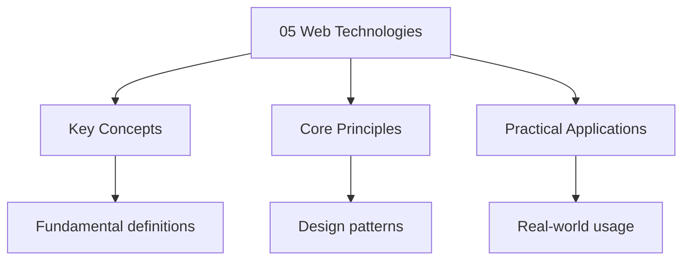

---

title: "Web Technologies | A-Level - Wyatt's Notes"
description: "Of these concepts within their networking modules. Comprehensive educational content coverage with definitions, worked examples, and practice problems."
date: 2026-04-03T00:00:00.000Z
tags:
  - ComputerScience
  - ALevel
categories:
  - ComputerScience

---

<!-- Breadcrumb Schema for SEO -->
<script type="application/ld+json">
{
  "@context": "https://schema.org",
  "@type": "BreadcrumbList",
  "itemListElement": [{"name": "Home", "url": "https://wyattau.com"}, {"name": "alevel", "url": "https://alevel.wyattau.com"}, {"name": "Computer Science", "url": "https://alevel.wyattau.com/computer-science"}, {"name": "Networks", "url": "https://alevel.wyattau.com/computer-science/networks"}, {"name": "05 Web Technologies", "url": "https://alevel.wyattau.com/computer-science/networks/05-web-technologies"}]
}
</script>

:::note
Of these concepts within their networking modules.
:::
## 1. The Internet and the World Wide Web

### The Internet vs the Web

The **Internet** is the global physical infrastructure of interconnected networks — cables, routers,
Switches, and servers — communicating via the TCP/IP protocol suite.

The **World Wide Web** (WWW) is an application running on top of the Internet: a system of
Interlinked documents accessed via browsers using URLs, HTTP, and HTML.

| Aspect    | Internet                              | World Wide Web                 |
| --------- | ------------------------------------- | ------------------------------ |
| Nature    | Physical infrastructure               | Application/service            |
| Created   | 1969 (ARPANET)                        | 1989 (Tim Berners-Lee at CERN) |
| Protocols | TCP/IP, BGP, OSPF                     | HTTP, HTML, URL                |
| Scope     | All networked communication           | Document and resource sharing  |
| Access    | Any application (email, gaming, VoIP) | Web browsers                   |

### Historical Development

- **1969 — ARPANET:** US Department of Defence created the first packet-switching network, linking
  four universities. Precursor to the modern Internet.
- **1973 — TCP/IP:** Vint Cerf and Bob Kahn developed the protocol suite for inter-network
  communication.
- **1983 — TCP/IP adopted:** ARPANET officially switched to TCP/IP on 1 January 1983.
- **1989 — WWW invented:** Tim Berners-Lee proposed the Web at CERN, defining HTML, URLs, and HTTP.
- **1991 — First website:** `info.cern.ch` went live at CERN.
- **1993 — Mosaic browser:** First graphical web browser made the Web accessible to non-technical
  users.

### Key Internet Protocols

| Protocol | Full Name                   | Port  | Purpose                      |
| -------- | --------------------------- | ----- | ---------------------------- |
| TCP      | Transmission Control Proto  | —     | Reliable, ordered delivery   |
| IP       | Internet Protocol           | —     | Addressing and routing       |
| HTTP     | HyperText Transfer Protocol | 80    | Requesting web pages         |
| HTTPS    | HTTP Secure                 | 443   | Encrypted web communication  |
| DNS      | Domain Name System          | 53    | Domain name to IP resolution |
| FTP      | File Transfer Protocol      | 20/21 | Uploading and downloading    |
| SMTP     | Simple Mail Transfer Proto  | 25    | Sending email                |
| POP3     | Post Office Protocol v3     | 110   | Retrieving email (download)  |
| IMAP     | Internet Message Access Pr  | 143   | Accessing email on server    |

<hr />

## 2. HTML and CSS

### HTML Structure

HTML (HyperText Markup Language) defines the structure and content of web pages:

```html
<!DOCTYPE html>
<html lang="en">
  <head>
    <meta charset="UTF-8" />
    <meta name="viewport" content="width=device-width, initial-scale=1.0" />
    <title>Page Title</title>
  </head>
  <body>
    <!-- Visible content goes here -->
  </body>
</html>
```

- `<!DOCTYPE html>` — declares an HTML5 document
- `<html>` — root element
- `<head>` — metadata: character set, viewport, title, linked stylesheets
- `<body>` — visible content

### Semantic HTML

Semantic elements describe meaning to browsers and assistive technologies:

| Element     | Purpose                                      |
| ----------- | -------------------------------------------- |
| `<header>`  | Introductory content or navigation links     |
| `<nav>`     | Navigation links (menus, tables of contents) |
| `<main>`    | Primary content of the document              |
| `<footer>`  | Footer for the nearest sectioning element    |
| `<article>` | Self-contained, independently distributable  |
| `<section>` | Thematic grouping of content with a heading  |
| `<aside>`   | Tangentially related content (sidebars)      |
| `<figure>`  | Self-contained content (images, diagrams)    |

### Common HTML Elements

```html
<h1>Heading</h1>
A paragraph of text.
<a href="https://example.com">A link</a>

<ul>
  <li>Unordered list item</li>
</ul>
<table>
  <tr>
    <th>Header</th>
  </tr>
  <tr>
    <td>Data</td>
  </tr>
</table>
<form action="/submit" method="POST">
  <input type="text" name="username" required />
  <button type="submit">Submit</button>
</form>
```

### CSS Syntax

CSS (Cascading Style Sheets) controls presentation. A rule has a **selector** and a **declaration
Block** of **property–value pairs**:

```css
selector {
  property: value;
}
```

| Selector     | Example   | Selects                      |
| ------------ | --------- | ---------------------------- |
| Element      | `p`       | All `` elements              |
| Class        | `.card`   | Elements with `class="card"` |
| ID           | `#header` | Element with `id="header"`   |
| Descendant   | `nav a`   | All `<a>` inside `<nav>`     |
| Pseudo-class | `a:hover` | `<a>` when hovered           |

**Specificity** (highest to lowest): inline style &gt; ID &gt; class &gt; element.

### CSS Box Model

Every element is rendered as a rectangular box:

```
+------------------- margin -------------------+
|  +-------------- border -----------------+   |
|  |  +---------- padding --------------+  |   |
|  |  |          content               |  |   |
|  |  +--------------------------------+  |   |
|  +----------------------------------------+   |
+------------------------------------------------+
```

- **Content:** Actual text/images. Set by `width` and `height`.
- **Padding:** Space between content and border.
- **Border:** Border around the padding.
- **Margin:** Space outside the border.

```css
/* Default: width/height apply to content only */
box-sizing: content-box;

/* Preferred: width/height include padding and border */
box-sizing: border-box;
```

### CSS Layout

**Flexbox** (one-dimensional):

```css
.container {
  display: flex;
  justify-content: space-between;
  align-items: center;
  gap: 16px;
}
```

**Grid** (two-dimensional):

```css
.grid-container {
  display: grid;
  grid-template-columns: repeat(3, 1fr);
  gap: 20px;
}
```

### Responsive Design

**Media queries** apply styles based on device characteristics:

```css
.container {
  padding: 10px;
  font-size: 14px;
}

@media (min-width: 768px) {
  .container {
    padding: 20px;
    font-size: 16px;
  }
}
```

**Viewport units** (`vw``vh`) scale relative to the browser window:

```css
.hero {
  width: 100vw;
  height: 100vh;
  font-size: 2vw;
}
```

<hr />

## 3. JavaScript and Client-Side Scripting

### Role of JavaScript

JavaScript runs in the browser and enables dynamic, interactive web pages:

- Modifying HTML and CSS after page load
- Responding to user events (clicks, key presses, form submissions)
- Communicating with servers without reloading (AJAX)
- Storing data locally (cookies, local storage)
- Validating form input before submission

### DOM Manipulation

The **Document Object Model** (DOM) is a tree-structured interface representing the HTML document:

```javascript
const element = document.getElementById("greeting');
element.textContent = 'Hello, A Level!';
element.style.color = 'blue';

const newParagraph = document.createElement('p');
newParagraph.textContent = 'Dynamically added';
document.body.appendChild(newParagraph);
```

### Event Handling

```javascript
const button = document.getElementById('myButton');

button.addEventListener('click', () => {
  console.log('Button clicked!');
});
```

Common events: `click``keydown``keyup``mouseover``submit``load``change`.

### Client-Side vs Server-Side Validation

| Aspect   | Client-side                       | Server-side                |
| -------- | --------------------------------- | -------------------------- |
| Location | Browser (JavaScript)              | Server (Python, PHP, etc.) |
| Speed    | Instant feedback                  | Requires round-trip        |
| Security | Can be bypassed                   | Cannot be bypassed         |
| Purpose  | UX, reducing unnecessary requests | Data integrity, security   |

**Best practice:** Always perform both. Client-side for UX; server-side for security.

```javascript
function validateForm(event) {
  const email = document.getElementById('email').value;
  const pattern = /^[^\s@]+@[^\s@]+\.[^\s@]+$/;
  if (!pattern.test(email)) {
    event.preventDefault();
    alert('Please enter a valid email address.');
  }
}
```

### Security Implications

- **Code is visible:** Anyone can view JavaScript via developer tools. Never embed secrets.
- **Can be disabled:** Users can disable JavaScript, bypassing all client-side checks.
- **XSS risk:** Uns sanitised input inserted into the DOM enables script injection.
- **Same-origin policy:** Browsers restrict cross-domain access to prevent attacks.

<hr />

## 4. HTTP and HTTPS

### HTTP Methods

| Method | Purpose                     | Idempotent | Has body |
| ------ | --------------------------- | ---------- | -------- |
| GET    | Retrieve a resource         | Yes        | No       |
| POST   | Submit data (create)        | No         | Yes      |
| PUT    | Replace a resource entirely | Yes        | Yes      |
| DELETE | Remove a resource           | Yes        | No       |

**Idempotent:** making the same request multiple times produces the same result as once.

### HTTP Status Codes

| Code | Name                | Meaning                        |
| ---- | ------------------- | ------------------------------ |
| 200  | OK                  | Successful request             |
| 301  | Moved Permanently   | Resource permanently relocated |
| 404  | Not Found           | Resource does not exist        |
| 500  | Internal Server Err | Server-side failure            |

Ranges: 1xx (information), 2xx (success), 3xx (redirection), 4xx (client error), 5xx (server error).

### Request and Response Structure

```
POST /login HTTP/1.1              ← Request line
Host: www.example.com             ← Headers
Content-Type: application/x-www-form-urlencoded

username=alice&password=secret    ← Body
```

```
HTTP/1.1 200 OK                   ← Status line
Content-Type: text/html           ← Headers

<!DOCTYPE html>...                ← Body
```

### HTTPS and TLS

HTTPS encrypts HTTP traffic using **TLS** (Transport Layer Security). TLS handshake:

1. **Client Hello:** Client sends supported cipher suites and TLS versions.
2. **Server Hello:** Server selects cipher suite and sends its certificate.
3. **Key exchange:** Client and server agree on a shared symmetric key.
4. **Finished:** Encrypted communication begins.

**Why HTTPS matters:** confidentiality (data encrypted), integrity (data cannot be tampered with),
Authentication (server identity verified via certificates), and SEO (search engines prefer HTTPS).

### Cookies and Sessions

**Cookies** are small data stored by the browser, sent with every request to the same domain:

```
Set-Cookie: session_id=abc123; HttpOnly; Secure; SameSite=Strict
```

| Flag       | Purpose                                  |
| ---------- | ---------------------------------------- |
| `HttpOnly` | Prevents JavaScript access (XSS defence) |
| `Secure`   | Cookie sent only over HTTPS              |
| `SameSite` | Controls cross-site request behaviour    |
| `Max-Age`  | Cookie lifetime in seconds               |

A **session** is server-side state. The server stores the session and sends the session ID as a
Cookie. On subsequent requests, the cookie identifies the session.

<hr />

## 5. Search Engine Optimisation (SEO)

### How Search Engines Work

1. **Crawling:** Automated **spiders** follow links, discovering new and updated content.
2. **Indexing:** Crawled pages are analysed and stored in a massive database. Content, structure,
   and metadata are recorded.
3. **Ranking:** Algorithms rank pages by relevance using 200+ factors including keywords, backlinks,
   page speed, and mobile-friendliness.

### On-Page SEO

| Technique        | Description                                        |
| ---------------- | -------------------------------------------------- |
| Title tag        | Unique, descriptive `<title>` per page             |
| Meta description | Summary shown in search results                    |
| Headings         | `<h1>` once per page; `<h2>`–`<h6>` hierarchically |
| Semantic HTML    | `<article>``<section>``<nav>` for structure        |
| Alt text         | Describe images for accessibility                  |
| URL structure    | Clean URLs: `/products/laptops` not `/p?id=3`      |

### Off-Page SEO

- **Backlinks:** Links from other websites. Quality matters more than quantity.
- **Domain authority:** Metric predicting ranking based on age, backlinks, trust.
- **Social signals:** Engagement on social media can indirectly improve rankings.

<hr />

## 6. Web Security

### Cross-Site Scripting (XSS)

XSS occurs when an attacker injects malicious JavaScript into a page viewed by other users.

**Stored XSS:** Malicious script is permanently stored on the server (e.g., in a forum post). Every
User who views the page executes the script.

**Reflected XSS:** Script is embedded in a URL. The server reflects it back without encoding. The
Victim must click the crafted link.

**DOM-based XSS:** Vulnerability is entirely client-side. JavaScript reads user input (e.g., from
`document.location`) and inserts it into the DOM unsafely using `innerHTML`.

**Prevention:** Output encoding, Content Security Policy headers, using `textContent` instead of
`innerHTML`And `HttpOnly` cookies.

### SQL Injection

SQL injection exploits poor input handling to execute arbitrary SQL:

```python
## Vulnerable
query = f"SELECT * FROM users WHERE username = '{username}'"
```

Input `username = "' OR '1'='1' --"` produces:

```sql
SELECT * FROM users WHERE username = '' OR '1'='1' --'
```

This returns all users because `'1'='1'` is always true.

**Prevention:** Parameterised queries treat input as data, not executable SQL:

```python
cursor.execute("SELECT * FROM users WHERE username = %s", (username,))
```

### Cross-Site Request Forgery (CSRF)

CSRF tricks an authenticated user into executing unwanted actions. A malicious site contains:

```html

```

The browser sends the victim's session cookie with the request.

**Prevention:** CSRF tokens (unique per session), `SameSite` cookies, and re-authentication for
Critical actions.

### Security Best Practices

1. **Input validation:** Validate all input server-side. Whitelist known-good values.
2. **Output encoding:** Encode data before rendering in HTML, JavaScript, or URLs.
3. **Principle of least privilege:** Minimum permissions for users, processes, and database
   accounts.
4. **HTTPS everywhere:** TLS for all communication.
5. **Keep software updated:** Apply security patches promptly.
6. **Strong password policies:** Use bcrypt/Argon2 for hashing.
7. **Content Security Policy:** Restrict script sources to prevent XSS.
8. **Regular audits:** Automated scanning and penetration testing.

<hr />

## Problem Set

**Problem 1.** Explain the difference between the Internet and the World Wide Web.

<details>
<summary>Answer</summary>

The **Internet** is the global physical infrastructure (cables, routers, servers) using TCP/IP. The
**World Wide Web** is one application on the Internet — interlinked documents accessed via browsers
Using HTTP, HTML, and URLs, invented by Tim Berners-Lee at CERN in 1989. Many services (email via
SMTP, VoIP) use the Internet but are not part of the Web. The Internet existed for 20 years before
The Web was created.

</details>

**Problem 2.** Write an HTML page using semantic elements for a student blog with navigation, a main
Article, and a footer. Why does semantic HTML improve accessibility?

<details>
<summary>Answer</summary>

```html
<!DOCTYPE html>
<html lang="en">
  <head>
    <meta charset="UTF-8" />
    <title>My CS Blog</title>
  </head>
  <body>
    <header>
      <h1>My Computer Science Blog</h1>
      <nav>
        <ul>
          <li><a href="/">Home</a></li>
        </ul>
      </nav>
    </header>
    <main>
      <article>
        <h2>Understanding Recursion</h2>
        A function that calls itself to solve sub-problems.
      </article>
    </main>
    <footer>&copy; 2026 Student Blog</footer>
  </body>
</html>
```

Semantic HTML improves accessibility because screen readers can distinguish navigation from content
From footer, allowing users to jump between sections. Search engines also better understand page
Structure for indexing.

</details>

**Problem 3.** An element has `width: 200px``padding: 20px``border: 5px solid black`And
`margin: 15px`. Calculate total space for both `content-box` and `border-box`.

<details>
<summary>Answer</summary>

**content-box:** Visible width = 200 + 40 (padding) + 10 (border) = 250px. Total with margin = 250 +
30 = 280px.

**border-box:** Visible width = 200px (includes padding and border). Content = 200 - 40 - 10 =
150px. Total with margin = 200 + 30 = 230px.

</details>

**Problem 4.** Explain client-side vs server-side validation. Why is server-side validation always
Necessary?

<details>
<summary>Answer</summary>

**Client-side** runs in the browser (JavaScript) providing instant feedback (e.g., email format
Check). **Server-side** runs after submission against backend resources (e.g., checking a database).

Server-side validation is always necessary because: (1) JavaScript can be disabled; (2) attackers
Can send crafted HTTP requests directly, bypassing the browser entirely; (3) only the server can
Verify business rules (sufficient funds, item in stock). Client-side validation is UX only, not
Security.

</details>

**Problem 5.** Describe every step from typing `https://www.example.com/page` to the page being
Displayed.

<details>
<summary>Answer</summary>

1. **URL parsing:** Protocol (`https`), domain (`www.example.com`), path (`/page`).
2. **DNS resolution:** Browser cache &rarr; OS cache &rarr; recursive resolver &rarr; root server
   &rarr; TLD server &rarr; authoritative server &rarr; IP address (cached at each level).
3. **TCP handshake:** SYN &rarr; SYN-ACK &rarr; ACK (connection established on port 443).
4. **TLS handshake:** Client/server negotiate cipher suite, server presents certificate, key
   exchange establishes a symmetric session key.
5. **HTTP request:** `GET /page HTTP/1.1` with headers sent over encrypted connection.
6. **HTTP response:** Server returns `200 OK` with HTML, CSS, JS, images.
7. **Rendering:** Browser parses HTML, builds DOM, executes JavaScript, paints the page.

</details>

**Problem 6.** Explain the three types of XSS and how to prevent each.

<details>
<summary>Answer</summary>

**Stored XSS:** Attacker submits malicious script via an input field; server stores it uns
Sanitised. Every user who views the page executes the script. **Prevent:** sanitise and encode all
User input; use CSP headers.

**Reflected XSS:** Attacker crafts a URL with script in a parameter; server reflects it without
Encoding. Victim must click the link. **Prevent:** encode all user-supplied data in responses.

**DOM-based XSS:** Entirely client-side. JavaScript reads user input and inserts it via `innerHTML`
Unsafely. **Prevent:** use `textContent``createElement()`And `appendChild()`.

**General:** Content Security Policy, `HttpOnly` cookies, input validation, output encoding.

</details>

**Problem 7.** A login query is `SELECT * FROM users WHERE username = '[input]'`. Show a SQL
Injection attack and the fix.

<details>
<summary>Answer</summary>

**Attack:** Input `' OR '1'='1' --` produces:

```sql
SELECT * FROM users WHERE username = '' OR '1'='1' --'
```

This returns all users. The `--` comments out the rest of the query.

**Fix with parameterised queries:**

```python
cursor.execute("SELECT * FROM users WHERE username = %s", (username,))
```

The database treats the input as a literal string, not executable SQL.

</details>

**Problem 8.** Explain how CSRF works and three prevention methods.

<details>
<summary>Answer</summary>

**How it works:** Victim is logged into a legitimate site (e.g., bank) and receives a session
Cookie. They visit a malicious site containing a hidden request (e.g., an `` tag with `src`
Pointing to a bank transfer URL). The browser sends the session cookie automatically.

**Prevention:** (1) **CSRF tokens** — unique, unpredictable tokens per session embedded in forms;
(2) **SameSite cookies** — `Strict` or `Lax` prevents cookies with cross-site requests; (3)
**Re-authentication** — require password for sensitive actions.

</details>

**Problem 9.** Explain cookies vs sessions. What security flags should authentication cookies have?

<details>
<summary>Answer</summary>

**Cookies** are small text files stored on the client, sent with every request (~4 KB limit).
**Sessions** are server-side data structures identified by a session ID cookie. Sessions can store
Unlimited data and are invisible to the client.

**Security flags:** `HttpOnly` (prevents JavaScript access — XSS defence), `Secure` (HTTPS only),
`SameSite=Strict` (prevents cross-site requests — CSRF defence), `Path` (restrict to specific URLs).
Example: `Set-Cookie: session_id=abc123; HttpOnly; Secure; SameSite=Strict; Path=/`

</details>

**Problem 10.** Why is client-side JavaScript validation insufficient for security? Give four
Reasons.

<details>
<summary>Answer</summary>

1. **JavaScript can be disabled**. Users or attackers can turn it off in browser settings.
2. **Requests can be crafted directly**. Tools like `curl` send HTTP requests bypassing all
   browser-side validation.
3. **Client code is modifiable**. Developer tools allow inspection and modification of JavaScript.
4. **Business logic requires the server**. Rules like "sufficient funds" can only be enforced with
   database access.
5. **Race conditions**. Server state may change between client validation and request arrival.

Client-side validation is a UX feature only. Server-side validation is the only reliable security
Boundary.

</details>

## Common Pitfalls

1. Confusing an algorithm with a program. An algorithm is a step-by-step procedure, not its
   implementation in code.

2. Neglecting to normalise database designs, leading to data redundancy and update anomalies.

3. Forgetting that $O(n \log n)$ average-case for quicksort becomes $O(n^2)$ worst-case on already
   sorted input.

4. Misunderstanding the difference between a stack (LIFO) and a queue (FIFO) in data structure
   applications.

## Intuition

**This topic explores fundamental concepts that shape our understanding of the world.**




## Summary

The key principles covered in this topic are linked in the sub-pages above. Focus on understanding
the definitions, applying the formulas or frameworks, and evaluating strengths and limitations of
each approach.

## Worked Examples

Worked examples demonstrating the application of key concepts are covered in the detailed sub-pages
linked above.
