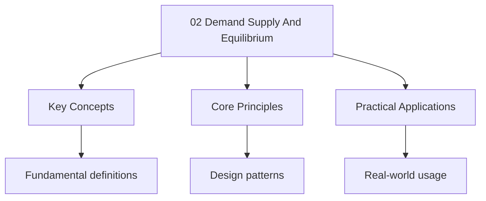

---

title: Demand, Supply and Equilibrium
description: "We define as the quantity of a good or service that consumers are _willing and able_ to Purchase at each possible price during a given time period, _ceteris"
date: 2025-06-02T16:25:28.480Z
tags:
  - Economics
  - ALevel
categories:
  - Economics

---

<!-- Breadcrumb Schema for SEO -->

## 1. Demand

### 1.1 Definition

We define **demand** as the quantity of a good or service that consumers are _willing and able_ to
Purchase at each possible price during a given time period, _ceteris paribus_.

$$Q_d = f(P, Y, P_s, P_c, T, E, N)$$

Where $P$ = price of the good, $Y$ = income, $P_s$ = price of substitutes, $P_c$ = price of
Complements, $T$ = tastes, $E$ = expectations, $N$ = population.

The **law of demand** states that, ceteris paribus, as price rises, quantity demanded falls. This
Follows from:

1. **Income effect**: a higher price reduces real purchasing power
2. **Substitution effect**: a higher price makes substitutes relatively more attractive

### 1.2 Deriving Individual Demand from Utility Maximisation

Consider a consumer with utility function $U(x, y)$ facing prices $P_x$, $P_y$ and income $M$. The
Consumer solves:

$$
\begin{aligned}
\max_{x,y} \quad & U(x, y) \\
\mathrm{s.t.} \quad & P_x \cdot x + P_y \cdot y = M
\end{aligned}
$$

The Lagrangian is:

$$\mathcal{L} = U(x, y) + \lambda(M - P_x \cdot x - P_y \cdot y)$$

First-order conditions:

$$\frac{\partial \mathcal{L}}{\partial x} = \frac{\partial U}{\partial x} - \lambda P_x = 0 \implies \frac{MU_x}{P_x} = \lambda$$

$$\frac{\partial \mathcal{L}}{\partial y} = \frac{\partial U}{\partial y} - \lambda P_y = 0 \implies \frac{MU_y}{P_y} = \lambda$$

Therefore:

$$\frac{MU_x}{MU_y} = \frac{P_x}{P_y} \implies \mathrm{MRS}_{xy} = \frac{P_x}{P_y}$$

This equates the marginal rate of substitution (the consumer"s internal valuation) with the price
Ratio (the market's valuation). Solving for $x$ as a function of $P_x$ (holding other parameters
Constant) yields the **individual demand curve** $x = d_i(P_x)$.

### 1.3 Market Demand

The **market demand curve** is derived by **horizontal summation** of individual demand curves:

$$Q_D(P) = \sum_{i=1}^{n} d_i(P) = d_1(P) + d_2(P) + \cdots + d_n(P)$$

At each price, we add up the quantities demanded by all consumers.

### 1.4 Movements Along vs Shifts

- **Movement along the demand curve**: caused by a change in the good's _own price_. We move from
  one point to another _on the same curve_.
- **Shift of the demand curve**: caused by a change in any _determinant other than the good's own
  price_. The entire curve moves left (decrease in demand) or right (increase in demand).

### 1.5 Determinants of Demand

| Determinant                               | Effect on Demand                                       | Example                                                |
| ----------------------------------------- | ------------------------------------------------------ | ------------------------------------------------------ |
| Income ($\uparrow$)                       | Normal goods: $\uparrow$; Inferior goods: $\downarrow$ | Demand for bus travel falls as income rises (inferior) |
| Price of substitute ($\uparrow$)          | $\uparrow$                                             | Tea demand rises when coffee price rises               |
| Price of complement ($\uparrow$)          | $\downarrow$                                           | Petrol demand falls when car prices rise               |
| Tastes (towards good)                     | $\uparrow$                                             | Health campaigns increase demand for fruit             |
| Expectations of future price ($\uparrow$) | $\uparrow$ (current demand)                            | Consumers stockpile before expected price rise         |
| Population ($\uparrow$)                   | $\uparrow$                                             | UK population growth increases housing demand          |

:::caution
Demanded" means a _movement along the curve_ due to a price change. These are fundamentally
Different. Examiners penalise imprecise language.
:::
## 2. Supply

### 2.1 Definition

We define **supply** as the quantity of a good or service that producers are _willing and able_ to
Offer for sale at each possible price during a given time period, _ceteris paribus_.

$$Q_s = g(P, C, T, S, E, n)$$

Where $C$ = costs of production, $T$ = technology, $S$ = subsidies/taxes, $E$ = expectations, $n$ =
Number of firms.

The **law of supply** states that, ceteris paribus, as price rises, quantity supplied rises. This
Follows from profit maximisation.

### 2.2 Deriving Supply from Profit Maximisation

A firm with cost function $C(Q)$ and facing price $P$ maximises profit:

$$\pi(Q) = P \cdot Q - C(Q)$$

First-order condition:

$$\frac{d\pi}{dQ} = P - C'(Q) = 0 \implies P = MC(Q)$$

Where $MC(Q) = C'(Q)$ is marginal cost. Second-order condition requires $C''(Q) \gt 0$ (MC Rising).
The **supply curve** of a competitive firm is the portion of its $MC$ curve above the Average
variable cost (AVC) curve.

$$Q_s(P) = MC^{-1}(P) \quad \mathrm{for } P \geq \min AVC$$

### 2.3 Market Supply

$$Q_S(P) = \sum_{j=1}^{m} s_j(P)$$

Horizontal summation of individual firm supply curves.

### 2.4 Determinants of Supply

| Determinant                               | Effect on Supply              | Example                                           |
| ----------------------------------------- | ----------------------------- | ------------------------------------------------- |
| Costs of production ($\uparrow$)          | $\downarrow$                  | Higher wages reduce supply                        |
| Technology (improvement)                  | $\uparrow$                    | Automation increases supply                       |
| Subsidy ($\uparrow$)                      | $\uparrow$                    | Renewable energy subsidies increase supply        |
| Indirect tax ($\uparrow$)                 | $\downarrow$                  | Sugar tax reduces supply of sugary drinks         |
| Expectations of future price ($\uparrow$) | $\downarrow$ (current supply) | Farmers withhold supply expecting higher prices   |
| Number of firms ($\uparrow$)              | $\uparrow$                    | Entry of new coffee shops increases market supply |

## 3. Market Equilibrium

### 3.1 Definition and Stability

We define **market equilibrium** as the price-quantity pair $(P^*, Q^*)$ at which quantity demanded
Equals quantity supplied:

$$Q_D(P^*) = Q_S(P^*)$$

**Stability proof.** Suppose price $P_1 \gt P^*$. Then $Q_S(P_1) \gt Q_D(P_1)$ — there is excess
Supply (a surplus). Unsold goods pile up, so firms cut prices. As price falls, quantity demanded
Rises and quantity supplied falls until equilibrium is restored.

Suppose price $P_2 \lt P^*$. Then $Q_D(P_2) \gt Q_S(P_2)$ — there is excess demand (a shortage).
Consumers bid up prices. As price rises, quantity supplied rises and quantity demanded falls until
Equilibrium is restored.

Therefore, the equilibrium is **stable**: any deviation sets in motion forces that restore
Equilibrium. $\blacksquare$

:::tip
Framework:

1. Identify whether X shifts demand or supply (and which direction)
2. Show the shift on a diagram
3. State the new equilibrium price and quantity
4. Evaluate: what if both curves shift simultaneously?
:::
### 3.2 Price Mechanism (The Invisible Hand)

The price mechanism is the process by which prices adjust to equate demand and supply, thereby
Allocating resources without central direction. It performs three functions:

1. **Signalling**: prices convey information about scarcity (high price = scarce)
2. **Incentive**: high prices incentivise production, low prices incentivise consumption
3. **Rationing**: prices ration scarce goods to those willing and able to pay

## 4. Elasticity

### 4.1 Price Elasticity of Demand (PED)

We define the **price elasticity of demand** as:

$$\mathrm{PED} = \frac{\%\Delta Q_d}{\%\Delta P} = \frac{\Delta Q_d / Q_d}{\Delta P / P} = \frac{P}{Q_d} \cdot \frac{\Delta Q_d}{\Delta P}$$

Since the demand curve slopes downward, $\mathrm{PED} \lt 0$. We often state the _absolute value_
$|\mathrm{PED}|$.

**Classification:**

| Value                           | Description         | Interpretation               |
| ------------------------------- | ------------------- | ---------------------------- |
| $\mathrm{PED} = 0$              | Perfectly inelastic | Vertical demand curve        |
| $0 \lt \mathrm{PED} \lt 1$      | Inelastic           | %$\Delta Q$ &lt; %$\Delta P$ |
| $\mathrm{PED} = 1$              | Unit elastic        | %$\Delta Q$ = %$\Delta P$    |
| $1 \lt \mathrm{PED} \lt \infty$ | Elastic             | %$\Delta Q$ &gt; %$\Delta P$ |
| $\mathrm{PED} = \infty$         | Perfectly elastic   | Horizontal demand curve      |

### 4.2 PED and Total Revenue

**Total revenue** is $TR = P \times Q$.

$$\frac{d(TR)}{dP} = Q + P \cdot \frac{dQ}{dP} = Q\left(1 + \frac{P}{Q} \cdot \frac{dQ}{dP}\right) = Q(1 + \mathrm{PED})$$

Since PED < 0:

- If $|\mathrm{PED}| \gt 1$ (elastic): $\frac{d(TR)}{dP} \lt 0$. Price increase $\Rightarrow$
  revenue _falls_.
- If $|\mathrm{PED}| \lt 1$ (inelastic): $\frac{d(TR)}{dP} \gt 0$. Price increase $\Rightarrow$
  revenue _rises_.
- If $|\mathrm{PED}| = 1$ (unit elastic): $\frac{d(TR)}{dP} = 0$. Revenue is _maximised_.

**Proposition: Total revenue is maximised where $|\mathrm{PED}| = 1$.**

_Proof._ We showed $\frac{d(TR)}{dP} = Q(1 + \mathrm{PED})$. Setting $\frac{d(TR)}{dP} = 0$:
$1 + \mathrm{PED} = 0$ So $\mathrm{PED} = -1$I.e., $|\mathrm{PED}| = 1$. The second derivative
Confirms this is a maximum (for downward-sloping demand). $\blacksquare$

### 4.3 PED Varies Along a Linear Demand Curve

**Proposition:** For a linear demand curve $Q = a - bP$PED varies from $0$ (at the quantity axis) To
$-\infty$ (at the price axis), with $|\mathrm{PED}| = 1$ at the midpoint.

_Proof._ $P = \frac{a - Q}{b}$ So:

$$\mathrm{PED} = \frac{P}{Q} \cdot \frac{dQ}{dP} = \frac{P}{Q} \cdot (-b) = \frac{-bP}{Q} = \frac{-b(a - Q)/b}{Q} = -\frac{a - Q}{Q} = -\frac{a}{Q} + 1$$

At the midpoint, $Q = a/2$: $\mathrm{PED} = -\frac{a}{a/2} + 1 = -1$. As $Q \to 0$ (price axis):
$\mathrm{PED} \to -\infty$ (perfectly elastic). As $Q \to a$ (quantity axis): $\mathrm{PED} \to 0$
(perfectly inelastic). $\blacksquare$

### 4.4 Determinants of PED

1. **Availability of substitutes**: more substitutes $\Rightarrow$ more elastic (e.g., bottled water
   vs insulin)
2. **Proportion of income spent**: larger share $\Rightarrow$ more elastic (e.g., cars vs matches)
3. **Time period**: longer time horizon $\Rightarrow$ more elastic (consumers can adjust behaviour)
4. **Necessity vs luxury**: necessities tend to be inelastic, luxuries elastic
5. **Definition of the market**: narrowly defined markets are more elastic (e.g., "Coca-Cola" vs
   "soft drinks")

### 4.5 Income Elasticity of Demand (YED)

$$\mathrm{YED} = \frac{\%\Delta Q_d}{\%\Delta Y} = \frac{\Delta Q_d / Q_d}{\Delta Y / Y}$$

| YED         | Type of Good       | Example                            |
| ----------- | ------------------ | ---------------------------------- |
| YED < 0     | Inferior           | Own-brand food, bus travel         |
| 0 < YED < 1 | Normal (necessity) | Bread, electricity                 |
| YED > 1     | Normal (luxury)    | Designer clothes, foreign holidays |

### 4.6 Cross-Price Elasticity of Demand (XED)

$$\mathrm{XED}_{AB} = \frac{\%\Delta Q_A}{\%\Delta P_B}$$

| XED     | Relationship | Example            |
| ------- | ------------ | ------------------ |
| XED > 0 | Substitutes  | Tea and coffee     |
| XED < 0 | Complements  | Petrol and cars    |
| XED = 0 | Unrelated    | Books and tomatoes |

The _magnitude_ of XED indicates the closeness of the relationship — relevant for competition policy
(defining the relevant market).

### 4.7 Price Elasticity of Supply (PES)

$$\mathrm{PES} = \frac{\%\Delta Q_s}{\%\Delta P} = \frac{\Delta Q_s / Q_s}{\Delta P / P}$$

**Determinants of PES:**

1. **Time period**: momentary (perfectly inelastic) < short-run < long-run (more elastic)
2. **Spare capacity**: excess capacity $\Rightarrow$ more elastic
3. **Mobility of factors**: reallocated factors $\Rightarrow$ more elastic
4. **Ability to store goods**: storable goods $\Rightarrow$ more elastic
5. **Natural constraints**: agricultural supply is inelastic in the short run

## 5. Consumer and Producer Surplus

### 5.1 Definitions

**Consumer surplus** is the difference between what consumers are willing to pay and what they
Actually pay:

$$CS = \int_0^{Q^*} [P_d(Q) - P^*] \, dQ$$

Where $P_d(Q)$ is the inverse demand function (the maximum price consumers will pay for quantity
$Q$).

**Producer surplus** is the difference between the price received and the minimum price producers
Would accept:

$$PS = \int_0^{Q^*} [P^* - P_s(Q)] \, dQ$$

Where $P_s(Q)$ is the inverse supply function.

**Total surplus** = $CS + PS$. At competitive equilibrium, total surplus is maximised — this is the
**First Theorem of Welfare Economics**.

## 6. Critical Evaluation

### Strengths of the Demand-Supply Model

- Provides a powerful, general framework for analysing markets
- Equilibrium concept is robust (stable under reasonable conditions)
- Elasticity provides a quantitative measure of responsiveness
- Consumer/producer surplus allows welfare analysis

### Limitations

- Assumes perfect competition — many markets are not competitive
- Static analysis — doesn't capture dynamic adjustment processes
- Representative agent assumption — ignores heterogeneity
- Ceteris paribus is unrealistic — many variables change simultaneously
- Doesn't account for behavioural biases (prospect theory, loss aversion)
