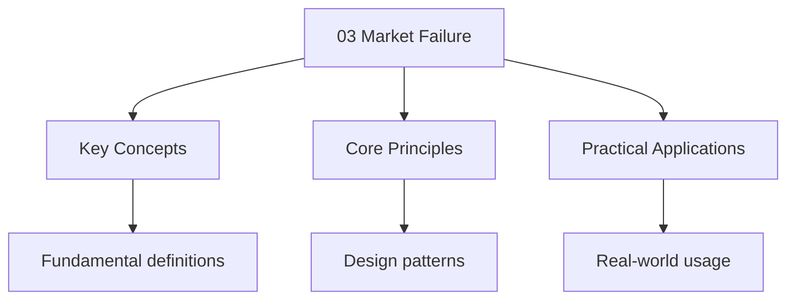

---

title: "Market Failure | A-Level - Wyatt's Notes"
description: "We define as the condition in which the free market allocation of resources is _allocatively inefficient_ — that is, the market fails to produce the"
date: 2025-06-02T16:25:28.480Z
tags:
  - Economics
  - ALevel
categories:
  - Economics

---

<!-- Breadcrumb Schema for SEO -->

## 1. Definition of Market Failure

We define **market failure** as the condition in which the free market allocation of resources is
_allocatively inefficient_ — that is, the market fails to produce the Pareto-optimal quantity of
Goods and services.

Formally, market failure occurs when the price mechanism does not equate marginal social benefit
With marginal social cost:

$$P \neq MSC \quad \mathrm{or equivalently} \quad MSB \neq MSC$$

This leads to a **deadweight welfare loss**: the total surplus (consumer + producer + third-party)
Is not maximised.

:::caution
could make at least One person better off without making anyone worse off (Pareto improvement).
:::
## 2. Types of Market Failure

:::note
**Edexcel** Emphasises the distinction between private and social costs/benefits using demand-supply
diagrams. **CIE (9708)** covers market failure in the context of allocative efficiency and requires
Consumer/producer surplus, deadweight loss, and cost-benefit analysis. **OCR (A)** links market
Failure directly to government intervention and expects evaluation of whether intervention improves
Outcomes.
:::
### 2.1 Externalities

We define an **externality** as a cost or benefit arising from production or consumption that
Affects a third party who is not part of the transaction.

**Negative externality**: the social cost exceeds the private cost.

$$MSC = MPC + MEC$$

Where $MPC$ = marginal private cost, $MEC$ = marginal external cost.

**Positive externality**: the social benefit exceeds the private benefit.

$$MSB = MPB + MEB$$

Where $MPB$ = marginal private benefit, $MEB$ = marginal external benefit.

#### Derivation of the Welfare Loss

Consider a good with a negative production externality (e.g., pollution from a factory). The market
Equilibrium is where demand (MPB) equals supply (MPC):

$$\mathrm{Market equilibrium: } MPB = MPC \implies Q_{mkt}, P_{mkt}$$

The socially optimal outcome is where marginal social benefit equals marginal social cost:

$$\mathrm{Social optimum: } MSB = MSC \implies Q^*, P^*$$

Since $MSC > MPC$ (there is an external cost), the social optimum quantity $Q^*$ is _less than_ the
Market quantity $Q_{mkt}$. The free market **over-produces** the good.

The deadweight welfare loss (DWL) is:

$$\mathrm{DWL} = \frac{1}{2}(Q_{mkt} - Q^*)(MSC(Q_{mkt}) - MSB(Q_{mkt}))$$

This is the area of the triangle between the MSC and MSB curves from $Q^*$ to $Q_{mkt}$.

For positive externalities (e.g., education, vaccinations), the analysis is reversed: $MSB > MPB$ So
$Q^* > Q_{mkt}$. The free market **under-produces** the good, and the DWL triangle lies between
$Q_{mkt}$ and $Q^*$.

Example: Pollution from a Chemical Factory

A chemical factory produces output $Q$ with marginal private cost $MPC = 20 + Q$ and marginal
External cost $MEC = Q$. The marginal private benefit (demand) is $MPB = 80 - Q$.

- $MSC = MPC + MEC = 20 + 2Q$
- Market equilibrium: $80 - Q = 20 + Q \Rightarrow Q_{mkt} = 30$, $P_{mkt} = 50$
- Social optimum: $80 - Q = 20 + 2Q \Rightarrow Q^* = 20$, $P^* = 60$
- DWL $= \frac{1}{2}(30 - 20)(MSC(30) - MSB(30)) = \frac{1}{2}(10)(80 - 50) = 150$

The market over-produces by 10 units, creating a welfare loss of 150.

#### Types of Externalities

|              | Production                             | Consumption                                 |
| ------------ | -------------------------------------- | ------------------------------------------- |
| **Negative** | Factory pollution ($MSC > MPC$)        | Second-hand smoke, congestion ($MSC > MPB$) |
| **Positive** | Beekeeping near orchards ($MSC < MPC$) | Vaccination, education ($MSB > MPB$)        |

### 2.2 Public Goods

We define a **public good** as a good that is:

1. **Non-excludable**: it is impossible (or prohibitively costly) to prevent non-payers from
   consuming the good
2. **Non-rivalrous**: one person"s consumption does not reduce the quantity available to others

$$Q_{total} = Q_{individual} \quad \mathrm{(non-rivalry)}$$

Contrast with **private goods**: excludable and rivalrous (your consumption of an apple means I
Cannot eat it).

|                    | Rivalrous                                    | Non-rivalrous                                    |
| ------------------ | -------------------------------------------- | ------------------------------------------------ |
| **Excludable**     | Private goods (food, clothing)               | Club goods (cable TV, cinema)                    |
| **Non-excludable** | Common resources (fish stocks, grazing land) | Public goods (national defence, street lighting) |

#### The Free-Rider Problem

**Proposition:** In a free market, public goods will be under-provided or not provided at all.

_Proof._ Suppose a public good costs $C$ to provide and benefits each of $n$ individuals by $B_i$.
The socially optimal provision requires $\sum_{i=1}^{n} B_i \geq C$. However, each individual $i$
Reasons: "If others pay, I can enjoy the good without paying (non-excludability). If others don't
Pay, my contribution is insufficient to provide the good." Therefore, it is individually rational
For each person not to contribute — the **dominant strategy is to free-ride**. By the same logic, no
One contributes, and the good is not provided, even when $\sum B_i \gg C$. $\blacksquare$

**Quasi-public goods**: goods that are largely non-rivalrous but are excludable (e.g., roads,
Education, healthcare). These are often provided by the government because the market would
Under-provide them.

### 2.3 Information Asymmetry

We define **information asymmetry** as a situation in which one party to a transaction has more or
Better information than the other.

#### Adverse Selection (Akerlof's Lemons Model)

Akerlof (1970) analysed the market for used cars. Sellers know the quality of their car; buyers do
Not. There are two types of cars:

- **"Peaches"** (high quality): value to seller $= £8\,000$Value to buyer $= £10\,000$
- **"Lemons"** (low quality): value to seller $= £4\,000$Value to buyer $= £6\,000$

If buyers can distinguish quality, both types trade at mutually beneficial prices. But if buyers
Cannot distinguish, and 50% of cars are peaches and 50% are lemons, the **expected value** to a
Buyer of a random car is:

$$E[V] = 0.5 \times 10\,000 + 0.5 \times 6\,000 = £8\,000$$

Buyers are willing to pay at most £8,000. But at this price, sellers of peaches (£8,000 value to
Seller) will not sell — only lemons are offered. Buyers, anticipating this, revise their offer
Downward to £6,000. Now _only_ lemons trade. **The market for high-quality cars collapses** — this
Is adverse selection: asymmetric information drives high-quality products out of the market.

#### Moral Hazard

We define **moral hazard** as a situation in which one party alters their behaviour after entering
Into an agreement, knowing that the other party bears some of the cost of that behaviour.

Example

After purchasing comprehensive car insurance, a driver may take more risks (driving faster, parking
In unsafe areas) because the insurance company bears the cost of accidents. The driver's behaviour
Changes _because_ they are insured — this is moral hazard.

### 2.4 Market Power

When a single firm (monopoly) or a small number of firms (oligopoly) have significant market power,
They restrict output and raise prices above the competitive level. This creates a deadweight loss
(analysed in detail in Topic 4).

### 2.5 Factor Immobility

**Occupational immobility**: workers cannot move between jobs due to lack of skills, Training, or
qualifications.

**Geographical immobility**: workers cannot move between regions due to housing costs, family Ties,
or information gaps.

Both types of immobility prevent the market from clearing, leading to structural unemployment and
Inefficient allocation of labour.

### 2.6 Inequality

Markets reward factors of production according to marginal productivity. Those who own scarce,
Highly productive factors (skilled labour, capital, land) receive higher incomes. Without
Redistribution, this can lead to extreme inequality — which many consider a form of market failure
Because:

1. Unequal incomes $\Rightarrow$ unequal access to education, healthcare, opportunities
2. High inequality may reduce aggregate demand (the rich have a lower MPC)
3. Social and political instability

## 3. Measuring Inequality: The Lorenz Curve and Gini Coefficient

### 3.1 Lorenz Curve

The **Lorenz curve** plots the cumulative share of income received by the cumulative share of the
Population, ordered from poorest to richest.

If income were perfectly equally distributed, the Lorenz curve would be the 45° line (line of
Perfect equality). The greater the deviation (bow) of the Lorenz curve from the 45° line, the
Greater the inequality.

### 3.2 Gini Coefficient

We define the **Gini coefficient** as:

$$G = \frac{A}{A + B}$$

Where $A$ is the area between the 45° line and the Lorenz curve, and $B$ is the area under the
Lorenz curve.

Since $A + B = \frac{1}{2}$ (area of the triangle below the 45° line):

$$G = \frac{A}{A + B} = 2A = 1 - 2B$$

| Gini Value  | Interpretation                                       |
| ----------- | ---------------------------------------------------- |
| $G = 0$     | Perfect equality                                     |
| $G = 1$     | Perfect inequality (one person has all income)       |
| $0.2 - 0.3$ | Relatively equal (e.g., Nordic countries: 0.25-0.28) |
| $0.3 - 0.4$ | Moderate inequality (e.g., UK: 0.35)                 |
| $0.5 - 0.6$ | High inequality (e.g., South Africa: 0.63)           |

## 4. Government Intervention

:::note
Tradable permits with evaluation of each. **Edexcel** expects diagrammatic analysis showing the
Effect of Pigouvian taxes and subsidies on equilibrium. **CIE (9708)** covers government
Intervention alongside cost-benefit analysis and requires understanding of when intervention may
Fail. **OCR (A)** emphasises the link between market failure and government failure, requiring
Students to evaluate whether intervention worsens outcomes.
:::
### 4.1 Pigouvian Taxation

For a negative externality, the optimal **Pigouvian tax** equals the marginal external cost at the
Socially optimal quantity:

$$t^* = MEC(Q^*)$$

**Proof of optimality.** With a specific tax $t$ per unit, the firm's private cost becomes
$MPC + t$. The firm produces where demand equals private cost plus tax: $MPB = MPC + t$. For this to
Equal the social optimum ($MPB = MSC = MPC + MEC$), we need $t = MEC$ at the optimal quantity.
$\blacksquare$

The tax **internalises the externality**: the firm now faces the full social cost of its production
And reduces output to $Q^*$.

Example: Carbon Tax

A coal power plant produces electricity with $MPC = 10 + Q$ and $MEC = 0.5Q$ (carbon emissions
Damage). Demand: $P = 100 - Q$.

- $MSC = 10 + 1.5Q$
- Social optimum: $100 - Q = 10 + 1.5Q \Rightarrow Q^* = 36$, $P^* = 64$
- Optimal tax: $t^* = MEC(36) = 18$
- With tax, firm faces: $MPC + t = 10 + Q + 18 = 28 + Q$. Equilibrium:
$100 - Q = 28 + Q \Rightarrow Q = 36$ ✓

### 4.2 Subsidies

For positive externalities, a **Pigouvian subsidy** equal to the marginal external benefit can
Internalise the externality and increase output to the social optimum.

**Limitation**: subsidies require government revenue (from taxation), which may itself create
Distortions.

### 4.3 Regulation

The government can directly regulate production or consumption:

- **Quantity regulation**: e.g., banning smoking in public places, setting emission limits
- **Price regulation**: e.g., price ceilings (rent control), price floors (minimum wage)
- **Quality standards**: e.g., minimum building standards, food safety regulations

**Evaluation**: regulation can be effective but may be:

- Inflexible (doesn't allow firms to find least-cost solutions)
- Costly to enforce (monitoring and compliance)
- Subject to regulatory capture (regulated firms influence the regulator)

### 4.4 Tradable Permits

The government sets a total quantity of pollution allowed and issues permits that firms can trade
Among themselves. This combines quantity regulation with market efficiency:

- Firms with low abatement costs reduce pollution and sell permits
- Firms with high abatement costs buy permits instead
- The equilibrium permit price equals the marginal abatement cost across all firms

**Advantage**: achieves the environmental target at minimum cost to society.

### 4.5 Direct Provision

The government directly provides public goods (defence, street lighting) and merit goods (education,
Healthcare) that the market would under-provide.

### 4.6 Provision of Information

Government can reduce information asymmetry by:

- Mandatory labelling (nutritional information, energy ratings)
- Product safety standards
- Employment laws (preventing discrimination)
- Financial regulation (requiring disclosure)

## 5. Government Failure

We define **government failure** as the situation in which government intervention to correct a
Market failure worsens the outcome.

### 5.1 Types of Government Failure

1. **Regulatory capture**: the regulatory agency becomes dominated by the industry it regulates,
   acting in the industry's interest rather than the public's
2. **Information problems**: governments face the same information constraints as markets. They may
   not know the optimal tax rate or the true marginal external cost
3. **Bureaucracy and inefficiency**: government agencies lack the profit motive and may be slow,
   costly, and unresponsive
4. **Unintended consequences**: e.g., rent control reducing the supply of housing, agricultural
   subsidies encouraging overproduction
5. **Political constraints**: short election cycles incentivise policies with immediate visible
   benefits but long-term costs
6. **Principal-agent problems**: government officials (agents) may not act in the public's
   (principal's) interest

:::tip
the market — on the relative severity of market failure vs government failure in each specific case.
:::
## 6. Critical Evaluation

### Merit and Demerit Goods

**Merit goods**: goods that the government believes consumers _should_ consume more of, because
Consumers underestimate their private benefit (due to imperfect information or myopia). Examples:
Education, healthcare, vaccinations.

**Demerit goods**: goods that the government believes consumers _should_ consume less of. Examples:
Alcohol, tobacco, illegal drugs.
