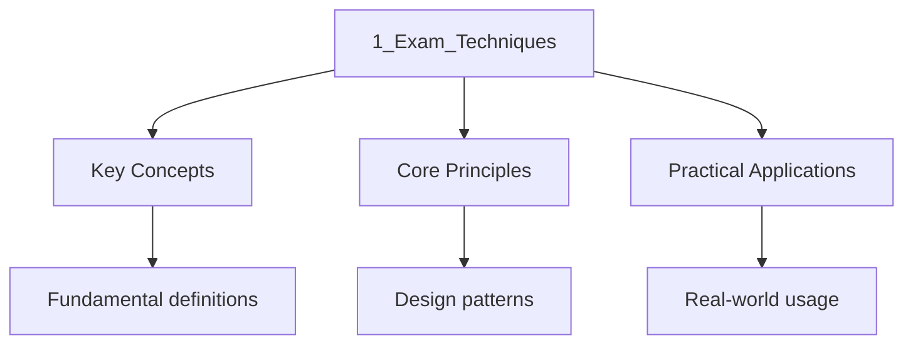

---

title: "Exam Techniques | A-Level - Wyatt's Notes"
date: 2026-01-15T00:00:00.000Z
sidebar_position: 13
tags:
  - alevel
  - alevel-english
categories:
  - alevel-english
description: "A-Level English exam techniques: essay planning, PEE/PEEL structure, comparison strategies, context integration, AO breakdown, and time management."
---

<!-- Breadcrumb Schema for SEO -->

## Intuition

**English literature explores the human experience through language — words painting pictures of life.**

## Exam Techniques

## Introduction

A-Level English examinations reward precise analytical writing under timed conditions. Success depends on understanding the assessment objectives, structuring arguments effectively, and managing time across sections. This section provides practical frameworks for essay construction, comparison, unseen text analysis, and context integration, with attention to examiner expectations across AQA, Edexcel, and OCR.

## Assessment Objectives Breakdown

Understanding how marks are distributed across the four assessment objectives is essential for targeting your revision and essay writing.

| AO | Description | Weighting | What Examiners Look For |
| ---- | ------------- | ----------- | ------------------------ |
| AO1 | Articulate informed, personal, and creative responses using concepts and terminology | 20% | Precision of literary terminology; range of vocabulary; confident, independent voice |
| AO2 | Analyse ways in which meanings are shaped in literary texts | 20% | Close analysis of language, form, and structure; identification of effects; analytical verbs rather than evaluative generalisations |
| AO3 | Demonstrate understanding of the significance of contexts | 20% | Integration of historical, social, and biographical context; recognition that context is not a bolt-on but shapes meaning |
| AO4 | Explore connections across literary texts | 20% | Comparison of texts by theme, form, or technique; identification of literary traditions and departures |

Some boards include AO5 (engagement with different interpretations). Check your specification.

### Common Pitfalls by AO

- **AO1**: Using literary terms loosely or inaccurately (e.g., calling any comparison a "metaphor"). Define terms precisely and use them as analytical tools, not decorations.
- **AO2**: Describing what a passage says rather than how it creates meaning. Always ask: "How does the writer's choice of [word/structure/form] create this effect?"
- **AO3**: Treating context as a separate paragraph rather than integrating it into analysis. Context should illuminate your reading of specific quotations.
- **AO4**: Making superficial connections ("both texts are about love"). Identify specific structural, thematic, or linguistic parallels.

## Essay Structure: PEE and PEEL

### PEE (Point, Evidence, Explanation)

The foundational paragraph structure for A-Level English.

- **Point**: A clear, arguable assertion that responds directly to the question. State your interpretation, not a fact about the text.
- **Evidence**: Embedded quotations (not block quotations) that support your point. Select quotations precisely—short, analytically rich phrases are more effective than long extracts.
- **Explanation**: Analyse the evidence in detail. Explore language (denotation, connotation, word class, sound), structure (position, repetition, juxtaposition), and form (genre conventions, narrative mode). Explain how the evidence supports your point and what effect is created for the reader.

**Example of strong PEE**:

> Fitzgerald presents Gatsby's aspiration as fundamentally retrospective. The green light, observed from across the bay, functions as a symbol not of future possibility but of past loss: Gatsby reaches toward a dream that is rooted in his 1917 encounter with Daisy. The verb "stretching" in the narrator's description of Gatsby's posture suggests both physical yearning and temporal reaching—an attempt to bridge the gap between present and past that the novel's final line confirms is impossible.

### PEEL (Point, Evidence, Explanation, Link)

An extended version that adds a **Link** sentence connecting the paragraph to the next point or to the essay's overall argument. The link ensures your essay progresses as a sustained argument rather than a sequence of isolated observations.

**When to use PEEL**: Use the link when transitioning between analytical points or when the question requires you to develop a cumulative argument.

## Comparison Essays

Comparison questions appear on AQA, Edexcel, and OCR papers. They require you to identify similarities and differences between two texts, organised by theme, technique, or context.

### Comparative Framework

Structure your essay **thematically**, not text-by-text:

1. **Introduction**: Identify the texts, the shared theme or concern, and your argument about how both writers address it.
2. **Body paragraphs**: Each paragraph should discuss both texts, organised around a specific analytical point. Do not devote one paragraph to Text A and the next to Text B; instead, weave both texts into each paragraph.
3. **Conclusion**: Synthesise your argument, identifying the most significant similarities and differences and what they reveal about the texts' concerns.

### Comparative Language

Use analytical verbs that signal comparison:

- **Similarity**: Both writers, similarly, likewise, equally, in parallel
- **Difference**: In contrast, whereas, while, conversely, by contrast, unlike
- **Development**: Furthermore, additionally, moreover, this extends to
- **Qualification**: However, nevertheless, on the other hand, yet

**Avoid**: "On the one hand... on the other hand..." (too generic) and "Both texts are about..." (too vague).

## Unseen Prose Analysis

Unseen prose passages require you to analyse an unfamiliar text under timed conditions. The following approach is适用于 all exam boards.

### Annotation Strategy (5 minutes)

1. **Read the passage twice**: First for general understanding, second for analytical detail.
2. **Identify the narrative voice**: First person, third person, unreliable, omniscient, limited.
3. **Mark key language choices**: Unusual diction, significant metaphors, sensory imagery, patterns of sound.
4. **Note structural features**: Paragraph breaks, shifts in tense or perspective, use of dialogue, sentence length variation.
5. **Consider context**: Period, genre, intended audience, potential purpose.
6. **Formulate a thesis**: A one-sentence argument about how the passage creates meaning.

### Writing Strategy (25-30 minutes)

- **Introduction**: Brief overview of the passage's concerns and your analytical thesis.
- **Body**: Three to four analytical paragraphs, each focusing on a different aspect of language, structure, or form. Embed short quotations and analyse them in detail.
- **Conclusion**: Synthesise your analysis, linking back to your thesis.

**Key principle**: Examiners reward depth over breadth. Three well-analysed quotations are more effective than six superficial ones.

## Context Integration

Context must be woven into your analysis, not appended as a separate section. Effective integration follows this pattern:

1. **Make a point** about the text.
2. **Provide evidence** (quotation).
3. **Analyse the evidence** in terms of language, structure, and form.
4. **Introduce context** that illuminates why the writer made this choice.
5. **Explain the connection** between context and textual meaning.

**Example**:

> The Duke's control over his wife's portrait reflects the patriarchal structures of the Italian Renaissance, in which women functioned as chattel to be displayed or concealed at their husband's discretion. Browning's dramatic monologue, published in 1842, draws on the historical figure of Alfonso II, Duke of Ferrara, whose second wife died under suspicious circumstances in 1561. By ventriloquising the Duke's possessive rhetoric, Browning exposes the violence inherent in the social conventions that the speaker treats as normal.

This integrates AO3 (context) within AO2 (analysis) rather than treating them as separate requirements.

## Time Management

Effective time management depends on understanding mark allocation and planning accordingly.

### Recommended Timing

| Task | Time | Notes |
| ------ | ------ | ------- |
| Read and plan | 5-10 minutes | Read the question carefully; identify key terms; plan structure |
| Write | 45-50 minutes | 3-4 well-developed paragraphs; introduction and conclusion |
| Review | 5 minutes | Check for accuracy, clarity, and completeness |

### Planning Checklist

Before writing, confirm:

- [ ] I understand what the question is asking (command word: "explore," "analyse," "compare," "evaluate")
- [ ] I have identified the key texts and contexts
- [ ] I have a clear, arguable thesis (not a statement of fact)
- [ ] I have selected 3-4 quotations for close analysis
- [ ] I have planned paragraph topics and their order
- [ ] I have considered how to integrate context meaningfully

## Common Examiner Feedback

The following issues recur in examiner reports across all boards:

1. **Description instead of analysis**: Writing what happens rather than how the writer creates meaning. Fix: always ask "How?" and "Why?"
2. **Unsupported assertions**: Making claims without quotation evidence. Fix: embed at least one quotation per analytical paragraph.
3. **Generic context**: Listing historical facts without connecting them to the text. Fix: explain why the context matters to your specific analytical point.
4. **Inaccurate literary terminology**: Misusing terms (e.g., "juxtaposition" for any contrast, "pathetic fallacy" for any weather). Fix: learn definitions precisely and use them only when they apply.
5. **Weak paragraph structure**: Paragraphs that lack a clear point or that jump between unrelated observations. Fix: use PEE/PEEL and ensure each paragraph develops one analytical point.
6. **Neglecting form and structure**: Focusing exclusively on language at the expense of narrative mode, genre conventions, or structural patterning. Fix: include at least one paragraph on form or structure in every essay.
7. **Forgetting the question**: Drifting from the specific focus of the question. Fix: check each paragraph against the question before moving on.

## Exam-Style Practice

Apply these techniques to a timed response. Choose one of the following and write in 45 minutes:

1. **AQA**: "How does Fitzgerald present the relationship between past and present in _The Great Gatsby_? Explore how language and narrative structure create meaning."
2. **Edexcel**: "Compare the ways in which [two poets from the anthology] present the human relationship with nature. In your answer, consider language, form, and structure."
3. **OCR**: "Starting with this passage from _The Handmaid's Tale_, explore how Atwood uses Offred's narrative voice to present ideas about control and resistance."

## See Also

- [Exam Techniques](./)
- [A-Level English](..)
- [Analytical Techniques](../../chemistry/organic-chemistry/analytical-techniques)
