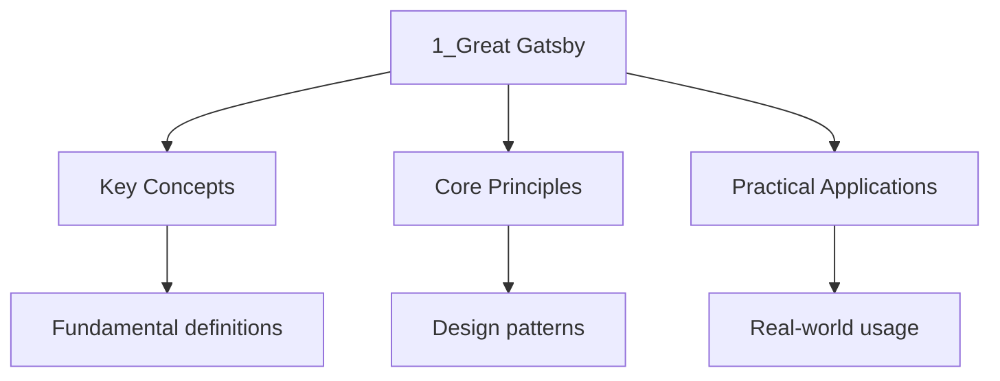

---

title: "The Great Gatsby | A-Level - Wyatt's Notes"
date: 2026-01-15T00:00:00.000Z
sidebar_position: 10
tags:
  - alevel
  - alevel-english
categories:
  - alevel-english
description: "A-Level English revision notes on F. Scott Fitzgerald's The Great Gatsby: narrative structure, symbolism, the American Dream, and class in 1920s America."
---

<!-- Breadcrumb Schema for SEO -->

## Intuition

**English literature explores the human experience through language — words painting pictures of life.**

## The Great Gatsby

## Introduction

F. Scott Fitzgerald's _The Great Gatsby_ (1925) is a central text for A-Level English, set by AQA, Edexcel, and OCR across prose and comparative modules. The novel examines the illusion of the American Dream through the tragic figure of Jay Gatsby, narrated retrospectively by Nick Carraway. This analysis covers the narrative structure, principal symbols, thematic concerns, and contextual factors required for examination.

## Narrative Structure and Nick Carraway

### The Unreliable Narrator

Nick Carraway narrates the novel in the first person, yet his reliability is compromised from the outset. He claims in the opening chapter to be "inclined to reserve all judgements," a statement immediately contradicted by the extensive judgements he proceeds to deliver about every character. This tension between claimed objectivity and subjective bias is a deliberate authorial technique that demands critical scrutiny.

Nick's narration is retrospective, written after the events have concluded. This temporal distance introduces the possibility of confabulation: Nick shapes the past to suit his present understanding. His admiration for Gatsby, despite Gatsby's criminality and moral failings, colours the entire account. As Matthew Bruccoli observes, Nick functions simultaneously as participant, observer, and interpreter, a tripartite role that complicates the reader's access to truth.

### Frame Narrative

The novel employs a frame narrative structure. The outer frame is Nick writing in the present; the inner frame is the story of Gatsby as Nick experienced it. This structure creates a mediating layer between events and reader, reinforcing the theme of illusion versus reality. Every event passes through Nick's consciousness before reaching us, meaning we never encounter Gatsby directly, only Nick's construction of Gatsby.

This is significant for AO2 (analysis of how meanings are shaped): the narrative form itself enacts the novel's central concern with fabrication and the unreliability of appearances.

### Non-Linear Chronology

Fitzgerald disrupts linear time. The novel begins in the summer of 1922, then flashes back to Gatsby's origins as James Gatz, returns to the present, and closes with Nick's reflection the following autumn. This fragmented chronology mirrors Gatsby's own relationship with time: his desire to repeat the past, to recapture Daisy as she was in 1917, is fundamentally at odds with temporal reality.

## Symbolism

### The Green Light

The green light at the end of Daisy's dock is the novel's most recognised symbol. It first appears in Chapter 1, when Nick observes Gatsby "stretching out his arms toward the dark water," trembling. The light represents Gatsby's yearning for Daisy, but more broadly, it signifies the unattainable ideal that drives the American Dream.

Fitzgerald links the green light to the "orgastic future," a future that recedes as one approaches it. The colour green carries connotations of hope, vitality, and money, layering the symbol with multiple meanings. In the final passage, the light connects to the Dutch sailors' first sight of the "fresh, green breast of the new world," extending Gatsby's personal dream into a national myth.

### The Valley of Ashes

The Valley of Ashes, situated between West Egg and New York, is described as "a fantastic farm where ashes grow like wheat into ridges and hills and grotesque gardens." This industrial wasteland represents the human cost of wealth creation. It is the domain of George and Myrtle Wilson, characters who are crushed by the carelessness of the rich.

The Valley of Ashes functions as a spatial symbol of class inequality. The wealthy pass through it on their way to Manhattan but do not inhabit it. It is the invisible labour and suffering upon which their prosperity depends. T.S. Eliot's _The Waste Land_ (1922), published three years before Gatsby, provides an important intertextual context: both texts use desolate landscapes to critique modernity.

### The Eyes of Doctor T.J. Eckleburg

The billboard of Doctor T.J. Eckleburg, with its enormous blue eyes and yellow spectacles, overlooks the Valley of Ashes. George Wilson later conflates these eyes with the eyes of God: "God sees everything." The sign represents the absence of genuine moral authority in the novel's world. Where God should be watching, there is only a faded advertisement, a commercial relic.

This symbol critiques a society in which commerce has displaced spirituality. The eyes are passive, watching but never intervening, much as the novel's moral centres fail to prevent tragedy.

## The American Dream

The novel's central thematic concern is the corruption of the American Dream. Gatsby's trajectory from poor Midwestern boy to wealthy Long Island socialite appears to fulfil the Dream's promise of self-invention and upward mobility. Yet his wealth derives from bootlegging and association with Meyer Wolfsheim, and his ultimate goal, Daisy, proves hollow.

Fitzgerald does not reject the Dream; he exposes its structural impossibility. The Dream requires a future that can be seized, but Gatsby's version is rooted in the past. His tragedy is that he confuses material acquisition with spiritual fulfilment. The green light is always across the water, always out of reach.

The final line, "So we beat on, boats against the current, borne back ceaselessly into the past," universalises Gatsby's predicament. The pronoun shifts from "he" to "we," implicating all readers in the same futile striving.

## Class and Wealth in 1920s America

Fitzgerald distinguishes between established wealth (East Egg), new money (West Egg), and poverty (the Valley of Ashes). Tom and Daisy Buchanan represent old money: their wealth is inherited, effortless, and shielded from consequence. Their carelessness is explicit: "They were careless people, Tom and Daisy—they smashed up things and creatures and then retreated back into their money."

Gatsby's new money cannot purchase the social legitimacy that old money provides. His mansion, his parties, and his shirts are performances of wealth that fail to convince the Buchanans. Jordan Baker articulates this class rigidity when she recalls that Gatsby "had a lot of wild parties" but was not accepted by the East Egg establishment.

Myrtle Wilson's attempt to cross class boundaries through her affair with Tom ends in her death, a stark illustration of the consequences of transgressing social boundaries in a stratified society.

## Key Quotations

| Quotation | Significance |
| ----------- | ------------- |
| "So we beat on, boats against the current, borne back ceaselessly into the past" | Final line: universalises the futility of the American Dream |
| "I hope she'll be a fool—that's the best thing a girl can be in this world, a beautiful little fool" | Daisy's cynicism about women's roles; patriarchal society |
| "He had come a long way to this blue lawn, and his dream must have seemed so close that he could hardly fail to grasp it" | Gatsby's proximity to and distance from his dream |
| "They were careless people, Tom and Daisy—they smashed up things and creatures" | Moral bankruptcy of the wealthy |
| "I hope she'll be a fool" | Daisy's awareness of her own constrained agency |

## Exam-Style Questions

1. **AQA**: "How does Fitzgerald present the American Dream in _The Great Gatsby_? You should consider narrative voice, symbolism, and historical context in your response."

2. **Edexcel**: "Compare the ways in which Fitzgerald and [second text] explore the consequences of social ambition. In your answer, you should analyse how language and structure convey meaning, and consider relevant context."

3. **OCR**: "Starting with this passage, explore how Fitzgerald uses setting to present ideas about class and wealth. You should write about the ways Fitzgerald presents class, how the setting contributes to meaning, and how this connects to the text as a whole."

## Assessment Notes

- **AO1 (20%)**: Demonstrate knowledge of form, structure, and language. Use precise terminology (unreliable narrator, symbolism, motif, foreshadowing).
- **AO2 (20%)**: Analyse how meanings are shaped. Focus on how Fitzgerald's narrative choices create ambiguity and irony.
- **AO3 (20%)**: Contextualise the novel within 1920s America, Prohibition, and post-war disillusionment.
- **AO4 (20%)**: Connect to other texts studied, particularly those exploring class, ambition, or the American Dream.

## Common Mistakes

**Reading the green light as a simple symbol with one fixed meaning:** The green light at the end of Daisy's dock operates on multiple levels — hope, the American Dream, the unattainable past, class aspiration. Reducing it to a single meaning ("it represents the American Dream") misses the layered ambiguity that makes the symbol powerful. Discuss how its meaning shifts across the novel.

**Conflating Gatsby's dream with the American Dream uncritically:** Gatsby's personal obsession with Daisy mirrors the broader American Dream, but the novel also critiques both. Gatsby's dream is built on criminal wealth and self-invention; the American Dream promises merit-based success. The parallel invites critique, not identification. Consider how Fitzgerald uses Gatsby to expose the hollowness of the Dream.

**Forgetting that Nick is an unreliable narrator:** Nick claims to be "one of the few honest people" he has ever known, yet his account is full of contradictions, omissions, and self-justifications. His judgement of other characters reflects his own values and blind spots. Always question what Nick tells you — the novel's meaning often lies in the gap between his account and the truth.

## See Also

- [Great Gatsby](./)
- [A-Level English](..)
