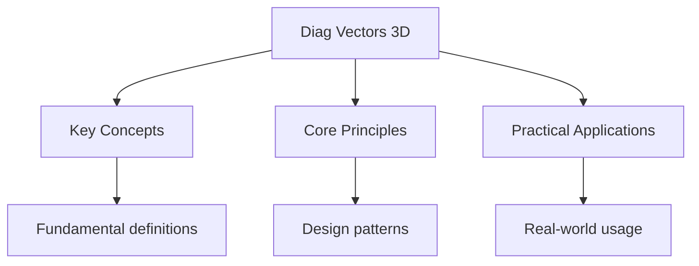

---

date: 2026-07-23T21:57:32+01:00
title: "Vectors in 3D -- Diagnostic Tests"
description: "A-Level Further Maths Vectors in 3D -- Diagnostic Tests notes covering key definitions, core concepts, worked examples, and practice questions for revision."
tableOfContents: false
---

<!-- Breadcrumb Schema for SEO -->

## Intuition

**This topic explores fundamental concepts that shape our understanding of the world.**

## Vectors in 3D — Diagnostic Tests

## Unit Tests

### UT-1: Scalar and Vector Products

**Question:**
$\mathbf{a} = \begin{pmatrix} 2 \\ 1 \\ -1 \end{pmatrix}$, $\mathbf{b} = \begin{pmatrix} 1 \\ 3 \\ 2 \end{pmatrix}$.
(a) Calculate $\mathbf{a} \cdot \mathbf{b}$. (b) Calculate $\mathbf{a} \times \mathbf{b}$. (c) Find
the angle between $\mathbf{a}$ and $\mathbf{b}$. (d) Verify that $\mathbf{a} \times \mathbf{b}$ is
perpendicular to both $\mathbf{a}$ and $\mathbf{b}$.

**Solution:**

(a) $\mathbf{a} \cdot \mathbf{b} = 2(1) + 1(3) + (-1)(2) = 2 + 3 - 2 = 3$.

(b)
$\mathbf{a} \times \mathbf{b} = \begin{pmatrix} 1(2) - (-1)(3) \\ (-1)(1) - 2(2) \\ 2(3) - 1(1) \end{pmatrix} = \begin{pmatrix} 5 \\ -5 \\ 5 \end{pmatrix}$.

(c) $|\mathbf{a}| = \sqrt{4+1+1} = \sqrt{6}$. $|\mathbf{b}| = \sqrt{1+9+4} = \sqrt{14}$.
$\cos\theta = \frac{3}{\sqrt{6}\sqrt{14}} = \frac{3}{\sqrt{84}} = \frac{3}{2\sqrt{21}} = \frac{\sqrt{21}}{14}$.
$\theta = \arccos\left(\frac{\sqrt{21}}{14}\right) \approx 49.1^\circ$.

(d)
$\mathbf{a} \cdot (\mathbf{a} \times \mathbf{b}) = 2(5) + 1(-5) + (-1)(5) = 10 - 5 - 5 = 0 \checkmark$.
$\mathbf{b} \cdot (\mathbf{a} \times \mathbf{b}) = 1(5) + 3(-5) + 2(5) = 5 - 15 + 10 = 0 \checkmark$.

### UT-2: Equation of a Plane

**Question:** A plane passes through points $A(1, 0, 2)$, $B(3, 1, -1)$ And $C(0, 2, 1)$. (a) Find the
normal vector to the plane. (b) Find the Cartesian equation of the plane. (c) Find the distance from
the origin to the plane. (d) Determine whether the point $D(1, 1, 1)$ lies on the plane.

**Solution:**

(a)
$\overrightarrow{AB} = \begin{pmatrix} 2 \\ 1 \\ -3 \end{pmatrix}$, $\overrightarrow{AC} = \begin{pmatrix} -1 \\ 2 \\ -1 \end{pmatrix}$.
$\mathbf{n} = \overrightarrow{AB} \times \overrightarrow{AC} = \begin{pmatrix} 1(-1) - (-3)(2) \\ (-3)(-1) - 2(-1) \\ 2(2) - 1(-1) \end{pmatrix} = \begin{pmatrix} 5 \\ 5 \\ 5 \end{pmatrix}$.

(b) Using $A(1,0,2)$: $5(x-1) + 5(y-0) + 5(z-2) = 0$. Simplifying: $x + y + z = 3$.

(c) Distance
$= \frac{|0 + 0 + 0 - 3|}{\sqrt{1+1+1}} = \frac{3}{\sqrt{3}} = \sqrt{3}$.

(d) $1 + 1 + 1 = 3 \checkmark$. $D$ lies on the plane.

### UT-3: Volume of a Parallelepiped

**Question:**
$\mathbf{a} = \begin{pmatrix} 3 \\ 0 \\ -1 \end{pmatrix}$$\mathbf{b} = \begin{pmatrix} 1 \\ 2 \\ 1 \end{pmatrix}$$\mathbf{c} = \begin{pmatrix} 0 \\ -1 \\ 4 \end{pmatrix}$.
(a) Calculate the scalar triple product $\mathbf{a} \cdot (\mathbf{b} \times \mathbf{c})$. (b) What
does the sign tell you? (c) Calculate the volume of the parallelepiped formed by
$\mathbf{a}$$\mathbf{b}$$\mathbf{c}$. (d) Calculate the area of the parallelogram formed by
$\mathbf{a}$ and $\mathbf{b}$.

**Solution:**

(a)
$\mathbf{b} \times \mathbf{c} = \begin{pmatrix} 2(4) - 1(-1) \\ 1(0) - 1(4) \\ 1(-1) - 2(0) \end{pmatrix} = \begin{pmatrix} 9 \\ -4 \\ -1 \end{pmatrix}$.
$\mathbf{a} \cdot (\mathbf{b} \times \mathbf{c}) = 3(9) + 0(-4) + (-1)(-1) = 27 + 0 + 1 = 28$.

(b) The positive sign indicates that $\mathbf{a}$$\mathbf{b}$$\mathbf{c}$ form a right-handed set
(in that order).

(c) Volume $= |\mathbf{a} \cdot (\mathbf{b} \times \mathbf{c})| = 28$ cubic units.

(d) Area $= |\mathbf{a} \times \mathbf{b}|$.
$\mathbf{a} \times \mathbf{b} = \begin{pmatrix} 0(-1) - (-1)(2) \\ (-1)(1) - 3(1) \\ 3(2) - 0(1) \end{pmatrix} = \begin{pmatrix} 2 \\ -4 \\ 6 \end{pmatrix}$.
$|\mathbf{a} \times \mathbf{b}| = \sqrt{4 + 16 + 36} = \sqrt{56} = 2\sqrt{14}$.

---

<!-- Breadcrumb Schema for SEO -->

## Integration Tests

### IT-1: Lines and Planes Combined (with Matrices)

**Question:** (a) Find the vector equation of the line through $P(1, 2, -1)$ with direction
$\mathbf{d} = \begin{pmatrix} 2 \\ -1 \\ 3 \end{pmatrix}$. (b) Find the point of intersection of the
line
$\mathbf{r} = \begin{pmatrix} 1 \\ 0 \\ 1 \end{pmatrix} + t\begin{pmatrix} 2 \\ 1 \\ -1 \end{pmatrix}$
with the plane $2x - y + z = 5$. (c) Find the shortest distance from the point $Q(3, 1, -2)$ to the
plane $x + y + 2z = 4$. (d) Find the angle between the planes $x + 2y + 2z = 5$ and
$2x - y + 2z = 1$.

**Solution:**

(a)
$\mathbf{r} = \begin{pmatrix} 1 \\ 2 \\ -1 \end{pmatrix} + t\begin{pmatrix} 2 \\ -1 \\ 3 \end{pmatrix}$I.e.,
$x = 1+2t$$y = 2-t$$z = -1+3t$.

(b) Substituting into the plane: $2(1+2t) - (0+t) + (1-t) = 5$. $2 + 4t - t + 1 - t = 5$.
$2t = 2$$t = 1$. Point: $\begin{pmatrix} 3 \\ 1 \\ 0 \end{pmatrix}$.

(c) Distance
$= \frac{|3 + 1 + 2(-2) - 4|}{\sqrt{1+1+4}} = \frac{|3 + 1 - 4 - 4|}{\sqrt{6}} = \frac{4}{\sqrt{6}} = \frac{2\sqrt{6}}{3}$.

(d) Normal to plane 1: $\mathbf{n}_1 = \begin{pmatrix} 1 \\ 2 \\ 2 \end{pmatrix}$. Normal to plane
2: $\mathbf{n}_2 = \begin{pmatrix} 2 \\ -1 \\ 2 \end{pmatrix}$.
$\cos\theta = \frac{\mathbf{n}_1 \cdot \mathbf{n}_2}{|\mathbf{n}_1||\mathbf{n}_2|} = \frac{2-2+4}{\sqrt{9}\sqrt{9}} = \frac{4}{9}$.
$\theta = \arccos(4/9) \approx 63.6^\circ$.

### IT-2: Vectors and Geometry (with Polar Coordinates)

**Question:** Points $A$$B$$C$ have position vectors
$\mathbf{a} = \begin{pmatrix} 1 \\ 0 \\ 0 \end{pmatrix}$$\mathbf{b} = \begin{pmatrix} 2 \\ 3 \\ 1 \end{pmatrix}$$\mathbf{c} = \begin{pmatrix} 0 \\ 1 \\ 4 \end{pmatrix}$.
(a) Calculate the area of triangle $ABC$. (b) Find the Cartesian equation of the plane through
$A$$B$$C$. (c) Find the acute angle between $\overrightarrow{AB}$ and $\overrightarrow{AC}$. (d)
Find the volume of the tetrahedron $OABC$ where $O$ is the origin.

**Solution:**

(a)
$\overrightarrow{AB} = \begin{pmatrix} 1 \\ 3 \\ 1 \end{pmatrix}$$\overrightarrow{AC} = \begin{pmatrix} -1 \\ 1 \\ 4 \end{pmatrix}$.
$\overrightarrow{AB} \times \overrightarrow{AC} = \begin{pmatrix} 12 - 1 \\ 4 + 1 \\ 1 + 3 \end{pmatrix} = \begin{pmatrix} 11 \\ 5 \\ 4 \end{pmatrix}$.
Area $= \frac{1}{2}\sqrt{121 + 25 + 16} = \frac{1}{2}\sqrt{162} = \frac{9\sqrt{2}}{2}$.

(b) Normal
$\mathbf{n} = \overrightarrow{AB} \times \overrightarrow{AC} = \begin{pmatrix} 11 \\ 5 \\ 4 \end{pmatrix}$.
Plane through $A(1,0,0)$: $11(x-1) + 5y + 4z = 0$I.e., $11x + 5y + 4z = 11$.

(c) $|\overrightarrow{AB}| = \sqrt{1+9+1} = \sqrt{11}$.
$|\overrightarrow{AC}| = \sqrt{1+1+16} = \sqrt{18}$.
$\cos\theta = \frac{\overrightarrow{AB} \cdot \overrightarrow{AC}}{|\overrightarrow{AB}||\overrightarrow{AC}|} = \frac{-1+3+4}{\sqrt{11}\sqrt{18}} = \frac{6}{\sqrt{198}} = \frac{6}{3\sqrt{22}} = \frac{2}{\sqrt{22}}$.
$\theta = \arccos\left(\frac{2}{\sqrt{22}}\right) \approx 64.8^\circ$.

(d) Volume $= \frac{1}{6}|\mathbf{a} \cdot (\mathbf{b} \times \mathbf{c})|$.
$\mathbf{b} \times \mathbf{c} = \begin{pmatrix} 12-1 \\ 4-0 \\ 0-3 \end{pmatrix} = \begin{pmatrix} 11 \\ 4 \\ -3 \end{pmatrix}$.
$\mathbf{a} \cdot (\mathbf{b} \times \mathbf{c}) = 1(11) + 0(4) + 0(-3) = 11$. Volume
$= \frac{11}{6}$ cubic units.

### IT-3: Applications in Mechanics (with Differential Equations)

**Question:** A force $\mathbf{F} = \begin{pmatrix} 3t \\ 2 \\ -1 \end{pmatrix}$ N acts on a
particle of mass 2 kg. At $t = 0$The particle is at $\begin{pmatrix} 0 \\ 1 \\ 0 \end{pmatrix}$ m
with velocity $\begin{pmatrix} 1 \\ 0 \\ 2 \end{pmatrix}$ m/s. (a) Find the acceleration. (b) Find
the velocity as a function of time. (c) Find the position as a function of time. (d) Calculate the
kinetic energy at $t = 2$.

**Solution:**

(a)
$\mathbf{a} = \frac{\mathbf{F}}{m} = \begin{pmatrix} 1.5t \\ 1 \\ -0.5 \end{pmatrix}$
m/s$^2$.

(b)
$\mathbf{v} = \begin{pmatrix} 1 \\ 0 \\ 2 \end{pmatrix} + \int_0^t \begin{pmatrix} 1.5s \\ 1 \\ -0.5s \end{pmatrix}\,ds = \begin{pmatrix} 1 \\ 0 \\ 2 \end{pmatrix} + \begin{pmatrix} 0.75t^2 \\ t \\ -0.25t^2 \end{pmatrix} = \begin{pmatrix} 1+0.75t^2 \\ t \\ 2-0.25t^2 \end{pmatrix}$.

(c)
$\mathbf{r} = \begin{pmatrix} 0 \\ 1 \\ 0 \end{pmatrix} + \int_0^t \begin{pmatrix} 1+0.75s^2 \\ s \\ 2-0.25s^2 \end{pmatrix}\,ds = \begin{pmatrix} 0 \\ 1 \\ 0 \end{pmatrix} + \begin{pmatrix} t + 0.25t^3 \\ 0.5t^2 \\ 2t - t^3/12 \end{pmatrix}$.

(d) At $t = 2$:
$\mathbf{v} = \begin{pmatrix} 1+3 \\ 2 \\ 2-1 \end{pmatrix} = \begin{pmatrix} 4 \\ 2 \\ 1 \end{pmatrix}$.
$\text{KE} = \frac{1}{2} \times 2 \times (16+4+1) = 21$ J.

## Common Mistakes

**Confusing the scalar (dot) and vector (cross) products:** The dot product $\mathbf{a} \cdot \mathbf{b}$ gives a scalar. The cross product $\mathbf{a} \times \mathbf{b}$ gives a vector perpendicular to both. Students often compute the cross product when asked for the dot product or vice versa. The dot product checks parallelism ($\mathbf{a} \cdot \mathbf{b} = |\mathbf{a}||\mathbf{b}|\cos\theta$); the cross product checks perpendicularity.

**Forgetting to use unit direction vectors for lines:** The equation of a line through point $\mathbf{a}$ in direction $\mathbf{d}$ is $\mathbf{r} = \mathbf{a} + t\mathbf{d}$ where $\mathbf{d}$ should be a direction vector (not necessarily a unit vector). However, when finding the perpendicular distance from a point to a line, you need the component of $\mathbf{AP}$ perpendicular to $\mathbf{d}$, which requires the unit vector $\hat{\mathbf{d}} = \mathbf{d}/|\mathbf{d}|$.

**Mixing up the angle between two vectors with the angle between a vector and a plane:** The angle between two vectors uses $\cos\theta = \frac{\mathbf{a} \cdot \mathbf{b}}{|\mathbf{a}||\mathbf{b}|}$. The angle between a vector and a plane uses $\sin\theta = \frac{\mathbf{a} \cdot \mathbf{n}}{|\mathbf{a}||\mathbf{n}|}$ where $\mathbf{n}$ is the normal to the plane. Using cosine for the plane angle gives the complement of the correct answer.

## Cross-References

- **[3D Vectors](diag-vectors-3d):** 3D vectors extend 2D vector concepts
- **[Further Calculus](../pure-mathematics/04-further-calculus):** Calculus underpins further mathematics
- **[Pure Mathematics](../further-maths):** Further maths extends A-level mathematics
