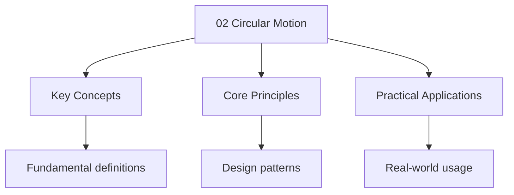

---

title: "Circular Motion | A-Level - Wyatt's Notes"
description: "Circular motion in further mathematics extends the basic treatment to include banked tracks, conical Pendulums, vertical circles with energy methods, and"
date: 2026-04-02T00:00:00.000Z
tags:
  - FurtherMaths
  - ALevel
categories:
  - Maths

---

<!-- Breadcrumb Schema for SEO -->

## Intuition

**This topic explores fundamental concepts that shape our understanding of the world.**

## Circular Motion

Circular motion in further mathematics extends the basic treatment to include banked tracks, conical
Pendulums, vertical circles with energy methods, and problems where the circular path constraints
Determine unknown forces.

### Board Coverage

| Board      | Paper   | Notes                                       |
| ---------- | ------- | ------------------------------------------- |
| AQA        | Paper 2 | Limited coverage; horizontal circles mainly |
| Edexcel    | M2      | Full coverage including vertical circles    |
| OCR (A)    | Paper 2 | Horizontal and vertical circles             |
| CIE (9231) | M2      | Full coverage including vertical circles    |

:::note
(tension, friction, normal reaction, weight) directed towards the centre of the circle. Never
Include "centripetal force" on a free body diagram.
:::

## 1. Angular Quantities

### 1.1 Definitions

**Definition.** The **angular displacement** $\theta$ is the angle swept by a radius vector,
Measured in radians.

**Definition.** The **angular velocity** $\omega$ is the rate of change of angular displacement:

$$\boxed{\omega = \frac{d\theta}{dt}}$$

The SI unit is rad s$^{-1}$.

**Definition.** The **angular acceleration** $\alpha$ is the rate of change of angular velocity:

$$\alpha = \frac{d\omega}{dt} = \frac{d^2\theta}{dt^2}$$

### 1.2 Relationship with linear quantities

For a particle moving in a circle of radius $r$:

$$\boxed{v = \omega r}$$

$$\boxed{a_{\mathrm{tangential}} = \alpha r}$$

### 1.3 Period and frequency

For uniform circular motion:

$$\boxed{\omega = \frac{2\pi}{T} = 2\pi f}$$

## 2. Centripetal Acceleration

### Proof from differentiation of position vector

### Proof

The position vector of a particle in a circle of radius $r$ in the $xy$-plane:

$$\mathbf{r}(t) = r\cos(\omega t)\,\mathbf{i} + r\sin(\omega t)\,\mathbf{j}$$

Velocity (first derivative):

$$\mathbf{v}(t) = \frac{d\mathbf{r}}{dt} = -r\omega\sin(\omega t)\,\mathbf{i} + r\omega\cos(\omega t)\,\mathbf{j}$$

Check: $|\mathbf{v}| = r\omega\sqrt{\sin^2(\omega t) + \cos^2(\omega t)} = r\omega = v$.
$\checkmark$

Acceleration (second derivative):

$$\mathbf{a}(t) = \frac{d\mathbf{v}}{dt} = -r\omega^2\cos(\omega t)\,\mathbf{i} - r\omega^2\sin(\omega t)\,\mathbf{j} = -\omega^2\mathbf{r}(t)$$

$$\boxed{\mathbf{a} = -\omega^2 r\,\hat{\mathbf{r}}}$$

Magnitude: $a = \omega^2 r = \dfrac{v^2}{r}$Directed radially inward. $\blacksquare$

### 2.1 Centripetal force

By Newton"s second law:

$$\boxed{F_c = \frac{mv^2}{r} = m\omega^2 r}$$

## 3. Motion in Horizontal Circles

### 3.1 Conical pendulum

A mass $m$ on a string of length $L$ moves in a horizontal circle of radius $r = L\sin\alpha$Where
$\alpha$ is the angle the string makes with the vertical.

**Vertical equilibrium:** $T\cos\alpha = mg$ ... (i)

**Horizontal (centripetal):** $T\sin\alpha = \dfrac{mv^2}{r}$ ... (ii)

Dividing (ii) by (i):

$$\boxed{\tan\alpha = \frac{v^2}{rg} = \frac{\omega^2 r}{g}}$$

Since $r = L\sin\alpha$ and $\omega = \dfrac{v}{r}$:

$$\omega^2 = \frac{g\tan\alpha}{L\sin\alpha} = \frac{g}{L\cos\alpha}$$

$$\boxed{T = \frac{2\pi}{\omega} = 2\pi\sqrt{\frac{L\cos\alpha}{g}}}$$

### 3.2 Banked tracks

A vehicle on a banked track of angle $\theta$ and radius $r$.

**Resolving vertically:** $N\cos\theta = mg$ ... (i)

**Resolving horizontally (centripetal):** $N\sin\theta = \dfrac{mv^2}{r}$ ... (ii)

Dividing (ii) by (i):

$$\boxed{\tan\theta = \frac{v^2}{rg}}$$

$$\boxed{v_{\mathrm{optimum}} = \sqrt{rg\tan\theta}}$$

At the optimum speed, no friction is needed. If $v > v_{\mathrm{opt}}$Friction acts down the Slope.
If $v < v_{\mathrm{opt}}$Friction acts up the slope.

### 3.3 Motion on the inside of a hollow sphere

A particle moves in a horizontal circle on the smooth inner surface of a sphere of radius $r$ at
Height $h$ below the centre.

The radius of the circle is $a = \sqrt{r^2 - h^2}$.

**Normal reaction** $R$ acts radially outward. Resolving vertically: $R\cos\phi = mg$ where
$\sin\phi = a/r$.

**Horizontal:** $R\sin\phi = \dfrac{mv^2}{a}$.

$$\frac{v^2}{a} = \frac{R\sin\phi}{m} = \frac{g\sin\phi}{\cos\phi} = g\tan\phi = \frac{ga}{h}$$

## 4. Motion in Vertical Circles

### 4.1 General equations

Consider a mass $m$ on a string of length $r$ moving in a vertical circle. At angle $\theta$ from
The downward vertical:

**Along the string (towards centre):** $T - mg\cos\theta = \dfrac{mv^2}{r}$

**At the top** ($\theta = 180^\circ$): both $T$ and $mg$ act towards centre:

$$T + mg = \frac{mv^2}{r}$$

**At the bottom** ($\theta = 0^\circ$): centripetal direction is upward:

$$T - mg = \frac{mv^2}{r}$$

### 4.2 Proof of minimum speed at the top

### Proof

For the string to remain taut at the top: $T \geq 0$.

$$T + mg = \frac{mv^2}{r} \implies T = \frac{mv^2}{r} - mg \geq 0$$

$$\frac{mv^2}{r} \geq mg \implies v^2 \geq gr \implies \boxed{v_{\min} = \sqrt{gr}}$$

At this minimum speed, $T = 0$ — the weight alone provides the centripetal force. $\blacksquare$

### 4.3 Energy approach

Using conservation of mechanical energy between two points on a vertical circle:

$$\frac{1}{2}mv_1^2 + mgh_1 = \frac{1}{2}mv_2^2 + mgh_2$$

Where $h$ is the height above a reference level.

**Between top and bottom** (height difference $2r$):

$$\frac{1}{2}mv_{\mathrm{bottom}}^2 = \frac{1}{2}mv_{\mathrm{top}}^2 + mg(2r)$$

$$v_{\mathrm{bottom}}^2 = v_{\mathrm{top}}^2 + 4gr$$

For minimum complete circle ($v_{\mathrm{top}} = \sqrt{gr}$):

$$v_{\mathrm{bottom}}^2 = gr + 4gr = 5gr \implies \boxed{v_{\mathrm{bottom}} = \sqrt{5gr}}$$

### 4.4 Tension at any point

Using energy conservation, the speed at angle $\theta$ from the bottom is:

$$\frac{1}{2}mv^2 = \frac{1}{2}mv_0^2 - mgr(1-\cos\theta)$$

Where $v_0$ is the speed at the bottom.

$$v^2 = v_0^2 - 2gr(1-\cos\theta)$$

Tension at angle $\theta$ (measuring from the bottom):

$$T = \frac{mv^2}{r} + mg\cos\theta = \frac{m}{r}[v_0^2 - 2gr(1-\cos\theta)] + mg\cos\theta$$

$$T = \frac{mv_0^2}{r} - 2mg + 2mg\cos\theta + mg\cos\theta = \frac{mv_0^2}{r} - 2mg + 3mg\cos\theta$$

### 4.5 Particle on the outside of a sphere

A particle slides on the smooth outer surface of a sphere of radius $r$. It leaves the surface when
The normal reaction $R = 0$.

At angle $\theta$ from the top: $R + mg\cos\theta = \dfrac{mv^2}{r}$.

Energy: $\dfrac{1}{2}mv^2 = mgr(1-\cos\theta)$ (from rest at the top).

When $R = 0$: $mg\cos\theta = \dfrac{mv^2}{r} = \dfrac{2mg(1-\cos\theta)}{r}$.

$g\cos\theta = 2g(1-\cos\theta) \implies \cos\theta = 2 - 2\cos\theta \implies 3\cos\theta = 2$.

$$\boxed{\theta = \arccos\!\left(\frac{2}{3}\right) \approx 48.2°}$$

## 5. Non-uniform Circular Motion

When the speed varies, there is both centripetal and tangential acceleration:

$$a_c = \frac{v^2}{r} \quad \mathrm{(radially inward)}, \qquad a_t = \frac{dv}{dt} \quad \mathrm{(tangential)}$$

The total acceleration has magnitude:

$$a = \sqrt{a_c^2 + a_t^2}$$

The resultant force has a radial component providing $a_c$ and a tangential component providing
$a_t$.

## Problems

Problem 1

A particle of mass $0.5\,\mathrm{kg}$ is attached to a string of length $1.2\,\mathrm{m}$ and whirled in a horizontal circle at $3\,\mathrm{m s}^{-1}$. Find the tension and the angle the string makes with the vertical.

Solution 1

$T\cos\alpha = mg = 0.5 \times 9.8 = 4.9$ ... (i)

$T\sin\alpha = \dfrac{mv^2}{r} = \dfrac{0.5 \times 9}{r}$ ... (ii)

$r = 1.2\sin\alpha$. From (ii): $T\sin\alpha = \dfrac{4.5}{1.2\sin\alpha}$.

$T\sin^2\alpha = \dfrac{4.5}{1.2} = 3.75$.

From (i): $T = \dfrac{4.9}{\cos\alpha}$.

$\dfrac{4.9\sin^2\alpha}{\cos\alpha} = 3.75 \implies \dfrac{4.9(1-\cos^2\alpha)}{\cos\alpha} = 3.75$.

$4.9\cos^2\alpha + 3.75\cos\alpha - 4.9 = 0$.

$\cos\alpha = \dfrac{-3.75 + \sqrt{14.0625 + 96.04}}{9.8} = \dfrac{-3.75 + 10.48}{9.8} \approx 0.687$.

$\alpha \approx 46.6^\circ$. $r = 1.2\sin 46.6° \approx 0.873\,\mathrm{m}$.
$T = 4.9/0.687 \approx 7.13\,\mathrm{N}$.

**If you get this wrong, revise:** [Conical pendulum](#31-conical-pendulum) — Section 3.1.

Problem 2

Derive the formula for centripetal acceleration $a = v^2/r$ by differentiating the position vector $\mathbf{r}(t) = r\cos(\omega t)\,\mathbf{i} + r\sin(\omega t)\,\mathbf{j}$.

Solution 2

$\mathbf{v}(t) = -r\omega\sin(\omega t)\,\mathbf{i} + r\omega\cos(\omega t)\,\mathbf{j}$.

$\mathbf{a}(t) = -r\omega^2\cos(\omega t)\,\mathbf{i} - r\omega^2\sin(\omega t)\,\mathbf{j} = -\omega^2\mathbf{r}(t)$.

$|\mathbf{a}| = \omega^2 r = \dfrac{v^2}{r}$Directed radially inward. $\blacksquare$

**If you get this wrong, revise:**
[Proof from differentiation](#proof-from-differentiation-of-position-vector) — Section 2.

Problem 3

A curve of radius $60\,\mathrm{m}$ is banked at $20^\circ$. Find the optimum speed and the normal reaction for a car of mass $1000\,\mathrm{kg}$ at this speed.

Solution 3

$v_{\mathrm{opt}} = \sqrt{rg\tan\theta} = \sqrt{60 \times 9.8 \times \tan 20°} = \sqrt{60 \times 9.8 \times 0.3640} = \sqrt{214.0} \approx 14.6\,\mathrm{m s}^{-1}$.

$N = \dfrac{mg}{\cos\theta} = \dfrac{1000 \times 9.8}{\cos 20°} = \dfrac{9800}{0.9397} \approx 10\,430\,\mathrm{N}$.

**If you get this wrong, revise:** [Banked tracks](#32-banked-tracks) — Section 3.2.

Problem 4

A mass of $0.3\,\mathrm{kg}$ on a string of length $0.8\,\mathrm{m}$ is whirled in a vertical circle. At the highest point, the speed is $4\,\mathrm{m s}^{-1}$. Find the tension at the highest point, the speed at the lowest point, and the tension at the lowest point.

Solution 4

At the top: $T + mg = \dfrac{mv^2}{r} \implies T = \dfrac{0.3 \times 16}{0.8} - 0.3 \times 9.8 = 6 - 2.94 = 3.06\,\mathrm{N}$.

Energy conservation:
$\dfrac{1}{2}mv_b^2 = \dfrac{1}{2}mv_t^2 + mg(2r) = \dfrac{1}{2}(0.3)(16) + 0.3(9.8)(1.6)$

$= 2.4 + 4.704 = 7.104$.
$v_b = \sqrt{2 \times 7.104/0.3} = \sqrt{47.36} \approx 6.88\,\mathrm{m s}^{-1}$.

At the bottom:
$T - mg = \dfrac{mv_b^2}{r} \implies T = \dfrac{0.3 \times 47.36}{0.8} + 2.94 = 17.76 + 2.94 = 20.7\,\mathrm{N}$.

**If you get this wrong, revise:** [Motion in Vertical Circles](#4-motion-in-vertical-circles) —
Section 4.

Problem 5

Find the minimum speed at the lowest point for a particle on a string of length $r$ to complete a vertical circle.

Solution 5

At the top: $T \geq 0 \implies \dfrac{mv_t^2}{r} \geq mg \implies v_t \geq \sqrt{gr}$.

Energy: $\dfrac{1}{2}mv_b^2 = \dfrac{1}{2}mv_t^2 + mg(2r)$.

For minimum: $v_b^2 = gr + 4gr = 5gr$.

$$\boxed{v_{\min} = \sqrt{5gr}} \quad \blacksquare$$

**If you get this wrong, revise:**
[Proof of minimum speed at the top](#42-proof-of-minimum-speed-at-the-top) — Section 4.2.

Problem 6

A particle starts from rest at the top of a smooth sphere of radius $1.5\,\mathrm{m}$. At what angle does it leave the surface?

Solution 6

The particle leaves when $R = 0$Which occurs at $\theta = \arccos(2/3) \approx 48.2^\circ$ from the top.

At this point: $\dfrac{1}{2}mv^2 = mgr(1-\cos\theta) = mg(1.5)(1/3) = 0.5mg$.

$v = \sqrt{g} \approx 3.13\,\mathrm{m s}^{-1}$.

**If you get this wrong, revise:**
[Particle on the outside of a sphere](#45-particle-on-the-outside-of-a-sphere) — Section 4.5.

Problem 7

A car of mass $1200\,\mathrm{kg}$ travels at $18\,\mathrm{m s}^{-1}$ around a banked curve of radius $50\,\mathrm{m}$ banked at $25^\circ$. Determine whether friction acts up or down the slope, and find the friction force.

Solution 7

$v_{\mathrm{opt}} = \sqrt{50 \times 9.8 \times \tan 25°} = \sqrt{50 \times 9.8 \times 0.4663} = \sqrt{228.5} \approx 15.1\,\mathrm{m s}^{-1}$.

Since $18 > 15.1$The car is going too fast, so friction acts **down** the slope.

$N\cos 25° - F\sin 25° = 1200 \times 9.8 = 11760$ ... (i)

$N\sin 25° + F\cos 25° = \dfrac{1200 \times 324}{50} = 7776$ ... (ii)

From (i): $N = \dfrac{11760 + F\sin 25°}{\cos 25°}$.

Substituting into (ii):
$\dfrac{(11760 + F\sin 25°)\sin 25°}{\cos 25°} + F\cos 25° = 7776$.

$11760\tan 25° + F(\tan 25°\sin 25° + \cos 25°) = 7776$.

Since $\tan\theta\sin\theta + \cos\theta = \sec\theta$:

$5484 + F\sec 25° = 7776 \implies F \times 1.1034 = 2292 \implies F \approx 2077\,\mathrm{N}$.

**If you get this wrong, revise:** [Banked tracks](#32-banked-tracks) — Section 3.2.

Problem 8

A particle of mass $m$ is attached to a light rod (not a string) of length $r$ and moves in a vertical circle. What is the minimum speed at the lowest point for the particle to reach the highest point?

Solution 8

Unlike a string, a rod can support compression. The particle can reach the top with $v = 0$.

Energy: $\dfrac{1}{2}mv_b^2 = mg(2r) \implies v_b = \sqrt{4gr} = 2\sqrt{gr}$.

This is less than $\sqrt{5gr}$ (the string case) because the rod can push as well as pull.

**If you get this wrong, revise:** [Energy approach](#43-energy-approach) — Section 4.3.

Problem 9

A conical pendulum has period $2\,\mathrm{s}$ and string length $1\,\mathrm{m}$. Find the radius of the circle and the angle the string makes with the vertical.

Solution 9

$\omega = \dfrac{2\pi}{T} = \pi\,\mathrm{rad s}^{-1}$.

From $\omega^2 = \dfrac{g}{L\cos\alpha}$:
$\pi^2 = \dfrac{9.8}{\cos\alpha} \implies \cos\alpha = \dfrac{9.8}{\pi^2} \approx 0.993$.

$\alpha \approx 6.6^\circ$.

$r = L\sin\alpha = 1 \times \sin 6.6° \approx 0.115\,\mathrm{m}$.

**If you get this wrong, revise:** [Conical pendulum](#31-conical-pendulum) — Section 3.1.

Problem 10

A bead of mass $0.1\,\mathrm{kg}$ slides on a smooth vertical circular wire of radius $0.5\,\mathrm{m}$. It is projected from the lowest point with speed $4\,\mathrm{m s}^{-1}$. Find the speed and the reaction force when the bead is level with the centre of the circle.

Solution 10

Height gain to the centre: $r = 0.5\,\mathrm{m}$.

Energy: $\dfrac{1}{2}(0.1)v^2 = \dfrac{1}{2}(0.1)(16) - 0.1(9.8)(0.5) = 0.8 - 0.49 = 0.31$.

$v = \sqrt{6.2} \approx 2.49\,\mathrm{m s}^{-1}$.

At the midpoint (horizontal), the reaction $R$ acts horizontally (towards the centre) since the
Weight acts vertically:

$R = \dfrac{mv^2}{r} = \dfrac{0.1 \times 6.2}{0.5} = 1.24\,\mathrm{N}$.

Note: the weight is perpendicular to the radius at this point, so it does not contribute to the
Centripetal force.

**If you get this wrong, revise:** [Motion in Vertical Circles](#4-motion-in-vertical-circles) —
Section 4.

## 6. Vertical Circles: Energy Method — Full Derivation

### 6.1 Speed at any point on a vertical circle

Consider a particle of mass $m$ on a string of length $r$ moving in a vertical circle. Let $v_0$ be
The speed at the lowest point (the reference level for energy).

At angle $\theta$ measured from the **upward vertical** (so the top is $\theta = 0$ and the bottom
Is $\theta = \pi$), the height above the lowest point is:

$$h = r + r\cos\theta = r(1 + \cos\theta)$$

By conservation of energy:

$$\frac{1}{2}mv_0^2 = \frac{1}{2}mv^2 + mgr(1 + \cos\theta)$$

$$\boxed{v^2 = v_0^2 - 2gr(1 + \cos\theta)}$$

### 6.2 Tension at any point

At angle $\theta$ from the upward vertical, the radial direction (towards the centre) has component
Of weight $mg\cos\theta$ pointing **towards** the centre:

$$T + mg\cos\theta = \frac{mv^2}{r}$$

Substituting the speed:

$$T = \frac{m}{r}[v_0^2 - 2gr(1 + \cos\theta)] - mg\cos\theta = \frac{mv_0^2}{r} - 2mg - 2mg\cos\theta - mg\cos\theta$$

$$\boxed{T = \frac{mv_0^2}{r} - 2mg - 3mg\cos\theta}$$

### 6.3 Verification at special points

At the top ($\theta = 0$, $\cos\theta = 1$): $T = \dfrac{mv_0^2}{r} - 5mg$.

At the bottom ($\theta = \pi$, $\cos\theta = -1$): $T = \dfrac{mv_0^2}{r} + mg$.

At the midpoint ($\theta = \pi/2$, $\cos\theta = 0$): $T = \dfrac{mv_0^2}{r} - 2mg$.

### 6.4 Complete derivation of $\sqrt{5gr}$

For a complete circle, we need $T \geq 0$ everywhere. The minimum tension occurs at the top
($\theta = 0$):

$$\frac{mv_0^2}{r} - 5mg \geq 0 \implies v_0^2 \geq 5gr \implies \boxed{v_0 = \sqrt{5gr}}$$

At this speed, $T_{\mathrm{top}} = 0$ and the weight alone provides the centripetal acceleration at
The top.

The speed at the top is: $v_{\mathrm{top}}^2 = v_0^2 - 2gr(2) = 5gr - 4gr = gr$Confirming
$v_{\mathrm{top}} = \sqrt{gr}$.

## 7. Banked Tracks: Maximum and Minimum Speed

### 7.1 Derivation with friction

A car of mass $m$ travels on a banked curve of radius $r$ and angle $\theta$With coefficient of
Friction $\mu$.

When the car travels faster than the optimum speed, friction acts **down the slope** to provide
Additional centripetal force.

Resolving perpendicular to the surface: $N = mg\cos\theta + \dfrac{mv^2}{r}\sin\theta$ ... (i)

Resolving along the surface (towards centre): $F + mg\sin\theta = \dfrac{mv^2}{r}\cos\theta$ ...
(ii)

At limiting friction: $F = \mu N$.

Substituting (i) into $F = \mu N$ and then into (ii):

$$\mu(mg\cos\theta + \frac{mv^2}{r}\sin\theta) + mg\sin\theta = \frac{mv^2}{r}\cos\theta$$

$$\mu g\cos\theta + \frac{\mu v^2\sin\theta}{r} + g\sin\theta = \frac{v^2\cos\theta}{r}$$

$$v^2\left(\frac{\cos\theta}{r} - \frac{\mu\sin\theta}{r}\right) = g(\mu\cos\theta + \sin\theta)$$

$$\boxed{v_{\max}^2 = \frac{rg(\sin\theta + \mu\cos\theta)}{\cos\theta - \mu\sin\theta}}$$

Similarly, when travelling slower than the optimum speed, friction acts **up the slope**:

$$\boxed{v_{\min}^2 = \frac{rg(\sin\theta - \mu\cos\theta)}{\cos\theta + \mu\sin\theta}}$$

Note: $v_{\min}$ only exists if $\sin\theta > \mu\cos\theta$I.e., $\tan\theta > \mu$. If the bank
Angle is too shallow, the car can come to rest without sliding down.

### 7.2 Worked example: car on a banked curve with friction

**Example.** A curve of radius $80\,\mathrm{m}$ is banked at $30^\circ$ with $\mu = 0.3$. Find the
Maximum and minimum safe speeds for a car on this curve.

$v_{\max}^2 = \dfrac{80 \times 9.8(\sin 30° + 0.3\cos 30°)}{\cos 30° - 0.3\sin 30°} = \dfrac{784(0.5 + 0.2598)}{0.8660 - 0.15} = \dfrac{784 \times 0.7598}{0.7160}$

$= \dfrac{595.7}{0.7160} \approx 831.9 \implies v_{\max} \approx 28.8\,\mathrm{m s}^{-1}$.

$v_{\min}^2 = \dfrac{80 \times 9.8(\sin 30° - 0.3\cos 30°)}{\cos 30° + 0.3\sin 30°} = \dfrac{784(0.5 - 0.2598)}{0.8660 + 0.15} = \dfrac{784 \times 0.2402}{1.016}$

$= \dfrac{188.3}{1.016} \approx 185.3 \implies v_{\min} \approx 13.6\,\mathrm{m s}^{-1}$.

The optimum speed (no friction needed) is
$v_{\mathrm{opt}} = \sqrt{80 \times 9.8 \times \tan 30°} = \sqrt{452.6} \approx 21.3\,\mathrm{m s}^{-1}$
Which lies between $v_{\min}$ and $v_{\max}$ as expected.

## 8. Conical Pendulum: Detailed Derivation of the Period

### Proof

A mass $m$ is attached to a string of length $L$ and moves in a horizontal circle of radius $r$ at
Constant speed $v$. The string makes a constant angle $\alpha$ with the vertical.

**Forces on the mass:**

- Tension $T$ along the string, directed towards the pivot
- Weight $mg$ vertically downward

Since the mass moves in a horizontal circle, there is no vertical acceleration:

$$T\cos\alpha = mg \implies T = \frac{mg}{\cos\alpha}$$ ... (i)

The horizontal component of tension provides the centripetal force:

$$T\sin\alpha = \frac{mv^2}{r}$$ ... (ii)

Since $r = L\sin\alpha$ and $v = \omega r = \omega L\sin\alpha$:

From (i) and (ii):
$\dfrac{mg\sin\alpha}{\cos\alpha} = \dfrac{m\omega^2 L^2\sin^2\alpha}{L\sin\alpha}$

$$g\tan\alpha = \omega^2 L\sin\alpha$$

$$\omega^2 = \frac{g\tan\alpha}{L\sin\alpha} = \frac{g}{L\cos\alpha}$$

$$\boxed{\omega = \sqrt{\frac{g}{L\cos\alpha}}}$$

$$\boxed{T_{\mathrm{period}} = \frac{2\pi}{\omega} = 2\pi\sqrt{\frac{L\cos\alpha}{g}}}$$

Key observations:

- The period depends only on $L$, $\alpha$ And $g$ — it is independent of mass
- As $\alpha \to 0$The period approaches $2\pi\sqrt{L/g}$ (simple pendulum for small angles)
- As $\alpha \to 90^\circ$The period $\to 0$ (impractical: requires infinite speed)
- A larger angle $\alpha$ means a faster rotation (shorter period)

## 9. Worked Example: Motorcyclist on a Vertical Loop

**Example.** A motorcyclist rides around a vertical circular track of radius $8\,\mathrm{m}$. The
Motorcycle and rider have combined mass $200\,\mathrm{kg}$. Find the minimum speed at the lowest
Point to complete the loop, the normal reaction at the top and bottom at this minimum speed, and the
Speed and reaction at a point $90^\circ$ from the bottom.

**Minimum speed at the bottom:**
$v_{\min} = \sqrt{5gr} = \sqrt{5 \times 9.8 \times 8} = \sqrt{392} \approx 19.8\,\mathrm{m s}^{-1}$.

**At the top (minimum speed):**
$v_{\mathrm{top}} = \sqrt{gr} = \sqrt{78.4} \approx 8.85\,\mathrm{m s}^{-1}$.

$R + mg = \dfrac{mv_{\mathrm{top}}^2}{r} \implies R = \dfrac{200 \times 78.4}{8} - 200 \times 9.8 = 1960 - 1960 = 0\,\mathrm{N}$.

At minimum speed, the motorcycle is just in contact with the track at the top.

**At the bottom:**

$v_{\mathrm{bottom}} = \sqrt{5gr} \approx 19.8\,\mathrm{m s}^{-1}$.

$R - mg = \dfrac{mv_{\mathrm{bottom}}^2}{r} \implies R = \dfrac{200 \times 392}{8} + 1960 = 9800 + 1960 = 11760\,\mathrm{N}$.

Note: $R = 6mg$ at the bottom when $v = \sqrt{5gr}$.

**At $90^\circ$ from the bottom** (measuring from the downward vertical, so $\theta = 90^\circ$):

Height above bottom: $r(1 - \cos 90°) = r = 8\,\mathrm{m}$.

$v^2 = v_0^2 - 2gr = 392 - 156.8 = 235.2 \implies v \approx 15.3\,\mathrm{m s}^{-1}$.

At this point, the weight acts radially (towards the centre) and the reaction acts radially outward:

$mg - R = \dfrac{mv^2}{r} \implies R = mg - \dfrac{200 \times 235.2}{8} = 1960 - 5880$.

$R = -3920\,\mathrm{N}$.

The negative sign confirms the track pushes **inward** (downward at this point) to maintain the
Circular path. This is expected: at this speed, the motorcyclist would fly off without the track
Pushing them inward.

## 10. Common Pitfalls

### Adding centripetal force to free body diagrams

Centripetal force is **not a force in its own right**. It is the **resultant** of the real forces
(tension, normal reaction, weight, friction) directed towards the centre of the circle. The most
Common mistake is to draw "centripetal force" as an additional arrow on a free body diagram
Alongside tension, weight, etc. This double-counts and produces incorrect equations.

Correct approach: draw only the physical forces, then apply Newton's second law towards the centre:
"sum of force components towards centre $= mv^2/r$".

### Sign of the normal reaction in vertical circles

At different points on a vertical circle, the normal reaction can point in different directions:

- At the bottom: reaction points **upward** (away from centre)
- At the top: reaction points **downward** (towards centre)
- At the sides: reaction points horizontally (towards or away from centre depending on the speed)

The sign of $R$ in your equations should emerge from the physics. If you get a negative $R$It means
the contact force acts in the opposite direction to what you assumed.

### String vs rod in vertical circles

- **String**: can only pull (tension $\geq 0$). Minimum speed at top is $\sqrt{gr}$Minimum at bottom
  is $\sqrt{5gr}$.
- **Rod**: can push and pull. Particle can reach the top with $v = 0$Minimum at bottom is
  $\sqrt{4gr} = 2\sqrt{gr}$.
- **Smooth wire**: like a rod in that it can provide a reaction in either direction.
- **Rough surface**: friction can provide tangential force, making the problem significantly more
  complex.

### Confusing angular velocity with linear velocity

$\omega = v/r$ is only valid when $v$ is the tangential speed and $r$ is the radius of the circular
Path. In a conical pendulum, the radius of the circle is $L\sin\alpha$Not $L$.

## 11. Problem Set

Q1. A particle of mass $0.4\,\mathrm{kg}$ is attached to a light inextensible string of length $0.6\,\mathrm{m}$ and whirled in a vertical circle. The speed at the lowest point is $7\,\mathrm{m s}^{-1}$. Find the tension in the string when the particle is at the highest point, and at the point level with the centre.

Height from bottom to top: $2r = 1.2\,\mathrm{m}$.

$v_{\mathrm{top}}^2 = 49 - 2(9.8)(1.2) = 49 - 23.52 = 25.48$.
$v_{\mathrm{top}} \approx 5.05\,\mathrm{m s}^{-1}$.

At the top:
$T + mg = \dfrac{mv_{\mathrm{top}}^2}{r} \implies T = \dfrac{0.4 \times 25.48}{0.6} - 0.4 \times 9.8 = 16.99 - 3.92 = 13.1\,\mathrm{N}$.

At the midpoint (height $r = 0.6\,\mathrm{m}$ above bottom):

$v^2 = 49 - 2(9.8)(0.6) = 49 - 11.76 = 37.24$.

At the midpoint, the weight is perpendicular to the radius. The reaction $R$ acts horizontally
Towards the centre:

$R = \dfrac{0.4 \times 37.24}{0.6} = 24.8\,\mathrm{N}$.

Q2. A conical pendulum consists of a mass of $0.5\,\mathrm{kg}$ on a string of length $1.5\,\mathrm{m}$. The string makes an angle of $25^\circ$ with the vertical. Find the tension, the speed of the mass, and the period of rotation.

$T\cos 25° = 0.5 \times 9.8 = 4.9 \implies T = \dfrac{4.9}{\cos 25°} \approx 5.41\,\mathrm{N}$.

$r = 1.5\sin 25° \approx 0.634\,\mathrm{m}$.

$T\sin 25° = \dfrac{mv^2}{r} \implies 5.41\sin 25° = \dfrac{0.5v^2}{0.634}$.

$2.285 = \dfrac{0.5v^2}{0.634} \implies v^2 = \dfrac{2.285 \times 0.634}{0.5} = 2.897 \implies v \approx 1.70\,\mathrm{m s}^{-1}$.

Period
$= 2\pi\sqrt{\dfrac{L\cos\alpha}{g}} = 2\pi\sqrt{\dfrac{1.5\cos 25°}{9.8}} = 2\pi\sqrt{\dfrac{1.359}{9.8}} \approx 2\pi(0.3726) \approx 2.34\,\mathrm{s}$.

Q3. A racing car travels around a banked circular track of radius $100\,\mathrm{m}$ banked at $40^\circ$. The coefficient of friction between the tyres and the track is $0.4$. Find the maximum speed at which the car can travel without sliding up the track.

$v_{\max}^2 = \dfrac{rg(\sin\theta + \mu\cos\theta)}{\cos\theta - \mu\sin\theta} = \dfrac{100 \times 9.8(\sin 40° + 0.4\cos 40°)}{\cos 40° - 0.4\sin 40°}$

$= \dfrac{980(0.6428 + 0.3064)}{0.7660 - 0.2571} = \dfrac{980 \times 0.9492}{0.5089} = \dfrac{930.2}{0.5089} \approx 1828$

$v_{\max} \approx 42.8\,\mathrm{m s}^{-1}$.

Q4. A bead of mass $m$ is threaded on a smooth vertical circular wire of radius $r$. It is projected from the lowest point with speed $u$. Find the condition on $u$ for the bead to reach the highest point, and the reaction at the highest point in terms of $u$.

To reach the top: $\dfrac{1}{2}mu^2 \geq mg(2r) \implies u \geq 2\sqrt{gr}$.

Note: this is different from the string case because the wire can push as well as pull (like a rod).
The bead can reach the top even if it has zero speed there.

At the top, the reaction $R$ acts towards the centre (downward):

$R + mg = \dfrac{mv_{\mathrm{top}}^2}{r}$ where $v_{\mathrm{top}}^2 = u^2 - 4gr$.

$R = \dfrac{m(u^2 - 4gr)}{r} - mg = \dfrac{mu^2}{r} - 4mg - mg = \dfrac{mu^2}{r} - 5mg$.

If $u = 2\sqrt{gr}$ Then $R = \dfrac{m \times 4gr}{r} - 5mg = 4mg - 5mg = -mg$.

The negative sign means the wire pushes the bead **upward** (away from centre) to prevent it from
Falling through, since the bead has zero speed at the top.

Q5. A particle is placed on the inside of a smooth hollow sphere of radius $2\,\mathrm{m}$ and given a horizontal speed of $4\,\mathrm{m s}^{-1}$. Find the height at which the particle leaves the surface.

Let the particle leave at angle $\theta$ from the top. At that point, the normal reaction $R = 0$:

$mg\cos\theta = \dfrac{mv^2}{r}$ ... (i)

Energy from the top:
$\dfrac{1}{2}mv^2 = \dfrac{1}{2}m(16) + mgr(1-\cos\theta) = 8m + 2m(9.8)(1-\cos\theta)$

$v^2 = 16 + 19.6(1 - \cos\theta) = 35.6 - 19.6\cos\theta$

From (i): $9.8\cos\theta = \dfrac{35.6 - 19.6\cos\theta}{2} = 17.8 - 9.8\cos\theta$

$19.6\cos\theta = 17.8 \implies \cos\theta = \dfrac{17.8}{19.6} = 0.9082 \implies \theta \approx 24.8^\circ$

Height below the centre $= r\cos\theta = 2(0.9082) = 1.82\,\mathrm{m}$.

Height above the bottom $= r + r\cos\theta = 2 + 1.82 = 3.82\,\mathrm{m}$.

Q6. A car of mass $800\,\mathrm{kg}$ travels at $15\,\mathrm{m s}^{-1}$ around an unbanked horizontal curve of radius $50\,\mathrm{m}$. Find the minimum coefficient of friction required for the car to maintain its circular path. If the curve is banked at $20^\circ$What coefficient of friction is needed?

**Unbanked:**
$\dfrac{mv^2}{r} = F = \mu mg \implies \mu = \dfrac{v^2}{rg} = \dfrac{225}{490} \approx 0.459$.

**Banked at $20^\circ$:**
$v_{\mathrm{opt}} = \sqrt{50 \times 9.8 \times \tan 20°} = \sqrt{178.3} \approx 13.4\,\mathrm{m s}^{-1}$.

Since $15 > 13.4$Friction acts down the slope. With friction down the slope:

$N\cos 20° - F\sin 20° = mg = 7840$ ... (i)

$N\sin 20° + F\cos 20° = \dfrac{mv^2}{r} = \dfrac{800 \times 225}{50} = 3600$ ... (ii)

From (i): $N = \dfrac{7840 + F\sin 20°}{\cos 20°}$.

Substituting into (ii):
$\dfrac{(7840 + F\sin 20°)\sin 20°}{\cos 20°} + F\cos 20° = 3600$.

$7840\tan 20° + F(\sec 20°) = 3600$.

$2854 + 1.064F = 3600 \implies F = \dfrac{746}{1.064} \approx 701\,\mathrm{N}$.

$\mu = \dfrac{F}{N}$. From (i):
$N = \dfrac{7840 + 701\sin 20°}{\cos 20°} = \dfrac{7840 + 239.8}{0.9397} = \dfrac{8079.8}{0.9397} \approx 8598\,\mathrm{N}$.

$\mu \approx \dfrac{701}{8598} \approx 0.0815$.

Banking the curve dramatically reduces the required friction coefficient from 0.459 to 0.082.

---

<!-- Breadcrumb Schema for SEO -->

## 8. Advanced Worked Examples

### Example 8.1: Conical pendulum

**Problem.** A conical pendulum consists of a particle of mass $0.5\,\mathrm{kg}$ on a string of
Length $1\,\mathrm{m}$ making angle $\theta$ with the vertical. It rotates with angular speed
$4\,\mathrm{rad\,s^{-1}}$. Find $\theta$.

**Solution.** Resolving vertically: $T\cos\theta = mg = 4.9\,\mathrm{N}$.

Resolving horizontally: $T\sin\theta = m\omega^2 r = 0.5 \times 16 \times \sin\theta = 8\sin\theta$.

Dividing: $\tan\theta = \dfrac{8\sin\theta}{4.9/\cos\theta}$. Actually:

$$\frac{T\sin\theta}{T\cos\theta} = \tan\theta = \frac{m\omega^2 L\sin\theta}{mg} = \frac{\omega^2 L \sin\theta}{g}$$

$$\cos\theta = \frac{g}{\omega^2 L} = \frac{9.8}{16} = 0.6125$$

$$\boxed{\theta \approx 52.2°}$$

### Example 8.2: Car on a banked curve — maximum speed formula

**Problem.** A car of mass $m$ travels around a banked curve of radius $r$ at banking angle $\alpha$
With friction coefficient $\mu$. Find the maximum safe speed.

**Solution.** At maximum speed, friction acts down the slope. Resolving perpendicular to surface:
$N = mg\cos\alpha + \dfrac{mv^2}{r}\sin\alpha$.

Resolving along surface: $\dfrac{mv^2}{r}\cos\alpha = mg\sin\alpha + \mu N$.

$$\frac{mv^2}{r}\cos\alpha = mg\sin\alpha + \mu mg\cos\alpha + \frac{\mu mv^2}{r}\sin\alpha$$

$$v^2\!\left(\frac{\cos\alpha}{r} - \frac{\mu\sin\alpha}{r}\right) = g(\sin\alpha + \mu\cos\alpha)$$

$$\boxed{v_{\max}^2 = \frac{rg(\sin\alpha + \mu\cos\alpha)}{\cos\alpha - \mu\sin\alpha}}$$

### Example 8.3: Vertical circle — minimum speed at the top (rod)

**Problem.** A particle of mass $m$ is attached to a light rod of length $l$ and rotates in a
Vertical circle. Find the minimum angular speed for complete circles.

**Solution.** At the top: $T + mg = m\omega^2 l$. For a rod, $T \geq 0$ (can push). Minimum:
$T = 0$:

$$mg = m\omega_{\min}^2 l \implies \boxed{\omega_{\min} = \sqrt{\frac{g}{l}}}$$

### Example 8.4: Energy approach to vertical circles

**Problem.** A particle of mass $0.2\,\mathrm{kg}$ on a light inextensible string of length
$0.5\,\mathrm{m}$ is projected horizontally from the lowest point. Find the minimum speed for
Complete circles.

**Solution.** At the top: $v_{\text{top}}^2 \geq gr = 4.9$.

Energy conservation: $\dfrac{1}{2}mu^2 = \dfrac{1}{2}mv_{\text{top}}^2 + mg(2r)$.

$$u^2 = gr + 4gr = 5gr = 5 \times 9.8 \times 0.5 = 24.5$$

$$\boxed{u_{\min} = \sqrt{24.5} \approx 4.95\,\mathrm{m\,s^{-1}}}$$

### Example 8.5: Tension at arbitrary angle in vertical circle

**Problem.** A particle of mass $m$ on a string of length $r$ moves in a vertical circle. At angle
$\theta$ from the downward vertical, find the tension.

**Solution.** Resolving toward the centre:

$$\boxed{T = \frac{mv^2}{r} + mg\cos\theta}$$

At the bottom ($\theta = 0$): $T = \dfrac{mv^2}{r} + mg$ (maximum). At the top ($\theta = \pi$):
$T = \dfrac{mv^2}{r} - mg$ (minimum).

### Example 8.6: Non-uniform circular motion

**Problem.** A disc rotates with angular acceleration $\alpha = -0.2\omega\,\mathrm{rad\,s^{-2}}$.
If $\omega = 10\,\mathrm{rad\,s^{-1}}$ at $t = 0$Find $\omega(t)$.

**Solution.** $\dfrac{d\omega}{dt} = -0.2\omega$. Separable:

$$\int \frac{d\omega}{\omega} = \int -0.2\,dt \implies \ln\omega = -0.2t + \ln 10$$

$$\boxed{\omega = 10e^{-0.2t}}$$

---

<!-- Breadcrumb Schema for SEO -->

## 9. Common Pitfalls

| Pitfall                                                     | Correct Approach                                                                 |
| ----------------------------------------------------------- | -------------------------------------------------------------------------------- |
| Confusing the centripetal force direction                   | It always points toward the centre of the circle                                 |
| Forgetting that normal reaction changes on a banked surface | Resolve perpendicular to the surface                                             |
| Using $v = r\omega$ with inconsistent units                 | $v$ in $\mathrm{m\,s^{-1}}$$r$ in $\mathrm{m}$$\omega$ in $\mathrm{rad\,s^{-1}}$ |
| Assuming tension is constant in vertical motion             | $T$ varies; use energy conservation for $v$ Then Newton's second law for $T$      |

---

<!-- Breadcrumb Schema for SEO -->

## 10. Additional Exam-Style Questions

### Question 8

A particle of mass $m$ moves in a horizontal circle of radius $r$ on the inside of a smooth
Hemispherical bowl of radius $R$. Find the speed $v$ in terms of $R$$r$ And $g$.

Solution

$N\sin\theta = \dfrac{mv^2}{r}$ where $\sin\theta = \dfrac{r}{R}$ And $N\cos\theta = mg$.

$\tan\theta = \dfrac{v^2}{rg} \implies \dfrac{r}{\sqrt{R^2-r^2}} = \dfrac{v^2}{rg}$.

$$\boxed{v^2 = \frac{r^2 g}{\sqrt{R^2 - r^2}}}$$

### Question 9

A bead of mass $m$ slides on a smooth circular wire of radius $a$ in a vertical plane. It is
Projected from the lowest point with speed $\sqrt{6ga}$. Find the speed and reaction at $60°$ above
The lowest point.

Solution

Energy: $\dfrac{1}{2}m \cdot 6ga = \dfrac{1}{2}mv^2 + mga(1-\cos 60°)$.

$3mga = \dfrac{1}{2}mv^2 + \dfrac{mga}{2} \implies v^2 = 5ga$.

Radial: $R - mg\cos 60° = \dfrac{mv^2}{a} = 5mg$.

$R = 5mg + \dfrac{mg}{2} = \boxed{\dfrac{11mg}{2}}$.

### Question 10

**Prove that** for a particle on a string in vertical circular motion, the string goes slack when
$v^2 < gr$ at the highest point.

Solution

At the top, measuring $\theta$ from the upward vertical: $T + mg\cos\theta = \dfrac{mv^2}{r}$.

At the top ($\theta = 0$): $T = \dfrac{mv^2}{r} - mg$.

The string goes slack when $T = 0$: $v^2 = gr$. If $v^2 < gr$ at any point approaching the top, the
Particle leaves the circular path. $\blacksquare$

---

<!-- Breadcrumb Schema for SEO -->

## 11. Connections to Other Topics

### 11.1 Circular motion and projectiles

Both involve resolving forces in 2D and applying Newton's second law. See
[Projectile Motion](01-projectile-motion).

### 11.2 Circular motion and differential equations

Angular motion with non-constant angular acceleration leads to ODEs. See
[Differential Equations](../pure-mathematics/07-differential-equations).

### 11.3 Energy conservation in circular motion

Vertical circular motion problems often require energy methods combined with force resolution.

---

<!-- Breadcrumb Schema for SEO -->

## 12. Key Results Summary

| Quantity                                  | Formula                                               |
| ----------------------------------------- | ----------------------------------------------------- |
| Centripetal acceleration                  | $a = \omega^2 r = \dfrac{v^2}{r}$                     |
| Centripetal force                         | $F = m\omega^2 r = \dfrac{mv^2}{r}$                   |
| Linear speed                              | $v = \omega r$                                        |
| Angular speed                             | $\omega = \dfrac{v}{r} = \dfrac{2\pi}{T}$ |
| Period                                    | $T = \dfrac{2\pi}{\omega}$                |
| Conical pendulum: $\cos\theta$            | $\cos\theta = \dfrac{g}{\omega^2 l}$      |
| Vertical circle (top): min speed (string) | $v_{\min} = \sqrt{gr}$                                |
| Vertical circle (top): min speed (rod)    | $v_{\min} = 0$                                        |
| Vertical circle: max speed at bottom      | $v_{\max} = \sqrt{u^2 + 4gr}$ (energy)                |

---

<!-- Breadcrumb Schema for SEO -->

## 13. Further Exam-Style Questions

### Question 11

A car of mass $1200\,\mathrm{kg}$ travels at $15\,\mathrm{m\,s^{-1}}$ around a horizontal circular
Track of radius $50\,\mathrm{m}$. Find the minimum coefficient of friction required.

Solution

$F = \dfrac{mv^2}{r} = \dfrac{1200 \times 225}{50} = 5400\,\mathrm{N}$.

$F = \mu mg \implies \mu = \dfrac{5400}{1200 \times 9.8} = \dfrac{5400}{11760}$.

$\boxed{\mu \approx 0.459}$

### Question 12

**Prove that** for uniform circular motion, the work done by the centripetal force in one complete
Revolution is zero.

Solution

The centripetal force is always perpendicular to the velocity (tangent to the circle).

Work done: $W = \int \mathbf{F}\cdot d\mathbf{s} = \int F\cos 90°\,ds = \int 0\,ds = 0$.

Since $\mathbf{F} \perp \mathbf{v}$ at every instant, no work is done and the kinetic energy remains
Constant. $\blacksquare$

---

<!-- Breadcrumb Schema for SEO -->

## 14. Advanced Topics

### 14.1 Angular momentum

The angular momentum of a particle of mass $m$ moving with velocity $\mathbf{v}$ at position
$\mathbf{r}$ from a point $O$ is:

$$\mathbf{L} = \mathbf{r} \times m\mathbf{v} = mr^2\boldsymbol{\omega}$$

For a rigid body rotating about a fixed axis: $L = I\omega$ where $I$ is the moment of inertia.

### 14.2 Angular impulse

The angular impulse-momentum principle states:

$$\int_{t_1}^{t_2} \boldsymbol{\tau}\,dt = \Delta \mathbf{L} = I\omega_2 - I\omega_1$$

Where $\boldsymbol{\tau}$ is the torque about the axis.

### 14.3 Non-uniform circular motion and SHM

For small oscillations, the component of gravity tangential to a circular arc is approximately
$-mg\theta$Giving simple harmonic motion with period $T = 2\pi\sqrt{l/g}$ (the simple pendulum).

### 14.4 Motion in a vertical circle: general analysis

For a particle of mass $m$ on a string of length $r$ in a vertical circle:

- At any angle $\theta$ from the bottom: $T = \dfrac{mv^2}{r} + mg\cos\theta$... Wait, let me be
  careful with sign conventions.

Actually measuring $\theta$ from the downward vertical, with the centre of the circle above:

Resolving radially (toward centre, upward): $T - mg\cos\theta = \dfrac{mv^2}{r}$.

At the bottom ($\theta = 0$): $T = \dfrac{mv^2}{r} + mg$ (maximum tension). At the top
($\theta = \pi$): $T = \dfrac{mv^2}{r} - mg$ (minimum tension).

By energy conservation between bottom and angle $\theta$:

$\dfrac{1}{2}mu^2 = \dfrac{1}{2}mv^2 + mgr(1-\cos\theta)$

$v^2 = u^2 - 2gr(1-\cos\theta)$.

Substituting:
$T = \dfrac{m[u^2 - 2gr(1-\cos\theta)]}{r} + mg\cos\theta = \dfrac{mu^2}{r} - 2mg + 3mg\cos\theta$.

At the top: $T_{\text{top}} = \dfrac{mu^2}{r} - 2mg - 3mg = \dfrac{mu^2}{r} - 5mg$.

For the string not to go slack: $T_{\text{top}} \geq 0 \implies u^2 \geq 5gr$Giving
$u_{\min} = \sqrt{5gr}$.

---

<!-- Breadcrumb Schema for SEO -->

## 15. Further Exam-Style Questions

### Question 13

A particle of mass $0.1\,\mathrm{kg}$ is attached to a string of length $0.8\,\mathrm{m}$ and
Whirled in a horizontal circle at $3\,\mathrm{rad\,s^{-1}}$. The string makes an angle of $30°$ with
The vertical. Find the tension.

Solution

Vertically: $T\cos 30° = 0.1 \times 9.8 = 0.98\,\mathrm{N}$.

$T = \dfrac{0.98}{\cos 30°} = \dfrac{0.98}{\sqrt{3}/2} = \boxed{1.132\,\mathrm{N}}$.

Check: horizontally, $T\sin 30° = m\omega^2 r$ where $r = 0.8\sin 30° = 0.4\,\mathrm{m}$.

$T\sin 30° = 1.132 \times 0.5 = 0.566\,\mathrm{N}$.

$m\omega^2 r = 0.1 \times 9 \times 0.4 = 0.36\,\mathrm{N}$.

These don't match, which means the given angle is inconsistent with the given angular speed. The
Correct angle satisfies:

$\cos\theta = \dfrac{g}{\omega^2 l} = \dfrac{9.8}{9 \times 0.8} = 1.361 > 1$.

This is impossible, meaning the particle cannot maintain circular motion at
$3\,\mathrm{rad\,s^{-1}}$ with string length $0.8\,\mathrm{m}$ (it would need to be horizontal,
Which requires infinite $\omega$).

### Question 14

**Derive** the condition for a particle to complete a vertical circle on the outside of a smooth
Sphere (losing contact at some point).

Solution

At angle $\theta$ from the top, resolving radially:

$mg\cos\theta - N = \dfrac{mv^2}{r}$.

The particle loses contact when $N = 0$: $v^2 = gr\cos\theta$.

By energy from the top: $\dfrac{1}{2}mv^2 = mgr(1-\cos\theta)$.

$gr\cos\theta = 2gr(1-\cos\theta) \implies \cos\theta = 2 - 2\cos\theta \implies 3\cos\theta = 2 \implies \cos\theta = 2/3$.

The particle leaves the sphere at $\theta = \arccos(2/3) \approx 48.2°$ from the top.

---

<!-- Breadcrumb Schema for SEO -->

## 16. Further Advanced Topics

### 16.1 Motion on the inside of a vertical circle

For a particle sliding on the inside of a smooth vertical sphere of radius $r$The condition for
Maintaining contact is:

$$v^2 \leq gr\cos\theta$$

Where $\theta$ is measured from the downward vertical.

By energy conservation from the top:

$$2gr(1-\cos\theta) \leq gr\cos\theta \implies \cos\theta \geq \frac{2}{3}$$

The particle leaves the surface at $\theta = \arccos(2/3)$.

### 16.2 Banking angle for zero friction

On a banked curve, the frictionless condition is:

$$\tan\alpha = \frac{v^2}{rg}$$

Where $\alpha$ is the banking angle. This means for a given speed $v$ and radius $r$There is an
Ideal banking angle that requires no friction at all.

### 16.3 Angular impulse and momentum

Angular impulse: $\displaystyle\int_0^T \tau\,dt = \Delta L = I(\omega_2 - \omega_1)$.

This is analogous to the linear impulse-momentum theorem and is useful for impact problems involving
Rotation.

### 16.4 Non-uniform circular motion as a 2D problem

When angular acceleration is present, the equations of motion in polar coordinates are:

Radial: $m(\ddot{r} - r\dot{\theta}^2) = F_r$

Tangential: $m(r\ddot{\theta} + 2\dot{r}\dot{\theta}) = F_\theta$

For circular motion ($r = \text{const}$): $\dot{r} = \ddot{r} = 0$Giving:

$-mr\dot{\theta}^2 = F_r$ (centripetal) and $mr\ddot{\theta} = F_\theta$ (tangential).

---

<!-- Breadcrumb Schema for SEO -->

## 17. Further Exam-Style Questions

### Question 15

A particle of mass $m$ moves in a circle of radius $r$ with angular acceleration
$\ddot{\theta} = \alpha$ (constant). Find the tangential force and the radial force as functions of
Time.

Solution

$\dot{\theta} = \alpha t + \omega_0$.

Tangential: $F_\theta = mr\ddot{\theta} = \boxed{mr\alpha}$.

Radial: $F_r = -mr\dot{\theta}^2 = -mr(\alpha t + \omega_0)^2$.

The radial force increases quadratically with time as the speed increases.

### Question 16

**Prove that** the period of a simple pendulum (small oscillations) is $T = 2\pi\sqrt{l/g}$.

Solution

For small $\theta$: $\sin\theta \approx \theta$. The restoring torque is $-mgl\theta$.

$ml^2\ddot{\theta} = -mgl\theta \implies \ddot{\theta} + \dfrac{g}{l}\theta = 0$.

This is SHM with $\omega^2 = g/l$. Period:
$T = \dfrac{2\pi}{\omega} = \boxed{2\pi\sqrt{l/g}}$. $\blacksquare$

---

<!-- Breadcrumb Schema for SEO -->

## Cross-References

- [Projectile Motion](01-projectile-motion) uses the same energy conservation and Newton's second law techniques applied to parabolic rather than circular trajectories.
- [Centres of Mass and Elastic Collisions](03-centres-of-mass-and-elastic-collisions) extends particle dynamics to systems of particles, using momentum conservation alongside force analysis.
- [Further Calculus](../pure-mathematics/04-further-calculus) provides the differentiation and integration methods required for angular velocity, angular acceleration, and energy derivations in circular motion.
- [Vectors in 3D](../pure-mathematics/09-vectors-in-3d) supplies the vector notation and resolution techniques used to analyse forces in vertical and horizontal circles.
