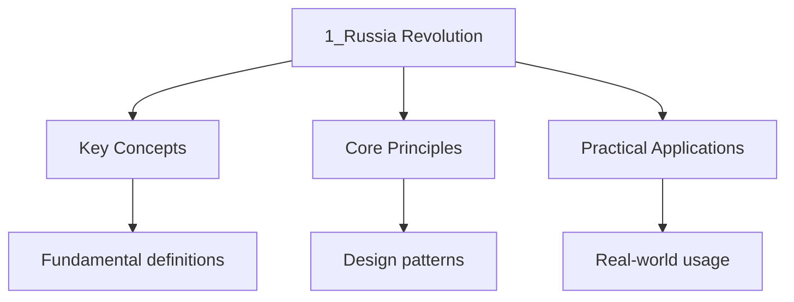

---

title: "Russia 1917-1953 | A-Level - Wyatt's Notes"
date: 2026-05-21T00:00:00.000Z
tags:
  - alevel
  - alevel-history
categories:
  - alevel
  - history
description: "A-Level History Russia 1917-1953 notes covering key definitions, core concepts, worked examples, and practice questions for exam readiness."
---

<!-- Breadcrumb Schema for SEO -->

## Russia 1917-1953

From the fall of the Romanov dynasty to the death of Stalin, Russia underwent revolutions, civil
war, rapid industrialisation, mass terror, and a transformative victory in the Second World War that
reshaped the global order.

## Historical Context and Chronology

Tsarist Russia entered the twentieth century as an autocratic empire with a predominantly peasant
population, limited industrialisation, and growing revolutionary movements. The 1905 Revolution
forced limited concessions, but Tsar Nicholas II resisted genuine reform.

The First World War exposed the regime"s weaknesses: military defeat, economic dislocation, and food
shortages led to the February Revolution of 1917, which overthrew the Tsar. The Provisional
Government that replaced it failed to end the war or address land reform, creating the conditions
for the Bolshevik Revolution in October 1917.

After winning a brutal Civil War (1918-1921), the Bolsheviks established the Soviet Union. Lenin's
death in 1924 triggered a succession struggle won by Stalin, who pursued forced industrialisation,
agricultural collectivisation, and political purges at staggering human cost. The Soviet victory in
the "Great Patriotic War" (1941-1945) established the USSR as a superpower and set the stage for the
Cold War.

### Chronological Overview

| Period                | Dates        | Key Themes                                                      |
| --------------------- | ------------ | --------------------------------------------------------------- |
| Late Tsarism          | 1905-1917    | Duma experiment, Stolypin reforms, Rasputin, wartime collapse   |
| 1917 Revolutions      | Feb-Oct 1917 | February Revolution, Provisional Government, October Revolution |
| Civil War             | 1918-1921    | Reds vs. Whites, War Communism, Red Terror, Polish-Soviet War   |
| NEP and consolidation | 1921-1928    | New Economic Policy, power struggle after Lenin's death         |
| Stalin's revolution   | 1928-1941    | Five-Year Plans, collectivisation, purges, show trials          |
| Great Patriotic War   | 1941-1945    | Operation Barbarossa, Stalingrad, Soviet advance, victory       |
| Late Stalinism        | 1945-1953    | Reconstruction, Cold War origins, new purges, Doctor's Plot     |

## Key Events with Dates and Significance

### Tsarist Collapse

- **1905 — Bloody Sunday**: Peaceful protesters shot outside the Winter Palace. Significance:
  destroys the Tsar's image as the "little father"; triggers the 1905 Revolution.
- **October 1905 — October Manifesto**: Tsar promises civil liberties and a Duma. Significance:
  divides opposition; saves the regime temporarily.
- **1906-1911 — Stolypin's reforms**: Land reforms aimed at creating a loyal peasant class.
  Significance: too slow to prevent revolution; Stolypin assassinated in 1911.
- **1914 — Russia enters WWI**: Initial patriotism gives way to military disaster. Significance: the
  war accelerates all of the regime's existing weaknesses.
- **December 1916 — Rasputin murdered**: Symbol of royal corruption. Significance: reflects the
  depth of elite disillusionment with the Tsarina and the regime.

### 1917 Revolutions

- **February 1917 — February Revolution**: Bread riots in Petrograd; army mutinies; Tsar abdicates
  on 2/15 March. Significance: centuries of Romanov rule end; a spontaneous revolution, not a
  Bolshevik coup.
- **March 1917 — Dual Power**: Provisional Government governs formally; Petrograd Soviet controls
  the military and workers. Significance: power is divided and unstable.
- **April 1917 — Lenin returns; April Theses**: "All power to the Soviets"; "Peace, Land, Bread".
  Significance: Lenin repudiates cooperation with the Provisional Government and sets Bolshevik
  strategy.
- **June 1917 — June Offensive**: Disaster on the front; army disintegrates further. Significance:
  destroys confidence in the Provisional Government.
- **July 1917 — July Days**: Abortive Bolshevik uprising; Lenin flees to Finland. Significance:
  shows Bolsheviks are not yet ready to seize power.
- **August 1917 — Kornilov Revolt**: General Kornilov attempts a right-wing coup; Kerensky arms the
  Bolsheviks' Red Guards to defeat it. Significance: legitimises and strengthens the Bolsheviks.
- **October 1917 — Bolshevik Revolution**: Armed seizure of power in Petrograd; Winter Palace
  stormed. Significance: the Bolsheviks take control; relatively bloodless in Petrograd but
  contested nationwide.

### Civil War and Consolidation

- **1918-1921 — Russian Civil War**: Reds (Bolsheviks) vs. Whites (diverse anti-Bolshevik forces),
  Greens (peasant armies), and foreign interventionists. Significance: brutal conflict with famine
  and terror on all sides; Bolshevik victory consolidates the revolution.
- **March 1918 — Treaty of Brest-Litovsk**: Russia exits WWI, ceding vast territory. Significance:
  humiliating peace but allows Bolsheviks to focus on the Civil War.
- **1918-1922 — Red Terror**: Cheka (secret police) executes tens of thousands. Significance:
  establishes terror as an instrument of Soviet governance.
- **1921 — Kronstadt Rebellion**: Bolshevik sailors revolt against the regime. Significance: signals
  that War Communism has pushed even supporters to breaking point.
- **1921 — NEP introduced**: Partial return to market economics. Significance: pragmatic retreat
  that stabilises the economy; divides the party.

### Stalin's Rise and Rule

- **1922-1927 — Power struggle**: Stalin, Trotsky, Zinoviev, Kamenev, and Bukharin compete to
  succeed Lenin. Significance: Stalin's control of party organisation proves decisive.
- **1924 — Lenin's Testament**: Criticises Stalin and recommends his removal. Significance:
  suppressed by Stalin's allies; could have changed history.
- **1928 — First Five-Year Plan**: Rapid industrialisation with unrealistic targets. Significance:
  transforms Soviet economy at enormous human cost.
- **1929-1932 — Collectivisation**: Forced consolidation of peasant farms into kolkhozes.
  Significance: triggers the Ukrainian famine (Holodomor, 1932-33); 5-7 million die; destroys
  peasant independence.
- **1932-1933 — Ukrainian famine (Holodomor)**: Result of forced grain requisitioning. Significance:
  debate continues over whether this constitutes genocide.
- **December 1934 — Kirov murdered**: Leningrad party boss assassinated. Significance: triggers the
  Great Purge; likely orchestrated by Stalin.
- **1936-1938 — Great Purge**: Show trials of Old Bolsheviks; purges of the party, military, and
  society. Significance: decimates the Red Army officer corps (contributing to early WWII failures);
  establishes a climate of fear.
- **1936 — Stalin Constitution**: Proclaims democratic rights. Significance: propaganda exercise
  contradicted by the ongoing terror.
- **1939 — Nazi-Soviet Pact**: Non-aggression pact with secret protocols dividing Eastern Europe.
  Significance: enables German invasion of Poland; allows Soviet annexation of the Baltics and
  eastern Poland.

### The Great Patriotic War

- **June 1941 — Operation Barbarossa**: Germany invades the USSR. Significance: Stalin paralysed by
  surprise; catastrophic early losses.
- **1941-1942 — Siege of Leningrad**: 872-day siege; over 1 million civilians die. Significance:
  symbol of Soviet suffering and resistance.
- **December 1941 — Battle of Moscow**: Soviet counter-attack pushes Germans back. Significance:
  proves Germany can be resisted.
- **July 1942-February 1943 — Battle of Stalingrad**: Turning point; German Sixth Army destroyed.
  Significance: psychological and military turning point of the war in the East.
- **July 1943 — Battle of Kursk**: Largest tank battle in history; Soviet victory. Significance:
  Germany loses strategic initiative permanently.
- **April-May 1945 — Battle of Berlin**: Soviet forces capture the city; Hitler commits suicide.
  Significance: European war ends; Soviet power extends across Eastern Europe.

### Late Stalinism

- **1945-1947 — Sovietisation of Eastern Europe**: Communist governments installed in Poland,
  Hungary, Romania, Bulgaria, and East Germany. Significance: creates the Soviet bloc; contributes
  to Cold War tensions.
- **1946-1947 — Famine**: Post-war food crisis kills 1-1.5 million. Significance: human cost of
  reconstruction and continued grain requisitioning.
- **1948 — Berlin Blockade**: Stalin blocks Western access to Berlin. Significance: first major Cold
  War crisis; leads to the Berlin Airlift.
- **1949 — Soviet atomic bomb**: Ends US nuclear monopoly. Significance: accelerates the arms race.
- **1952-1953 — Doctors' Plot**: Anti-Semitic campaign accusing Jewish doctors of conspiring to kill
  Soviet leaders. Significance: suggests Stalin was planning another purge; cut short by his death.
- **March 1953 — Stalin dies**: Power passes to a collective leadership. Significance: ends the most
  murderous phase of Soviet history.

## Key Figures and Their Roles

| Figure           | Role                                   | Significance                                                                                        |
| ---------------- | -------------------------------------- | --------------------------------------------------------------------------------------------------- |
| Tsar Nicholas II | Last Tsar                              | Weak, indecisive ruler whose refusal to reform led to revolution                                    |
| Lenin            | Bolshevik leader, head of Soviet state | Theoretician and practical revolutionary; established the one-party state                           |
| Trotsky          | Revolutionary, Red Army commander      | Organised the October Revolution and led the Red Army to Civil War victory; outmanoeuvred by Stalin |
| Stalin           | General Secretary, later dictator      | Transformed the USSR through industrialisation and terror; killed millions                          |
| Bukharin         | Moderate Bolshevik                     | Champion of the NEP; executed in the Great Purge                                                    |
| Khrushchev       | Stalin's successor (from 1953)         | Denounced Stalin's cult of personality in the 1956 Secret Speech                                    |
| Marshal Zhukov   | Military commander                     | Led Soviet forces at Stalingrad, Kursk, and Berlin                                                  |

## Historiographical Debates

### Debate 1: Was Stalinism a continuation of Leninism or a departure?

- **Totalitarian school** (e.g., Richard Pipes): Stalin was the logical outcome of Lenin's creation
  of a one-party state, secret police, and suppression of democracy. Continuity is the key theme.
- **Revisionist school** (e.g., Stephen Cohen, Sheila Fitzpatrick): Stalinism represented a rupture
  with Leninism. Lenin supported the NEP and inner-party democracy; Stalin's collectivisation,
  purges, and personal dictatorship were not inevitable.
- **Post-revisionist** (e.g., Robert Service): Lenin created the institutional preconditions for
  Stalinism (one-party state, terror apparatus), but Stalin's specific policies — particularly the
  scale of the purges — went beyond anything Lenin envisioned.

### Debate 2: Was the October Revolution a popular uprising or a Bolshevik coup?

- **Soviet orthodox view**: The October Revolution was a popular uprising of the working class and
  peasants, led by the Bolshevik Party. Lenin's leadership reflected the will of the masses.
- **Liberal/totalitarian view** (e.g., Richard Pipes, Orlando Figes): October 1917 was a coup by a
  small, disciplined minority that exploited the chaos of 1917 to seize power. Popular support was
  limited.
- **Revisionist view** (e.g., Alexander Rabinowitch): The Bolsheviks had significant popular support
  in Petrograd and among soldiers and workers, but the revolution was not a mass uprising in the
  traditional sense. It was a seizure of power by a party with genuine, though not majority,
  support.

### Debate 3: Was collectivisation necessary for industrialisation?

- **Stalinist view**: Collectivisation was essential to extract agricultural surplus to fund
  industrialisation. Without it, the USSR could not have developed rapidly enough to defeat Nazi
  Germany.
- **Revisionist view** (e.g., R.W. Davies): Industrialisation could have proceeded at a slower pace
  without collectivisation. The NEP was working; Stalin chose the brutal path for political, not
  economic, reasons.
- **Post-revisionist view**: Some form of agricultural transformation was necessary, but Stalin's
  specific methods — particularly the pace and the associated terror — were catastrophic choices,
  not economic necessities.

## Source Analysis Techniques

When analysing Russian and Soviet sources:

1. **Official Soviet sources**. Statistics, speeches, and reports were often fabricated or
   selectively presented. Production figures from the Five-Year Plans should be treated sceptically.
2. **Photographs and visual propaganda**. Soviet photographs were heavily manipulated (e.g.,
   removal of purged figures from photographs). Always consider what has been altered.
3. **Dissident sources**. Writings from the gulag (Solzhenitsyn), samizdat publications, and
   memoirs provide alternative perspectives but may overstate the extent of resistance.
4. **Archival evidence**. The opening of Soviet archives after 1991 transformed historians'
   understanding. New evidence revised estimates of purge victims, confirmed the scale of famine
   deaths, and revealed the internal workings of the regime.

### Key Source Types

- **Soviet newspapers (Pravda, Izvestia)**: Official line, not public opinion
- **Speeches and party congress transcripts**: Reveal policy direction and internal debates
- **NKVD archives**: Internal records of arrests, executions, and camp populations
- **Personal diaries and letters**: Private reflections, though written with awareness of
  surveillance
- **Foreign diplomatic correspondence**: Outsider assessments (e.g., British and American
  ambassadors)

## Common Pitfalls

1. **Assuming the Bolshevik Revolution was inevitable**. Russia in 1917 had multiple possible
   outcomes. The Provisional Government's specific failures (staying in the war, not solving the
   land question) created the opportunity that Lenin exploited. Contingency matters.
2. **Conflating Lenin and Stalin**. While Lenin created the institutional framework that Stalin
   exploited, their policies and methods differed significantly. Lenin supported the NEP and
   tolerated limited internal debate; Stalin ended both.
3. **Underestimating popular support for the Soviet project**. Despite the terror, the regime
   retained genuine support, particularly among workers who benefited from industrialisation and
   those who identified with the victory over fascism. Support and repression coexisted.

## Worked Examples

### Example 1: Essay Plan — "The First World War was the main reason for the fall of Tsarism." How far do you agree?

**Introduction**: The war exposed and accelerated existing weaknesses, but Tsarism was already under
severe strain from long-term structural problems. The war acted as a catalyst rather than a sole
cause.

**Paragraph 1 — Impact of WWI** (agree)

- Military defeats: Tannenberg, Masurian Lakes; 1.7 million dead by 1916
- Economic disruption: inflation, food shortages, transport breakdown
- Political failures: Tsar takes personal command of the army (1915), linking his fate to military
  performance
- Rasputin's influence over the Tsarina discredits the regime
- But: the regime survived the 1905 Revolution; war alone did not determine the outcome

**Paragraph 2 — Long-term political weaknesses** (alternative)

- Autocracy was anachronistic in early twentieth-century Europe
- The Duma experiment (1906) satisfied no one: too limited for liberals, too much for the Tsar
- Nicholas II was personally unsuited to rule: indecisive, committed to autocracy
- But: autocracy might have muddled through without the war

**Paragraph 3 — Social and economic problems** (alternative)

- Peasant land hunger: the 1861 Emancipation had not solved the agrarian crisis
- Rapid industrialisation created a concentrated urban working class with grievances
- The 1912 Lena Goldfields massacre showed labour unrest could not be contained
- But: social tensions alone rarely topple regimes without a political crisis

**Paragraph 4 — Revolutionary opposition** (alternative)

- Liberals, SRs, and Bolsheviks all challenged the regime
- However, revolutionary parties were weak and divided in 1914; many leaders in exile
- The war actually initially suppressed labour unrest through patriotism
- But: revolutionary ideologies provided an alternative when the regime faltered

**Conclusion**: The war was the decisive catalyst — without it, the Tsarist regime might have limped
on. But it acted on pre-existing structural weaknesses: political rigidity, social inequality, and
economic underdevelopment. The war did not create the revolution; it detonated the existing
instability.

### Example 2: Essay Plan — "Stalin's rule was more harmful than beneficial for the Soviet Union." How far do you agree?

**Introduction**: Stalin's rule brought rapid industrialisation and military victory but at
staggering human cost. The balance depends on whether economic and geopolitical gains justify the
suffering inflicted.

**Paragraph 1 — Economic transformation** (beneficial)

- USSR transformed from agrarian to industrial power
- Second and Third Five-Year Plans (post-1933) achieved more realistic growth
- By 1940, USSR was the world's third-largest industrial producer
- But: growth came at enormous human cost; targets were often unrealistic; quality sacrificed for
  quantity

**Paragraph 2 — Human cost** (harmful)

- Collectivisation and the Ukrainian famine: 5-7 million deaths
- The Great Purge: approximately 1 million executed; millions more in the gulag
- Destruction of the peasantry as an independent social force
- Elimination of military leadership weakened the USSR in 1941
- The human cost far outweighs any economic argument

**Paragraph 3 — Military victory** (beneficial)

- The USSR defeated Nazi Germany, the most significant achievement of the period
- Industrial base built under Stalin enabled wartime production
- Victory established the USSR as a superpower
- But: early military disasters were partly caused by the purges; the victory was won by the Soviet
  people, not by Stalin's leadership

**Paragraph 4 — Political legacy** (harmful)

- Established a model of personal dictatorship and terror
- Undermined genuine socialist democracy
- Created a climate of fear that persisted for decades
- But: some argue strong central control was necessary to hold the USSR together

**Conclusion**: The harm inflicted by Stalin's rule — millions of deaths, the destruction of civil
society, the establishment of terror as a governing tool — vastly outweighs the economic and
military achievements. The USSR might have industrialised through less brutal means. Stalin's rule
was a catastrophe for the Soviet people, even if it created a superpower.

## Intuition

Russia's twentieth-century journey resembles a house that collapsed and was rebuilt several times, each reconstruction using different blueprints but the same foundation. The Tsarist regime fell not because Lenin was strong but because the existing structure was rotten: war, hunger, and a ruler who could not adapt. Stalin's industrialisation was like forcing a horse to pull a cart at the speed of a train, breaking both horse and cart in the process. The purges created a climate where loyalty mattered more than competence, which nearly cost the USSR the war it ultimately won through sheer sacrifice and vast resources.

## Summary

Russia's journey from Tsarism to Stalinism was shaped by the interaction of long-term structural
weaknesses, the catalyst of the First World War, revolutionary ideology, and the ambitions of
ruthless leaders. The 1917 revolutions were contingent events, not inevitable. The Civil War and NEP
established patterns of governance — including terror — that Stalin would intensify dramatically.
Stalin's industrialisation and collectivisation transformed the USSR at enormous human cost, and the
victory over Nazi Germany came at a price of approximately 27 million Soviet dead. Key
historiographical debates concern the continuity between Lenin and Stalin, whether October was a
coup or a popular rising, and whether Stalin's brutal methods were necessary for modernisation.

## Cross-References

- **[Source Analysis](../diagnostics/diag-source-analysis):** Source analysis skills support historical study
- **[Essay Techniques](../11-essay-techniques/1_essay_techniques):** Essay writing is essential for history
- **[Tudor England](../2-tudor-england/1_tudor-england):** Tudor period provides rich historical material
