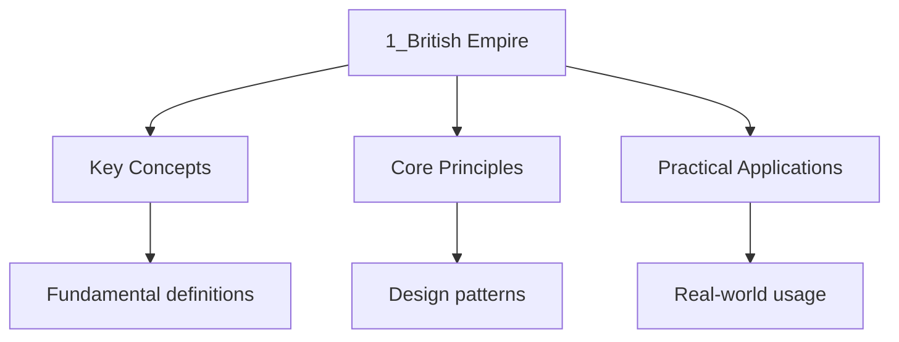

---

title: "The British Empire c1688-1763 | A-Level"
date: 2026-05-21T00:00:00.000Z
tags:
  - alevel
  - alevel-history
categories:
  - alevel
  - history
description: "A-Level History The British Empire c1688-1763 notes covering key definitions, core concepts, worked examples, and practice questions for detailed revision."
---

<!-- Breadcrumb Schema for SEO -->

## The British Empire c1688-1763

Between the Glorious Revolution and the end of the Seven Years" War, Britain transformed from a
marginal European kingdom into a global imperial power. Commercial ambition, naval strength, and
imperial ideology drove expansion across the Atlantic, Caribbean, and India.

## Historical Context and Chronology

The period begins with the Glorious Revolution of 1688, which established constitutional monarchy
and parliamentary supremacy in Britain. The new regime under William III was committed to opposing
French hegemony in Europe and expanding England's (after 1707, Britain's) overseas possessions.

This was not an empire of direct territorial rule but one of commercial networks, chartered
companies, and strategic naval bases. The East India Company, the Royal African Company, and
networks of private merchants drove expansion. Plantation economies in the Caribbean and southern
American colonies depended on enslaved African labour.

Imperial competition with France and Spain produced a series of wars — King William's War, Queen
Anne's War, the War of Jenkins' Ear, and the Seven Years' War — that tested and expanded British
global reach. By 1763, Britain had emerged as the dominant colonial power, possessing territories in
North America, the Caribbean, and India.

### Chronological Overview

| Period                   | Dates     | Key Themes                                                             |
| ------------------------ | --------- | ---------------------------------------------------------------------- |
| Commercial foundations   | 1688-1702 | East India Company expansion, Royal African Company, navigation acts   |
| Union and war            | 1702-1713 | War of Spanish Succession, Act of Union 1707, Treaty of Utrecht        |
| Atlantic expansion       | 1713-1739 | Growth of colonial settlements, triangular trade, plantation economies |
| Imperial conflict        | 1739-1748 | War of Jenkins' Ear, War of Austrian Succession                        |
| Global war and dominance | 1754-1763 | Seven Years' War, conquest of Canada, Plassey, Treaty of Paris         |

## Key Events with Dates and Significance

### Foundations of Commercial Expansion

- **1688 — Glorious Revolution**: William of Orange takes the throne; constitutional settlement.
  Significance: creates a regime committed to opposing France and promoting Protestant commercial
  interests globally.
- **1689 — Bill of Rights and Toleration Act**: Parliamentary sovereignty established. Significance:
  political stability and property rights create conditions favourable to commercial expansion.
- **1694 — Bank of England founded**: Provides government finance through a national debt.
  Significance: enables Britain to fund wars and overseas expansion through sophisticated financial
  instruments.
- **1698 — New East India Company chartered**: Competes with the original company; they merge
  in 1709. Significance: intensifies British commercial presence in India.

### Atlantic Trade and Colonies

- **1707 — Act of Union**: England and Scotland unite as Great Britain. Significance: opens Scottish
  merchants and settlers to English colonial trade; creates a larger political and economic unit.
- **1713 — Treaty of Utrecht**: Ends War of Spanish Succession. Britain gains Gibraltar, Minorca,
  Newfoundland, Nova Scotia, and the Asiento (right to supply enslaved Africans to Spanish
  colonies). Significance: establishes Britain as a major beneficiary of the European balance of
  power; the Asiento formalises Britain's role in the slave trade.
- **1720 — South Sea Bubble**: Financial speculation crash. Significance: reveals the risks of
  imperial finance but does not halt expansion; leads to increased regulation.
- **1730s-1740s — Expansion of plantation economies**: Sugar, tobacco, and rice plantations in the
  Caribbean and southern colonies. Significance: these economies depend on enslaved labour; the
  triangular trade (manufactured goods → Africa → enslaved people → Americas → raw materials →
  Britain) becomes the backbone of imperial commerce.

### The East India Company and India

- **1612 — Battle of Swally**: English defeat Portuguese; begin establishing factories. (Earlier
  context)
- **1661 — Bombay ceded to England**: Part of Catherine of Braganza's dowry. Significance: first
  major territorial possession in India.
- **1686-1690 — Conflict with the Mughal Empire**: East India Company's aggressive tactics lead to
  defeat; apologises to Aurangzeb. Significance: demonstrates that the Company is not yet a military
  power; must operate through diplomacy and trade.
- **1690-1700 — Calcutta established**: Job Charnock founds a trading post. Significance: becomes
  the centre of British activity in Bengal.
- **1717 — Farman from Mughal Emperor Farrukhsiyar**: Grants the East India Company duty-free trade
  in Bengal. Significance: gives the Company a significant commercial advantage over competitors.
- **1740s-1750s — Anglo-French rivalry in India**: Dupleix (French) and Clive (British) compete for
  influence among Indian states. Significance: transforms the Company from a commercial entity into
  a political and military power.

### Slavery and the Transatlantic Slave Trade

- **c.1500-1807 — Transatlantic slave trade**: Britain becomes the largest slave-trading nation by
  the mid-eighteenth century. Approximately 3.1 million enslaved Africans transported by British
  ships. Significance: the slave trade generates enormous wealth for merchants, ports (Bristol,
  Liverpool, Glasgow), and the broader economy.
- **1698 — Royal African Company monopoly ends**: Private traders enter the slave trade.
  Significance: dramatically increases the volume of the trade; the number of enslaved people
  transported triples.
- **Plantation economies**: Caribbean sugar, Virginia tobacco, Carolina rice. Significance: enslaved
  labour is the economic foundation of these colonies; brutal conditions produce high mortality and
  constant demand for new captives.

### Imperial Wars

- **1689-1697 — King William's War (War of the Grand Alliance)**: First Anglo-French conflict after
  the Glorious Revolution. Significance: establishes the pattern of imperial warfare linked to
  European conflicts.
- **1702-1713 — Queen Anne's War (War of Spanish Succession)**: Britain gains major territorial
  concessions at Utrecht. Significance: demonstrates that European wars can expand imperial
  holdings.
- **1739-1748 — War of Jenkins' Ear / War of Austrian Succession**: Conflict begins over Spanish
  depredations against British shipping; merges into wider European war. Significance: Admiral
  Vernon's capture of Portobello (1739) boosts British confidence but the war ends inconclusively.
- **1745 — Jacobite Rebellion**: French-backed attempt to restore the Stuart dynasty. Significance:
  demonstrates that imperial rivalry has domestic consequences; defeat strengthens the Hanoverian
  regime.
- **1754-1763 — Seven Years' War (French and Indian War)**: Global conflict; Britain and Prussia vs.
  France, Austria, Russia, and Spain. Significance: the decisive imperial war.

#### Seven Years' War Key Events

- **1756 — Black Hole of Calcutta**: Alleged incident where British prisoners die in a small room.
  Significance: used as propaganda to justify retaliation; accuracy of the account debated.
- **1757 — Battle of Plassey**: Robert Clive defeats Siraj-ud-Daulah, Nawab of Bengal, with the
  support of the Nawab's rival Mir Jafar. Significance: gives the East India Company control of
  Bengal; the foundation of British rule in India. The battle was won through bribery and treachery
  as much as military skill.
- **1758-1760 — French expelled from India**: Pondicherry falls in 1761. Significance: ends French
  challenge in India; Britain becomes the dominant European power.
- **1759 — Battle of the Plains of Abraham (Quebec)**: General Wolfe defeats Montcalm; both die.
  Significance: British capture of Quebec effectively gives control of Canada.
- **1760 — Capture of Montreal**: French Canada surrenders. Significance: completes the conquest of
  New France.
- **1762 — British capture Havana and Manila**: Spanish colonial cities taken. Significance:
  demonstrates the global reach of British naval power.
- **1763 — Treaty of Paris**: Britain gains Canada, Florida, and territories west of the Appalachian
  Mountains; returns Havana and Manila to Spain; returns Guadeloupe and Martinique to France.
  Significance: Britain emerges as the world's dominant colonial power, but the vast new territories
  create governing challenges that contribute to the American Revolution.

## Key Figures and Their Roles

| Figure                 | Role                         | Significance                                                                                           |
| ---------------------- | ---------------------------- | ------------------------------------------------------------------------------------------------------ |
| William III            | King 1689-1702               | Committed to opposing France; promoted commercial and naval expansion                                  |
| Robert Walpole         | Prime Minister 1721-1742     | Pursued peaceful commercial expansion; avoided European entanglements                                  |
| William Pitt the Elder | Secretary of State 1756-1761 | Directed the strategy that won the Seven Years' War; focused on maritime and colonial warfare          |
| Robert Clive           | East India Company officer   | Victory at Plassey (1757) established British power in India; later investigated for corruption        |
| Admiral Anson          | Naval commander              | Circumnavigated the globe (1740-1744); captured Spanish treasure ship; reformed the navy as First Lord |
| General Wolfe          | Military commander           | Captured Quebec (1759); became a martyr-hero of British imperial expansion                             |
| Warren Hastings        | East India Company official  | Later period (first Governor-General 1773); established administrative structures in India             |
| Job Charnock           | East India Company agent     | Founded Calcutta (1690)                                                                                |

## Historiographical Debates

### Debate 1: Was the British Empire primarily a commercial or a political project?

- **Commercial interpretation** (e.g., Vincent Harlow): The empire was driven by trade and profit.
  Chartered companies, merchants, and economic interests shaped imperial expansion. Territorial
  control was a byproduct of commercial activity.
- **Political interpretation** (e.g., Lawrence James): Imperial expansion was driven by strategic
  and political considerations — rivalry with France, national prestige, and the desire for
  security. Commercial interests served political goals as much as the reverse.
- **Synthesis**: The empire was both. The East India Company pursued profit but was drawn into
  political and military entanglement. The government pursued strategic goals but relied on
  commercial institutions. Commercial and political motives were inseparable in practice.

### Debate 2: How should the transatlantic slave trade be interpreted?

- **Eric Williams' "Capitalism and Slavery" thesis** (1944): The slave trade and plantation slavery
  provided the capital that financed the Industrial Revolution. The abolition of the slave trade was
  driven by economic decline of the sugar islands, not moral awakening.
- **Seymour Drescher's critique**: The slave trade was economically significant but not the primary
  driver of industrialisation. British economic growth had multiple sources. Abolition was a moral
  and political choice, not an economic one.
- **Modern consensus**: The slave trade generated enormous wealth for specific regions (Bristol,
  Liverpool, Glasgow) and industries (banking, insurance, shipping), but the relationship between
  slavery and industrialisation is more complex than Williams suggested. Slavery's economic
  contribution was significant but not singular.

### Debate 3: How should the Battle of Plassey and British expansion in India be interpreted?

- **Imperialist interpretation** (19th century): Plassey as a triumph of British civilisation and
  military superiority over oriental despotism. Clive as a hero.
- **Nationalist Indian interpretation**: Plassey was a conquest achieved through bribery and
  treachery, not military merit. It began the exploitation and impoverishment of India. The East
  India Company's rule was extractive and destructive.
- **Post-colonial and revisionist** (e.g., William Dalrymple): The Company was a "rogue corporation"
  that operated with minimal oversight. Its conquests were driven by personal greed as much as
  national policy. The transition from trade to empire was gradual and contested.
- **Pragmatic view**: The Company was drawn into Indian politics through the collapse of Mughal
  authority. Political fragmentation in India created opportunities that European traders exploited.

## Source Analysis Techniques

When analysing sources from the early British Empire:

1. **Company records vs. government records**. The East India Company had its own archives. Company
   records present commercial justification; government records may reveal political concerns.
2. **Travel writing and exploration accounts**. Often presented non-European peoples in terms that
   justified conquest and exploitation. Consider the ideological function of these texts.
3. **Financial records**. Trade statistics, plantation accounts, and insurance records provide
   objective data on the economics of empire, including the slave trade.
4. **Non-European perspectives**. Indian, African, and indigenous American sources exist but are
   often mediated through European translation. Seek out sources that reveal the experiences and
   perspectives of colonised peoples.

### Key Source Types

- **East India Company records**: Minutes, letters, and financial accounts from London and Indian
  factories
- **Parliamentary debates and statutes**: Reveal government policy toward trade, colonies, and
  slavery
- **Plantation records**: Accounts, inventories, and correspondence from Caribbean and American
  plantations
- **Naval and military records**: Logs, dispatches, and campaign accounts
- **Travel narratives and natural histories**: Descriptions of peoples, lands, and resources —
  shaped by imperial assumptions
- **Maps and charts**: Representations of territory that reflect imperial claims and knowledge

## Common Pitfalls

1. **Viewing the empire as a unified, centrally planned project**. The early British Empire was a
   messy collection of ventures by chartered companies, private merchants, settlers, and colonial
   governors, often with conflicting interests. Central government control was limited.
2. **Anachronistic moral judgement without historical understanding**. The slave trade and colonial
   exploitation were morally wrong by any standard, but understanding the period requires engaging
   with the mentalities and economic structures that sustained these practices. Avoid both
   presentism and moral relativism.
3. **Ignoring the role of non-European actors**. Indian rulers, African merchants, and indigenous
   American polities were active participants in, not merely passive victims of, imperial expansion.
   Alliances, rivalries, and collaborations with local powers were essential to British success.

## Worked Examples

### Example 1: Essay Plan — "Commercial motives were the main driver of British imperial expansion in the period 1688-1763." How far do you agree?

**Introduction**: Commercial interests were the primary engine of expansion, but strategic rivalry
with France, the political ambitions of chartered companies, and the role of the state in supporting
and directing commerce were also essential factors.

**Paragraph 1 — Commercial motives** (agree)

- The East India Company, Royal African Company, and private merchants drove expansion
- The triangular trade generated enormous profits: manufactured goods → Africa → enslaved people →
  Americas → raw materials → Britain
- Plantation economies in the Caribbean produced sugar, the most valuable commodity of the period
- The Navigation Acts were designed to ensure colonial trade benefited the mother country
- But: commercial success depended on naval and military power provided by the state

**Paragraph 2 — Strategic rivalry with France** (alternative)

- The Glorious Revolution committed Britain to opposing French power
- Imperial wars (1702-1713, 1740-1748, 1754-1763) were extensions of European conflicts
- Pitt the Elder's strategy in the Seven Years' War prioritised colonial conquest as a means of
  weakening France
- Territorial gains at Utrecht (1713) and Paris (1763) reflected strategic as much as commercial
  thinking
- But: strategic goals and commercial interests overlapped significantly

**Paragraph 3 — The role of chartered companies** (alternative)

- The East India Company evolved from a trading body into a territorial power
- Company officials like Clive pursued personal ambition as much as commercial profit
- The Company's transition from trade to governance in Bengal after Plassey was driven by political
  opportunity
- But: this was still fundamentally commercial — political control served trade

**Paragraph 4 — Settler and colonial dynamics** (alternative)

- North American colonies expanded westward driven by settlers, not government policy
- Colonial assemblies often pursued their own interests, sometimes conflicting with London
- The diversity of colonial interests (New England merchants, Caribbean planters, southern farmers)
  meant there was no single "imperial" motive
- But: settlers operated within the framework of British imperial power

**Conclusion**: Commercial motives were the primary driver — the empire was built on trade, profit,
and the economic exploitation of resources and labour. However, commercial expansion was inseparable
from strategic competition with France, the political evolution of chartered companies, and the
support of state power. The most accurate view is that the empire was a commercial project enabled
and shaped by political and military power.

### Example 2: Essay Plan — "The Battle of Plassey was a turning point in the history of the British Empire." How far do you agree?

**Introduction**: Plassey in 1757 marked the transition of the East India Company from a trading
organisation to a territorial power, but it was not the sole turning point — the Seven Years' War
and the Treaty of Paris were equally significant in establishing British global dominance.

**Paragraph 1 — Significance of Plassey** (agree)

- Gave the Company control of Bengal's revenue (the diwani was formally granted in 1765)
- Transformed the Company into a political entity with its own army and territory
- Bengal's wealth funded further expansion across India
- Demonstrated that Indian states could be defeated through alliances and bribery, not just military
  force
- But: full British control of India took decades more; Plassey was the beginning, not the end

**Paragraph 2 — The broader context of the Seven Years' War** (alternative)

- Plassey was one theatre of a global conflict
- The expulsion of France from India and Canada was equally important
- The Treaty of Paris (1763) gave Britain Canada, Florida, and dominance in India
- The war demonstrated Britain's global naval and military reach
- But: Plassey was specific to India; other gains had separate causes

**Paragraph 3 — Long-term consequences** (alternative)

- Plassey led to the Bengal Famine of 1770 (estimated 10 million deaths), as Company revenue
  extraction devastated the agricultural economy
- Triggered the Regulating Act (1773) and increasing parliamentary oversight of the Company
- Set the pattern for Company rule: commercial exploitation backed by military force
- The American Revolution (1776) would soon demonstrate the limits of imperial control
- But: these consequences were not all foreseeable in 1757

**Paragraph 4 — Earlier turning points** (alternative)

- The Treaty of Utrecht (1713) gave Britain the Asiento and Newfoundland
- The founding of Calcutta (1690) established the British presence in Bengal
- The collapse of Mughal authority created the conditions for European expansion
- But: these events did not create territorial empire in the way Plassey did

**Conclusion**: Plassey was a genuine turning point — it initiated British territorial rule in India
and transformed the East India Company from a commercial into a political entity. However, it must
be understood within the broader context of the Seven Years' War, which established British global
dominance across multiple theatres. Plassey was the most significant turning point for India
specifically; the Treaty of Paris was the most significant turning point for the empire as a whole.

## Intuition

Think of the early British Empire not as a single machine but as a network of competing traders, sailors, and soldiers who happened to fly the same flag. The Glorious Revolution was less a grand ideological moment and more a boardroom takeover that happened to involve armies. The East India Company started as a group of merchants chasing pepper and silk, then stumbled into governing millions of people because no one else was paying attention. The triangular trade resembles a three-legged stool: remove any leg and the entire structure collapses. The Seven Years' War showed that a small island could outmanoeuvre continental empires by controlling sea lanes rather than border territory.

## Summary

The British Empire between 1688 and 1763 was shaped by the interaction of commercial ambition,
strategic rivalry with France, naval power, and the exploitation of enslaved African labour. The
Glorious Revolution created a regime committed to Protestantism and commercial expansion. The East
India Company transformed from trader to ruler. The triangular trade and plantation economies
generated enormous wealth at horrific human cost. The Seven Years' War established Britain as the
world's dominant colonial power. Key historiographical debates concern whether the empire was
primarily commercial or political, the relationship between slavery and industrialisation, and how
to interpret the Company's expansion in India. Source analysis must account for the perspectives of
both colonisers and colonised peoples, and the ideological assumptions embedded in imperial
documents.

## Cross-References

- **[Source Analysis](../diagnostics/diag-source-analysis):** Source analysis skills support historical study
- **[Essay Techniques](../11-essay-techniques/1_essay_techniques):** Essay writing is essential for history
- **[Tudor England](../2-tudor-england/1_tudor-england):** Tudor period provides rich historical material
