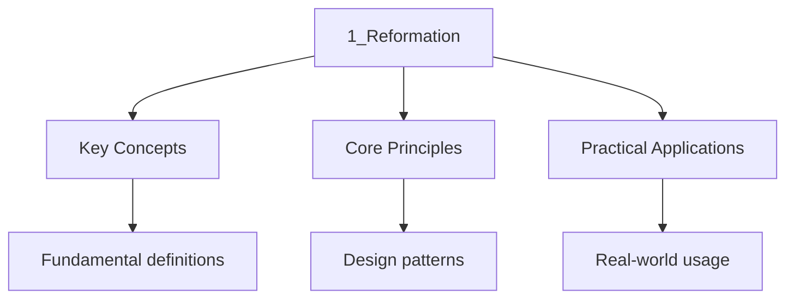

---

title: "The Reformation c1500-1600 | A-Level"
date: 2026-07-18T00:00:00.000Z
sidebar_position: 12
tags:
  - alevel
  - alevel-history
categories:
  - alevel
  - history
description: "A-Level History The Reformation notes covering causes, Luther's challenge, spread of Protestantism, Counter-Reformation, and political impact for detailed revision."
---

<!-- Breadcrumb Schema for SEO -->

## The Reformation c1500-1600

The Reformation was the religious, political, and social upheaval that fractured Western Christendom
in the sixteenth century. Beginning with Martin Luther's challenge to papal authority in 1517, it
produced new Protestant churches, transformed the church-state relationship, and reshaped European
politics for centuries.

## Historical Context and Chronology

By the early sixteenth century, the Roman Catholic Church dominated European life — spiritual
guidance, social order, and political influence. However, Renaissance humanism encouraged close
reading of original texts; the printing press made dissent accessible; and specific practices —
indulgence sales, clerical absenteeism, papal corruption — generated resentment.

### Chronological Overview

| Period                    | Dates     | Key Themes                                                       |
| ------------------------- | --------- | ---------------------------------------------------------------- |
| Pre-Reformation tensions  | 1450-1517 | Humanism, printing press, Church corruption                      |
| Luther's challenge        | 1517-1521 | 95 Theses, Diet of Worms, excommunication                        |
| Spread of Protestantism   | 1520-1560 | Zwingli, Calvin, Henry VIII                                       |
| Peasants' War and division | 1524-1555 | German Peasants' War, Peace of Augsburg                          |
| Counter-Reformation       | 1545-1600 | Council of Trent, Jesuits, Catholic renewal                       |

## Key Events with Dates and Significance

### Pre-Reformation Causes

- **c.1450-1500 — Renaissance humanism**: Scholars such as Erasmus applied critical methods to
  biblical texts, exposing errors in the Latin Vulgate. Significance: provided intellectual tools
  for challenging Church authority.

- **c.1440s — Printing press (Gutenberg)**: Mass production of texts became possible. Significance:
  enabled rapid spread of reformist ideas; Luther's writings reached vast audiences within weeks.

- **Church corruption**: Sale of indulgences, simony, pluralism, and absenteeism were widespread.
  Pope Leo X's funding of St. Peter's through indulgence sales was the immediate trigger for
  Luther. Significance: created popular resentment that reformers could exploit.

- **National tensions**: Secular rulers resented papal interference and the flow of wealth to Rome.
  Significance: ensured religious reform would become entangled with political ambitions.

### Luther's Challenge (1517-1521)

- **31 October 1517 — 95 Theses**: Luther challenges indulgence doctrine and papal authority.
  Significance: initially an academic protest, but printed and distributed across Germany within
  weeks, sparking widespread debate.

- **1519 — Leipzig Debate**: Luther is forced to concede that Church councils can err and scripture
  alone is authoritative (*sola scriptura*). Significance: moves from criticising abuses to
  challenging foundational Church authority.

- **1520 — Three treatises**: Luther publishes *To the Christian Nobility*, *The Babylonian
  Captivity*, and *The Freedom of a Christian*. Significance: articulate core Reformation
  principles — priesthood of all believers, primacy of scripture, justification by faith alone
  (*sola fide*).

- **1521 — Diet of Worms**: Luther refuses to recant before Charles V. Significance: excommunicated
  and declared an outlaw; Frederick the Wise protects him, ensuring the reform movement's survival.

### Spread of Protestantism

- **1523 — Zwingli in Zurich**: Rejects the mass, images, and clerical celibacy. Significance:
  establishes independent reform; differences with Luther on the Eucharist demonstrate Protestant
  diversity.

- **1524-1525 — German Peasants' War**: Peasants revolt, inspired by Luther's emphasis on
  Christian liberty. Luther condemns the revolt. Significance: severs social revolution from
  religious reform; ensures Protestantism's political survival depends on princely support.

- **1534 — Act of Supremacy**: Henry VIII breaks with Rome, declaring himself Supreme Head of the
  Church of England. Significance: the English Reformation is driven by political and dynastic
  motives rather than theological conviction, yet produces a national Protestant church.

- **1536 — Calvin's *Institutes***: John Calvin publishes his systematic theology emphasising
  God's sovereignty and predestination. Significance: Calvinism spreads to France, the Netherlands,
  Scotland, and New England; Geneva becomes a model Protestant community.

- **1555 — Peace of Augsburg**: *Cuius regio, eius religio* — each prince determines whether his
  territory is Catholic or Lutheran. Significance: provides temporary settlement; confirms that
  ruler's religion determines that of the state.

### Counter-Reformation

- **1545-1563 — Council of Trent**: Reaffirms Catholic doctrines (transubstantiation, seven
  sacraments, scripture and tradition) while addressing abuses — requiring bishops to reside in
  dioceses, improving clerical education, standardising the mass. Significance: systematic Catholic
  response without conceding to Protestant theology.

- **1540 — Jesuits approved**: Society of Jesus, founded by Ignatius of Loyola, becomes the
  intellectual and missionary arm of Catholic renewal. Significance: establishes schools,
  universities, and missions across Europe and beyond.

- **1542 — Roman Inquisition re-established**: Institutional mechanism for suppressing heresy.
  Significance: the Index of Forbidden Books (1559) controls dissemination of Protestant
  literature.

- **1562-1598 — French Wars of Religion**: Civil wars between Catholic and Huguenot factions.
  Significance: the Edict of Nantes (1598) grants limited Huguenot toleration, an early experiment
  in religious coexistence.

## Key Terms

- **Sola fide**: Justification by faith alone; salvation through faith, not works or sacraments.
- **Sola scriptura**: Scripture alone as the sole authority in matters of faith and practice.
- **Indulgence**: Remission of temporal punishment for sin, sold by the Church.
- **Transubstantiation**: Catholic doctrine that bread and wine become Christ's body and blood.
- **Cuius regio, eius religio**: Ruler determines territory's religion (Peace of Augsburg, 1555).
- **Iconoclasm**: Destruction of religious images; feature of some Calvinist movements.

## Historiographical Debates

### Popular movement or elite project?

- **Popular interpretation**: Reformation succeeded because ordinary people embraced Protestant
  ideas — iconoclasm, vernacular worship, and support for reform show grassroots enthusiasm.
- **Elite interpretation** (Andrew Pettegree): Protestantism depended on princely protection. Without
  rulers and city councils, it would have been suppressed as in the Netherlands.
- **Synthesis**: Neither purely popular nor elite. Rulers provided protection, printers disseminated
  ideas, urban populations were most receptive. Their interaction determined where Protestantism
  took root.

### English Reformation: religious or political?

- **Political interpretation** (G.R. Elton): Henry VIII's break with Rome was driven by dynastic
  necessity and royal supremacy; doctrine was secondary.
- **Religious interpretation**: The break produced genuine theological change — Cranmer's Protestant
  theology, the Book of Common Prayer (1549), the Forty-Two Articles (1553).
- **Synthesis**: The break was political; subsequent development was increasingly theological. Henry
  remained doctrinally conservative; Protestantism emerged under Edward VI and consolidated under
  Elizabeth I.

### How should the Counter-Reformation be interpreted?

- **Triumphalist**: Successful renewal that reversed Protestantism's spread.
- **Critical**: Relied on repression as much as renewal; recovery of the Protestant north was
  impossible.
- **Modern consensus**: Genuine reform (better-trained clergy, improved seminaries) preserved
  Catholicism in southern Europe but could not recover the north.

## Source Analysis Techniques

1. **Theological texts**: Luther's theses, Calvin's *Institutes*, and Catholic responses require
   knowledge of doctrinal context.
2. **Polemic literature**: Both sides produced propaganda; reveals attitudes but must be read for
   bias.
3. **Official records**: Council of Trent proceedings and Inquisition trial records reveal policy
   but not necessarily popular practice.
4. **Visual sources**: Religious art and architecture reveal the visual culture of reform and
   counter-reform.

## Intuition

The Reformation was a forest fire that started from a single match. Luther's complaints about indulgences were not new — people had criticised Church corruption for centuries. What made 1517 different was the printing press, which turned a local academic dispute into a continental conversation within weeks. Think of it as the first viral moment in European history. But like a real forest fire, the Reformation burned differently depending on the terrain. Where princes wanted to seize Church wealth, Protestantism took root quickly. Where the Catholic Church reorganised effectively, as in southern Europe, the fire was contained. The Counter-Reformation was not just about theology; it was about institutional survival.

## Common Pitfalls

1. **Treating the Reformation as a single movement**. Protestantism was diverse from the outset —
   Lutheranism, Calvinism, Zwinglianism, and Anglicanism differed substantially.
2. **Assuming inevitability**. The Reformation succeeded in some regions and failed in others.
   Success depended on specific political, social, and economic conditions.
3. **Separating religion from politics**. Religious reform always had political implications; the
   interaction of these factors is essential to understanding.

## Worked Examples

### Essay Plan — "The Reformation was primarily caused by Church corruption." How far do you agree?

**Introduction**: Church corruption created grievances, but the Reformation also depended on
intellectual developments, technology, and political opportunities. Corruption alone would not have
produced a permanent schism.

**Paragraph 1 — Church corruption** (agree): Indulgence sales, simony, and absenteeism were
widespread; Luther's 95 Theses responded directly to indulgence selling. But: corruption was not
new — earlier reform movements failed; what differed in the sixteenth century was the combination
of other factors.

**Paragraph 2 — Intellectual developments** (alternative): Humanism provided textual criticism
tools; the printing press enabled mass dissemination. But: humanism was not inherently Protestant;
Erasmus remained Catholic.

**Paragraph 3 — Political opportunities** (alternative): German princes resented papal interference;
Henry VIII's dynastic needs drove the English break. But: political motives did not produce
theological conviction; Protestantism's persistence suggests deeper causes.

**Conclusion**: Corruption was a necessary but not sufficient condition. The printing press,
humanist scholarship, political rivalries, and social tensions interacted to produce a permanent
fracture.

## Summary

The Reformation was a multi-causal upheaval. Renaissance humanism and the printing press provided
intellectual and technological conditions; Church corruption provided grievances; political
rivalries provided opportunities. Luther's challenge produced diverse Protestantism — Lutheranism,
Calvinism, Zwinglianism, Anglicanism. The Counter-Reformation reinvigorated Catholicism but could
not recover the Protestant north. Key debates concern whether the Reformation was popular or elite,
whether the English break was primarily religious or political, and how to assess the
Counter-Reformation's achievements.

## Cross-References

- **[Source Analysis](../diagnostics/diag-source-analysis):** Source analysis skills support historical study
- **[Essay Techniques](../11-essay-techniques/1_essay_techniques):** Essay writing is essential for history
- **[Tudor England](../2-tudor-england/1_tudor-england):** Tudor period provides rich historical material
