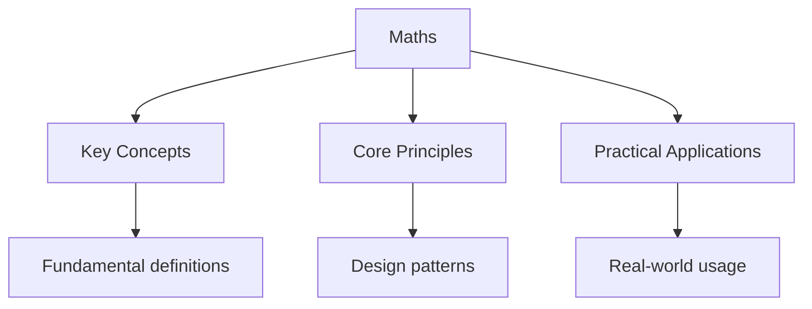

---

title: "Mathematics | A-Level - Wyatt's Notes"
description: "A Level Mathematics is fundamentally a course in . The pure mathematics Syllabus develops the tools of calculus, algebra, and proof that underpin every"
date: 2025-06-02T16:25:28.480Z
tags:
  - Maths
  - ALevel
categories:
  - Maths

---

<!-- Breadcrumb Schema for SEO -->

## A Level Mathematics — Course Overview

A Level Mathematics is fundamentally a course in **mathematical reasoning**. The pure mathematics
Syllabus develops the tools of calculus, algebra, and proof that underpin every quantitative
Discipline. Statistics teaches you to reason under uncertainty. Mechanics teaches you to model the
Physical world with mathematics.

### Board Coverage

| Topic                             | AQA        | Edexcel | OCR (A)    | CIE (9709) |
| --------------------------------- | ---------- | ------- | ---------- | ---------- |
| Pure: Algebra & Functions         | Paper 1    | P1, P2  | Paper 1    | P1, P3     |
| Pure: Coordinate Geometry         | Paper 1    | P1      | Paper 1    | P1         |
| Pure: Sequences & Series          | Paper 1    | P1, P2  | Paper 1    | P1, P3     |
| Pure: Trigonometry                | Paper 1    | P2      | Paper 1    | P1, P2, P3 |
| Pure: Exponentials & Logarithms   | Paper 1    | P1      | Paper 1    | P1, P2     |
| Pure: Calculus                    | Paper 1, 2 | P1, P2  | Paper 1, 2 | P1, P2, P3 |
| Pure: Vectors                     | Paper 2    | P2      | Paper 2    | P3         |
| Pure: Proof                       | Paper 1    | P1      | Paper 1    | P1, P3     |
| Pure: Numerical Methods           | Paper 2    | P2      | Paper 2    | P3         |
| Statistics: Data & Sampling       | Paper 3    | S1      | Paper 3    | S1 (9709)  |
| Statistics: Probability           | Paper 3    | S1      | Paper 3    | S1         |
| Statistics: Distributions         | Paper 3    | S1      | Paper 3    | S1, S2     |
| Statistics: Hypothesis Testing    | Paper 3    | S1      | Paper 3    | S2         |
| Mechanics: Kinematics             | Paper 3    | M1      | Paper 3    | M1         |
| Mechanics: Forces & Newton"s Laws | Paper 3    | M1      | Paper 3    | M1         |
| Mechanics: Moments                | Paper 3    | M1      | Paper 3    | M1         |
| Mechanics: Energy & Work          | Paper 3    | M2      | Paper 3    | M2         |

### Course Structure

#### Pure Mathematics

The pure mathematics core is the backbone of the course. It develops:

- **Algebraic fluency** — manipulation of polynomials, rational functions, partial fractions
- **Calculus** — differentiation and integration as inverse operations, with deep understanding of
  _why_ they work
- **Proof** — rigorous arguments by contradiction, induction, and direct deduction
- **Functions** — domain, range, composition, inverse, transformations
- **Sequences and series** — arithmetic, geometric, and binomial expansions
- **Trigonometry** — identities, equations, and the geometric intuition behind them
- **Exponentials and logarithms** — modelling growth and decay
- **Vectors** — geometric reasoning in 2D and 3D
- **Numerical methods** — when analytical solutions don't exist

#### Statistics

- **Data representation and interpretation** — measures of location, spread, and correlation
- **Probability** — the axiomatic foundations and their consequences
- **Statistical distributions** — binomial, normal, and their properties
- **Hypothesis testing** — the logic of statistical inference

#### Mechanics

- **Kinematics** — describing motion mathematically (SUVAT, calculus-based)
- **Dynamics** — Newton's laws as the foundation of classical mechanics
- **Statics** — equilibrium, resolving forces, moments
- **Energy and momentum** — conservation laws as unifying principles

### Assessment

| Board   | Papers                                              | Weighting       |
| ------- | --------------------------------------------------- | --------------- |
| AQA     | Paper 1 (Pure), Paper 2 (Pure), Paper 3 (Stat/Mech) | 33.3% each      |
| Edexcel | P1, P2, P3 (Pure), S1, M1 (Applied)                 | Varies by route |
| OCR (A) | Paper 1 (Pure), Paper 2 (Pure), Paper 3 (Stat/Mech) | 33.3% each      |
| CIE     | P1, P2, P3 (Pure), M1, S1 (Applied)                 | Varies          |

> **Note:** CIE is a linear qualification. AQA, Edexcel, and OCR (A) are also linear (all exams at
> end of Year 13), though AS stand-alone qualifications exist.

### How to Use These Notes

Follow the sidebar order. Each topic page contains:

1. **Rigorous definitions**. What the concept _is_, precisely
2. **Theorems with proofs**. Why the results hold
3. **Worked examples**. Applying the theory to exam-style problems
4. **Intuition building**. The "why does this make sense?" perspective
5. **Multi-step problem set**. Questions that require chaining multiple concepts
6. **Board-specific notes**. Where specifications diverge

When you have studied all topics, attempt the
to identify your Weakest areas.

## Common Pitfalls

1. Confusing the domain and range of functions, or not considering restrictions (e.g., denominator
   cannot be zero).

2. Misreading the question, particularly with 'hence' vs 'hence or otherwise'. The former requires
   using previous work.

3. Rounding too early in multi-step calculations. Carry full precision through and round only the
   final answer.

4. Dropping negative signs during algebraic manipulation. Substitute back to verify your answer.

### Study Strategy

Build pure maths fluency first — every applied question depends on algebraic and calculus technique.
For statistics, define events and distributions before calculating. For mechanics, always draw a
diagram and state your sign convention. Practise full papers under timed conditions and review every
dropped mark. Use the diagnostic test to identify weak areas and focus revision on topics where
marks are consistently lost.

### Key Formulae

| Topic                | Formula                                                 |
| -------------------- | ------------------------------------------------------- |
| Quadratic formula    | $x = \\frac{-b \\pm \\sqrt{b^2 - 4ac}}{2a}$             |
| Chain rule           | $\\frac{dy}{dx} = \\frac{dy}{du} \\cdot \\frac{du}{dx}$ |
| Integration by parts | $\\int u\\,dv = uv - \\int v\\,du$                      |

## Summary

The key principles covered in this topic are linked in the sub-pages above. Focus on understanding
the definitions, applying the formulas or frameworks, and evaluating strengths and limitations of
each approach.

## Worked Examples

Worked examples demonstrating the application of key concepts are covered in the detailed sub-pages
linked above.

## Cross-References

- **[Pure Mathematics](../maths/flashcards-pure-mathematics):** Maths encompasses pure, applied, and stats
- **[Mechanics](../maths/practice-mechanics):** Mechanics applies maths to physics
- **[Statistics](statistics):** Statistics develops data methods
