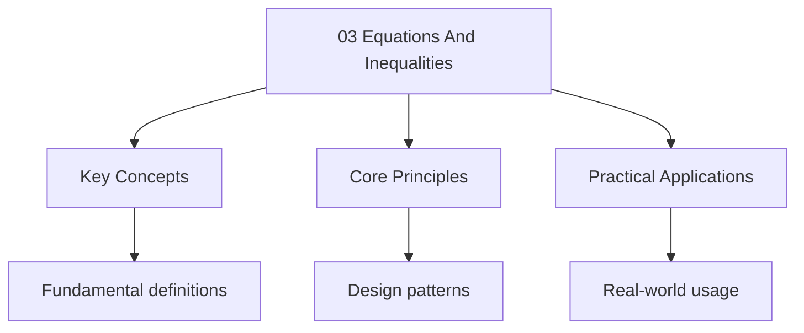

---

title: "Equations and Inequalities | A-Level"
description: "| Board | Paper | Notes | | ---------- | ------- | ------------------------------------------- | | AQA | Paper 1 | Simultaneous equations, inequalities | |"
date: 2025-06-02T16:25:28.480Z
tags:
  - Maths
  - ALevel
categories:
  - Maths

---

<!-- Breadcrumb Schema for SEO -->

## Board Coverage

| Board      | Paper   | Notes                                       |
| ---------- | ------- | ------------------------------------------- |
| AQA        | Paper 1 | Simultaneous equations, inequalities        |
| Edexcel    | P1      | Linear and quadratic simultaneous equations |
| OCR (A)    | Paper 1 | Set notation for solutions                  |
| CIE (9709) | P1      | Simultaneous equations, inequalities        |

## 1. Linear Simultaneous Equations

We consider systems of two equations in two unknowns. The standard methods are substitution and
Elimination.

**Theorem.** The system

$$
\begin{aligned}
A_1 x + b_1 y &= c_1 \\
A_2 x + b_2 y &= c_2
\end{aligned}
$$

Has:

- A **unique solution** if $a_1 b_2 - a_2 b_1 \neq 0$ (the lines are not parallel);
- **No solution** if $a_1 b_2 - a_2 b_1 = 0$ and the equations are inconsistent (parallel distinct
  lines);
- **Infinitely many solutions** if $a_1 b_2 - a_2 b_1 = 0$ and the equations are consistent
  (coincident lines).

_Proof._ By elimination. Multiply the first equation by $b_2$ and the second by $b_1$:

$$
\begin{aligned}
A_1 b_2 x + b_1 b_2 y &= c_1 b_2 \\
A_2 b_1 x + b_1 b_2 y &= c_2 b_1
\end{aligned}
$$

Subtracting: $(a_1 b_2 - a_2 b_1)x = c_1 b_2 - c_2 b_1$.

If $a_1 b_2 - a_2 b_1 \neq 0$We obtain a unique $x$. Similarly for $y$.

If $a_1 b_2 - a_2 b_1 = 0$ Then either $c_1 b_2 - c_2 b_1 = 0$ (infinitely many solutions) or
$c_1 b_2 - c_2 b_1 \neq 0$ (no solution). $\blacksquare$

_Intuition._ The quantity $a_1 b_2 - a_2 b_1$ is the _determinant_ of the coefficient matrix.
Geometrically, two lines in the plane either intersect (unique solution), are parallel but distinct
(no solution), or coincide (infinitely many solutions).

Example

Solve:

$$
\begin{aligned}
3x + 2y &= 12 \quad \mathrm{--- (1)} \\
5x - 3y &= 1 \quad \mathrm{--- (2)}
\end{aligned}
$$

Multiply (1) by 3 and (2) by 2:

$$
\begin{aligned}
9x + 6y &= 36 \\
10x - 6y &= 2
\end{aligned}
$$

Add: $19x = 38$ So $x = 2$.

Substitute into (1): $6 + 2y = 12$ So $y = 3$.

Solution: $x = 2$, $y = 3$.

## 2. Linear-Quadratic Simultaneous Equations

When one equation is linear and the other is quadratic (or of higher degree), we use
**substitution**.

**Method.**

1. From the linear equation, express one variable in terms of the other.
2. Substitute into the quadratic equation.
3. Solve the resulting quadratic.
4. Back-substitute to find both variables.

The discriminant of the resulting quadratic determines the number of intersection points.

Example

Solve:

$$
\begin{aligned}
Y &= 2x - 1 \\
X^2 + y^2 &= 25
\end{aligned}
$$

Substitute $y = 2x - 1$ into $x^2 + y^2 = 25$:

$$
\begin{aligned}
X^2 + (2x - 1)^2 &= 25 \\
X^2 + 4x^2 - 4x + 1 &= 25 \\
5x^2 - 4x - 24 &= 0
\end{aligned}
$$

$$x = \frac{4 \pm \sqrt{16 + 480}}{10} = \frac{4 \pm \sqrt{496}}{10} = \frac{4 \pm 4\sqrt{31}}{10} = \frac{2 \pm 2\sqrt{31}}{5}$$

$\Delta = 496 > 0$ So the line intersects the circle at two points.

> **Tip:** Tip Quadratic in both variables, which is harder to solve.

## 3. Algebraic Inequalities

### 3.1 Linear Inequalities

The rules for manipulating inequalities are the same as for equations, with one crucial exception.

**Theorem (Order-Reversing Property).** If $a < b$ and $c < 0$ Then $ac > bc$.

_Proof._ From $a < b$We have $b - a > 0$. Since $c < 0$ and $b - a > 0$: $c(b - a) < 0$ (product Of
positive and negative). So $cb - ca < 0$Giving $ca > cb$. $\blacksquare$

**Corollary.** Multiplying or dividing both sides of an inequality by a negative number reverses the
Inequality.

:::caution
multiplier before Proceeding.
:::
### 3.2 Quadratic Inequalities

See [Quadratics](02-quadratics), Section 6.

### 3.3 Inequalities Involving Fractions

When an inequality involves fractions, multiply through by the square of the denominator (which is
Always non-negative, so the inequality direction is preserved) or use a sign chart.

Example

Solve $\frac{2x - 1}{x + 3} \geq 1$.

$$
\begin{aligned}
\frac{2x - 1}{x + 3} - 1 &\geq 0 \\
\frac{2x - 1 - (x + 3)}{x + 3} &\geq 0 \\
\frac{x - 4}{x + 3} &\geq 0
\end{aligned}
$$

Critical values: $x = 4$ (zero of numerator) and $x = -3$ (zero of denominator, undefined).

Sign chart:

| Interval     | $x - 4$ | $x + 3$ | Quotient |
| ------------ | ------- | ------- | -------- |
| $x < -3$     | $-$     | $-$     | $+$      |
| $-3 < x < 4$ | $-$     | $+$     | $-$      |
| $x > 4$      | $+$     | $+$     | $+$      |

The quotient is $\geq 0$ when $x < -3$ or $x \geq 4$.

Solution: $x \in (-\infty, -3) \cup [4, \infty)$.

## 4. Graphical Inequalities

### 4.1 Regions Defined by Inequalities

To represent $ax + by + c \geq 0$ graphically:

1. Draw the line $ax + by + c = 0$.
2. Test a point not on the line ( the origin).
3. If the point satisfies the inequality, shade the region containing it.
4. If the point does not satisfy the inequality, shade the other region.
5. Use a **solid line** for $\geq$ or $\leq$ And a **dashed line** for $>$ or $<$.

### 4.2 Systems of Inequalities

When multiple inequalities define a region, the solution is the intersection of all individual
Regions.

Example

Shade the region defined by:

$$
\begin{aligned}
X + y &\leq 6 \\
X &\geq 0 \\
Y &\geq 0 \\
Y &\geq 2x
\end{aligned}
$$

This defines a polygon bounded by the lines $x + y = 6$, $x = 0$, $y = 0$ And $y = 2x$. The Vertices
are $(0, 0)$$(0, 6)$ And the intersection of $x + y = 6$ with $y = 2x$: $3x = 6$ $x = 2$$y = 4$. So
the third vertex is $(2, 4)$.

## 5. Rigorous Treatment of Inequality Manipulation

### 5.1 Transitive Property

If $a < b$ and $b < c$ Then $a < c$.

_Proof._ $b - a > 0$ and $c - b > 0$. Adding: $(c - b) + (b - a) = c - a > 0$. So $a < c$.
$\blacksquare$

### 5.2 Addition Preserves Order

If $a < b$ and $c < d$ Then $a + c < b + d$.

_Proof._ $b - a > 0$ and $d - c > 0$. Adding: $(b - a) + (d - c) = (b + d) - (a + c) > 0$. So
$a + c < b + d$. $\blacksquare$

### 5.3 Multiplication by Positive Preserves Order

If $a < b$ and $c > 0$ Then $ac < bc$.

_Proof._ $b - a > 0$ and $c > 0$. Product: $c(b - a) > 0$ So $cb - ca > 0$Giving $ac < bc$.
$\blacksquare$

### 5.4 Reciprocals Reverse Order (for Positive Numbers)

If $0 < a < b$ Then $\frac{1}{a} > \frac{1}{b}$.

_Proof._ Since $a, b > 0$ and $a < b$: $\frac{1}{a} - \frac{1}{b} = \frac{b - a}{ab}$. Since
$b - a > 0$ and $ab > 0$The result is positive. So $\frac{1}{a} > \frac{1}{b}$. $\blacksquare$

_Intuition._ Consider $a = 2$$b = 4$. Then $\frac{1}{2} > \frac{1}{4}$. The smaller the positive
Number, the larger its reciprocal — like how slicing a cake into more pieces makes each piece
Smaller.

## 6. Polynomial Equations

### 6.1 The Factor Theorem

**Theorem (Factor Theorem).** If $f(a) = 0$ Then $(x - a)$ is a factor of $f(x)$.

_Proof._ By polynomial division, for any polynomial $f(x)$ and constant $a$There exist a quotient
Polynomial $Q(x)$ and a constant remainder $R$ such that:

$$f(x) = (x - a)Q(x) + R$$

Setting $x = a$: $f(a) = (a - a)Q(a) + R = R$.

If $f(a) = 0$ Then $R = 0$ So $f(x) = (x - a)Q(x)$. Hence $(x - a)$ divides $f(x)$ exactly.
$\blacksquare$

### 6.2 The Remainder Theorem

**Theorem (Remainder Theorem).** When a polynomial $f(x)$ is divided by $(x - a)$The remainder
Equals $f(a)$.

_Proof._ From the division identity $f(x) = (x - a)Q(x) + R$Substituting $x = a$ gives $f(a) = R$.
$\blacksquare$

The remainder theorem provides a quick way to evaluate $f(a)$: perform polynomial division of $f(x)$
By $(x - a)$ and read off the constant remainder, avoiding full expansion.

### 6.3 Factorisation Using the Factor Theorem

The systematic approach:

1. Find a root $a$ by testing small integer values (try factors of the constant term).
2. Confirm $(x - a)$ is a factor via $f(a) = 0$.
3. Divide to obtain a quotient of lower degree.
4. Repeat on the quotient until fully factorised.

Example

Fully factorise $f(x) = x^3 - 6x^2 + 11x - 6$.

Test integer values of $f(x)$:

$f(1) = 1 - 6 + 11 - 6 = 0$. So $(x - 1)$ is a factor.

Divide $x^3 - 6x^2 + 11x - 6$ by $(x - 1)$:

$$x^3 - 6x^2 + 11x - 6 = (x - 1)(x^2 - 5x + 6) = (x - 1)(x - 2)(x - 3)$$

Example

Fully factorise $f(x) = 2x^3 + x^2 - 5x + 2$.

By the rational root theorem, possible rational roots are factors of 2 divided by factors of 2:
$\pm 1, \pm 2, \pm \frac{1}{2}$.

$f(1) = 2 + 1 - 5 + 2 = 0$. So $(x - 1)$ is a factor.

Divide by $(x - 1)$:

$$2x^3 + x^2 - 5x + 2 = (x - 1)(2x^2 + 3x - 2)$$

Factorise the quadratic: $2x^2 + 3x - 2 = (2x - 1)(x + 2)$.

So $f(x) = (x - 1)(2x - 1)(x + 2)$.

:::tip
$f(x) = x^n + \cdots + c$The possible rational roots are $\pm 1, \pm 2, \ldots$ (factors of $c$).
:::

## 7. Systems of Three Linear Equations

### 7.1 Gaussian Elimination

For a system of three equations in three unknowns, the elimination method extends :

1. Use the first equation to eliminate one variable from equations 2 and 3.
2. Use the resulting pair of equations (now in two variables) to eliminate a second variable.
3. Back-substitute to recover all three variables.

This process is known as **Gaussian elimination**. It can be systematised using augmented matrices
And three elementary row operations: swapping rows, multiplying a row by a non-zero constant, and
Adding a multiple of one row to another.

A 3x3 system may have a unique solution, no solution, or infinitely many solutions, depending on the
Determinant of the coefficient matrix (analogous to the 2x2 case in Section 1).

### 7.2 Cramer"s Rule for 3x3 Systems

For the system:

$$
\begin{aligned}
A_1 x + b_1 y + c_1 z &= d_1 \\
A_2 x + b_2 y + c_2 z &= d_2 \\
A_3 x + b_3 y + c_3 z &= d_3
\end{aligned}
$$

Define the coefficient determinant:

$$D = \begin{vmatrix} a_1 & b_1 & c_1 \\ a_2 & b_2 & c_2 \\ a_3 & b_3 & c_3 \end{vmatrix}$$

If $D \neq 0$The unique solution is:

$$x = \frac{D_x}{D}, \quad y = \frac{D_y}{D}, \quad z = \frac{D_z}{D}$$

Where $D_x$ is formed by replacing the first column of $D$ with $(d_1, d_2, d_3)^T$$D_y$ by
Replacing the second column, and $D_z$ by replacing the third.

### 7.3 3x3 Determinant Expansion

The determinant of a 3x3 matrix expands along the first row as:

$$\begin{vmatrix} a_1 & b_1 & c_1 \\ a_2 & b_2 & c_2 \\ a_3 & b_3 & c_3 \end{vmatrix} = a_1 \begin{vmatrix} b_2 & c_2 \\ b_3 & c_3 \end{vmatrix} - b_1 \begin{vmatrix} a_2 & c_2 \\ a_3 & c_3 \end{vmatrix} + c_1 \begin{vmatrix} a_2 & b_2 \\ a_3 & b_3 \end{vmatrix}$$

Each 2x2 minor evaluates as $\begin{vmatrix} p & q \\ r & s \end{vmatrix} = ps - qr$.

Worked Example

Solve:

$$
\begin{aligned}
X + 2y - z &= 3 \quad \mathrm{--- (1)} \\
2x - y + z &= 1 \quad \mathrm{--- (2)} \\
X + y + 2z &= 8 \quad \mathrm{--- (3)}
\end{aligned}
$$

**Step 1:** Eliminate $x$ from (2) and (3).

(2) $-$ 2 $\times$ (1): $-5y + 3z = -5$ --- (4)

(3) $-$ (1): $-y + 3z = 5$ --- (5)

**Step 2:** Eliminate $y$ from (5).

(4) $-$ 5 $\times$ (5): $(-5y + 3z) - 5(-y + 3z) = -5 - 25$

$-5y + 3z + 5y - 15z = -30$

$-12z = -30$ So $z = \frac{5}{2}$.

**Step 3:** Back-substitute into (5):

$-y + 3 \cdot \frac{5}{2} = 5 \implies -y + \frac{15}{2} = 5 \implies y = \frac{5}{2}$.

**Step 4:** Back-substitute into (1):

$x + 2 \cdot \frac{5}{2} - \frac{5}{2} = 3 \implies x + \frac{5}{2} = 3 \implies x = \frac{1}{2}$.

Solution: $x = \frac{1}{2}, \; y = \frac{5}{2}, \; z = \frac{5}{2}$.

## 8. Modulus Inequalities

### 8.1 Standard Forms

- $|f(x)| \lt a$ (with $a \gt 0$) is equivalent to $-a \lt f(x) \lt a$.
- $|f(x)| \gt a$ (with $a \gt 0$) is equivalent to $f(x) \lt -a$ or $f(x) \gt a$.
- $|f(x)| \lt g(x)$ requires $g(x) \gt 0$ and is equivalent to $-g(x) \lt f(x) \lt g(x)$.
- $|f(x)| \gt g(x)$ is equivalent to $f(x) \lt -g(x)$ or $f(x) \gt g(x)$.

### 8.2 Methods

Two principal approaches:

1. **Case analysis:** Split into $f(x) \geq 0$ and $f(x) \lt 0$Replacing $|f(x)|$ with $f(x)$ or
   $-f(x)$ respectively. Solve each case and take the union.
2. **Squaring:** Since $|f(x)|^2 = f(x)^2$The inequality $|f(x)| \lt g(x)$ becomes
   $f(x)^2 \lt g(x)^2$ provided $g(x) \geq 0$. This is often cleaner when both sides are
   non-negative.

Example

Solve $|2x - 1| \lt x + 3$.

Since $|2x - 1| \geq 0$We require $x + 3 \gt 0$I.e. $x \gt -3$.

**Case 1:** $2x - 1 \geq 0$I.e. $x \geq \frac{1}{2}$.

Then $|2x - 1| = 2x - 1$ So $2x - 1 \lt x + 3$Giving $x \lt 4$.

Combined with $x \geq \frac{1}{2}$: $\frac{1}{2} \leq x \lt 4$.

**Case 2:** $2x - 1 \lt 0$I.e. $x \lt \frac{1}{2}$.

Then $|2x - 1| = 1 - 2x$ So $1 - 2x \lt x + 3$Giving $-2 \lt 3x$I.e. $x \gt -\frac{2}{3}$.

Combined with $x \lt \frac{1}{2}$: $-\frac{2}{3} \lt x \lt \frac{1}{2}$.

**Solution:** $-\frac{2}{3} \lt x \lt 4$.

Example

Solve $|x^2 - 4| \gt 5$.

**Case 1:** $x^2 - 4 \geq 0$I.e. $|x| \geq 2$.

Then $x^2 - 4 \gt 5$Giving $x^2 \gt 9$ So $x \gt 3$ or $x \lt -3$.

**Case 2:** $x^2 - 4 \lt 0$I.e. $-2 \lt x \lt 2$.

Then $-(x^2 - 4) \gt 5$Giving $4 - x^2 \gt 5$I.e. $x^2 \lt -1$.

No real solution from this case.

**Solution:** $x \lt -3$ or $x \gt 3$.

:::caution
preserves the Direction since $a \lt b$ implies $a^2 \lt b^2$ for $a, b \geq 0$.
:::

## 9. Absolute Value (Modulus) Properties

### 9.1 Squaring Identity

**Proposition.** $|x|^2 = x^2$ for all real $x$.

_Proof._ If $x \geq 0$ Then $|x| = x$ So $|x|^2 = x^2$.

If $x \lt 0$ Then $|x| = -x$ So $|x|^2 = (-x)^2 = x^2$.

In both cases $|x|^2 = x^2$. $\blacksquare$

### 9.2 Multiplicativity of Modulus

**Theorem.** $|ab| = |a||b|$ for all real $a$ and $b$.

_Proof._ Exhaustive case analysis on the signs of $a$ and $b$:

- $a \geq 0, \; b \geq 0$: $|ab| = ab = |a| \cdot |b|$.
- $a \geq 0, \; b \lt 0$: $ab \lt 0$ So $|ab| = -(ab) = a(-b) = |a| \cdot |b|$.
- $a \lt 0, \; b \geq 0$: $ab \lt 0$ So $|ab| = -(ab) = (-a)b = |a| \cdot |b|$.
- $a \lt 0, \; b \lt 0$: $ab \gt 0$ So $|ab| = ab = (-a)(-b) = |a| \cdot |b|$.

In all four cases, $|ab| = |a||b|$. $\blacksquare$

### 9.3 Triangle Inequality

**Theorem (Triangle Inequality).** For all real $a$ and $b$:

$$|a + b| \leq |a| + |b|$$

_Proof._ We split into cases based on the signs of $a$ and $b$.

**Case 1:** $a \geq 0, \; b \geq 0$.

Then $a + b \geq 0$ So $|a + b| = a + b = |a| + |b|$. Equality holds.

**Case 2:** $a \geq 0, \; b \lt 0$.

Sub-case (i): $a + b \geq 0$. Then $|a + b| = a + b$. Since $b \lt 0$ implies $b \lt -b = |b|$:

$$|a + b| = a + b \lt a + |b| = |a| + |b|$$

Sub-case (ii): $a + b \lt 0$. Then $|a + b| = -(a + b) = -a - b$. Since $a \geq 0$ implies
$-a \leq a = |a|$:

$$|a + b| = -a + (-b) = -a + |b| \leq |a| + |b|$$

**Case 3:** $a \lt 0, \; b \geq 0$. Symmetric to Case 2 (swap $a$ and $b$).

**Case 4:** $a \lt 0, \; b \lt 0$.

Then $a + b \lt 0$ So $|a + b| = -(a + b) = (-a) + (-b) = |a| + |b|$. Equality holds.

In all cases, $|a + b| \leq |a| + |b|$. $\blacksquare$

_Intuition._ On the number line, going from the origin to $a + b$ directly covers at most as much
Distance as going from the origin to $a$ and then from $a$ to $a + b$.

## 10. Problem Set

**Problem 1.** Solve the simultaneous equations $3x + y = 13$ and $x^2 + y^2 = 25$.

Solution

From (1): $y = 13 - 3x$. Substitute into (2):

$$
\begin{aligned}
X^2 + (13 - 3x)^2 &= 25 \\
X^2 + 169 - 78x + 9x^2 &= 25 \\
10x^2 - 78x + 144 &= 0 \\
5x^2 - 39x + 72 &= 0
\end{aligned}
$$

$$x = \frac{39 \pm \sqrt{1521 - 1440}}{10} = \frac{39 \pm \sqrt{81}}{10} = \frac{39 \pm 9}{10}$$

$x = \frac{48}{10} = \frac{24}{5}$: $y = 13 - \frac{72}{5} = \frac{65 - 72}{5} = -\frac{7}{5}$.

$x = \frac{30}{10} = 3$: $y = 13 - 9 = 4$.

Solutions: $(3, 4)$ and $\left(\frac{24}{5}, -\frac{7}{5}\right)$.

<b>If you get this wrong, revise:</b> [Linear-quadratic simultaneous equations](#2-linear-quadratic-simultaneous-equations)

**Problem 2.** Solve $\frac{3}{x - 1} > \frac{2}{x + 1}$.

Solution

$$\frac{3}{x - 1} - \frac{2}{x + 1} > 0$$

$$\frac{3(x + 1) - 2(x - 1)}{(x - 1)(x + 1)} > 0$$

$$\frac{3x + 3 - 2x + 2}{(x - 1)(x + 1)} > 0$$

$$\frac{x + 5}{(x - 1)(x + 1)} > 0$$

Critical values: $x = -5, -1, 1$.

Sign chart:

| Interval      | $x + 5$ | $x - 1$ | $x + 1$ | Quotient |
| ------------- | ------- | ------- | ------- | -------- |
| $x < -5$      | $-$     | $-$     | $-$     | $-$      |
| $-5 < x < -1$ | $+$     | $-$     | $-$     | $+$      |
| $-1 < x < 1$  | $+$     | $-$     | $+$     | $-$      |
| $x > 1$       | $+$     | $+$     | $+$     | $+$      |

Solution: $-5 < x < -1$ or $x > 1$.

<b>If you get this wrong, revise:</b> [Inequalities involving fractions](#33-inequalities-involving-fractions)

**Problem 3.** Show that the simultaneous equations $x + 2y = 1$ and $2x + 4y = 3$ have no solution.

Solution

From (1): $x = 1 - 2y$. Substitute into (2):

$$2(1 - 2y) + 4y = 3 \implies 2 - 4y + 4y = 3 \implies 2 = 3$$

This is a contradiction, so there is no solution.

Alternatively: $a_1 b_2 - a_2 b_1 = 1 \times 4 - 2 \times 2 = 0$ So the lines are parallel. Since
$c_1 \cdot 2 \neq c_2 \cdot 1$ ($2 \neq 3$), they are distinct parallel lines.

<b>If you get this wrong, revise:</b> [Linear simultaneous equations](#1-linear-simultaneous-equations)

**Problem 4.** Solve the inequality $x^2 - 2x - 15 \leq 0$.

Solution

$(x - 5)(x + 3) \leq 0$.

The parabola opens upwards. It is $\leq 0$ between and including the roots:

$$-3 \leq x \leq 5$$

<b>If you get this wrong, revise:</b> [Quadratic inequalities](02-quadratics)

**Problem 5.** Solve the inequality $\frac{1}{x} \leq \frac{1}{x - 2}$.

Solution

$$\frac{1}{x} - \frac{1}{x - 2} \leq 0$$

$$\frac{(x - 2) - x}{x(x - 2)} \leq 0$$

$$\frac{-2}{x(x - 2)} \leq 0$$

$$\frac{2}{x(x - 2)} \geq 0$$

Critical values: $x = 0$, $x = 2$.

Sign chart for $x(x - 2)$:

| Interval    | $x$ | $x - 2$ | Product |
| ----------- | --- | ------- | ------- |
| $x < 0$     | $-$ | $-$     | $+$     |
| $0 < x < 2$ | $+$ | $-$     | $-$     |
| $x > 2$     | $+$ | $+$     | $+$     |

So $\frac{2}{x(x-2)} \geq 0$ when $x < 0$ or $x > 2$.

Solution: $x \in (-\infty, 0) \cup (2, \infty)$.

<b>If you get this wrong, revise:</b> [Reciprocals reverse order](#54-reciprocals-reverse-order-for-positive-numbers)

**Problem 6.** Find the vertices of the region defined by $x \geq 0$$y \geq 0$$2x + y \leq 8$ And
$x + 2y \leq 8$.

Solution

Intersection of $2x + y = 8$ and $x + 2y = 8$:

Multiply first by 2: $4x + 2y = 16$. Subtract: $3x = 8$$x = \frac{8}{3}$.

$y = 8 - 2 \cdot \frac{8}{3} = \frac{24 - 16}{3} = \frac{8}{3}$.

Vertices: $(0, 0)$$(4, 0)$$(0, 4)$ And $\left(\frac{8}{3}, \frac{8}{3}\right)$.

<b>If you get this wrong, revise:</b> [Graphical inequalities](#4-graphical-inequalities)

**Problem 7.** Prove that if $a > b > 0$ Then $a^2 > b^2$.

Solution

Since $a > b > 0$We have $a - b > 0$ and $a + b > 0$.

$a^2 - b^2 = (a - b)(a + b)$.

Both factors are positive, so their product is positive: $a^2 - b^2 > 0$Hence $a^2 > b^2$.
$\blacksquare$

<b>If you get this wrong, revise:</b> [Rigorous treatment](#5-rigorous-treatment-of-inequality-manipulation)

**Problem 8.** Solve the inequality $|2x - 3| \leq 5$.

Solution

$|2x - 3| \leq 5$ means $-5 \leq 2x - 3 \leq 5$.

Adding 3: $-2 \leq 2x \leq 8$.

Dividing by 2: $-1 \leq x \leq 4$.

<b>If you get this wrong, revise:</b> [Modulus function](./05-functions)

**Problem 9.** Given that $x^2 + px + q = 0$ has roots $\alpha$ and $\beta$ And $\alpha + \beta = 6$
and $\alpha\beta = 8$Find $p$ and $q$.

Solution

By Viète's formulas (sum and product of roots): $-p = 6$ and $q = 8$.

So $p = -6$$q = 8$.

Verification: $x^2 - 6x + 8 = (x - 2)(x - 4) = 0$Giving roots $2$ and $4$ with sum $6$ and product
$8$. ✓

<b>If you get this wrong, revise:</b> [Quadratics](02-quadratics)

**Problem 10.** Solve $x^4 - 5x^2 + 4 = 0$ by treating it as a quadratic in $x^2$.

Solution

Let $u = x^2$. Then $u^2 - 5u + 4 = 0$.

$(u - 1)(u - 4) = 0$

$u = 1$ or $u = 4$.

$x^2 = 1 \implies x = \pm 1$.

$x^2 = 4 \implies x = \pm 2$.

Solutions: $x = -2, -1, 1, 2$.

<b>If you get this wrong, revise:</b> [Quadratic formula](02-quadratics)

**Problem 11.** Given that $(x - 2)$ is a factor of $f(x) = x^3 + ax^2 + bx - 12$ And $f(1) = -6$
Find $a$ and $b$. Hence fully factorise $f(x)$.

Solution

Since $(x - 2)$ is a factor, $f(2) = 0$ by the factor theorem:

$$f(2) = 8 + 4a + 2b - 12 = 4a + 2b - 4 = 0 \implies 2a + b = 2 \quad \mathrm{--- (i)}$$

Also $f(1) = -6$:

$$f(1) = 1 + a + b - 12 = a + b - 11 = -6 \implies a + b = 5 \quad \mathrm{--- (ii)}$$

Subtracting (i) from (ii): $-a = 3$ So $a = -3$.

From (ii): $b = 5 - (-3) = 8$.

So $f(x) = x^3 - 3x^2 + 8x - 12$.

Divide by $(x - 2)$: $f(x) = (x - 2)(x^2 - x + 6)$.

The discriminant of $x^2 - x + 6$ is $\Delta = 1 - 24 = -23 \lt 0$ So no further real factorisation
Is possible.

$$f(x) = (x - 2)(x^2 - x + 6)$$

<b>If you get this wrong, revise:</b> [Polynomial equations](#6-polynomial-equations)

**Problem 12.** Solve the system of equations:

$$
\begin{aligned}
X + y + z &= 6 \\
2x - y + z &= 3 \\
X + 2y - z &= 5
\end{aligned}
$$

Solution

**Step 1:** Eliminate $z$.

(2) $-$ (1): $x - 2y = -3$ --- (4)

(1) $+$ (3): $2x + 3y = 11$ --- (5)

**Step 2:** Solve (4) and (5) simultaneously.

From (4): $x = 2y - 3$. Substitute into (5):

$$2(2y - 3) + 3y = 11 \implies 7y - 6 = 11 \implies y = \frac{17}{7}$$

$$x = 2 \cdot \frac{17}{7} - 3 = \frac{34 - 21}{7} = \frac{13}{7}$$

**Step 3:** Find $z$ from (1):

$$z = 6 - x - y = 6 - \frac{13}{7} - \frac{17}{7} = \frac{42 - 30}{7} = \frac{12}{7}$$

Solution: $x = \frac{13}{7}, \; y = \frac{17}{7}, \; z = \frac{12}{7}$.

<b>If you get this wrong, revise:</b> [Systems of three linear equations](#7-systems-of-three-linear-equations)

**Problem 13.** Solve $|x^2 - 3x + 1| \geq 2$.

Solution

**Case 1:** $x^2 - 3x + 1 \geq 0$I.e. $x \leq \frac{3 - \sqrt{5}}{2}$ or $x \geq \frac{3 + \sqrt{5}}{2}$.

Then $x^2 - 3x + 1 \geq 2$Giving $x^2 - 3x - 1 \geq 0$.

Roots: $x = \frac{3 \pm \sqrt{13}}{2}$.

So $x \leq \frac{3 - \sqrt{13}}{2}$ or $x \geq \frac{3 + \sqrt{13}}{2}$.

Since $\sqrt{13} \gt \sqrt{5}$The condition $x^2 - 3x + 1 \geq 0$ is automatically satisfied by
These ranges.

**Case 2:** $x^2 - 3x + 1 \lt 0$I.e.
$\frac{3 - \sqrt{5}}{2} \lt x \lt \frac{3 + \sqrt{5}}{2}$.

Then $-(x^2 - 3x + 1) \geq 2$Giving $x^2 - 3x + 3 \leq 0$.

Discriminant: $\Delta = 9 - 12 = -3 \lt 0$. Since the parabola opens upward, $x^2 - 3x + 3 \gt 0$
For all real $x$. No solution from this case.

**Solution:** $x \leq \frac{3 - \sqrt{13}}{2}$ or
$x \geq \frac{3 + \sqrt{13}}{2}$.

<b>If you get this wrong, revise:</b> [Modulus inequalities](#8-modulus-inequalities)

**Problem 14.** Find the area of the region defined by $x \geq 0$$y \geq 0$$3x + 2y \leq 12$ And
$x + y \geq 3$.

Solution

The region is bounded by four lines. Find the vertices:

- $(0, 3)$: intersection of $x = 0$ and $x + y = 3$.
- $(0, 6)$: intersection of $x = 0$ and $3x + 2y = 12$.
- $(4, 0)$: intersection of $y = 0$ and $3x + 2y = 12$.
- $(3, 0)$: intersection of $y = 0$ and $x + y = 3$.

The region is a trapezoid. Using the shoelace formula with vertices $(0, 3), (0, 6), (4, 0), (3, 0)$
In order:

$$\mathrm{Area} = \frac{1}{2}\left| \sum_{i} x_i y_{i+1} - \sum_{i} y_i x_{i+1} \right|$$

$$= \frac{1}{2}\left| (0 \cdot 6 + 0 \cdot 0 + 4 \cdot 0 + 3 \cdot 3) - (3 \cdot 0 + 6 \cdot 4 + 0 \cdot 3 + 0 \cdot 0) \right|$$

$$= \frac{1}{2}\left| 9 - 24 \right| = \frac{15}{2}$$

<b>If you get this wrong, revise:</b> [Graphical inequalities](#4-graphical-inequalities)

**Problem 15.** Solve the simultaneous equations $x^2 + xy = 10$ and $y^2 + xy = 15$.

Solution

**Key insight:** add and subtract the equations.

Adding: $x^2 + 2xy + y^2 = 25$ So $(x + y)^2 = 25$.

This gives $x + y = 5$ or $x + y = -5$.

Subtracting: $y^2 - x^2 = 5$ So $(y - x)(y + x) = 5$.

**Case 1:** $x + y = 5$.

Then $(y - x)(5) = 5$Giving $y - x = 1$.

From $x + y = 5$ and $y - x = 1$: adding gives $2y = 6$ So $y = 3$, $x = 2$.

**Case 2:** $x + y = -5$.

Then $(y - x)(-5) = 5$Giving $y - x = -1$.

From $x + y = -5$ and $y - x = -1$: adding gives $2y = -6$ So $y = -3$, $x = -2$.

**Verification:** $(2, 3)$: $4 + 6 = 10$ ✓ and $9 + 6 = 15$ ✓.

$(-2, -3)$: $4 + 6 = 10$ ✓ and $9 + 6 = 15$ ✓.

Solutions: $(2, 3)$ and $(-2, -3)$.

<b>If you get this wrong, revise:</b> [Simultaneous equations](#1-linear-simultaneous-equations)

---

<!-- Breadcrumb Schema for SEO -->

:::tip
hardest questions within the A-Level specification for this topic, each with a full worked solution.

**Unit tests** probe edge cases and common misconceptions. **Integration tests** combine Equations
and Inequalities with other pure mathematics topics to test synthesis under exam conditions.

See for instructions on self-marking and
building a personal test matrix.
:::
## Common Pitfalls

1. Confusing the domain and range of functions, or not considering restrictions (e.g., denominator
   cannot be zero).

2. Forgetting the $+c$ constant of integration in indefinite integrals, or misusing boundary
   conditions in definite integrals.

3. Rounding too early in multi-step calculations. Carry full precision through and round only the
   final answer.

4. Incorrectly applying integration by parts by choosing $u$ and $\frac{dv}{dx}$ the wrong way
   around.

## Cross-References

- [Algebraic Expressions](01-algebraic-expressions) — Factorisation and the factor theorem are used to solve polynomial equations in this topic.
- [Quadratics](02-quadratics) — Quadratic inequalities and the discriminant extend the quadratic equations covered there.
- [Coordinates and Geometry](04-coordinates-and-geometry) — Graphical inequalities and intersection of lines and circles apply coordinate geometry techniques.
- [Proof](13-proof) — The rigorous proofs of inequality properties connect to the proof methods developed in the proof topic.
