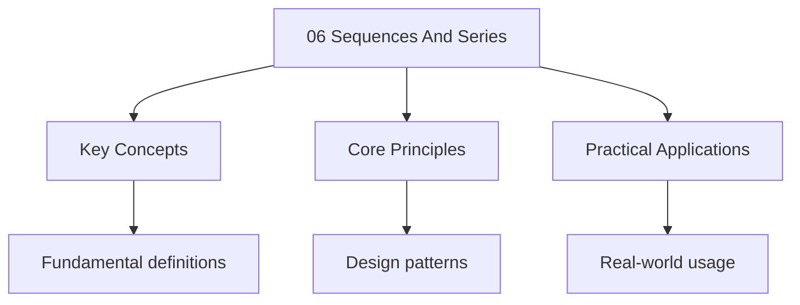

---

title: "Sequences and Series | A-Level"
description: "| Board | Paper | Notes | | ---------- | ---------- | -------------------------------------------------------------------- | | AQA | Paper 1, 2 | Arithmetic"
date: 2025-06-02T16:25:28.480Z
tags:
  - Maths
  - ALevel
categories:
  - Maths

---

<!-- Breadcrumb Schema for SEO -->

## Board Coverage

| Board      | Paper      | Notes                                                                |
| ---------- | ---------- | -------------------------------------------------------------------- |
| AQA        | Paper 1, 2 | Arithmetic and geometric sequences, sigma notation                   |
| Edexcel    | P1, P2     | Same; recurrence relations in P2                                     |
| OCR (A)    | Paper 1    | Arithmetic and geometric progressions                                |
| CIE (9709) | P1, P3     | Sequences and series; P3 includes $\Sigma$ notation more extensively |

## 1. Sequences and Series: Definitions

**Definition.** A _sequence_ is an ordered list of numbers $(a_1, a_2, a_3, \ldots)$. We write
$(a_n)_{n=1}^{\infty}$ or $(a_n)$.

**Definition.** A _series_ is the sum of the terms of a sequence:
$\sum_{n=1}^{N} a_n = a_1 + a_2 + \cdots + a_N$.

**Definition.** A sequence defined by $a_{n+1} = f(a_n)$ with an initial value $a_1$ is a
_recurrence relation_ (or _iterative sequence_).

## 2. Arithmetic Sequences

**Definition.** An _arithmetic sequence_ (arithmetic progression, AP) is a sequence where each term
Differs from the previous by a constant $d$ (the _common difference_):

$$a_{n+1} = a_n + d$$

### 2.1 The $n$Th Term

**Theorem.** The $n$Th term of an arithmetic sequence with first term $a$ and common difference $d$
Is:

$$a_n = a + (n - 1)d$$

_Proof._ By induction on $n$.

Base case ($n = 1$): $a_1 = a + 0 \cdot d = a$. ✓

Inductive step: Assume $a_k = a + (k - 1)d$. Then:

$$a_{k+1} = a_k + d = a + (k - 1)d + d = a + kd$$

This matches the formula for $n = k + 1$. $\blacksquare$

### 2.2 Sum of an Arithmetic Series

**Theorem.** The sum of the first $n$ terms of an arithmetic sequence is:

$$S_n = \frac{n}{2}(2a + (n - 1)d) = \frac{n}{2}(a + \ell)$$

Where $\ell = a_n = a + (n - 1)d$ is the last term.

_Proof (Pairing Method)._ Write out the sum twice, once forwards and once backwards:

$$
\begin{aligned}
S_n &= a + (a + d) + (a + 2d) + \cdots + (a + (n-1)d) \\
S_n &= (a + (n-1)d) + (a + (n-2)d) + \cdots + a
\end{aligned}
$$

Adding vertically, each pair sums to $2a + (n-1)d$ And there are $n$ such pairs:

$$2S_n = n(2a + (n - 1)d)$$

$$S_n = \frac{n}{2}(2a + (n - 1)d) \quad \blacksquare$$

_Intuition._ Gauss supposedly used this method as a child to sum $1 + 2 + \cdots + 100 = 5050$. Pair
The first and last, second and second-to-last, etc. Each pair sums to the same value.

Example

Find the sum of the first 20 terms of $3, 7, 11, 15, \ldots$

Here $a = 3$, $d = 4$, $n = 20$.

$$S_{20} = \frac{20}{2}(2 \times 3 + 19 \times 4) = 10(6 + 76) = 10 \times 82 = 820$$

## 3. Geometric Sequences

**Definition.** A _geometric sequence_ (geometric progression, GP) is a sequence where each term is
A constant multiple $r$ (the _common ratio_) of the previous term:

$$a_{n+1} = a_n \cdot r$$

### 3.1 The $n$Th Term

**Theorem.** The $n$Th term of a geometric sequence with first term $a$ and common ratio $r$ is:

$$a_n = ar^{n-1}$$

_Proof._ By induction.

Base case: $a_1 = ar^0 = a$. ✓

Inductive step: $a_{k+1} = a_k \cdot r = ar^{k-1} \cdot r = ar^k$. ✓ $\blacksquare$

### 3.2 Sum of a Finite Geometric Series

**Theorem.** For $r \neq 1$:

$$S_n = a\frac{1 - r^n}{1 - r} = a\frac{r^n - 1}{r - 1}$$

_Proof._ Write:

$$
\begin{aligned}
S_n &= a + ar + ar^2 + \cdots + ar^{n-1} \\
RS_n &= ar + ar^2 + ar^3 + \cdots + ar^n
\end{aligned}
$$

Subtracting: $S_n - rS_n = a - ar^n$

$$S_n(1 - r) = a(1 - r^n)$$

$$S_n = \frac{a(1 - r^n)}{1 - r} \quad \blacksquare$$

_Intuition (Self-Similarity)._ Multiplying the sum by $r$ shifts every term one position to the
Right. The original sum and the shifted sum overlap almost completely — the difference is just the
First term minus the new last term. This "shift and subtract" idea is the same principle behind many
Iterative algorithms.

### 3.3 Sum to Infinity

**Theorem.** If $|r| < 1$The infinite geometric series converges, and:

$$S_\infty = \sum_{n=1}^{\infty} ar^{n-1} = \frac{a}{1 - r}$$

_Proof._ From $S_n = \frac{a(1 - r^n)}{1 - r}$We take the limit as $n \to \infty$.

Since $|r| < 1$We have $\lim_{n \to \infty} r^n = 0$ (a standard limit; see below).

$$S_\infty = \lim_{n \to \infty} S_n = \frac{a(1 - 0)}{1 - r} = \frac{a}{1 - r} \quad \blacksquare$$

**Lemma.** If $|r| < 1$ Then $\lim_{n \to \infty} r^n = 0$.

_Proof._ Write $r^n = e^{n \ln|r|}$. Since $|r| < 1$We have $\ln|r| < 0$. As $n \to \infty$
$n \ln|r| \to -\infty$ So $e^{n \ln|r|} \to 0$. $\blacksquare$

**Theorem.** If $|r| \geq 1$The geometric series $\sum_{n=1}^{\infty} ar^{n-1}$ diverges.

_Proof._ If $|r| > 1$ Then $|r^n| \to \infty$ So $|a_n| \to \infty$. Since the terms don"t tend to
Zero, the series diverges by the divergence test.

If $r = 1$: $S_n = na \to \pm\infty$ (unless $a = 0$).

If $r = -1$: $S_n = a - a + a - a + \cdots$Which oscillates and does not converge. $\blacksquare$

:::caution
Formula when $|r| \geq 1$Which gives nonsense.
:::

Example

Find the sum to infinity of $1 + \frac{1}{2} + \frac{1}{4} + \frac{1}{8} + \cdots$

Here $a = 1$$r = \frac{1}{2}$$|r| < 1$.

$$S_\infty = \frac{1}{1 - \frac{1}{2}} = 2$$

## 4. Sigma Notation

**Definition.** $\sum_{k=1}^{n} a_k = a_1 + a_2 + \cdots + a_n$.

**Properties:**

$$
\begin{aligned}
\sum_{k=1}^{n} (a_k + b_k) &= \sum_{k=1}^{n} a_k + \sum_{k=1}^{n} b_k \\
\sum_{k=1}^{n} ca_k &= c\sum_{k=1}^{n} a_k
\end{aligned}
$$

### 4.1 Standard Sums

$$
\begin{aligned}
\sum_{k=1}^{n} k &= \frac{n(n+1)}{2} \\
\sum_{k=1}^{n} k^2 &= \frac{n(n+1)(2n+1)}{6} \\
\sum_{k=1}^{n} k^3 &= \frac{n^2(n+1)^2}{4}
\end{aligned}
$$

_Proof of $\sum_{k=1}^{n} k = \frac{n(n+1)}{2}$._ This is the arithmetic series with $a = 1$
$d = 1$, $n$ terms. By the formula: $S_n = \frac{n}{2}(2 + (n-1)) = \frac{n(n+1)}{2}$.
$\blacksquare$

## 5. Recurrence Relations

A _recurrence relation_ defines each term in terms of previous terms. A recurrence relation of order
$k$ requires $k$ initial conditions.

**Example.** $u_{n+1} = 2u_n + 3$, $u_1 = 1$.

$u_2 = 2(1) + 3 = 5$$u_3 = 2(5) + 3 = 13$$u_4 = 2(13) + 3 = 29$...

**Periodic sequences.** If $u_{n+1} = f(u_n)$ and the sequence returns to a previous value, it
Becomes periodic.

**Example.** $u_{n+1} = \frac{1}{u_n}$$u_1 = 2$.

$u_2 = \frac{1}{2}$$u_3 = 2$$u_4 = \frac{1}{2}$... This is periodic with period 2.

## 6. Arithmetic Mean and Geometric Mean

**Definition.** The _arithmetic mean_ (AM) of two positive numbers $a$ and $b$ is $\frac{a+b}{2}$.
The _geometric mean_ (GM) is $\sqrt{ab}$.

**Theorem (AM-GM Inequality).** For any positive real numbers $a, b$:

$$\frac{a + b}{2} \geq \sqrt{ab}$$

Equality holds if and only if $a = b$.

_Proof._ Since $a, b \gt 0$Both $\sqrt{a}$ and $\sqrt{b}$ are real numbers. For any real number
$x$We have $x^2 \geq 0$. In particular:

$$(\sqrt{a} - \sqrt{b})^2 \geq 0$$

Expanding:

$$a - 2\sqrt{a}\sqrt{b} + b \geq 0$$

$$a + b \geq 2\sqrt{ab}$$

$$\frac{a + b}{2} \geq \sqrt{ab} \quad \blacksquare$$

_Equality condition._ $(\sqrt{a} - \sqrt{b})^2 = 0$ if and only if $\sqrt{a} = \sqrt{b}$I.e.,
$a = b$.

**Extension.** For $n$ positive real numbers $x_1, x_2, \ldots, x_n$:

$$\frac{x_1 + x_2 + \cdots + x_n}{n} \geq \sqrt[n]{x_1 x_2 \cdots x_n}$$

With equality if and only if $x_1 = x_2 = \cdots = x_n$. The proof of the general case (by induction
Using the two-variable result as the base) is beyond A-level scope.

Example

Find the minimum value of $x + \frac{4}{x}$ for $x \gt 0$.

By AM-GM with $a = x$ and $b = \frac{4}{x}$ (both positive):

$$\frac{x + \frac{4}{x}}{2} \geq \sqrt{x \cdot \frac{4}{x}} = \sqrt{4} = 2$$

So $x + \frac{4}{x} \geq 4$.

Equality when $x = \frac{4}{x}$I.e., $x^2 = 4$ So $x = 2$ (since $x \gt 0$).

Minimum value is 4, achieved at $x = 2$.

## 7. Sigma Notation — Method of Differences

**Definition.** A _telescoping sum_ is a series where most terms cancel when written out, leaving
Only a few terms at the beginning and end.

**Key Idea.** If we can express the general term $u_k$ as a difference $f(k) - f(k+1)$ Then:

$$\sum_{k=1}^{n} u_k = \sum_{k=1}^{n} [f(k) - f(k+1)] = f(1) - f(n+1)$$

This is because the sum expands as $[f(1) - f(2)] + [f(2) - f(3)] + \cdots + [f(n) - f(n+1)]$ And All
intermediate terms cancel.

### 7.1 Partial Fractions as the Decomposition Tool

The most common technique is to use partial fractions to decompose a rational term into a
Difference.

Example

Evaluate $\sum_{k=1}^{n} \frac{1}{k(k+1)}$.

Using partial fractions:

$$\frac{1}{k(k+1)} = \frac{A}{k} + \frac{B}{k+1}$$

$$1 = A(k+1) + Bk$$

Setting $k = 0$: $A = 1$. Setting $k = -1$: $B = -1$.

So $\frac{1}{k(k+1)} = \frac{1}{k} - \frac{1}{k+1}$.

Therefore:

$$\sum_{k=1}^{n} \frac{1}{k(k+1)} = \sum_{k=1}^{n} \left(\frac{1}{k} - \frac{1}{k+1}\right)$$

$$= \left(1 - \frac{1}{2}\right) + \left(\frac{1}{2} - \frac{1}{3}\right) + \cdots + \left(\frac{1}{n} - \frac{1}{n+1}\right)$$

$$= 1 - \frac{1}{n+1} = \frac{n}{n+1}$$

Example

Evaluate $\sum_{k=1}^{n} \frac{1}{k(k+2)}$.

Using partial fractions:

$$\frac{1}{k(k+2)} = \frac{A}{k} + \frac{B}{k+2}$$

$$1 = A(k+2) + Bk$$

$k = 0$: $A = \frac{1}{2}$. $k = -2$: $B = -\frac{1}{2}$.

So $\frac{1}{k(k+2)} = \frac{1}{2}\left(\frac{1}{k} - \frac{1}{k+2}\right)$.

$$\sum_{k=1}^{n} \frac{1}{k(k+2)} = \frac{1}{2}\sum_{k=1}^{n}\left(\frac{1}{k} - \frac{1}{k+2}\right)$$

Writing out terms:

$$= \frac{1}{2}\left[\left(1 - \frac{1}{3}\right) + \left(\frac{1}{2} - \frac{1}{4}\right) + \left(\frac{1}{3} - \frac{1}{5}\right) + \cdots + \left(\frac{1}{n} - \frac{1}{n+2}\right)\right]$$

The terms $-\frac{1}{3}$ and $+\frac{1}{3}$ cancel, $-\frac{1}{4}$ and $+\frac{1}{4}$ cancel, etc.
The surviving terms are $1$ and $\frac{1}{2}$ from the start, with $-\frac{1}{n+1}$ and
$-\frac{1}{n+2}$ at the end:

$$= \frac{1}{2}\left(1 + \frac{1}{2} - \frac{1}{n+1} - \frac{1}{n+2}\right) = \frac{1}{2}\left(\frac{3}{2} - \frac{2n + 3}{(n+1)(n+2)}\right)$$

$$= \frac{3}{4} - \frac{2n + 3}{2(n+1)(n+2)}$$

:::tip
Identify the cancellation pattern before simplifying. Be especially careful when the "gap" in the
Denominator is larger than 1 (e.g., $k(k+2)$), as not all terms cancel in a simple pairwise fashion.
:::

## 8. Arithmetic-Geometric Sequences

**Definition.** An _arithmetic-geometric sequence_ has terms of the form:

$$a, \; (a+d)r, \; (a+2d)r^2, \; \ldots$$

Each term is the product of a term from an arithmetic progression ($a, a+d, a+2d, \ldots$) and a
Term from a geometric progression ($1, r, r^2, \ldots$).

**Theorem.** The $n$Th term is:

$$u_n = (a + (n-1)d)\,r^{n-1}$$

Where $a$ is the first term of the AP part, $d$ is the common difference, and $r$ is the common
Ratio of the GP part.

### 8.1 Sum of an Arithmetic-Geometric Series

**Theorem.** For $r \neq 1$:

$$S_n = \frac{a - [a + (n-1)d]\,r^n}{1 - r} + \frac{dr(1 - r^{n-1})}{(1-r)^2}$$

_Proof._ Write out $S_n$ and $rS_n$ Then subtract:

$$
\begin{aligned}
S_n &= a + (a+d)r + (a+2d)r^2 + \cdots + [a+(n-1)d]\,r^{n-1} \\
RS_n &= ar + (a+d)r^2 + (a+2d)r^3 + \cdots + [a+(n-1)d]\,r^n
\end{aligned}
$$

Subtracting:

$$S_n - rS_n = a + dr + dr^2 + \cdots + dr^{n-1} - [a+(n-1)d]\,r^n$$

$$S_n(1-r) = a + d(r + r^2 + \cdots + r^{n-1}) - [a+(n-1)d]\,r^n$$

The bracketed geometric series sums to $\frac{r(1 - r^{n-1})}{1 - r}$:

$$S_n(1-r) = a + \frac{dr(1 - r^{n-1})}{1-r} - [a+(n-1)d]\,r^n$$

$$S_n = \frac{a - [a+(n-1)d]\,r^n}{1-r} + \frac{dr(1 - r^{n-1})}{(1-r)^2} \quad \blacksquare$$

### 8.2 Sum to Infinity

When $|r| \lt 1$Both $r^n \to 0$ and $r^{n-1} \to 0$ as $n \to \infty$:

$$S_\infty = \frac{a}{1 - r} + \frac{dr}{(1-r)^2}$$

Example

A salary is 30000 in year 1 and increases by 1500 each year. Due to inflation, each year's salary is discounted by a factor of 0.9 when expressed in present-value terms. Find the total present value of all future salary payments.

The sequence of discounted salaries is an arithmetic-geometric sequence:

- AP part: $a = 30000$$d = 1500$
- GP part: $r = 0.9$

Since $|r| \lt 1$:

$$S_\infty = \frac{30000}{1 - 0.9} + \frac{1500 \times 0.9}{(1 - 0.9)^2}$$

$$= \frac{30000}{0.1} + \frac{1350}{0.01}$$

$$= 300000 + 135000 = 435000$$

The total present value is 435000.

## 9. Proof of Sum Formulas

### 9.1 Proof of $\sum_{k=1}^{n} k^2 = \frac{n(n+1)(2n+1)}{6}$

_Proof by induction._

Base case ($n = 1$): LHS $= 1$. RHS $= \frac{1 \times 2 \times 3}{6} = 1$. ✓

Inductive step: Assume $\displaystyle\sum_{k=1}^{n} k^2 = \frac{n(n+1)(2n+1)}{6}$ for some
$n \geq 1$.

Then:

$$
\begin{aligned}
\sum_{k=1}^{n+1} k^2 &= \frac{n(n+1)(2n+1)}{6} + (n+1)^2 \\
&= \frac{n(n+1)(2n+1) + 6(n+1)^2}{6} \\
&= \frac{(n+1)\bigl[n(2n+1) + 6(n+1)\bigr]}{6} \\
&= \frac{(n+1)(2n^2 + 7n + 6)}{6} \\
&= \frac{(n+1)(n+2)(2n+3)}{6}
\end{aligned}
$$

This equals $\frac{(n+1)\bigl((n+1)+1\bigr)\bigl(2(n+1)+1\bigr)}{6}$Which is the formula
for $n+1$. ✓ $\blacksquare$

### 9.2 Proof of $\sum_{k=1}^{n} k^3 = \left[\frac{n(n+1)}{2}\right]^2$

_Proof by induction._

Base case ($n = 1$): LHS $= 1$. RHS $= \left[\frac{1 \times 2}{2}\right]^2 = 1$. ✓

Inductive step: Assume $\displaystyle\sum_{k=1}^{n} k^3 = \left[\frac{n(n+1)}{2}\right]^2$.

Then:

$$
\begin{aligned}
\sum_{k=1}^{n+1} k^3 &= \left[\frac{n(n+1)}{2}\right]^2 + (n+1)^3 \\
&= \frac{n^2(n+1)^2}{4} + (n+1)^3 \\
&= \frac{n^2(n+1)^2 + 4(n+1)^3}{4} \\
&= \frac{(n+1)^2\bigl(n^2 + 4(n+1)\bigr)}{4} \\
&= \frac{(n+1)^2(n^2 + 4n + 4)}{4} \\
&= \frac{(n+1)^2(n+2)^2}{4} \\
&= \left[\frac{(n+1)(n+2)}{2}\right]^2
\end{aligned}
$$

This is the formula for $n+1$. ✓ $\blacksquare$

### 9.3 Connection: $(\sum k)^2 = \sum k^3$

Notice that:

$$\left(\sum_{k=1}^{n} k\right)^2 = \left[\frac{n(n+1)}{2}\right]^2 = \sum_{k=1}^{n} k^3$$

This is a remarkable identity: the square of the sum of the first $n$ positive integers equals the
Sum of the first $n$ cubes.

_Pattern observation._ Check for small values of $n$:

$n = 1$: $(1)^2 = 1 = 1^3$ ✓

$n = 2$: $(1+2)^2 = 9 = 1 + 8 = 1^3 + 2^3$ ✓

$n = 3$: $(1+2+3)^2 = 36 = 1 + 8 + 27 = 1^3 + 2^3 + 3^3$ ✓

This can also be visualised geometrically: a square of side $\frac{n(n+1)}{2}$ can be decomposed
Into nested gnomons (L-shaped regions) that correspond to $1^3, 2^3, \ldots, n^3$.

## 10. Problem Set

**Problem 1.** The 5th term of an arithmetic sequence is 17 and the 12th term is 38. Find the first
Term and the common difference.

Solution

$$a + 4d = 17 \quad \mathrm{--- (1)}$$
$$a + 11d = 38 \quad \mathrm{--- (2)}$$

(2) - (1): $7d = 21 \implies d = 3$.

$a = 17 - 12 = 5$.

<b>If you get this wrong, revise:</b> [Arithmetic sequences](#2-arithmetic-sequences)

**Problem 2.** Evaluate $\sum_{k=1}^{50} (3k - 1)$.

Solution

This is an arithmetic series with first term $a = 2$Last term $\ell = 3(50) - 1 = 149$, $n = 50$.

$$S = \frac{50}{2}(2 + 149) = 25 \times 151 = 3775$$

<b>If you get this wrong, revise:</b> [Sigma notation](#4-sigma-notation)

**Problem 3.** A geometric series has first term 5 and sum to infinity 25. Find the common ratio.

Solution

$$S_\infty = \frac{a}{1 - r} = 25$$

$$\frac{5}{1 - r} = 25 \implies 1 - r = \frac{1}{5} \implies r = \frac{4}{5}$$

<b>If you get this wrong, revise:</b> [Sum to infinity](#33-sum-to-infinity)

**Problem 4.** Find the sum of the first 10 terms of the geometric series $2 - 6 + 18 - 54 + \cdots$

Solution

$a = 2$$r = -3$$n = 10$.

$$S_{10} = \frac{2(1 - (-3)^{10})}{1 - (-3)} = \frac{2(1 - 59049)}{4} = \frac{2(-59048)}{4} = -29524$$

<b>If you get this wrong, revise:</b> [Sum of finite geometric series](#32-sum-of-a-finite-geometric-series)

**Problem 5.** Show that $\sum_{k=1}^{n} (4k + 1) = n(2n + 3)$.

Solution

$$
\begin{aligned}
\sum_{k=1}^{n} (4k + 1) &= 4\sum_{k=1}^{n} k + \sum_{k=1}^{n} 1 \\
&= 4 \cdot \frac{n(n+1)}{2} + n \\
&= 2n(n+1) + n \\
&= 2n^2 + 2n + n \\
&= 2n^2 + 3n \\
&= n(2n + 3) \quad \blacksquare
\end{aligned}
$$

<b>If you get this wrong, revise:</b> [Sigma notation](#4-sigma-notation)

**Problem 6.** Given $u_1 = 3$ and $u_{n+1} = \frac{u_n + 1}{u_n - 1}$Find $u_2$, $u_3$, $u_4$ And
$u_5$. Comment on the sequence.

Solution

$u_2 = \frac{3 + 1}{3 - 1} = 2$

$u_3 = \frac{2 + 1}{2 - 1} = 3$

$u_4 = \frac{3 + 1}{3 - 1} = 2$

$u_5 = \frac{2 + 1}{2 - 1} = 3$

The sequence is periodic: $3, 2, 3, 2, 3, 2, \ldots$ with period 2.

<b>If you get this wrong, revise:</b> [Recurrence relations](#5-recurrence-relations)

**Problem 7.** The first three terms of a geometric sequence are $x, x + 4, x + 12$. Find $x$ and
The common ratio.

Solution

$$\frac{x + 4}{x} = \frac{x + 12}{x + 4}$$

$$(x + 4)^2 = x(x + 12)$$

$$x^2 + 8x + 16 = x^2 + 12x$$

$$4x = 16 \implies x = 4$$

The sequence is $4, 8, 16, \ldots$ with $r = 2$.

<b>If you get this wrong, revise:</b> [Geometric sequences](#3-geometric-sequences)

**Problem 8.** A ball is dropped from a height of 10 m. Each bounce reaches 80% of the previous
Height. Find the total distance travelled before the ball comes to rest.

Solution

The ball falls 10 m, then rises $10 \times 0.8 = 8$ m, falls 8 m, rises $8 \times 0.8 = 6.4$ m, etc.

Total distance = $10 + 2(8 + 6.4 + 5.12 + \cdots)$.

The bracketed series is geometric with $a = 8$, $r = 0.8$.

$$S_\infty = \frac{8}{1 - 0.8} = \frac{8}{0.2} = 40$$

Total distance = $10 + 2 \times 40 = 90$ m.

<b>If you get this wrong, revise:</b> [Sum to infinity](#33-sum-to-infinity)

**Problem 9.** Find the least value of $n$ such that the sum of the first $n$ terms of
$3 + 6 + 12 + 24 + \cdots$ exceeds 10000.

Solution

$a = 3$, $r = 2$.

$$S_n = \frac{3(2^n - 1)}{2 - 1} = 3(2^n - 1) > 10000$$

$$2^n - 1 > \frac{10000}{3} \implies 2^n > \frac{10003}{3} \approx 3334.33$$

$$n > \log_2(3334.33) \approx 11.7$$

So $n = 12$.

Check: $S_{11} = 3(2048 - 1) = 6141 < 10000$.

$S_{12} = 3(4096 - 1) = 12285 > 10000$. ✓

<b>If you get this wrong, revise:</b> [Sum of finite geometric series](#32-sum-of-a-finite-geometric-series)

**Problem 10.** Prove that $\sum_{k=1}^{n} k(k+1) = \frac{n(n+1)(n+2)}{3}$.

Solution

By induction.

Base case ($n = 1$): LHS $= 1 \times 2 = 2$. RHS $= \frac{1 \times 2 \times 3}{3} = 2$.
✓

Inductive step: Assume $\sum_{k=1}^{n} k(k+1) = \frac{n(n+1)(n+2)}{3}$.

Then:

$$
\begin{aligned}
\sum_{k=1}^{n+1} k(k+1) &= \frac{n(n+1)(n+2)}{3} + (n+1)(n+2) \\
&= \frac{n(n+1)(n+2) + 3(n+1)(n+2)}{3} \\
&= \frac{(n+1)(n+2)(n + 3)}{3} \\
&= \frac{(n+1)((n+1)+1)((n+1)+2)}{3}
\end{aligned}
$$

This is the formula for $n + 1$. ✓ $\blacksquare$

<b>If you get this wrong, revise:</b> [Proof by induction](./13-proof.md)

**Problem 11.** Given that $x \gt 0$Find the minimum value of $x^2 + \frac{9}{x^2}$ and state The
value of $x$ at which it occurs.

Solution

By AM-GM with $a = x^2$ and $b = \frac{9}{x^2}$ (both positive since $x \gt 0$):

$$\frac{x^2 + \frac{9}{x^2}}{2} \geq \sqrt{x^2 \cdot \frac{9}{x^2}} = \sqrt{9} = 3$$

So $x^2 + \frac{9}{x^2} \geq 6$.

Equality when $x^2 = \frac{9}{x^2}$I.e., $x^4 = 9$ So $x^2 = 3$Giving $x = \sqrt{3}$ (positive Root).

Minimum value is 6, achieved at $x = \sqrt{3}$.

<b>If you get this wrong, revise:</b> [AM-GM inequality](#6-arithmetic-mean-and-geometric-mean)

**Problem 12.** Evaluate $\sum_{k=1}^{n} \frac{2}{(k+1)(k+3)}$ using the method of differences.

Solution

Using partial fractions:

$$\frac{2}{(k+1)(k+3)} = \frac{A}{k+1} + \frac{B}{k+3}$$

$$2 = A(k+3) + B(k+1)$$

$k = -3$: $B = -1$. $k = -1$: $A = 1$.

So $\frac{2}{(k+1)(k+3)} = \frac{1}{k+1} - \frac{1}{k+3}$.

$$\sum_{k=1}^{n} \frac{2}{(k+1)(k+3)} = \sum_{k=1}^{n} \left(\frac{1}{k+1} - \frac{1}{k+3}\right)$$

Writing out terms:

$$= \left(\frac{1}{2} - \frac{1}{4}\right) + \left(\frac{1}{3} - \frac{1}{5}\right) + \left(\frac{1}{4} - \frac{1}{6}\right) + \cdots + \left(\frac{1}{n+1} - \frac{1}{n+3}\right)$$

After cancellation, surviving terms:

$$= \frac{1}{2} + \frac{1}{3} - \frac{1}{n+2} - \frac{1}{n+3} = \frac{5}{6} - \frac{2n + 5}{(n+2)(n+3)}$$

<b>If you get this wrong, revise:</b> [Method of differences](#7-sigma-notation--method-of-differences)

**Problem 13.** Find the sum to infinity of the arithmetic-geometric series whose terms are
$1, \; 4 \times \tfrac{1}{2}, \; 7 \times \tfrac{1}{4}, \; 10 \times \tfrac{1}{8}, \; \ldots$

Solution

Identify the components:
- AP part: first term $a = 1$Common difference $d = 3$ (since $4 - 1 = 3$, $7 - 4 = 3$Etc.)
- GP part: common ratio $r = \frac{1}{2}$

Since $|r| \lt 1$The sum to infinity converges:

$$S_\infty = \frac{a}{1 - r} + \frac{dr}{(1-r)^2}$$

$$= \frac{1}{1 - \frac{1}{2}} + \frac{3 \times \frac{1}{2}}{\left(1 - \frac{1}{2}\right)^2}$$

$$= \frac{1}{\frac{1}{2}} + \frac{\frac{3}{2}}{\frac{1}{4}}$$

$$= 2 + 6 = 8$$

<b>If you get this wrong, revise:</b> [Arithmetic-geometric sequences](#8-arithmetic-geometric-sequences)

**Problem 14.** Find $\sum_{k=1}^{n} k(k-1)$ in closed form, and verify your answer for $n = 4$.

Solution

$$
\begin{aligned}
\sum_{k=1}^{n} k(k-1) &= \sum_{k=1}^{n} (k^2 - k) \\
&= \sum_{k=1}^{n} k^2 - \sum_{k=1}^{n} k \\
&= \frac{n(n+1)(2n+1)}{6} - \frac{n(n+1)}{2} \\
&= \frac{n(n+1)}{6}\bigl[(2n+1) - 3\bigr] \\
&= \frac{n(n+1)(2n - 2)}{6} \\
&= \frac{n(n+1)(n-1)}{3}
\end{aligned}
$$

Verification for $n = 4$: $1 \times 0 + 2 \times 1 + 3 \times 2 + 4 \times 3 = 0 + 2 + 6 + 12 = 20$.

Formula: $\frac{4 \times 5 \times 3}{3} = 20$. ✓

<b>If you get this wrong, revise:</b> [Sigma notation](#4-sigma-notation)

**Problem 15.** A sequence satisfies $u_{n+1} = 3u_n + 2$ with $u_1 = 1$. Find a closed-form
Expression for $u_n$ and verify it for $n = 1, 2, 3$.

Solution

This is a first-order linear recurrence relation. We solve it by finding the equilibrium and subtracting.

At equilibrium, $u = 3u + 2$Giving $-2u = 2$ So $u = -1$.

Define $v_n = u_n - (-1) = u_n + 1$. Then:

$$v_{n+1} = u_{n+1} + 1 = 3u_n + 2 + 1 = 3u_n + 3 = 3(u_n + 1) = 3v_n$$

So $v_n$ is a geometric sequence with ratio 3. Since $v_1 = u_1 + 1 = 2$:

$$v_n = 2 \cdot 3^{n-1}$$

Therefore:

$$u_n = 2 \cdot 3^{n-1} - 1$$

Verification:

- $n = 1$: $u_1 = 2 \cdot 1 - 1 = 1$ ✓
- $n = 2$: $u_2 = 2 \cdot 3 - 1 = 5$. Check: $3(1) + 2 = 5$ ✓
- $n = 3$: $u_3 = 2 \cdot 9 - 1 = 17$. Check: $3(5) + 2 = 17$ ✓

<b>If you get this wrong, revise:</b> [Recurrence relations](#5-recurrence-relations)

---

<!-- Breadcrumb Schema for SEO -->

:::tip
questions within the A-Level specification for this topic, each with a full worked solution.

**Unit tests** probe edge cases and common misconceptions. **Integration tests** combine Sequences
and Series with other pure mathematics topics to test synthesis under exam conditions.

See for instructions on self-marking and
building a personal test matrix.

## Common Pitfalls

1. Losing marks by not showing sufficient working. Always write out each step, especially in proof
   questions.

2. Forgetting to check that solutions satisfy the original equation (especially with squaring both
   sides or dividing by variables).

3. Dropping negative signs during algebraic manipulation. Substitute back to verify your answer.

4. Forgetting the $+c$ constant of integration in indefinite integrals, or misusing boundary
   conditions in definite integrals.

## Cross-References

- [Algebraic Expressions](01-algebraic-expressions.md) — Algebraic manipulation and partial fractions are essential for the method of differences.
- [Proof](13-proof.md) — Mathematical induction is used to prove the sum formulas for arithmetic and geometric series.
- [Functions](05-functions.md) — Exponential and logarithmic functions arise in the analysis of geometric series convergence.
- [Equations and Inequalities](03-equations-and-inequalities.md) — Solving equations for unknown parameters in sequences draws on the equation-solving methods developed here.
:::
