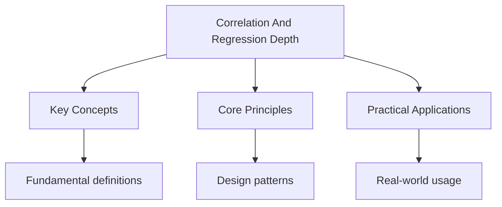

---

title: Correlation and Regression (Extended)
description: "This document covers scatter diagrams, the product moment correlation coefficient, Spearman' s rank Correlation, least squares regression, and residual analy"
date: 2026-04-23T00:00:00.000Z
tags: [Mathematics, ALevel]
categories: [Mathematics]

---

<!-- Breadcrumb Schema for SEO -->

## Correlation and Regression (Extended Treatment)

This document covers scatter diagrams, the product moment correlation coefficient, Spearman's rank
Correlation, least squares regression, and residual analysis.

:::note
it Does not capture non-linear relationships. Always plot your data before interpreting correlation
Values.
:::

## 1. Scatter Diagrams

### 1.1 Interpretation

A **scatter diagram** (scatter plot) displays pairs of values $(x_i, y_i)$ as points on a Coordinate
grid. Visual inspection reveals:

- The **direction** of association (positive, negative, or none).
- The **strength** of association (strong, moderate, weak).
- The **shape** of the relationship (linear, curved, clustered).
- The presence of **outliers**.

### 1.2 Types of correlation

| Pattern        | Description                                 |
| -------------- | ------------------------------------------- |
| Strong +       | Points lie close to an upward-sloping line  |
| Moderate +     | General upward trend with more scatter      |
| Weak +         | Slight upward tendency, much scatter        |
| No correlation | No discernible pattern                      |
| Strong -       | Points lie close to a downward-sloping line |
| Non-linear     | Clear pattern but not a straight line       |

### 1.3 Outliers

An **outlier** is a data point that lies far from the general pattern. Outliers can:

- Be genuine extreme values.
- Result from measurement errors.
- Significantly affect the correlation coefficient and regression line.

:::caution
coefficient. Always examine Your scatter diagram before relying on numerical measures.
:::

## 2. Product Moment Correlation Coefficient (PMCC)

### 2.1 Definition

The **product moment correlation coefficient** (also called Pearson's correlation coefficient) For a
sample of $n$ pairs $(x_i, y_i)$ is:

$$r = \frac{S_{xy}}{\sqrt{S_{xx}\,S_{yy}}}$$

Where:

$$S_{xy} = \sum(x_i - \bar{x})(y_i - \bar{y}) = \sum x_i y_i - n\bar{x}\bar{y}$$

$$S_{xx} = \sum(x_i - \bar{x})^2 = \sum x_i^2 - n\bar{x}^2$$

$$S_{yy} = \sum(y_i - \bar{y})^2 = \sum y_i^2 - n\bar{y}^2$$

### 2.2 Properties

- $-1 \leq r \leq 1$.
- $r = 1$: perfect positive linear correlation.
- $r = -1$: perfect negative linear correlation.
- $r = 0$: no linear correlation (but there may be a non-linear relationship).
- $r$ is independent of the units of measurement.
- $r$ is unchanged if both variables are transformed linearly ($x' = ax + b$, $y' = cy + d$ with
  $a, c \gt 0$).

### 2.3 Proof that $|r| \leq 1$

**Proof.** By the Cauchy-Schwarz inequality:

$$\left(\sum a_i b_i\right)^2 \leq \left(\sum a_i^2\right)\!\left(\sum b_i^2\right)$$

Setting $a_i = x_i - \bar{x}$ and $b_i = y_i - \bar{y}$:

$$S_{xy}^2 \leq S_{xx}\,S_{yy}$$

$$r^2 = \frac{S_{xy}^2}{S_{xx}\,S_{yy}} \leq 1 \implies |r| \leq 1 \quad \blacksquare$$

### 2.4 Worked example

**Problem.** Find the PMCC for the following data:

| $x$ | 2   | 4   | 6   | 8   | 10  |
| --- | --- | --- | --- | --- | --- |
| $y$ | 3   | 5   | 4   | 7   | 9   |

$n = 5$$\bar{x} = 6$$\bar{y} = 5.6$.

$\sum x_i y_i = 6 + 20 + 24 + 56 + 90 = 196$

$S_{xy} = 196 - 5(6)(5.6) = 196 - 168 = 28$

$\sum x_i^2 = 4 + 16 + 36 + 64 + 100 = 220$$S_{xx} = 220 - 5(36) = 40$

$\sum y_i^2 = 9 + 25 + 16 + 49 + 81 = 180$$S_{yy} = 180 - 5(31.36) = 180 - 156.8 = 23.2$

$$r = \frac{28}{\sqrt{40 \times 23.2}} = \frac{28}{\sqrt{928}} = \frac{28}{30.46} \approx 0.919$$

This indicates strong positive linear correlation.

### 2.5 Coding data

When data values are large, coding simplifies calculations. Use $u = \dfrac{x - a}{c}$ and
$v = \dfrac{y - b}{d}$ where $a, b$ are shift values and $c, d$ are scaling values.

The PMCC is unchanged by coding: $r_{xy} = r_{uv}$.

## 3. Spearman's Rank Correlation Coefficient

### 3.1 Definition

**Spearman's rank correlation coefficient** $r_s$ measures the strength of the **monotonic**
Relationship between two variables:

$$r_s = 1 - \frac{6\sum d_i^2}{n(n^2 - 1)}$$

Where $d_i = \mathrm{rank}(x_i) - \mathrm{rank}(y_i)$ is the difference in ranks for the $i$-th
pair.

### 3.2 When to use Spearman's rank

- Data is ordinal (ranked categories).
- The relationship is monotonic but not necessarily linear.
- There are significant outliers that would distort the PMCC.
- The data contains tied ranks.

### 3.3 Handling tied ranks

When values are tied, assign the **average rank** to all tied values. For example, if two values Are
tied for ranks 3 and 4, both receive rank 3.5.

When ties exist, the simplified formula is only approximate. A more accurate formula uses:

$$r_s = \frac{S_{xy}}{\sqrt{S_{xx}\,S_{yy}}}$$

Applied to the rank data.

### 3.4 Worked example

**Problem.** Two judges rank 6 competitors:

| Competitor | A   | B   | C   | D   | E   | F   |
| ---------- | --- | --- | --- | --- | --- | --- |
| Judge 1    | 1   | 3   | 2   | 5   | 4   | 6   |
| Judge 2    | 2   | 1   | 3   | 6   | 5   | 4   |

| $d_i$ | -1  | 2   | -1  | -1  | -1  | 2   |
| ----- | --- | --- | --- | --- | --- | --- |

$\sum d_i^2 = 1 + 4 + 1 + 1 + 1 + 4 = 12$

$$r_s = 1 - \frac{6 \times 12}{6(35)} = 1 - \frac{72}{210} = 1 - 0.343 = 0.657$$

This indicates moderate positive agreement between the judges.

### 3.5 Worked example with ties

**Problem.** Find $r_s$ for the following data:

| $x$ | 10  | 20  | 20  | 30  | 40  |
| --- | --- | --- | --- | --- | --- |
| $y$ | 5   | 8   | 12  | 15  | 20  |

Ranks of $x$: 1, 2.5, 2.5, 4, 5 (tied at 20).

Ranks of $y$: 1, 2, 3, 4, 5.

$d_i$: 0, 0.5, -0.5, 0, 0.

$\sum d_i^2 = 0 + 0.25 + 0.25 + 0 + 0 = 0.5$

$$r_s = 1 - \frac{6 \times 0.5}{5 \times 24} = 1 - \frac{3}{120} = 1 - 0.025 = 0.975$$

Very strong positive monotonic relationship.

## 4. Least Squares Regression

### 4.1 The regression line of $y$ on $x$

The **least squares regression line** of $y$ on $x$ is the line $y = a + bx$ that minimises the Sum
of squared residuals:

$$S = \sum_{i=1}^{n}(y_i - a - bx_i)^2$$

Setting $\dfrac{\partial S}{\partial a} = 0$ and
$\dfrac{\partial S}{\partial b} = 0$:

$$b = \frac{S_{xy}}{S_{xx}} = \frac{\sum(x_i - \bar{x})(y_i - \bar{y})}{\sum(x_i - \bar{x})^2}$$

$$a = \bar{y} - b\bar{x}$$

**Key property:** The regression line always passes through the point $(\bar{x}, \bar{y})$.

### 4.2 Derivation of the normal equations

$$\frac{\partial S}{\partial a} = -2\sum(y_i - a - bx_i) = 0 \implies na + b\sum x_i = \sum y_i$$

$$\frac{\partial S}{\partial b} = -2\sum x_i(y_i - a - bx_i) = 0 \implies a\sum x_i + b\sum x_i^2 = \sum x_i y_i$$

These are the **normal equations**. Dividing the first by $n$ gives $\bar{y} = a + b\bar{x}$
Confirming the line passes through the mean point.

### 4.3 Worked example

Using the data from Section 2.4:

$b = \dfrac{S_{xy}}{S_{xx}} = \dfrac{28}{40} = 0.7$

$a = \bar{y} - b\bar{x} = 5.6 - 0.7(6) = 5.6 - 4.2 = 1.4$

$$y = 1.4 + 0.7x$$

To predict $y$ when $x = 7$: $y = 1.4 + 4.9 = 6.3$.

### 4.4 The regression line of $x$ on $y$

The regression line of $x$ on $y$ (used when predicting $x$ from $y$) is:

$$x = \bar{x} + \frac{S_{xy}}{S_{yy}}(y - \bar{y})$$

**Important:** The two regression lines are different unless $|r| = 1$. The line of $y$ on $x$
Minimises vertical residuals; the line of $x$ on $y$ minimises horizontal residuals.

### 4.5 Restrictions on using regression

1. **Interpolation** (predicting within the data range) is generally reliable.
2. **Extrapolation** (predicting outside the data range) is unreliable -- the relationship may not
   hold.
3. The regression line assumes a **linear** relationship.
4. The model assumes the residuals are independent and normally distributed with constant variance
   (homoscedasticity).

:::caution
vice versa. Use the appropriate regression line for the direction of prediction.

## 5. Residuals

### 5.1 Definition

A **residual** for the $i$-th data point is the difference between the observed value and the
Predicted value:

$$e_i = y_i - \hat{y}_i = y_i - (a + bx_i)$$

### 5.2 Properties of residuals

1. $\sum e_i = 0$ (the residuals sum to zero).
2. $\sum x_i e_i = 0$ (residuals are uncorrelated with $x$).
3. The mean of the residuals is zero.

### 5.3 Residual analysis

Plotting residuals against $x$ (or against $\hat{y}$) reveals:

- **Random scatter** around zero: the linear model is appropriate.
- **Curved pattern:** a non-linear model would be better.
- **Funnel shape:** the variance is not constant (heteroscedasticity).
- **Large outliers:** individual points with unusually large residuals.

### 5.4 Worked example: residual calculation

Using the data and regression line $y = 1.4 + 0.7x$ from Section 4.3:

| $x$ | $y$ | $\hat{y}$ | Residual $e$ |
| --- | --- | --------- | ------------ |
| 2   | 3   | 2.8       | 0.2          |
| 4   | 5   | 4.2       | 0.8          |
| 6   | 4   | 5.6       | -1.6         |
| 8   | 7   | 7.0       | 0.0          |
| 10  | 9   | 8.4       | 0.6          |

Check: $\sum e = 0.2 + 0.8 - 1.6 + 0 + 0.6 = 0$.

The residual at $x = 6$ is relatively large ($-1.6$), suggesting this point deviates most from The
linear model.

## 6. Practice Problems

### Problem 1

Find the PMCC for the data: (1, 2), (2, 3), (3, 5), (4, 4), (5, 7), (6, 8).

Solution

$n = 6$$\bar{x} = 3.5$$\bar{y} = 4.833$.

$S_{xx} = 1 + 0.25 + 0.25 + 0.25 + 2.25 + 6.25 = 17.5$.

$S_{yy} = 7.36 + 3.36 + 0.028 + 0.694 + 4.694 + 10.03 = 26.17$.

$S_{xy} = (1 - 3.5)(2 - 4.833) + \ldots = (-2.5)(-2.833) + (-1.5)(-1.833) + (-0.5)(0.167) + (0.5)(-0.833) + (1.5)(2.167) + (2.5)(3.167)$

$= 7.083 + 2.750 - 0.083 - 0.417 + 3.250 + 7.917 = 20.5$

$r = \dfrac{20.5}{\sqrt{17.5 \times 26.17}} = \dfrac{20.5}{\sqrt{457.98}} = \dfrac{20.5}{21.40} \approx 0.958$

### Problem 2

Find the equation of the regression line of $y$ on $x$ for the data in Problem 1, and predict $y$
When $x = 7$.

Solution

$b = \dfrac{20.5}{17.5} = 1.171$$a = 4.833 - 1.171(3.5) = 4.833 - 4.100 = 0.734$.

$y = 0.734 + 1.171x$.

When $x = 7$: $y = 0.734 + 8.200 = 8.934 \approx 8.9$.

### Problem 3

Two teachers rank 8 students by exam performance. Calculate Spearman's rank correlation coefficient.

| Student   | A   | B   | C   | D   | E   | F   | G   | H   |
| --------- | --- | --- | --- | --- | --- | --- | --- | --- |
| Teacher 1 | 1   | 2   | 3   | 4   | 5   | 6   | 7   | 8   |
| Teacher 2 | 3   | 1   | 4   | 2   | 6   | 5   | 8   | 7   |

Solution

$d_i$: -2, 1, -1, 2, -1, 1, -1, 1.

$\sum d_i^2 = 4 + 1 + 1 + 4 + 1 + 1 + 1 + 1 = 14$.

$r_s = 1 - \dfrac{6 \times 14}{8 \times 63} = 1 - \dfrac{84}{504} = 1 - 0.1667 = 0.833$.

## Common Pitfalls

1. Losing marks by not showing sufficient working. Always write out each step, especially in proof
   questions.

2. Forgetting to check that solutions satisfy the original equation (especially with squaring both
   sides or dividing by variables).

3. Misreading the question, particularly with 'hence' vs 'hence or otherwise'. The former requires
   using previous work.

4. Incorrectly applying integration by parts by choosing $u$ and $\frac{dv}{dx}$ the wrong way
   around.

## Worked Examples

### Example 1: PMCC and Regression Line

**Problem.** Given the data:

| $x$ | 1   | 2   | 3   | 4   | 5   |
| --- | --- | --- | --- | --- | --- |
| $y$ | 3   | 5   | 6   | 8   | 11  |

Calculate the PMCC and the equation of the regression line of $y$ on $x$.

**Solution.** $n = 5$, $\bar{x} = 3$, $\bar{y} = 6.6$.

$\sum x_i y_i = 3 + 10 + 18 + 32 + 55 = 118$. $S_{xy} = 118 - 5(3)(6.6) = 118 - 99 = 19$.

$\sum x_i^2 = 1 + 4 + 9 + 16 + 25 = 55$. $S_{xx} = 55 - 5(9) = 10$.

$\sum y_i^2 = 9 + 25 + 36 + 64 + 121 = 255$. $S_{yy} = 255 - 5(43.56) = 255 - 217.8 = 37.2$.

$$r = \frac{19}{\sqrt{10 \times 37.2}} = \frac{19}{19.29} \approx 0.985$$

Regression: $b = \frac{19}{10} = 1.9$, $a = 6.6 - 1.9(3) = 0.9$.

$$y = 0.9 + 1.9x$$

$\blacksquare$

### Example 2: Spearman's Rank with Ties

**Problem.** Two judges score 5 contestants:

| Contestant | A   | B   | C   | D   | E   |
| ---------- | --- | --- | --- | --- | --- |
| Judge 1    | 7   | 9   | 5   | 9   | 3   |
| Judge 2    | 6   | 8   | 7   | 10  | 4   |

Calculate Spearman's rank correlation coefficient.

**Solution.** Judge 1 ranks: B and D tied at $\frac{3+4}{2} = 3.5$, so A=2, B=3.5, C=1, D=3.5, E=0
(not possible). Actually: scores sorted: 3(E), 5(C), 7(A), 9(B), 9(D).

Ranks: E=1, C=2, A=3, B=4.5, D=4.5.

Judge 2 ranks: E=1, A=2, C=3, B=4, D=5.

| $d_i$ | A   | B   | C   | D    | E   |
| ----- | --- | --- | --- | ---- | --- |
|       | 1   | 0.5 | -1  | -0.5 | 0   |

$\sum d_i^2 = 1 + 0.25 + 1 + 0.25 + 0 = 2.5$.

$$r_s = 1 - \frac{6 \times 2.5}{5 \times 24} = 1 - \frac{15}{120} = 1 - 0.125 = 0.875$$

$\blacksquare$

## Summary

- PMCC: $r = \frac{S_{xy}}{\sqrt{S_{xx} S_{yy}}}$ measures linear correlation; $-1 \leq r \leq 1$.
- Regression line of $y$ on $x$: $y = a + bx$ where $b = \frac{S_{xy}}{S_{xx}}$,
  $a = \bar{y} - b\bar{x}$.
- Spearman's rank: $r_s = 1 - \frac{6\sum d_i^2}{n(n^2-1)}$ measures monotonic correlation.
- Residuals: $e_i = y_i - \hat{y}_i$; random scatter confirms linearity, curved pattern suggests
  non-linearity.
- Correlation does not imply causation; always inspect scatter diagrams before interpreting $r$.
:::

## Intuition

Mathematics provides the language for describing patterns, relationships, and change. Functions transform inputs to outputs like machines, calculus measures how things change and accumulate, and probability quantifies uncertainty. The power of mathematics lies in its ability to model real-world situations abstractly, allowing us to solve problems and make predictions across science, engineering, and everyday life.

## Cross-References

- [Algebra](../../../../../../sat/src/content/docs/mathematics/algebra)
- [Calculus](../../../../../../hsc/src/content/docs/mathematics/calculus)
- [Statistics](../../further-maths/flashcards-further-statistics)
- [Trigonometry](../pure-mathematics/08-trigonometry)
