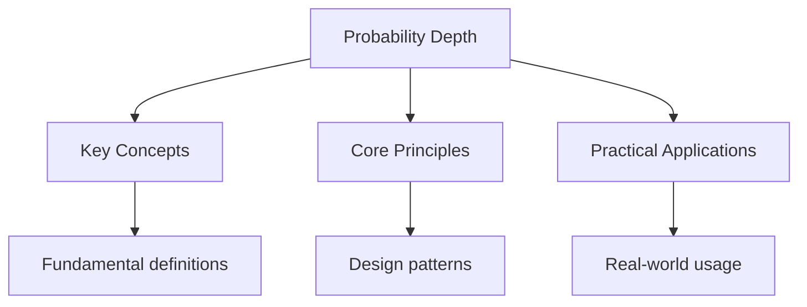

---

title: "Probability (Extended) | A-Level"
description: "This document extends the core probability material with rigorous treatments of conditional Probability, independence, Venn diagrams, tree diagrams, and"
date: 2026-04-23T00:00:00.000Z
tags: [Mathematics, ALevel]
categories: [Mathematics]

---

<!-- Breadcrumb Schema for SEO -->

## Probability (Extended Treatment)

This document extends the core probability material with rigorous treatments of conditional
Probability, independence, Venn diagrams, tree diagrams, and Bayes" theorem.

:::note
events Explicitly before writing any equations.
:::

## 1. Conditional Probability

### 1.1 Definition

The **conditional probability** of event $A$ given that event $B$ has occurred is:

$$P(A \mid B) = \frac{P(A \cap B)}{P(B)}$$

Provided $P(B) \gt 0$.

**Interpretation.** $P(A \mid B)$ is the probability of $A$ within the "reduced sample space" $B$.

### 1.2 Multiplication rule

For any two events $A$ and $B$:

$$P(A \cap B) = P(A) \cdot P(B \mid A) = P(B) \cdot P(A \mid B)$$

**Extension to three events:**

$$P(A \cap B \cap C) = P(A) \cdot P(B \mid A) \cdot P(C \mid A \cap B)$$

### 1.3 Worked example

**Problem.** A bag contains 5 red and 3 blue balls. Two balls are drawn without replacement. Find
The probability that both are red.

Let $R_1$ = "first ball is red", $R_2$ = "second ball is red".

$$P(R_1 \cap R_2) = P(R_1) \cdot P(R_2 \mid R_1) = \frac{5}{8} \times \frac{4}{7} = \frac{20}{56} = \frac{5}{14}$$

### 1.4 The Law of Total Probability

If $\{B_1, B_2, \ldots, B_n\}$ is a partition of the sample space (mutually exclusive and
exhaustive), Then for any event $A$:

$$\boxed{P(A) = \sum_{i=1}^{n} P(A \mid B_i)\,P(B_i)}$$

**Proof.** Since the $B_i$ partition $\Omega$:

$$A = A \cap \Omega = A \cap \!\left(\bigcup_{i=1}^n B_i\right) = \bigcup_{i=1}^n (A \cap B_i)$$

The sets $A \cap B_i$ are mutually exclusive, so:

$$P(A) = \sum_{i=1}^n P(A \cap B_i) = \sum_{i=1}^n P(A \mid B_i)\,P(B_i) \quad \blacksquare$$

### 1.5 Worked example: law of total probability

**Problem.** In a factory, Machine $A$ produces 60% of items and Machine $B$ produces 40%. Machine
$A$ has a defect rate of 2% and Machine $B$ has a defect rate of 5%. Find the probability that a
Randomly selected item is defective.

Let $D$ = "item is defective".

$$P(D) = P(D \mid A)\,P(A) + P(D \mid B)\,P(B) = 0.02 \times 0.6 + 0.05 \times 0.4 = 0.012 + 0.020 = 0.032$$

## 2. Bayes' Theorem

### 2.1 Statement

**Bayes' Theorem.** For events $A$ and $B$ with $P(B) \gt 0$:

$$\boxed{P(A \mid B) = \frac{P(B \mid A)\,P(A)}{P(B)}}$$

Using the law of total probability in the denominator, for a partition $\{A_1, \ldots, A_n\}$:

$$P(A_i \mid B) = \frac{P(B \mid A_i)\,P(A_i)}{\sum_{j=1}^{n} P(B \mid A_j)\,P(A_j)}$$

### 2.2 Proof

$$P(A \mid B) = \frac{P(A \cap B)}{P(B)} = \frac{P(B \mid A)\,P(A)}{P(B)}$$

The first step is the definition of conditional probability. The second step applies the
Multiplication rule to the numerator. $\blacksquare$

### 2.3 Worked example

**Problem.** A disease affects 1% of a population. A test for the disease has a 95% true positive
Rate ($P(\mathrm{positive} \mid \mathrm{disease}) = 0.95$) and a 10% false positive rate
($P(\mathrm{positive} \mid \mathrm{no\ disease}) = 0.10$). If a person tests positive, what is the
Probability they actually have the disease?

Let $D$ = "has disease", $T^+$ = "tests positive".

$$P(D \mid T^+) = \frac{P(T^+ \mid D)\,P(D)}{P(T^+ \mid D)\,P(D) + P(T^+ \mid D')\,P(D')}$$

$$= \frac{0.95 \times 0.01}{0.95 \times 0.01 + 0.10 \times 0.99} = \frac{0.0095}{0.0095 + 0.099} = \frac{0.0095}{0.1085} \approx 0.0876$$

So even with a positive test, there is only about an 8.8% chance of having the disease.

:::caution
false positives far Exceeds the number of true positives. This is the **base rate fallacy** --
ignoring the prior Probability of the condition.
:::
### 2.4 Worked example: factory with three machines

**Problem.** A factory has three machines producing bolts. Machine 1 produces 50%, Machine 2
produces 30%, and Machine 3 produces 20%. Defect rates are 1%, 2%, and 3% respectively. A bolt is
found to Be defective. What is the probability it came from Machine 3?

$$P(M_3 \mid D) = \frac{P(D \mid M_3)\,P(M_3)}{P(D \mid M_1)\,P(M_1) + P(D \mid M_2)\,P(M_2) + P(D \mid M_3)\,P(M_3)}$$

$$= \frac{0.03 \times 0.20}{0.01 \times 0.50 + 0.02 \times 0.30 + 0.03 \times 0.20}$$

$$= \frac{0.006}{0.005 + 0.006 + 0.006} = \frac{0.006}{0.017} \approx 0.353$$

## 3. Venn Diagrams

### 3.1 Notation and regions

For two events $A$ and $B$The Venn diagram has four regions:

| Region       | Description            | Probability          |
| ------------ | ---------------------- | -------------------- |
| $A \cap B$   | In both $A$ and $B$    | $P(A \cap B)$        |
| $A \cap B'$  | In $A$ but not in $B$  | $P(A) - P(A \cap B)$ |
| $A' \cap B$  | In $B$ but not in $A$  | $P(B) - P(A \cap B)$ |
| $A' \cap B'$ | In neither $A$ nor $B$ | $1 - P(A \cup B)$    |

### 3.2 Worked example

**Problem.** In a group of 100 students, 45 study Maths, 30 study Physics, and 15 study both. A
Student is chosen at random. Find: (a) the probability they study at least one subject; (b) the
Probability they study Maths given they study Physics.

$$P(M) = 0.45, \quad P(P) = 0.30, \quad P(M \cap P) = 0.15$$

(a) $P(M \cup P) = 0.45 + 0.30 - 0.15 = 0.60$

(b) $P(M \mid P) = \dfrac{P(M \cap P)}{P(P)} = \dfrac{0.15}{0.30} = 0.50$

### 3.3 Three-event Venn diagrams

For three events $A$, $B$, $C$The inclusion-exclusion formula gives:

$$P(A \cup B \cup C) = P(A) + P(B) + P(C) - P(A \cap B) - P(A \cap C) - P(B \cap C) + P(A \cap B \cap C)$$

### 3.4 Worked example: three events

**Problem.** In a survey, 60% of people like tea, 50% like coffee, 40% like chocolate, 30% like Tea
and coffee, 25% like tea and chocolate, 20% like coffee and chocolate, and 10% like all three. What
proportion likes none of these?

$$P(T \cup C \cup H) = 0.6 + 0.5 + 0.4 - 0.3 - 0.25 - 0.2 + 0.1 = 0.85$$

$$P(\mathrm{none}) = 1 - 0.85 = 0.15$$

## 4. Tree Diagrams

### 4.1 Structure

A tree diagram represents a sequence of events. Each branch represents a possible outcome with its
Probability. The probability of any path through the tree is the product of the probabilities along
That path.

### 4.2 Rules

1. The probabilities on branches from any single node must sum to 1.
2. The probability of an outcome is the product of probabilities along the path to that outcome.
3. To find the probability of a compound event, add the probabilities of all paths leading to that
   event.

### 4.3 Worked example: two-stage selection

**Problem.** A box contains 7 red and 5 green counters. Two counters are drawn at random without
Replacement. Find the probability that: (a) both are the same colour; (b) exactly one is red.

(a) $P(\mathrm{both\ red}) = \dfrac{7}{12} \times \dfrac{6}{11} = \dfrac{42}{132} = \dfrac{7}{22}$

$P(\mathrm{both\ green}) = \dfrac{5}{12} \times \dfrac{4}{11} = \dfrac{20}{132} = \dfrac{5}{33}$

$P(\mathrm{same\ colour}) = \dfrac{7}{22} + \dfrac{5}{33} = \dfrac{21 + 10}{66} = \dfrac{31}{66}$

(b)
$P(\mathrm{one\ red}) = \dfrac{7}{12} \times \dfrac{5}{11} + \dfrac{5}{12} \times \dfrac{7}{11} = \dfrac{35}{132} + \dfrac{35}{132} = \dfrac{70}{132} = \dfrac{35}{66}$

### 4.4 Worked example: with replacement

**Problem.** Two dice are rolled. Find the probability that the sum is at least 9, given that the
First die shows at least 4.

Let $A$ = "sum $\geq 9$" and $B$ = "first die $\geq 4$".

$$P(B) = \frac{3}{6} = \frac{1}{2}$$

$$P(A \cap B): \mathrm{First\ die} = 4: \mathrm{need\ second} \geq 5 \implies 2\ \mathrm{outcomes}$$

$$\mathrm{First\ die} = 5: \mathrm{need\ second} \geq 4 \implies 3\ \mathrm{outcomes}$$

$$\mathrm{First\ die} = 6: \mathrm{need\ second} \geq 3 \implies 4\ \mathrm{outcomes}$$

$$P(A \cap B) = \frac{2 + 3 + 4}{36} = \frac{9}{36} = \frac{1}{4}$$

$$P(A \mid B) = \frac{P(A \cap B)}{P(B)} = \frac{1/4}{1/2} = \frac{1}{2}$$

## 5. Independence

### 5.1 Definition

Events $A$ and $B$ are **independent** if and only if:

$$P(A \cap B) = P(A) \cdot P(B)$$

Equivalently: $P(A \mid B) = P(A)$Or $P(B \mid A) = P(B)$.

**Interpretation.** Knowing that $B$ occurred provides no information about whether $A$ occurred.

### 5.2 Pairwise vs mutual independence

For three events $A$, $B$, $C$:

- **Pairwise independence** means each pair is independent.
- **Mutual independence** means pairwise independence **and**
  $P(A \cap B \cap C) = P(A)\,P(B)\,P(C)$.

Mutual independence is a stronger condition. Pairwise independence does not imply mutual
Independence.

### 5.3 Worked example

**Problem.** Events $A$ and $B$ are independent with $P(A) = 0.4$ and $P(B) = 0.7$. Find: (a)
$P(A \cap B)$; (b) $P(A \cup B)$; (c) $P(A \mid B)$; (d) $P(A' \cap B')$.

(a) $P(A \cap B) = 0.4 \times 0.7 = 0.28$

(b) $P(A \cup B) = 0.4 + 0.7 - 0.28 = 0.82$

(c) $P(A \mid B) = P(A) = 0.4$ (by independence)

(d) $P(A' \cap B') = P((A \cup B)') = 1 - 0.82 = 0.18$

**Note:** $P(A' \cap B') = P(A') \cdot P(B') = 0.6 \times 0.3 = 0.18$ confirms the complements are
Also independent.

### 5.4 Theorem: complements of independent events are independent

**Theorem.** If $A$ and $B$ are independent, then $A'$ and $B'$ are also independent.

**Proof.**

$$P(A' \cap B') = P((A \cup B)') = 1 - P(A \cup B) = 1 - P(A) - P(B) + P(A)P(B)$$

$$= (1 - P(A))(1 - P(B)) = P(A') \cdot P(B') \quad \blacksquare$$
