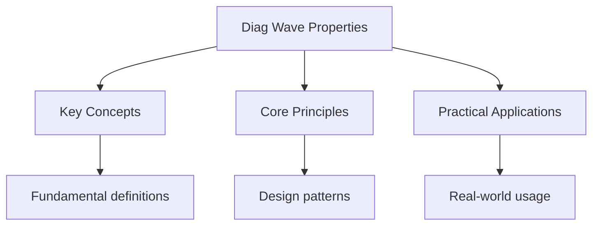

---

date: 2026-07-23T21:57:32+01:00
title: "Wave Properties -- Diagnostic Tests"
description: "A-Level Physics Wave Properties -- Diagnostic Tests notes covering key definitions, core concepts, worked examples, and practice questions for exam preparation."
tableOfContents: false
---

<!-- Breadcrumb Schema for SEO -->

## Intuition

**Physics describes the fundamental rules of the universe — from the tiniest particles to the vastness of space.**

## Wave Properties — Diagnostic Tests

## Unit Tests

### UT-1: Electromagnetic Wave Properties

**Question:**

A plane electromagnetic wave in vacuum has an electric field amplitude of
$E_0 = 48\,\text{V}\,\text{m}^{-1}$ and frequency $f = 5.0 \times 10^{14}\,\text{Hz}$.

(a) Calculate the wavelength, the magnetic field amplitude $B_0$ And the intensity of the wave.

(b) The wave is incident normally on a surface of area $0.010\,\text{m}^2$. Calculate the radiation
pressure on the surface if it is (i) perfectly absorbing and (ii) perfectly reflecting.

(c) Calculate the energy of a single photon of this radiation.

Take
$c = 3.00 \times 10^8\,\text{m}\,\text{s}^{-1}$$\varepsilon_0 = 8.85 \times 10^{-12}\,\text{F}\,\text{m}^{-1}$$\mu_0 = 4\pi \times 10^{-7}\,\text{H}\,\text{m}^{-1}$$h = 6.63 \times 10^{-34}\,\text{J}\,\text{s}$.

**Solution:**

(a) Wavelength:
$\lambda = c/f = 3.00 \times 10^8/(5.0 \times 10^{14}) = 6.0 \times 10^{-7}\,\text{m} = 600\,\text{nm}$
(visible light, orange)

Magnetic field amplitude: $B_0 = E_0/c = 48/(3.00 \times 10^8) = 1.60 \times 10^{-7}\,\text{T}$

Intensity:
$I = \frac{1}{2}\varepsilon_0 c E_0^2 = 0.5 \times 8.85 \times 10^{-12} \times 3.00 \times 10^8 \times 2304 = 0.5 \times 8.85 \times 10^{-12} \times 6.912 \times 10^{11} = 3.06\,\text{W}\,\text{m}^{-2}$

Alternatively:
$I = E_0 B_0/(2\mu_0) = 48 \times 1.60 \times 10^{-7}/(2 \times 4\pi \times 10^{-7}) = 7.68 \times 10^{-6}/(2.513 \times 10^{-6}) = 3.06\,\text{W}\,\text{m}^{-2}$

(b) Radiation pressure:

(i) Perfectly absorbing: $P = I/c = 3.06/(3.00 \times 10^8) = 1.02 \times 10^{-8}\,\text{Pa}$

Force on surface: $F = PA = 1.02 \times 10^{-8} \times 0.010 = 1.02 \times 10^{-10}\,\text{N}$

(ii) Perfectly reflecting: $P = 2I/c = 2.04 \times 10^{-8}\,\text{Pa}$

Force: $F = 2.04 \times 10^{-10}\,\text{N}$

(c)
$E_{\text{photon}} = hf = 6.63 \times 10^{-34} \times 5.0 \times 10^{14} = 3.32 \times 10^{-19}\,\text{J} = 2.07\,\text{eV}$

---

<!-- Breadcrumb Schema for SEO -->

### UT-2: Intensity and Amplitude Relationship

**Question:**

Two coherent sources $S_1$ and $S_2$ emit waves of wavelength $\lambda = 0.50\,\text{m}$ in phase. A
point $P$ is located $4.0\,\text{m}$ from $S_1$ and $5.0\,\text{m}$ from $S_2$.

(a) Determine whether point $P$ is at a maximum, minimum, or neither, and calculate the ratio of the
amplitude at $P$ to the amplitude from a single source.

(b) If the amplitude from each source alone at $P$ is $A_0$Derive the general expression for the
amplitude at $P$ in terms of the path difference $\Delta x$.

(c) Calculate the ratio of the intensity at $P$ to the intensity from a single source alone.

**Solution:**

(a) Path difference: $\Delta x = 5.0 - 4.0 = 1.0\,\text{m}$

$\Delta x/\lambda = 1.0/0.50 = 2.0$

Since the path difference is an integer number of wavelengths ($n = 2$), $P$ is at a **maximum**
(constructive interference).

The amplitude at $P$ is $A = 2A_0$ (double slit maximum).

(b) Phase difference: $\phi = \frac{2\pi \Delta x}{\lambda}$

The resultant amplitude from two waves of amplitude $A_0$ with phase difference $\phi$:

$$A = \sqrt{A_0^2 + A_0^2 + 2A_0^2\cos\phi} = A_0\sqrt{2(1 + \cos\phi)} = 2A_0\left|\cos\frac{\phi}{2}\right|$$

In terms of path difference: $\phi = 2\pi\Delta x/\lambda$

$$A = 2A_0\left|\cos\frac{\pi\Delta x}{\lambda}\right|$$

(c) Intensity is proportional to amplitude squared: $I \propto A^2$

$$\frac{I_P}{I_0} = \frac{(2A_0)^2}{A_0^2} = 4$$

At a maximum, the intensity is four times the intensity from a single source.

At a minimum ($\Delta x = (n + 0.5)\lambda$): $A = 0$ and $I = 0$.

---

<!-- Breadcrumb Schema for SEO -->

### UT-3: Polarisation and Malus"s Law

**Question:**

Unpolarised light of intensity $I_0$ passes through two polarising filters. The first has its
transmission axis vertical. The second is rotated by an angle $\theta$ from the vertical.

(a) Calculate the intensity transmitted through both filters as a function of $\theta$.

(b) At what angle $\theta$ is the transmitted intensity equal to $I_0/8$?

(c) A third polariser is inserted between the first two, with its transmission axis at $45^\circ$ to
the vertical. Calculate the transmitted intensity when $\theta = 90^\circ$.

**Solution:**

(a) After the first (vertical) polariser, the intensity is $I_0/2$ (unpolarised light loses half its
intensity through any polariser).

After the second polariser (at angle $\theta$), by Malus's law:

$$I = \frac{I_0}{2}\cos^2\theta$$

(b) $\frac{I_0}{2}\cos^2\theta = \frac{I_0}{8}$

$$\cos^2\theta = \frac{1}{4} \Rightarrow \cos\theta = \frac{1}{2} \Rightarrow \theta = 60^\circ$$

(c) First polariser (vertical): intensity $= I_0/2$Polarised vertically.

Second polariser (at $45^\circ$):
$I_2 = \frac{I_0}{2}\cos^2 45^\circ = \frac{I_0}{2} \times \frac{1}{2} = \frac{I_0}{4}$Polarised at
$45^\circ$.

Third polariser (horizontal, $\theta = 90^\circ$ from vertical): the angle between the $45^\circ$
polarisation and horizontal is $45^\circ$.

$$I_3 = \frac{I_0}{4}\cos^2 45^\circ = \frac{I_0}{4} \times \frac{1}{2} = \frac{I_0}{8}$$

Without the middle polariser, at $\theta = 90^\circ$ the transmitted intensity would be zero
(crossed polarisers). The insertion of a third polariser at $45^\circ$ allows light to pass through,
demonstrating that polarisers project the electric field onto their transmission axis rather than
blocking light.

## Integration Tests

### IT-1: Doppler Effect and EM Waves (with Superposition)

**Question:**

A galaxy is moving away from Earth at a speed of $3.0 \times 10^6\,\text{m}\,\text{s}^{-1}$. A
spectral line of wavelength $656\,\text{nm}$ (hydrogen alpha) is observed from this galaxy.

(a) Calculate the observed wavelength of this line. (Use the non-relativistic Doppler formula.)

(b) Calculate the percentage change in the observed frequency.

(c) A space probe approaching Jupiter at $2.0 \times 10^4\,\text{m}\,\text{s}^{-1}$ transmits a
radio signal at $8.4\,\text{GHz}$. Calculate the frequency received by an observer on Jupiter.

Take $c = 3.00 \times 10^8\,\text{m}\,\text{s}^{-1}$.

**Solution:**

(a) For a source moving away from the observer:

$$\frac{\Delta\lambda}{\lambda} = \frac{v}{c}$$
$$\Delta\lambda = \frac{3.0 \times 10^6}{3.00 \times 10^8} \times 656 = 0.010 \times 656 = 6.56\,\text{nm}$$

Observed wavelength: $\lambda' = 656 + 6.56 = 662.56 \approx 663\,\text{nm}$ (redshifted)

(b) $f = c/\lambda$ So $\Delta f/f = -\Delta\lambda/\lambda = -v/c = -1.0\%$

The frequency decreases by $1.0\%$.

(c) The probe approaches Jupiter, so the observed frequency is higher:

$$f' = f\left(\frac{c}{c - v}\right) = 8.4 \times 10^9 \times \frac{3.00 \times 10^8}{3.00 \times 10^8 - 2.0 \times 10^4}$$
$$= 8.4 \times 10^9 \times \frac{3.00 \times 10^8}{2.9998 \times 10^8} = 8.4 \times 10^9 \times 1.000067 = 8.4006 \times 10^9\,\text{Hz}$$

The shift is $\Delta f = 5.6 \times 10^5\,\text{Hz} = 560\,\text{kHz}$.

---

<!-- Breadcrumb Schema for SEO -->

### IT-2: Standing Waves on a String (with Oscillations)

**Question:**

A string of length $0.80\,\text{m}$ and mass $4.0 \times 10^{-3}\,\text{kg}$ is fixed at both ends
and stretched to a tension of $25\,\text{N}$.

(a) Calculate the speed of transverse waves on the string.

(b) Calculate the fundamental frequency and the frequencies of the next two harmonics.

(c) The string is plucked at its centre. Explain which harmonics are excited and calculate the
wavelength of the fundamental mode.

**Solution:**

(a) Wave speed: $v = \sqrt{T/\mu}$Where
$\mu = m/l = 4.0 \times 10^{-3}/0.80 = 5.0 \times 10^{-3}\,\text{kg}\,\text{m}^{-1}$

$$v = \sqrt{25/(5.0 \times 10^{-3})} = \sqrt{5000} = 70.7\,\text{m}\,\text{s}^{-1}$$

(b) For a string fixed at both ends, $f_n = nv/(2l)$:

Fundamental ($n = 1$): $f_1 = 70.7/(2 \times 0.80) = 44.2\,\text{Hz}$

Second harmonic ($n = 2$): $f_2 = 2 \times 44.2 = 88.4\,\text{Hz}$

Third harmonic ($n = 3$): $f_3 = 3 \times 44.2 = 132.6\,\text{Hz}$

(c) Plucking at the centre excites the odd harmonics ($n = 1, 3, 5, \ldots$) most strongly because
the centre is an antinode for odd harmonics and a node for even harmonics. Even harmonics
($n = 2, 4, \ldots$) have a node at the centre, so plucking there does not excite them.

Fundamental wavelength: $\lambda_1 = 2l = 1.60\,\text{m}$

The fundamental mode has one antinode at the centre and nodes at both ends.

---

<!-- Breadcrumb Schema for SEO -->

### IT-3: Seismic Waves Through Earth Layers (with Properties of Materials)

**Question:**

P-waves (longitudinal) travel through the Earth's crust at $6.0\,\text{km}\,\text{s}^{-1}$ and
through the mantle at $10.0\,\text{km}\,\text{s}^{-1}$. The crust is $35\,\text{km}$ thick. A P-wave
is detected at a seismograph $200\,\text{km}$ from the epicentre.

(a) Calculate the time for the P-wave to reach the seismograph via the direct path through the crust
only.

(b) The wave refracts at the crust-mantle boundary. Using Snell's law, calculate the critical angle
and determine whether total internal reflection occurs for the direct path.

(c) Explain why S-waves (transverse) are not detected on the opposite side of the Earth from a large
earthquake.

**Solution:**

(a) Direct path through crust: $t = d/v_{\text{crust}} = 200/6.0 = 33.3\,\text{s}$

(b) The wave travels from crust (slower) into mantle (faster), so it bends away from the normal.

Critical angle (for TIR from mantle to crust):

$$\sin\theta_c = \frac{v_{\text{crust}}}{v_{\text{mantle}}} = \frac{6.0}{10.0} = 0.60$$
$$\theta_c = 36.9^\circ$$

For the direct path, the wave enters the mantle at some angle. Since the wave goes from a slower
medium (crust) to a faster medium (mantle), TIR cannot occur at this boundary. TIR only occurs when
going from a slower medium to a faster medium if the wave is already inside the slower medium --
which is not the case here. The wave always enters the mantle (it refracts away from the normal).

For a wave travelling through the mantle and hitting the crust-mantle boundary from below (trying to
exit to the crust), TIR occurs at angles exceeding $\theta_c = 36.9^\circ$ from the normal.

(c) S-waves are transverse and cannot propagate through liquids. The Earth's outer core is liquid,
so S-waves are blocked by it. This creates an S-wave shadow zone on the opposite side of the Earth.
The detection of this shadow zone was key evidence for the existence of a liquid outer core.

## Common Mistakes

**Confusing current and voltage:** Current (A) is the flow of charge; voltage (V) is the energy per unit charge. Resistance opposes current, not voltage. Students often say "the resistor uses up the voltage" when they should say "the voltage drops across the resistor."

**Forgetting Ohm's law applies only to ohmic conductors:**  = IR$ is valid only when resistance is constant (ohmic conductors at constant temperature). For non-ohmic devices (diodes, thermistors, filament lamps), resistance changes with voltage or temperature, so  = IR$ gives the resistance at that point, not a constant.

**Confusing the conventions for electron flow and conventional current:** Conventional current flows from positive to negative (the direction a positive charge would move). Electron flow is from negative to positive (the actual movement of electrons). Most circuit analysis uses conventional current. Using electron flow when conventional current is expected gives reversed directions.

## Cross-References

- **[Mechanics](../flashcards-mechanics-waves):** Mechanics covers motion, forces, and energy
- **[Waves](../flashcards-mechanics-waves):** Waves transfer energy through oscillations
- **[Electricity](../flashcards-electricity-fields):** Electricity covers circuits and fields
