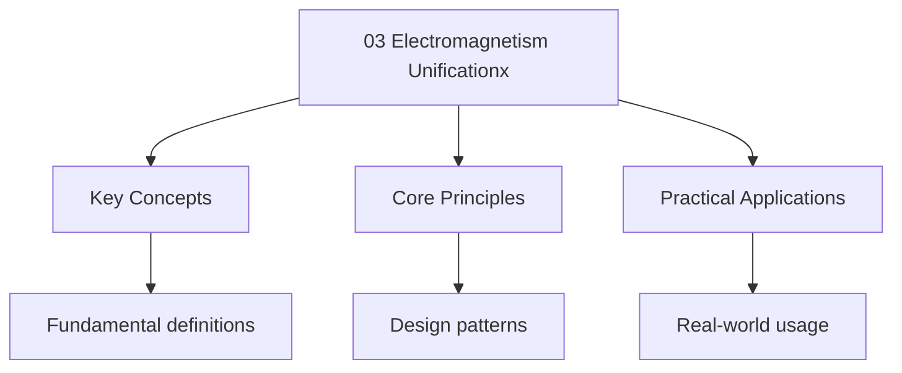

---

title: "Electromagnetism Unification | A-Level"
description: "ALEVEL Physics notes: Electromagnetism Unification. Comprehensive study material with definitions, examples, and assessment tools."
date: 2025-06-02T16:25:28.480Z
tags:
  - Physics
  - ALevel
categories:
  - Physics

---

import PhetSimulation from "@components/PhetSimulation";

## Electromagnetism Unification

> **Info:** Board Coverage AQA Paper 2 | Edexcel CP3 | OCR (A) Paper 2 | CIE P4
<PhetSimulation client:only="solid-js" simulationId="faraday-electromagnetic-lab" title="Faraday's Electromagnetic Lab" />

Explore the simulation above to develop intuition for this topic.

## Intuition

**Electricity and magnetism are two faces of the same coin:** Before Maxwell, electricity and magnetism were studied separately. Maxwell showed they're actually one force — electromagnetism — that looks different depending on whether charges are moving or stationary. A moving charge (current) creates a magnetic field, and a changing magnetic field creates an electric field. They're inseparable.

**Why it matters:** Maxwell's equations unify all of classical electromagnetism. They explain how light is an electromagnetic wave, how radio waves are generated, how transformers work, and how antennas transmit signals. They're the foundation of all wireless technology — from Wi-Fi to GPS to Bluetooth.

**The key insight:** Maxwell's equations predict that electromagnetic waves travel at the speed of light — because light IS an electromagnetic wave. This was the great unification: optics (light), electricity, and magnetism are all the same phenomenon. Einstein's special relativity grew directly from this insight.

## 1. Maxwell's Equations (Integral Form)

Maxwell\'s four equations unify electricity and magnetism into a single coherent theory. They are
Among the most important equations in physics.

### Gauss\'s Law for Electricity

$$\oint \mathbf{E} \cdot d\mathbf{A} = \frac{Q_{\mathrm{enclosed}}}{\varepsilon_0}$$

**Meaning.** The total electric flux through any closed surface equals the total charge enclosed,
Divided by $\varepsilon_0$. Electric charges are the sources (and sinks) of electric field lines.

### Gauss\'s Law for Magnetism

$$\oint \mathbf{B} \cdot d\mathbf{A} = 0$$

**Meaning.** The total magnetic flux through any closed surface is zero. There are **no magnetic
Monopoles** — magnetic field lines always form closed loops.

### Faraday\'s Law

$$\oint \mathbf{E} \cdot d\mathbf{l} = -\frac{d\Phi_B}{dt}$$

**Meaning.** A changing magnetic flux induces an electromotive force (and hence an electric field)
Around a closed loop. This is the mathematical form of Faraday\'s law of induction.

### Ampere-Maxwell Law

$$\oint \mathbf{B} \cdot d\mathbf{l} = \mu_0 I_{\mathrm{enclosed}} + \mu_0\varepsilon_0\frac{d\Phi_E}{dt}$$

**Definition.** The displacement current $I_d = \varepsilon_0\,d\Phi_E/dt$ is a quantity
Proportional to the rate of change of electric flux through a surface. It is not a flow of charge
But produces a magnetic field in the same way as a real current, ensuring consistency of Ampere\'s
Law for non-steady currents.

**Meaning.** A magnetic field is produced both by electric currents (first term) and by changing
Electric fields (second term). Maxwell\'s addition of the displacement current term
$\mu_0\varepsilon_0\,d\Phi_E/dt$ was the crucial insight that made the theory self-consistent.

**Intuition.** Maxwell noticed a fundamental asymmetry: a changing magnetic field produces an
Electric field (Faraday\'s law), but the original Ampere\'s law had no corresponding term for a
Changing electric field producing a magnetic field. He added the displacement current term to
Restore this symmetry — and in doing so, predicted electromagnetic waves.

**Definition.** An electromagnetic wave is a self-propagating transverse wave consisting of
Oscillating electric and magnetic fields perpendicular to each other and to the direction of
Propagation, travelling at speed $c = 1/\sqrt{\mu_0\varepsilon_0}$ in vacuum.

> **Info:** Board Coverage AQA Paper 2 | Edexcel CP3 | OCR (A) Paper 2 Mod 6 | CIE P4
AQA expects qualitative understanding of all four Maxwell\'s equations and their physical
Significance. Edexcel and CIE require the full derivation of $c$ from first principles. OCR (A)
Emphasises the consequences (EM wave properties, the spectrum) rather than the mathematical
Formalism. CIE may also ask about the displacement current explicitly.

## 2. Derivation of the Speed of Electromagnetic Waves

Consider electromagnetic waves propagating in free space (no charges, no currents: $Q = 0$ $I = 0$).

In free space, Maxwell\'s equations become:

$$\oint \mathbf{E} \cdot d\mathbf{A} = 0 \quad \mathrm{(no charges)}$$
$$\oint \mathbf{B} \cdot d\mathbf{A} = 0 \quad \mathrm{(no monopoles)}$$
$$\oint \mathbf{E} \cdot d\mathbf{l} = -\frac{d\Phi_B}{dt} \quad \mathrm{(Faraday)}$$
$$\oint \mathbf{B} \cdot d\mathbf{l} = \mu_0\varepsilon_0\frac{d\Phi_E}{dt} \quad \mathrm{(Ampere-Maxwell, no currents)}$$

Consider a plane wave propagating in the $x$-direction, with $\mathbf{E} = E_y\,\hat{\mathbf{j}}$
And $\mathbf{B} = B_z\,\hat{\mathbf{k}}$.

Applying Faraday\'s law to a rectangular loop in the $xy$-plane:

$$E_y \cdot l = -\frac{d}{dt}(B_z \cdot l \cdot \Delta x)$$

$$E_y = -\frac{\partial B_z}{\partial t}\Delta x$$

In the limit $\Delta x \to 0$:
$\frac{\partial E_y}{\partial x} = -\frac{\partial B_z}{\partial t}$ ... (i)

Applying the Ampere-Maxwell law to a rectangular loop in the $xz$-plane:

$$B_z \cdot l = \mu_0\varepsilon_0\frac{d}{dt}(E_y \cdot l \cdot \Delta x)$$

$$\frac{\partial B_z}{\partial x} = \mu_0\varepsilon_0\frac{\partial E_y}{\partial t}$$
... (ii)

Differentiating (i) with respect to $x$ and (ii) with respect to $t$:

$$\frac{\partial^2 E_y}{\partial x^2} = -\frac{\partial^2 B_z}{\partial t \partial x}$$

$$\frac{\partial^2 B_z}{\partial x \partial t} = \mu_0\varepsilon_0\frac{\partial^2 E_y}{\partial t^2}$$

Substituting the second into the first:

$$\frac{\partial^2 E_y}{\partial x^2} = -\mu_0\varepsilon_0\frac{\partial^2 E_y}{\partial t^2}$$

$$\boxed{\frac{\partial^2 E_y}{\partial x^2} = \mu_0\varepsilon_0\frac{\partial^2 E_y}{\partial t^2}}$$

This is the **wave equation** with wave speed:

$$\boxed{c = \frac{1}{\sqrt{\mu_0\varepsilon_0}}}$$

$\square$

Similarly for $B_z$:

$$\frac{\partial^2 B_z}{\partial x^2} = \mu_0\varepsilon_0\frac{\partial^2 B_z}{\partial t^2}$$

### Calculating $c$

$$c = \frac{1}{\sqrt{\mu_0\varepsilon_0}} = \frac{1}{\sqrt{4\pi \times 10^{-7} \times 8.854 \times 10^{-12}}}$$

$$c = \frac{1}{\sqrt{1.113 \times 10^{-17}}} = \frac{1}{3.337 \times 10^{-9}} = 2.998 \times 10^8 \mathrm{ m s}^{-1}$$

$$\boxed{c \approx 3.00 \times 10^8 \mathrm{ m s}^{-1}}$$

**This was one of the greatest triumphs of theoretical physics.** Maxwell derived the speed of light
From purely electrical and magnetic constants — proving that light is an electromagnetic wave.

**Intuition.** The speed of EM waves is determined by how quickly electric and magnetic fields can
"regenerate" each other. A changing $E$ field creates a changing $B$ field (Ampere-Maxwell), which
Creates a changing $E$ field (Faraday), and so on. The rate of this mutual generation is set by
$\mu_0$ and $\varepsilon_0$.

### The $\mathbf{E}/\mathbf{B}$ Relationship

Starting from the two coupled first-order equations derived above:

$$\frac{\partial E_y}{\partial x} = -\frac{\partial B_z}{\partial t} \quad \mathrm{... (i)}$$

$$\frac{\partial B_z}{\partial x} = \mu_0\varepsilon_0\frac{\partial E_y}{\partial t} \quad \mathrm{... (ii)}$$

For a plane wave $E_y = E_0\sin(kx - \omega t)$Equation (i) gives:

$$kE_0\cos(kx - \omega t) = \omega B_0\cos(kx - \omega t)$$

So $\frac{E_0}{B_0} = \frac{\omega}{k} = c$. This confirms that the electric and
magnetic field Amplitudes are related by a fixed ratio — a direct consequence of Maxwell\'s
equations, not an Independent assumption.

### Energy in Electromagnetic Waves

The energy density in the electric field is $u_E = \frac{1}{2}\varepsilon_0 E^2$ and in the magnetic
Field is $u_B = \frac{B^2}{2\mu_0}$. Since $B = E/c$:

$$u_B = \frac{E^2}{2\mu_0 c^2} = \frac{\varepsilon_0 E^2}{2} = u_E$$

The electric and magnetic fields carry **equal energy**. The total energy density is:

$$u = \varepsilon_0 E^2 = \frac{B^2}{\mu_0}$$

The Poynting vector gives the energy flux (power per unit area):

$$\mathbf{S} = \frac{1}{\mu_0}\mathbf{E} \times \mathbf{B}$$

For a plane wave, the time-averaged intensity is:

$$\langle S \rangle = \frac{E_0 B_0}{2\mu_0} = \frac{E_0^2}{2\mu_0 c} = \frac{c\varepsilon_0 E_0^2}{2}$$

**Real-world example.** A typical laser pointer emits about 5 mW of power through a beam of diameter
2 mm. The intensity is $I = P/A = 5 \times 10^{-3} / (\pi \times 10^{-6}) \approx 1600$ W m$^{-2}$.
From this, $E_0 = \sqrt{2I/(\mu_0 c)} \approx 1100$ V m$^{-1}$ — a surprisingly large electric
field From a small device.

### Radiation Pressure

Since EM waves carry momentum, they exert pressure on surfaces. For a wave with intensity $I$:

$$P = \frac{I}{c} \quad \mathrm{(total absorption)}$$

$$P = \frac{2I}{c} \quad \mathrm{(perfect reflection)}$$

**Real-world example.** Solar radiation at Earth\'s orbit has intensity $\approx 1360$ W m$^{-2}$.
The radiation pressure on a perfectly reflecting solar sail is
$P = 2 \times 1360 / (3 \times 10^8)
\approx 9.1 \times 10^\{-6\}$ Pa. While tiny, this is sufficient
To propel lightweight spacecraft — the Planetary Society\'s LightSail 2 demonstrated solar sailing
In 2019.

## 3. Properties of Electromagnetic Waves

From Maxwell\'s equations, EM waves have these properties:

1. **Transverse**: $\mathbf{E}$ and $\mathbf{B}$ are perpendicular to each other and to the
   direction of propagation
2. **Speed**: $c = 1/\sqrt{\mu_0\varepsilon_0}$ in vacuum (independent of frequency)
3. **Relation between fields**: $E = cB$ (the ratio $E/B = c$ is constant)
4. **Self-propagating**: no medium required
5. **Carry energy**: the Poynting vector
   $\mathbf{S} = \frac{1}{\mu_0}\mathbf{E} \times \mathbf{B}$ gives the energy flux
6. **Carry momentum**: radiation pressure $P = I/c$ for total absorption, $P = 2I/c$ for perfect
   reflection

> **Info:** Board Coverage AQA Paper 2 | Edexcel CP3 | OCR (A) Paper 2 Mod 6 | CIE P4
AQA and OCR (A) focus on the qualitative properties listed above. Edexcel and CIE may ask for the
$E = cB$ relationship quantitatively. The Poynting vector is beyond most A Level syllabi but
Provides useful context for understanding radiation pressure and energy transport. CIE P4 includes
Radiation pressure as an application topic.

## 4. The EM Spectrum as a Unified Phenomenon

All electromagnetic radiation — radio waves, microwaves, infrared, visible light, ultraviolet,
X-rays, and gamma rays — is fundamentally the same phenomenon: oscillating electric and magnetic
Fields propagating at speed $c$. The only difference is the frequency (and hence wavelength):

$$c = f\lambda$$

| Band      | $f$ (Hz)                                | Origin                                   |
| --------- | --------------------------------------- | ---------------------------------------- |
| Radio     | $< 3 \times 10^9$                       | Oscillating charges in aerials           |
| Microwave | $10^9$–$10^{12}$                        | Klystrons, molecular rotation            |
| IR        | $10^{12}$–$10^{14}$                     | Molecular vibration                      |
| Visible   | $4 \times 10^{14}$–$7.5 \times 10^{14}$ | Atomic electron transitions              |
| UV        | $10^{15}$–$10^{17}$                     | Electron transitions (outer)             |
| X-ray     | $10^{16}$–$10^{19}$                     | Electron deceleration, inner transitions |
| Gamma     | $> 10^{19}$                             | Nuclear transitions                      |

Maxwell\'s unification showed that all these phenomena are described by the same four equations. The
Quantum nature of EM radiation (photons) would later be explained by Planck and Einstein, but the
Classical wave description remains valid and powerful.

:::note
<strong>Info CIE. AQA and OCR (A) expect you to know the result and its significance but may not</strong>

require the full Derivation.
:::
## 5. Faraday\'s Law — Applications and Lenz\'s Law Intuition

### Flux Linkage and Induced `EMF`

The magnetic flux through a coil of $N$ turns is called the flux linkage:

$$N\Phi = NBA\cos\theta$$

Faraday\'s law states that the magnitude of the induced electromotive force equals the rate of change
Of flux linkage:

$$|\varepsilon| = \frac{d(N\Phi)}{dt}$$

### Lenz\'s Law: Why the Minus Sign Matters

The negative sign in Faraday\'s law ($\varepsilon = -d\Phi_B/dt$) is not arbitrary — it embodies
Lenz\'s law: **the induced current flows in a direction that opposes the change in flux that produced
It.**

**Intuition.** Lenz\'s law is a consequence of energy conservation. If the induced current reinforced
The change in flux, it would amplify itself — a runaway process that would violate conservation of
Energy. The opposition ensures that work must be done to maintain the changing flux, and this work
Is converted to electrical energy.

**Example.** A bar magnet is pushed north-pole-first into a solenoid. The flux through the solenoid
Increases. By Lenz\'s law, the induced current creates a magnetic field opposing the increase — so
The solenoid\'s end nearest the magnet becomes a north pole, repelling the magnet. You feel
Resistance when pushing the magnet in, confirming that mechanical work is being converted to
Electrical energy.

### The Motional `EMF`

When a conductor of length $l$ moves with velocity $v$ perpendicular to a uniform field $B$:

$$\varepsilon = BLv$$

**Derivation.** Each free electron in the conductor experiences a magnetic force $F = evB$ (by
Fleming\'s left-hand rule). Electrons accumulate at one end, creating an electric field $E$ that
Opposes further accumulation. Equilibrium is reached when $eE = evB$Giving $E = vB$. Since
$E =
\varepsilon/l$, we get $\varepsilon = BLv$.

### Applications of Faraday\'s Law

**Transformers.** An alternating current in the primary coil creates a changing magnetic flux in the
Iron core, which induces an alternating `EMF` in the secondary coil:

$$\frac{V_s}{V_p} = \frac{N_s}{N_p}$$

For an ideal transformer (no energy losses), power is conserved: $V_p I_p = V_s I_s$.

**Generators.** A coil rotating in a uniform magnetic field produces an alternating `EMF`. For a
Coil of $N$ turns, area $A$Rotating at angular frequency $\omega$ in field $B$:

$$\varepsilon = NAB\omega\sin(\omega t)$$

The peak `EMF` is $\varepsilon_0 = NAB\omega$ — increasing the rotation speed, field strength, coil
Area, or number of turns all increase the output.

**Induction braking.** Eddy currents induced in a conductor moving through a magnetic field create a
Force opposing the motion. This is used in electromagnetic brakes on trains and in damping
Mechanisms for sensitive balances. The braking force is proportional to the conductor\'s velocity, so
It provides smooth deceleration without mechanical contact.

**Induction heating.** A high-frequency alternating magnetic field induces eddy currents in a metal
Object, resistively heating it. Used in induction cooktops (where the pan itself becomes the heat
Source) and in industrial furnaces for melting metals.

> **Info:** Board Coverage AQA Paper 2 | Edexcel CP6 | OCR (A) Paper 2 Mod 6 | CIE P4
AQA requires quantitative treatment of transformers (efficiency, turns ratio) and generators.
Edexcel covers motional `EMF` in detail and includes the rotating coil derivation. CIE P4 requires
The back-`EMF` of a motor and transformer equations. OCR (A) links electromagnetic induction to
Braking and energy transfer, with less quantitative detail on rotating coils.

## 6. The Hall Effect

When a current-carrying conductor is placed in a magnetic field perpendicular to the current, a
Transverse voltage — the **Hall voltage** — develops across the conductor.

### Mechanism

Charge carriers moving with drift velocity $v_d$ through the conductor experience a magnetic force:

$$F_B = qv_dB$$

This deflects carriers to one side, building up a transverse electric field $E_H$. Equilibrium is
Reached when the electric force balances the magnetic force:

$$qE_H = qv_dB$$

$$E_H = v_dB$$

For a conductor of thickness $t$The Hall voltage is:

$$V_H = E_H t = v_d B t$$

### Expressing in Terms of Measurable Quantities

Since the current $I = nqv_dA$ where $n$ is the carrier density and $A = wt$ (width $\times$
Thickness), we have $v_d = I/(nqwt)$. Substituting:

$$\boxed{V_H = \frac{BI}{ntq}}$$

This shows that the Hall voltage is proportional to $B$ and inversely proportional to the thickness
And carrier density.

### Applications

**Hall probes** use the Hall effect to measure magnetic field strength. Since $V_H \propto B$ (for
Fixed $I$), a calibrated Hall probe provides a direct, linear measurement of $B$. This is the most
Common method for measuring magnetic fields in A Level laboratories.

The Hall effect also reveals the sign of the charge carriers: the polarity of $V_H$ depends on
Whether the carriers are positive or negative. In semiconductors, both electron (n-type) and hole
(p-type) conduction can be distinguished — a crucial tool in semiconductor research.

**Example.** A Hall probe has $n = 8.5 \times 10^{28}$ m$^{-3}$ (copper), thickness $t = 1.0$ mm,
And carries current $I = 10$ mA. In a field of $B = 0.50$ T:

$V_H = \frac{0.50 \times 0.010}{8.5 \times 10^{28} \times 1.0 \times 10^{-3} \times 1.60 \times 10^{-19}} = \frac{5.0 \times 10^{-3}}{1.36 \times 10^{7}} = 3.7 \times 10^{-10}$
V.

This tiny voltage in metals explains why Hall probes use **semiconductors** (with much lower $n$) to
Get measurable voltages.

:::note
<strong>Info</strong>

CIE P4 covers the Hall effect explicitly, including the derivation of $V_H = BI/(ntq)$. AQA mentions
Hall probes as a method of measuring magnetic fields but does not require the full theory. Edexcel
Provides a qualitative treatment. OCR (A) has limited coverage — students should be aware of Hall
Probes as a measuring instrument.

## 7. The Mass Spectrometer

A mass spectrometer separates ions by their mass-to-charge ratio, enabling precise measurement of
Isotopic masses and abundances.

### Stages of Operation

1. **Ionisation.** Atoms are ionised (by electron bombardment or laser), producing positive ions of
   charge $q = +e$ (or $+2e$Etc.).
2. **Acceleration.** Ions are accelerated through a potential difference $V$Gaining kinetic energy:

   $$\frac{1}{2}mv^2 = qV \quad \Rightarrow \quad v = \sqrt{\frac{2qV}{m}}$$

3. **Deflection.** Ions enter a region of uniform magnetic field $B$ and follow a semicircular path.
   The magnetic force provides centripetal acceleration:

   $$qvB = \frac{mv^2}{r} \quad \Rightarrow \quad r = \frac{mv}{qB}$$

4. **Detection.** Ions strike a detector at different positions depending on their radius of
   curvature. Substituting the velocity from stage 2:

   $$r = \frac{1}{B}\sqrt{\frac{2mV}{q}}$$

Rearranging for the mass-to-charge ratio:

$$\boxed{\frac{m}{q} = \frac{B^2 r^2}{2V}}$$

### Key Insights

- Ions with **larger mass** follow a **larger radius** path.
- Doubly-charged ions ($q = 2e$) follow a **smaller** radius than singly-charged ions of the same
  mass.
- The instrument can distinguish between different **isotopes** of the same element, since
  $r \propto \sqrt{m}$.

**Real-world example.** In a mass spectrometer with $B = 0.50$ T and $V = 10,000$ V, singly-charged
Carbon-12 ions ($m = 12 \times 1.66 \times 10^{-27}$ kg) follow a semicircular path of radius:

$$r = \frac{1}{0.50}\sqrt{\frac{2 \times 1.99 \times 10^{-26} \times 10000}{1.60 \times 10^{-19}}} = 2.0 \times 0.0500 = 0.100 \mathrm{ m} = 10.0 \mathrm{ cm}$$

Carbon-13 ions ($m = 13 \times 1.66 \times 10^{-27}$ kg) would be deflected to a radius
$\sqrt{13/12} \times 10.0 \approx 10.4$ cm — the two isotopes are separated on the detector.
:::
> **Info:** Board Coverage AQA Paper 2 | Edexcel CP6 | OCR (A) Paper 2 Mod 6 | CIE P4
AQA covers the mass spectrometer quantitatively, including the derivation of $r = mv/(qB)$. Edexcel
Includes it as an application of circular motion in a magnetic field. CIE P4 covers it in detail,
Including time-of-flight variants. OCR (A) treats it more briefly but expects familiarity with the
Principles of velocity selection and magnetic deflection.

## 8. The Cyclotron

A cyclotron is a particle accelerator that uses a combination of an electric field and a magnetic
Field to accelerate charged particles to high energies.

### Structure and Principle

The cyclotron consists of two hollow, D-shaped electrodes ("dees") placed in a uniform magnetic
Field perpendicular to their plane. An alternating potential difference is applied across the gap
Between the dees.

1. A charged particle is injected near the centre.
2. The electric field in the gap accelerates the particle.
3. Inside a dee, the magnetic field causes the particle to follow a semicircular path (no work done
   by $B$ since $\mathbf{F} \perp \mathbf{v}$).
4. When the particle reaches the gap again, the alternating `EMF` has reversed, accelerating the
   particle once more.
5. The particle spirals outward with increasing radius but **constant frequency**.

### The Cyclotron Frequency

The period of the semicircular orbit is $T = \pi r / v = \pi m / (qB)$. Remarkably, the radius and
Velocity cancel out:

$$\boxed{f = \frac{1}{T} = \frac{qB}{2\pi m}}$$

This is the **cyclotron frequency** — only on $q$, $B$ And $m$**not on the particle\'s Speed or
radius**. This is why the alternating `EMF` can operate at a fixed frequency, regardless of The
particle\'s energy.

### Proof of Frequency Independence

For a charged particle moving in a uniform magnetic field, the centripetal force is provided by the
Magnetic force:

$$\frac{mv^2}{r} = qvB \quad \Rightarrow \quad r = \frac{mv}{qB}$$

The time for one complete revolution is:

$$T = \frac{2\pi r}{v} = \frac{2\pi m}{qB}$$

This is independent of $r$ and $v$Confirming that the frequency is constant:

$$f = \frac{qB}{2\pi m}$$

$\square$

### Maximum Kinetic Energy

The maximum radius is determined by the size of the dees, $r = R$. At this point:

$$KE_{\max} = \frac{1}{2}mv_{\max}^2 = \frac{q^2 B^2 R^2}{2m}$$

This shows that larger cyclotrons (bigger $R$) and stronger fields (larger $B$) produce
Higher-energy particles.

### The Relativistic Limit

As particles approach a significant fraction of $c$Their relativistic mass increases
($m_{\mathrm{rel}} = \gamma m$). Since $f = qB/(2\pi m)$The cyclotron frequency decreases. The
Alternating `EMF` falls out of sync, and the particle is no longer accelerated efficiently. The
**synchrocyclotron** solves this by varying the frequency of the alternating `EMF` to match the
Decreasing cyclotron frequency.

**Real-world example.** The first cyclotron, built by Ernest Lawrence in 1932, had a diameter of
Just 11 cm and accelerated protons to 80 keV. Modern cyclotrons in hospitals produce radioactive
Isotopes for PET scans by accelerating protons to energies of 10--20 MeV.

:::note
<strong>Info</strong>

AQA mentions the cyclotron briefly as an application of circular motion in magnetic fields. Edexcel
Does not require detailed knowledge. CIE P4 covers the cyclotron in moderate detail, Including the
derivation of the cyclotron frequency. OCR (A) does not examine this topic — Students should check
their specification.

## Problem Set

Problem 1

Calculate the speed of light from the values of $\mu_0 = 4\pi \times 10^{-7}$ T m A$^{-1}$ and
$\varepsilon_0 = 8.85 \times 10^{-12}$ F m$^{-1}$.

**Answer.**
$c = \frac{1}{\sqrt{4\pi \times 10^{-7} \times 8.85 \times 10^{-12}}} = \frac{1}{\sqrt{1.113 \times 10^{-17}}} = \frac{1}{3.337 \times 10^{-9}} = 2.998 \times 10^8$
M s$^{-1}$.

<b>If you get this wrong, revise:</b> [Calculating $c$](#calculating-c)

Problem 2

An EM wave in vacuum has an electric field amplitude of 30 V m$^{-1}$. Calculate the magnetic field
Amplitude.

**Answer.** $E_0 = cB_0$ So $B_0 = E_0/c = 30/(3.0 \times 10^8) = 1.0 \times 10^{-7}$ T $= 100$ nT.

<b>If you get this wrong, revise:</b>
[Properties of Electromagnetic Waves](#3-properties-of-electromagnetic-waves)

Problem 3

State Gauss\'s law for magnetism and explain its physical significance.

**Answer.** $\oint \mathbf{B} \cdot d\mathbf{A} = 0$. This states that the net magnetic flux through
Any closed surface is zero, which means there are no magnetic monopoles. Every magnetic field line
That enters a closed surface must also exit it — field lines always form closed loops.

<b>If you get this wrong, revise:</b> [Gauss\'s Law for Magnetism](#gausss-law-for-magnetism)

Problem 4

Explain why Maxwell added the displacement current term to Ampere\'s law and what physical phenomenon
It predicts.

**Answer.** Maxwell noticed that applying the original Ampere\'s law to a charging capacitor gave
Inconsistent results — different surfaces bounded by the same loop gave different values of
$\oint \mathbf{B} \cdot d\mathbf{l}$. He resolved this by adding the term
$\mu_0\varepsilon_0\,d\Phi_E/dt$Representing the magnetic field produced by a changing electric
Field. This addition predicted that changing electric fields generate magnetic fields, and combined
With Faraday\'s law (changing $B$ generates $E$), it predicted self-sustaining electromagnetic waves.

<b>If you get this wrong, revise:</b> [Ampere-Maxwell Law](#ampere-maxwell-law)

Problem 5

An X-ray has wavelength $0.10$ nm. Calculate its frequency and the electric field amplitude if the
Magnetic field amplitude is $1.5\,\mu$T.

**Answer.** $f = c/\lambda = 3.0 \times 10^8 / 1.0 \times 10^{-10} = 3.0 \times 10^{18}$ Hz.

$E_0 = cB_0 = 3.0 \times 10^8 \times 1.5 \times 10^{-6} = 450$ V m$^{-1}$.

<b>If you get this wrong, revise:</b>
[Properties of Electromagnetic Waves](#3-properties-of-electromagnetic-waves)

Problem 6

Explain why electromagnetic waves do not require a medium to propagate, unlike mechanical waves.

**Answer.** EM waves consist of self-sustaining oscillations of electric and magnetic fields. A
Changing electric field generates a magnetic field (Ampere-Maxwell law), and a changing magnetic
Field generates an electric field (Faraday\'s law). These fields exist in vacuum — they do not need a
Material medium. Mechanical waves require particles to oscillate and transfer energy, hence a medium
Is essential.

<b>If you get this wrong, revise:</b>
[Derivation of the Speed of Electromagnetic Waves](#2-derivation-of-the-speed-of-electromagnetic-waves)

Problem 7

In an EM wave, the electric field is given by $E_y = 60\sin(2\pi \times 10^{10}t - kx)$ V m$^{-1}$.
Calculate: (a) the frequency, (b) the wavelength, (c) the magnetic field amplitude.

**Answer.** (a) $\omega = 2\pi \times 10^{10}$ So $f = 10^{10}$ Hz $= 10$ GHz.

(b) $\lambda = c/f = 3.0 \times 10^8/10^{10} = 0.030$ m $= 3.0$ cm.

(c) $B_0 = E_0/c = 60/(3.0 \times 10^8) = 2.0 \times 10^{-7}$ T $= 200$ nT.

<b>If you get this wrong, revise:</b>
[Properties of Electromagnetic Waves](#3-properties-of-electromagnetic-waves)

Problem 8

What was the significance of Maxwell\'s prediction of the speed of EM waves? How was it
Experimentally confirmed?

**Answer.** Maxwell showed that EM waves travel at $c = 1/\sqrt{\mu_0\varepsilon_0}$Which
matched The measured speed of light. This proved that light is an electromagnetic wave — unifying
optics With electromagnetism. It was experimentally confirmed by Hertz (1887), who generated and
detected Radio waves using oscillating circuits, showing they had the predicted properties
(reflection, Refraction, polarisation, speed matching $c$).

<b>If you get this wrong, revise:</b>
[The EM Spectrum as a Unified Phenomenon](#4-the-em-spectrum-as-a-unified-phenomenon)

Problem 9

A transformer has 200 turns on its primary coil and 50 turns on its secondary coil. The primary is
Connected to a 240 V rms AC supply. (a) Calculate the secondary voltage. (b) If the secondary
Delivers 2.0 A to a load and the transformer is 90% efficient, calculate the primary current.

**Answer.** (a) $V_s/V_p = N_s/N_p$ So $V_s = 240 \times 50/200 = 60$ V.

(b) $P_s = V_s I_s = 60 \times 2.0 = 120$ W. $P_p = P_s / 0.90 = 133$ W.
$I_p = P_p / V_p = 133/240 = 0.56$ A.

<b>If you get this wrong, revise:</b>
[Faraday\'s Law — Applications and Lenz\'s Law Intuition](#5-faradays-law--applications-and-lenzs-law-intuition)

Problem 10

A Hall probe uses a semiconductor strip of thickness 1.5 mm and carrier density $1.0 \times 10^{21}$
M$^{-3}$. A current of 5.0 mA passes through the strip, which is placed in a magnetic field of 0.30
T. Calculate the Hall voltage. Why is a semiconductor used rather than a metal?

**Answer.**
$V_H = \frac{BI}{ntq} = \frac{0.30 \times 5.0 \times 10^{-3}}{1.0 \times 10^{21} \times 1.5 \times 10^{-3} \times 1.60 \times 10^{-19}} = \frac{1.5 \times 10^{-3}}{0.240} = 6.25 \times 10^{-3}$
V $= 6.3$ mV.

A semiconductor is used because its much lower carrier density ($n$) produces a larger, more
Measurable Hall voltage compared to a metal where $n \sim 10^{29}$ m$^{-3}$ would give
$V_H \sim 10^{-10}$ V.

<b>If you get this wrong, revise:</b> [The Hall Effect](#6-the-hall-effect)

Problem 11

In a mass spectrometer, a potential difference of 5000 V accelerates singly-charged neon-20 ions
($m = 20 \times 1.66 \times 10^{-27}$ kg) into a magnetic field of 0.40 T. (a) Calculate the
Velocity of the ions after acceleration. (b) Calculate the radius of their semicircular path. (c)
Would neon-22 ions hit the detector closer to or further from the entrance slit?

**Answer.** (a) $\frac{1}{2}mv^2 = qV$ So
$v = \sqrt{2qV/m} = \sqrt{2 \times 1.60 \times 10^{-19} \times 5000 / (3.32 \times 10^{-26})} = \sqrt{4.82 \times 10^{10}} = 2.20 \times 10^5$
M s$^{-1}$.

(b)
$r = mv/(qB) = 3.32 \times 10^{-26} \times 2.20 \times 10^5 / (1.60 \times 10^{-19} \times 0.40) = 7.30 \times 10^{-21} / 6.40 \times 10^{-20} = 0.114$
M $= 11.4$ cm.

(c) Since $r \propto \sqrt{m}$Neon-22 ions ($m$ is 10% larger) follow a path with radius
$\sqrt{22/20} \times 11.4 \approx 11.9$ cm — **further** from the entrance slit.

<b>If you get this wrong, revise:</b> [The Mass Spectrometer](#7-the-mass-spectrometer)

Problem 12

A cyclotron with dees of radius 0.50 m uses a magnetic field of 1.2 T to accelerate protons
($m = 1.67 \times 10^{-27}$ kg, $q = 1.60 \times 10^{-19}$ C). Calculate: (a) the cyclotron
Frequency, (b) the maximum kinetic energy of the protons in both joules and electronvolts, (c)
Explain why the frequency remains constant as the proton accelerates.

**Answer.** (a)
$f = qB/(2\pi m) = 1.60 \times 10^{-19} \times 1.2 / (2\pi \times 1.67 \times 10^{-27}) = 1.92 \times 10^{-19} / 1.05 \times 10^{-26} = 1.83 \times 10^{7}$
Hz $= 18.3$ MHz.

(b)
$KE_{\max} = q^2 B^2 R^2 / (2m) = (1.60 \times 10^{-19})^2 \times 1.44 \times 0.25 / (2 \times 1.67 \times 10^{-27}) = 9.22 \times 10^{-39} / 3.34 \times 10^{-27} = 2.76 \times 10^{-12}$
J $= 2.76 \times 10^{-12} / 1.60 \times 10^{-19} = 17.2$ MeV.

(c) The cyclotron frequency $f = qB/(2\pi m)$ depends only on the charge, field strength, and mass —
Not on the radius or speed. As the proton gains energy and spirals outward, both $r$ and $v$
Increase proportionally ($r = mv/(qB)$), keeping the period $T = 2\pi r/v = 2\pi m/(qB)$ constant.

<b>If you get this wrong, revise:</b> [The Cyclotron](#8-the-cyclotron)

:::
---

:::tip
<strong>Tip Ready to test your understanding of **Electromagnetism**? The contains the</strong>

hardest questions within the A-Level specification for this topic, each with a full worked solution.

**Unit tests** probe edge cases and common misconceptions. **Integration tests** combine
Electromagnetism with other physics topics to test synthesis under exam conditions.

See for instructions on
self-marking and building a personal test matrix.
:::
:::danger
<strong>Danger</strong>

- **Forgetting Lenz\'s law when determining induced current direction:** Lenz\'s law states that the
  induced e.m.f. Opposes the CHANGE in flux, not the flux itself. If flux is increasing, the induced
  current creates a field opposing the increase. If flux is decreasing, the induced current tries to
  maintain it. Students often oppose the flux itself rather than the change.

- **Confusing Faraday\'s and Lenz\'s laws:** Faraday\'s law gives the MAGNITUDE of the induced e.m.f.
  (epsilon = -d(Phi)/dt). Lenz\'s law gives the DIRECTION (the minus sign). Together they tell you
  both how large the e.m.f. Is and which way the current flows. You need both for a complete answer.

- **Misapplying the transformer equation:** V_s/V_p = N_s/N_p only holds for an IDEAL transformer
  with 100% efficiency. In reality, there are energy losses due to resistance in the coils, eddy
  currents in the core, and magnetic flux leakage. If a question gives efficiency, account for it:
  P_out = efficiency \* P_in.

- **Not recognising when flux linkage is changing:** An e.m.f. Is only induced when there is a RATE
  OF CHANGE of flux or flux linkage. A coil in a constant magnetic field produces no e.m.f. Even if
  the flux through it is large. The change can come from moving the coil, changing the field,
  changing the area, or rotating the coil.
:::
## Common Pitfalls

1. Confusing displacement with distance, or velocity with speed, particularly in graphs and
   calculations.

2. Incorrectly applying $\vec{F} = m\vec{a}$ when forces are not collinear. Resolve into components
   first.

3. Misidentifying the system boundary when applying conservation laws. Define what is included
   before writing equations.

4. Confusing scalar and vector quantities. Always check whether direction matters for the quantity
   in question.

## Summary

The key principles covered in this topic are linked in the sub-pages above. Focus on understanding
the definitions, applying the formulas or frameworks, and evaluating strengths and limitations of
each approach.

## Worked Examples

Worked examples demonstrating the application of key concepts are covered in the detailed sub-pages
linked above.

## Cross-References

- [Electric Fields](../fields/01-electric-fields.mdx) — Maxwell's equations include Gauss's law for electric fields and the relationship between electric field and potential.
- [Magnetic Fields](../fields/02-magnetic-fields.mdx) — Faraday's law of induction and the Biot-Savart law are key components of the electromagnetic unification.
- [Current and Resistance](../electricity/01-current-and-resistance.mdx) — Electromagnetic induction produces the alternating current that powers electrical circuits and transformers.
- [Dynamics](../mechanics/03-dynamics.mdx) — Radiation pressure from electromagnetic waves exerts force on surfaces, connecting wave theory to Newtonian mechanics.
