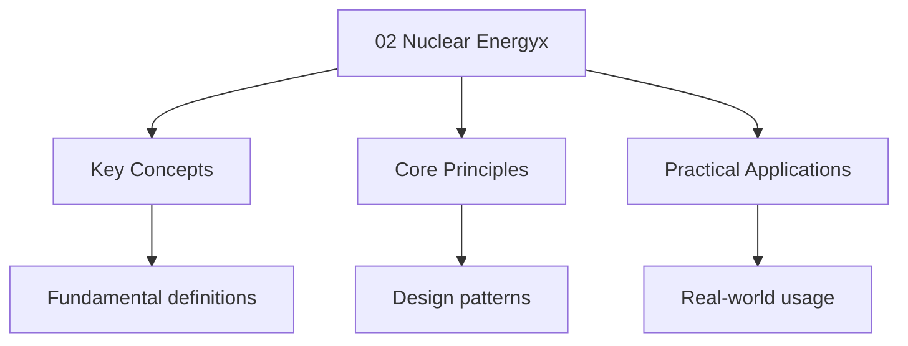

---

title: "Nuclear Energy | A-Level - Wyatt's Notes"
description: "ALEVEL Physics notes: Nuclear Energy. Comprehensive study material with definitions, examples, and assessment tools. nuclear energy study guide."
date: 2025-06-02T16:25:28.480Z
tags:
  - Physics
  - ALevel
categories:
  - Physics

---

import PhetSimulation from "@components/PhetSimulation";

## Nuclear Energy

> **Info:** Board Coverage AQA Paper 2 | Edexcel CP3 | OCR (A) Paper 2 | CIE P4
<PhetSimulation client:only="solid-js" simulationId="nuclear-fission" title="Nuclear Fission" />

Explore the simulation above to develop intuition for this topic.

## Intuition

**A tiny bit of mass contains enormous energy:** Einstein's $E = mc^2$ means mass and energy are equivalent. When a uranium nucleus splits, the fragments weigh slightly less than the original nucleus — that "missing" mass has been converted to energy. Because $c^2$ is enormous ($9 \times 10^{16}$ m²/s²), even a tiny mass defect releases huge energy.

**Why it matters:** Nuclear energy provides about 10% of the world's electricity. Understanding binding energy explains why some nuclei are stable and others decay, why nuclear power plants work, and why nuclear weapons are so destructive.

**The key insight:** Iron-56 has the highest binding energy per nucleon — it's the most stable nucleus. Elements lighter than iron can release energy through fusion (combining nuclei), while elements heavier than iron can release energy through fission (splitting nuclei). This is why the Sun fuses hydrogen into helium, not the other way around.

## 1. Mass Defect and Binding Energy

### Mass Defect

**Definition.** The mass defect $\Delta m$ is the difference between the mass of a nucleus and the
Total mass of its separated constituent nucleons. It represents the mass equivalent of the binding
Energy that holds the nucleus together.

The **mass defect** $\Delta m$ is the difference between the mass of a nucleus and the sum of the
Masses of its constituent nucleons:

$$\Delta m = Zm_p + Nm_n - m_{\mathrm{nucleus}}$$

Where $Z$ is the number of protons, $N$ is the number of neutrons, $m_p$ is the proton mass, $m_n$
Is the neutron mass, and $m_{\mathrm{nucleus}}$ is the actual nuclear mass.

The mass defect is always **positive** for stable nuclei — the nucleus is lighter than its
Constituent parts.

### Einstein's Mass-Energy Equation

**Definition.** Binding energy is the minimum energy required to completely separate a nucleus into
Its individual protons and neutrons, or equivalently, the energy released when a nucleus is formed
From its constituents.

### Derivation of Mass-Energy Equivalence

1. From Einstein's special relativity, the total energy of a body at rest is $E = mc^2$.
2. A nucleus of mass $m_{\mathrm{nucleus}}$ is lighter than its constituent nucleons by the mass
   defect $\Delta m$.
3. The "missing mass" has been converted to energy that holds the nucleus together.
4. The energy equivalent of the mass defect is the binding energy:

$$\boxed{E = \Delta m \cdot c^2}$$

$\square$

$$\boxed{E = mc^2}$$

The energy equivalent of the mass defect is the **binding energy**:

$$\boxed{E_b = \Delta m \cdot c^2}$$

This is the energy that would be required to completely separate the nucleus into its individual
Protons and neutrons. Equivalently, it is the energy released when the nucleus is formed from its
Constituents.

**Calculating mass defect.** Use atomic mass units (u), where
$1\,\mathrm u = 1.661 \times 10^{-27}$ kg, and $1\,\mathrm u \cdot c^2 = 931.5$ MeV.

Example: Binding Energy of Helium-4

Calculate the binding energy of $\prescript{4}{2}\mathrm{He}$. Given:
$m(\prescript{4}{2}\mathrm{He}) = 4.00260$ u, $m_H = 1.00783$ u (hydrogen atom mass), $m_n = 1.00867$ u.

**Answer.** $\Delta m = 2(1.00783) + 2(1.00867) - 4.00260 = 2.01566 + 2.01734 - 4.00260 = 0.03040$
U.

$E_b = 0.03040 \times 931.5 = 28.3$ MeV.

**Note.** When using atomic masses (which include electrons), use the hydrogen atom mass
$m_H = 1.00783$ u rather than the proton mass $m_p = 1.00728$ u. The electron binding energies
Cancel out.

## 2. Binding Energy per Nucleon

**Definition.** The binding energy per nucleon is the binding energy of a nucleus divided by its
Mass number $A$: $E_b/A$. It is a measure of nuclear stability — the higher the value, the more
Tightly bound the nucleus.

The **binding energy per nucleon** is a measure of nuclear stability:

$$\frac{E_b}{A} = \frac{\Delta m \cdot c^2}{A}$$

### The Binding Energy Curve

The plot of $E_b/A$ versus mass number $A$ has the following key features:

- **Light nuclei** ($A < 20$): binding energy per nucleon rises rapidly with $A$. Nuclei become more
  stable by **fusion** (combining light nuclei to reach higher $E_b/A$).
- **Iron-56** ($\prescript{56}{26}\mathrm{Fe}$): the peak of the curve at $\sim 8.8$ MeV/nucleon.
  Iron-56 is the most stable nucleus.
- **Heavy nuclei** ($A > 60$): binding energy per nucleon gradually decreases. Nuclei become more
  stable by **fission** (splitting heavy nuclei to reach higher $E_b/A$).

**Intuition.** Both fusion and fission release energy because they move nuclei towards the peak of
The binding energy curve, where $E_b/A$ is maximum. The released energy equals the increase in total
Binding energy.

### Derivation of Energy Released from the Binding Energy Curve

1. For any nuclear process, the total number of nucleons is conserved:
   $A_{\mathrm{products}} = A_{\mathrm{reactants}}$.
2. The binding energy per nucleon changes from $(E_b/A)_{\mathrm{initial}}$ to
   $(E_b/A)_{\mathrm{final}}$.
3. Total binding energy before: $E_{b,\mathrm{initial}} = (E_b/A)_{\mathrm{initial}} \times A$.
4. Total binding energy after: $E_{b,\mathrm{final}} = (E_b/A)_{\mathrm{final}} \times A$.
5. Energy released equals the increase in total binding energy:

$$\Delta E = \left[(E_b/A)_{\mathrm{final}} - (E_b/A)_{\mathrm{initial}}\right] \times A$$

$$\boxed{\Delta E = \Delta(E_b/A) \times A}$$

For **fission** of heavy nuclei: $(E_b/A)_{\mathrm{final}} > (E_b/A)_{\mathrm{initial}}$ So
$\Delta E > 0$.

For **fusion** of light nuclei: $(E_b/A)_{\mathrm{final}} > (E_b/A)_{\mathrm{initial}}$ So
$\Delta E > 0$.

$\square$

## 3. Nuclear Fission

**Definition.** Nuclear fission is the process in which a heavy nucleus splits into two (or more)
Lighter nuclei, releasing energy and one or more neutrons.

### Process

A heavy nucleus (e.g., uranium-235) absorbs a neutron and splits into two lighter nuclei (fission
Fragments), releasing energy and more neutrons:

$$\prescript{1}{0}\mathrm n + \prescript{235}{92}\mathrm U \to \prescript{236}{92}\mathrm U^* \to \prescript{141}{56}\mathrm{Ba} + \prescript{92}{36}\mathrm{Kr} + 3\prescript{1}{0}\mathrm n + \mathrm{energy}$$

### Energy Released

The fission fragments have a higher binding energy per nucleon than the parent nucleus. The energy
Released is:

$$\Delta E = (E_b/A)_{\mathrm{products}} \times A_{\mathrm{products}} - (E_b/A)_{\mathrm{parent}} \times A_{\mathrm{parent}}$$

For U-235 fission: $\Delta E \approx 200$ MeV per fission event.

### Chain Reaction

**Definition.** A chain reaction is a self-sustaining series of nuclear fission events in which
Neutrons released from each fission induce further fission events.

**Definition.** The critical mass is the minimum mass of fissile material required to sustain a
Nuclear chain reaction under given conditions.

Each fission event releases 2-3 neutrons, which can induce further fission events. If each fission
Causes exactly one further fission, the reaction is **critical** (steady). If more than one, it is
**supercritical** (increasing). If fewer, it is **subcritical** (dying out).

**Controlled chain reaction**: nuclear power stations use control rods (e.g., boron or cadmium,
Which absorb neutrons) to maintain a critical state.

**Uncontrolled chain reaction**: nuclear weapons.

## 4. Induced Fission Cross-Sections

### The Concept of Nuclear Cross-Section

**Definition.** The nuclear cross-section $\sigma$ quantifies the probability that a specific
Nuclear reaction occurs when a projectile strikes a target nucleus. It has dimensions of area.

The cross-section is defined operationally as:

$$\sigma = \frac{\mathrm{number of reactions per unit time}}{\mathrm{incident flux} \times \mathrm{number of target nuclei}}$$

The SI unit would be m$^2$ But nuclear cross-sections are so small that the standard unit is the
**barn**:

$$1\,\mathrm{barn} = 10^{-28}\,\mathrm m^2$$

The name is deliberate: a typical nuclear cross-section is "as big as a barn" compared to the
Geometric cross-section of a nucleus ($\sim \pi R^2 \sim 10^{-30}$ m$^2$). Quantum mechanical
Effects --- resonances, tunnelling, and the wave nature of particles --- make the effective
Interaction area much larger than the physical size.

### Fission Cross-Section versus Neutron Energy

The fission cross-section depends critically on neutron energy. This is the fundamental reason why
Some isotopes are "fissile" and others are merely "fertile."

For $\prescript{235}{92}\mathrm U$:

- Thermal neutron cross-section ($E \approx 0.025$ eV): $\sigma_f \approx 585$ barns
- Fast neutron cross-section ($E \approx 1$ MeV): $\sigma_f \approx 1$ barn

This roughly 500-fold decrease from thermal to fast energies is why a moderator is essential in
Thermal reactors.

### Why U-235 is Fissile but U-238 is Not

**Definition.** A **fissile** nucleus can undergo fission after absorbing a neutron of any energy,
Including thermal. A **fertile** nucleus cannot fission with thermal neutrons but can be converted
Into a fissile isotope.

The distinction follows from the odd-even binding energy effect. When a nucleus absorbs a neutron,
The compound nucleus has excitation energy equal to the binding energy of the added neutron
$E_b^{\mathrm{added}}$. Fission occurs only if this exceeds the fission barrier $E_f$.

For $\prescript{235}{92}\mathrm U + \mathrm n \to \prescript{236}{92}\mathrm U^*$:

- $\prescript{235}{92}\mathrm U$ has 143 neutrons (odd). Adding a neutron pairs the last neutron,
  gaining extra pairing energy.
- $E_b^{\mathrm{added}} \approx 6.5$ MeV while $E_f \approx 5.3$ MeV.
- Since $E_b^{\mathrm{added}} \gt E_f$Fission proceeds even with thermal neutrons.

For $\prescript{238}{92}\mathrm U + \mathrm n \to \prescript{239}{92}\mathrm U^*$:

- $\prescript{238}{92}\mathrm U$ has 146 neutrons (even). Adding a neutron creates an unpaired
  neutron with less pairing energy gain.
- $E_b^{\mathrm{added}} \approx 4.9$ MeV while $E_f \approx 5.5$ MeV.
- Since $E_b^{\mathrm{added}} \lt E_f$Thermal neutrons cannot induce fission.

:::caution
<strong>Warning But is not fissile --- it cannot sustain a chain reaction with thermal neutrons.</strong>

The only Occurring fissile isotope is U-235 (0.72\% of natural uranium).
:::
### Fast Fission of U-238

U-238 can fission, but only with neutrons above approximately 1 MeV. The condition is:

$$E_b^{\mathrm{added}} + E_n^{\mathrm{kinetic}} \gt E_f \implies 4.9 + E_n \gt 5.5 \implies E_n \gt 0.6\,\mathrm{MeV}$$

The practical threshold is quoted as $\sim 1$ MeV to account for the distribution of fission barrier
Heights and the very small cross-section just above threshold.

### The Conversion Chain: U-238 to Pu-239

Although U-238 is not fissile, it is **fertile**. It captures a neutron and is transmuted into
Pu-239 through beta decays:

$$\prescript{238}{92}\mathrm U + \mathrm n \to \prescript{239}{92}\mathrm U \xrightarrow{\beta^-,\; 23.5\,\mathrm{min}} \prescript{239}{93}\mathrm{Np} \xrightarrow{\beta^-,\; 2.36\,\mathrm{days}} \prescript{239}{94}\mathrm{Pu}$$

This conversion chain is the basis of **breeder reactors**, discussed in Section 5.

## 5. Nuclear Fission Mechanics

### Fission Fragment Mass Distribution

When a heavy nucleus fissions, the two fragments are **not** of equal mass. The distribution is
Asymmetric, producing one "heavy" fragment ($A \approx 135$--$145$) and one "light" fragment
($A \approx 90$--$100$).

The nuclear shell model explains this qualitatively. Magic numbers (2, 8, 20, 28, 50, 82, 126)
Correspond to filled nuclear shells, and nuclei near magic numbers are significantly more stable.
Asymmetric splitting allows one fragment to approach a magic neutron number ($N = 82$), which is
Energetically favourable. Symmetric splitting ($A \approx 118$ each) is roughly 100 times less
Probable.

### Prompt Neutrons versus Delayed Neutrons

**Prompt neutrons** are emitted within $\sim 10^{-14}$ s of fission as the highly deformed fragments
De-excite. 2--3 are emitted per fission.

**Delayed neutrons** are emitted on timescales of seconds to minutes by certain fission products
That undergo beta decay to excited states above the neutron separation energy. Key precursors for
U-235 thermal fission:

| Precursor                       | Half-life | Yield per 100 fissions |
| ------------------------------- | --------- | ---------------------- |
| $\prescript{87}{35}\mathrm{Br}$ | 55.7 s    | 0.027                  |
| $\prescript{137}{53}\mathrm I$ | 24.5 s    | 0.025                  |

The **delayed neutron fraction** $\beta$ is the fraction of all fission neutrons that are delayed.
For U-235, $\beta \approx 0.0065$ (0.65\%). Although tiny, these neutrons are essential for reactor
Control (see Section 6).

### Fission Product Poisoning

Some fission products have enormous neutron absorption cross-sections and can shut down the chain
Reaction.

**Xenon-135** is the worst offender:

- Thermal absorption cross-section: $\sigma_a \approx 2.65 \times 10^6$ barns (the largest known for
  any stable nuclide)
- Produced mainly by decay:
  $\prescript\{135\}\{52\}\mathrm\{Te\} \to \prescript\{135\}\{53\}\mathrm I
 \xrightarrow\{\beta^-\} \prescript\{135\}\{54\}\mathrm\{Xe\} \xrightarrow\{\beta^-\} \prescript\{135\}\{55\}\mathrm\{Cs\}$
- $\prescript{135}{54}\mathrm{Xe}$ has $t_{1/2} = 9.2$ hours

After a reactor shutdown, xenon-135 builds up from iodine-135 decay faster than it decays away. This
**iodine pit** can prevent restart for 24--48 hours.

**Samarium-149**: $\sigma_a \approx 4.1 \times 10^4$ barns, stable, and accumulates permanently.

### Energy Distribution in Fission

The $\sim 200$ MeV released per U-235 fission is distributed as follows:

| Component                         | Energy (MeV)   | Form                       |
| --------------------------------- | -------------- | -------------------------- |
| Kinetic energy of fragments       | $\sim 170$     | Heat (immediate)           |
| Kinetic energy of prompt neutrons | $\sim 5$       | Heat (after moderation)    |
| Prompt gamma rays                 | $\sim 7$       | Radiation / heat           |
| Beta particles (product decay)    | $\sim 5$       | Heat (delayed)             |
| Gamma rays (product decay)        | $\sim 6$       | Radiation / heat (delayed) |
| Anti-neutrinos                    | $\sim 12$      | Lost (escape reactor)      |
| **Total recoverable**             | **$\sim 193$** |                            |

:::caution
<strong>Warning Anti-neutrinos, which interact so weakly that they escape the reactor entirely.</strong>

When calculating Thermal power output, use $\sim 200$ MeV total but $\sim 193$ MeV recoverable. The
neutrino energy Is unrecoverable.
:::
### Breeder Reactors

A **breeder reactor** produces more fissile material than it consumes by placing fertile material
Around the core where excess neutrons convert it to fissile isotopes.

**Uranium-plutonium cycle:**

$$\prescript{238}{92}\mathrm U + \mathrm n \to \prescript{239}{92}\mathrm U \to \prescript{239}{93}\mathrm{Np} \to \prescript{239}{94}\mathrm{Pu}$$

**Thorium-uranium cycle:**

$$\prescript{232}{90}\mathrm{Th} + \mathrm n \to \prescript{233}{90}\mathrm{Th} \to \prescript{233}{91}\mathrm{Pa} \to \prescript{233}{92}\mathrm U$$

The breeding ratio
$\mathrm{BR} = \mathrm{fissile atoms produced} / \mathrm{fissile atoms consumed}$. For BR $\gt 1$
The reactor is a net producer. Fast breeder reactors using liquid sodium achieve BR
$\approx 1.2$--$1.3$. The thorium cycle is attractive because thorium is roughly $3\times$ more
Abundant than uranium and produces less long-lived transuranic waste.

### Nuclear Waste Classification

| Level              | Description                   | Examples              | Disposal                 |
| ------------------ | ----------------------------- | --------------------- | ------------------------ |
| High Level (HLW)   | Highly radioactive, high heat | Spent fuel rods       | Deep geological disposal |
| Intermediate (ILW) | Some shielding required       | Reactor components    | Engineered facilities    |
| Low Level (LLW)    | Minimal radioactivity         | Contaminated clothing | Near-surface disposal    |

:::tip
<strong>Tip Short half-life isotopes can be stored and left to decay. Long half-life isotopes</strong>

(thousands to Millions of years) require geological disposal relying on multiple barriers: waste
form (vitrification), container (steel/copper), buffer (bentonite clay), and host rock
(granite/clay).
:::
## 6. Nuclear Reactor Design

### Why Neutrons Must Be Moderated

Fission neutrons are born with energies peaking around 1--2 MeV. As established in Section 4, the
U-235 fission cross-section at thermal energies ($\sigma_f \approx 585$ barns) is roughly 500 times
Larger than at fast energies ($\sigma_f \approx 1$ barn). Without moderation, the probability of
Inducing further fission is too low to sustain a chain reaction with natural or low-enriched
Uranium.

### Moderation by Elastic Collisions

Neutrons are slowed by **elastic collisions** with light moderator nuclei. Consider a neutron of
Mass $m_n$ and kinetic energy $E$ colliding elastically with a stationary nucleus of mass $M$.

**Theorem (maximum energy loss).** The maximum fractional energy loss per head-on collision is:

$$\frac{\Delta E_{\max}}{E} = \frac{4\,m_n\,M}{(m_n + M)^2}$$

_Proof._ In the lab frame, the neutron has initial velocity $v$ and the target is at rest. After a
Head-on elastic collision, conservation of momentum and kinetic energy give the neutron's final
Velocity:

$$v' = \frac{m_n - M}{m_n + M}\,v$$

The neutron's final kinetic energy is
$E' = \frac{1}{2}m_n(v')^2 = \left(\frac{m_n - M}{m_n + M}\right)^2 E$.

Therefore:

$$\frac{\Delta E}{E} = \frac{E - E'}{E} = 1 - \left(\frac{m_n - M}{m_n + M}\right)^2 = \frac{4m_n M}{(m_n + M)^2}$$

This is maximised when $m_n = M$ (equal masses), giving $\Delta E/E = 1$: the neutron transfers all
Its energy in a single collision. $\square$

**Consequences for moderator choice:**

| Moderator                                | $M/m_n$ | $\Delta E_{\max}/E$ | Collisions to thermalise |
| ---------------------------------------- | ------- | ------------------- | ------------------------ |
| Hydrogen ($\prescript{1}{1}\mathrm H$)  | 1       | 1.000               | $\sim 18$                |
| Deuterium ($\prescript{2}{1}\mathrm H$) | 2       | 0.889               | $\sim 25$                |
| Carbon-12                                | 12      | 0.284               | $\sim 115$               |

The average logarithmic energy decrement per collision is $\xi$ And the number of collisions to
Thermalise from $E_0 = 2$ MeV to $E_{\mathrm{th}} = 0.025$ eV is $n = \ln(E_0/E_{\mathrm{th}})/\xi$.
Hydrogen is the best moderator by energy loss per collision, but it has a non-negligible absorption
Cross-section. Deuterium (in heavy water) is the best practical compromise: high energy loss with
Negligible absorption.

### Control Rods and the Multiplication Factor

Control rods are made of materials with very high neutron absorption cross-sections: boron-10
($\sigma_a \approx 3840$ barns), cadmium-113 ($\sigma_a \approx 20\,800$ barns), or hafnium.

The **multiplication factor** is:

$$k = \frac{\mathrm{neutrons in generation } n + 1}{\mathrm{neutrons in generation } n}$$

| Regime        | Condition | Behaviour                       |
| ------------- | --------- | ------------------------------- |
| Subcritical   | $k \lt 1$ | Fission rate decreases          |
| Critical      | $k = 1$   | Steady power (normal operation) |
| Supercritical | $k \gt 1$ | Power increases                 |

The **effective** multiplication factor $k_{\mathrm{eff}}$ accounts for neutron leakage and non-fuel
Absorption: $k_{\mathrm{eff}} = k_{\infty} \cdot P_{\mathrm{non-leak}}$Where $k_{\infty}$ is the
Infinite-medium factor and $P_{\mathrm{non-leak}}$ is the non-leakage probability.

:::tip
<strong>Tip Critical when $k_{\mathrm{eff}} = 1$. Control rods absorb neutrons to reduce</strong>

$k_{\mathrm{eff}}$ Below 1 for shutdown, or are adjusted to maintain $k_{\mathrm{eff}} = 1$ for
steady power."
:::
### Delayed Neutrons and Reactor Control

This is one of the most important engineering facts about nuclear reactors. Without delayed
Neutrons, controlling a reactor would be essentially impossible on human timescales.

**Theorem.** The reactor response time is governed by delayed neutrons, not the prompt neutron
Lifetime, provided $k_{\mathrm{eff}} \lt 1 + \beta$.

_Proof._ The prompt neutron lifetime is $\ell \approx 10^{-4}$ s. If $k_{\mathrm{eff}} = 1.001$
(0.1\% supercritical) with only prompt neutrons, the power grows as:

$$P(t) = P_0 \, e^{(k-1)t/\ell} = P_0 \, e^{0.001 \times t / 10^{-4}} = P_0 \, e^{10\,t}$$

Power doubles every $\ln 2 / 10 \approx 0.069$ s. No mechanical system can respond this fast.

With delayed neutrons (fraction $\beta \approx 0.0065$ for U-235), the reactor is "prompt
Subcritical" when $1 \lt k_{\mathrm{eff}} \lt 1 + \beta$. In this regime, the neutron population
Grows on the timescale of the longest-lived delayed precursor ($\sim 55$ s for Br-87), not the
Prompt lifetime. The effective time constant becomes:

$$\tau_{\mathrm{eff}} \approx \frac{\beta / \bar{\lambda}}{k_{\mathrm{eff}} - 1}$$

Where $\bar{\lambda} \approx 0.08\,\mathrm s^{-1}$. For $k_{\mathrm{eff}} = 1.001$:
$\tau_{\mathrm{eff}} \approx 0.0065 / (0.08 \times 0.001) \approx 81$ s --- manageable by Mechanical
control systems. $\square$

:::caution
<strong>Warning Responds on the timescale set by delayed neutrons ($\sim$Tens of seconds),</strong>

provided $k_{\mathrm{eff}} \lt 1 + \beta$. Only if $k_{\mathrm{eff}}$ exceeds $1 + \beta$ does the
reactor Become "prompt supercritical" and uncontrollable.
:::
### Coolant

The coolant transfers heat from the fuel to the steam generators or turbine. Requirements: high
Thermal conductivity and specific heat capacity, low neutron absorption, chemical stability under
Radiation, and high boiling point.

| Coolant              | Used in      | Advantages                             | Disadvantages                                |
| -------------------- | ------------ | -------------------------------------- | -------------------------------------------- |
| Light water          | PWR, BWR     | Cheap, good moderator                  | Boils at 100 deg C (1 atm), absorbs neutrons |
| Heavy water (D$_2$O) | CANDU        | Excellent moderator, low absorption    | Expensive                                    |
| Carbon dioxide       | AGR          | Chemically inert, no phase change      | Lower heat capacity                          |
| Liquid sodium        | Fast breeder | Excellent heat transfer, no moderation | Reacts violently with water/air              |

### Fuel and Enrichment

Natural uranium is $\sim 0.72\%$ U-235 and $\sim 99.28\%$ U-238. Thermal reactors require enriched
Uranium: light water reactors use 3--5\% U-235, research reactors up to 20\%. Fuel is fabricated as
Ceramic UO$_2$ pellets sealed in zirconium alloy (zircaloy) cladding tubes, assembled into fuel rods
And bundles.

### Shielding

Radiation shielding protects personnel and the environment. **Concrete** (cheap, dense, contains
Hydrogen for neutron moderation) provides bulk biological shielding. **Lead** (very dense) is used
For compact gamma shielding. **Water** provides both shielding and moderation in spent fuel pools.

### PWR versus AGR Comparison

| Feature             | PWR                                 | AGR                                         |
| ------------------- | ----------------------------------- | ------------------------------------------- |
| Moderator           | Light water                         | Graphite                                    |
| Coolant             | Pressurised water ($\sim 155$ bar)  | CO$_2$ gas ($\sim 40$ bar)                  |
| Fuel                | Enriched UO$_2$ (3--5\%)            | Enriched UO$_2$ (2--3\%) in stainless steel |
| Coolant temperature | $\sim 315$ deg C                    | $\sim 650$ deg C                            |
| Thermal efficiency  | $\sim 33\%$                         | $\sim 41\%$                                 |
| Steam cycle         | Secondary loop (no boiling in core) | Direct (CO$_2$ heats water in boiler)       |

:::tip
<strong>Tip Moderator and coolant (simpler but lower efficiency), while AGRs separate them (graphite</strong>

moderator, CO$_2$ coolant), allowing higher temperature and thus higher efficiency from
$\eta \lt 1 - T_c/T_h$.
:::
## 7. Nuclear Fusion

**Definition.** Nuclear fusion is the process in which two light nuclei combine to form a heavier
Nucleus, releasing energy due to the increase in binding energy per nucleon.

### Process

Two light nuclei combine to form a heavier nucleus, releasing energy:

$$\prescript{2}{1}\mathrm H + \prescript{3}{1}\mathrm H \to \prescript{4}{2}\mathrm{He} + \prescript{1}{0}\mathrm n + 17.6\,\mathrm{MeV}$$

### Conditions for Fusion

For fusion to occur, the nuclei must overcome the **Coulomb barrier** — the electrostatic repulsion
Between positively charged nuclei. This requires:

1. **Extremely high temperatures** ($\sim 10^8$ K) to give nuclei sufficient kinetic energy
2. **High particle density** to ensure frequent collisions
3. **Confinement** for long enough for fusion to occur

**Magnetic confinement** (tokamak) and **inertial confinement** (laser fusion) are two approaches.

### Why Fusion is Harder than Fission

Fission is initiated by a neutral particle (neutron), so there is no Coulomb barrier to overcome.
Fusion requires positively charged nuclei to approach within $\sim 10^{-15}$ m, requiring enormous
Kinetic energy to overcome the Coulomb repulsion.

:::note
<strong>Board Note AQA and Edexcel focus on the qualitative aspects of fission and fusion. CIE may</strong>

Require calculation of energy released from mass defect.
:::
## 8. Nuclear Fusion in Detail

### The Proton-Proton Chain

The pp chain is the dominant fusion process in main-sequence stars with mass $\lt 1.5\,M_\odot$
(solar masses). It proceeds in three steps:

**Step 1** (rate-limiting, mediated by the weak interaction):

$$\prescript{1}{1}\mathrm H + \prescript{1}{1}\mathrm H \to \prescript{2}{1}\mathrm H + \mathrm e^+ + \nu_e + 0.42\,\mathrm{MeV}$$

One proton must undergo inverse beta decay ($p \to n + e^+ + \nu_e$), which requires the weak force
And is extraordinarily slow --- mean time $\sim 10^{10}$ years in the solar core. This slowness is
Why the Sun has a long lifetime.

**Step 2**:

$$\prescript{2}{1}\mathrm H + \prescript{1}{1}\mathrm H \to \prescript{3}{2}\mathrm{He} + \gamma + 5.49\,\mathrm{MeV}$$

**Step 3** (dominant branch, $\sim 85\%$ probability):

$$\prescript{3}{2}\mathrm{He} + \prescript{3}{2}\mathrm{He} \to \prescript{4}{2}\mathrm{He} + 2\prescript{1}{1}\mathrm H + 12.86\,\mathrm{MeV}$$

**Net reaction:**
$4\prescript{1}{1}\mathrm H \to \prescript{4}{2}\mathrm{He} + 2\mathrm e^+ + 2\nu_e + 2\gamma + 26.7\,\mathrm{MeV}$

### The CNO Cycle

In stars more massive than $\sim 1.5\,M_\odot$The CNO cycle dominates. Carbon, nitrogen, and Oxygen
act as catalysts:

$$\prescript{12}{6}\mathrm C \xrightarrow{+\mathrm p} \prescript{13}{7}\mathrm N \xrightarrow{\beta^+} \prescript{13}{6}\mathrm C \xrightarrow{+\mathrm p} \prescript{14}{7}\mathrm N \xrightarrow{+\mathrm p} \prescript{15}{8}\mathrm O \xrightarrow{\beta^+} \prescript{15}{7}\mathrm N \xrightarrow{+\mathrm p} \prescript{12}{6}\mathrm C + \prescript{4}{2}\mathrm{He}$$

**Net reaction:** $4\mathrm p \to \prescript{4}{2}\mathrm{He} + 26.7$ MeV (identical to the pp
Chain).

The CNO cycle rate scales as $\propto T^{16\mathrm{--}20}$ (for the slowest step) versus
$\propto T^4$ for the pp chain. At $T \gt 1.5 \times 10^7$ K the CNO cycle dominates. It also
Produces a steeper temperature gradient in the stellar core, driving convection in massive stars.

### The Lawson Criterion

For net energy output, the fusion power must exceed power losses. John Lawson (1957) derived the
Minimum condition for D-T fusion:

$$n\tau \gt 10^{20}\,\mathrm s\,\mathrm m^{-3}$$

Where $n$ is the ion density (m$^{-3}$) and $\tau$ is the energy confinement time (s).

**Derivation sketch.** Fusion power density:
$P_\{\mathrm\{fus\}\} = \frac\{1\}\{4\}n^2\langle\sigma v\rangle
E_\{\mathrm\{fus\}\}$, where
$\langle\sigma v\rangle$ is the reactivity (Maxwell-Boltzmann averaged) and the factor of $1/4$
Accounts for equal D and T densities. Power lost by thermal conduction is
$P_{\mathrm{loss}} = 3nkT/\tau$. Setting $P_{\mathrm{fus}} \ge P_{\mathrm{loss}}$ and substituting
The temperature-dependent $\langle\sigma v\rangle$ yields the Lawson criterion. The exact numerical
Value depends on fuel choice and loss model.

The triple product $nT\tau \gt 3 \times 10^{21}\,\mathrm{keV}\,\mathrm s\,\mathrm m^{-3}$ is
Sometimes quoted as an equivalent form.

### Tokamak Design

A tokamak confines hot plasma in a toroidal (doughnut-shaped) chamber using magnetic fields:

- **Toroidal field** $B_t$: produced by coils wound around the torus, prevents outward radial drift.
- **Poloidal field** $B_p$: produced by the plasma current itself (induced by a central solenoid),
  prevents vertical drift.
- The combined helical field lines confine particles as they spiral along them.

The safety factor $q = rB_t / RB_p$ (minor radius $r$Major radius $R$) must satisfy $q \gt 1$
Everywhere for stability.

### Inertial Confinement Fusion

In inertial confinement fusion (ICF), a small D-T pellet is compressed by laser or particle beams.
The outer layer ablates outward, driving an inward implosion that compresses the fuel to
$\sim 10^3\times$ solid density. The central "hot spot" reaches $\sim 10$ keV ($\sim 10^8$ K),
Initiating fusion before the pellet disassembles. Confinement relies on the inertia of the fuel
Itself --- no magnetic fields are needed.

### Why D-T is the Easiest Fusion Reaction

$$\prescript{2}{1}\mathrm H + \prescript{3}{1}\mathrm H \to \prescript{4}{2}\mathrm{He} + \mathrm n + 17.6\,\mathrm{MeV}$$

D-T has the lowest Coulomb barrier of any practical fuel combination: tritium has the largest
Nuclear radius relative to its charge, the $Q$-value of 17.6 MeV is the highest per reaction of any
D-based fuel, and the reactivity $\langle\sigma v\rangle$ peaks at the lowest temperature ($\sim 70$
KeV versus $\sim 500$ keV for D-D). However, tritium ($t_{1/2} = 12.3$ years) must be bred from
Lithium:

$$\prescript{6}{3}\mathrm{Li} + \mathrm n \to \prescript{4}{2}\mathrm{He} + \prescript{3}{1}\mathrm H + 4.8\,\mathrm{MeV}$$

### The ITER Project

ITER (International Thermonuclear Experimental Reactor), under construction in Cadarache, France,
Aims to demonstrate $Q \ge 10$ (fusion gain: 10 times more power out than heating power in). Key
Parameters: major radius 6.2 m, magnetic field 5.3 T, plasma current 15 MA, fusion power 500 MW from
50 MW input heating, pulse duration $\sim 400$ s. ITER is a proof-of-concept; electricity generation
Is the goal of the subsequent DEMO reactor.

### Stellar Nucleosynthesis: The Iron Peak

The binding energy per nucleon curve peaks near iron-56. This has a profound consequence:

- Fusion of nuclei lighter than iron: **exothermic** (releases energy)
- Fusion of nuclei heavier than iron: **endothermic** (absorbs energy)
- Fission of nuclei heavier than iron: **exothermic**

In massive stars, successive fusion stages build heavier elements: H $\to$ He ($T \sim 10^7$ K), He
$\to$ C/O ($T \sim 10^8$ K), C $\to$ Ne/Mg, Ne $\to$ O/Mg, O $\to$ Si/S, Si $\to$ Fe
($T \sim 3 \times 10^9$ K). The process stops at iron because further fusion is endothermic. When
The iron core exceeds the Chandrasekhar limit ($\sim 1.4\,M_\odot$), it collapses and triggers a
Supernova, whose energy drives the creation of elements heavier than iron via the s-process and
R-process.

:::caution
<strong>Warning Strictly, Ni-62 has the highest $E_b/A$ (8.7945 MeV/nucleon versus Fe-56's 8.7906</strong>

MeV/nucleon), but Fe-56 is produced in greater abundance because the alpha process favours nuclei
with $N = Z$.
:::
## Problem Set

Problem 1

Calculate the mass defect of $\prescript{56}{26}\mathrm{Fe}$. Given:
$m(\prescript{56}{26}\mathrm{Fe}) = 55.93493$ u, $m_H = 1.00783$ u (hydrogen atom mass), $m_n = 1.00867$ u.

**Answer.**
$\Delta m = 26(1.00783) + 30(1.00867) - 55.93493 = 26.20358 + 30.26010 - 55.93493 = 0.52875$ u.

$E_b = 0.52875 \times 931.5 = 492.5$ MeV. $E_b/A = 492.5/56 = 8.79$ MeV/nucleon.

<b>If you get this wrong, revise:</b>
[Mass Defect and Binding Energy](#1-mass-defect-and-binding-energy)

Problem 2

The binding energy per nucleon of $\prescript{235}{92}\mathrm U$ is 7.59 MeV. When it undergoes
Fission into two nuclei each with binding energy per nucleon of 8.40 MeV, calculate the energy
Released per fission.

**Answer.** Total binding energy before: $235 \times 7.59 = 1783.65$ MeV. Total binding energy
After: $235 \times 8.40 = 1974$ MeV. Energy released $= 1974 - 1783.65 = 190.35$ MeV $\approx 190$
MeV.

<b>If you get this wrong, revise:</b> [Binding Energy per Nucleon](#2-binding-energy-per-nucleon)

Problem 3

Explain why energy is released in both nuclear fission and nuclear fusion, using the binding energy
Per nucleon curve.

**Answer.** The binding energy per nucleon curve peaks at iron-56 ($\sim 8.8$ MeV/nucleon). Fission
Splits heavy nuclei (which have lower $E_b/A$ than the peak) into lighter fragments (which have
Higher $E_b/A$). Fusion combines light nuclei (which have lower $E_b/A$) into heavier ones (which
Have higher $E_b/A$). In both cases, the total binding energy increases, and the difference is
Released as energy.

<b>If you get this wrong, revise:</b> [The Binding Energy Curve](#the-binding-energy-curve)

Problem 4

Calculate the energy released when a proton and neutron combine to form a deuteron
($\prescript{2}{1}\mathrm H$). Given: $m_p = 1.67262 \times 10^{-27}$ kg,
$m_n = 1.67493 \times 10^{-27}$ kg, $m_d = 3.34358 \times 10^{-27}$ kg, $c = 3.0 \times 10^8$ m
S$^{-1}$.

**Answer.** $\Delta m = m_p + m_n - m_d = 1.67262 + 1.67493 - 3.34358 = 0.00397 \times 10^{-27}$ kg.

$E = \Delta m c^2 = 0.00397 \times 10^{-27} \times 9.0 \times 10^{16} = 3.57 \times 10^{-13}$ J
$= 2.23$ MeV.

<b>If you get this wrong, revise:</b>
[Mass Defect and Binding Energy](#1-mass-defect-and-binding-energy)

Problem 5

In a nuclear reactor, each fission of U-235 releases 200 MeV and produces on average 2.5 neutrons.
If the reactor is operating at a power of 500 MW, calculate the number of fissions per second.

**Answer.** Energy per fission $= 200$ MeV
$= 200 \times 10^6 \times 1.60 \times 10^{-19} = 3.2 \times 10^{-11}$ J.

Number of fissions per second $= 500 \times 10^6 / 3.2 \times 10^{-11} = 1.56 \times 10^{19}$
S$^{-1}$.

<b>If you get this wrong, revise:</b> [Nuclear Fission](#3-nuclear-fission)

Problem 6

Explain the role of a moderator and control rods in a nuclear fission reactor.

**Answer.** **Moderator** (e.g., graphite or water): slows down fast fission neutrons to thermal
Energies. Slow (thermal) neutrons have a much larger fission cross-section for U-235, making the
Chain reaction more efficient. **Control rods** (e.g., boron or cadmium): absorb neutrons without
Fissioning. By adjusting their depth, the number of neutrons available for fission is controlled,
Maintaining the reactor in a critical state (one fission per fission, on average).

<b>If you get this wrong, revise:</b> [Chain Reaction](#chain-reaction)

Problem 7

The fusion reaction
$\prescript{2}{1}\mathrm H + \prescript{2}{1}\mathrm H \to \prescript{3}{2}\mathrm{He} + \prescript{1}{0}\mathrm n$
Releases 3.27 MeV. Given the masses: $m(\prescript{2}{1}\mathrm H) = 2.01410$ u,
$m(\prescript{3}{2}\mathrm{He}) = 3.01603$ u, $m_n = 1.00867$ u. Verify the energy release using the
Mass defect.

**Answer.** Total mass before: $2 \times 2.01410 = 4.02820$ u. Total mass after:
$3.01603 + 1.00867 = 4.02470$ u.

$\Delta m = 4.02820 - 4.02470 = 0.00350$ u. $E = 0.00350 \times 931.5 = 3.26$ MeV $\approx 3.27$
MeV. $\checkmark$

<b>If you get this wrong, revise:</b> [Nuclear Fusion](#7-nuclear-fusion)

Problem 8

Why does nuclear fusion require extremely high temperatures but fission does not?

**Answer.** Fission is initiated by neutrons, which carry no charge and therefore experience no
Coulomb repulsion from the nucleus. They can approach the nucleus freely and be absorbed. Fusion
Requires two positively charged nuclei to approach within $\sim 10^{-15}$ m (the range of the strong
Nuclear force), but the Coulomb repulsion between like charges creates an energy barrier of
$\sim$MeV. Extremely high temperatures ($\sim 10^8$ K) are needed to give nuclei sufficient kinetic
Energy (via the Maxwell-Boltzmann distribution) to overcome this barrier.

<b>If you get this wrong, revise:</b> [Conditions for Fusion](#conditions-for-fusion)

Problem 9

Calculate the energy released by the fission reaction
$\mathrm n + \prescript{235}{92}\mathrm U \to \prescript{141}{56}\mathrm{Ba} + \prescript{92}{36}\mathrm{Kr} + 3\mathrm n$.
Given: $m_n = 1.00867$ u, $m(\prescript{235}{92}\mathrm U) = 235.04393$ u,
$m(\prescript{141}{56}\mathrm{Ba}) = 140.91440$ u, $m(\prescript{92}{36}\mathrm{Kr}) = 91.92627$ u.

**Answer.** Reactants: $1.00867 + 235.04393 = 236.05260$ u. Products:
$140.91440 + 91.92627 + 3(1.00867) = 140.91440 + 91.92627 + 3.02601 = 235.86668$ u.

$\Delta m = 236.05260 - 235.86668 = 0.18592$ u.

$E = 0.18592 \times 931.5 = 173.2$ MeV.

<b>If you get this wrong, revise:</b> [Nuclear Fission](#3-nuclear-fission)

Problem 10

Calculate the number of elastic collisions required to thermalise a 2 MeV neutron to 0.025 eV
Using (a) graphite moderator ($\xi = 0.158$) and (b) heavy water moderator ($\xi = 0.725$).

**Answer.** The number of collisions is $n = \ln(E_0 / E_{\mathrm{th}}) / \xi$.

$E_0 / E_{\mathrm{th}} = 2 \times 10^6 / 0.025 = 8 \times 10^7$. $\ln(8 \times 10^7) = 18.20$.

(a) Graphite: $n = 18.20 / 0.158 = 115$ collisions. (b) Heavy water:
$n = 18.20 / 0.725 = 25.1 \approx 25$ collisions.

Heavy water is roughly 4.6 times more efficient at thermalising neutrons per collision.

<b>If you get this wrong, revise:</b>
[Moderation by Elastic Collisions](#moderation-by-elastic-collisions)

Problem 11

A breeder reactor operates at 500 MW thermal power. Each fission of U-235 releases 200 MeV, and
0.3 neutrons per fission are captured by U-238 to produce Pu-239. Calculate the annual Pu-239
Production rate in kg.

**Answer.** Fissions per second
$= 500 \times 10^6 / (200 \times 10^6 \times 1.60 \times 10^\{-19\})
= 1.5625 \times 10^\{19\}$ s$^\{-1\}$.

Pu-239 atoms produced per second $= 0.3 \times 1.5625 \times 10^{19} = 4.6875 \times 10^{18}$
S$^{-1}$.

Mass per second $= 4.6875 \times 10^{18} \times 239 \times 1.661 \times 10^{-27}$
$= 1.86 \times 10^{-6}$ kg/s.

Annual production $= 1.86 \times 10^{-6} \times 3.156 \times 10^7 = 58.7$ kg/year.

<b>If you get this wrong, revise:</b> [Breeder Reactors](#breeder-reactors)

Problem 12

A D-T fusion plasma has ion density $n = 1.2 \times 10^{20}$ m$^{-3}$ and energy confinement time
$\tau = 0.8$ s. Does this satisfy the Lawson criterion?

**Answer.** Lawson criterion for D-T: $n\tau \gt 10^{20}\,\mathrm s\,\mathrm m^{-3}$.

$n\tau = 1.2 \times 10^{20} \times 0.8 = 9.6 \times 10^{19}\,\mathrm s\,\mathrm m^{-3}$.

Since $9.6 \times 10^{19} \lt 10^{20}$This does **not** satisfy the Lawson criterion. The plasma
Must achieve either higher density or longer confinement time.

<b>If you get this wrong, revise:</b> [The Lawson Criterion](#the-lawson-criterion)

Problem 13

A reactor produces $2.0 \times 10^{19}$ fissions per second. The recoverable energy per fission is
193 MeV (excluding neutrinos). Calculate the thermal power output in MW.

**Answer.** Power $= 2.0 \times 10^{19} \times 193 \times 10^6 \times 1.60 \times 10^{-19}$
$= 2.0 \times 10^{19} \times 3.088 \times 10^{-11}$ $= 6.18 \times 10^8$ W $= 618$ MW.

<b>If you get this wrong, revise:</b>
[Energy Distribution in Fission](#energy-distribution-in-fission)

Problem 14

$\prescript{16}{8}\mathrm O$ has binding energy per nucleon $E_b/A = 7.98$ MeV/nucleon. A
Hypothetical fission of $\prescript{16}{8}\mathrm O$ into two $\prescript{8}{4}\mathrm{Be}$ nuclei
(each with $E_b/A = 7.06$ MeV/nucleon) is proposed. Determine whether this fission releases or
Absorbs energy, and explain using the binding energy curve.

**Answer.** Total binding energy before: $16 \times 7.98 = 127.68$ MeV. Total binding energy after:
$2 \times 8 \times 7.06 = 112.96$ MeV.

$\Delta E = 112.96 - 127.68 = -14.72$ MeV.

Energy is **absorbed**, not released. This is consistent with the binding energy curve: nuclei
Lighter than iron (peak at $\sim 8.8$ MeV/nucleon) release energy through **fusion** (moving toward
Higher $E_b/A$), not fission. Splitting a light nucleus moves it away from the peak.

<b>If you get this wrong, revise:</b> [The Binding Energy Curve](#the-binding-energy-curve)

Problem 15

A fission product in nuclear waste has a half-life of 30.2 years and an initial activity of
$5.0 \times 10^{12}$ Bq. The safe disposal threshold is $1.0 \times 10^6$ Bq. How many years must
Elapse before this waste can be reclassified as low-level?

**Answer.** $A = A_0 \cdot 2^{-t/t_{1/2}}$ So
$2^\{-t/t_\{1/2\}\} = A/A_0 = 10^6 / (5 \times 10^\{12\})
= 2 \times 10^\{-7\}$.

$t = -t_{1/2} \cdot \log_2(2 \times 10^{-7}) = -30.2 \times \frac{\ln(2 \times 10^{-7})}{\ln 2}$

$\ln(2 \times 10^{-7}) = \ln 2 - 7 \ln 10 = 0.693 - 16.118 = -15.425$

$t = -30.2 \times (-15.425 / 0.693) = -30.2 \times (-22.26) = 672$ years.

<b>If you get this wrong, revise:</b> [Nuclear Waste Classification](#nuclear-waste-classification)

Problem 16

The D-T fusion reaction releases 17.6 MeV from 5 nucleons. U-235 fission releases approximately
200 MeV from 235 nucleons. Calculate and compare the energy released per nucleon for each reaction.
What does this imply about the relative energy density of fusion versus fission fuel?

**Answer.** Fusion: $17.6 / 5 = 3.52$ MeV/nucleon. Fission: $200 / 235 = 0.851$ MeV/nucleon.

Ratio: $3.52 / 0.851 = 4.14$.

Fusion releases roughly 4 times more energy per nucleon than fission. This means fusion fuel has a
Higher energy density per unit mass: 1 kg of D-T fuel ($N = 5$ nucleons per reaction, $N_A / 5$
Reactions per mole) yields approximately 4 times the energy of 1 kg of U-235 fuel. This is why
Fusion, if achieved practically, promises such high energy output per unit fuel mass.

<b>If you get this wrong, revise:</b>
[Why D-T is the Easiest Fusion Reaction](#why-d-t-is-the-easiest-fusion-reaction)

---

:::tip
<strong>Tip Ready to test your understanding of **Nuclear Energy**? The contains the hardest</strong>

questions within the A-Level specification for this topic, each with a full worked solution.

**Unit tests** probe edge cases and common misconceptions. **Integration tests** combine Nuclear
Energy with other physics topics to test synthesis under exam conditions.

See for instructions on
self-marking and building a personal test matrix.
:::
:::danger
<strong>Danger</strong>

- **Confusing nuclear fission with nuclear fusion:** Fission splits a HEAVY nucleus into lighter
  fragments (uranium-235 split by a neutron). Fusion joins LIGHT nuclei into a heavier one (hydrogen
  isotopes fusing into helium). Both release energy because the binding energy per nucleon curve
  peaks around iron-56. Fission and fusion move towards this peak from opposite sides.

- **Misunderstanding mass defect and binding energy:** Mass defect is the difference between the
  mass of a nucleus and the sum of its constituent nucleon masses. Binding energy is the energy
  EQUIVALENT of this mass defect (E = delta_m \* c squared). A larger binding energy per nucleon
  means a MORE stable nucleus, not that it has more energy available.

- **Forgetting the role of the moderator and control rods:** In a nuclear reactor, the moderator
  (e.g., graphite, water) SLOWS DOWN fast neutrons so they can be captured by uranium-235 (which
  preferentially absorbs slow neutrons). Control rods (e.g., boron, cadmium) ABSORB neutrons to
  control the rate of reaction. These serve different purposes and students frequently confuse them.

- **Assuming all uranium isotopes are fissile:** Only uranium-235 (about 0.7% of natural uranium) is
  readily fissile by slow neutrons. Uranium-238 (99.3%) can capture fast neutrons but generally does
  not undergo fission -- instead it becomes plutonium-239 after beta decays. Enrichment increases
  the proportion of U-235.
:::
## Common Pitfalls

1. Confusing atomic number (protons) with mass number (protons + neutrons).

2. Forgetting that radioactive decay is random and spontaneous. It cannot be predicted for
   individual nuclei.

3. Misunderstanding that half-life is constant regardless of the initial amount of substance.

4. Using the wrong equation from the data sheet. Take time to read the full equation, including
   conditions and variable definitions.

5. Forgetting to include units in final answers, especially when working with derived units like
   $\text{N}\,\text{kg}^{-1}\,\text{m}^2$.

6. Incorrectly applying $\vec{F} = m\vec{a}$ when forces are not collinear. Resolve into components
   first.

## Summary

The key principles covered in this topic are linked in the sub-pages above. Focus on understanding
the definitions, applying the formulas or frameworks, and evaluating strengths and limitations of
each approach.

## Worked Examples

Worked examples demonstrating the application of key concepts are covered in the detailed sub-pages
linked above.

---

## Common Mistakes

**Confusing fission and fusion:** Fission is splitting heavy nuclei into lighter ones (uranium-235). Fusion is combining light nuclei into heavier ones (hydrogen into helium). Fission is used in nuclear power plants; fusion powers the Sun. Students often mix up which is which.

**Forgetting that mass is converted to energy:** In nuclear reactions, the mass of products is less than the mass of reactants. This "missing" mass has been converted to energy via $E = mc^2$. Students often forget to calculate the mass defect.

**Misusing $E = mc^2$:** This equation relates energy and mass. The mass must be in kilograms and the result is in joules. Students often forget to convert atomic mass units to kilograms or use the wrong units.

**Confusing binding energy with binding energy per nucleon:** Total binding energy is the energy needed to separate all nucleons. Binding energy per nucleon is total binding energy divided by mass number. The latter determines nuclear stability — higher means more stable. Iron-56 has the highest binding energy per nucleon.

**Forgetting that fusion requires extreme temperatures:** Fusion requires temperatures of millions of degrees to overcome electrostatic repulsion between positively charged nuclei. This is why fusion reactors are so difficult to build. Students often underestimate the energy requirements.

## Cross-References

- [Radioactivity](./01-radioactivity.mdx): Provides the foundation of nuclear decay processes that underpin both fission and fusion.
- [Quantum Physics](./03-quantum-physics.mdx): Explains the quantum mechanical principles that govern nuclear stability and decay rates.
- [Binding Energy](/physics/binding-energy): Explores the mass-energy relationship in more detail, including binding energy per nucleon curves.
- [Nuclear Reactors](/physics/nuclear-reactors): Examines the practical engineering of fission reactors, including moderators and control rods.
