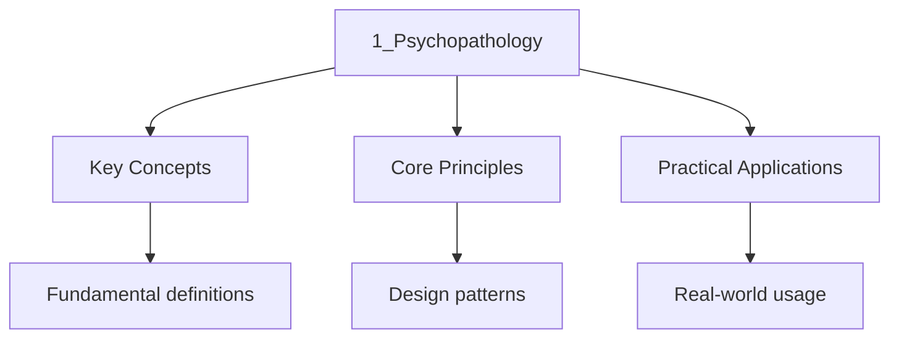

---

title: "Psychopathology | A-Level - Wyatt's Notes"
date: 2026-05-12T00:00:00.000Z
tags:
  - alevel
  - alevel-psychology
categories:
  - alevel-psychology
description: "A-Level Psychology Psychopathology notes covering key definitions, core concepts, worked examples, and practice questions for complete revision."

---

<!-- Breadcrumb Schema for SEO -->

## Psychopathology

## Introduction

Psychopathology is the study of mental disorders, including their definitions, explanations, and
treatments. This section covers the four definitions of abnormality, and three specific disorders —
depression, phobias, and obsessive-compulsive disorder (OCD) — examining their behavioural,
cognitive, and biological explanations alongside evidence-based treatments.

## Key Concepts

### Definitions of Abnormality

1. **Deviation from Social Norms:** Behaviour that violates the unwritten rules of acceptable
   behaviour in a particular society or culture. For example, hearing voices or wearing
   inappropriate clothing for the weather may be considered abnormal.
   - _Strength:_ Distinguishes desirable and undesirable behaviour; accounts for the effect that
     abnormal behaviour has on others.
   - _Limitation:_ Highly culturally relative — social norms vary between cultures and change over
     time. Homosexuality was classified as a mental disorder until 1973. Risk of abuse (e.g.,
     political dissidents diagnosed as mentally ill in the Soviet Union).

2. **Failure to Function Adequately:** A person is considered abnormal if they are unable to cope
   with the demands of everyday life. Rosenhan and Seligman (1989) proposed seven criteria:
   suffering, maladaptiveness, vividness/unconventionality, unpredictability/loss of control,
   irrationality, observer discomfort, and violation of moral/ideal standards.
   - _Strength:_ Practical and measurable — includes a threshold for professional help; captures the
     experience of the individual.
   - _Limitation:_ Subjective judgement — who decides what "adequate functioning" means? Some
     behaviour (e.g., extreme sports, religious fasting) may appear dysfunctional but is chosen and
     adaptive. Adaptive or maladaptive depends on context.

3. **Deviation from Ideal Mental Health:** Jahoda (1958) identified six criteria for ideal mental
   health: positive attitudes towards the self, self-actualisation, resistance to stress, personal
   autonomy, accurate perception of reality, and adapting to the environment.
   - _Strength:_ Comprehensive — covers a broad range of criteria for mental health; positive focus
     on health rather than illness.
   - _Limitation:_ Unrealistically high standard — very few people meet all six criteria all the
     time. Culturally biased towards Western individualist values (personal autonomy,
     self-actualisation).

4. **Statistical Infrequency:** Behaviour that is statistically rare is considered abnormal. For
   example, an IQ score below 70 (approximately the bottom 2% of the population) is classified as
   intellectual disability.
   - _Strength:_ Objective and measurable; clear, quantitative threshold.
   - _Limitation:_ Some rare behaviours are desirable (e.g., IQ above 130) and some common
     behaviours are undesirable (e.g., depression affects approximately 1 in 6 people). Statistical
     infrequency alone is insufficient.

### Depression

**Characteristics:**

- **Emotional:** Persistent low mood, sadness, loss of pleasure (anhedonia), feelings of
  worthlessness, guilt, anger.
- **Behavioural:** Reduced activity, social withdrawal, disruption of sleep and appetite,
  tearfulness, lethargy.
- **Cognitive:** Difficulty concentrating, negative thoughts, hopelessness, irrational beliefs,
  dwelling on the past.
- **Physical:** Weight change, fatigue, psychomotor agitation or retardation.

**Cognitive Explanations:**

**Beck"s Cognitive Triad (1967):** Beck proposed that depression is maintained by three components
of negative thinking:

1. **Negative thoughts about the self** ("I am worthless")
2. **Negative thoughts about the world** ("The world is unfair")
3. **Negative thoughts about the future** ("Things will never get better")

These negative schemas develop from early experiences and are activated by stressful life events.
Beck also identified **cognitive distortions** — errors in thinking that maintain depression,
including overgeneralisation, magnification (catastrophising), and selective abstraction (focusing
on negative details while ignoring positive information).

**Ellis's ABC Model (1962):** Ellis proposed that depression is caused by irrational beliefs
activated by external events:

- **A — Activating event:** An external event that triggers the response (e.g., failing an exam).
- **B — Beliefs:** The individual's irrational beliefs about the event (e.g., "I am a total
  failure").
- **C — Consequences:** The emotional and behavioural consequences of the belief (e.g., depression).

Ellis argued that it is not the event itself that causes depression, but the individual's irrational
interpretation of it. He identified specific irrational beliefs called **musturbatory thinking** —
"I must be perfect," "Others must treat me well," "The world must be easy."

**Cognitive Treatments:**

**Cognitive Behavioural Therapy (CBT):** Combines cognitive techniques (identifying and challenging
irrational beliefs) with behavioural techniques (behavioural activation, homework assignments). The
therapist helps the client identify negative automatic thoughts, test them against reality, and
replace them with more rational, balanced alternatives.

For Beck's approach, CBT involves identifying the negative triad and challenging cognitive
distortions through evidence-gathering and Socratic questioning.

For Ellis's approach, **Rational Emotive Behaviour Therapy (REBT)** focuses on identifying and
disputing (D) irrational beliefs, leading to effective (E) new philosophy — extended to ABCDE.

**Biological Explanation:**

The **monoamine hypothesis** suggests that depression is caused by low levels of monoamine
neurotransmitters, particularly serotonin (mood regulation), noradrenaline (arousal and energy), and
dopamine (pleasure and reward).

**Biological Treatment:**

**Antidepressant drugs:** Selective serotonin reuptake inhibitors (SSRIs, e.g., Prozac/fluoxetine)
increase serotonin availability by blocking its reabsorption (reuptake) in the synaptic cleft,
making more serotonin available to bind with postsynaptic receptors. Tricyclics (e.g., imipramine)
block the reuptake of serotonin and noradrenaline but have more side effects.

### Phobias

**Characteristics:**

- **Emotional:** Anxiety, fear, panic. The fear is excessive and disproportionate to the actual
  danger.
- **Behavioural:** Avoidance of the feared stimulus, freezing, crying, running away.
- **Cognitive:** Selective attention to the feared stimulus, irrational beliefs about the danger,
  difficulty concentrating on anything else.

**Behavioural Explanation — The Two-Process Model (Mowrer, 1960):**

Phobias are acquired through classical conditioning and maintained through operant conditioning.

1. **Acquisition (classical conditioning):** A neutral stimulus (e.g., a dog) is paired with an
   unconditioned stimulus (e.g., being bitten) that produces an unconditioned fear response. Through
   association, the neutral stimulus becomes a conditioned stimulus that produces a conditioned fear
   response.

   Evidence: Watson and Rayner (1920) conditioned "Little Albert" to fear a white rat by pairing it
   with a loud noise. The fear generalised to other white, furry objects (rabbit, Santa Claus mask).

2. **Maintenance (operant conditioning):** The phobia is maintained through **negative
   reinforcement** — the individual avoids the feared stimulus, which removes the anxiety and
   reinforces the avoidance behaviour. This avoidance prevents the person from learning that the
   stimulus is not actually dangerous.

**Behavioural Treatments:**

**Systematic Desensitisation (SD):** A gradual exposure therapy based on classical conditioning. The
patient is gradually exposed to the feared stimulus while in a state of deep relaxation, replacing
the fear response with a relaxation response (**reciprocal inhibition** — it is impossible to be
anxious and relaxed simultaneously).

**Procedure:**

1. Construction of an anxiety hierarchy. A list of feared situations ranked from least to most
   anxiety-provoking.
2. Training in relaxation techniques (deep breathing, progressive muscle relaxation).
3. Gradual exposure. The patient works through the hierarchy, remaining relaxed at each stage
   before moving to the next.

**Flooding:** Direct, immediate exposure to the feared stimulus at maximum intensity. Based on the
principle of **extinction** — the fear response cannot be maintained indefinitely, and eventually
the individual learns that the stimulus is not dangerous. Must be conducted by a trained
professional. Highly distressing but can be effective in a single session.

### Obsessive-Compulsive Disorder (OCD)

**Characteristics:**

- **Emotional:** Extreme anxiety, disgust, guilt, shame.
- **Behavioural:** Compulsions — repetitive behaviours performed to reduce anxiety (e.g., hand
  washing, checking, counting). Avoidance of situations that trigger obsessions.
- **Cognitive:** Obsessions — intrusive, unwanted, persistent thoughts, images, or urges (e.g., fear
  of contamination, fear of causing harm).

**Biological Explanations:**

1. **Genetic explanation:** OCD has a heritable component. Twin studies show higher concordance
   rates in identical (MZ) twins than fraternal (DZ) twins. Nestadt et al. (2010) found that
   individuals with a first-degree relative with OCD are approximately five times more likely to
   develop the disorder. Candidate genes include those affecting the serotonin system (e.g., SLC6A4)
   and dopamine system.

2. **Neural explanation:** Abnormalities in brain circuits involving the **basal ganglia** (involved
   in motor control and habit formation) and the **orbitofrontal cortex** (involved in
   decision-making and evaluating threats). Overactivity in this circuit may cause the repetitive
   thoughts (obsessions) and behaviours (compulsions) characteristic of OCD. Neurotransmitter
   imbalance — low serotonin levels and abnormal dopamine levels are associated with OCD.

**Biological Treatment:**

**Drug therapy:** SSRIs (e.g., fluoxetine/Prozac, sertraline) are the first-line treatment. They
increase serotonin availability by blocking reuptake, enhancing mood and reducing anxiety. Commonly
taking 3–4 months to reach full effect. If SSRIs are ineffective, tricyclic antidepressants (e.g.,
clomipramine) or benzodiazepines may be prescribed.

**Combining drugs with CBT:** NICE guidelines recommend combining SSRI medication with CBT
(specifically Exposure and Response Prevention — ERP) for moderate to severe OCD.

## Key Studies

| Study                | Researcher(s)   | Year | Method                      | Key Findings                                                                               | Evaluation                                                                                         |
| -------------------- | --------------- | ---- | --------------------------- | ------------------------------------------------------------------------------------------ | -------------------------------------------------------------------------------------------------- |
| Little Albert        | Watson & Rayner | 1920 | Case study / lab experiment | Classically conditioned fear of white rat; generalised to other white objects              | Supports classical conditioning; single case; ethical concerns; confounding variables              |
| Cognitive triad      | Beck            | 1967 | Clinical observation        | Depressed patients showed systematic negative biases in thinking about self, world, future | Led to CBT; based on self-report; correlational — causality unclear                                |
| ABC model            | Ellis           | 1962 | Clinical observation        | Irrational beliefs (not events) cause emotional disturbance                                | Practical application in REBT; cultural bias in defining "rational"; difficult to test empirically |
| OCD genetics         | Nestadt et al.  | 2010 | Family and twin study       | 1st-degree relatives 5x more likely to develop OCD; MZ concordance higher than DZ          | Supports genetic basis; twin studies confounded by shared environment                              |
| Ideal mental health  | Jahoda          | 1958 | Theoretical analysis        | Six criteria for positive mental health                                                    | Comprehensive; culturally biased; unrealistic standard                                             |
| Meta-analysis of CBT | Butler et al.   | 2006 | Meta-analysis               | CBT effective for depression, anxiety disorders, and OCD                                   | Large evidence base; publication bias may inflate effect sizes                                     |

## Key Terminology

| Term                       | Definition                                                                                               |
| -------------------------- | -------------------------------------------------------------------------------------------------------- |
| Abnormality                | Behaviour, thoughts, or feelings that deviate from accepted norms or cause distress                      |
| Phobia                     | An intense, irrational fear of a specific object, situation, or activity                                 |
| Obsession                  | A persistent, intrusive, unwanted thought, image, or urge                                                |
| Compulsion                 | A repetitive behaviour performed to reduce the anxiety caused by an obsession                            |
| Classical conditioning     | Learning through association — a neutral stimulus becomes associated with an unconditioned stimulus      |
| Operant conditioning       | Learning through consequences — behaviour is reinforced (increased) or punished (decreased)              |
| Negative reinforcement     | Behaviour is strengthened because it removes or avoids something unpleasant                              |
| Systematic desensitisation | A behavioural therapy for phobias involving gradual exposure paired with relaxation                      |
| Flooding                   | A behavioural therapy involving immediate, intense exposure to the feared stimulus                       |
| Reciprocal inhibition      | The principle that anxiety and relaxation cannot occur simultaneously                                    |
| Cognitive triad            | Beck's three components of negative thinking in depression: self, world, future                          |
| Musturbatory thinking      | Ellis's term for irrational, absolute beliefs ("must," "should," "ought")                                |
| CBT                        | Cognitive Behavioural Therapy — a therapy combining cognitive restructuring with behavioural techniques  |
| SSRI                       | Selective Serotonin Reuptake Inhibitor — a drug that increases serotonin availability                    |
| Concordance rate           | The probability that one twin has a disorder given that the other twin has it                            |
| Diathesis-stress model     | The idea that a genetic vulnerability (diathesis) combined with environmental stress triggers a disorder |

## Evaluation Points

### Strengths of Cognitive Explanations

- **Supporting evidence:** Grazioli and Terry (2000) found that cognitive vulnerability (measured by
  Beck's cognitive triad) predicted postnatal depression, supporting the causal role of negative
  thinking in depression.
- **Practical application:** Cognitive explanations have led to highly effective treatments (CBT).
  Hollon et al. (2005) found that CBT was as effective as medication for depression and had lower
  relapse rates.
- **Scientific credibility:** Cognitive explanations generate clear, testable hypotheses and are
  supported by controlled studies.

### Limitations of Cognitive Explanations

- **Causality issue:** Do negative thoughts cause depression, or does depression cause negative
  thoughts? The relationship may be bidirectional, and cognitive explanations may oversimplify a
  complex disorder.
- **Not all cases explained:** Not everyone with negative cognitive schemas develops depression, and
  not all depressed people have identifiable negative schemas. Biological factors (genetics,
  neurotransmitters) also play a significant role.
- **Cultural bias:** Ellis's concept of "irrational" beliefs may not apply universally. What is
  considered irrational in Western cultures may be adaptive in other contexts.

### Strengths of Biological Explanations

- **Objective and scientific:** Biological explanations are based on measurable variables (genes,
  brain activity, neurotransmitters), lending them high scientific credibility.
- **Practical application:** Drug treatments based on biological explanations are effective. Soomro
  et al. (2008) found that SSRIs significantly reduced OCD symptoms compared to placebo.

### Limitations of Biological Explanations

- **Reductionist:** Reducing complex mental disorders to genes and neurotransmitters ignores the
  role of psychological, social, and environmental factors.
- **Neurochemical imbalance is correlational:** Low serotonin may be associated with depression, but
  this does not prove that low serotonin causes depression. It could be a symptom rather than a
  cause.
- **Drug treatments treat symptoms, not causes:** SSRIs reduce symptoms but do not address the
  underlying causes. Relapse is common when medication is discontinued.

## Methodology

Psychopathology research uses:

- **Randomised controlled trials (RCTs):** The gold standard for testing treatments. Compare a
  treatment group with a placebo group using random allocation and double-blind procedures.
- **Twin and family studies:** Used to investigate genetic contributions to mental disorders. Higher
  concordance rates in MZ vs. DZ twins suggest a genetic component.
- **Neuroimaging:** fMRI and PET scans identify brain abnormalities associated with mental
  disorders. Correlational — cannot prove causation.
- **Meta-analysis:** Combining results from multiple studies to provide a more reliable estimate of
  treatment effectiveness.

## Common Pitfalls

1. **Confusing the behavioural and cognitive explanations:** The behavioural explanation
   (classical/operant conditioning) applies primarily to phobias. The cognitive explanation
   (irrational beliefs, negative schemas) applies primarily to depression. Do not apply the wrong
   explanation to the wrong disorder.
2. **Confusing systematic desensitisation and flooding:** Both treat phobias but through different
   processes. SD is gradual, uses an anxiety hierarchy, and relies on reciprocal inhibition.
   Flooding is immediate, intense, and relies on extinction. They have different ethical
   implications.
3. **Oversimplifying biological explanations:** OCD is not merely "caused by a gene" or "caused by
   low serotonin." The diathesis-stress model is more accurate — genetic vulnerability combined with
   environmental stress triggers the disorder. Always present a balanced view.

## Worked Examples

### Example 1: 16-Mark Essay

**Question:** Discuss the cognitive approach to explaining depression. Refer to both Beck's and
Ellis's models in your answer. [16 marks]

**Model Answer:**

The cognitive approach to depression suggests that the disorder is maintained by faulty or
irrational thinking processes. Unlike biological explanations, which focus on genetics and
neurochemistry, cognitive explanations emphasise the role of maladaptive thought patterns in causing
and sustaining depressive symptoms. Two influential models are Beck's cognitive triad and Ellis's
ABC model.

Beck's cognitive triad (1967) proposes that depression is maintained by three interrelated
components of negative thinking: negative views about the self ("I am worthless"), the world ("The
world is a terrible place"), and the future ("Nothing will ever improve"). These negative schemas
develop from early negative experiences — for example, a child who is constantly criticised may
develop a negative self-schema that is activated by later stressful events. Beck also identified
cognitive distortions that maintain depression, including overgeneralisation (drawing sweeping
negative conclusions from a single event), catastrophising (expecting the worst possible outcome),
and selective abstraction (focusing exclusively on negative details).

Ellis's ABC model (1962) takes a slightly different approach, focusing on how irrational beliefs
about activating events lead to emotional consequences. Ellis proposed that it is not the activating
event (A) itself that causes depression, but the individual's beliefs (B) about the event, which
lead to emotional and behavioural consequences (C). For example, failing an exam (A) does not
directly cause depression; rather, the irrational belief "I am a total failure and will never
succeed" (B) produces the depressive response (C). Ellis specifically identified musturbatory
thinking — absolute, rigid demands such as "I must always succeed" or "Everyone must like me" — as a
key driver of emotional disturbance.

A significant strength of both models is their practical application in treatment. Beck's cognitive
triad directly informed the development of cognitive behavioural therapy (CBT), in which therapists
help clients identify and challenge their negative automatic thoughts and cognitive distortions.
Ellis's ABC model formed the basis of Rational Emotive Behaviour Therapy (REBT), which focuses on
identifying, challenging, and replacing irrational beliefs with more rational alternatives. Both
therapies have strong empirical support. Hollon et al. (2005) found that CBT was as effective as
antidepressant medication for treating depression and, crucially, had lower relapse rates after
treatment ended. Butler et al.'s (2006) meta-analysis of 16 meta-analyses concluded that CBT was
effective for a wide range of disorders, including depression.

Furthermore, there is direct evidence supporting the cognitive theories. Grazioli and Terry (2000)
assessed cognitive vulnerability in pregnant women and found that those with higher levels of
cognitive vulnerability (measured by dysfunctional attitudes and negative attributional style) were
more likely to develop postnatal depression. This supports Beck's claim that cognitive schemas play
a causal role in depression.

However, a fundamental limitation of cognitive explanations is the issue of causality. While Beck
and Ellis argue that negative thinking causes depression, it is equally possible that depression
causes negative thinking. The relationship may be bidirectional — depressive symptoms may lead to
negative thoughts, which in turn worsen the depression, creating a vicious cycle. This limits the
explanatory power of purely cognitive models.

Cultural bias is another concern. Ellis's concept of "irrational" beliefs is based on Western,
rationalist values. What is considered irrational in one culture may be perfectly rational in
another. For example, the belief in spiritual or supernatural causes of misfortune might be labelled
"irrational" by Ellis but is normative in many cultures. Similarly, Beck's emphasis on self-worth
and personal achievement reflects individualist Western values.

In conclusion, cognitive explanations of depression are well supported by research and have led to
highly effective treatments. However, they may not provide a complete account of depression, as the
direction of causality is unclear and the models may be culturally biased. An integrated approach,
combining cognitive, biological, and social factors, provides the most comprehensive understanding
of depression.

### Example 2: 16-Mark Essay

**Question:** Discuss the behavioural approach to explaining and treating phobias. [16 marks]

**Model Answer:**

The behavioural approach proposes that phobias are learned through experience, rather than being
innate or biologically determined. Mowrer's (1960) two-process model is the most influential
behavioural explanation, proposing that phobias are acquired through classical conditioning and
maintained through operant conditioning.

According to the two-process model, a phobia is initially acquired through classical conditioning. A
neutral stimulus (e.g., a dog) is paired with an unconditioned stimulus (e.g., being bitten) that
inherently produces an unconditioned fear response. Through repeated association, the neutral
stimulus becomes a conditioned stimulus, eliciting a conditioned fear response even in the absence
of the unconditioned stimulus. Watson and Rayner's (1920) Little Albert study provided early
evidence for this process — Albert was conditioned to fear a white rat by pairing it with a loud
noise, and this fear generalised to other white, furry objects.

Once acquired, the phobia is maintained through operant conditioning, specifically negative
reinforcement. The individual avoids the feared stimulus, which removes or reduces the anxiety. This
reduction in anxiety reinforces the avoidance behaviour, making it more likely to occur in the
future. Crucially, avoidance prevents the individual from learning that the feared stimulus is not
actually dangerous, so the phobia persists indefinitely.

The behavioural approach has led to highly effective treatments, particularly systematic
desensitisation (SD) and flooding. SD, developed by Wolpe (1958), involves constructing an anxiety
hierarchy of feared situations, training the patient in relaxation techniques, and then gradually
exposing the patient to each item on the hierarchy while they maintain a state of relaxation. The
principle of reciprocal inhibition underlies this treatment — it is physiologically impossible to be
anxious and relaxed at the same time, so the relaxation response gradually replaces the fear
response.

McGrath et al. (1990) reported that SD was effective for 75% of patients with phobias, demonstrating
its practical value. It is preferred over flooding because it is less traumatic and more acceptable
to patients. However, SD requires commitment over multiple sessions and may not be effective for all
phobias, particularly those with a strong cognitive component.

Flooding involves immediate, intense exposure to the feared stimulus at maximum intensity. The
patient is prevented from escaping or avoiding the stimulus until the anxiety response extinguishes.
This is based on the principle of extinction — the fear response cannot be maintained indefinitely,
and the individual eventually learns that the stimulus is not dangerous. Flooding can be effective
in a single session, making it highly efficient. However, it is ethically controversial, highly
distressing, and may cause the patient to drop out of treatment or develop worse anxiety. It must
only be conducted by trained professionals with full informed consent.

A strength of the behavioural approach is its strong empirical foundation. The two-process model is
based on well-established learning principles (classical and operant conditioning) that have been
demonstrated in hundreds of studies. The treatments derived from the model (SD and flooding) have
strong evidence for their effectiveness. Furthermore, the approach is parsimonious — it explains
phobias using simple, well-understood mechanisms.

However, the behavioural explanation has been criticised for being incomplete. Not all phobias can
be traced to a specific conditioning event. Öhman and Mineka (2001) found that people more readily
acquire phobias of evolutionarily relevant stimuli (snakes, spiders, heights) than of modern dangers
(guns, electrical outlets), suggesting a biological preparedness that the behavioural model does not
account for. Seligman (1971) called this **biological preparedness** — humans are biologically
predisposed to learn certain fears more readily because they were adaptive in our evolutionary past.

Additionally, the behavioural approach ignores cognitive factors. Many people with phobias have
irrational beliefs about the feared stimulus (e.g., "If I see a spider it will jump on me and bite
me") that maintain the phobia independently of behavioural conditioning. This is why
cognitive-behavioural approaches often combine behavioural exposure with cognitive restructuring for
the most effective treatment.

In conclusion, the behavioural approach provides a clear, evidence-based explanation and treatment
for phobias. The two-process model effectively explains how phobias are acquired and maintained, and
treatments such as systematic desensitisation are well supported. However, the approach is limited
by its inability to explain phobias without a clear conditioning event and its neglect of biological
and cognitive factors. A comprehensive understanding of phobias requires integrating behavioural,
biological, and cognitive perspectives.

## Summary

Psychopathology examines the nature, causes, and treatment of mental disorders:

- **Four definitions** of abnormality (social norms, failure to function, ideal mental health,
  statistical infrequency) each have strengths and limitations; no single definition is sufficient.
- **Depression** is explained by cognitive theories (Beck's negative triad, Ellis's ABC model) and
  biology (monoamine hypothesis); treated with CBT and SSRIs.
- **Phobias** are explained by the behavioural two-process model (classical and operant
  conditioning); treated with systematic desensitisation and flooding.
- **OCD** is explained by biological theories (genetics, neural abnormalities, serotonin); treated
  with SSRIs and CBT (including exposure and response prevention).

## Intuition

The mind works like an information processing system. Perception filters raw sensory data, memory stores and retrieves experiences, and thinking organises knowledge into decisions. Understanding these mental processes helps explain why people behave differently in similar situations. The key insight is that internal mental states, though invisible, can be studied scientifically through careful observation and experimentation.

## Cross-References

- [Research Methods](../../../../../../ib/src/content/docs/psychology/research-methods)
- [Approaches in Psychology](../6-approaches/1_approaches-in-psychology)
- [Biopsychology](../7-biopsychology/1_biopsychology)
