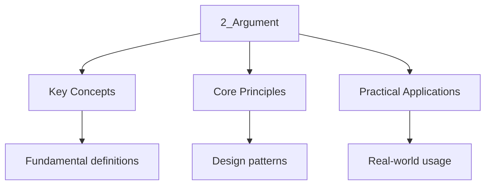

---

title: "Argument | AP - Wyatt's Notes"
description: "\"itemListElement\": [{\"name\": \"Home\", \"url\": \"https://wyattau.com\"}, {\"name\": \"ap\", \"url\": \"https://ap.wyattau.com\"}, {\"name\": \"English\", \"url\":"
date: 2026-06-04T10:00:00.000Z
tags:
  - ap
  - ap-english
categories:
  - ap-english

---

<!-- Breadcrumb Schema for SEO -->

## What Is an Argument?

An argument is a reasoned attempt to persuade an audience to accept a claim. A strong argument
consists of three essential components:

1. **Claim**: A clear, debatable assertion that the writer supports
2. **Evidence**: Specific support for the claim (facts, statistics, examples, expert testimony)
3. **Reasoning**: The logical connection between the evidence and the claim (warrants, analysis,
   explanation)

An argument without evidence is merely an opinion. An argument without reasoning is a list of facts
with no interpretation.

## Developing a Claim

A claim must be **arguable** (reasonable people could disagree), **specific** (clear and focused),
and **supportable** (sufficient evidence exists).

### Weak vs Strong Claims

- **Weak**: "Social media is bad." (Vague, absolute, no nuance)
- **Strong**: "Social media platforms should be required to implement verified identity systems
  because anonymous accounts facilitate the spread of misinformation and enable targeted
  harassment." (Specific, debatable, provides direction for evidence)

### Types of Claims

- **Claim of fact**: Asserts that something is true or false (e.g., "Climate change is accelerating
  at a rate faster than most models predicted.")
- **Claim of value**: Argues that something is good or bad, desirable or undesirable (e.g.,
  "Universities should prioritise experiential learning over lecture-based instruction.")
- **Claim of policy**: Proposes a course of action (e.g., "The government should invest in renewable
  energy infrastructure to reduce dependence on fossil fuels.")

## Evidence

### Types of Evidence

| Type                 | Description                                 | Strength                                                 |
| -------------------- | ------------------------------------------- | -------------------------------------------------------- |
| Facts                | Verifiable, objective data                  | Strong (but context matters)                             |
| Statistics           | Quantitative data from reliable sources     | Strong when accurate and current                         |
| Examples             | Specific instances, anecdotes, case studies | Moderate (limited by representativeness)                 |
| Expert testimony     | Quotations or paraphrases from authorities  | Strong when the expert is credible and relevant          |
| Historical precedent | Past events and established patterns        | Strong for demonstrating continuity                      |
| Personal experience  | The writer"s own observations               | Weak alone; strong when supplemented with other evidence |

### Evaluating Evidence

- **Relevance**: Does the evidence directly support the claim?
- **Sufficiency**: Is there enough evidence to be convincing?
- **Representativeness**: Does the evidence reflect the broader situation, or is it an isolated
  case?
- **Accuracy**: Is the evidence factually correct and up to date?
- **Credibility of source**: Is the source reliable, qualified, and unbiased?

## Reasoning

### Inductive Reasoning

Moving from specific observations to a general conclusion. The conclusion is probable but not
guaranteed. Example: "Every student I surveyed said they prefer online resources. Therefore, most
students prefer online resources." Strength depends on the size and representativeness of the
sample.

### Deductive Reasoning

Moving from a general principle to a specific conclusion. If the premises are true and the logic is
valid, the conclusion must be true. Example: "All mammals are warm-blooded. Whales are mammals.
Therefore, whales are warm-blooded."

### Analogical Reasoning

Drawing a comparison between two similar situations and arguing that what is true of one is true of
the other. Strength depends on the relevance and similarity of the comparison.

## The Toulmin Model

The Toulmin model provides a structured framework for constructing and analysing arguments.

### Components

1. **Claim**: The main assertion being argued
2. **Data (evidence)**: The specific facts and information supporting the claim
3. **Warrant**: The underlying assumption that connects the data to the claim (often unstated)
4. **Backing**: Additional evidence or reasoning that supports the warrant
5. **Qualifier**: Words that limit the scope of the claim (e.g., "in most cases,"
   "probably," "arguably")
6. **Rebuttal (counterargument)**: Acknowledging conditions under which the claim might not hold

### Example

- **Claim**: Schools should require community service for graduation.
- **Data**: Students who participate in community service show higher civic engagement and academic
  performance.
- **Warrant**: Schools should promote both academic and civic development in their students.
- **Backing**: Educational research consistently links community involvement with improved student
  outcomes and social responsibility.
- **Qualifier**: In most cases, schools with adequate resources.
- **Rebuttal**: This requirement may not be appropriate for students with significant family or work
  obligations, in which case alternative arrangements should be offered.

## Logical Fallacies

A logical fallacy is a flaw in reasoning that weakens an argument. Recognising fallacies is
essential both for constructing strong arguments and for evaluating others" claims.

### Common Fallacies

- **Ad hominem**: Attacking the person instead of the argument (e.g., "You cannot trust her opinion
  on education policy because she is not a parent.")
- **Straw man**: Misrepresenting or exaggerating the opposing position to make it easier to attack
  (e.g., "My opponent wants to abolish all regulations, which would lead to chaos.")
- **False dilemma (either/or)**: Presenting only two options when more exist (e.g., "Either we ban
  all social media, or our democracy will collapse.")
- **Slippery slope**: Arguing that one small step will inevitably lead to extreme consequences
  without sufficient evidence of the causal chain
- **Hasty generalisation**: Drawing a broad conclusion from insufficient or unrepresentative
  evidence (e.g., "Three students cheated on the exam, so all students are dishonest.")
- **Appeal to authority**: Citing an authority figure who is not a credible expert on the topic
- **Appeal to popularity (bandwagon)**: Arguing that something is true or good because many people
  believe it
- **Circular reasoning (begging the question)**: The conclusion restates the claim without providing
  evidence (e.g., "The policy is fair because it is a fair policy.")
- **Non sequitur**: The conclusion does not logically follow from the premises
- **Post hoc, ergo propter hoc**: Assuming that because event B followed event A, A caused B
  (correlation vs causation)

## Counterargument and Concession

Addressing opposing views strengthens an argument by demonstrating fairness, thoroughness, and
confidence.

### Concession

Acknowledging that the opposing position has some merit. Example: "While it is true that renewable
energy infrastructure requires significant initial investment..."

### Refutation

Explaining why the opposing position is ultimately flawed or less compelling. Example: "...the
long-term economic and environmental benefits of renewable energy far outweigh the initial costs, as
demonstrated by the declining price of solar panels over the past decade."

### Strategies

1. **Acknowledge and respond**: Show that you understand the counterargument before refuting it
2. **Distinguish**: Show that the opposing evidence supports a different claim or interpretation
3. **Minimise**: Argue that the opposing evidence is an exception rather than the rule
4. **Turn**: Show that the opposing evidence actually supports your argument when examined more
   closely

## Thesis Development

A strong thesis for the argument essay must:

- Take a clear position on the issue presented in the prompt
- Be debatable and specific
- Provide a roadmap for the argument

### Thesis Formula

"Although [counterargument], [position] because [reason 1], [reason 2], and [reason 3]."

Example: "Although some argue that mandatory voting infringes on individual freedom, compulsory
participation in democratic elections should be implemented because it increases civic engagement,
produces governments that better represent the population, and strengthens the legitimacy of the
democratic process."

## Writing the Argument Essay

### Structure

1. **Introduction**: Engage the reader, provide context for the issue, and state your thesis
2. **Body paragraphs**: Each paragraph develops one reason with specific evidence and reasoning;
   include at least one paragraph that addresses a counterargument
3. **Conclusion**: Restate the thesis in fresh language, summarise key points, and end with a
   broader implication or call to action

### Evidence Integration

- Introduce evidence with attribution (e.g., "According to a 2023 Pew Research study...")
- Explain the significance of the evidence (do not let evidence speak for itself)
- Connect each piece of evidence back to the thesis

### Tips

- Develop multiple, distinct reasons rather than repeating the same point
- Use a variety of evidence types (facts, examples, expert testimony, personal experience)
- Qualify claims when appropriate (avoid absolutes unless the evidence supports them)
- Address the strongest counterargument, not the weakest
- End body paragraphs with analysis, not just evidence

## Common Pitfalls

- Failing to take a clear position (a thesis that agrees with both sides)
- Listing evidence without explaining how it supports the claim
- Using weak or irrelevant evidence
- Ignoring counterarguments
- Relying entirely on personal anecdote without broader evidence
- Committing logical fallacies in your own argument
- Using absolutes ("always," "never") that undermine credibility

## Intuition

Literature is a window into human experience across time and culture. Analysing texts is detective work - examining language, structure, and context to uncover meaning and purpose. Great writing reveals universal truths about human nature while reflecting specific historical and cultural moments. Critical thinking and clear expression are essential tools for understanding and communicating ideas effectively.

## Cross-References

- [Rhetorical Analysis](../1-rhetorical-analysis/1_rhetorical-analysis)
- [Literary Analysis](../../../../../../alevel/src/content/docs/english/1-literary-analysis/1_literary-analysis)
