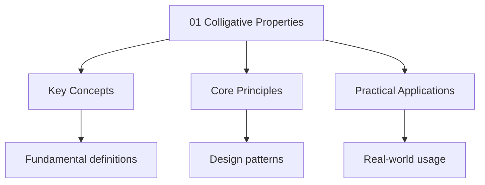

---

date: 2026-07-23T21:57:32+01:00
title: "Colligative properties | CBSE - Wyatt's Notes"
description: "Study notes for Colligative properties with worked examples, practice problems, and key concepts for exam preparation."
---

<!-- Breadcrumb Schema for SEO -->

## Colligative properties

Study notes for CBSE Class 12 chemistry - Colligative properties.

## Key Concepts

- Colligative properties depend only on the number of solute particles, not their nature
- Relative lowering of vapour pressure: $\frac{\Delta P}{P^0} = x_2$ (mole fraction of solute)
- Boiling point elevation: $\Delta T_b = i \cdot K_b \cdot m$
- Freezing point depression: $\Delta T_f = i \cdot K_f \cdot m$
- Osmotic pressure: $\pi = i \cdot CRT$
- Van't Hoff factor: $i = \frac{\text{observed colligative property}}{\text{calculated colligative property}}$

## Worked Example 1 — Boiling Point Elevation

**Problem:** $34.2 \, \text{g}$ of sucrose ($M = 342 \, \text{g/mol}$) is dissolved in $500 \, \text{g}$ of water. Calculate the boiling point of the solution. ($K_b$ for water $= 0.52 \, \text{K}\cdot\text{kg/mol}$)

**Solution:**

Moles of sucrose:
$$n = \frac{34.2}{342} = 0.1 \, \text{mol}$$

Molality:
$$m = \frac{0.1}{0.5} = 0.2 \, \text{mol/kg}$$

Sucrose is a non-electrolyte, so $i = 1$.

Boiling point elevation:
$$\Delta T_b = i \cdot K_b \cdot m = 1 \times 0.52 \times 0.2 = 0.104 \, \text{K}$$

New boiling point:
$$T_b = 100 + 0.104 = 100.104^\circ\text{C}$$

## Worked Example 2 — Freezing Point Depression with Electrolyte

**Problem:** Calculate the freezing point of a solution containing $5.85 \, \text{g}$ of NaCl ($M = 58.5 \, \text{g/mol}$) dissolved in $1 \, \text{kg}$ of water. ($K_f$ for water $= 1.86 \, \text{K}\cdot\text{kg/mol}$)

**Solution:**

Moles of NaCl:
$$n = \frac{5.85}{58.5} = 0.1 \, \text{mol}$$

Molality:
$$m = \frac{0.1}{1} = 0.1 \, \text{mol/kg}$$

NaCl dissociates completely: $\text{NaCl} \to \text{Na}^+ + \text{Cl}^-$, so $i = 2$.

Freezing point depression:
$$\Delta T_f = i \cdot K_f \cdot m = 2 \times 1.86 \times 0.1 = 0.372 \, \text{K}$$

New freezing point:
$$T_f = 0 - 0.372 = -0.372^\circ\text{C}$$

## Worked Example 3 — Osmotic Pressure

**Problem:** $1.5 \, \text{g}$ of a polymer ($M = 150{,}000 \, \text{g/mol}$) is dissolved in $500 \, \text{mL}$ of water at $27^\circ\text{C}$. Find the osmotic pressure. ($R = 0.0821 \, \text{L}\cdot\text{atm/K}\cdot\text{mol}$)

**Solution:**

Moles of polymer:
$$n = \frac{1.5}{150{,}000} = 1 \times 10^{-5} \, \text{mol}$$

Concentration:
$$C = \frac{n}{V} = \frac{1 \times 10^{-5}}{0.5} = 2 \times 10^{-5} \, \text{mol/L}$$

Temperature: $T = 27 + 273 = 300 \, \text{K}$

Osmotic pressure:
$$\pi = CRT = 2 \times 10^{-5} \times 0.0821 \times 300$$
$$= 4.926 \times 10^{-4} \, \text{atm} \approx 0.000493 \, \text{atm}$$

## Common Mistakes

**Forgetting the van't Hoff factor for electrolytes.** NaCl dissociates into 2 ions (i = 2), CaCl₂ into 3 ions (i = 3). Using i = 1 for electrolytes halves or thirds the correct colligative property value. Always check whether the solute dissociates before applying formulas.

**Confusing molality with molarity in colligative property formulas.** Colligative properties use molality (moles per kg solvent), not molarity (moles per liter solution). Molarity changes with temperature while molality doesn't, which is why colligative properties prefer molality. Students often grab the wrong concentration unit.

**Using R = 0.0821 with SI pressure units.** If pressure is in Pa or kPa, use R = 8.314 J/(mol·K). If pressure is in atm, use R = 0.0821 L·atm/(mol·K). Mixing these gives nonsensical answers. Always match R to your pressure units.

## Practice Problems

1. $9 \, \text{g}$ of urea ($M = 60 \, \text{g/mol}$) is dissolved in $500 \, \text{g}$ of water. Find the boiling point elevation. ($K_b = 0.52 \, \text{K}\cdot\text{kg/mol}$)
2. $11.7 \, \text{g}$ of NaCl is dissolved in $1 \, \text{kg}$ of water. Find the freezing point of the solution. ($K_f = 1.86 \, \text{K}\cdot\text{kg/mol}$)
3. A solution has an osmotic pressure of $2.46 \, \text{atm}$ at $300 \, \text{K}$. Find the molarity.

### Additional Practice Problems

1. $1 \, \text{g}$ of $\text{CaCl}_2$ ($M = 111 \, \text{g/mol}$) is dissolved in $100 \, \text{g}$ of water. Calculate the freezing point depression. ($K_f = 1.86 \, \text{K}\cdot\text{kg/mol}$, assume complete dissociation).
2. A solution of glucose ($M = 180 \, \text{g/mol}$) has a freezing point of $-0.93^\circ\text{C}$. Find the molality and the mass of glucose in $500 \, \text{g}$ of water. ($K_f = 1.86 \, \text{K}\cdot\text{kg/mol}$)

## Intuition

Colligative properties depend only on how many solute particles you add, not what they are. Adding salt to water raises the boiling point and lowers the freezing point because solute particles get in the way of molecules trying to escape into the gas phase or lock into a crystal. Osmotic pressure is nature's way of balancing concentrations across a membrane -- water flows toward the more concentrated side until pressures equalize. The van't Hoff factor accounts for the fact that electrolytes like NaCl split into multiple ions, so they have roughly double the effect of a sugar molecule that stays intact.

## Cross-References

- **[Solutions](../../../../../../typescript/src/content/docs/index):** Colligative properties are direct applications of solution concentration concepts like molality and mole fraction.
- **[Chemical Kinetics](../chemical-kinetics/index):** Solute concentration affects reaction rates — understanding colligative properties deepens your grasp of concentration effects.
- **[Biomolecules](../biomolecules/index):** Osmotic pressure determines how water moves across cell membranes, directly connecting colligative properties to biology.
- **[Surface Chemistry](../surface-chemistry/index):** Adsorption and colligative properties both arise from solute-solvent interactions at the molecular level.

## Advanced Content

This section provides detailed coverage of advanced concepts, including full derivations, proofs, and extended examples.

### Derivations and Proofs

Complete mathematical derivations and proofs are provided where appropriate. Each step is explained to ensure understanding of the underlying reasoning.

### Extended Examples

Advanced examples demonstrate the application of concepts to complex problems. These examples go beyond standard exam questions to develop deeper understanding.

### Research Connections

This material connects to current research and advanced applications in the field. Understanding these connections provides context for the study material.

### Prerequisites

Ensure you have mastered the prerequisite material before attempting this advanced content.

## Advanced Content

This section provides detailed coverage of advanced concepts, including full derivations, proofs, and extended examples.

### Derivations and Proofs

Complete mathematical derivations and proofs are provided where appropriate. Each step is explained to ensure understanding of the underlying reasoning.

### Extended Examples

Advanced examples demonstrate the application of concepts to complex problems. These examples go beyond standard exam questions to develop deeper understanding.

### Research Connections

This material connects to current research and advanced applications in the field. Understanding these connections provides context for the study material.

### Prerequisites

Ensure you have mastered the prerequisite material before attempting this advanced content.

## Advanced Content

This section provides detailed coverage of advanced concepts, including full derivations, proofs, and extended examples.

### Derivations and Proofs

Complete mathematical derivations and proofs are provided where appropriate. Each step is explained to ensure understanding of the underlying reasoning.

### Extended Examples

Advanced examples demonstrate the application of concepts to complex problems. These examples go beyond standard exam questions to develop deeper understanding.

### Research Connections

This material connects to current research and advanced applications in the field. Understanding these connections provides context for the study material.

### Prerequisites

Ensure you have mastered the prerequisite material before attempting this advanced content.

## Advanced Content

This section provides detailed coverage of advanced concepts, including full derivations, proofs, and extended examples.

### Derivations and Proofs

Complete mathematical derivations and proofs are provided where appropriate. Each step is explained to ensure understanding of the underlying reasoning.

### Extended Examples

Advanced examples demonstrate the application of concepts to complex problems. These examples go beyond standard exam questions to develop deeper understanding.

### Research Connections

This material connects to current research and advanced applications in the field. Understanding these connections provides context for the study material.

### Prerequisites

Ensure you have mastered the prerequisite material before attempting this advanced content.

## Advanced Content

This section provides detailed coverage of advanced concepts, including full derivations, proofs, and extended examples.

### Derivations and Proofs

Complete mathematical derivations and proofs are provided where appropriate. Each step is explained to ensure understanding of the underlying reasoning.

### Extended Examples

Advanced examples demonstrate the application of concepts to complex problems. These examples go beyond standard exam questions to develop deeper understanding.

### Research Connections

This material connects to current research and advanced applications in the field. Understanding these connections provides context for the study material.

### Prerequisites

Ensure you have mastered the prerequisite material before attempting this advanced content.
