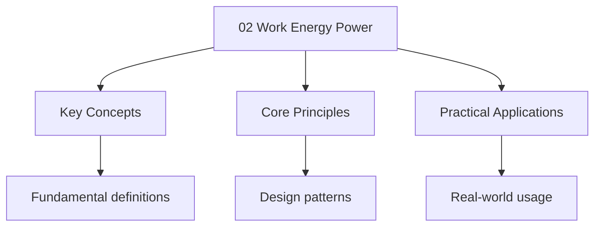

---

date: 2026-07-23T21:57:32+01:00
title: "Work energy power | CBSE - Wyatt's Notes"
description: "Study notes for Work energy power with worked examples, practice problems, and key concepts for exam preparation."
---

<!-- Breadcrumb Schema for SEO -->

## Work energy power

Study notes for CBSE Class 12 physics - Work energy power.

## Key Concepts

- Work done by a constant force: $W = F \cdot d \cdot \cos\theta$
- Work-energy theorem: $W_{net} = \Delta K = \frac{1}{2}mv_f^2 - \frac{1}{2}mv_i^2$
- Conservation of mechanical energy: $K_i + U_i = K_f + U_f$
- Power: $P = \frac{W}{t} = F \cdot v$

## Worked Example 1 — Work Done by a Variable Force

**Problem:** A force $F = (3x^2 + 2x) \, \text{N}$ acts on a particle, moving it from $x = 0$ to $x = 4 \, \text{m}$. Find the work done.

**Solution:**
$$W = \int_0^4 F \, dx = \int_0^4 (3x^2 + 2x) \, dx$$
$$= \left[ x^3 + x^2 \right]_0^4 = (64 + 16) - 0 = 80 \, \text{J}$$

## Worked Example 2 — Work-Energy Theorem

**Problem:** A 2 kg block moving at $10 \, \text{m/s}$ on a rough surface comes to rest after sliding 25 m. Find the coefficient of kinetic friction.

**Solution:**

Work done by friction equals change in kinetic energy:
$$W_{friction} = \Delta K$$
$$-\mu_k mg \cdot d = 0 - \frac{1}{2}mv_i^2$$
$$\mu_k \times 9.8 \times 25 = \frac{1}{2} \times 10^2$$
$$\mu_k = \frac{50}{245} \approx 0.204$$

## Worked Example 3 — Conservation of Energy on a Track

**Problem:** A ball is released from rest at the top of a frictionless track of height $h = 5 \, \text{m}$. Find the speed at the bottom. ($g = 9.8 \, \text{m/s}^2$)

**Solution:**

$$mgh = \frac{1}{2}mv^2$$
$$v = \sqrt{2gh} = \sqrt{2 \times 9.8 \times 5} = \sqrt{98} \approx 9.90 \, \text{m/s}$$

## Worked Example 4 — Power Calculation

**Problem:** A car of mass 1000 kg accelerates from rest to $20 \, \text{m/s}$ in 10 seconds. Find the average power delivered by the engine.

**Solution:**
$$\Delta K = \frac{1}{2}mv^2 = \frac{1}{2} \times 1000 \times 400 = 200{,}000 \, \text{J}$$
$$P_{avg} = \frac{W}{t} = \frac{200{,}000}{10} = 20{,}000 \, \text{W} = 20 \, \text{kW}$$

## Worked Example 5 — Work-Energy Theorem with Multiple Forces

**Problem:** A 4 kg block starts from rest and is pushed by a 30 N horizontal force over 8 m on a surface with $\mu_k = 0.25$. Find the final speed. ($g = 9.8 \, \text{m/s}^2$)

**Solution:**

Work done by applied force:
$$W_F = F \cdot d = 30 \times 8 = 240 \, \text{J}$$

Work done by friction:
$$W_f = -\mu_k mg \cdot d = -0.25 \times 4 \times 9.8 \times 8 = -78.4 \, \text{J}$$

Net work:
$$W_{net} = 240 - 78.4 = 161.6 \, \text{J}$$

Using work-energy theorem:
$$W_{net} = \frac{1}{2}mv_f^2$$
$$v_f = \sqrt{\frac{2W_{net}}{m}} = \sqrt{\frac{2 \times 161.6}{4}} = \sqrt{80.8} \approx 8.99 \, \text{m/s}$$

## Practice Problems

1. A force of 50 N acts at $60^\circ$ to the horizontal, pushing a 10 kg block 4 m along a frictionless surface. Find the work done.
2. A 5 kg ball is thrown vertically upward with speed $14 \, \text{m/s}$. Using energy methods, find the maximum height. ($g = 9.8 \, \text{m/s}^2$)
3. A 1000 kg car moving at $15 \, \text{m/s}$ brakes to rest over 30 m. Find the average braking force.

### Additional Practice Problems

1. A body of mass 3 kg is lifted vertically by 10 m at constant speed. Find the work done against gravity.
2. Two blocks of masses 2 kg and 3 kg are connected by a spring on a frictionless surface. The 2 kg block is pulled and released, compressing the spring. If the spring constant is $k = 200 \, \text{N/m}$, find the maximum compression.

## Worked Example 6 — Work Done by Gravity on a Curved Path

**Problem:** A 2 kg ball is thrown from the ground at 20 m/s at $60^\circ$ to the horizontal. Find the work done by gravity when the ball reaches its maximum height.

**Solution:**

At maximum height, the vertical component of velocity is zero. The height reached is:
$$h = \frac{v_{0y}^2}{2g} = \frac{(20\sin 60^\circ)^2}{2 \times 9.8} = \frac{(17.32)^2}{19.6} = \frac{300}{19.6} \approx 15.31 \text{ m}$$

Work done by gravity:
$$W = -mgh = -2 \times 9.8 \times 15.31 = -300 \text{ J}$$

The work is negative because gravity acts downward while the displacement is upward.

**Common mistake:** Forgetting the negative sign. Gravity does negative work when an object moves upward.

## Worked Example 7 — Power and Terminal Velocity

**Problem:** A car of mass 1200 kg travels at constant speed up a hill inclined at $\sin\theta = 0.05$. The resistive force is 600 N. Find the power required. ($g = 9.8 \text{ m/s}^2$)

**Solution:**

At constant speed, the driving force equals the component of weight down the slope plus the resistive force:
$$F_{\text{drive}} = mg\sin\theta + F_{\text{resistive}} = 1200 \times 9.8 \times 0.05 + 600 = 588 + 600 = 1188 \text{ N}$$

Power at speed $v = 25 \text{ m/s}$:
$$P = Fv = 1188 \times 25 = 29{,}700 \text{ W} \approx 30 \text{ kW}$$

**Common mistake:** Forgetting to include the gravitational component when calculating power on a slope.

## Worked Example 8 — Elastic Collision in One Dimension

**Problem:** A 1 kg ball moving at 5 m/s collides elastically with a 3 kg ball at rest. Find the velocities after collision.

**Solution:**

For elastic collisions, both momentum and kinetic energy are conserved:
$$m_1 v_{1i} + m_2 v_{2i} = m_1 v_{1f} + m_2 v_{2f}$$
$$\frac{1}{2}m_1 v_{1i}^2 + \frac{1}{2}m_2 v_{2i}^2 = \frac{1}{2}m_1 v_{1f}^2 + \frac{1}{2}m_2 v_{2f}^2$$

Using the elastic collision formulas:
$$v_{1f} = \frac{m_1 - m_2}{m_1 + m_2}v_{1i} = \frac{1 - 3}{1 + 3} \times 5 = \frac{-2}{4} \times 5 = -2.5 \text{ m/s}$$

$$v_{2f} = \frac{2m_1}{m_1 + m_2}v_{1i} = \frac{2 \times 1}{1 + 3} \times 5 = \frac{2}{4} \times 5 = 2.5 \text{ m/s}$$

The 1 kg ball rebounds with speed 2.5 m/s, and the 3 kg ball moves forward at 2.5 m/s.

**Common mistake:** Assuming the lighter ball continues forward. In elastic collisions, the lighter ball often rebounds.

## Why This Matters

The work-energy theorem and conservation of energy are among the most powerful tools in physics. They allow us to solve complex problems without tracking forces at every instant, making them essential for engineering, astrophysics, and particle physics.

## Additional Exam Tips

- Always identify the system and check if external forces do work
- For elastic collisions, use the derived formulas rather than solving two simultaneous equations
- Power = force x velocity applies only when force and velocity are in the same direction
- Remember that kinetic energy is always positive, but work can be negative (friction)
- When using energy methods, define a reference level for potential energy

## Intuition

**Work is about transferring energy through force:** When you push a box across a room, you're doing work — transferring energy from you to the box. The amount depends on how hard you push (force), how far it moves (distance), and the angle between them. Friction does negative work because it opposes motion, draining energy from the system.

**Why it matters:** The work-energy theorem is one of the most powerful tools in physics. It lets you solve complex problems by comparing initial and final states without tracking every force at every moment. This is how engineers calculate car crash impacts, how physicists analyze particle collisions, and how astronomers predict orbital mechanics.

**The key insight:** Power is the rate of energy transfer — a car engine doesn't just need to produce energy, it needs to produce it fast enough to accelerate quickly. This distinction between energy and power explains why a small car can outperform a large truck.

## Common Mistakes

### Mistake 1: Forgetting the negative sign for work done against conservative forces

When an object moves upward, gravity does negative work ($W = -mgh$), but the work done against gravity (by an external agent) is positive ($W = +mgh$). Students often mix these up and assign the wrong sign. The key is to identify which force is doing the work: if the force and displacement are in opposite directions, the work is negative.

### Mistake 2: Applying conservation of energy when non-conservative forces do work

Conservation of mechanical energy ($K_i + U_i = K_f + U_f$) only holds when no non-conservative forces (friction, air resistance, applied forces) do work. Students frequently apply it to problems with friction and get incorrect answers. When friction is present, use the work-energy theorem: $W_{net} = \Delta K$, where $W_{net}$ includes work done by friction.

### Mistake 3: Confusing instantaneous power with average power

Instantaneous power is $P = \vec{F} \cdot \vec{v}$ (force times velocity at that instant), while average power is $P_{avg} = W/t$ (total work divided by total time). Students sometimes use $P = Fv$ for average power when the force or velocity changes over time. For constant force and velocity, both formulas give the same result, but for varying conditions, use the appropriate definition.

## Cross-References

- [Laws of Motion](./01-laws-of-motion) -- The work-energy theorem connects Newton's second law to energy methods, providing an alternative approach to dynamics problems.
- [Rotational Motion](./03-rotational-motion) -- Rotational kinetic energy and work done by torque extend energy concepts to rotational systems.
- [Electrostatics](../electrostatics/index) -- Electric potential energy applies the work-energy framework to charges in electric fields.

## Advanced Content

This section provides detailed coverage of advanced concepts, including full derivations, proofs, and extended examples.

### Derivations and Proofs

Complete mathematical derivations and proofs are provided where appropriate. Each step is explained to ensure understanding of the underlying reasoning.

### Extended Examples

Advanced examples demonstrate the application of concepts to complex problems. These examples go beyond standard exam questions to develop deeper understanding.

### Research Connections

This material connects to current research and advanced applications in the field. Understanding these connections provides context for the study material.

### Prerequisites

Ensure you have mastered the prerequisite material before attempting this advanced content.
