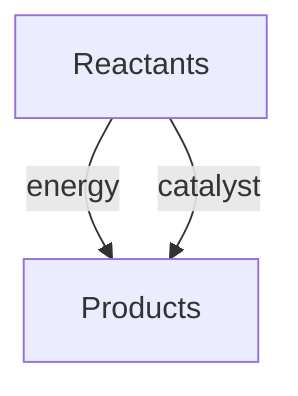

## General Chemistry

**Accuracy**: How close a measurement is to the true or accepted value. Related to [Precision](#precision).

**Atom**: The smallest unit of an element that retains the chemical properties of that element. Consists of a nucleus (protons + neutrons) and electrons.

**Avogadro's Number**: The number of particles in one mole: 6.022 × 10²³. Relates atomic mass to molar mass.

**Bond Energy**: The energy required to break a chemical bond. Measured in kJ/mol. Higher bond energy means a stronger bond.

**Catalyst**: A substance that increases the rate of a chemical reaction without being consumed. Lowers the activation energy.

**Chemical Equation**: A symbolic representation of a chemical reaction. Shows reactants on the left and products on the right.

**Chemical Bond**: An attractive force holding atoms together in a molecule or compound. Types include ionic, covalent, and metallic bonds.

**Chemical Reaction**: A process where substances are transformed into different substances through the breaking and forming of chemical bonds.

**Concentration**: The amount of solute in a given volume of solution. Common units: molarity (mol/L), mass percent, ppm.

**Electron Configuration**: The distribution of electrons in an atom's orbitals. Follows the Aufbau principle, Pauli exclusion, and Hund's rule.

**Element**: A pure substance consisting of only one type of atom, defined by its atomic number (number of protons).

**Empirical Formula**: The simplest whole-number ratio of atoms in a compound. For glucose (C₆H₁₂O₆), the empirical formula is CH₂O.

**Hypothesis**: A testable explanation for an observation. Forms the basis of scientific experiments. Related to [Theory](#theory).

**Molar Mass**: The mass of one mole of a substance, equal to the atomic or molecular mass in g/mol.

**Mole**: A unit of amount of substance containing 6.022 × 10²³ particles. Bridges atomic and macroscopic scales.

**Periodic Table**: A tabular arrangement of elements by atomic number, electron configuration, and chemical properties.

**Scientific Method**: A systematic approach to understanding nature: observation → hypothesis → experiment → analysis → conclusion.

**Significant Figures**: Digits in a measurement that carry meaning about its precision. Rules govern how many digits to report.

**Solute**: The substance dissolved in a solvent to form a solution. Related: [Solvent](#solvent), [Solution](#solution).

**Solution**: A homogeneous mixture of two or more substances. The solute is dissolved in the solvent.

**Solvent**: The substance that dissolves the solute. In aqueous solutions, water is the solvent.

**Standard State**: The reference state for thermodynamic quantities: 1 atm pressure and specified temperature (usually 25°C).

**Theory**: A well-substantiated explanation of natural phenomena supported by extensive evidence. More robust than a [Hypothesis](#hypothesis).

## Physical Chemistry

**Activation Energy**: The minimum energy required for a chemical reaction to occur. Denoted Eₐ. Higher Eₐ means slower reaction.

**Arrhenius Equation**: Relates reaction rate to temperature: k = Ae^(-Eₐ/RT), where k is rate constant, A is pre-exponential factor.

**Boyle's Law**: At constant temperature, the pressure of a gas is inversely proportional to its volume: PV = constant.

**Charles's Law**: At constant pressure, the volume of a gas is directly proportional to its temperature: V/T = constant.

**Collision Theory**: Chemical reactions occur when particles collide with sufficient energy and proper orientation.

**Dynamic Equilibrium**: A state where forward and reverse reaction rates are equal. Concentrations remain constant but reactions continue.

**Electrochemistry**: The study of chemical reactions involving electron transfer. Includes galvanic and electrolytic cells.

**Endothermic**: A reaction that absorbs heat from the surroundings. ΔH is negative for the surroundings, positive for the system.

**Entropy**: A measure of disorder or randomness. Increases in spontaneous processes. Related: [Second Law of Thermodynamics](#second-law-of-thermodynamics).

**Exothermic**: A reaction that releases heat to the surroundings. ΔH is negative for the system.

**Gibbs Free Energy**: The energy available to do work: ΔG = ΔH - TΔS. Negative ΔG indicates a spontaneous process.

**Hess's Law**: The total enthalpy change of a reaction is independent of the path taken. Allows calculation of ΔH from known values.

**Ideal Gas Law**: PV = nRT. Relates pressure, volume, temperature, and amount of gas. R = 8.314 J/(mol·K).

**Kinetics**: The study of reaction rates and mechanisms. Factors affecting rate: concentration, temperature, catalysts, surface area.

**Le Chatelier's Principle**: If a system at equilibrium is disturbed, it shifts to counteract the change and restore equilibrium.

**Nernst Equation**: Relates cell potential to standard potential and concentrations: E = E° - (RT/nF)lnQ.

**Oxidation**: Loss of electrons by a substance. Oxidation states increase. Always accompanied by [Reduction](#reduction) in a redox reaction.

**Reduction**: Gain of electrons by a substance. Oxidation states decrease. Always accompanied by [Oxidation](#oxidation).

**Redox Reaction**: A reaction involving electron transfer between species. One species is oxidized, another is reduced.

**Second Law of Thermodynamics**: The total entropy of an isolated system always increases for spontaneous processes.

**Thermodynamics**: The study of energy and its transformations. Deals with heat, work, and the feasibility of processes.

## Organic Chemistry

**Alcohol**: An organic compound containing a hydroxyl (-OH) group bonded to a carbon atom. General formula: R-OH.

**Aldehyde**: An organic compound containing a formyl group (-CHO). More reactive than ketones due to the exposed carbonyl.

**Alkane**: A saturated hydrocarbon with only single bonds. General formula: CₙH₂ₙ₊₂. Includes methane, ethane, propane.

**Alkene**: An unsaturated hydrocarbon containing at least one carbon-carbon double bond. General formula: CₙH₂ₙ.

**Alkyne**: An unsaturated hydrocarbon containing at least one carbon-carbon triple bond. General formula: CₙH₂ₙ₋₂.

**Aromatic Compound**: A cyclic, planar compound with delocalized π electrons following Hückel's rule (4n+2 π electrons). Example: benzene.

**Carbonyl Group**: A functional group containing a carbon-oxygen double bond (C=O). Found in aldehydes, ketones, carboxylic acids.

**Carboxylic Acid**: An organic compound containing a carboxyl group (-COOH). Weak acids that partially dissociate in water.

**Chirality**: The property of a molecule that makes it non-superimposable on its mirror image. Chiral molecules have enantiomers.

**Ester**: An organic compound formed from the reaction of a carboxylic acid and an alcohol. General formula: R-COO-R'.

**Functional Group**: A specific group of atoms within a molecule that determines its chemical properties and reactivity.

**Hydrocarbon**: An organic compound containing only carbon and hydrogen. Includes alkanes, alkenes, alkynes, and aromatics.

**Isomer**: Molecules with the same molecular formula but different structural arrangements. Types: structural, geometric, optical.

**Ketone**: An organic compound containing a carbonyl group (C=O) bonded to two carbon atoms. General formula: R-CO-R'.

**Molecular Orbital Theory**: Describes bonding as the combination of atomic orbitals to form molecular orbitals that span the entire molecule.

**Nucleophilic Substitution**: A reaction where a nucleophile replaces a leaving group. SN1 (unimolecular) and SN2 (bimolecular) mechanisms.

**Polymer**: A large molecule made of repeating structural units (monomers). Examples include polyethylene, nylon, and DNA.

**Reaction Mechanism**: The step-by-step sequence of elementary reactions by which an overall chemical change occurs.

**Saturated Compound**: An organic compound with only single bonds between carbon atoms. Contains the maximum number of hydrogen atoms.

**Stereochemistry**: The study of the three-dimensional arrangement of atoms in molecules and its effect on chemical reactions.

**Unsaturated Compound**: An organic compound containing at least one double or triple bond between carbon atoms.

## Inorganic Chemistry

**Acid**: A substance that donates protons (H⁺) in aqueous solution (Brønsted-Lowry) or accepts electron pairs (Lewis).

**Acid-Base Reaction**: A reaction involving proton transfer between acid and base. Produces water and a salt in neutralization.

**Base**: A substance that accepts protons (H⁺) in aqueous solution (Brønsted-Lowry) or donates electron pairs (Lewis).

**Buffer**: A solution that resists changes in pH when small amounts of acid or base are added. Made of a weak acid and its conjugate base.

**Chelate**: A complex formed when a polydentate ligand forms two or more coordinate bonds with a metal ion.

**Complex Ion**: An ion consisting of a central metal atom or ion bonded to surrounding ligands. Example: [Cu(NH₃)₄]²⁺.

**Conjugate Acid-Base Pair**: Two species that differ by one proton. The conjugate acid donates the proton; the conjugate base accepts it.

**Coordination Compound**: A compound containing a central metal ion bonded to ligands. The number of ligands is the coordination number.

**Crystal Field Theory**: Describes the electronic structure of transition metal complexes. Ligands split the d-orbitals into different energy levels.

**Ligand**: A molecule or ion that donates an electron pair to a central metal ion to form a coordinate bond.

**pH**: A measure of acidity: pH = -log[H⁺]. pH < 7 is acidic; pH = 7 is neutral; pH > 7 is basic.

**pKa**: The negative logarithm of the acid dissociation constant: pKa = -log(Ka). Lower pKa means a stronger acid.

**Transition Metal**: A metal in the d-block of the periodic table. Often forms colored compounds, acts as a catalyst, and has variable oxidation states.

## Biochemistry

**Amino Acid**: The building block of proteins. Contains an amino group (-NH₂), a carboxyl group (-COOH), and a variable R group.

**Carbohydrate**: Organic compounds with the general formula Cₙ(H₂O)ₙ. Includes sugars, starches, and cellulose.

**DNA (Deoxyribonucleic Acid)**: A nucleic acid that stores genetic information. Structure: double helix of nucleotide base pairs.

**Enzyme**: A biological catalyst, usually a protein, that speeds up specific biochemical reactions. Highly specific and regulated.

**Lipid**: A diverse group of organic compounds insoluble in water but soluble in organic solvents. Includes fats, oils, and waxes.

**Nucleic Acid**: A polymer of nucleotides that stores and transmits genetic information. Types: DNA and [RNA](#rna-ribonucleic-acid).

**Protein**: A polymer of amino acids linked by peptide bonds. Performs structural, enzymatic, transport, and regulatory functions.

**RNA (Ribonucleic Acid)**: A nucleic acid involved in protein synthesis. Types: mRNA, tRNA, rRNA.

## Related Resources

- [Organic Chemistry Guide](../../../../hsc/src/content/docs/chemistry/organic)
- [Physical Chemistry Concepts](../../../../alevel/src/content/docs/chemistry/flashcards-physical-chemistry)
- [Inorganic Chemistry Overview](../../../../hsc/src/content/docs/chemistry/inorganic)
- [Biochemistry Introduction](../../../../dse/src/content/docs/biology/1-cell-biology/1_cell-biology-and-biochemistry)
