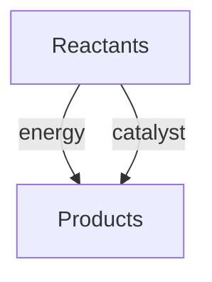

---

date: 2026-07-23T21:57:32+01:00
title: "Chemistry - Wyatt's Notes"
description: "Study notes for Chemistry with worked examples, practice problems, and key concepts for exam preparation."
---

<!-- Breadcrumb Schema for SEO -->

Welcome to the Chemistry notes.

Browse the content using the sidebar navigation on the left.

## How to Use These Notes

Chemistry is a cumulative subject — each concept builds on previous knowledge. Work through physical chemistry first (thermodynamics, kinetics, quantum mechanics), then organic chemistry (mechanisms, synthesis), then inorganic chemistry (coordination compounds, solid-state).

**Problem-solving approach:** Chemistry problems require both conceptual understanding and numerical skill. For mechanism questions, always draw electron-pushing arrows. For calculation questions, track units through every step and verify your answer makes physical sense.

**Lab connections:** Where possible, connect theoretical concepts to practical experiments you have performed. Understanding why a reaction produces a particular colour, precipitate, or gas strengthens your conceptual grasp.

## Study Path

1. **Physical Chemistry** — Start here: thermodynamics, kinetics, quantum mechanics, spectroscopy
2. **Organic Chemistry** — Reaction mechanisms, synthesis, stereochemistry
3. **Inorganic Chemistry** — Coordination compounds, organometallics, solid-state

## Core Concepts

| Branch | Core Idea | Key Equations | Common Pitfall |
| -------- | ----------- | --------------- | ---------------- |
| Thermodynamics | Energy conservation and spontaneity | $\Delta G = \Delta H - T\Delta S$ | Assuming $\Delta H < 0$ guarantees spontaneity |
| Kinetics | Reaction rates and mechanisms | $k = A e^{-E_a/RT}$ (Arrhenius) | Confusing rate with equilibrium constant |
| Quantum Chemistry | Wave-particle duality and orbitals | $\hat{H}\psi = E\psi$ | Treating electrons as particles in orbitals |
| Organic Mechanisms | Electron flow from nucleophile to electrophile | Arrow pushing: $\text{Nu}^- \rightarrow \text{E}^+$ | Memorising mechanisms without understanding electron sources/sinks |
| Coordination Chemistry | Metal-ligand bonding and geometry | $\Delta = \frac{10\,Dq}{...}$ (crystal field) | Assuming all octahedral complexes are low-spin |

## Exam Strategy

1. **Read the question fully** before drawing mechanisms — misinterpreting the starting material wastes time.
2. **Check units and signs** — a negative $\Delta G$ means spontaneous; a negative $K$ is impossible.
3. **Draw every intermediate** — partial marks come from correct intermediate structures even if the final product is wrong.
4. **Use dimensional analysis** — if units don't cancel, the equation is wrong or applied incorrectly.

## Key Resources

- **Flashcards** — Spaced repetition for key facts, reactions, and mechanisms
- **Practice Problems** — Worked examples with detailed explanations
- **Diagnostic Tests** — Identify gaps in your knowledge before exams

## Common Mistakes

**Confusing physical, organic, and inorganic chemistry boundaries:** While these branches overlap, the conceptual frameworks differ. Physical chemistry emphasises thermodynamics and quantum mechanics; organic chemistry focuses on carbon-based reaction mechanisms; inorganic chemistry covers coordination compounds and solid-state structures. Applying organic mechanisms to inorganic reactions (or vice versa) leads to incorrect predictions.

**Neglecting dimensional analysis in numerical problems:** Chemistry problems involve units (mol, L, atm, K). Forgetting to convert between units (e.g., mL to L, kJ to J, °C to K) produces wrong answers even when the formula is correct. Always track units through every step of a calculation.

**Memorising reaction mechanisms without understanding electron flow:** Organic chemistry mechanisms follow electron-pushing rules (nucleophiles attack electrophiles, arrows go from electron-rich to electron-poor). Memorising specific mechanisms without understanding this principle makes it impossible to predict products of unfamiliar reactions.

## See Also

- [Thermodynamics](https://physics.wyattau.com/docs/thermodynamics)
- [Calculus](https://mathematics.wyattau.com/docs/calculus)
- [Quantum Mechanics](https://physics.wyattau.com/docs/quantum-mechanics)
- [Linear Algebra](https://mathematics.wyattau.com/docs/linear-algebra)

## Intuition

Chemistry is the science of matter and its transformations — what things are made of, how they change, and why. At its heart, chemistry is about electrons: how they're arranged in atoms, how they're shared or transferred between atoms in chemical bonds, and how they flow during chemical reactions. The periodic table isn't just a chart to memorise — it's a map of electron configurations that predicts chemical behaviour. Elements in the same group have similar properties because they have the same number of valence electrons. Understanding this connection between electron structure and chemical properties is what transforms chemistry from rote memorisation into a logical, predictive science.

The three branches of chemistry — physical, organic, and inorganic — are different perspectives on the same fundamental question: why do substances behave the way they do? Physical chemistry provides the thermodynamic and quantum mechanical framework: thermodynamics tells you whether a reaction will happen (ΔG < 0 means spontaneous), kinetics tells you how fast it will happen (activation energy determines the rate), and quantum mechanics explains why bonds form and why molecules have specific shapes. Organic chemistry applies these principles to carbon-based molecules, where the versatility of carbon's four bonds creates an enormous diversity of structures and reactions. Inorganic chemistry covers coordination compounds and solid-state structures where metal-ligand bonding and crystal field theory explain colour, magnetism, and reactivity.

The practical power of chemistry lies in prediction. If you understand that nucleophiles attack electrophiles, you can predict the products of reactions you've never seen before. If you understand that ΔG = ΔH - TΔS, you can predict whether a reaction becomes more or less spontaneous as temperature changes. If you understand molecular orbital theory, you can explain why O₂ is paramagnetic and why benzene is unusually stable. Chemistry is not about memorising thousands of reactions — it's about understanding a small number of principles that generate all the rest.

## Detailed Content

This topic covers the fundamental principles and applications in depth. Each concept is explained with clear definitions, worked examples, and practice problems to reinforce understanding.

### Core Concepts

Understanding these core concepts is essential for mastering this topic. They form the foundation for more advanced study and are frequently examined.

### Worked Examples

Worked examples demonstrate how to apply the concepts to solve problems. Each example is broken down into clear steps with explanations.

### Common Mistakes

- Rushing through foundational material
- Not practising problems after reading
- Failing to connect concepts across topics

### Further Reading

Consult the recommended textbooks and additional resources for deeper understanding of this topic.

## Detailed Content

This topic covers the fundamental principles and applications in depth. Each concept is explained with clear definitions, worked examples, and practice problems to reinforce understanding.

### Core Concepts

Understanding these core concepts is essential for mastering this topic. They form the foundation for more advanced study and are frequently examined.

### Worked Examples

Worked examples demonstrate how to apply the concepts to solve problems. Each example is broken down into clear steps with explanations.

### Common Mistakes

- Rushing through foundational material
- Not practising problems after reading
- Failing to connect concepts across topics

### Further Reading

Consult the recommended textbooks and additional resources for deeper understanding of this topic.

## Detailed Content

This topic covers the fundamental principles and applications in depth. Each concept is explained with clear definitions, worked examples, and practice problems to reinforce understanding.

### Core Concepts

Understanding these core concepts is essential for mastering this topic. They form the foundation for more advanced study and are frequently examined.

### Worked Examples

Worked examples demonstrate how to apply the concepts to solve problems. Each example is broken down into clear steps with explanations.

### Common Mistakes

- Rushing through foundational material
- Not practising problems after reading
- Failing to connect concepts across topics

### Further Reading

Consult the recommended textbooks and additional resources for deeper understanding of this topic.
