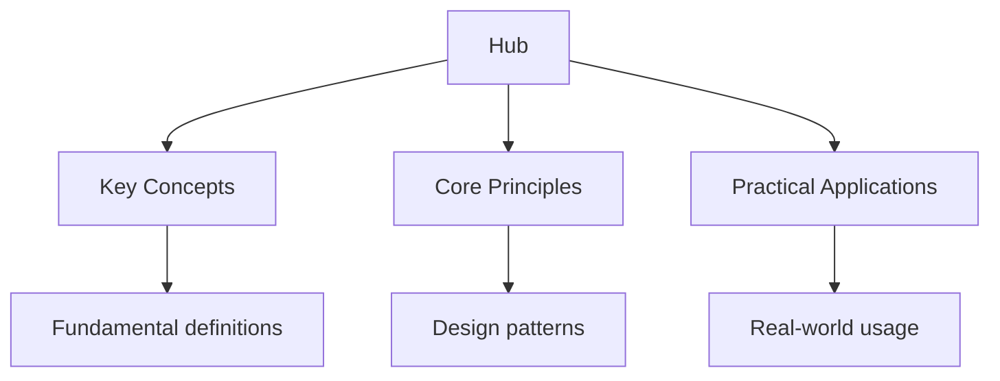

## Why This Guide Exists

The US civics test is a mandatory part of the naturalisation process for anyone seeking American citizenship. Administered by US Citizenship and Immigration Services (USCIS), the civics test evaluates your knowledge of US history, government, and civic principles. The test is oral: a USCIS officer asks you up to 10 questions from a published list of 100, and you must answer at least 6 correctly to pass.

Unlike academic exams, the civics test does not require deep analytical thinking. It tests factual knowledge that every American citizen should possess. The questions are publicly available, the answers are straightforward, and the test can be prepared for with dedicated study. USCIS provides study materials in multiple languages and offers accommodations for individuals with disabilities or limited English proficiency.

This hub page maps every resource on this site, organised by the civics test categories, with study plans and strategies to help you pass the naturalisation interview with confidence.

## Table of Contents

- [The Civics Test Format](#the-civics-test-format)
- [American Government](#american-government)
- [American History](#american-history)
- [Integrated Civics: Geography and Symbols](#integrated-civics-geography-and-symbols)
- [Integrated Civics: Holidays and observances](#integrated-civics-holidays-and-observances)
- [Rights and Responsibilities](#rights-and-responsibilities)
- [The Naturalisation Process](#the-naturalisation-process)
- [Recommended Study Plan](#recommended-study-plan)
- [Cross-Site Resources](#cross-site-resources)
- [FAQ](#faq)

---

## The Civics Test Format

The USCIS civics test is an oral examination conducted during your naturalisation interview. The USCIS officer will ask you up to 10 questions from the list of 100 civics questions. You must answer at least 6 correctly to pass. If you answer the first 6 correctly, the officer stops asking questions. If you answer fewer than 6 correctly, you fail and may be scheduled for a second interview.

### Topic Notes

- [Civics Test Overview](civics-test-format) -- how the test works, what to expect, and scoring rules
- [The 100 Questions](civics-test-format/all-questions) -- the complete list of 100 USCIS civics questions
- [Test Day Procedures](civics-test-format/test-day) -- what to bring, how the interview works, and officer expectations
- [Accommodations](civics-test-format/accommodations) -- provisions for disabilities, age, and long-term residency

### Practice and Review

- [Flashcards: All 100 Questions](flashcards-civics-all)
- [Practice Test: Random 10](practice-civics-random) -- simulated tests with random question selection
- [Practice Test: Government Questions](practice-civics-government) -- questions grouped by category
- [Practice Test: History Questions](../../../../ib/src/content/docs/history/history) -- questions grouped by category

### Key Test Focus

The officer selects questions randomly from the full list of 100. You cannot predict which questions will be asked. Study all 100 questions, not just a subset. The questions are simple and factual, but some have multiple acceptable answers. For example, "What is the supreme law of the land?" can be answered with "the Constitution" or "the US Constitution" or "Constitution of the United States."

---

## American Government

The largest category of civics questions covers the structure and function of US government. These questions test your understanding of the Constitution, the three branches of government, and the system of checks and balances.

### Topic Notes

- [The Constitution](constitution-history) -- the supreme law, the Bill of Rights, and amendments
- [The Legislative Branch](government/legislative) -- Congress, the Senate, the House of Representatives, and lawmaking
- [The Executive Branch](government/executive) -- the President, the Cabinet, and federal agencies
- [The Judicial Branch](government/judicial) -- the Supreme Court, federal courts, and judicial review
- [Federalism](government/federalism) -- the division of power between federal and state governments
- [Political Parties](government/parties) -- the two major parties, the election process, and the Electoral College

### Practice and Review

- [Flashcards: American Government](flashcards-government)
- [Practice Questions: Government](practice-government)

### Key Test Focus

Know the structure of government by heart: three branches (legislative, executive, judicial), the names of current leaders (President, Vice President, Speaker of the House, Chief Justice), and the number of Senators and Representatives. Understand the Bill of Rights and the first 10 amendments. Know the requirements for becoming President (natural-born citizen, at least 35 years old, resident in the US for at least 14 years).

---

## American History

The civics test covers major periods and events in American history, from the colonial era to the present day.

### Topic Notes

- [Colonial Period and Independence](history/colonial) -- the 13 colonies, the Declaration of Independence, and the Revolutionary War
- [The Early Republic](history/early-republic) -- the Constitution, the Bill of Rights, and the first presidents
- [The Civil War and Reconstruction](../../../../ib/src/content/docs/history/comparitives/spanish-civil-war-chinese-civil-war) -- slavery, the Civil War, and the 13th, 14th, and 15th amendments
- [Industrialisation and the Progressive Era](../../../../alevel/src/content/docs/history/7-industrial-revolution/1_industrial_revolution) -- immigration, the World Wars, and economic change
- [The Civil Rights Movement](history/civil-rights) -- desegregation, the Voting Rights Act, and key leaders
- [Recent History](history/recent) -- the Cold War, the end of the 20th century, and the 21st century

### Practice and Review

- [Flashcards: American History](../../../../dse/src/content/docs/history/flashcards-history)
- [Practice Questions: History](../../../../ib/src/content/docs/history/practice-history)

### Key Test Focus

Know the key documents and dates: the Declaration of Independence (1776), the Constitution (1787), the Bill of Rights (1791), and the Emancipation Proclamation (1863). Understand the causes and outcomes of the Civil War, the significance of the Civil Rights Movement, and the roles of key historical figures including George Washington, Abraham Lincoln, and Martin Luther King Jr.

---

## Integrated Civics: Geography and Symbols

The integrated civics section covers US geography, national symbols, and the meaning of national emblems.

### Topic Notes

- [US Geography](../../../../ib/src/content/docs/geography/geography) -- states, borders, rivers, mountains, and the capital
- [National Symbols](symbols) -- the flag, the eagle, the Statue of Liberty, and the national anthem
- [The Capital and States](geography/capital) -- Washington, D.C., the 50 states, and their locations

### Practice and Review

- [Flashcards: Geography and Symbols](../../../../dse/src/content/docs/geography/flashcards-geography)
- [Practice Questions: Geography](../../../../dse/src/content/docs/geography/practice-geography)

### Key Test Focus

Know the capital of the United States (Washington, D.C.), the number of states (50), and the name of the national anthem ("The Star-Spangled Banner"). Know the ocean that borders the US to the west (Pacific) and east (Atlantic). Understand the significance of the Statue of Liberty as a symbol of freedom and immigration.

---

## Integrated Civics: Holidays and observances

The civics test includes questions about national holidays and their significance.

### Topic Notes

- [National Holidays](holidays) -- Independence Day, Thanksgiving, Christmas, and others
- [Federal Holidays](holidays/federal) -- the 11 federal holidays and when they are observed
- [Historical Significance](holidays/significance) -- why each holiday matters in American history

### Practice and Review

- [Flashcards: Holidays](flashcards-holidays)
- [Practice Questions: Holidays](practice-holidays)

### Key Test Focus

Know the date of Independence Day (July 4), the reason for Thanksgiving (to give thanks for a good harvest, traditionally linked to the Pilgrims), and the names of major federal holidays. Understand that federal holidays are established by Congress and apply to federal government employees.

---

## Rights and Responsibilities

The civics test covers the rights guaranteed by the Constitution and the responsibilities of citizenship.

### Topic Notes

- [The Bill of Rights](bill-of-rights) -- the first 10 amendments and the freedoms they protect
- [Freedom of Speech and Religion](rights/freedoms) -- the First Amendment and its scope
- [The Right to Vote](rights/voting) -- who can vote, how voting works, and voter protections
- [Responsibilities of Citizenship](rights-and-responsibilities) -- jury duty, voting, and civic participation
- [Equal Protection](rights/equal-protection) -- the 14th Amendment and anti-discrimination principles

### Practice and Review

- [Flashcards: Rights and Responsibilities](flashcards-rights)
- [Practice Questions: Rights](practice-rights)

### Key Test Focus

Know the five freedoms of the First Amendment: religion, speech, press, assembly, and petition. Understand that the right to vote is protected by several amendments (15th, 19th, 24th, and 26th). Know the responsibilities of citizenship: voting in elections, serving on a jury, paying taxes, and defending the Constitution.

---

## The Naturalisation Process

Understanding the naturalisation process helps you prepare for the interview beyond just the civics test.

### Topic Notes

- [Naturalisation Overview](naturalisation) -- eligibility, application, and the path to citizenship
- [The N-400 Application](naturalisation/n400) -- the application form, required documents, and common issues
- [The Interview](naturalisation/interview) -- what happens during the naturalisation interview
- [The English Test](../../../../gcse/src/content/docs/english) -- the English language component of the naturalisation test
- [The Oath of Allegiance](naturalisation/oath) -- the final step and what the oath means

### Practice and Review

- [Flashcards: Naturalisation Process](naturalisation)
- [Practice Questions: Naturalisation](practice-naturalisation)

### Key Test Focus

The naturalisation interview includes three components: the civics test, the English test (reading, writing, and speaking), and a review of your N-400 application. You must answer questions about your application accurately. The English test requires you to read one sentence aloud, write one sentence dictated by the officer, and answer questions about your application in English.

---

## Recommended Study Plan

Preparing for the civics test is a focused process. Most candidates can prepare adequately in 2 to 4 weeks with consistent study.

### Week 1: Foundation

- Review all 100 civics questions and answers
- Take a diagnostic practice test to identify which categories need the most work
- Begin flashcard practice: 20 minutes daily
- Group questions by category and study one category per day

### Week 2: Content Mastery

- Study American government questions in detail: the Constitution, the three branches, and current leaders
- Study American history questions: key events, dates, and figures
- Complete flashcards for government and history categories
- Take a practice test and track improvement

### Week 3: Practice and Refinement

- Focus on your weakest categories identified by practice test scores
- Study integrated civics: geography, symbols, and holidays
- Complete at least 5 full practice tests (random 10-question sets)
- Review every wrong answer and re-study those questions

### Week 4: Final Preparation

- Take one final practice test: aim for 9 out of 10 correct consistently
- Review the naturalisation process and interview expectations
- Practise answering questions aloud (the test is oral, not written)
- Rest before your interview day

### Daily Routine

| Time | Activity |
| ------ | ---------- |
| Morning | Flashcards: 20 minutes of civics questions |
| Afternoon | Topic study: review one category of questions |
| Evening | Practice: one simulated test (10 random questions) |
| Weekend | Full practice test plus review of wrong answers |

---

## Cross-Site Resources

Wyatt's Notes is a network of interconnected study sites. The civics content connects to related material:

- **[SAT Study Guide](https://sat.wyattau.com/hub)** -- reading comprehension and writing skills that support civics study
- **[AP US Government and Politics](https://ap.wyattau.com/hub)** -- deeper study of American government beyond civics test level
- **[Main Site: Wyatt's Notes](https://wyattsnotes.wyattau.com)** -- explore all 46 study sites in the network

---

## Frequently Asked Questions

### How should I start using this site?

Review all 100 civics questions once to familiarise yourself with the scope. Then take a diagnostic practice test to see how many you already know. Focus your study on the categories where you scored lowest.

### How long does it take to prepare for the civics test?

Most people can prepare adequately in 2 to 4 weeks with consistent daily study. Spending 20 to 30 minutes per day on flashcards and practice tests is more effective than long weekend study sessions.

### Is the civics test written or oral?

The civics test is oral. The USCIS officer asks you questions verbally and you answer verbally. This means you should practise answering questions aloud, not just reading them silently.

### What if I fail the civics test?

If you fail the civics test (or the English test), you will be scheduled for a second interview, typically 60 to 90 days later. You only need to retake the portion you failed. Use the time between interviews to focus on the questions you got wrong.

### Do I need to memorise the exact wording of the answers?

No. USCIS accepts multiple correct answers for many questions. For example, "What is the supreme law of the land?" accepts "the Constitution," "the US Constitution," or "Constitution of the United States." Focus on understanding the concept, not memorising a single exact phrase.

### Can I take the civics test in my own language?

The civics test is always conducted in English. However, if you are 50 or older and have been a permanent resident for 20 years, or 55 or older with 15 years of residency, you may take the civics test in your native language with an interpreter. USCIS also provides study materials in multiple languages.

### How many questions are on the test?

The officer will ask you up to 10 questions from the list of 100. You must answer at least 6 correctly to pass. If you answer the first 6 correctly, the officer stops asking questions.

### What if I do not understand a question?

You may ask the officer to repeat or rephrase the question. The officer is required to speak slowly and clearly. You may also ask for clarification on a question, though the officer will not give you hints about the answer.

---

*Last updated: 24 July 2026*

*Written by Wyatt. For questions or feedback, visit [wyattau.com](https://wyattau.com).*
