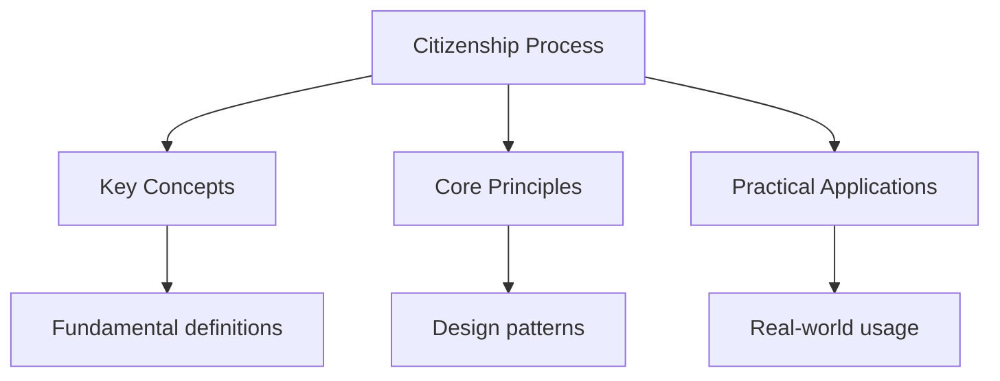

## Overview

The US naturalisation process allows permanent residents to become US citizens.
The process involves several steps: determining eligibility, filing the
application, attending the biometrics appointment, attending the interview
and test, and taking the Oath of Allegiance.

## Eligibility Requirements

To be eligible for naturalisation, you must:

- Be at least 18 years old at the time of filing
- Be a lawful permanent resident (green card holder) for at least 5 years
  (3 years if married to a US citizen)
- Have continuous residence in the US for at least 5 years (3 years if
  married to a US citizen)
- Have been physically present in the US for at least 30 months out of the
  last 5 years (18 months if married to a US citizen)
- Have lived in the state or district where you are applying for at least
  3 months
- Be able to read, write, and speak basic English
- Have a basic understanding of US history and government
- Be a person of good moral character
- Support the Constitution and be willing to take the Oath of Allegiance

## Application Process

### Step 1: File Form N-400

- Complete Form N-400 (Application for Naturalisation)
- Gather required documents (green card, passport, tax returns, etc.)
- Pay the filing fee (25 as of 2024; 40 for online filing)
- Submit the application online or by mail

### Step 2: Biometrics Appointment

- Receive a notice for your biometrics appointment
- Attend the appointment at your local USCIS office
- Provide fingerprints, photograph, and signature
- Typically takes 15-20 minutes

### Step 3: Interview and Test

- Attend your scheduled interview at the USCIS office
- Bring all original documents and translations
- The interview is conducted in English
- You will take the civics test (10 questions from the 100-question list)
- You must answer 6 out of 10 questions correctly
- You will also take an English test (reading, writing, speaking)

### Step 4: Oath of Allegiance

- Attend the oath ceremony
- Recite the Oath of Allegiance
- Receive your Certificate of Naturalisation
- You are now a US citizen!

## English Test

### Reading Test

- Read one sentence out of three sentences correctly
- The sentences are displayed on a tablet
- You have three chances to read each sentence

### Writing Test

- Write one sentence out of three sentences correctly
- The sentences are spoken aloud by the USCIS officer
- You have three chances to write each sentence

### Speaking Test

- The USCIS officer assesses your English speaking ability during the interview
- Answer questions about your application and background

## Common Pitfalls

1. **Not preparing enough for the civics test**: Study all 100 questions.
   The officer can ask any of them. Use the USCIS study materials and
   practice tests.

2. **Forgetting required documents**: Bring all original documents, including
   your green card, passport, tax returns, and any translations. Missing
   documents can delay your case.

3. **Not understanding the Oath**: The Oath of Allegiance is a solemn
   promise to support and defend the Constitution. Understand what you are
   promising before the ceremony.

## Summary

The US naturalisation process involves four main steps: filing Form N-400,
attending the biometrics appointment, passing the interview and tests (civics
and English), and taking the Oath of Allegiance. Eligibility requires being
a permanent resident for 5 years (3 years if married to a US citizen), having
continuous residence, and demonstrating English proficiency and civics
knowledge. The civics test covers 100 official questions; you must answer
6 out of 10 correctly.

## Worked Examples

### Example 1: Eligibility Check

Maria has been a permanent resident for 4 years and has been married to a
US citizen for 2 years.

**Analysis**: Maria needs 3 years of permanent residency if married to a US
citizen. She has 4 years, so she meets the residency requirement. She also
needs 18 months of physical presence in the last 3 years (married to US
citizen), which she likely meets.

**Result**: Maria is eligible to file Form N-400.

### Example 2: Civics Test Preparation

John has his interview next week. He has studied 50 of the 100 questions.

**Risk**: The officer can ask any 10 questions from the full 100-question
list. John has only studied half the material.

**Action**: Study all 100 questions. The USCIS website has official study
materials and practice tests. Focus on questions John finds difficult.

## Cross-References

- [Civics Questions](./civics-questions) - Practice all 100 questions
- [Practice Test](./practice-test) - Test your knowledge

## Advanced Content

This section provides detailed coverage of advanced concepts, including full derivations, proofs, and extended examples.

### Derivations and Proofs

Complete mathematical derivations and proofs are provided where appropriate. Each step is explained to ensure understanding of the underlying reasoning.

### Extended Examples

Advanced examples demonstrate the application of concepts to complex problems. These examples go beyond standard exam questions to develop deeper understanding.

### Research Connections

This material connects to current research and advanced applications in the field. Understanding these connections provides context for the study material.

### Prerequisites

Ensure you have mastered the prerequisite material before attempting this advanced content.

## Advanced Content

This section provides detailed coverage of advanced concepts, including full derivations, proofs, and extended examples.

### Derivations and Proofs

Complete mathematical derivations and proofs are provided where appropriate. Each step is explained to ensure understanding of the underlying reasoning.

### Extended Examples

Advanced examples demonstrate the application of concepts to complex problems. These examples go beyond standard exam questions to develop deeper understanding.

### Research Connections

This material connects to current research and advanced applications in the field. Understanding these connections provides context for the study material.

### Prerequisites

Ensure you have mastered the prerequisite material before attempting this advanced content.
