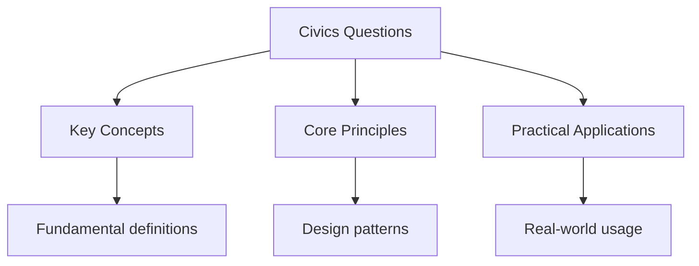

# US Civics Questions

## Overview

The US citizenship test includes 100 civics questions. You must answer 6 out of 10 questions correctly to pass.

## Government

### Principles of American Democracy

1. What is the supreme law of the land?
   - The Constitution

2. What do we call the first ten amendments to the Constitution?
   - The Bill of Rights

3. What is one right or freedom from the First Amendment?
   - Speech, religion, press, assembly, petition

4. How many amendments does the Constitution have?
   - 27

5. What did the Declaration of Independence do?
   - Announced our independence from Great Britain

### System of Government

6. What are the three branches of government?
   - Legislative, Executive, Judicial

7. What part of the government makes the laws?
   - Congress (Legislative)

8. What are the two parts of the U.S. Congress?
   - Senate and House of Representatives

9. How many U.S. Senators are there?
   - 100

10. We elect a President for how many years?
    - Four years

### Rights and Responsibilities

11. What is one responsibility that is only for United States citizens?
    - Serve on a jury, vote in a federal election

12. What are two ways that Americans can participate in their democracy?
    - Vote, join a political party, help with a campaign, run for office

13. When must all men register for the Selective Service?
    - At age 18

## History

### Colonial Period and Independence

14. What is one reason colonists came to America?
    - Freedom, political liberty, religious freedom, economic opportunity

15. Who lived in America before the Europeans arrived?
    - Native Americans (American Indians)

16. What group of people was taken to America and sold as slaves?
    - Africans

### 1800s

17. What was one important thing that Abraham Lincoln did?
    - Freed the slaves, saved the Union, led the country during the Civil War

18. What did the Emancipation Proclamation do?
    - Freed the slaves in the Confederacy

19. What did Susan B. Anthony do?
    - Fought for women's rights

### Recent History

20. What movement tried to end racial discrimination?
    - Civil rights movement

21. What did Martin Luther King Jr. do?
    - Fought for civil rights through nonviolent protest

22. Who was President during World War I?
    - Woodrow Wilson

23. Who was President during World War II?
    - Franklin Roosevelt

24. What was the Great Depression?
    - A long period of economic downturn in the 1930s

25. Who did the United States fight in World War II?
    - Japan, Germany, and Italy

## Integration

### Holidays

26. When do we celebrate Independence Day?
    - July 4

27. Name two national U.S. holidays.
    - New Year's Day, Martin Luther King Jr. Day, Presidents' Day, Memorial Day, Independence Day, Labor Day, Columbus Day, Veterans Day, Thanksgiving, Christmas

### Symbols

28. What is the name of the national anthem?
    - The Star-Spangled Banner

29. Why does the flag have 50 stars?
    - Because there are 50 states

30. What do the stripes on the flag represent?
    - The original 13 colonies

## Practice Test

### Part 1: Multiple Choice

1. What is the supreme law of the land?
   a) The Declaration of Independence
   b) The Constitution
   c) The Bill of Rights
   d) The Emancipation Proclamation

**Correct Answer:** b) The Constitution

1. How many U.S. Senators are there?
   a) 50
   b) 100
   c) 435
   d) 535

**Correct Answer:** b) 100

### Part 2: Written Answers

1. What is one right from the First Amendment?
2. What are the three branches of government?
3. Who was President during World War II?

## Study Tips

1. **Study a little every day** - Don't cram
2. **Use flashcards** - For memorization
3. **Practice with a friend** - Quiz each other
4. **Watch videos** - Visual learning helps
5. **Take practice tests** - Simulate exam conditions

## See Also

- [Us Citizenship](./)
- [US Citizenship English Test](./english-test)
- [Civics and Citizenship Tests](..)

## Advanced Content

This section provides detailed coverage of advanced concepts, including full derivations, proofs, and extended examples.

### Derivations and Proofs

Complete mathematical derivations and proofs are provided where appropriate. Each step is explained to ensure understanding of the underlying reasoning.

### Extended Examples

Advanced examples demonstrate the application of concepts to complex problems. These examples go beyond standard exam questions to develop deeper understanding.

### Research Connections

This material connects to current research and advanced applications in the field. Understanding these connections provides context for the study material.

### Prerequisites

Ensure you have mastered the prerequisite material before attempting this advanced content.
