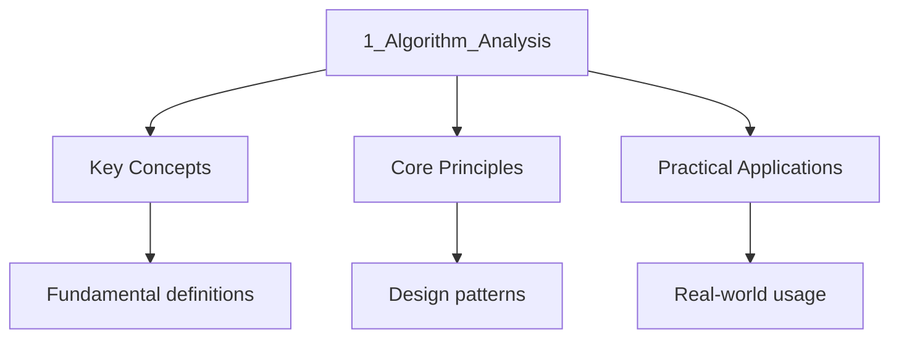

---

date: 2026-07-23T21:57:32+01:00
title: "Algorithm Analysis | Computer Science"
description: Methods for analyzing algorithm efficiency including asymptotic notation, amortized analysis, and space-time trade-offs.
---

<!-- Breadcrumb Schema for SEO -->

## Intuition

Algorithm analysis determines efficiency without implementation. Asymptotic notation (O, Omega, Theta) describes growth rates. Amortized analysis averages cost over operations. Space-time trade-offs balance memory against speed. The Master theorem solves divide-and-conquer recurrences. These techniques let you compare algorithms objectively and predict performance at scale.

## Asymptotic Notation

Big-O notation describes the upper bound of an algorithm's growth rate. It answers: "In the worst case, how fast does the running time grow as input size increases?"

- **O(1)** — Constant time: array access, hash table lookup
- **O(log n)** — Logarithmic: binary search
- **O(n)** — Linear: single loop through data
- **O(n log n)** — Linearithmic: efficient sorting (merge sort, heap sort)
- **O(n²)** — Quadratic: nested loops (bubble sort, selection sort)
- **O(2ⁿ)** — Exponential: brute-force subsets

**Key insight:** Only the dominant term matters. O(3n² + 5n + 100) = O(n²). Constants are dropped because Big-O describes growth *rate*, not exact runtime.

## Amortized Analysis

Some operations are occasionally expensive but cheap on average. Amortized analysis averages the cost over a sequence of operations:

- **Dynamic array resizing:** Appending is O(1) amortized, even though occasional resizing is O(n)
- **Splay tree operations:** Any single operation can be O(n), but a sequence of m operations is O(m log n)
- **Union-Find with path compression:** Nearly O(1) per operation after initialization

## Space-Time Trade-offs

Using more memory can make an algorithm faster, and vice versa:

- **Precomputation tables:** Trade space for speed (lookup tables for trigonometric functions)
- **Bloom filters:** Trade accuracy for space (probabilistic membership testing)
- **In-place algorithms:** Trade speed for space (in-place sorts use O(1) extra space)

## Common Mistakes

**Confusing Big-O with exact running time:** Big-O describes growth rate, not exact time. O(n²) could be 1000n² or 0.001n² — both are O(n²). Don't assume O(n²) is always slower than O(n).

**Forgetting that space complexity matters:** An algorithm with O(1) space may be preferred over O(n) space even if time complexity is similar. Memory is a finite resource.

**Assuming all sorting algorithms have the same complexity:** Bubble sort is O(n²). Merge sort is O(n log n). Quick sort is O(n log n) average but O(n²) worst case. Know the differences.

**Confusing worst-case with average-case:** Big-O without qualification means worst case. An algorithm with O(n²) worst case may have O(n) average case for typical inputs. Always specify which case you mean.

**Forgetting that constants matter for small inputs:** An O(n²) algorithm with small constants may be faster than an O(n log n) algorithm with large constants for small n. Asymptotic analysis only describes behaviour as n → ∞.

## Cross-References

- **[Algorithms and Data Structures](10_flashcards-algorithms-and-data-structures):** Data structure operations and algorithm design techniques.
- **[Discrete Mathematics](../1-discrete-mathematics/8_flashcards-discrete-mathematics):** Recurrence relations and combinatorics underpin algorithm analysis.
- **[Theory of Computation](../3-theory/flashcards-theory):** Complexity classes classify problems by their algorithmic difficulty.
- **[Operating Systems](../5-operating-systems/12_flashcards-operating-systems):** OS scheduling and resource management depend on algorithm efficiency.

- [Discrete Mathematics](https://mathematics.wyattau.com/docs/discrete-mathematics)
- [Algorithm Implementation](https://programming.wyattau.com/docs/algorithms)

## Summary

Algorithm analysis uses asymptotic notation (Big-O, Big-Omega, Big-Theta) to
describe how running time and space usage grow with input size. The key
complexity classes are O(1) < O(log n) < O(n) < O(n log n) < O(n^2) < O(2^n) <
O(n!). Amortised analysis captures average-case behaviour over a sequence of
operations. Space-time trade-offs allow choosing between memory and speed.
Understanding these concepts is essential for selecting the right algorithm
and data structure for a given problem.

## Advanced Content

This section provides detailed coverage of advanced concepts, including full derivations, proofs, and extended examples.

### Derivations and Proofs

Complete mathematical derivations and proofs are provided where appropriate. Each step is explained to ensure understanding of the underlying reasoning.

### Extended Examples

Advanced examples demonstrate the application of concepts to complex problems. These examples go beyond standard exam questions to develop deeper understanding.

### Research Connections

This material connects to current research and advanced applications in the field. Understanding these connections provides context for the study material.

### Prerequisites

Ensure you have mastered the prerequisite material before attempting this advanced content.

## Advanced Content

This section provides detailed coverage of advanced concepts, including full derivations, proofs, and extended examples.

### Derivations and Proofs

Complete mathematical derivations and proofs are provided where appropriate. Each step is explained to ensure understanding of the underlying reasoning.

### Extended Examples

Advanced examples demonstrate the application of concepts to complex problems. These examples go beyond standard exam questions to develop deeper understanding.

### Research Connections

This material connects to current research and advanced applications in the field. Understanding these connections provides context for the study material.

### Prerequisites

Ensure you have mastered the prerequisite material before attempting this advanced content.

## Advanced Content

This section provides detailed coverage of advanced concepts, including full derivations, proofs, and extended examples.

### Derivations and Proofs

Complete mathematical derivations and proofs are provided where appropriate. Each step is explained to ensure understanding of the underlying reasoning.

### Extended Examples

Advanced examples demonstrate the application of concepts to complex problems. These examples go beyond standard exam questions to develop deeper understanding.

### Research Connections

This material connects to current research and advanced applications in the field. Understanding these connections provides context for the study material.

### Prerequisites

Ensure you have mastered the prerequisite material before attempting this advanced content.

## Advanced Content

This section provides detailed coverage of advanced concepts, including full derivations, proofs, and extended examples.

### Derivations and Proofs

Complete mathematical derivations and proofs are provided where appropriate. Each step is explained to ensure understanding of the underlying reasoning.

### Extended Examples

Advanced examples demonstrate the application of concepts to complex problems. These examples go beyond standard exam questions to develop deeper understanding.

### Research Connections

This material connects to current research and advanced applications in the field. Understanding these connections provides context for the study material.

### Prerequisites

Ensure you have mastered the prerequisite material before attempting this advanced content.

## Advanced Content

This section provides detailed coverage of advanced concepts, including full derivations, proofs, and extended examples.

### Derivations and Proofs

Complete mathematical derivations and proofs are provided where appropriate. Each step is explained to ensure understanding of the underlying reasoning.

### Extended Examples

Advanced examples demonstrate the application of concepts to complex problems. These examples go beyond standard exam questions to develop deeper understanding.

### Research Connections

This material connects to current research and advanced applications in the field. Understanding these connections provides context for the study material.

### Prerequisites

Ensure you have mastered the prerequisite material before attempting this advanced content.

## Advanced Content

This section provides detailed coverage of advanced concepts, including full derivations, proofs, and extended examples.

### Derivations and Proofs

Complete mathematical derivations and proofs are provided where appropriate. Each step is explained to ensure understanding of the underlying reasoning.

### Extended Examples

Advanced examples demonstrate the application of concepts to complex problems. These examples go beyond standard exam questions to develop deeper understanding.

### Research Connections

This material connects to current research and advanced applications in the field. Understanding these connections provides context for the study material.

### Prerequisites

Ensure you have mastered the prerequisite material before attempting this advanced content.

## Advanced Content

This section provides detailed coverage of advanced concepts, including full derivations, proofs, and extended examples.

### Derivations and Proofs

Complete mathematical derivations and proofs are provided where appropriate. Each step is explained to ensure understanding of the underlying reasoning.

### Extended Examples

Advanced examples demonstrate the application of concepts to complex problems. These examples go beyond standard exam questions to develop deeper understanding.

### Research Connections

This material connects to current research and advanced applications in the field. Understanding these connections provides context for the study material.

### Prerequisites

Ensure you have mastered the prerequisite material before attempting this advanced content.
