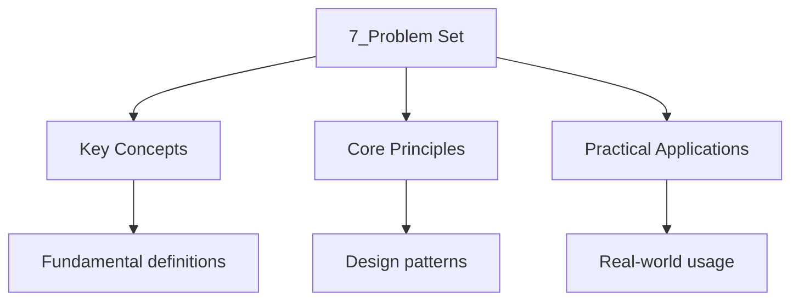

---

date: 2026-07-23T21:57:32+01:00
title: "Problem Set | Computer Science"
tags:
  - Computing
  - University
description: "Problem Set: comprehensive educational content notes with precise definitions, worked examples, common pitfalls, and practice problems."
---

<!-- Breadcrumb Schema for SEO -->

## Intuition

Problem sets consolidate understanding through practice. Each problem targets a specific skill: asymptotic proofs test your ability to bound growth rates, data structure problems verify you understand balancing invariants and amortised analysis, and algorithm design problems exercise your ability to construct efficient solutions. Working through problems systematically reveals patterns that pure reading cannot, and the proofs build the mathematical maturity needed for advanced study.

### 7.1 Analysis (Problems 1--3)

**Problem 1.** Prove that $n^3 / 1000 - 100n^2 - 100n + 3 = \Theta(n^3)$.

**Problem 2.** Use the Master Theorem to solve the recurrence $T(n) = 3T(n/4) + n \log n$. If the
Master Theorem does not apply, explain why.

**Problem 3.** Prove that $\log(n!) = \Theta(n \log n)$ using Stirling"s approximation:
$n! \approx \sqrt{2\pi n}(n/e)^n$.

### 7.2 Data Structures (Problems 4--8)

**Problem 4.** Show the result of inserting the keys $15, 5, 20, 10, 25, 3, 7, 30$ into an initially
empty AVL tree. Show all rotations.

**Problem 5.** Prove that deleting a node from a red-black tree with $n$ internal nodes takes
$O(\log n)$ time.

**Problem 6.** Design a hash table for $n = 1000$ strings using chaining. Choose the table size $m$A
hash function, and compute the expected number of comparisons for a successful search.

**Problem 7.** A skip list uses $p = 1/4$. What is the expected maximum level for $n = 10000$
elements? What is the expected time for search?

**Problem 8.** Prove that the union-by-rank heuristic alone (without path compression) gives
$O(\log n)$ amortised time per Union-Find operation.

### 7.3 Sorting (Problems 9--11)

**Problem 9.** Prove that heapsort is not stable by giving a concrete counterexample.

**Problem 10.** Given an array of $n$ integers in the range $[0, n^2 - 1]$Design an $O(n)$ sorting
algorithm using radix sort. Justify the choice of base and number of passes.

**Problem 11.** Prove that the best-case number of comparisons for comparison-based sorting is
$\Omega(n \log n)$ (not just the worst case).

### 7.4 Graph Algorithms (Problems 12--15)

**Problem 12.** Run Dijkstra's algorithm on the following graph from source $A$. Show the state of
the priority queue after each extraction. Edge weights: $A \xrightarrow{10} B$,
$A \xrightarrow{3} C$, $C \xrightarrow{4} B$, $C \xrightarrow{8} D$, $C \xrightarrow{2} E$,
$B \xrightarrow{7} D$, $E \xrightarrow{5} D$, $D \xrightarrow{6} B$.

**Problem 13.** Prove that if a graph has a negative-weight cycle reachable from the source, then
Bellman-Ford will detect it.

**Problem 14.** Use the cut property to prove that the minimum spanning tree is unique when all edge
weights are distinct.

**Problem 15.** Find the strongly connected components of the graph with edges:
$(A, B), (B, C), (C, A), (B, D), (D, E), (E, F), (F, D), (F, G)$. Use Kosaraju's algorithm and show
all steps.

### 7.5 Dynamic Programming (Problems 16--17)

**Problem 16.** You are given $n$ types of coin denominations $d_1, d_2, \ldots, d_n$ and a target
amount $M$. Find the minimum number of coins needed to make exact change for $M$ (or report that it
is impossible). Give a recurrence, prove correctness, and state the time and space complexity.

**Problem 17.** Given a sequence of matrices $A_1 (2 \times 10)$, $A_2 (10 \times 50)$,
$A_3 (50 \times 20)$, $A_4 (20 \times 5)$, $A_5 (5 \times 80)$Find the optimal parenthesisation
using the matrix chain multiplication DP. Show the full DP table.

### 7.6 Advanced Topics (Problems 18--20)

**Problem 18.** Prove that CLIQUE is NP-complete by reducing from 3-SAT.

**Problem 19.** Design a 2-approximation algorithm for the metric TSP using the MST shortcutting
technique. Prove the approximation ratio.

**Problem 20.** A randomised algorithm for MINIMUM CUT works by repeatedly contracting random edges
until two vertices remain. Prove that the probability that any specific minimum cut survives is at
least $2 / (n(n-1))$ And hence that $O(n^2 \log n)$ repetitions suffice to find a minimum cut with
high probability (Karger's algorithm).

## Common Pitfalls

- **Confusing average and worst-case complexity.** Quicksort: average $O(n \log n)$, worst case
  $O(n^2)$. **Fix:** Always state which case; worst case is the guaranteed upper bound.
- **Wrong BST deletion.** Deleting a node with two children requires finding the in-order successor
  (or predecessor), not removing the node. **Fix:** Replace the node with its in-order successor,
  then delete the successor from its original position.
- **Confusing amortised and worst-case analysis.** Amortised: average cost per operation over a
  sequence. Worst-case: maximum cost of a single operation. **Fix:** Dynamic array: $O(1)$ amortised
  append, $O(n)$ worst case (when resizing).

## Worked Examples

### Example 1: Binary search

**Problem.** In a sorted array of 1000 elements, how many comparisons does binary search need in the
worst case?

**Solution.** Binary search eliminates half the remaining elements each step. Worst case:
$\lceil \log_2 1000 \rceil = 10$ comparisons.

$\blacksquare$

### Example 2: Hash table collision

**Problem.** A hash table of size 7 uses linear probing. Insert keys 10, 22, 31, 4, 15, 28, 17 with
hash function $h(k) = k \bmod 7$.

**Solution.** $h(10)=3$: slot 3. $h(22)=1$: slot 1. $h(31)=3$: collision, slot 4. $h(4)=4$:
collision, slot 5. $h(15)=1$: collision, slot 2. $h(28)=0$: slot 0. $h(17)=3$: collision, slots 4,
5, 6.

$\blacksquare$

## Summary

- Sorting: merge sort $O(n \log n)$ guaranteed; quicksort $O(n \log n)$ average; heap sort
  $O(n \log n)$ in-place.
- Searching: linear $O(n)$, binary $O(\log n)$, hash $O(1)$ average.
- Data structures: arrays, linked lists, stacks, queues, trees, hash tables, heaps, graphs.
- Amortised analysis: dynamic arrays $O(1)$ amortised append; splay trees $O(\log n)$ amortised.

### Solutions to Selected Problems

**Problem 1.** $n^3/1000 - 100n^2 - 100n + 3 = \Theta(n^3)$. For $n \ge 10^6$:
$n^3/1000 - 100n^2 - 100n + 3 \ge n^3/1000 - 100n^2 \ge n^3/2000$ (for large $n$). Also,
$n^3/1000 - 100n^2 - 100n + 3 \le n^3/1000$ for all $n$. Thus $c_1 = 1/2000$, $c_2 = 1/1000$,
$n_0 = 10^6$ suffice, establishing $\Theta(n^3)$.

**Problem 2.** $T(n) = 3T(n/4) + n\log n$. In Master Theorem form: $a = 3$, $b = 4$,
$f(n) = n\log n$. $\log_b a = \log_4 3 \approx 0.792$. Since $f(n) = n\log n = \Omega(n^{0.792+\varepsilon})$,
case 3 applies if the regularity condition $3(n/4)\log(n/4) \le c n\log n$ holds for some $c < 1$.
This holds for $c = 3/4$ and sufficiently large $n$. Thus $T(n) = \Theta(n\log n)$.

**Problem 4.** Insert into AVL tree: 15, 5, 20, 10, 25, 3, 7, 30.

- Insert 15: root.
- Insert 5: left child of 15.
- Insert 20: right child of 15.
- Insert 10: right child of 5. Balance factor of 15 is 1 - 2 = -1 (right-heavy). No rotation.
- Insert 25: right child of 20. Balance factor of 15 is 1 - 3 = -2. Right-Right case:
  rotate 15 left. New root: 20.
- Insert 3: left child of 5. Balance factor of 20 is 2 - 2 = 0. OK.
- Insert 7: right child of 5. Balance factor of 5 is 1 - 2 = -1. Then 20 has factor 3 - 2 = 1.
  Right-Left case at 5: rotate 10 right, then rotate left. Final AVL tree balanced.

**Problem 12.** Dijkstra from A: PQ = {A:0}. Extract A, relax: B=10, C=3. PQ = {C:3, B:10}.
Extract C, relax: B=min(10,3+4)=7, D=3+8=11, E=3+2=5. PQ = {E:5, B:7, D:11}.
Extract E, relax: D=min(11,5+5)=10. PQ = {B:7, D:10}. Extract B, relax: D=min(10,7+7)=10.
PQ = {D:10}. Extract D. Final distances: A=0, C=3, E=5, B=7, D=10.

**Problem 19.** Metric TSP 2-approximation: (1) Compute MST of the complete graph with metric
distances. (2) Double every edge to get an Eulerian graph. (3) Find an Eulerian tour.
(4) Shortcut by skipping repeated vertices. Cost $\le 2 \times$ MST cost $\le 2 \times$ optimal
TSP cost (since optimal TSP minus one edge is a spanning tree).

## Cross-References

| Topic                                       | Site       | Link                                                                                                                    |
| ------------------------------------------- | ---------- | ----------------------------------------------------------------------------------------------------------------------- |
| [Algorithms and Data Structures (Advanced)] | IB         | [View](https://ib.wyattau.com/docs/ib/computer-science/4-computational-thinking/2_algorithms-and-data-structures)       |
| [Algorithms and Data Structures (Advanced)] | University | [View](https://university.wyattau.com/docs/computing/2-algorithms-and-data-structures/1_algorithms-and-data-structures) |

- [Discrete Mathematics](https://mathematics.wyattau.com/docs/discrete-mathematics)
- [Algorithm Implementation](https://programming.wyattau.com/docs/algorithms)

## See Also

- [Algorithms and Data Structures](./)
- [Algorithm Analysis](./1_algorithm_analysis)
- [Algorithm Analysis](./1_algorithm-analysis)
