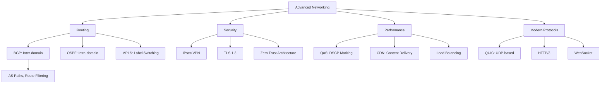

---

title: "Computer Networks (Advanced) | Computer Science"
description: "\"itemListElement\": [{\"name\": \"Home\", \"url\": \"https://wyattau.com\"}, {\"name\": \"computer-science\", \"url\": \"https://computer-science.wyattau.com\"}, {\"name\": \"3"
date: 2026-05-06T00:00:00.000Z
tags:
  - Computing
  - University
categories:
  - Computing

---

<!-- Breadcrumb Schema for SEO -->
<script type="application/ld+json">
{
  "@context": "https://schema.org",
  "@type": "BreadcrumbList",
  "itemListElement": [{"name": "Home", "url": "https://wyattau.com"}, {"name": "computer-science", "url": "https://computer-science.wyattau.com"}, {"name": "3 Computer Networks", "url": "https://computer-science.wyattau.com/3-computer-networks"}, {"name": "9_computer Networks Advanced", "url": "https://computer-science.wyattau.com/3-computer-networks/9_computer-networks-advanced"}]
}
</script>

## 1. Advanced Routing Protocols

### 1.1 OSPF in Depth

**OSPF (Open Shortest Path First)** is a link-state routing protocol using Dijkstra's algorithm. It
operates within a single **autonomous system (AS)**.

**OSPF areas.** A large OSPF network is divided into areas to reduce the size of link-state
databases and the computational cost of SPF:

| Area type              | Function                                                     | LSA types        |
| ---------------------- | ------------------------------------------------------------ | ---------------- |
| Backbone (Area 0)      | Central area, all traffic between areas passes through it    | All types        |
| Non-backbone (regular) | Connects to backbone via ABR                                 | Types 1, 2, 3, 4 |
| Stub                   | No external routes; default route from ABR                   | Types 1, 2, 3    |
| Totally stubby         | No inter-area or external routes; default route only         | Types 1, 2       |
| NSSA                   | Allows external routes as type 7, converted to type 5 at ABR | Types 1, 2, 3, 7 |

**LSA types:**

| Type | Name                  | Scope | Generated by             |
| ---- | --------------------- | ----- | ------------------------ |
| 1    | Router LSA            | Area  | Every router             |
| 2    | Network LSA           | Area  | DR on broadcast networks |
| 3    | Summary LSA (network) | Area  | ABR                      |
| 4    | Summary LSA (ASBR)    | Area  | ABR                      |
| 5    | AS-external LSA       | AS    | ASBR                     |
| 7    | NSSA external LSA     | NSSA  | ASBR in NSSA             |

**SPF computation complexity.** For an area with $n$ routers and $m$ links, each SPF run takes
$O(m + n \log n)$ using a priority queue. With triggered updates, SPF runs only when the topology
changes, not periodically.

**Theorem 1.1.** OSPF converges in $O(D)$ time where $D$ is the network diameter (number of hops),
assuming reliable flooding.

_Proof._ When a link state changes, the originating router floods the new LSA. Flooding takes $O(D)$
time to reach all routers. Each router then runs SPF, which takes $O(m + n \log n)$. The total
convergence time is dominated by the flooding delay, $O(D)$. $\blacksquare$

<details>
<summary>Worked Example: OSPF Area Design</summary>

Design an OSPF network with 4 regions, each with 20--30 routers, connected by a backbone.

**Design:**

Area 0 (backbone): 4 ABRs, full mesh or partial mesh. Use high-bandwidth links.

Areas 1--4 (non-backbone): Each contains 20--30 internal routers and 1 ABR connecting to Area 0.

**LSA distribution:**

- Routers within each area exchange Type 1 and Type 2 LSAs (only area-local).
- ABRs generate Type 3 summary LSAs to advertise routes from one area to another.
- External routes (e.g., to the Internet) are advertised as Type 5 LSAs by the ASBR.

**Benefit of areas:** Without areas, each router's SPF database has $80$--$120$ entries and SPF runs
are $O(120 \log 120)$. With areas, each router's database has only $20$--$30$ entries (area-local),
and inter-area routing is handled by ABRs using summary LSAs.

**Failure scenario:** If a link fails in Area 2, only routers in Area 2 (and ABRs) need to re-run
SPF. Routers in Area 1 are unaffected.

</details>

### 1.2 BGP in Depth

**BGP (Border Gateway Protocol)** is the inter-domain routing protocol of the Internet. It exchanges
reachability information between autonomous systems.

**BGP types:**

| Type | Function               | Peers                                               |
| ---- | ---------------------- | --------------------------------------------------- |
| eBGP | Between different ASes | External neighbours                                 |
| iBGP | Within the same AS     | Internal neighbours (full mesh or route reflectors) |

**BGP attributes:**

| Attribute             | Category                 | Purpose                                     |
| --------------------- | ------------------------ | ------------------------------------------- |
| AS_PATH               | Well-known mandatory     | List of ASes traversed (loop detection)     |
| NEXT_HOP              | Well-known mandatory     | Next-hop IP address                         |
| ORIGIN                | Well-known mandatory     | Origin of the route (IGP, EGP, incomplete)  |
| LOCAL_PREF            | Well-known discretionary | Preference within the AS (higher is better) |
| MED (MULTI_EXIT_DISC) | Optional non-transitive  | Preferred exit point to a neighbouring AS   |
| COMMUNITY             | Optional transitive      | Tag for route filtering/policy              |
| ATOMIC_AGGREGATE      | Well-known discretionary | Route is an aggregate (less specific)       |

**BGP decision process (simplified):**

1. Highest WEIGHT (Cisco-specific, local to router).
2. Highest LOCAL_PREF.
3. Locally originated (network or aggregate).
4. Shortest AS_PATH.
5. Lowest ORIGIN type (IGP < EGP < incomplete).
6. Lowest MED.
7. EBGP over iBGP.
8. Lowest IGP metric to NEXT_HOP.
9. Oldest route (for eBGP).
10. Lowest router ID.
11. Lowest neighbour address.

**Theorem 1.2.** BGP guarantees loop-freedom: a router never accepts a route whose AS_PATH contains
its own AS number.

_Proof._ Before accepting a route, a BGP speaker checks if its own AS number appears in the AS_PATH
attribute. If it does, the route is rejected. Since each AS prepends its number when advertising a
route, any loop would cause the AS number to appear twice, triggering the rejection. $\blacksquare$

:::caution
oscillate between multiple stable states (known as BGP wedgies or "persistent oscillation"). The
Gao-Rexford conditions ensure convergence: (1) routes are ranked by customer-provider-peer
relationships, (2) an AS never prefers a route through a peer over a route through a customer, and
(3) an AS never exports routes learned from one peer to another peer.
:::
### 1.3 Route Aggregation

Route aggregation (supernetting) reduces the size of routing tables by combining multiple routes
into a single summary route.

**Example:** Routes 192.168.0.0/24, 192.168.1.0/24, 192.168.2.0/24, 192.168.3.0/24 can be aggregated
to 192.168.0.0/22.

**Method:** Find the common prefix. The four networks have binary prefixes:

```
192.168.0.0/24  = 11000000.10101000.00000000.00000000
192.168.1.0/24  = 11000000.10101000.00000001.00000000
192.168.2.0/24  = 11000000.10101000.00000010.00000000
192.168.3.0/24  = 11000000.10101000.00000011.00000000
```

Common bits: first 22 bits = 11000000.10101000.000000 = 192.168.0.0/22.

**Theorem 1.3.** A set of $2^k$ contiguous routes with prefix length $n$ can always be aggregated to
a single route with prefix length $n - k$Provided they share the same first $n - k$ bits.

<details>
<summary>Worked Example: Route Aggregation and Subnetting</summary>

A company has been allocated the network 172.16.0.0/16. It needs to create subnets for:

- 4 offices, each requiring up to 2000 hosts.
- 2 data centres, each requiring up to 8000 hosts.
- 1 headquarters requiring up to 16000 hosts.

**Subnet allocation:**

Total addresses: $2^{16} = 65536$.

Headquarters: 16000 hosts needs $\lceil \log_2(16002) \rceil = 15$ bits for hosts, so $/17$
($32 - 15 = 17$). But 16000 < $2^{14} = 16384$ So $/18$ suffices (16382 usable hosts). Allocate
172.16.0.0/18.

Data centres: 8000 hosts needs $\lceil \log_2(8002) \rceil = 14$ bits, so $/18$ suffices. Allocate
172.16.64.0/18 and 172.16.128.0/18.

Offices: 2000 hosts needs $\lceil \log_2(2002) \rceil = 12$ bits, so $/20$ suffices (4094 usable
hosts). Allocate:

- Office 1: 172.16.192.0/20
- Office 2: 172.16.208.0/20
- Office 3: 172.16.224.0/20
- Office 4: 172.16.240.0/20

Verification:

- HQ: 172.16.0.0/18 covers 172.16.0.0 -- 172.16.63.255 (16384 addresses).
- DC1: 172.16.64.0/18 covers 172.16.64.0 -- 172.16.127.255 (16384 addresses).
- DC2: 172.16.128.0/18 covers 172.16.128.0 -- 172.16.191.255 (16384 addresses).
- Offices: 172.16.192.0/20, 172.16.208.0/20, 172.16.224.0/20, 172.16.240.0/20 cover 172.16.192.0 --
  172.16.255.255 (16384 addresses).

Total: $4 \times 16384 = 65536$. Exact fit. ✓

Offices can be aggregated: 172.16.192.0/18 (covers all four /20 networks).

</details>

## 2. Advanced Transport Layer

### 2.1 TCP Congestion Control -- Detailed Analysis

TCP uses an **additive-increase multiplicative-decrease (AIMD)** algorithm for congestion control.

**Phases:**

1. **Slow start:** cwnd doubles each RTT (exponential growth). Starts with cwnd = 1 MSS.
2. **Congestion avoidance:** cwnd increases by 1 MSS per RTT (linear growth). Triggered when cwnd
   reaches ssthresh.
3. **Fast retransmit:** After 3 duplicate ACKs, retransmit the lost segment without waiting for the
   timeout.
4. **Fast recovery:** After fast retransmit, set cwnd = ssthresh + 3 MSS (instead of resetting to 1
   MSS). Inflate cwnd by 1 MSS for each additional duplicate ACK.

**TCP Reno vs TCP Tahoe:**

| Event      | Tahoe                           | Reno                                   |
| ---------- | ------------------------------- | -------------------------------------- |
| Timeout    | cwnd = 1 MSS, ssthresh = cwnd/2 | Same                                   |
| 3 dup ACKs | cwnd = 1 MSS, ssthresh = cwnd/2 | cwnd = ssthresh + 3 MSS, fast recovery |

**Theorem 2.1 (TCP throughput).** The average throughput of TCP Reno is approximately:

$$\text{Throughput} \approx \frac{1.22 \cdot \text{MSS}{\text{RTT} \cdot \sqrt{p}}}$$

Where $p$ is the packet loss rate.

_Proof (outline)._ TCP oscillates between cwnd $= W/2$ and cwnd $= W$Where $W$ is the window size at
which loss occurs. The area under the AIMD sawtooth is approximately $\frac{3}{8} W^2$ (the integral
of the linear increase from $W/2$ to $W$). The number of packets sent per cycle is
$\frac{3}{8} W^2$. The cycle length is $W/2$ RTTs. The loss rate is approximately
$1/(\frac{3}{8} W^2)$ (one loss per cycle). So $W \approx \sqrt{8/(3p)}$. The throughput is
$\frac{3}{8} W^2 / (\frac{W}{2} \cdot \text{RTT}) = \frac{3W}{4 \cdot \text{RTT} \approx \frac{1.22 \cdot \text{MSS}{\text{RTT} \cdot \sqrt{p}}}}$.
$\blacksquare$

### 2.2 TCP Variants

| Variant     | Congestion control         | Key feature                                   |
| ----------- | -------------------------- | --------------------------------------------- |
| TCP Tahoe   | AIMD, slow start           | cwnd = 1 on any loss                          |
| TCP Reno    | AIMD + fast recovery       | cwnd = ssthresh + 3 on 3 dup ACKs             |
| TCP NewReno | Enhanced fast recovery     | Partial ACK handling                          |
| TCP Cubic   | Cubic function of time     | Better for high-bandwidth, high-latency links |
| TCP BBR     | Bottleneck bandwidth + RTT | Does not use loss as signal                   |

**TCP Cubic.** Replaces the linear increase with a cubic function:

$$\text{cwnd}(t) = W_{\max} + \beta \cdot \left(\frac{t}{K}\right)^3 - (W_{\max} - \text{cwnd_}{\text{low})}$$

Where $W_{\max}$ is the window size at the last loss event,
$K = \sqrt[3]{W_{\max} \cdot \beta / C}$, $\beta = 0.4$ And $C = 0.4$.

The cubic function grows slowly near $W_{\max}$ (probing) and rapidly far from it (quick recovery),
making it suitable for high-BDP (bandwidth-delay product) networks.

**TCP BBR (Bottleneck Bandwidth and Round-trip propagation time).** Instead of using packet loss as
a congestion signal, BBR explicitly estimates:

1. **BtlBw:** The bottleneck bandwidth (maximum delivery rate over a window).
2. **RTprop:** The minimum RTT (propagation delay).

BBR cycles through four phases:

1. **Startup:** Exponential growth to estimate BtlBw (like slow start).
2. **Drain:** Reduce sending rate to match BtlBw.
3. **ProbeBW:** Cycle between sending at BtlBw and slightly above/below (gain cycling).
4. **ProbeRTT:** Periodically reduce cwnd to 4 MSS to measure RTprop.

### 2.3 QUIC Protocol

**QUIC** (Quick UDP Internet Connections) is a transport protocol built on UDP, designed to replace
TCP+TLS+HTTP/2 with a single protocol.

**Key features:**

| Feature               | TCP + TLS                   | QUIC                              |
| --------------------- | --------------------------- | --------------------------------- |
| Connection setup      | 2--3 RTTs (TCP + TLS)       | 0--1 RTTs (with 0-RTT resumption) |
| Head-of-line blocking | Across all streams          | Per-stream (independent streams)  |
| Connection migration  | Tied to 4-tuple (IP + port) | Connection ID, survives IP change |
| Encryption            | TLS at application layer    | Built-in (TLS 1.3 integrated)     |
| Loss detection        | Retransmission timeout      | Probe packets, explicit ACKs      |
| Congestion control    | Cubic, Reno                 | Pluggable (Cubic by default)      |

**Connection migration.** QUIC uses connection IDs instead of the 4-tuple to identify connections.
This allows a connection to survive IP address changes (e.g., switching from Wi-Fi to cellular).

**0-RTT resumption.** If a client has previously connected to a server, it can send application data
in the first packet (using saved session parameters). This eliminates the round trip for connection
establishment.

:::caution
the client's 0-RTT data can replay it to the server. Applications must ensure that 0-RTT requests
are idempotent (safe to execute multiple times). The server can reject 0-RTT for non-idempotent
operations.
:::
## 3. Network Performance Analysis

### 3.1 Queueing Theory Basics

**M/M/1 queue.** Poisson arrivals (rate $\lambda$), exponential service times (rate $\mu$), single
server.

**Utilisation:** $\rho = \lambda / \mu$ (must be $\rho < 1$ for stability).

**Theorem 3.1.** For an M/M/1 queue:

- Average number in system: $L = \rho / (1 - \rho)$.
- Average time in system: $W = 1 / (\mu - \lambda)$.
- Average number in queue: $L_q = \rho^2 / (1 - \rho)$.
- Average time in queue: $W_q = \rho / (\mu - \lambda)$.

_Proof._ By Little's Law ($L = \lambda W$) and the properties of the geometric distribution of the
number in system. The probability of $n$ in system is $(1 - \rho) \rho^n$. The expected value is
$\sum_{n=0}^{\infty} n(1-\rho)\rho^n = \rho/(1-\rho)$. $\blacksquare$

**Little's Law.** For any stable system: $L = \lambda W$Where $L$ is the long-term average number of
customers in the system, $\lambda$ is the arrival rate, and $W$ is the average time a customer
spends in the system.

<details>
<summary>Worked Example: Network Queueing Analysis</summary>

A router receives packets at rate $\lambda = 800$ packets/second. The router can process packets at
rate $\mu = 1000$ packets/second. Service time is exponentially distributed.

Utilisation: $\rho = 800/1000 = 0.8$.

Average packets in system: $L = 0.8 / (1 - 0.8) = 0.8 / 0.2 = 4$ packets. Average time in system:
$W = 1 / (1000 - 800) = 1/200 = 5$ ms. Average packets in queue: $L_q = 0.64 / 0.2 = 3.2$ packets.
Average time in queue: $W_q = 0.8 / 200 = 4$ ms.

**What if the arrival rate increases to 950?**

$\rho = 0.95$. $L = 0.95 / 0.05 = 19$ packets (nearly 5x increase!). $W = 1 / 50 = 20$ ms.
$L_q = 0.9025 / 0.05 = 18.05$ packets.

This illustrates the dramatic effect of high utilisation on queueing delays.

</details>

### 3.2 Effective Throughput and Goodput

**Throughput:** Total data delivered per unit time (including retransmissions). **Goodput:** Useful
application data delivered per unit time (excluding headers, retransmissions).

$$\text{Goodput} = \text{Throughput} \times \frac{\text{Application} data}{\text{Total} bytes transferred} \times (1 - \text{loss} rate)$$

**Bandwidth-Delay Product (BDP):** The amount of data "in flight" (sent but not yet acknowledged):

$$\text{BDP} = \text{Bandwidth} \times \text{RTT}$$

For a 1 Gbps link with 50 ms RTT: $\text{BDP} = 10^9 \times 0.05 = 50 \times 10^6$ bits $= 6.25$ MB.

The TCP receive window must be at least the BDP for full utilisation.

### 3.3 Network Calculus

**Network calculus** provides bounds on delay and backlog in packet-switched networks using min-plus
algebra.

**Arrival curve.** $\alpha(t) = \sigma + \rho t$ (token bucket): the maximum number of bits that can
arrive in any interval of length $t$.

**Service curve.** $\beta(t) = R(t - T)^+$ (rate-latency): the minimum service guaranteed in any
interval of length $t$.

**Theorem 3.2.** For an arrival curve $\alpha(t) = \sigma + \rho t$ and a service curve
$\beta(t) = R(t - T)^+$ with $R > \rho$:

- **Maximum delay bound:** $d_{\max} = T + \sigma / R$.
- **Maximum backlog bound:** $b_{\max} = \sigma + \rho T$.

## 4. Advanced Application Layer

### 4.1 DNS Resolution in Detail

**DNS resolution process for <www.example.com>:**

1. **Browser cache:** Check local cache.
2. **OS resolver cache:** Check `/etc/hosts` and OS DNS cache.
3. **Recursive resolver:** Query the configured DNS resolver (e.g., 8.8.8.8).
4. **Root name server:** Resolver queries root server for `.com` TLD.
5. **TLD name server:** Resolver queries `.com` server for `example.com`.
6. **Authoritative name server:** Resolver queries `example.com` server for `www.example.com`.
7. **Response returned** to the client.

**DNS record types:**

| Type  | Function               | Example                                                     |
| ----- | ---------------------- | ----------------------------------------------------------- |
| A     | IPv4 address           | `www.example.com. IN A 93.184.216.34`                       |
| AAAA  | IPv6 address           | `www.example.com. IN AAAA 2606:2800:220:1:...`              |
| CNAME | Canonical name (alias) | `blog.example.com. IN CNAME example.com.`                   |
| MX    | Mail exchange          | `example.com. IN MX 10 mail.example.com.`                   |
| NS    | Name server            | `example.com. IN NS ns1.example.com.`                       |
| TXT   | Text (SPF, DKIM)       | `example.com. IN TXT "v=spf1 ..."`                          |
| SOA   | Start of authority     | Zone serial, refresh, retry, expire                         |
| SRV   | Service location       | `_sip._tcp.example.com. IN SRV 10 60 5060 sip.example.com.` |

**DNS caching and TTL.** Each DNS record has a Time-To-Live (TTL) value. Resolvers cache records for
up to the TTL. When the TTL expires, the resolver must re-query.

### 4.2 HTTP/2 and HTTP/3

**HTTP/2 improvements over HTTP/1.1:**

1. **Multiplexing:** Multiple requests/responses over a single TCP connection (no head-of-line
   blocking at the HTTP level).
2. **Header compression (HPACK):** Compresses headers using a static and dynamic table.
3. **Server push:** Server can proactively send resources the client will need.
4. **Binary framing:** Replaces text-based protocol with binary frames.

**HTTP/2 head-of-line blocking.** Although HTTP/2 eliminates HOL blocking at the application layer,
TCP's HOL blocking remains: a single lost packet blocks all streams on the same TCP connection.

**HTTP/3 (QUIC):** Replaces TCP with QUIC, eliminating transport-layer HOL blocking:

| Issue                | HTTP/2 (TCP)                       | HTTP/3 (QUIC)                          |
| -------------------- | ---------------------------------- | -------------------------------------- |
| HOL blocking         | TCP-level (all streams blocked)    | Per-stream (independent loss recovery) |
| Connection setup     | 1 RTT (TCP) + 1 RTT (TLS) = 2 RTTs | 1 RTT (integrated TLS 1.3)             |
| 0-RTT                | Not supported                      | Supported (with replay risk)           |
| Connection migration | Not possible                       | Supported (connection IDs)             |

### 4.3 Content Delivery Networks (CDNs)

A **CDN** distributes content across geographically distributed servers to reduce latency and
improve availability.

**CDN selection strategies:**

1. **Round-robin DNS:** Simple but ignores network conditions.
2. **Latency-based routing:** Direct user to the server with lowest RTT.
3. **Geolocation:** Use IP geolocation to route to nearest server.
4. **Anycast:** Multiple servers share the same IP address; BGP routing directs to nearest.

**Caching strategies:**

| Strategy                          | Description                              |
| --------------------------------- | ---------------------------------------- |
| Cache-Control: max-age            | Client caches for specified seconds      |
| ETag / If-None-Match              | Validates cache using entity tag         |
| Last-Modified / If-Modified-Since | Validates using modification time        |
| Vary                              | Cache key includes specified headers     |
| Stale-while-revalidate            | Serve stale content while fetching fresh |

## 5. Network Security in Depth

### 5.1 TLS 1.3 Handshake

TLS 1.3 simplifies the handshake to 1 RTT (down from 2 RTTs in TLS 1.2):

**1-RTT handshake:**

```
Client                          Server
  |                               |
  |  ClientHello + KeyShare      |  (Flight 1)
  |------------------------------>|
  |                               |
  |  ServerHello + KeyShare       |  (Flight 2)
  |  EncryptedExtensions          |
  |  Certificate                  |
  |  CertificateVerify            |
  |  Finished                     |
  |<------------------------------|
  |                               |
  |  Finished (encrypted)         |  (Flight 3)
  |------------------------------>|
  |                               |
  |  Application Data             |
  |<=============================>|
```

**Key features of TLS 1.3:**

- Only supports authenticated key exchange (no anonymous).
- Removed support for static RSA and custom cipher suites.
- Removed renegotiation, compression, and non-AEAD ciphers.
- 0-RTT data (using pre-shared keys from previous connections).

**Cipher suites in TLS 1.3:**

| Cipher suite                 | KEX     | Auth        | AEAD              |
| ---------------------------- | ------- | ----------- | ----------------- |
| TLS_AES_256_GCM_SHA384       | (ECDHE) | (ECDSA/RSA) | AES-256-GCM       |
| TLS_CHACHA20_POLY1305_SHA256 | (ECDHE) | (ECDSA/RSA) | ChaCha20-Poly1305 |
| TLS_AES_128_GCM_SHA256       | (ECDHE) | (ECDSA/RSA) | AES-128-GCM       |

### 5.2 Public Key Infrastructure (PKI)

**Certificate chain.** A certificate is verified by following a chain of certificates from the
server's certificate to a trusted root CA:

```
Root CA (self-signed, trusted)
  └── Intermediate CA (signed by Root)
       └── Server certificate (signed by Intermediate)
```

**Certificate fields (X.509 v3):**

| Field                          | Description                            |
| ------------------------------ | -------------------------------------- |
| Subject                        | Entity the certificate represents      |
| Issuer                         | CA that signed the certificate         |
| Validity                       | Not Before / Not After dates           |
| Public Key                     | Subject's public key                   |
| Signature                      | CA's signature over the certificate    |
| Subject Alternative Name (SAN) | DNS names, IP addresses, email         |
| Key Usage                      | Signing, encryption, key agreement     |
| Extended Key Usage             | Server auth, client auth, code signing |

**Certificate Revocation.** When a certificate is compromised or no longer valid:

1. **CRL (Certificate Revocation List):** The CA publishes a signed list of revoked certificate
   serial numbers. Clients must download and check the CRL.
2. **OCSP (Online Certificate Status Protocol):** Clients query the CA's OCSP responder for the
   status of a specific certificate.

**OCSP stapling.** The server periodically obtains an OCSP response from the CA and "staples" it to
the TLS handshake. Clients do not need to contact the CA directly.

### 5.3 Firewall Types

| Type                  | Layer             | Mechanism                       | Granularity |
| --------------------- | ----------------- | ------------------------------- | ----------- |
| Packet filtering      | Network (L3)      | Source/dest IP, port, protocol  | Coarse      |
| Stateful inspection   | Network/Transport | Tracks connection state         | Medium      |
| Application proxy     | Application (L7)  | Inspects application data       | Fine        |
| Next-gen (NGFW)       | All               | DPI, IPS, app awareness         | Very fine   |
| Web application (WAF) | Application (L7)  | OWASP rules, SQL injection, XSS | Very fine   |

<details>
<summary>Worked Example: Firewall Rule Evaluation</summary>

Firewall rules (evaluated top to bottom, first match wins):

| Rule | Source      | Destination | Port    | Protocol | Action |
| ---- | ----------- | ----------- | ------- | -------- | ------ |
| 1    | Any         | 10.0.0.1    | 22      | TCP      | Allow  |
| 2    | 10.0.0.0/24 | Any         | 80, 443 | TCP      | Allow  |
| 3    | 10.0.0.0/24 | Any         | Any     | ICMP     | Allow  |
| 4    | Any         | Any         | Any     | Any      | Deny   |

Evaluate the following packets:

(a) Source: 10.0.0.5, Dest: 10.0.0.1, Port: 22, TCP. Matches Rule 1 (dest = 10.0.0.1, port 22, TCP).
**Allow.**

(b) Source: 10.0.0.5, Dest: 8.8.8.8, Port: 80, TCP. No match for Rule 1. Matches Rule 2 (source in
10.0.0.0/24, port 80, TCP). **Allow.**

(c) Source: 192.168.1.1, Dest: 10.0.0.5, Port: 80, TCP. No match for Rules 1, 2 (source not in
10.0.0.0/24). No match for Rule 3 (not ICMP). Matches Rule 4. **Deny.**

(d) Source: 10.0.0.5, Dest: 8.8.8.8, Port: 53, UDP. No match for Rules 1--3. Matches Rule 4.
**Deny.** (DNS from the internal network is blocked!)

(e) Source: 10.0.0.5, Dest: 8.8.8.8, ICMP Echo Request. No match for Rules 1, 2. Matches Rule 3
(source in 10.0.0.0/24, ICMP). **Allow.**

The rule ordering matters: moving Rule 4 before Rule 2 would block all outbound HTTP from the
internal network.

</details>

## 6. Software-Defined Networking

### 6.1 SDN Architecture

**SDN** separates the control plane (routing decisions) from the data plane (packet forwarding).

**Three layers:**

1. **Infrastructure layer:** Network devices (switches, routers) that forward packets.
2. **Control layer:** SDN controller (e.g., OpenDaylight, ONOS) that makes routing decisions.
3. **Application layer:** Network applications (firewall, load balancer, monitoring) that use the
   controller's API.

**OpenFlow.** The southbound protocol between the controller and switches. Switches maintain flow
tables; the controller installs, modifies, or removes flow entries.

**Flow table entry:**

| Field        | Description                                     |
| ------------ | ----------------------------------------------- |
| Match fields | Header fields to match (src/dst IP, port, etc.) |
| Counters     | Packets/bytes matched                           |
| Actions      | Forward, drop, modify, send to controller       |
| Priority     | Match priority (higher = evaluated first)       |
| Timeout      | Idle timeout / hard timeout                     |

**Theorem 6.1.** SDN enables centralised routing optimisation. The controller has a global view of
the network topology and can compute optimal paths, whereas traditional distributed routing
protocols rely on local information and convergence.

### 6.2 SDN Advantages and Challenges

**Advantages:**

- **Centralised control:** Global optimisation, consistent policies.
- **Programmability:** Network behaviour can be changed dynamically via software.
- **Vendor neutrality:** OpenFlow is an open standard.
- **Rapid innovation:** New network services can be deployed as software applications.

**Challenges:**

- **Controller scalability:** A single controller is a bottleneck and single point of failure.
- **Latency:** Switch-controller communication adds latency for new flows.
- **Security:** The controller is an attractive target; compromise gives full network control.
- **Consistency:** Ensuring all switches have consistent flow table entries during updates.

## 8. Network Address Translation (NAT) in Depth

### 8.1 NAT Types

**Static NAT (SNAT).** One-to-one mapping of private to public IP addresses. Rarely used (wastes
public IPs).

**Dynamic NAT (DNAT).** Pool of public IP addresses. Private hosts are assigned a public address
from the pool when they initiate outbound connections.

**NAPT (Network Address Port Translation / PAT).** Many private hosts share one public IP,
differentiated by port numbers.

**Theorem 8.1.** A single public IP with NAPT can support up to $65535 - 1024 = 64511$ simultaneous
connections (minus well-known ports).

### 8.2 NAT Traversal

NAT creates problems for peer-to-peer communication: a host behind NAT cannot accept incoming
connections without port forwarding.

**STUN (Session Traversal Utilities for NAT).** Allows a host to discover its public IP and port as
seen from the outside, and the type of NAT it is behind.

**TURN (Traversal Using Relays around NAT).** When direct connection is impossible (symmetric NAT),
TURN relays all traffic through a server.

**NAT types:**

| Type                    | Behaviour                                                    | Traversal            |
| ----------------------- | ------------------------------------------------------------ | -------------------- |
| Full cone               | Any external host can send to (public_ip, public_port)       | Easy                 |
| Address-restricted cone | Only external hosts that received packets can send back      | Moderate             |
| Port-restricted cone    | Only external hosts:port that received packets can send back | Moderate             |
| Symmetric               | Different mapping for each destination                       | Hard (requires TURN) |

<details>
<summary>Worked Example: NAPT Translation Table</summary>

Internal network: 192.168.1.0/24. Public IP: 203.0.113.5.

Connections initiated:

1. 192.168.1.10:5000 -> 8.8.8.8:80
2. 192.168.1.10:5001 -> 8.8.4.4:80
3. 192.168.1.20:4000 -> 1.1.1.1:443

NAPT table:

| Internal IP:Port  | External IP:Port  | Destination |
| ----------------- | ----------------- | ----------- |
| 192.168.1.10:5000 | 203.0.113.5:60001 | 8.8.8.8:80  |
| 192.168.1.10:5001 | 203.0.113.5:60002 | 8.8.4.4:80  |
| 192.168.1.20:4000 | 203.0.113.5:60003 | 1.1.1.1:443 |

When 8.8.8.8:80 responds, the packet is addressed to 203.0.113.5:60001. The NAT looks up the table,
translates the destination to 192.168.1.10:5000, and forwards.

If 8.8.8.8:80 tries to initiate a connection to 203.0.113.5:60002 without a prior entry, the NAT
drops the packet (no matching entry).

</details>

## 9. IPv6 in Depth

### 9.1 IPv6 Addressing

**Address format:** 128 bits, written as 8 groups of 4 hex digits separated by colons.

```
2001:0db8:85a3:0000:0000:8a2e:0370:7334
```

**Compression rules:**

1. Leading zeros in each group can be omitted: `2001:db8:85a3:0:0:8a2e:370:7334`.
2. One consecutive group of all zeros can be replaced by `::` (only once):
   `2001:db8:85a3::8a2e:370:7334`.

### 9.2 IPv6 Header

```
+---+---+---+---+---+---+---+---+
| Version | Traffic Class | Flow Label |
+---+---+---+---+---+---+---+---+
|         Payload Length          |
+---+---+---+---+---+---+---+---+
|  Next Header  |  Hop Limit      |
+---+---+---+---+---+---+---+---+
|                                   |
|         Source Address (128 bits)  |
|                                   |
+---+---+---+---+---+---+---+---+
|                                   |
|      Destination Address (128)     |
|                                   |
+---+---+---+---+---+---+---+---+
```

**Differences from IPv4:**

| Feature        | IPv4                    | IPv6                                |
| -------------- | ----------------------- | ----------------------------------- |
| Address length | 32 bits                 | 128 bits                            |
| Header length  | 20--60 bytes (variable) | 40 bytes (fixed)                    |
| Fragmentation  | Routers and sender      | Sender only                         |
| Checksum       | Header checksum         | None (rely on L2/L4)                |
| Options        | In header               | Extension headers                   |
| Broadcast      | Yes                     | No (use multicast)                  |
| NAT            | Common                  | Not intended                        |
| IPSec          | Optional                | Optional (but originally mandatory) |

### 9.3 IPv6 Extension Headers

Extension headers are chained after the main header:

| Next Header value | Header              | Purpose                           |
| ----------------- | ------------------- | --------------------------------- |
| 0                 | Hop-by-Hop Options  | Options processed by every router |
| 43                | Routing             | Source routing (limited)          |
| 44                | Fragment            | Fragmentation information         |
| 50                | ESP                 | Encapsulating Security Payload    |
| 51                | AH                  | Authentication Header             |
| 59                | Destination Options | Options for destination only      |
| 60                | Destination Options | Same (before routing header)      |

### 9.4 IPv6 Transition Mechanisms

| Mechanism                | Description                        | Use case                         |
| ------------------------ | ---------------------------------- | -------------------------------- |
| Dual stack               | Run IPv4 and IPv6 simultaneously   | General transition               |
| Tunneling (6to4, TEREDO) | Encapsulate IPv6 in IPv4           | Connect IPv6 islands over IPv4   |
| NAT64                    | Translate IPv6 to IPv4             | IPv6-only network accessing IPv4 |
| DNS64                    | Synthesise AAAA from A records     | Works with NAT64                 |
| 464XLAT                  | CLAT + NAT64 for IPv6-only clients | Mobile networks                  |

## 10. Wireless Networks

### 10.1 Wi-Fi (IEEE 802.11)

**CSMA/CA (Carrier Sense Multiple Access with Collision Avoidance).** Unlike Ethernet's CSMA/CD
(which detects collisions), Wi-Fi avoids collisions using:

1. **DIFS (Distributed Inter-Frame Space):** Wait DIFS before transmitting.
2. **Random backoff:** After sensing the medium idle for DIFS, wait a random number of time slots.
3. **RTS/CTS (Request to Send / Clear to Send):** Optional handshake for hidden terminal problem.
4. **ACK:** Receiver acknowledges each frame.

**Hidden terminal problem.** Two stations both in range of an AP but not in range of each other.
Both sense the medium as idle and transmit simultaneously, causing a collision at the AP. RTS/CTS
mitigates this: the AP's CTS is heard by both stations.

**Theorem 10.1.** The throughput of Wi-Fi under saturation (always a packet to send) with $n$
stations is approximately:

$$S \approx \frac{P_s \cdot P_{tr} \cdot E[p]}{(1 - P_{tr})\sigma + P_{tr}P_s T_s + P_{tr}(1 - P_s)T_c}$$

Where $P_{tr}$ is the probability that at least one station transmits, $P_s$ is the probability of
exactly one transmission, $T_s$ is the time for a successful transmission, $T_c$ is the time for a
collision, $\sigma$ is the slot time, and $E[p]$ is the average payload size.

### 10.2 Wi-Fi Standards

| Standard           | Year | Frequency   | Max PHY rate | Channel width |
| ------------------ | ---- | ----------- | ------------ | ------------- |
| 802.11a            | 1999 | 5 GHz       | 54 Mbps      | 20 MHz        |
| 802.11b            | 1999 | 2.4 GHz     | 11 Mbps      | 22 MHz        |
| 802.11g            | 2003 | 2.4 GHz     | 54 Mbps      | 20 MHz        |
| 802.11n (Wi-Fi 4)  | 2009 | 2.4/5 GHz   | 600 Mbps     | 40 MHz        |
| 802.11ac (Wi-Fi 5) | 2014 | 5 GHz       | 6.93 Gbps    | 160 MHz       |
| 802.11ax (Wi-Fi 6) | 2021 | 2.4/5/6 GHz | 9.6 Gbps     | 160 MHz       |
| 802.11be (Wi-Fi 7) | 2024 | 2.4/5/6 GHz | 46 Gbps      | 320 MHz       |

**MIMO (Multiple-Input Multiple-Output).** Uses multiple antennas to transmit multiple spatial
streams simultaneously, increasing throughput.

**OFDMA (Orthogonal Frequency-Division Multiple Access).** Splits a channel into sub-carriers, each
assigned to a different station. Reduces latency for many simultaneous connections.

### 10.3 Mobile Networks (4G/5G)

**4G LTE architecture:**

```
UE (phone) <-> eNodeB (base station) <-> EPC (Evolved Packet Core)
                                              |
                                          Internet
```

**5G NR architecture:**

```
UE <-> gNB (base station) <-> 5G Core (AMF, SMF, UPF)
                                          |
                                      Internet
```

**5G features:**

| Feature              | Description                                           |
| -------------------- | ----------------------------------------------------- |
| eMBB                 | Enhanced Mobile Broadband (up to 20 Gbps)             |
| URLLC                | Ultra-Reliable Low Latency (1 ms air interface)       |
| mMTC                 | Massive Machine-Type Communications (1M devices/km^2) |
| Network slicing      | Multiple virtual networks on shared infrastructure    |
| Edge computing (MEC) | Compute at the network edge, reducing latency         |

## 12. Network Troubleshooting and Diagnostics

### 12.1 Essential Tools

**ping.** Sends ICMP Echo Request and waits for Echo Reply. Tests basic connectivity and measures
RTT.

**traceroute / tracert.** Discovers the path (sequence of routers) between source and destination.
Uses TTL field: sends packets with TTL = 1, 2, 3, ..., each router along the path returns an ICMP
Time Exceeded.

**Theorem 12.1.** Traceroute may not reveal the complete path: some routers may not respond to ICMP
Time Exceeded (rate limiting or filtering), and the path may change between probes (load balancing).

**tcpdump / Wireshark.** Packet capture and analysis.

**Common tcpdump filters:**

| Filter                           | Meaning                  |
| -------------------------------- | ------------------------ |
| `host 10.0.0.1`                  | Packets to/from 10.0.0.1 |
| `tcp port 80`                    | TCP packets on port 80   |
| `src net 192.168.0.0/16`         | From 192.168.0.0/16      |
| `tcp[tcpflags] & (tcp-syn) != 0` | TCP SYN packets          |
| `icmp`                           | ICMP packets only        |

**netstat / ss.** Show network connections, listening ports, and socket
.../4-statistics-and-probability/2_statistics.

```
ss -tlnp    # TCP listening ports with process info
ss -s       # Socket .../4-statistics-and-probability/2_statistics summary
```

### 12.2 Common Network Issues

**Symptom: Intermittent connectivity.**

Possible causes:

1. **Duplex mismatch.** One end set to full-duplex, other to half-duplex. Causes late collisions and
   packet loss.
2. **MTU mismatch.** Path MTU discovery failure. Large packets are dropped silently (black hole).
3. **ARP flapping.** Duplicate IP addresses cause MAC address to change rapidly.
4. **Spanning tree reconvergence.** Topology change causes temporary outage.

**Symptom: High latency but low packet loss.**

Possible causes:

1. **Bufferbloat.** Router queues are too large, causing queuing delay.
2. **Congestion.** Link is saturated.
3. **Route oscillation.** BGP route flapping.

**Symptom: TCP retransmissions but no ICMP errors.**

Possible causes:

1. **Firewall silently dropping packets.** No ICMP response.
2. **Wireless interference.** Corrupted frames, not detected by upper layers.
3. **Duplex mismatch.** Late collisions treated as errors.

### 12.3 MTU and Path MTU Discovery

**MTU (Maximum Transmission Unit).** Maximum frame size for a link. Ethernet: 1500 bytes (standard),
9000 bytes (jumbo frames).

**Path MTU.** The minimum MTU across all links in the path from source to destination.

**PMTUD (Path MTU Discovery).** Source sends packets with DF (Don't Fragment) bit set. If a router
cannot forward the packet (too large for the next hop), it returns an ICMP "Fragmentation Needed"
message. The source reduces the packet size and retries.

**PMTUD black hole.** If a firewall blocks ICMP "Fragmentation Needed" messages, the source never
learns the correct MTU and packets are silently dropped. This is a common misconfiguration.

**Theorem 12.2.** PMTUD fails if any router on the path blocks ICMP Type 3 Code 4 messages. In this
case, TCP connections hang after the initial handshake (small packets succeed, but data transfer
fails).

### 12.4 TCP Connection Debugging

**TCP state diagram analysis.**

Using `ss -tanp` or `netstat -tanp`:

| State       | Meaning                       | Typical issue                    |
| ----------- | ----------------------------- | -------------------------------- |
| ESTABLISHED | Normal connection             | None                             |
| TIME_WAIT   | Closed, waiting for 2MSL      | Normal (many = connection churn) |
| CLOSE_WAIT  | Remote closed, local not      | Application not closing socket   |
| SYN_SENT    | Waiting for SYN-ACK           | Firewall blocking, server down   |
| SYN_RECV    | Waiting for ACK               | SYN flood attack                 |
| FIN_WAIT_1  | Local closed, waiting for ACK | Normal                           |
| FIN_WAIT_2  | Local closed, waiting for FIN | Remote not closing               |

**Common pitfalls:**

:::caution
leak: the application received a close from the remote end but never called `close()` on its socket.
This eventually exhausts file descriptors. The fix is in the application code, not in the network
configuration.

<details>
<summary>Worked Example: Network Debugging Scenario</summary>

A user reports that a web application is slow. Investigation steps:

1. **ping server:** RTT = 2 ms. Network latency is fine.
2. **traceroute server:** No unexpected hops. Path is direct.
3. **curl -o /dev/null -w "%{`time_total`}" <http://server/page>:** 5 seconds. Slow!
4. **tcpdump -i eth0 host server and port 80:** Observe TCP retransmissions. Many packets
   retransmitted after ~200 ms.
5. **ethtool eth0:** Check for errors. `rx_errors: 0, tx_errors: 0, collisions: 0`. No physical
   layer issues.
6. **ss -s:** `TCP: 5000 (estab 4800, closed 150, orphaned 0, timewait 50)`.

Observation: 4800 established connections. Server may be overloaded.

1. **Check server load:** `top` shows high CPU usage by the application, not idle.

Root cause: Application is CPU-bound, not network-bound. Each request takes 5 ms of CPU time, and
with 4800 concurrent connections, the response time is dominated by CPU scheduling, not network
latency.

Solution: Scale horizontally (add more server instances behind a load balancer) or optimise the
application.

</details>

## 13. Network Performance Tuning

### 13.1 TCP Tuning Parameters

**Key sysctl parameters (Linux):**

| Parameter                      | Default            | Tuned               | Effect                                      |
| ------------------------------ | ------------------ | ------------------- | ------------------------------------------- |
| `net.core.somaxconn`           | 128                | 4096                | Maximum pending connections in SYN queue    |
| `net.ipv4.tcp_max_syn_backlog` | 128                | 8192                | Maximum SYN requests queued                 |
| `net.core.netdev_max_backlog`  | 1000               | 5000                | Maximum packets queued at device            |
| `net.ipv4.tcp_tw_reuse`        | 0                  | 1                   | Allow TIME_WAIT sockets for new connections |
| `net.ipv4.tcp_fin_timeout`     | 60                 | 15                  | TIME_WAIT timeout (seconds)                 |
| `net.core.rmem_max`            | 212992             | 16777216            | Maximum receive buffer (16 MB)              |
| `net.core.wmem_max`            | 212992             | 16777216            | Maximum send buffer (16 MB)                 |
| `net.ipv4.tcp_rmem`            | 4096 87380 6291456 | 4096 87380 16777216 | TCP receive buffer min/default/max          |
| `net.ipv4.tcp_wmem`            | 4096 16384 4194304 | 4096 65536 16777216 | TCP send buffer min/default/max             |

**Theorem 13.1.** The TCP receive window must be at least the BDP for full link utilisation. For a
10 Gbps link with 80 ms RTT: BDP = $10^{10} \times 0.08 = 800$ Mb $= 100$ MB. The default Linux
receive buffer (6 MB) is far too small.

### 13.2 Bufferbloat

**Bufferbloat** occurs when network equipment has excessively large buffers. Instead of dropping
packets early (signalling congestion), packets are queued, causing high latency.

**Symptoms:**

- Latency increases dramatically under load.
- Throughput appears normal but latency spikes to hundreds of ms.

**Solutions:**

1. **fq_codel (Fair Queuing / Controlled Delay).** Linux AQM (Active Queue Management) algorithm.
   Uses per-flow queues and tries to keep queue delay below 5 ms.
2. **BBR.** TCP BBR estimates the bottleneck bandwidth and RTT, avoiding bufferbloat by not
   overfilling the queue.

### 13.3 TCP Fast Open

**TCP Fast Open (TFO)** allows data to be sent in the SYN packet, reducing latency by one RTT for
repeat connections.

**Protocol:**

1. **First connection:** Client requests a TFO cookie in the SYN. Server responds with a cookie in
   the SYN-ACK.
2. **Subsequent connections:** Client includes the cookie and data in the SYN. Server validates the
   cookie and processes the data immediately.

**Theorem 13.2.** TFO reduces the connection establishment time by one RTT for repeat connections,
from 2 RTTs (SYN, SYN-ACK, ACK + data) to 1 RTT (SYN + data, SYN-ACK + data, ACK).

**Security consideration.** TFO cookies are cryptographically generated to prevent spoofing. An
attacker cannot forge a valid cookie.

## 14. Advanced Layer 2 Topics

### 14.1 Spanning Tree Protocol (STP)

**STP (IEEE 802.1D)** prevents loops in bridged/switched networks by creating a spanning tree and
blocking redundant links.

**Algorithm steps:**

1. **Elect root bridge.** The bridge with the lowest bridge ID (priority + MAC) becomes root.
2. **Elect root ports.** On each non-root bridge, the port with the lowest path cost to the root
   becomes the root port.
3. **Elect designated ports.** On each LAN segment, the bridge with the lowest path cost to the root
   provides the designated port.
4. **Block non-designated, non-root ports.** These ports are in "blocking" state (no forwarding).

**Port states:**

| State      | Forwards data? | Learns MACs? | Duration                 |
| ---------- | -------------- | ------------ | ------------------------ |
| Blocking   | No             | No           | Until topology change    |
| Listening  | No             | No           | Forward delay (15 s)     |
| Learning   | No             | Yes          | Forward delay (15 s)     |
| Forwarding | Yes            | Yes          | Permanent (until change) |
| Disabled   | No             | No           | Administrative           |

**Theorem 14.1.** STP convergence takes at least 30 seconds (2 × forward delay) for a single link
change, and up to 50 seconds (max age + 2 × forward delay) for a root bridge failure.

**RSTP (Rapid STP, 802.1w).** Reduces convergence to a few milliseconds by using proposal/agreement
handshake between switches and edge ports.

**MSTP (Multiple STP, 802.1s).** Allows different VLANs to have different spanning trees, improving
link utilisation.

<details>
<summary>Worked Example: STP Root Bridge Election</summary>

Four switches connected as follows:

- SW1 (priority 32768, MAC 00:00:00:00:00:01) connected to SW2, SW3
- SW2 (priority 32768, MAC 00:00:00:00:00:02) connected to SW1, SW3, SW4
- SW3 (priority 16384, MAC 00:00:00:00:00:03) connected to SW1, SW2, SW4
- SW4 (priority 32768, MAC 00:00:00:00:00:04) connected to SW2, SW3

All links have cost 19 (default for 100 Mbps).

**Step 1: Root bridge election.**

- SW1: BID = 32768.00:00:00:00:00:01
- SW2: BID = 32768.00:00:00:00:00:02
- SW3: BID = 16384.00:00:00:00:00:03 (LOWEST)
- SW4: BID = 32768.00:00:00:00:00:04

SW3 is the root bridge (lowest priority).

**Step 2: Root ports.**

- SW1: Path to root via SW3 = 19. Cost = 19.
- SW2: Path to root via SW3 = 19. Cost = 19.
- SW4: Path to root via SW3 = 19. Cost = 19.

All non-root switches have a single direct link to SW3, so that link is the root port.

**Step 3: Designated ports.**

- SW1-SW2 link: SW1 has cost 19 to root, SW2 has cost 19. Tiebreak by BID: SW1 (01) < SW2 (02).
  SW1's port is designated, SW2's port is... Wait, SW2's port on this link is not the root port
  (root port is SW2-SW3). So this is a blocked port on SW2.

Actually, all switches connect to SW3. SW1-SW2 and SW2-SW4 and SW1-SW4... Let me reconsider the
topology. The connections are:

- SW1--SW2, SW1--SW3
- SW2--SW3, SW2--SW4
- SW3--SW4

**Root ports:**

- SW1: Lowest cost path to SW3 is direct (19). Root port = SW1-SW3 link.
- SW2: Lowest cost path to SW3 is direct (19). Root port = SW2-SW3 link.
- SW4: Lowest cost path to SW3 is direct (19). Root port = SW4-SW3 link.

**Designated ports per segment:**

- SW1-SW2: SW1's cost to root = 19, SW2's cost to root = 19. Tiebreak: SW1 BID < SW2 BID. SW1
  designated. SW2's port on this link is neither root nor designated -- **BLOCKED**.
- SW1-SW3: SW3 is root, so SW3's port is designated. SW1's port is root. Both active.
- SW2-SW3: SW3's port is designated. SW2's port is root. Both active.
- SW2-SW4: SW2's cost = 19, SW4's cost = 19. SW2 BID < SW4 BID. SW2 designated. SW4's port on this
  link is neither root nor designated -- **BLOCKED**.
- SW3-SW4: SW3 is root, designated. SW4's port is root. Both active.

**Blocked ports:** SW2's port to SW1, SW4's port to SW2. **Active topology:** SW3 connected to SW1,
SW2, SW4. Plus SW1-SW2 (via SW1's designated port).

</details>

### 14.2 Link Aggregation (LACP)

**LACP (Link Aggregation Control Protocol, IEEE 802.3ad/802.1AX)** combines multiple physical links
into a single logical link for increased bandwidth and redundancy.

**Properties:**

- Up to 16 active links per aggregation (8 active + 8 standby in most implementations).
- Traffic distribution: based on a hash of source/destination MAC, IP, or port.
- Failover: if one link fails, traffic is redistributed to remaining links.
- No ordering guarantee across links (packets may arrive out of order).

### 14.3 MACsec (MAC Security)

**MACsec (IEEE 802.1AE)** provides encryption and integrity protection at layer 2.

- Encryption: AES-GCM (128 or 256 bit keys).
- Secures all traffic on a LAN segment.
- Each frame is encrypted individually (no impact on latency).

## 15. Network Calculus and Modelling

### 15.1 M/M/c Queue

An M/M/c queue has $c$ servers, Poisson arrivals ($\lambda$), and exponential service times ($\mu$
per server).

**Utilisation:** $\rho = \lambda / (c \mu)$ (must be $\rho < 1$).

**Erlang C formula** (probability that an arriving customer must wait):

$$P(\text{wait}) = \frac{(c\rho)^c}{c!(1 - \rho)} \cdot \frac{1}{\sum_{k=0}^{c-1} \frac{(c\rho)^k}{k!} + \frac{(c\rho)^c}{c!(1-\rho)}}$$

**Average number in queue:**

$$L_q = \frac{P(\text{wait}) \cdot \rho}{1 - \rho}$$

<details>
<summary>Worked Example: M/M/c Queue for Server Farm</summary>

A server farm has 4 identical servers. Requests arrive at rate $\lambda = 10$/second. Each server
processes requests at rate $\mu = 3$/second.

Utilisation: $\rho = 10 / (4 \times 3) = 10/12 = 0.833$.

Using the Erlang C formula:

Numerator: $(4 \times 0.833)^3 / (3! \times (1 - 0.833)) \times \text{sum} factor$... This is
complex to compute by hand. Let me use the simplified formula.

$a = \lambda / \mu = 10/3 = 3.333$.

$$P_0 = \left[\sum_{k=0}^{3} \frac{a^k}{k!} + \frac{a^4}{4!(1-\rho)}\right]^{-1}$$

$= [1 + 3.333 + 5.556 + 6.173 + \frac{123.46}{24 \times 0.167}]^{-1}$
$= [1 + 3.333 + 5.556 + 6.173 + 30.77]^{-1}$ $= [46.83]^{-1} = 0.0214$

$P(\text{wait}) = \frac{a^4}{4!(1-\rho)} \cdot P_0 = 30.77 \times 0.0214 = 0.658$

$65.8\%$ of requests must wait. Average queue length:
$L_q = \frac{0.658 \times 0.833}{1 - 0.833} = \frac{0.548}{0.167} = 3.28$ requests.

Average waiting time: $W_q = L_q / \lambda = 3.28 / 10 = 0.328$ seconds.

</details>

## 16. Problem Set

### 7.1 Routing (Problems 1--4)

**Problem 1.** An OSPF network has 3 areas: Area 0 (backbone with routers R1, R2), Area 1 (R3, R4,
R5), Area 2 (R6, R7). R1 is ABR for Area 1, R2 is ABR for Area 2. If the link R3--R4 fails, describe
the LSA flooding process and which routers re-run SPF.

**Problem 2.** Given the BGP routes below, determine which route a BGP speaker would prefer. All
routes are to the same prefix:

Route A: AS_PATH = [200, 300], LOCAL_PREF = 200, MED = 100, IGP cost to NEXT_HOP = 10. Route B:
AS_PATH = [200, 400, 500], LOCAL_PREF = 200, MED = 50, IGP cost to NEXT_HOP = 5. Route C: AS_PATH =
[200, 300, 600], LOCAL_PREF = 150, MED = 100, IGP cost to NEXT_HOP = 3.

**Problem 3.** Aggregate the routes 10.0.0.0/24, 10.0.1.0/24, 10.0.2.0/24, 10.0.3.0/24 into a single
route. What is the aggregate route? Which specific routes can be removed from the routing table?

**Problem 4.** Explain the Gao-Rexford conditions for BGP convergence. Give an example of a BGP
configuration that violates these conditions and leads to oscillation.

### 7.2 Transport Layer (Problems 5--8)

**Problem 5.** A TCP connection has MSS = 1460 bytes, RTT = 80 ms, and experiences a packet loss
rate of 0.1%. Estimate the throughput using the TCP Reno formula.

**Problem 6.** Trace the evolution of cwnd for TCP Reno with ssthresh = 16, starting from cwnd = 1.
Assume the connection experiences a triple duplicate ACK at cwnd = 24 and a timeout at cwnd = 12.
Show cwnd at each RTT.

**Problem 7.** Compare TCP Cubic and TCP BBR in a network with 1 Gbps bandwidth, 100 ms RTT, and a
0.01% random loss rate. Which protocol achieves higher throughput and why?

**Problem 8.** A QUIC connection uses 0-RTT resumption. Explain the security risk and describe how
the server can mitigate it for a banking application.

### 7.3 Application and Security (Problems 9--12)

**Problem 9.** Trace the complete DNS resolution process for the URL <https://mail.google.com>,
assuming no cache entries exist. Show all queries and responses at each step.

**Problem 10.** Design a firewall rule set for a small office with the following requirements: (1)
All internal hosts can browse the web, (2) The web server (10.0.0.10) is accessible from the
Internet on ports 80 and 443, (3) SSH access to any internal host is only allowed from
203.0.113.0/24, (4) All other traffic is denied.

**Problem 11.** Compare the TLS 1.2 and TLS 1.3 handshakes in terms of number of RTTs, number of
cryptographic operations, and cipher suite negotiation.

**Problem 12.** A CDN has edge servers in New York, London, and Tokyo. A user in Paris requests a
video. The CDN must choose which edge server to use. Compare the anycast, latency-based, and
geolocation approaches. Which is best and why?

### 7.4 Advanced Topics (Problems 13--15)

**Problem 13.** Compute the maximum delay and backlog bounds using network calculus for a flow with
arrival curve $\alpha(t) = 5000 + 500t$ traversing a link with service curve
$\beta(t) = 1000(t - 0.01)^+$ (all units: bits, seconds).

**Problem 14.** Design an SDN application that implements load-balancing across multiple paths.
Describe the flow table entries the controller would install on each switch.

**Problem 15.** A network with $\lambda = 500$ packets/s and $\mu = 600$ packets/s uses an M/M/1
queue. Compute the average delay, the 99th percentile of delay, and the probability that the queue
exceeds 20 packets. (Hint: $P(n \geq k) = \rho^k$.)

<details>
<summary>Solution to Problem 5</summary>

Using the TCP Reno throughput formula:

$$\text{Throughput} \approx \frac{1.22 \times \text{MSS}{\text{RTT} \times \sqrt{p}}}$$

$\text{MSS} = 1460$ bytes $= 11680$ bits. $\text{RTT} = 80$ ms $= 0.08$ s. $p = 0.001$.

$$\text{Throughput} \approx \frac{1.22 \times 11680}{0.08 \times \sqrt{0.001}} = \frac{14249.6}{0.08 \times 0.03162} = \frac{14249.6}{0.002530} \approx 5\,632\,727 \text{ bits/s} \approx 5.63 \text{ Mbps}$$

The BDP is $\text{BW} \times \text{RTT} = 5.63 \times 10^6 \times 0.08 = 450\,640$ bits
$\approx 54.9$ KB. The receive window must be at least this for full utilisation.

If you get this wrong, revise: Section 2.1.

</details>

<details>
<summary>Solution to Problem 13</summary>

Arrival curve: $\alpha(t) = 5000 + 500t$ (burst $\sigma = 5000$ bits, rate $\rho = 500$ bits/s).
Service curve: $\beta(t) = 1000(t - 0.01)^+$ (rate $R = 1000$ bits/s, latency $T = 0.01$ s).

Since $R > \rho$ ($1000 > 500$), the system is stable.

**Maximum delay bound:** $d_{\max} = T + \sigma / R = 0.01 + 5000 / 1000 = 0.01 + 5 = 5.01$ seconds.

**Maximum backlog bound:** $b_{\max} = \sigma + \rho T = 5000 + 500 \times 0.01 = 5000 + 5 = 5005$
bits.

The backlog is dominated by the burst ($\sigma = 5000$ bits). The latency contribution to the
backlog is negligible (5 bits).

If you get this wrong, revise: Section 3.3.

</details>

<details>
<summary>Solution to Problem 2</summary>

Apply the BGP decision process:

Step 1: WEIGHT -- not applicable (same router).

Step 2: LOCAL_PREF: Routes A and B have 200, Route C has 150. Eliminate Route C.

Step 3: Locally originated -- not applicable.

Step 4: Shortest AS_PATH: Route A has length 2, Route B has length 3. Prefer Route A.

Route A wins.

Note: Even though Route B has a lower MED (50 vs 100) and lower IGP cost (5 vs 10), the shorter
AS_PATH takes priority. If we only compare Routes A and B:

- AS_PATH: A (2) < B (3). Route A wins.

If AS_PATH lengths were equal, then:

- ORIGIN: not specified, assume equal.
- MED: B (50) < A (100). Route B would win.
- IGP cost: B (5) < A (10). Route B would win.

If you get this wrong, revise: Section 1.2.

</details>

## Common Pitfalls

- **Confusing throughput and latency.** Latency: time for a single packet to travel. Throughput:
  rate of data delivery. **Fix:** Total time = latency + (file size / throughput).
- **Wrong TCP flow control vs congestion control.** Flow control: receiver-side (window to prevent
  buffer overflow). Congestion control: sender-side (avoid network congestion). **Fix:** Flow
  control: receiver advertises window. Congestion control: slow start, congestion avoidance, fast
  retransmit.
- **Confusing routing and forwarding.** Routing: building the routing table (network-layer process).
  Forwarding: looking up the next hop (per-packet). **Fix:** Routing algorithms: distance vector,
  link state. Forwarding: match destination IP to routing table entry.

## Intuition

Advanced networking topics reveal the hidden complexity beneath the surface of everyday internet use. Software-defined networking separates the brain (control plane) from the muscles (data plane), letting network administrators reconfigure traffic flow without touching individual routers. Content delivery networks are like warehouses placed in every neighborhood so that the book you order arrives in minutes rather than days. Network function virtualization replaces dedicated hardware with software, the way streaming replaced physical media.

## Worked Examples

### Example 1: Subnetting

**Problem.** An organisation has IP address 192.168.1.0/24. It needs 8 subnets. Design the
subnetting.

**Solution.** Borrow 3 bits ($2^3 = 8$ subnets). New mask: /27 (255.255.255.224). Subnets:
192.168.1.0/27, 192.168.1.32/27, ..., 192.168.1.224/27. Each subnet has 30 usable hosts.

$\blacksquare$

### Example 2: TCP handshake

**Problem.** Describe the TCP three-way handshake.

**Solution.** Client sends SYN (seq = x). Server responds SYN-ACK (seq = y, ack = x + 1). Client
sends ACK (ack = y + 1). Connection established.

$\blacksquare$



## Summary

- OSI and TCP/IP models; each layer has specific functions and protocols.
- TCP: reliable, connection-oriented; flow control (sliding window), congestion control (slow start,
  AIMD).
- IP addressing and subnetting: CIDR notation, variable-length subnet masking.
- Routing: distance vector (RIP), link state (OSPF), path vector (BGP).
:::
## Cross-References

- [Network Models](./1_network-models) -- Advanced networking topics extend the OSI and TCP/IP models discussed in the fundamentals.
- [Network Security](./7_network-security) -- Advanced topics include intrusion detection and prevention systems that build on basic security concepts.
- [Transport Layer](./5_transport-layer) -- TCP congestion control and advanced protocols extend the reliable transport mechanisms.

- [Discrete Mathematics](https://mathematics.wyattau.com/docs/discrete-mathematics)
- [Algorithm Implementation](https://programming.wyattau.com/docs/algorithms)
