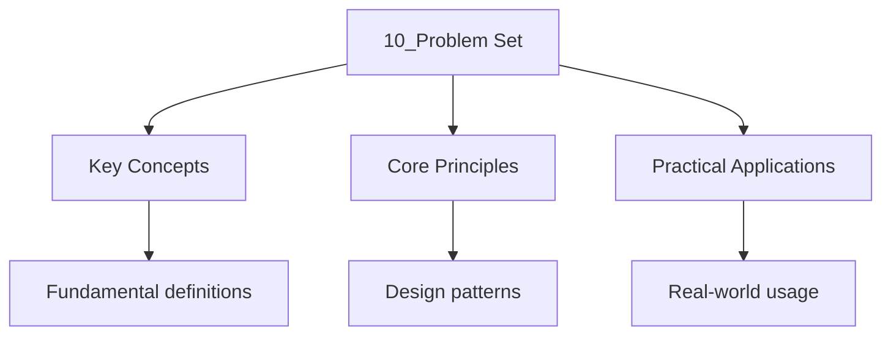

---

date: 2026-07-23T21:57:32+01:00
title: "Problem Set | Computer Science"
tags:
  - Computing
  - University
description: "UNIVERSITY Computing notes: Problem Set. Comprehensive study material with defin Comprehensive A-Level problem set revision notes with definitions and examples."
---

<!-- Breadcrumb Schema for SEO -->
<script type="application/ld+json">
{
  "@context": "https://schema.org",
  "@type": "BreadcrumbList",
  "itemListElement": [{"name": "Home", "url": "https://wyattau.com"}, {"name": "computer-science", "url": "https://computer-science.wyattau.com"}, {"name": "4 Databases", "url": "https://computer-science.wyattau.com/4-databases"}, {"name": "10_problem Set", "url": "https://computer-science.wyattau.com/4-databases/10_problem-set"}]
}
</script>

**Problems 1--3:** Introduction and Data Models

1. Explain the three levels of the ANSI-SPARC architecture with an example. Show how logical data
   independence allows a new column to be added to the conceptual schema without modifying existing
   external views.

2. Compare the relational and graph data models. Give two concrete scenarios where a graph database
   would be preferable to a relational database, explaining why.

3. A university uses a relational database for student records and a document store for course
   materials. Discuss the benefits and challenges of this polyglot persistence approach.

**Problems 4--7:** Relational Model and Algebra

1. Given relation `R(A, B, C, D, E)` with FDs $F = \\{AB \to C, C \to D, D \to E\\}$: (a) Find all
   candidate keys. (b) Compute the attribute closure $\\{A, B\\}^+$. (c) Compute $\\{C\\}^+$ and
   $\\{D\\}^+$.

2. Given `R(A, B, C)` with tuples $\\{(1,2,3), (1,2,4), (1,3,5), (2,2,3), (2,3,4)\\}$ and `S(B, C)`
   with tuples $\\{(2,3), (3,5)\\}$: (a) Compute $\sigma_{B=2}(R)$. (b) Compute $R \bowtie S$. (c)
   Compute $R \div S$.

3. Express the following query in relational algebra: "Find the names of students who have enrolled in at least two courses taught by the same instructor."

4. Prove that the cross product is commutative: $R \times S \equiv S \times R$. Prove that the cross
   product is associative: $(R \times S) \times T \equiv R \times (S \times T)$.

**Problems 8--10:** SQL

1. Write a recursive SQL query that computes the total cost of all parts (direct and indirect)
   required to assemble product `P100`Given a `BOM(parent_part, child_part, quantity)` table.

2. Write a SQL query that, for each department, returns the student with the highest GPA, their GPA,
   and the difference between their GPA and the department average. Use window functions only (no
   subqueries).

3. Consider the Python code:

    ```python
    query = f"DELETE FROM Student WHERE dept = "{dept}' AND gpa < {min_gpa}"
    ```

    (a) Identify the SQL injection vulnerability. (b) Show an input that exploits it. (c) Rewrite
    using parameterised queries.

**Problems 11--14:** Normalisation

1. Given `R(A, B, C, D, E)` with FDs $F = \\{A \to BC, CD \to E, B \to D, E \to A\\}$: (a) Find all
    candidate keys. (b) Determine the highest normal form of $R$. Justify your answer. (c) If $R$ is
    not in BCNF, decompose it into BCNF relations. Verify each decomposition is lossless.

2. Given `R(A, B, C, D)` with FDs $F = \\{A \to B, B \to C, C \to D, D \to A\\}$: (a) Find all
    candidate keys. (b) Decompose into BCNF. Is the decomposition dependency-preserving? (c) Show
    that $R$ is actually already in BCNF.

3. Prove Theorem 4.5: every relation in 4NF is in BCNF.

4. Given `R(A, B, C, D)$ with MVDs $A \twoheadrightarrow B$ and $A \twoheadrightarrow C$, and FD
    $A \to D$: (a) Find all candidate keys. (b) Is $R$ in 4NF? If not, decompose into 4NF.

**Problems 15--16:** Indexing

1. Insert the keys 8, 5, 1, 7, 3, 12, 9, 6 into a B+ tree of order 3 (maximum 2 keys per node).
    Show the tree after each operation that causes a split. How many leaf-level and internal-level
    splits occur in total?

2. A table has 100000 tuples stored in 5000 pages. The buffer pool has 101 pages. Compare the
    estimated I/O cost of answering `SELECT * FROM T WHERE A = 42` using: (a) A full table scan. (b)
    A B+ tree index on $A$ of height 3. (c) A static hash index on $A$ with 500 buckets and average
    chain length 0.4. State any assumptions you make.

**Problems 17--18:** Transaction Management

1. For each schedule below, determine if it is conflict-serialisable by drawing the precedence
    graph. If serialisable, give the equivalent serial order. (a)
    $r_1(A), r_2(A), w_1(A), w_2(A), r_1(B), w_2(B), w_1(B)$ (b)
    $r_1(A), w_1(A), r_2(A), r_2(B), w_2(A), w_2(B), r_1(B), w_1(B)$ (c)
    $r_1(A), w_1(A), r_2(B), w_2(B), r_3(A), w_3(A), r_3(B), w_3(B)$

2. Explain the difference between strict 2PL and rigorous 2PL. Give a schedule that is allowed by
    basic 2PL but not by strict 2PL. Explain why strict 2PL is preferred in practice.

**Problems 19--20:** Distributed Databases

1. Explain the two-phase commit protocol. Describe what happens in each of the following failure
    scenarios: (a) A participant crashes after voting `YES` but before receiving the coordinator's
    decision. (b) The coordinator crashes after sending `COMMIT` to some but not all participants.
    (c) The coordinator crashes after phase 1 (all votes received) but before sending any decision.

2. A distributed key-value store uses $N = 7$ replicas with quorum settings $W = 4$ and $R = 4$.
    (a) Show that any read is guaranteed to see the latest write. (b) What is the maximum number of
    node failures the system can tolerate while still serving both reads and writes? (c) How does
    the system behave during a network partition that isolates 3 nodes from the remaining 4?

**Problems 21--22:** NoSQL and Big Data

1. Compare the consistency models of Apache Cassandra (tunable consistency) and MongoDB (primary
    replica reads). For each, give a concrete scenario where the chosen model causes unexpected
    behaviour, and explain how the application can mitigate it.

2. For the MapReduce word count task on a 10 GB text corpus distributed across 100 nodes, describe
    the flow of data through the map, shuffle, and reduce phases. Estimate the amount of data
    transferred over the network if each mapper emits (word, count) pairs and there are $10^6$
    unique words. How would a combiner reduce network traffic?

<details>
<summary>Selected Solutions and Hints</summary>

**Problem 1.** External level: individual user views. Conceptual level: logical structure
(entity-relationship model). Internal level: physical storage (files, indexes). Logical data
independence: conceptual schema changes (e.g., adding a column) do not require modifying external
views as long as the view definition still maps to the underlying data.

**Problem 4.** (a) Candidate keys: AB, AE, C (since C → D → E, and C with AB closure covers all
attributes). (b) {A,B}$^+$ = {A,B,C,D,E} = all attributes. (c) {C}$^+$ = {C,D,E}, {D}$^+$ = {D,E}.

**Problem 11.** (a) Candidate keys: A, CD, E (each determines all attributes).
(b) Highest normal form: BCNF, since every FD has a superkey LHS.
(c) Already in BCNF — no decomposition needed.

**Problem 15.** B+ tree of order 3: after inserting 8,5,1,7,3,12,9,6, leaf splits occur at
insertions of 7, 3, 12, 9, and 6 (5 splits). Internal splits occur at 7 and 6 (2 splits).

**Problem 18.** Basic 2PL allows locks to be released after the transaction releases its first lock
(shrinking phase). Strict 2PL holds all write locks until commit. Example: schedule
$w_1(A), r_2(A), c_1, c_2$ is allowed by basic 2PL (T1 releases write lock after commit, T2
acquires read lock), but not by strict 2PL (T1 must hold write lock until commit, blocking T2).

**Problem 19.** (a) Coordinator waits for all votes. If a participant crashes after YES but before
receiving decision, coordinator times out and aborts. (b) Coordinator crashes after sending COMMIT
to some participants: surviving participants that received COMMIT will commit; those that did not
will wait and eventually abort. A new coordinator must resolve the ambiguity using a termination
protocol. (c) Coordinator crashes before sending any decision: all participants wait (blocked) until
a new coordinator is elected or the old one recovers.

**Problem 20.** (a) $W + R = 8 > N = 7$, so the read quorum and write quorum overlap by at least 1
node, guaranteeing the read sees the latest write. (b) With quorum $W = 4$, $R = 4$, $N = 7$:
writes can tolerate $N - W = 3$ failures; reads can tolerate $N - R = 3$ failures. During partition
isolating 3 nodes, the side with 4 nodes has quorum; the side with 3 nodes cannot serve reads or
writes.

**Problem 21.** Cassandra uses tunable consistency: the client specifies the consistency level
(ONE, QUORUM, ALL). At QUORUM, a read may return stale data during a partition if only a subset
of replicas respond. Mitigation: use ALL for critical reads. MongoDB uses primary replica reads by
default; stale reads occur during failover if reads are allowed on secondaries. Mitigation: use
`"readPreference": "primary"` for consistency-critical queries.




## Intuition

Database problems teach you to think about data as a structured resource that must be stored efficiently, queried quickly, and modified safely. Normalization is the process of eliminating redundancy, the way a good filing system avoids storing the same information in multiple folders. Query optimization is about finding the fastest path through a maze of tables and indexes, like a librarian who knows exactly which shelf to check rather than scanning every book in the library.

## Common Mistakes

**Confusing normalisation forms:** 1NF eliminates repeating groups. 2NF eliminates partial dependencies. 3NF eliminates transitive dependencies. Don't mix up the progression.

**Forgetting that indexing isn't free:** Indexes speed up reads but slow down writes. Over-indexing degrades write performance. Choose indexes based on query patterns.

**Assuming SQL queries are portable across databases:** While SQL is standard, each database (PostgreSQL, MySQL, Oracle) has proprietary extensions. Don't assume queries work identically everywhere.

## Cross-References

- **[Databases Practice](./14_practice-databases.mdx):** Auto-graded database problems.
- **[Normalisation](./4_normalisation.md):** Schema design and functional dependencies.
- **[Query Optimisation](./7_query-optimisation.md):** Query planning and execution.
